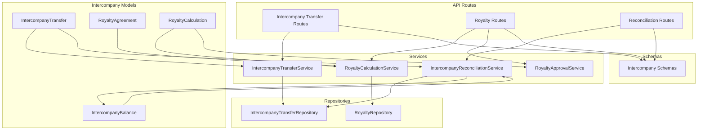
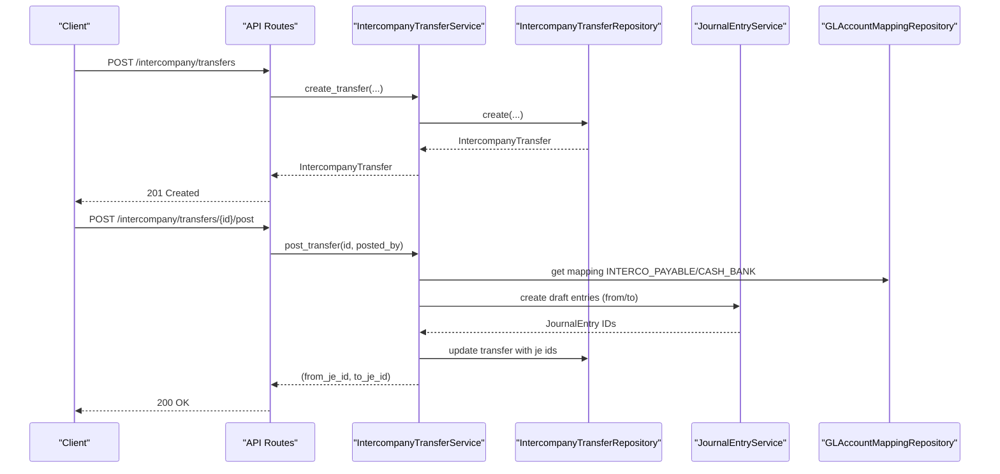
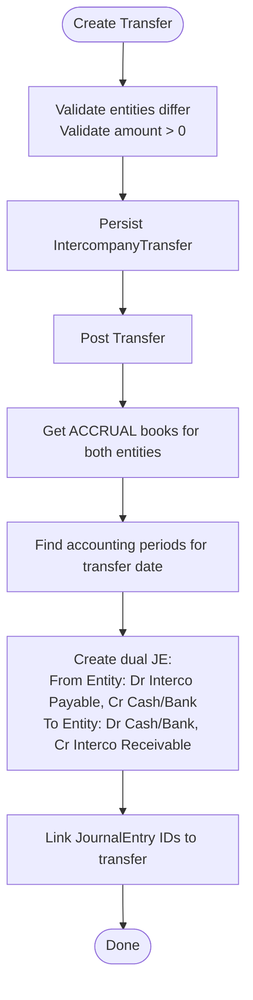
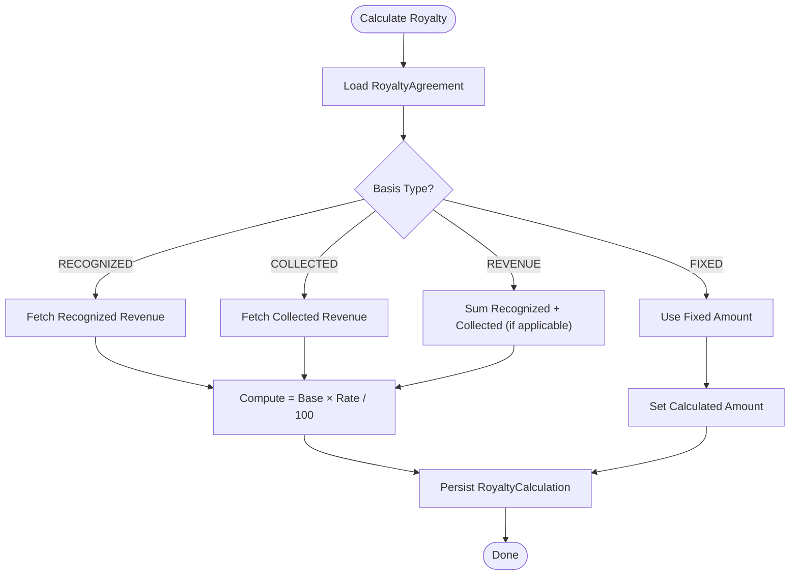
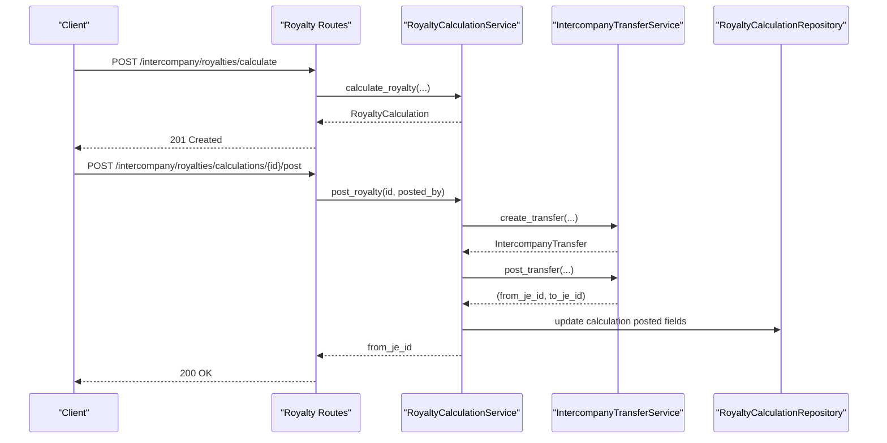
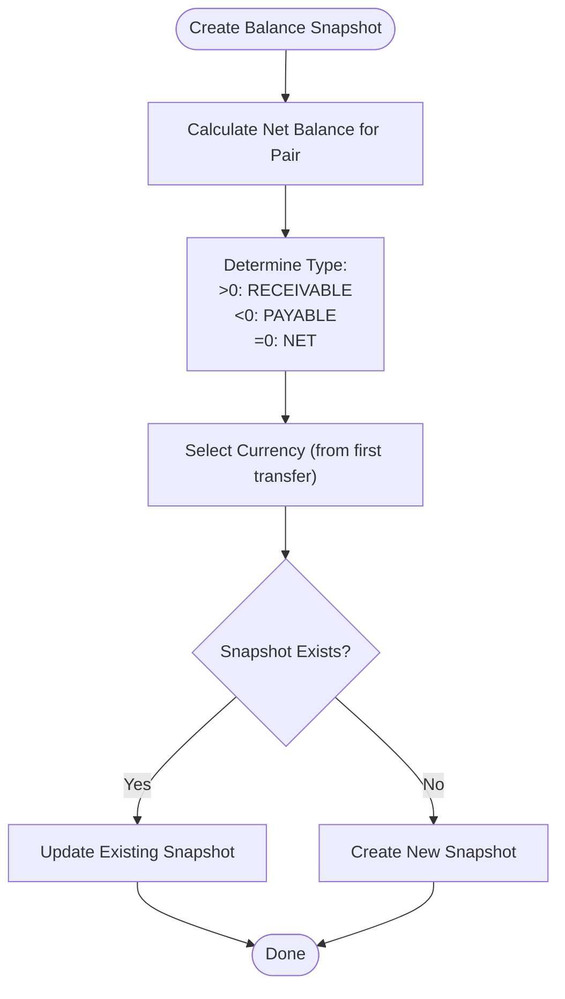
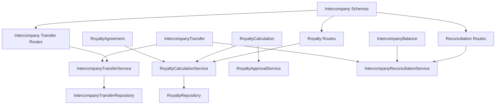

# Intercompany Models

<cite>
**Referenced Files in This Document**
- [intercompany_transfer_model.py](file://app/modules/intercompany/models/intercompany_transfer_model.py)
- [royalty_model.py](file://app/modules/intercompany/models/royalty_model.py)
- [intercompany_balance_model.py](file://app/modules/intercompany/models/intercompany_balance_model.py)
- [intercompany_transfer_service.py](file://app/modules/intercompany/services/intercompany_transfer_service.py)
- [royalty_calculation_service.py](file://app/modules/intercompany/services/royalty_calculation_service.py)
- [intercompany_reconciliation_service.py](file://app/modules/intercompany/services/intercompany_reconciliation_service.py)
- [intercompany_transfer_routes.py](file://app/modules/intercompany/api/routes/intercompany_transfer_routes.py)
- [royalty_routes.py](file://app/modules/intercompany/api/routes/royalty_routes.py)
- [reconciliation_routes.py](file://app/modules/intercompany/api/routes/reconciliation_routes.py)
- [intercompany_schemas.py](file://app/modules/intercompany/schemas/intercompany_schemas.py)
- [intercompany_transfer_repository.py](file://app/modules/intercompany/repositories/intercompany_transfer_repository.py)
- [royalty_repository.py](file://app/modules/intercompany/repositories/royalty_repository.py)
- [royalty_approval_service.py](file://app/modules/intercompany/services/royalty_approval_service.py)
- [fm_schema.sql](file://database/fm_schema.sql)
</cite>

## Table of Contents
1. [Introduction](#introduction)
2. [Project Structure](#project-structure)
3. [Core Components](#core-components)
4. [Architecture Overview](#architecture-overview)
5. [Detailed Component Analysis](#detailed-component-analysis)
6. [Dependency Analysis](#dependency-analysis)
7. [Performance Considerations](#performance-considerations)
8. [Troubleshooting Guide](#troubleshooting-guide)
9. [Conclusion](#conclusion)
10. [Appendices](#appendices)

## Introduction
This document provides comprehensive data model documentation for Intercompany entities within the TrueVow Financial Management system. It covers intercompany transfer processing, royalty calculations, and cross-entity balance tracking models. It details transfer hierarchies, royalty computation logic, and intercompany reconciliation processes. It also documents field definitions, validation rules, business constraints, relationships among legal entities, transfer agreements, and royalty distributions, along with consolidation requirements, profit elimination logic, and intercompany tax implications. Practical examples illustrate transfer creation, royalty calculation, and balance reconciliation, and guidance is provided for data validation, consolidation controls, and intercompany compliance.

## Project Structure
The Intercompany module is organized around three core models:
- IntercompanyTransfer: records cross-entity transfers
- RoyaltyAgreement and RoyaltyCalculation: define and compute intercompany royalty obligations
- IntercompanyBalance: captures balance snapshots for reconciliation

These models are supported by services that orchestrate posting, calculation, and reconciliation, and by repositories and schemas that encapsulate persistence and API contracts.

**Diagram sources**
- [intercompany_transfer_model.py](file://app/modules/intercompany/models/intercompany_transfer_model.py#L16-L59)
- [royalty_model.py](file://app/modules/intercompany/models/royalty_model.py#L27-L98)
- [intercompany_balance_model.py](file://app/modules/intercompany/models/intercompany_balance_model.py#L17-L39)
- [intercompany_transfer_service.py](file://app/modules/intercompany/services/intercompany_transfer_service.py#L17-L232)
- [royalty_calculation_service.py](file://app/modules/intercompany/services/royalty_calculation_service.py#L21-L202)
- [royalty_approval_service.py](file://app/modules/intercompany/services/royalty_approval_service.py#L25-L254)
- [intercompany_reconciliation_service.py](file://app/modules/intercompany/services/intercompany_reconciliation_service.py#L14-L168)
- [intercompany_transfer_routes.py](file://app/modules/intercompany/api/routes/intercompany_transfer_routes.py#L18-L179)
- [royalty_routes.py](file://app/modules/intercompany/api/routes/royalty_routes.py#L29-L269)
- [reconciliation_routes.py](file://app/modules/intercompany/api/routes/reconciliation_routes.py#L12-L109)
- [intercompany_schemas.py](file://app/modules/intercompany/schemas/intercompany_schemas.py#L9-L148)
- [intercompany_transfer_repository.py](file://app/modules/intercompany/repositories/intercompany_transfer_repository.py#L12-L101)
- [royalty_repository.py](file://app/modules/intercompany/repositories/royalty_repository.py#L15-L107)

**Section sources**
- [intercompany_transfer_model.py](file://app/modules/intercompany/models/intercompany_transfer_model.py#L1-L59)
- [royalty_model.py](file://app/modules/intercompany/models/royalty_model.py#L1-L98)
- [intercompany_balance_model.py](file://app/modules/intercompany/models/intercompany_balance_model.py#L1-L39)

## Core Components
This section defines the data models, their fields, constraints, and relationships.

- IntercompanyTransfer
  - Purpose: Records cross-entity transfers (cash, royalty, loan, etc.) between legal entities.
  - Key fields:
    - from_entity_id, to_entity_id: UUID foreign keys to legal_entity
    - transfer_date: Date
    - amount: Numeric(15,2)
    - currency: String(3)
    - transfer_type: String(50) — e.g., CASH, ROYALTY, LOAN
    - description, reference_number: Text/String
    - from_bank_account_id, to_bank_account_id: Optional UUID to treasury_bank_account
    - from_bank_transaction_id, to_bank_transaction_id: Optional UUID to treasury_bank_transaction
    - from_entity_je_id, to_entity_je_id: Optional UUID to journal_entry
    - is_reconciled: Boolean, default False; reconciled_at: Date
  - Constraints:
    - from_entity_id ≠ to_entity_id
    - amount > 0
    - currency is 3-letter ISO code
    - transfer_type is free-text but commonly used values include CASH, ROYALTY, LOAN
  - Relationships:
    - from_entity, to_entity → LegalEntity
    - from_account, to_account → BankAccount
    - from_transaction, to_transaction → BankTransaction
    - from_je, to_je → JournalEntry

- RoyaltyAgreement
  - Purpose: Defines the terms of royalty obligations between two legal entities.
  - Key fields:
    - from_entity_id, to_entity_id: UUID foreign keys to legal_entity
    - agreement_code: Unique string, indexed
    - agreement_name: String
    - basis: Enum — REVENUE, RECOGNIZED_REVENUE, COLLECTED_REVENUE, FIXED
    - rate: Numeric(10,4) — percentage
    - fixed_amount: Numeric(15,2) — required if basis is FIXED
    - effective_from, effective_to: Date
    - currency: String(3)
    - is_active: Boolean, default True
    - description: Text
  - Constraints:
    - agreement_code is unique
    - rate ≥ 0 and ≤ 100
    - fixed_amount ≥ 0 if basis is FIXED
    - effective_to may be null (active indefinitely until)
  - Relationships:
    - from_entity, to_entity → LegalEntity
    - calculations → RoyaltyCalculation (one-to-many)

- RoyaltyCalculation
  - Purpose: Stores computed royalty amounts per period with approval workflow and posting metadata.
  - Key fields:
    - royalty_agreement_id: UUID foreign key to royalty_agreement
    - period_start, period_end: Date
    - revenue_base: Numeric(15,2)
    - recognized_revenue_base: Numeric(15,2)
    - collected_revenue_base: Numeric(15,2)
    - calculated_amount: Numeric(15,2)
    - currency: String(3)
    - status: Enum — DRAFT, PENDING_APPROVAL, APPROVED, POSTED, REJECTED
    - submitted_by, approved_by, rejected_by: UUIDs
    - submitted_at, approved_at, rejected_at: DateTime
    - decision_reason: Text
    - row_version: Integer (optimistic locking)
    - is_posted: Boolean (legacy)
    - posted_at, posted_by: DateTime/UUID (legacy)
    - journal_entry_id: UUID to journal_entry
    - intercompany_transfer_id: UUID to intercompany_transfer
  - Constraints:
    - Unique constraint on (royalty_agreement_id, period_start)
    - status follows a strict workflow
    - row_version increments on updates
  - Relationships:
    - agreement → RoyaltyAgreement
    - journal_entry → JournalEntry
    - transfer → IntercompanyTransfer

- IntercompanyBalance
  - Purpose: Captures a snapshot of intercompany balances between entity pairs as of a specific date.
  - Key fields:
    - from_entity_id, to_entity_id: UUID foreign keys to legal_entity
    - as_of_date: Date
    - balance_type: Enum — NET, RECEIVABLE, PAYABLE
    - balance_amount: Numeric(15,2)
    - currency: String(3)
  - Constraints:
    - Unique constraint on (from_entity_id, to_entity_id, as_of_date, balance_type)
  - Relationships:
    - from_entity, to_entity → LegalEntity

Validation rules and business constraints are enforced at both the ORM model level and via API schemas and service logic.

**Section sources**
- [intercompany_transfer_model.py](file://app/modules/intercompany/models/intercompany_transfer_model.py#L16-L59)
- [royalty_model.py](file://app/modules/intercompany/models/royalty_model.py#L27-L98)
- [intercompany_balance_model.py](file://app/modules/intercompany/models/intercompany_balance_model.py#L17-L39)
- [intercompany_schemas.py](file://app/modules/intercompany/schemas/intercompany_schemas.py#L9-L148)

## Architecture Overview
The Intercompany module follows a layered architecture:
- Models define domain entities and relationships
- Services encapsulate business logic (posting, calculation, reconciliation)
- Repositories abstract persistence
- Routes expose REST APIs with idempotency and approval workflows
- Schemas validate request/response payloads

**Diagram sources**
- [intercompany_transfer_routes.py](file://app/modules/intercompany/api/routes/intercompany_transfer_routes.py#L21-L104)
- [intercompany_transfer_service.py](file://app/modules/intercompany/services/intercompany_transfer_service.py#L28-L220)
- [intercompany_transfer_repository.py](file://app/modules/intercompany/repositories/intercompany_transfer_repository.py#L12-L101)

**Section sources**
- [intercompany_transfer_routes.py](file://app/modules/intercompany/api/routes/intercompany_transfer_routes.py#L18-L179)
- [intercompany_transfer_service.py](file://app/modules/intercompany/services/intercompany_transfer_service.py#L17-L232)

## Detailed Component Analysis

### Intercompany Transfer Processing
Intercompany transfers are created and posted to both entities’ books. The process ensures proper accounting entries and maintains cross-entity linkage.

Key processing steps:
- Creation: Validates entities differ, persists transfer with reconciled flag false
- Posting: Creates dual journal entries (dr/payable, cr/cash) for the from entity and (dr/cash, cr/receivable) for the to entity, linking JE IDs back to the transfer record

**Diagram sources**
- [intercompany_transfer_service.py](file://app/modules/intercompany/services/intercompany_transfer_service.py#L28-L220)
- [intercompany_transfer_model.py](file://app/modules/intercompany/models/intercompany_transfer_model.py#L16-L59)

**Section sources**
- [intercompany_transfer_model.py](file://app/modules/intercompany/models/intercompany_transfer_model.py#L16-L59)
- [intercompany_transfer_service.py](file://app/modules/intercompany/services/intercompany_transfer_service.py#L28-L220)
- [intercompany_transfer_routes.py](file://app/modules/intercompany/api/routes/intercompany_transfer_routes.py#L21-L104)

### Royalty Calculation and Distribution
Royalty calculations are driven by agreement basis and period boundaries. The system supports multiple revenue bases and integrates with AR collections and revenue schedules.

**Diagram sources**
- [royalty_calculation_service.py](file://app/modules/intercompany/services/royalty_calculation_service.py#L31-L104)
- [royalty_model.py](file://app/modules/intercompany/models/royalty_model.py#L27-L98)

Approval workflow and posting:
- Approval: DRAFT → PENDING_APPROVAL (policy-driven) or APPROVED (auto if no approval required)
- Posting: Creates an intercompany transfer of calculated amount, posts JE for both entities, and marks calculation as posted

**Diagram sources**
- [royalty_routes.py](file://app/modules/intercompany/api/routes/royalty_routes.py#L107-L256)
- [royalty_calculation_service.py](file://app/modules/intercompany/services/royalty_calculation_service.py#L160-L202)
- [intercompany_transfer_service.py](file://app/modules/intercompany/services/intercompany_transfer_service.py#L72-L220)

**Section sources**
- [royalty_model.py](file://app/modules/intercompany/models/royalty_model.py#L27-L98)
- [royalty_calculation_service.py](file://app/modules/intercompany/services/royalty_calculation_service.py#L21-L202)
- [royalty_routes.py](file://app/modules/intercompany/api/routes/royalty_routes.py#L32-L269)
- [royalty_approval_service.py](file://app/modules/intercompany/services/royalty_approval_service.py#L25-L254)

### Cross-Entity Balance Tracking and Reconciliation
Balances are computed as net positions between entity pairs up to a given date. Snapshots categorize balances as NET, RECEIVABLE, or PAYABLE.

**Diagram sources**
- [intercompany_reconciliation_service.py](file://app/modules/intercompany/services/intercompany_reconciliation_service.py#L35-L93)
- [intercompany_balance_model.py](file://app/modules/intercompany/models/intercompany_balance_model.py#L17-L39)

Reconciliation operations:
- Reconcile transfers: mark selected transfers as reconciled up to a date
- Generate reconciliation report: summarize counts, balances, and transfer details

**Section sources**
- [intercompany_reconciliation_service.py](file://app/modules/intercompany/services/intercompany_reconciliation_service.py#L14-L168)
- [intercompany_transfer_repository.py](file://app/modules/intercompany/repositories/intercompany_transfer_repository.py#L77-L101)
- [reconciliation_routes.py](file://app/modules/intercompany/api/routes/reconciliation_routes.py#L15-L109)

### API Contracts and Validation
API schemas enforce field constraints and provide typed request/response models.

- IntercompanyTransferCreate: amount > 0, currency length 3, optional bank accounts
- RoyaltyAgreementCreate: rate 0–100, fixed_amount required if basis is FIXED, unique agreement_code
- RoyaltyCalculationRequest: period_start ≤ period_end
- Approval requests include row_version for optimistic locking

**Section sources**
- [intercompany_schemas.py](file://app/modules/intercompany/schemas/intercompany_schemas.py#L9-L148)
- [intercompany_transfer_routes.py](file://app/modules/intercompany/api/routes/intercompany_transfer_routes.py#L21-L104)
- [royalty_routes.py](file://app/modules/intercompany/api/routes/royalty_routes.py#L32-L269)
- [reconciliation_routes.py](file://app/modules/intercompany/api/routes/reconciliation_routes.py#L15-L109)

## Dependency Analysis
The following diagram shows key dependencies among models, services, repositories, and routes.

**Diagram sources**
- [intercompany_transfer_model.py](file://app/modules/intercompany/models/intercompany_transfer_model.py#L16-L59)
- [royalty_model.py](file://app/modules/intercompany/models/royalty_model.py#L27-L98)
- [intercompany_balance_model.py](file://app/modules/intercompany/models/intercompany_balance_model.py#L17-L39)
- [intercompany_transfer_service.py](file://app/modules/intercompany/services/intercompany_transfer_service.py#L17-L232)
- [royalty_calculation_service.py](file://app/modules/intercompany/services/royalty_calculation_service.py#L21-L202)
- [royalty_approval_service.py](file://app/modules/intercompany/services/royalty_approval_service.py#L25-L254)
- [intercompany_reconciliation_service.py](file://app/modules/intercompany/services/intercompany_reconciliation_service.py#L14-L168)
- [intercompany_transfer_routes.py](file://app/modules/intercompany/api/routes/intercompany_transfer_routes.py#L18-L179)
- [royalty_routes.py](file://app/modules/intercompany/api/routes/royalty_routes.py#L29-L269)
- [reconciliation_routes.py](file://app/modules/intercompany/api/routes/reconciliation_routes.py#L12-L109)
- [intercompany_schemas.py](file://app/modules/intercompany/schemas/intercompany_schemas.py#L9-L148)
- [intercompany_transfer_repository.py](file://app/modules/intercompany/repositories/intercompany_transfer_repository.py#L12-L101)
- [royalty_repository.py](file://app/modules/intercompany/repositories/royalty_repository.py#L15-L107)

**Section sources**
- [intercompany_transfer_model.py](file://app/modules/intercompany/models/intercompany_transfer_model.py#L16-L59)
- [royalty_model.py](file://app/modules/intercompany/models/royalty_model.py#L27-L98)
- [intercompany_balance_model.py](file://app/modules/intercompany/models/intercompany_balance_model.py#L17-L39)
- [intercompany_transfer_service.py](file://app/modules/intercompany/services/intercompany_transfer_service.py#L17-L232)
- [royalty_calculation_service.py](file://app/modules/intercompany/services/royalty_calculation_service.py#L21-L202)
- [royalty_approval_service.py](file://app/modules/intercompany/services/royalty_approval_service.py#L25-L254)
- [intercompany_reconciliation_service.py](file://app/modules/intercompany/services/intercompany_reconciliation_service.py#L14-L168)
- [intercompany_transfer_routes.py](file://app/modules/intercompany/api/routes/intercompany_transfer_routes.py#L18-L179)
- [royalty_routes.py](file://app/modules/intercompany/api/routes/royalty_routes.py#L29-L269)
- [reconciliation_routes.py](file://app/modules/intercompany/api/routes/reconciliation_routes.py#L12-L109)
- [intercompany_schemas.py](file://app/modules/intercompany/schemas/intercompany_schemas.py#L9-L148)
- [intercompany_transfer_repository.py](file://app/modules/intercompany/repositories/intercompany_transfer_repository.py#L12-L101)
- [royalty_repository.py](file://app/modules/intercompany/repositories/royalty_repository.py#L15-L107)

## Performance Considerations
- Indexing: Models include strategic indexes on foreign keys and frequently queried fields (e.g., legal_entity_id, transfer_date, agreement_code).
- Aggregation queries: Balance and calculation services aggregate across periods and payments; ensure appropriate indexing on date ranges and entity filters.
- Idempotency: Posting endpoints use idempotency keys scoped to legal entity and book to prevent duplicate postings.
- Batch reconciliation: Reconciliation routes support bulk reconciliation and reporting; pagination and limits are enforced in repositories and routes.

[No sources needed since this section provides general guidance]

## Troubleshooting Guide
Common issues and resolutions:
- Not found errors: Occur when entities, books, or periods are missing for posting; verify legal_entity existence and ACCRUAL book availability.
- Validation errors: Raised for invalid amounts, currencies, or mismatched entities; confirm schema constraints and request payloads.
- Approval workflow errors: Submissions or approvals fail if statuses are incorrect or SoD rules are violated; check row_version and policy configurations.
- Reconciliation mismatches: Ensure transfers are linked to correct entities and dates; use reconciliation report to identify discrepancies.

**Section sources**
- [intercompany_transfer_service.py](file://app/modules/intercompany/services/intercompany_transfer_service.py#L42-L52)
- [intercompany_reconciliation_service.py](file://app/modules/intercompany/services/intercompany_reconciliation_service.py#L94-L121)
- [royalty_approval_service.py](file://app/modules/intercompany/services/royalty_approval_service.py#L54-L58)
- [intercompany_transfer_routes.py](file://app/modules/intercompany/api/routes/intercompany_transfer_routes.py#L42-L45)
- [royalty_routes.py](file://app/modules/intercompany/api/routes/royalty_routes.py#L121-L124)

## Conclusion
The Intercompany module provides robust models and services for managing cross-entity transfers, royalty computations, and reconciliation. The design emphasizes clear separation of concerns, strong validation, and compliance-ready workflows including approvals and audit logging. The APIs enable efficient creation, posting, and reporting of intercompany activities, while the models support accurate consolidation and profit elimination logic.

[No sources needed since this section summarizes without analyzing specific files]

## Appendices

### Consolidation and Profit Elimination Logic
- Intercompany transfers create reciprocal balances that must be eliminated during consolidation.
- Posting creates dual journal entries with intercompany accounts; elimination entries reverse these in consolidated books.
- Balance snapshots assist in identifying residual balances requiring adjustment entries.

[No sources needed since this section provides general guidance]

### Intercompany Tax Implications
- Transfer pricing policies and local tax regulations govern intercompany pricing and documentation.
- Royalty calculations should align with arm’s length principles and supporting agreements.
- Proper documentation and transfer pricing studies are recommended for compliance.

[No sources needed since this section provides general guidance]

### Example Workflows

- Create Intercompany Transfer
  - Endpoint: POST /intercompany/transfers
  - Fields: from_entity_id, to_entity_id, transfer_date, amount, currency, transfer_type, optional bank accounts
  - Result: IntercompanyTransfer persisted; is_reconciled remains false

- Post Intercompany Transfer
  - Endpoint: POST /intercompany/transfers/{id}/post
  - Action: Creates dual journal entries and links JE IDs to the transfer

- Calculate Royalty
  - Endpoint: POST /intercompany/royalties/calculate
  - Inputs: agreement_id, period_start, period_end
  - Output: RoyaltyCalculation with computed amount and revenue bases

- Post Royalty Calculation
  - Endpoint: POST /intercompany/royalties/calculations/{id}/post
  - Action: Creates intercompany transfer and posts JE for both entities

- Reconcile and Report
  - Create balance snapshot: POST /intercompany/reconciliation/balance-snapshot
  - Reconcile transfers: POST /intercompany/reconciliation/reconcile
  - Generate report: GET /intercompany/reconciliation/report

**Section sources**
- [intercompany_transfer_routes.py](file://app/modules/intercompany/api/routes/intercompany_transfer_routes.py#L21-L104)
- [royalty_routes.py](file://app/modules/intercompany/api/routes/royalty_routes.py#L107-L256)
- [reconciliation_routes.py](file://app/modules/intercompany/api/routes/reconciliation_routes.py#L15-L109)