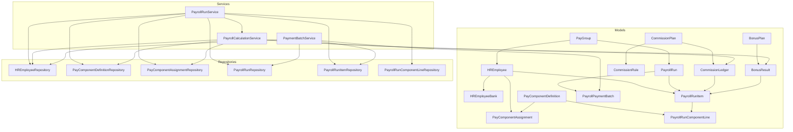
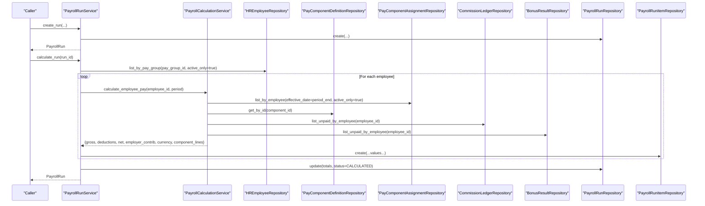
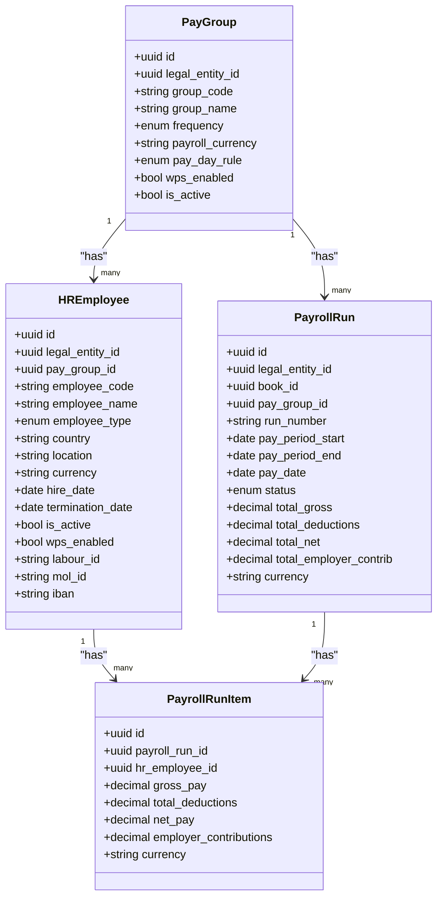
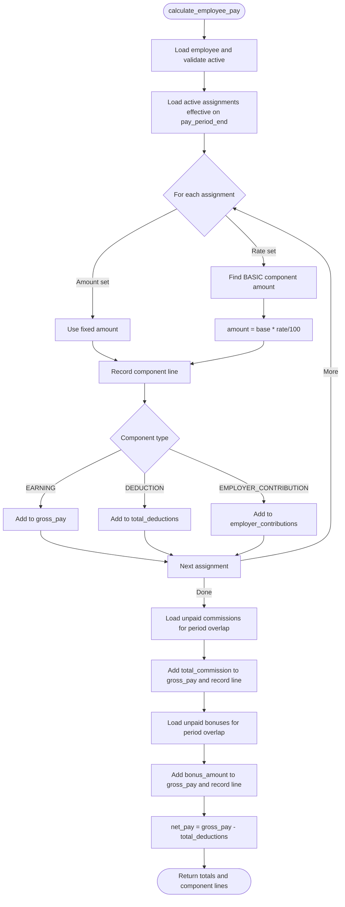
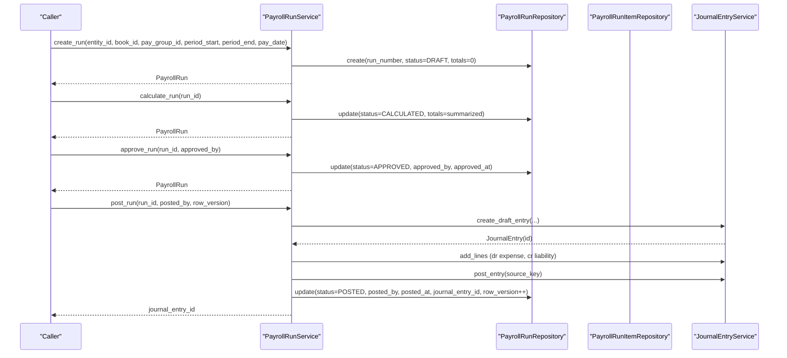
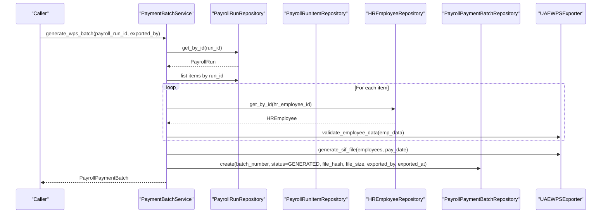
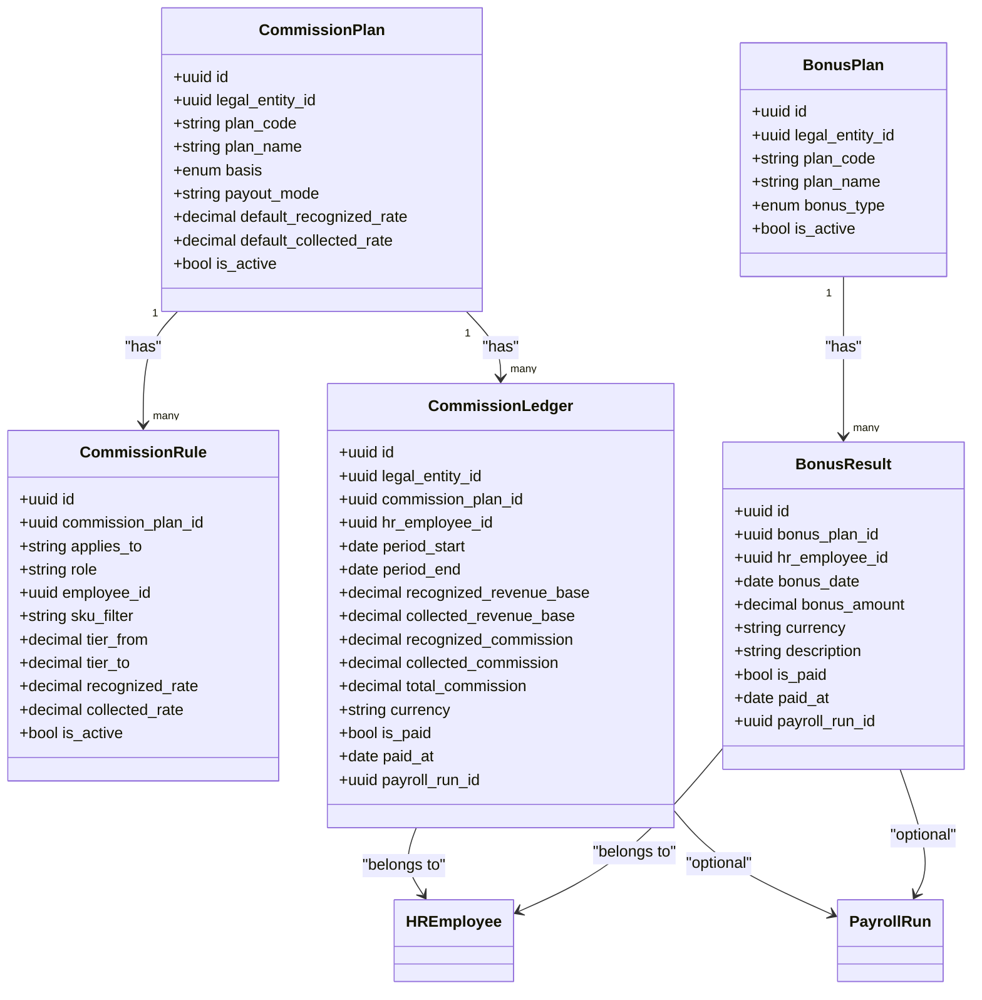
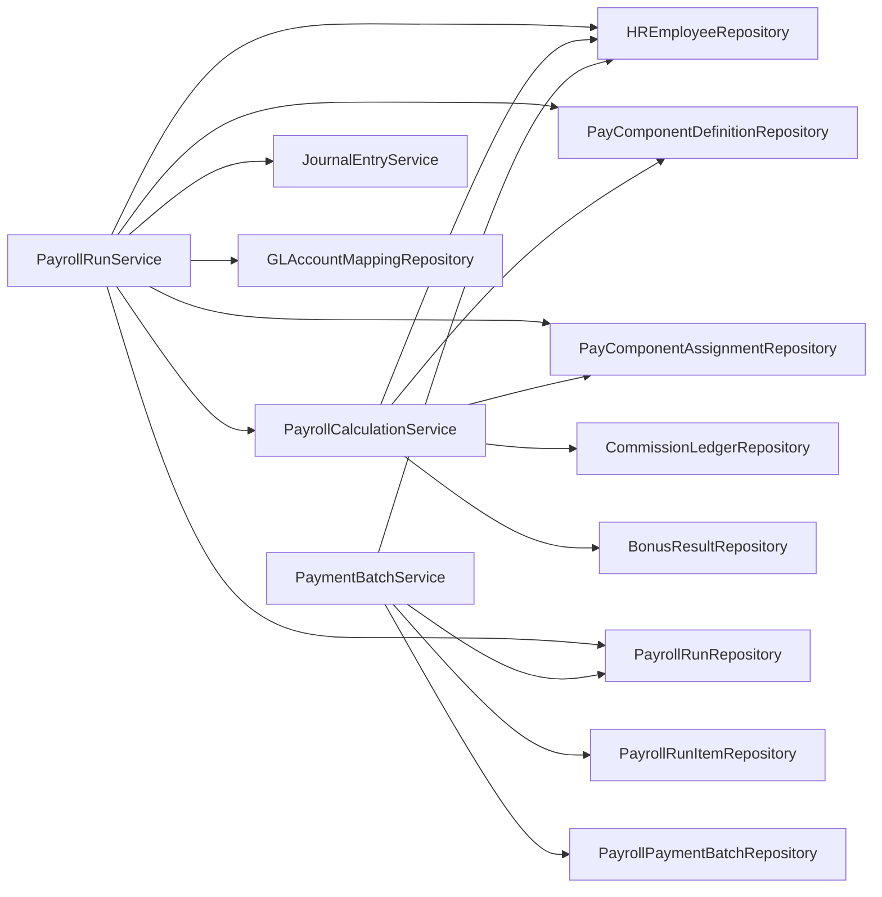

# Payroll Models

<cite>
**Referenced Files in This Document**
- [employee_model.py](file://app/modules/payroll/models/employee_model.py)
- [pay_component_model.py](file://app/modules/payroll/models/pay_component_model.py)
- [pay_group_model.py](file://app/modules/payroll/models/pay_group_model.py)
- [payroll_run_model.py](file://app/modules/payroll/models/payroll_run_model.py)
- [payment_batch_model.py](file://app/modules/payroll/models/payment_batch_model.py)
- [commission_model.py](file://app/modules/payroll/models/commission_model.py)
- [bonus_model.py](file://app/modules/payroll/models/bonus_model.py)
- [payroll_calculation_service.py](file://app/modules/payroll/services/payroll_calculation_service.py)
- [payroll_run_service.py](file://app/modules/payroll/services/payroll_run_service.py)
- [payment_batch_service.py](file://app/modules/payroll/services/payment_batch_service.py)
- [employee_repository.py](file://app/modules/payroll/repositories/employee_repository.py)
- [pay_component_repository.py](file://app/modules/payroll/repositories/pay_component_repository.py)
- [payroll_run_repository.py](file://app/modules/payroll/repositories/payroll_run_repository.py)
</cite>

## Table of Contents
1. [Introduction](#introduction)
2. [Project Structure](#project-structure)
3. [Core Components](#core-components)
4. [Architecture Overview](#architecture-overview)
5. [Detailed Component Analysis](#detailed-component-analysis)
6. [Dependency Analysis](#dependency-analysis)
7. [Performance Considerations](#performance-considerations)
8. [Troubleshooting Guide](#troubleshooting-guide)
9. [Conclusion](#conclusion)
10. [Appendices](#appendices)

## Introduction
This document describes the Payroll data models and related services that power employee records, compensation components, payroll runs, payment batches, and special pay types (commissions and bonuses). It explains field definitions, validation rules, business constraints, and relationships among entities. It also documents compensation calculation algorithms, tax and deduction logic, benefit integration, and batch processing workflows. Examples illustrate payroll run creation, payment processing, and bonus/commission calculations.

## Project Structure
The Payroll domain is organized into:
- Models: SQLAlchemy ORM definitions for entities and enumerations
- Services: Business logic for calculations, run lifecycle, and batch generation
- Repositories: Data access layer for CRUD and queries
- Plugins: Exporters for regulatory formats (e.g., WPS SIF)

**Diagram sources**
- [employee_model.py](file://app/modules/payroll/models/employee_model.py#L16-L75)
- [pay_component_model.py](file://app/modules/payroll/models/pay_component_model.py#L38-L88)
- [pay_group_model.py](file://app/modules/payroll/models/pay_group_model.py#L24-L48)
- [payroll_run_model.py](file://app/modules/payroll/models/payroll_run_model.py#L23-L117)
- [payment_batch_model.py](file://app/modules/payroll/models/payment_batch_model.py#L18-L42)
- [commission_model.py](file://app/modules/payroll/models/commission_model.py#L17-L101)
- [bonus_model.py](file://app/modules/payroll/models/bonus_model.py#L16-L63)
- [payroll_calculation_service.py](file://app/modules/payroll/services/payroll_calculation_service.py#L22-L138)
- [payroll_run_service.py](file://app/modules/payroll/services/payroll_run_service.py#L25-L416)
- [payment_batch_service.py](file://app/modules/payroll/services/payment_batch_service.py#L16-L133)
- [employee_repository.py](file://app/modules/payroll/repositories/employee_repository.py#L10-L53)
- [pay_component_repository.py](file://app/modules/payroll/repositories/pay_component_repository.py#L15-L86)
- [payroll_run_repository.py](file://app/modules/payroll/repositories/payroll_run_repository.py#L16-L107)

**Section sources**
- [employee_model.py](file://app/modules/payroll/models/employee_model.py#L1-L75)
- [pay_component_model.py](file://app/modules/payroll/models/pay_component_model.py#L1-L88)
- [pay_group_model.py](file://app/modules/payroll/models/pay_group_model.py#L1-L48)
- [payroll_run_model.py](file://app/modules/payroll/models/payroll_run_model.py#L1-L117)
- [payment_batch_model.py](file://app/modules/payroll/models/payment_batch_model.py#L1-L42)
- [commission_model.py](file://app/modules/payroll/models/commission_model.py#L1-L101)
- [bonus_model.py](file://app/modules/payroll/models/bonus_model.py#L1-L63)
- [payroll_calculation_service.py](file://app/modules/payroll/services/payroll_calculation_service.py#L1-L138)
- [payroll_run_service.py](file://app/modules/payroll/services/payroll_run_service.py#L1-L416)
- [payment_batch_service.py](file://app/modules/payroll/services/payment_batch_service.py#L1-L133)
- [employee_repository.py](file://app/modules/payroll/repositories/employee_repository.py#L1-L53)
- [pay_component_repository.py](file://app/modules/payroll/repositories/pay_component_repository.py#L1-L86)
- [payroll_run_repository.py](file://app/modules/payroll/repositories/payroll_run_repository.py#L1-L107)

## Core Components
This section defines each Payroll entity, its fields, constraints, and relationships.

- Employee (HREmployee)
  - Purpose: Master HR record for workers and contractors
  - Key fields: legal_entity_id, employee_code (unique), employee_name, employee_type, country, location, pay_group_id, currency, hire_date, termination_date, is_active, plus WPS flags and IDs
  - Constraints: employee_code is unique; country/location support multi-entity jurisdictions; WPS-enabled fields for UAE
  - Relationships: belongs to LegalEntity; belongs to PayGroup; has many HREmployeeBank; has many PayComponentAssignment; has many PayrollRunItem; has many CommissionLedger
  - Validation: is_active checked during calculation; employee existence validated

- Employee Bank (HREmployeeBank)
  - Purpose: Per-employee bank accounts
  - Key fields: bank_name, account_number, iban, swift_code, is_primary
  - Constraints: unique constraint on (hr_employee_id, is_primary); enforces single primary bank per employee
  - Relationships: belongs to HREmployee

- Pay Group (PayGroup)
  - Purpose: Defines payroll grouping and processing rules
  - Key fields: group_code (unique), group_name, frequency, payroll_currency, pay_day_rule, wps_enabled, is_active
  - Enums: PayFrequency (MONTHLY, BIWEEKLY, WEEKLY), PayDayRule (LAST_BUSINESS_DAY, FIRST_BUSINESS_DAY, FIXED_DAY, MONTHLY_DAY_5)
  - Relationships: belongs to LegalEntity; has many HREmployee; has many PayrollRun

- Pay Component Definition (PayComponentDefinition)
  - Purpose: Standard pay component catalog (earnings, deductions, employer contributions)
  - Key fields: legal_entity_id, component_code (unique per entity), component_name, component_type, is_taxable, affects_wps_net, gl_map_key, is_active
  - Enums: ComponentType (EARNING, DEDUCTION, EMPLOYER_CONTRIBUTION), ComponentCode (standardized codes)
  - Constraints: unique constraint on (legal_entity_id, component_code)
  - Relationships: belongs to LegalEntity; has many PayComponentAssignment; has many PayrollRunComponentLine

- Pay Component Assignment (PayComponentAssignment)
  - Purpose: Assigns component amounts/rates to employees
  - Key fields: hr_employee_id, pay_component_id, amount, rate, is_active, effective_from, effective_to
  - Constraints: unique constraint on (hr_employee_id, pay_component_id)
  - Effective-dated filtering: assignments considered only if effective_from ≤ evaluation date ≤ effective_to
  - Relationships: belongs to HREmployee; belongs to PayComponentDefinition

- Payroll Run (PayrollRun)
  - Purpose: Periodic processing container
  - Key fields: legal_entity_id, book_id, pay_group_id, run_number (unique), pay_period_start, pay_period_end, pay_date, status, totals (gross, deductions, net, employer_contrib), currency, row_version, approval and posting metadata, notes
  - Enums: PayrollRunStatus (DRAFT, CALCULATED, PENDING_APPROVAL, APPROVED, POSTED, PAID, CLOSED, REJECTED, REVERSED)
  - Relationships: belongs to LegalEntity, Book, PayGroup; has many PayrollRunItem; has many PayrollPaymentBatch; links to JournalEntry

- Payroll Run Item (PayrollRunItem)
  - Purpose: Per-employee result within a run
  - Key fields: payroll_run_id, hr_employee_id, gross_pay, total_deductions, net_pay, employer_contributions, currency
  - Constraints: unique constraint on (payroll_run_id, hr_employee_id)
  - Relationships: belongs to PayrollRun; belongs to HREmployee; has many PayrollRunComponentLine

- Payroll Run Component Line (PayrollRunComponentLine)
  - Purpose: Detailed breakdown of components per run item
  - Key fields: payroll_run_item_id, pay_component_id, amount, currency, calculation_note
  - Relationships: belongs to PayrollRunItem; belongs to PayComponentDefinition

- Payment Batch (PayrollPaymentBatch)
  - Purpose: Export container for payments (e.g., WPS SIF)
  - Key fields: payroll_run_id, batch_number (unique), export_type, status, file_path, file_hash, file_size, exported_at, exported_by, metadata
  - Enums: BatchStatus (GENERATED, EXPORTED, SUBMITTED, PROCESSED, FAILED)
  - Relationships: belongs to PayrollRun

- Commission Plan (CommissionPlan)
  - Purpose: Defines commission policy (basis, rates, payout mode)
  - Key fields: legal_entity_id, plan_code (unique), plan_name, basis (RECOGNIZED, COLLECTED, HYBRID), payout_mode (PAYROLL or AP), default_recognized_rate, default_collected_rate, is_active
  - Relationships: belongs to LegalEntity; has many CommissionRule; has many CommissionLedger

- Commission Rule (CommissionRule)
  - Purpose: Tiered rules with filters
  - Key fields: commission_plan_id, applies_to (ROLE, EMPLOYEE, TEAM), role, employee_id, sku_filter (JSON), tier_from, tier_to, recognized_rate, collected_rate, is_active
  - Relationships: belongs to CommissionPlan; optionally belongs to HREmployee

- Commission Ledger (CommissionLedger)
  - Purpose: Accrues commissions per period
  - Key fields: legal_entity_id, commission_plan_id, hr_employee_id, period_start, period_end, recognized_revenue_base, collected_revenue_base, recognized_commission, collected_commission, total_commission, currency, is_paid, paid_at, payroll_run_id
  - Relationships: belongs to LegalEntity; belongs to CommissionPlan; belongs to HREmployee; optionally belongs to PayrollRun

- Bonus Plan (BonusPlan)
  - Purpose: Defines bonus program
  - Key fields: legal_entity_id, plan_code (unique), plan_name, bonus_type (ONE_TIME, PERIODIC), is_active
  - Relationships: belongs to LegalEntity; has many BonusResult

- Bonus Result (BonusResult)
  - Purpose: Records awarded bonuses
  - Key fields: bonus_plan_id, hr_employee_id, bonus_date, bonus_amount, currency, description, is_paid, paid_at, payroll_run_id
  - Relationships: belongs to BonusPlan; belongs to HREmployee; optionally belongs to PayrollRun

**Section sources**
- [employee_model.py](file://app/modules/payroll/models/employee_model.py#L16-L75)
- [pay_component_model.py](file://app/modules/payroll/models/pay_component_model.py#L38-L88)
- [pay_group_model.py](file://app/modules/payroll/models/pay_group_model.py#L24-L48)
- [payroll_run_model.py](file://app/modules/payroll/models/payroll_run_model.py#L23-L117)
- [payment_batch_model.py](file://app/modules/payroll/models/payment_batch_model.py#L18-L42)
- [commission_model.py](file://app/modules/payroll/models/commission_model.py#L17-L101)
- [bonus_model.py](file://app/modules/payroll/models/bonus_model.py#L16-L63)

## Architecture Overview
The Payroll subsystem orchestrates data models with services and repositories. The calculation service aggregates component assignments, commissions, and bonuses per employee. The run service coordinates run creation, calculation, approval, posting (journal entries), and reversal. The batch service generates export files (e.g., WPS SIF) from posted runs.

**Diagram sources**
- [payroll_run_service.py](file://app/modules/payroll/services/payroll_run_service.py#L38-L147)
- [payroll_calculation_service.py](file://app/modules/payroll/services/payroll_calculation_service.py#L33-L124)
- [employee_repository.py](file://app/modules/payroll/repositories/employee_repository.py#L40-L53)
- [pay_component_repository.py](file://app/modules/payroll/repositories/pay_component_repository.py#L61-L86)
- [payroll_run_repository.py](file://app/modules/payroll/repositories/payroll_run_repository.py#L64-L92)

## Detailed Component Analysis

### Employee and Pay Group Relationships
- Employees belong to a PayGroup and a LegalEntity. PayGroups define currency, frequency, and pay-day rules. Employees carry jurisdiction-specific fields (e.g., WPS-enabled for UAE).
- PayGroups link to PayrollRuns; PayrollRuns link to PayrollRunItems; PayrollRunItems link to Employees.

**Diagram sources**
- [pay_group_model.py](file://app/modules/payroll/models/pay_group_model.py#L24-L48)
- [employee_model.py](file://app/modules/payroll/models/employee_model.py#L16-L75)
- [payroll_run_model.py](file://app/modules/payroll/models/payroll_run_model.py#L23-L95)

**Section sources**
- [pay_group_model.py](file://app/modules/payroll/models/pay_group_model.py#L24-L48)
- [employee_model.py](file://app/modules/payroll/models/employee_model.py#L16-L75)
- [payroll_run_model.py](file://app/modules/payroll/models/payroll_run_model.py#L23-L95)

### Compensation Components and Calculations
- Component types: EARNING, DEDUCTION, EMPLOYER_CONTRIBUTION
- Component codes: standardized codes for BASIC, HOUSING, TRANSPORT, OVERTIME, COMMISSION, BONUS, REIMBURSEMENT, TAX_WITHHOLDING, BENEFIT_EMP, LOAN_DEDUCT, ADVANCE_DEDUCT, GPSSA_EMPR, EOBI_EMPR, SOCIALSEC_EMPR
- Assignments: fixed amount or rate-based; rate-based calculations derive base from BASIC component when present
- Commissions and bonuses: unpaid entries included in run totals during calculation

**Diagram sources**
- [payroll_calculation_service.py](file://app/modules/payroll/services/payroll_calculation_service.py#L33-L138)
- [pay_component_model.py](file://app/modules/payroll/models/pay_component_model.py#L10-L36)
- [pay_component_repository.py](file://app/modules/payroll/repositories/pay_component_repository.py#L61-L86)

**Section sources**
- [payroll_calculation_service.py](file://app/modules/payroll/services/payroll_calculation_service.py#L33-L138)
- [pay_component_model.py](file://app/modules/payroll/models/pay_component_model.py#L10-L36)
- [pay_component_repository.py](file://app/modules/payroll/repositories/pay_component_repository.py#L61-L86)

### Payroll Run Lifecycle and Posting
- Creation: Validates pay group and entity ownership, generates run_number, initializes totals and status
- Calculation: Iterates active employees in the pay group, computes per-employee totals, persists items and component lines, updates run totals and status
- Approval: Transitions to APPROVED with approver metadata
- Posting: Creates journal entry debiting expense and crediting liability accounts; increments row_version; marks run as POSTED
- Reversal: Creates reversal journal entry and marks run as REVERSED

**Diagram sources**
- [payroll_run_service.py](file://app/modules/payroll/services/payroll_run_service.py#L38-L314)
- [payroll_run_repository.py](file://app/modules/payroll/repositories/payroll_run_repository.py#L16-L62)

**Section sources**
- [payroll_run_service.py](file://app/modules/payroll/services/payroll_run_service.py#L38-L314)
- [payroll_run_repository.py](file://app/modules/payroll/repositories/payroll_run_repository.py#L16-L62)

### Payment Batch Generation (WPS SIF)
- Validates run status is POSTED
- Gathers run items and eligible employees (wps_enabled)
- Validates employee data via exporter plugin
- Generates SIF content, computes hash, creates batch record, sets status GENERATED

**Diagram sources**
- [payment_batch_service.py](file://app/modules/payroll/services/payment_batch_service.py#L27-L96)
- [payment_batch_model.py](file://app/modules/payroll/models/payment_batch_model.py#L18-L42)

**Section sources**
- [payment_batch_service.py](file://app/modules/payroll/services/payment_batch_service.py#L27-L96)
- [payment_batch_model.py](file://app/modules/payroll/models/payment_batch_model.py#L18-L42)

### Special Pay Types: Commissions and Bonuses
- Commission Plan: Basis (RECOGNIZED, COLLECTED, HYBRID), default rates, payout mode (PAYROLL or AP)
- Commission Rule: Tiered rates with filters (role, employee, SKU)
- Commission Ledger: Accrues recognized and collected amounts per period; can link to a PayrollRun when paid via payroll
- Bonus Plan: One-time or periodic
- Bonus Result: Awards per employee with paid flag and optional payroll linkage

**Diagram sources**
- [commission_model.py](file://app/modules/payroll/models/commission_model.py#L17-L101)
- [bonus_model.py](file://app/modules/payroll/models/bonus_model.py#L16-L63)

**Section sources**
- [commission_model.py](file://app/modules/payroll/models/commission_model.py#L17-L101)
- [bonus_model.py](file://app/modules/payroll/models/bonus_model.py#L16-L63)

## Dependency Analysis
- Cohesion: Models encapsulate domain semantics; services orchestrate workflows; repositories abstract persistence
- Coupling: Services depend on repositories; calculation service depends on component and ledger repositories; run service depends on calculation service and GL services
- External integrations: GL mapping repository for account codes; exporter plugin for WPS SIF generation

**Diagram sources**
- [payroll_run_service.py](file://app/modules/payroll/services/payroll_run_service.py#L25-L37)
- [payroll_calculation_service.py](file://app/modules/payroll/services/payroll_calculation_service.py#L22-L32)
- [payment_batch_service.py](file://app/modules/payroll/services/payment_batch_service.py#L16-L26)
- [payroll_run_repository.py](file://app/modules/payroll/repositories/payroll_run_repository.py#L16-L107)
- [employee_repository.py](file://app/modules/payroll/repositories/employee_repository.py#L10-L53)
- [pay_component_repository.py](file://app/modules/payroll/repositories/pay_component_repository.py#L15-L86)

**Section sources**
- [payroll_run_service.py](file://app/modules/payroll/services/payroll_run_service.py#L25-L37)
- [payroll_calculation_service.py](file://app/modules/payroll/services/payroll_calculation_service.py#L22-L32)
- [payment_batch_service.py](file://app/modules/payroll/services/payment_batch_service.py#L16-L26)
- [payroll_run_repository.py](file://app/modules/payroll/repositories/payroll_run_repository.py#L16-L107)
- [employee_repository.py](file://app/modules/payroll/repositories/employee_repository.py#L10-L53)
- [pay_component_repository.py](file://app/modules/payroll/repositories/pay_component_repository.py#L15-L86)

## Performance Considerations
- Indexes: Many foreign keys and frequently queried fields are indexed (e.g., employee_code, run_number, pay_group_id, hr_employee_id)
- Aggregation: Run totals computed after iterating employees; consider batching writes and minimizing repeated lookups
- Effective-dated queries: Assignment filtering by effective dates uses composite conditions; ensure appropriate indexing on effective_from/effective_to
- Export generation: WPS batch generation iterates run items and employees; pre-fetch data to reduce round-trips

[No sources needed since this section provides general guidance]

## Troubleshooting Guide
Common issues and resolutions:
- Employee not found or inactive: Calculation raises validation errors; ensure employee exists and is active
- Invalid pay group or mismatched entity: Run creation validates pay group ownership; confirm entity_id matches pay group’s legal_entity_id
- Status transitions: Posting requires APPROVED; calculating requires DRAFT; reversing requires POSTED with a journal entry
- WPS batch generation: Requires POSTED run and at least one valid WPS-enabled employee; otherwise validation errors are raised
- GL mapping missing: Posting fails if required account mappings are not configured; verify mappings for EXP_PAYROLL, LIAB_PAYROLL, EXP_EMPLOYER_CONTRIB

**Section sources**
- [payroll_calculation_service.py](file://app/modules/payroll/services/payroll_calculation_service.py#L40-L46)
- [payroll_run_service.py](file://app/modules/payroll/services/payroll_run_service.py#L48-L55)
- [payroll_run_service.py](file://app/modules/payroll/services/payroll_run_service.py#L178-L189)
- [payroll_run_service.py](file://app/modules/payroll/services/payroll_run_service.py#L333-L342)
- [payment_batch_service.py](file://app/modules/payroll/services/payment_batch_service.py#L33-L39)
- [payment_batch_service.py](file://app/modules/payroll/services/payment_batch_service.py#L66-L68)

## Conclusion
The Payroll subsystem models employees, pay groups, compensation components, payroll runs, payment batches, and special pay types comprehensively. Services enforce business rules, handle calculations, manage run lifecycles, and generate regulatory exports. The design supports multi-entity, multi-jurisdiction processing with explicit validation and constraints.

[No sources needed since this section summarizes without analyzing specific files]

## Appendices

### Field Definitions and Validation Rules

- HREmployee
  - employee_code: unique, required
  - is_active: required, checked during calculation
  - WPS fields: labour_id, mol_id, iban (conditional on wps_enabled)
  - Country/location: jurisdiction support

- PayComponentDefinition
  - component_code: unique per entity, required
  - is_taxable, affects_wps_net: flags for tax and WPS net computation
  - gl_map_key: GL mapping key

- PayComponentAssignment
  - amount or rate: mutually exclusive per assignment; rate derived from BASIC when present
  - effective_from/effective_to: effective-dated filtering

- PayrollRun
  - run_number: unique, auto-generated
  - status: lifecycle-controlled
  - totals: validated sums
  - row_version: optimistic concurrency

- PayrollRunItem
  - unique constraint: (payroll_run_id, hr_employee_id)

- PayrollRunComponentLine
  - calculation_note: optional audit trail

- PayrollPaymentBatch
  - batch_number: unique
  - status: lifecycle-controlled
  - file_hash/file_size: integrity and metadata

- CommissionPlan
  - basis: RECOGNIZED/COLLECTED/HYBRID
  - payout_mode: PAYROLL or AP

- BonusPlan
  - bonus_type: ONE_TIME or PERIODIC

**Section sources**
- [employee_model.py](file://app/modules/payroll/models/employee_model.py#L16-L75)
- [pay_component_model.py](file://app/modules/payroll/models/pay_component_model.py#L38-L88)
- [payroll_run_model.py](file://app/modules/payroll/models/payroll_run_model.py#L23-L117)
- [payment_batch_model.py](file://app/modules/payroll/models/payment_batch_model.py#L18-L42)
- [commission_model.py](file://app/modules/payroll/models/commission_model.py#L17-L101)
- [bonus_model.py](file://app/modules/payroll/models/bonus_model.py#L16-L63)