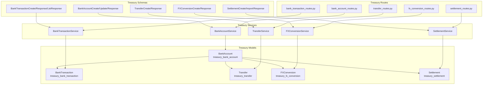
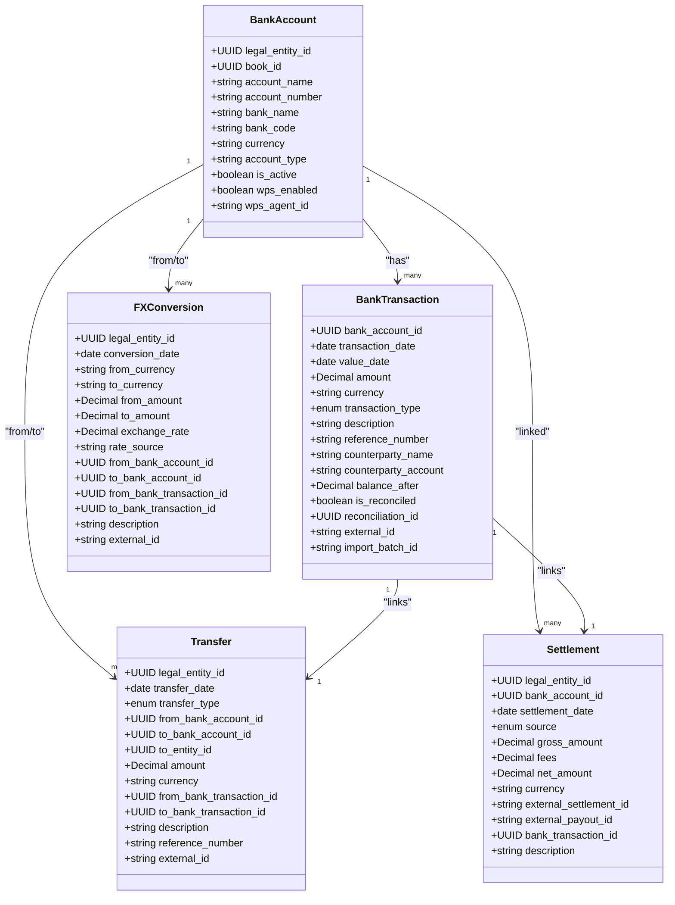
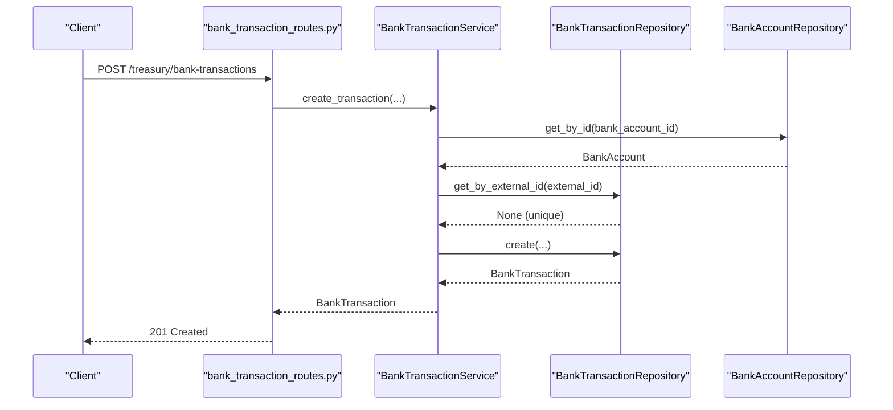
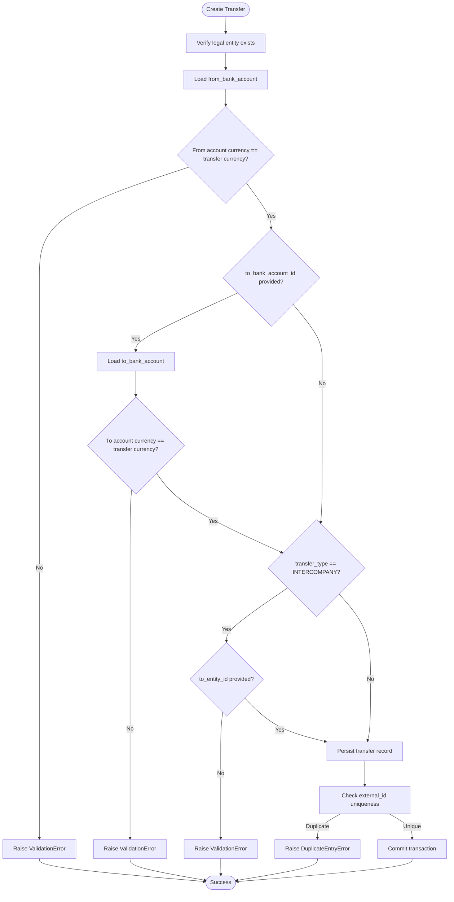
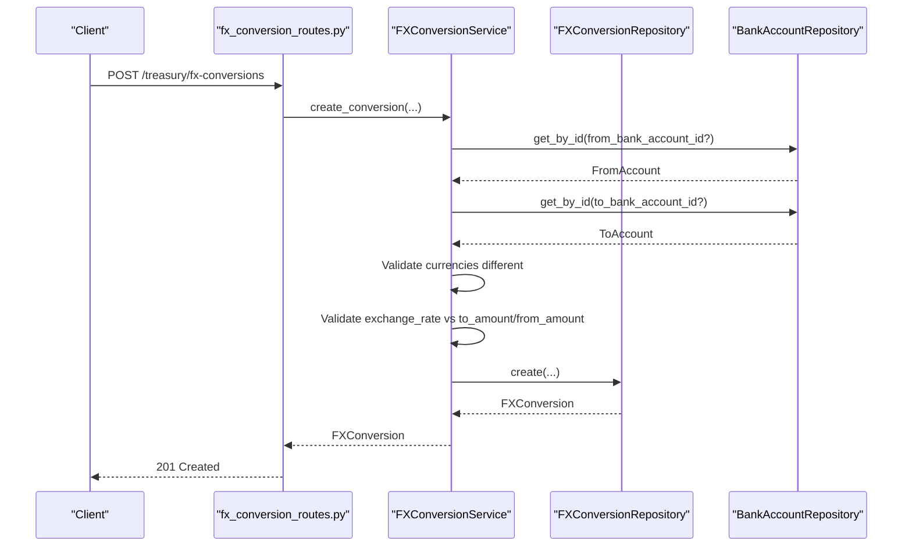
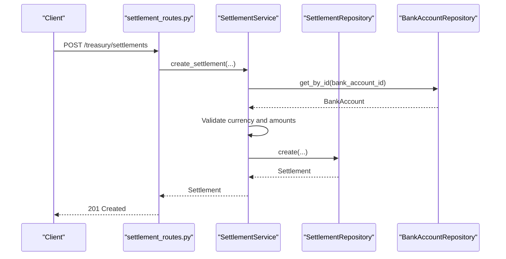
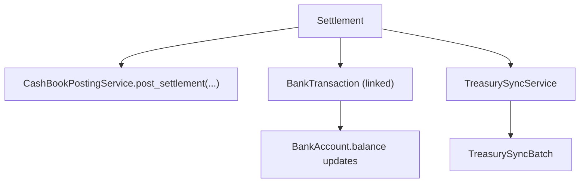
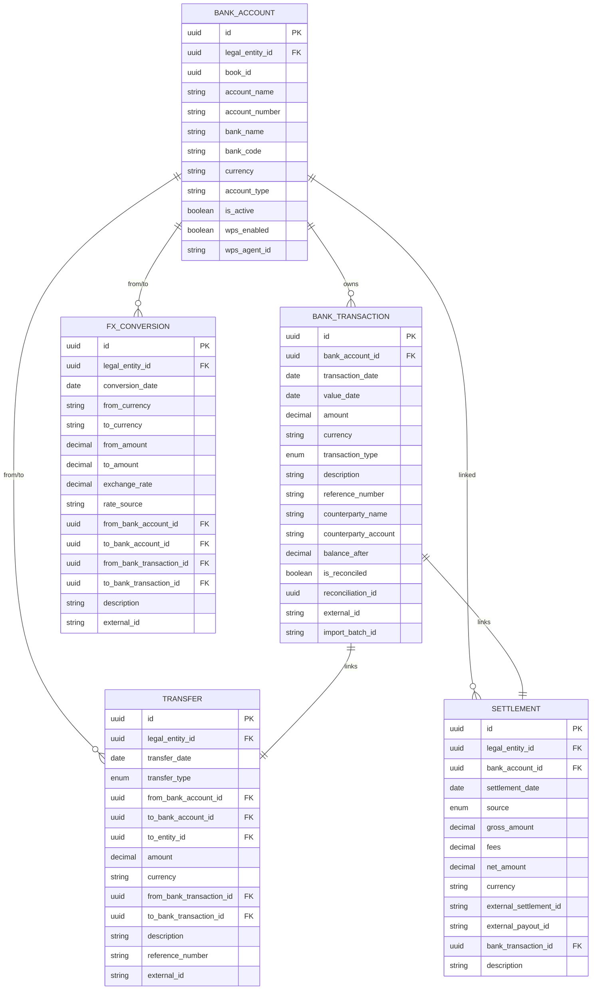

# Treasury Models

<cite>
**Referenced Files in This Document**
- [bank_account_model.py](file://app/modules/treasury/models/bank_account_model.py)
- [bank_transaction_model.py](file://app/modules/treasury/models/bank_transaction_model.py)
- [transfer_model.py](file://app/modules/treasury/models/transfer_model.py)
- [fx_conversion_model.py](file://app/modules/treasury/models/fx_conversion_model.py)
- [settlement_model.py](file://app/modules/treasury/models/settlement_model.py)
- [bank_account_schemas.py](file://app/modules/treasury/schemas/bank_account_schemas.py)
- [bank_transaction_schemas.py](file://app/modules/treasury/schemas/bank_transaction_schemas.py)
- [transfer_schemas.py](file://app/modules/treasury/schemas/transfer_schemas.py)
- [fx_conversion_schemas.py](file://app/modules/treasury/schemas/fx_conversion_schemas.py)
- [settlement_schemas.py](file://app/modules/treasury/schemas/settlement_schemas.py)
- [bank_account_service.py](file://app/modules/treasury/services/bank_account_service.py)
- [bank_transaction_service.py](file://app/modules/treasury/services/bank_transaction_service.py)
- [transfer_service.py](file://app/modules/treasury/services/transfer_service.py)
- [fx_conversion_service.py](file://app/modules/treasury/services/fx_conversion_service.py)
- [settlement_service.py](file://app/modules/treasury/services/settlement_service.py)
- [cash_book_posting_service.py](file://app/modules/general_ledger/services/cash_book_posting_service.py)
- [treasury_sync_service.py](file://app/modules/general_ledger/services/treasury_sync_service.py)
- [treasury_sync_batch_model.py](file://app/modules/general_ledger/models/treasury_sync_batch_model.py)
- [treasury_sync_routes.py](file://app/modules/general_ledger/api/routes/treasury_sync_routes.py)
- [bank_account_routes.py](file://app/modules/treasury/api/routes/bank_account_routes.py)
- [bank_transaction_routes.py](file://app/modules/treasury/api/routes/bank_transaction_routes.py)
- [transfer_routes.py](file://app/modules/treasury/api/routes/transfer_routes.py)
- [fx_conversion_routes.py](file://app/modules/treasury/api/routes/fx_conversion_routes.py)
- [settlement_routes.py](file://app/modules/treasury/api/routes/settlement_routes.py)
</cite>

## Table of Contents
1. [Introduction](#introduction)
2. [Project Structure](#project-structure)
3. [Core Components](#core-components)
4. [Architecture Overview](#architecture-overview)
5. [Detailed Component Analysis](#detailed-component-analysis)
6. [Dependency Analysis](#dependency-analysis)
7. [Performance Considerations](#performance-considerations)
8. [Troubleshooting Guide](#troubleshooting-guide)
9. [Conclusion](#conclusion)
10. [Appendices](#appendices)

## Introduction
This document provides comprehensive data model documentation for Treasury entities within the TrueVow Financial Management system. It covers bank account management, transaction processing, transfer operations, foreign exchange (FX) conversions, and settlement models. The documentation details entity relationships, field definitions, validation rules, business constraints, and operational flows such as real-time settlement processing, currency hedging considerations, and cash position tracking. It also includes examples of creating transfers, performing FX conversions, and reconciling settlements, along with guidance on data validation, currency controls, and compliance requirements.

## Project Structure
The Treasury domain is organized around models, schemas, services, repositories, and API routes. The models define the persistent entities and their relationships. Schemas define validation and serialization for API requests and responses. Services encapsulate business logic and enforce constraints. Repositories abstract persistence. Routes expose endpoints for client consumption.

**Diagram sources**
- [bank_account_model.py](file://app/modules/treasury/models/bank_account_model.py#L9-L36)
- [bank_transaction_model.py](file://app/modules/treasury/models/bank_transaction_model.py#L21-L52)
- [transfer_model.py](file://app/modules/treasury/models/transfer_model.py#L17-L49)
- [fx_conversion_model.py](file://app/modules/treasury/models/fx_conversion_model.py#L9-L41)
- [settlement_model.py](file://app/modules/treasury/models/settlement_model.py#L17-L48)
- [bank_account_service.py](file://app/modules/treasury/services/bank_account_service.py#L11-L97)
- [bank_transaction_service.py](file://app/modules/treasury/services/bank_transaction_service.py#L13-L171)
- [transfer_service.py](file://app/modules/treasury/services/transfer_service.py#L14-L113)
- [fx_conversion_service.py](file://app/modules/treasury/services/fx_conversion_service.py#L14-L112)
- [settlement_service.py](file://app/modules/treasury/services/settlement_service.py#L14-L124)
- [bank_account_routes.py](file://app/modules/treasury/api/routes/bank_account_routes.py)
- [bank_transaction_routes.py](file://app/modules/treasury/api/routes/bank_transaction_routes.py)
- [transfer_routes.py](file://app/modules/treasury/api/routes/transfer_routes.py)
- [fx_conversion_routes.py](file://app/modules/treasury/api/routes/fx_conversion_routes.py)
- [settlement_routes.py](file://app/modules/treasury/api/routes/settlement_routes.py)

**Section sources**
- [bank_account_model.py](file://app/modules/treasury/models/bank_account_model.py#L1-L36)
- [bank_transaction_model.py](file://app/modules/treasury/models/bank_transaction_model.py#L1-L52)
- [transfer_model.py](file://app/modules/treasury/models/transfer_model.py#L1-L49)
- [fx_conversion_model.py](file://app/modules/treasury/models/fx_conversion_model.py#L1-L41)
- [settlement_model.py](file://app/modules/treasury/models/settlement_model.py#L1-L48)

## Core Components
This section defines the core Treasury entities, their fields, relationships, and constraints.

- BankAccount
  - Purpose: Represents a bank account held by a legal entity, including currency, account type, and regulatory flags (e.g., UAE WPS).
  - Key fields: legal_entity_id, book_id, account_name, account_number, bank_name, bank_code, currency, account_type, is_active, wps_enabled, wps_agent_id.
  - Relationships: belongs to LegalEntity; has many BankTransaction and ReconciliationSession.
  - Constraints: currency is three-letter ISO code; optional book_id links to a cash book; WPS-related fields for UAE regulations.

- BankTransaction
  - Purpose: Represents individual statement lines (deposits, withdrawals, transfers, fees, interest).
  - Key fields: bank_account_id, transaction_date, value_date, amount (positive for deposits, negative for withdrawals), currency, transaction_type, description, reference_number, counterparty_name/account, balance_after, is_reconciled, reconciliation_id, external_id, import_batch_id.
  - Relationships: belongs to BankAccount.
  - Constraints: composite indexes on (bank_account_id, transaction_date) and (bank_account_id, is_reconciled); external_id uniqueness enforced; currency must match account currency.

- Transfer
  - Purpose: Records cash movements between bank accounts, including intra-entity, intercompany, and external transfers.
  - Key fields: legal_entity_id, transfer_date, transfer_type, from_bank_account_id, to_bank_account_id, to_entity_id, amount, currency, from_bank_transaction_id, to_bank_transaction_id, description, reference_number, external_id.
  - Relationships: references LegalEntity (from/to), BankAccount (from/to), BankTransaction (linking posted txns).
  - Constraints: from/to accounts must belong to the specified legal entity and match the transfer currency; intercompany requires to_entity_id; external_id uniqueness.

- FXConversion
  - Purpose: Tracks realized foreign exchange conversions with explicit rates and optional linkage to bank accounts/transactions.
  - Key fields: legal_entity_id, conversion_date, from_currency, to_currency, from_amount, to_amount, exchange_rate, rate_source, from_bank_account_id, to_bank_account_id, from_bank_transaction_id, to_bank_transaction_id, description, external_id.
  - Relationships: references LegalEntity and BankAccount/Transaction.
  - Constraints: from_currency must differ from to_currency; exchange rate validated against calculated rate; external_id uniqueness.

- Settlement
  - Purpose: Captures payment gateway settlements (e.g., Stripe/TELR) with gross, fee, and net amounts.
  - Key fields: legal_entity_id, bank_account_id, settlement_date, source, gross_amount, fees, net_amount, currency, external_settlement_id, external_payout_id, bank_transaction_id, description.
  - Relationships: references LegalEntity, BankAccount, BankTransaction.
  - Constraints: bank account must belong to the entity and match currency; gross/fees/net consistency; unique constraint on (source, external_settlement_id) where external ID is not null.

**Section sources**
- [bank_account_model.py](file://app/modules/treasury/models/bank_account_model.py#L9-L36)
- [bank_transaction_model.py](file://app/modules/treasury/models/bank_transaction_model.py#L21-L52)
- [transfer_model.py](file://app/modules/treasury/models/transfer_model.py#L17-L49)
- [fx_conversion_model.py](file://app/modules/treasury/models/fx_conversion_model.py#L9-L41)
- [settlement_model.py](file://app/modules/treasury/models/settlement_model.py#L17-L48)

## Architecture Overview
The Treasury subsystem follows a layered architecture:
- Models define the persistent entities and relationships.
- Services encapsulate business rules and validations.
- Schemas validate and serialize request/response payloads.
- Repositories abstract persistence operations.
- Routes expose REST endpoints for clients.

**Diagram sources**
- [bank_account_model.py](file://app/modules/treasury/models/bank_account_model.py#L9-L36)
- [bank_transaction_model.py](file://app/modules/treasury/models/bank_transaction_model.py#L21-L52)
- [transfer_model.py](file://app/modules/treasury/models/transfer_model.py#L17-L49)
- [fx_conversion_model.py](file://app/modules/treasury/models/fx_conversion_model.py#L9-L41)
- [settlement_model.py](file://app/modules/treasury/models/settlement_model.py#L17-L48)

## Detailed Component Analysis

### Bank Account Management
- Responsibilities
  - Create/update bank accounts linked to a legal entity.
  - Enforce basic validations (entity existence, currency format).
  - Support WPS (UAE) flags and agent identifiers.
- Validation Rules
  - Currency must be a three-character ISO code.
  - Account number, bank code, and account type are optional but stored when provided.
  - WPS flags enable/disable and agent ID are optional.
- Business Constraints
  - Accounts belong to a single legal entity.
  - Optional association with a cash book for the entity.
- Example Operations
  - Create a new bank account for an entity with a specified currency and optional WPS settings.
  - Update account activity or WPS configuration.

**Section sources**
- [bank_account_model.py](file://app/modules/treasury/models/bank_account_model.py#L9-L36)
- [bank_account_schemas.py](file://app/modules/treasury/schemas/bank_account_schemas.py#L7-L46)
- [bank_account_service.py](file://app/modules/treasury/services/bank_account_service.py#L19-L54)

### Bank Transaction Processing
- Responsibilities
  - Record individual statement lines with type classification.
  - Prevent duplicates via external_id uniqueness.
  - Validate currency alignment with the associated bank account.
  - Support CSV import with atomic batch commits.
- Validation Rules
  - Amount signs reflect deposit/withdrawal direction.
  - Currency must match the bank account’s currency.
  - External_id must be unique; duplicates raise errors.
  - Composite indexes optimize queries by account/date and account/reconciled state.
- Business Constraints
  - Transactions link to a single bank account.
  - Optional reconciliation linkage and import batch tracking.
- Example Operations
  - Create a transaction for a given account with a specific amount and type.
  - Import a batch of transactions with deduplication and atomic commit.

**Diagram sources**
- [bank_transaction_routes.py](file://app/modules/treasury/api/routes/bank_transaction_routes.py)
- [bank_transaction_service.py](file://app/modules/treasury/services/bank_transaction_service.py#L21-L78)
- [bank_transaction_model.py](file://app/modules/treasury/models/bank_transaction_model.py#L21-L52)

**Section sources**
- [bank_transaction_model.py](file://app/modules/treasury/models/bank_transaction_model.py#L21-L52)
- [bank_transaction_schemas.py](file://app/modules/treasury/schemas/bank_transaction_schemas.py#L9-L62)
- [bank_transaction_service.py](file://app/modules/treasury/services/bank_transaction_service.py#L21-L78)

### Transfer Operations
- Responsibilities
  - Manage cash movement between bank accounts across intra-entity, intercompany, and external transfers.
  - Validate account ownership and currency consistency.
  - Enforce intercompany-specific constraints (to_entity_id).
  - Prevent duplicates via external_id uniqueness.
- Validation Rules
  - From/to accounts must belong to the specified legal entity.
  - From/to account currency must match transfer currency.
  - Intercompany transfers require a destination entity identifier.
  - External_id must be unique.
- Business Constraints
  - Transfer type determines routing and linkage to accounts/entities.
  - Optional linkage to originating and receiving bank transactions.
- Example Operations
  - Create an intercompany transfer between two entities with proper currency and amounts.
  - Create an intra-entity transfer within the same legal entity.

**Diagram sources**
- [transfer_service.py](file://app/modules/treasury/services/transfer_service.py#L23-L89)
- [transfer_model.py](file://app/modules/treasury/models/transfer_model.py#L17-L49)

**Section sources**
- [transfer_model.py](file://app/modules/treasury/models/transfer_model.py#L17-L49)
- [transfer_schemas.py](file://app/modules/treasury/schemas/transfer_schemas.py#L9-L43)
- [transfer_service.py](file://app/modules/treasury/services/transfer_service.py#L23-L89)

### Foreign Exchange Conversions
- Responsibilities
  - Record realized FX conversions with explicit rates and optional account/transaction linkage.
  - Validate currency pairs, exchange rate accuracy, and account currency alignment.
  - Prevent duplicates via external_id uniqueness.
- Validation Rules
  - From and to currencies must be different.
  - Exchange rate must match calculated ratio (to_amount/from_amount) within tolerance.
  - If accounts are provided, their currencies must match the conversion currencies.
  - External_id must be unique.
- Business Constraints
  - Rate source indicates origin (e.g., API, manual, bank).
  - Optional linkage to bank accounts and transactions for auditability.
- Example Operations
  - Create an FX conversion with precise amounts and rates, optionally linking to source/destination accounts.

**Diagram sources**
- [fx_conversion_routes.py](file://app/modules/treasury/api/routes/fx_conversion_routes.py)
- [fx_conversion_service.py](file://app/modules/treasury/services/fx_conversion_service.py#L23-L90)
- [fx_conversion_model.py](file://app/modules/treasury/models/fx_conversion_model.py#L9-L41)

**Section sources**
- [fx_conversion_model.py](file://app/modules/treasury/models/fx_conversion_model.py#L9-L41)
- [fx_conversion_schemas.py](file://app/modules/treasury/schemas/fx_conversion_schemas.py#L8-L44)
- [fx_conversion_service.py](file://app/modules/treasury/services/fx_conversion_service.py#L23-L90)

### Settlement Processing
- Responsibilities
  - Capture payment gateway settlements with gross, fee, and net amounts.
  - Validate account ownership and currency consistency.
  - Enforce amount consistency (net = gross - fees).
  - Prevent duplicates via external_settlement_id uniqueness.
- Validation Rules
  - Bank account must belong to the legal entity and match settlement currency.
  - Gross and fees must be non-negative; net must equal gross minus fees.
  - External_settlement_id must be unique when present.
- Business Constraints
  - Settlement source indicates provider (e.g., Stripe, TELR, Manual).
  - Optional external payout ID for provider-specific tracking.
  - Optional linkage to a bank transaction upon posting.
- Example Operations
  - Create a settlement from a gateway export with proper amounts and IDs.
  - Import a manual settlement record.

**Diagram sources**
- [settlement_routes.py](file://app/modules/treasury/api/routes/settlement_routes.py)
- [settlement_service.py](file://app/modules/treasury/services/settlement_service.py#L23-L81)
- [settlement_model.py](file://app/modules/treasury/models/settlement_model.py#L17-L48)

**Section sources**
- [settlement_model.py](file://app/modules/treasury/models/settlement_model.py#L17-L48)
- [settlement_schemas.py](file://app/modules/treasury/schemas/settlement_schemas.py#L9-L58)
- [settlement_service.py](file://app/modules/treasury/services/settlement_service.py#L23-L81)

### Real-Time Settlement Processing and Cash Position Tracking
- Real-time posting
  - Settlements can be posted to the cash book via a dedicated posting service, linking the settlement to a bank transaction.
- Cash position tracking
  - Bank transactions and transfers update account balances; the system maintains balance_after on transactions and supports reconciliation sessions.
- Treasury synchronization
  - General ledger services provide treasury synchronization and batch processing for cross-system alignment.

**Diagram sources**
- [settlement_model.py](file://app/modules/treasury/models/settlement_model.py#L34-L37)
- [cash_book_posting_service.py](file://app/modules/general_ledger/services/cash_book_posting_service.py)
- [treasury_sync_service.py](file://app/modules/general_ledger/services/treasury_sync_service.py)
- [treasury_sync_batch_model.py](file://app/modules/general_ledger/models/treasury_sync_batch_model.py)

**Section sources**
- [settlement_model.py](file://app/modules/treasury/models/settlement_model.py#L34-L37)
- [cash_book_posting_service.py](file://app/modules/general_ledger/services/cash_book_posting_service.py)
- [treasury_sync_service.py](file://app/modules/general_ledger/services/treasury_sync_service.py)
- [treasury_sync_batch_model.py](file://app/modules/general_ledger/models/treasury_sync_batch_model.py)

## Dependency Analysis
The Treasury models exhibit clear relationships:
- BankAccount is central, linking to BankTransaction, Transfer, FXConversion, and Settlement.
- BankTransaction can be linked to Transfer and Settlement records.
- Transfer and FXConversion optionally link to BankTransaction for audit trails.
- Settlement links to BankAccount and BankTransaction.

**Diagram sources**
- [bank_account_model.py](file://app/modules/treasury/models/bank_account_model.py#L9-L36)
- [bank_transaction_model.py](file://app/modules/treasury/models/bank_transaction_model.py#L21-L52)
- [transfer_model.py](file://app/modules/treasury/models/transfer_model.py#L17-L49)
- [fx_conversion_model.py](file://app/modules/treasury/models/fx_conversion_model.py#L9-L41)
- [settlement_model.py](file://app/modules/treasury/models/settlement_model.py#L17-L48)

**Section sources**
- [bank_account_model.py](file://app/modules/treasury/models/bank_account_model.py#L9-L36)
- [bank_transaction_model.py](file://app/modules/treasury/models/bank_transaction_model.py#L21-L52)
- [transfer_model.py](file://app/modules/treasury/models/transfer_model.py#L17-L49)
- [fx_conversion_model.py](file://app/modules/treasury/models/fx_conversion_model.py#L9-L41)
- [settlement_model.py](file://app/modules/treasury/models/settlement_model.py#L17-L48)

## Performance Considerations
- Indexing
  - BankTransaction includes composite indexes on (bank_account_id, transaction_date) and (bank_account_id, is_reconciled) to accelerate common queries.
- Atomic Batch Operations
  - CSV imports for BankTransaction use a single commit for the entire batch to ensure consistency and reduce overhead.
- Currency Matching
  - Immediate validation of currency alignment reduces downstream errors and joins.
- Cursor Pagination
  - BankTransaction supports cursor-based pagination for efficient large-volume listings.

[No sources needed since this section provides general guidance]

## Troubleshooting Guide
Common issues and resolutions:
- Duplicate Entry Errors
  - Symptom: Attempting to create a record with an external_id that already exists.
  - Resolution: Ensure external_id uniqueness; deduplicate upstream or handle retries gracefully.
- Validation Errors
  - Symptom: Currency mismatch between account and transaction/transfer/FX/settlement.
  - Resolution: Align currencies across related entities; verify account currency before creation.
- Not Found Errors
  - Symptom: Referencing non-existent entity or account.
  - Resolution: Validate identifiers prior to creation; ensure entity and account existence.
- Amount Consistency
  - Symptom: Net amount not equal to gross minus fees in settlement.
  - Resolution: Recalculate amounts and re-validate before persisting.

**Section sources**
- [bank_transaction_service.py](file://app/modules/treasury/services/bank_transaction_service.py#L49-L58)
- [transfer_service.py](file://app/modules/treasury/services/transfer_service.py#L47-L58)
- [fx_conversion_service.py](file://app/modules/treasury/services/fx_conversion_service.py#L44-L66)
- [settlement_service.py](file://app/modules/treasury/services/settlement_service.py#L52-L58)

## Conclusion
The Treasury models provide a robust foundation for managing bank accounts, transactions, transfers, FX conversions, and settlements. Clear validation rules, explicit constraints, and well-defined relationships ensure data integrity and operational reliability. The service layer enforces business logic, while schemas guarantee input correctness. Integration with general ledger services enables real-time posting and reconciliation, supporting accurate cash position tracking and compliance.

[No sources needed since this section summarizes without analyzing specific files]

## Appendices

### Field Definitions and Validation Rules Summary
- BankAccount
  - Fields: legal_entity_id, book_id, account_name, account_number, bank_name, bank_code, currency, account_type, is_active, wps_enabled, wps_agent_id.
  - Validation: currency length 3; optional fields for WPS support.
- BankTransaction
  - Fields: bank_account_id, transaction_date, value_date, amount, currency, transaction_type, description, reference_number, counterparty_name/account, balance_after, is_reconciled, reconciliation_id, external_id, import_batch_id.
  - Validation: currency must match account; external_id unique; indexes optimized for queries.
- Transfer
  - Fields: legal_entity_id, transfer_date, transfer_type, from_bank_account_id, to_bank_account_id, to_entity_id, amount, currency, from_bank_transaction_id, to_bank_transaction_id, description, reference_number, external_id.
  - Validation: account ownership and currency consistency; intercompany requires to_entity_id; external_id unique.
- FXConversion
  - Fields: legal_entity_id, conversion_date, from_currency, to_currency, from_amount, to_amount, exchange_rate, rate_source, from_bank_account_id, to_bank_account_id, from_bank_transaction_id, to_bank_transaction_id, description, external_id.
  - Validation: different currencies; exchange rate accuracy; account currency alignment; external_id unique.
- Settlement
  - Fields: legal_entity_id, bank_account_id, settlement_date, source, gross_amount, fees, net_amount, currency, external_settlement_id, external_payout_id, bank_transaction_id, description.
  - Validation: account ownership and currency; amount consistency; external_settlement_id unique when present.

**Section sources**
- [bank_account_model.py](file://app/modules/treasury/models/bank_account_model.py#L9-L36)
- [bank_transaction_model.py](file://app/modules/treasury/models/bank_transaction_model.py#L21-L52)
- [transfer_model.py](file://app/modules/treasury/models/transfer_model.py#L17-L49)
- [fx_conversion_model.py](file://app/modules/treasury/models/fx_conversion_model.py#L9-L41)
- [settlement_model.py](file://app/modules/treasury/models/settlement_model.py#L17-L48)

### Examples

- Transfer Creation
  - Steps: Validate legal entity and from/to accounts; ensure currencies match; for intercompany, specify to_entity_id; create transfer with external_id if applicable.
  - Reference: [transfer_service.py](file://app/modules/treasury/services/transfer_service.py#L23-L89), [transfer_schemas.py](file://app/modules/treasury/schemas/transfer_schemas.py#L9-L43)

- FX Conversion
  - Steps: Verify entity; ensure from_currency differs from to_currency; validate exchange rate vs. calculated ratio; optionally link accounts; create conversion with external_id.
  - Reference: [fx_conversion_service.py](file://app/modules/treasury/services/fx_conversion_service.py#L23-L90), [fx_conversion_schemas.py](file://app/modules/treasury/schemas/fx_conversion_schemas.py#L8-L44)

- Settlement Reconciliation
  - Steps: Create settlement with gross/fees/net consistency; link to bank account and optional bank transaction; synchronize with general ledger.
  - Reference: [settlement_service.py](file://app/modules/treasury/services/settlement_service.py#L23-L81), [cash_book_posting_service.py](file://app/modules/general_ledger/services/cash_book_posting_service.py), [treasury_sync_service.py](file://app/modules/general_ledger/services/treasury_sync_service.py)

**Section sources**
- [transfer_service.py](file://app/modules/treasury/services/transfer_service.py#L23-L89)
- [fx_conversion_service.py](file://app/modules/treasury/services/fx_conversion_service.py#L23-L90)
- [settlement_service.py](file://app/modules/treasury/services/settlement_service.py#L23-L81)
- [cash_book_posting_service.py](file://app/modules/general_ledger/services/cash_book_posting_service.py)
- [treasury_sync_service.py](file://app/modules/general_ledger/services/treasury_sync_service.py)