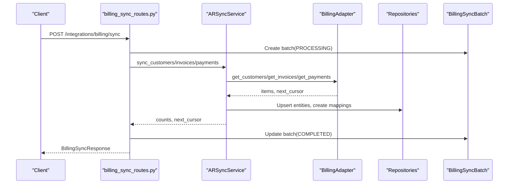
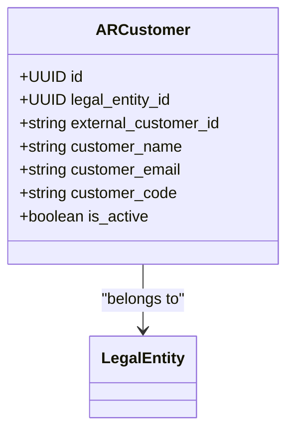
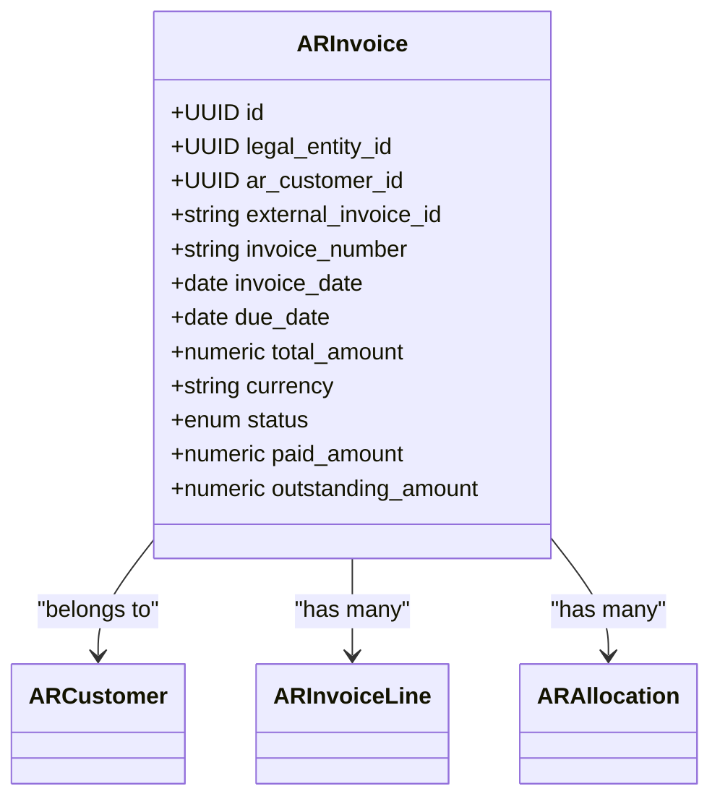
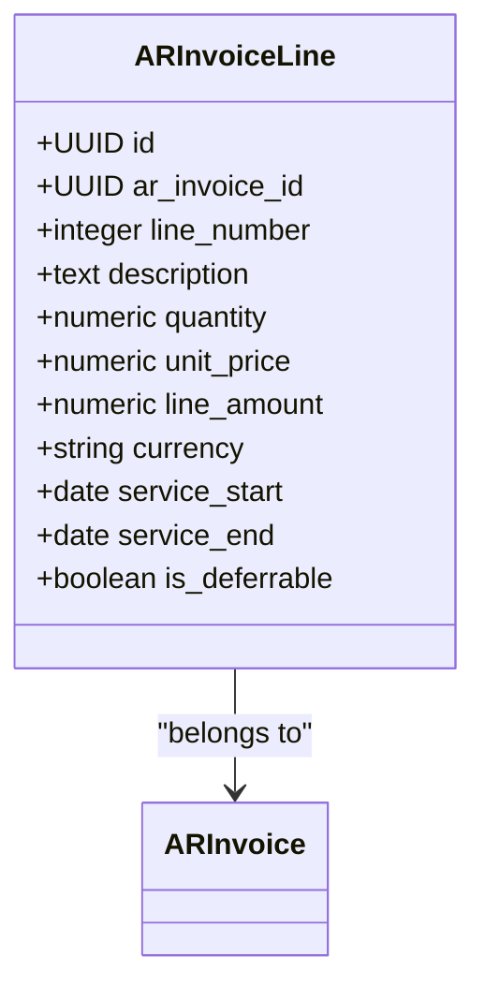
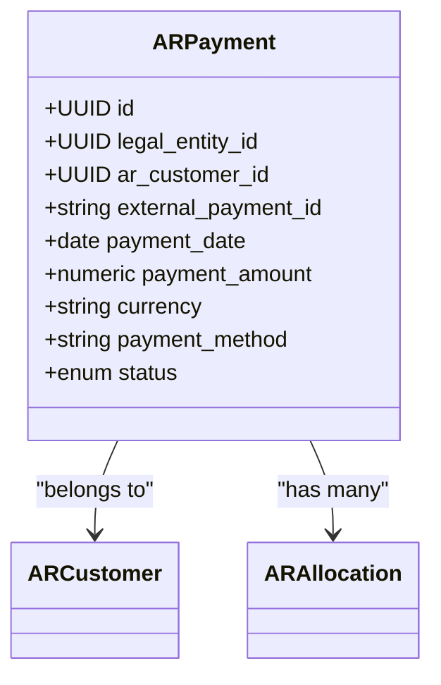
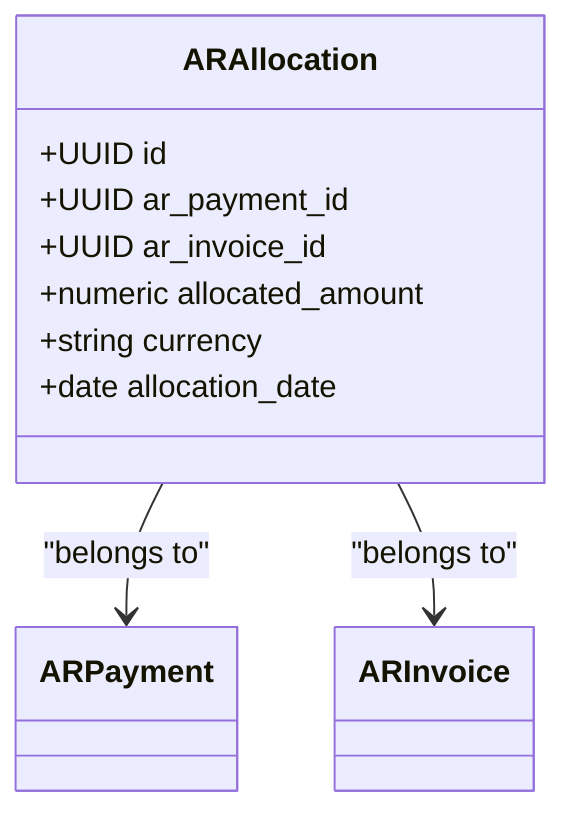
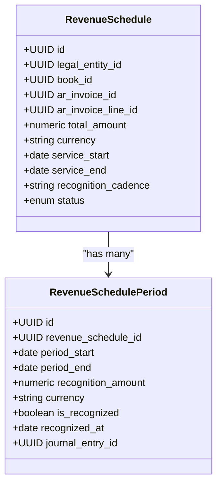
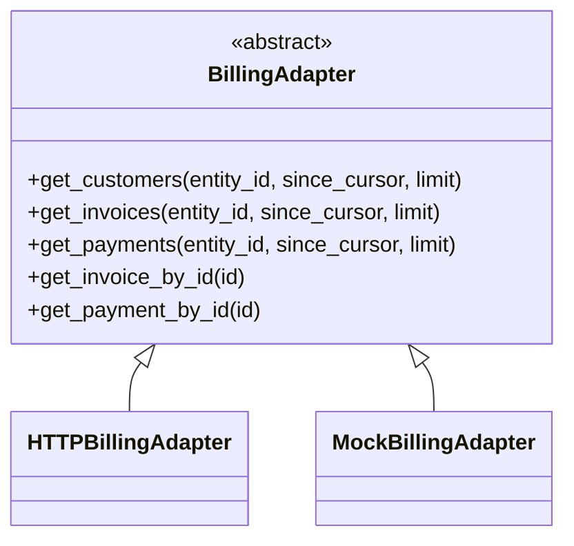
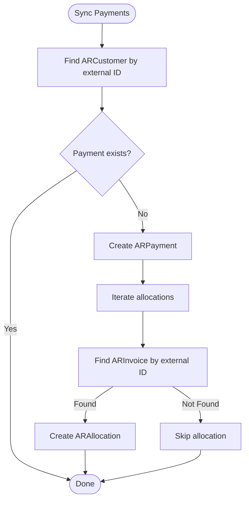
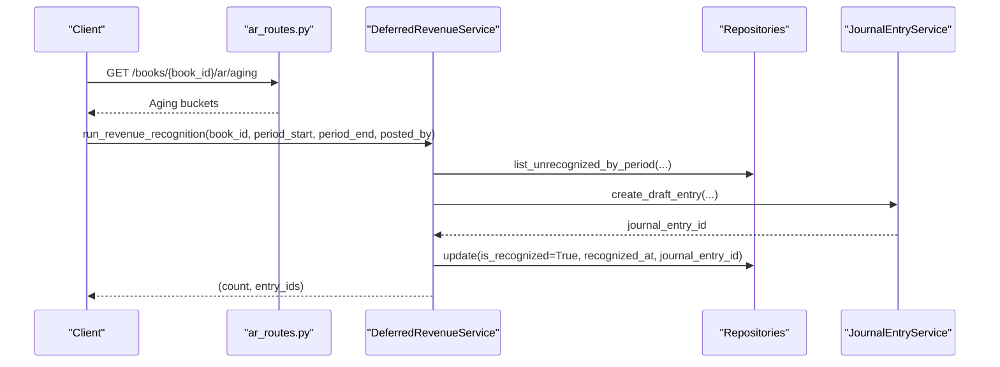

# Accounts Receivable Tables

<cite>
**Referenced Files in This Document**
- [ar_customer_model.py](file://app/modules/ar/models/ar_customer_model.py)
- [ar_invoice_model.py](file://app/modules/ar/models/ar_invoice_model.py)
- [ar_payment_model.py](file://app/modules/ar/models/ar_payment_model.py)
- [deferred_revenue_model.py](file://app/modules/ar/models/deferred_revenue_model.py)
- [billing_sync_batch_model.py](file://app/modules/ar/models/billing_sync_batch_model.py)
- [ar_sync_service.py](file://app/modules/ar/services/ar_sync_service.py)
- [deferred_revenue_service.py](file://app/modules/ar/services/deferred_revenue_service.py)
- [ar_allocation_repository.py](file://app/modules/ar/repositories/ar_allocation_repository.py)
- [billing_adapter.py](file://app/modules/ar/integrations/billing_adapter.py)
- [ar_routes.py](file://app/modules/ar/api/routes/ar_routes.py)
- [billing_sync_routes.py](file://app/modules/ar/api/routes/billing_sync_routes.py)
- [ar_sync_schemas.py](file://app/modules/ar/schemas/ar_sync_schemas.py)
- [fm_schema.sql](file://database/fm_schema.sql)
</cite>

## Table of Contents
1. [Introduction](#introduction)
2. [Project Structure](#project-structure)
3. [Core Components](#core-components)
4. [Architecture Overview](#architecture-overview)
5. [Detailed Component Analysis](#detailed-component-analysis)
6. [Dependency Analysis](#dependency-analysis)
7. [Performance Considerations](#performance-considerations)
8. [Troubleshooting Guide](#troubleshooting-guide)
9. [Conclusion](#conclusion)

## Introduction
This document describes the Accounts Receivable (AR) domain tables and supporting services that power customer invoicing, collections, and deferred revenue recognition. It covers:
- AR Customer master data
- AR Invoice lifecycle and multi-line support
- AR Payment and allocation mechanics
- Deferred revenue scheduling and recognition
- Billing integration patterns and idempotent sync orchestration

The AR domain is implemented as SQLAlchemy models with repositories and services, integrated with the General Ledger and Treasury modules. Billing synchronization is handled via an adapter abstraction, enabling HTTP-based integration or mock fallback.

## Project Structure
The AR module follows a layered architecture:
- Models define the persistent entities and relationships
- Repositories encapsulate CRUD and queries
- Services orchestrate business logic and workflows
- Integrations provide external system adapters
- APIs expose endpoints for invoice posting, AR aging, and billing sync

```mermaid
graph TB
subgraph "AR Models"
AC["ARCustomer"]
AI["ARInvoice"]
AIL["ARInvoiceLine"]
AP["ARPayment"]
AA["ARAllocation"]
RS["RevenueSchedule"]
RSP["RevenueSchedulePeriod"]
end
subgraph "Repositories"
ARCRepo["ARCustomerRepository"]
AIRRepo["ARInvoiceRepository"]
AIRLRepo["ARInvoiceLineRepository"]
APRRepo["ARPaymentRepository"]
AARRepo["ARAllocationRepository"]
end
subgraph "Services"
ARSync["ARSyncService"]
DRSvc["DeferredRevenueService"]
end
subgraph "Integrations"
BA["BillingAdapter"]
HBA["HTTPBillingAdapter"]
end
subgraph "API"
ARR["ar_routes.py"]
BSR["billing_sync_routes.py"]
end
AC --> AI
AI --> AIL
AP --> AA
AI <-- AA
AP <-- AA
RS --> RSP
ARSync --> BA
ARSync --> ARCRepo
ARSync --> AIRRepo
ARSync --> APRRepo
ARSync --> AARRepo
DRSvc --> RS
DRSvc --> RSP
ARR --> AIRRepo
BSR --> ARSync
```

**Diagram sources**
- [ar_customer_model.py](file://app/modules/ar/models/ar_customer_model.py#L8-L30)
- [ar_invoice_model.py](file://app/modules/ar/models/ar_invoice_model.py#L21-L81)
- [ar_payment_model.py](file://app/modules/ar/models/ar_payment_model.py#L19-L70)
- [deferred_revenue_model.py](file://app/modules/ar/models/deferred_revenue_model.py#L17-L71)
- [ar_sync_service.py](file://app/modules/ar/services/ar_sync_service.py#L23-L325)
- [deferred_revenue_service.py](file://app/modules/ar/services/deferred_revenue_service.py#L25-L241)
- [billing_adapter.py](file://app/modules/ar/integrations/billing_adapter.py#L8-L191)
- [ar_routes.py](file://app/modules/ar/api/routes/ar_routes.py#L16-L178)
- [billing_sync_routes.py](file://app/modules/ar/api/routes/billing_sync_routes.py#L18-L192)

**Section sources**
- [ar_customer_model.py](file://app/modules/ar/models/ar_customer_model.py#L1-L30)
- [ar_invoice_model.py](file://app/modules/ar/models/ar_invoice_model.py#L1-L81)
- [ar_payment_model.py](file://app/modules/ar/models/ar_payment_model.py#L1-L70)
- [deferred_revenue_model.py](file://app/modules/ar/models/deferred_revenue_model.py#L1-L71)
- [ar_sync_service.py](file://app/modules/ar/services/ar_sync_service.py#L1-L325)
- [deferred_revenue_service.py](file://app/modules/ar/services/deferred_revenue_service.py#L1-L241)
- [billing_adapter.py](file://app/modules/ar/integrations/billing_adapter.py#L1-L191)
- [ar_routes.py](file://app/modules/ar/api/routes/ar_routes.py#L1-L178)
- [billing_sync_routes.py](file://app/modules/ar/api/routes/billing_sync_routes.py#L1-L192)

## Core Components
- AR Customer: Master data for customers synchronized from the Billing service, linked to a Legal Entity and indexed by external ID.
- AR Invoice: Invoices synchronized from Billing, with lifecycle status, totals, and relationships to customer and lines.
- AR Invoice Line: Multi-line support with quantities, unit prices, amounts, and optional service period metadata for deferred revenue.
- AR Payment: Payments synchronized from Billing, with method, status, and allocations to invoices.
- AR Allocation: Links payments to invoices with allocated amounts and currencies.
- Revenue Schedule and Period: Deferred revenue schedules and monthly recognition periods with GL posting linkage.
- Billing Sync Batch: Idempotent batch tracking for sync operations.

**Section sources**
- [ar_customer_model.py](file://app/modules/ar/models/ar_customer_model.py#L8-L30)
- [ar_invoice_model.py](file://app/modules/ar/models/ar_invoice_model.py#L21-L81)
- [ar_payment_model.py](file://app/modules/ar/models/ar_payment_model.py#L19-L70)
- [deferred_revenue_model.py](file://app/modules/ar/models/deferred_revenue_model.py#L17-L71)
- [billing_sync_batch_model.py](file://app/modules/ar/models/billing_sync_batch_model.py#L10-L40)

## Architecture Overview
The AR system integrates with the Billing service through an adapter abstraction. ARSyncService orchestrates three sync loops (customers, invoices, payments) and persists mappings and cursors. DeferredRevenueService generates monthly periods and posts journal entries for revenue recognition.



**Diagram sources**
- [billing_sync_routes.py](file://app/modules/ar/api/routes/billing_sync_routes.py#L29-L167)
- [ar_sync_service.py](file://app/modules/ar/services/ar_sync_service.py#L37-L325)
- [billing_adapter.py](file://app/modules/ar/integrations/billing_adapter.py#L8-L191)
- [billing_sync_batch_model.py](file://app/modules/ar/models/billing_sync_batch_model.py#L10-L40)

**Section sources**
- [billing_sync_routes.py](file://app/modules/ar/api/routes/billing_sync_routes.py#L1-L192)
- [ar_sync_service.py](file://app/modules/ar/services/ar_sync_service.py#L1-L325)
- [billing_adapter.py](file://app/modules/ar/integrations/billing_adapter.py#L1-L191)

## Detailed Component Analysis

### AR Customer
- Purpose: Customer master data synchronized from Billing.
- Key attributes: legal_entity_id, external_customer_id (unique), customer_name, customer_email, customer_code, is_active.
- Relationships: belongs to LegalEntity; has invoices and payments.



**Diagram sources**
- [ar_customer_model.py](file://app/modules/ar/models/ar_customer_model.py#L8-L30)

**Section sources**
- [ar_customer_model.py](file://app/modules/ar/models/ar_customer_model.py#L1-L30)
- [fm_schema.sql](file://database/fm_schema.sql#L316-L332)

### AR Invoice
- Purpose: Invoices synchronized from Billing with lifecycle and totals.
- Key attributes: external_invoice_id (unique), invoice_number (unique), invoice_date, due_date, total_amount, currency, status, paid_amount, outstanding_amount, description, external_data.
- Relationships: belongs to LegalEntity and ARCustomer; contains ARInvoiceLine(s); tracks ARAllocation(s).



**Diagram sources**
- [ar_invoice_model.py](file://app/modules/ar/models/ar_invoice_model.py#L21-L81)

**Section sources**
- [ar_invoice_model.py](file://app/modules/ar/models/ar_invoice_model.py#L1-L81)
- [fm_schema.sql](file://database/fm_schema.sql#L334-L362)

### AR Invoice Line
- Purpose: Multi-line invoice support with service period metadata for deferred revenue.
- Key attributes: ar_invoice_id, line_number (unique per invoice), description, quantity, unit_price, line_amount, currency, service_start, service_end, is_deferrable.
- Constraints: unique constraint on (ar_invoice_id, line_number).



**Diagram sources**
- [ar_invoice_model.py](file://app/modules/ar/models/ar_invoice_model.py#L54-L81)

**Section sources**
- [ar_invoice_model.py](file://app/modules/ar/models/ar_invoice_model.py#L1-L81)
- [fm_schema.sql](file://database/fm_schema.sql#L364-L382)

### AR Payment
- Purpose: Payments synchronized from Billing with method and status.
- Key attributes: external_payment_id (unique), payment_date, payment_amount, currency, payment_method, status, reference_number, description, external_data.
- Relationships: belongs to LegalEntity and ARCustomer; has ARAllocation(s).



**Diagram sources**
- [ar_payment_model.py](file://app/modules/ar/models/ar_payment_model.py#L19-L70)

**Section sources**
- [ar_payment_model.py](file://app/modules/ar/models/ar_payment_model.py#L1-L70)
- [fm_schema.sql](file://database/fm_schema.sql#L384-L408)

### AR Allocation
- Purpose: Links ARPayment to ARInvoice with allocated amount and currency.
- Key attributes: ar_payment_id, ar_invoice_id, allocated_amount, currency, allocation_date.
- Constraints: unique constraint on (ar_payment_id, ar_invoice_id).



**Diagram sources**
- [ar_payment_model.py](file://app/modules/ar/models/ar_payment_model.py#L49-L70)

**Section sources**
- [ar_payment_model.py](file://app/modules/ar/models/ar_payment_model.py#L1-L70)
- [ar_allocation_repository.py](file://app/modules/ar/repositories/ar_allocation_repository.py#L1-L31)
- [fm_schema.sql](file://database/fm_schema.sql#L410-L424)

### Deferred Revenue Schedule and Period
- Purpose: Define deferred revenue recognition schedules and monthly periods.
- RevenueSchedule: total_amount, currency, service_start, service_end, recognition_cadence, status; links to LegalEntity, Book, ARInvoice, ARInvoiceLine; has many RevenueSchedulePeriod.
- RevenueSchedulePeriod: period_start, period_end, recognition_amount, currency, is_recognized, recognized_at, journal_entry_id; links to RevenueSchedule and JournalEntry.



**Diagram sources**
- [deferred_revenue_model.py](file://app/modules/ar/models/deferred_revenue_model.py#L17-L71)

**Section sources**
- [deferred_revenue_model.py](file://app/modules/ar/models/deferred_revenue_model.py#L1-L71)
- [fm_schema.sql](file://database/fm_schema.sql#L426-L468)

### Billing Integration Patterns
- Adapter abstraction: BillingAdapter defines methods to fetch customers, invoices, payments, and single records by ID.
- HTTPBillingAdapter: Implements HTTP calls to the Billing service using configured URL and token.
- MockBillingAdapter: Provides no-op implementations for development/testing.
- ARSyncService: Orchestrates sync loops, upserts entities, creates mappings, and updates cursors.



**Diagram sources**
- [billing_adapter.py](file://app/modules/ar/integrations/billing_adapter.py#L8-L191)

**Section sources**
- [billing_adapter.py](file://app/modules/ar/integrations/billing_adapter.py#L1-L191)
- [ar_sync_service.py](file://app/modules/ar/services/ar_sync_service.py#L1-L325)

### Payment Allocation Mechanics
- Allocation creation: ARSyncService._create_allocation persists ARAllocation rows linking payments to invoices with amounts and currencies.
- Retrieval: ARAllocationRepository.list_by_payment and list_by_invoice return allocations for a given payment or invoice.



**Diagram sources**
- [ar_sync_service.py](file://app/modules/ar/services/ar_sync_service.py#L232-L325)
- [ar_allocation_repository.py](file://app/modules/ar/repositories/ar_allocation_repository.py#L16-L31)

**Section sources**
- [ar_sync_service.py](file://app/modules/ar/services/ar_sync_service.py#L232-L325)
- [ar_allocation_repository.py](file://app/modules/ar/repositories/ar_allocation_repository.py#L1-L31)

### Revenue Recognition Workflow
- Schedule creation: DeferredRevenueService.create_schedule_from_invoice_line validates deferrable lines and service periods, then creates a RevenueSchedule and generates monthly periods.
- Recognition run: DeferredRevenueService.run_revenue_recognition selects unrecognized periods within a date range, filters by book, posts journal entries, and marks periods as recognized.



**Diagram sources**
- [ar_routes.py](file://app/modules/ar/api/routes/ar_routes.py#L130-L178)
- [deferred_revenue_service.py](file://app/modules/ar/services/deferred_revenue_service.py#L119-L241)
- [deferred_revenue_model.py](file://app/modules/ar/models/deferred_revenue_model.py#L17-L71)

**Section sources**
- [deferred_revenue_service.py](file://app/modules/ar/services/deferred_revenue_service.py#L1-L241)
- [deferred_revenue_model.py](file://app/modules/ar/models/deferred_revenue_model.py#L1-L71)

## Dependency Analysis
- AR models depend on BaseModel and SQLAlchemy ORM constructs; foreign keys link to LegalEntity, ARCustomer, ARInvoice, ARPayment, Book, JournalEntry.
- Services depend on repositories and cross-module services (e.g., JournalEntryService).
- API routes depend on repositories and services for invoice posting, AR aging, and sync orchestration.

```mermaid
graph LR
AC["ARCustomer"] --> LE["LegalEntity"]
AI["ARInvoice"] --> AC
AI --> AIL["ARInvoiceLine"]
AP["ARPayment"] --> AC
AP --> AA["ARAllocation"]
AI <-- AA
RS["RevenueSchedule"] --> AI
RS --> AIL
RSP["RevenueSchedulePeriod"] --> RS
RSP --> JE["JournalEntry"]
ARSync["ARSyncService"] --> AC
ARSync --> AI
ARSync --> AP
ARSync --> AA
DRSvc["DeferredRevenueService"] --> RS
DRSvc --> RSP
```

**Diagram sources**
- [ar_customer_model.py](file://app/modules/ar/models/ar_customer_model.py#L8-L30)
- [ar_invoice_model.py](file://app/modules/ar/models/ar_invoice_model.py#L21-L81)
- [ar_payment_model.py](file://app/modules/ar/models/ar_payment_model.py#L19-L70)
- [deferred_revenue_model.py](file://app/modules/ar/models/deferred_revenue_model.py#L17-L71)

**Section sources**
- [ar_customer_model.py](file://app/modules/ar/models/ar_customer_model.py#L1-L30)
- [ar_invoice_model.py](file://app/modules/ar/models/ar_invoice_model.py#L1-L81)
- [ar_payment_model.py](file://app/modules/ar/models/ar_payment_model.py#L1-L70)
- [deferred_revenue_model.py](file://app/modules/ar/models/deferred_revenue_model.py#L1-L71)

## Performance Considerations
- Indexes: All primary tables include indexes on foreign keys and frequently queried fields (e.g., external IDs, invoice date, due date, status).
- Unique constraints: Prevent duplicate allocations and line numbers, ensuring data integrity.
- Decimal precision: Monetary fields use numeric types with fixed scale to avoid floating-point errors.
- Batch cursors: Billing sync uses cursors to process incremental updates efficiently.
- Idempotency: Sync endpoints are idempotent to tolerate retries safely.

[No sources needed since this section provides general guidance]

## Troubleshooting Guide
- Billing sync failures: Check BillingSyncBatch status and cursors; verify billing_service_url/token configuration; inspect HTTPBillingAdapter responses.
- Missing customer or invoice during sync: ARSyncService skips missing customers or invoices; ensure upstream data is available and cursors are correct.
- Allocation mismatches: Use ARAllocationRepository to list allocations by payment or invoice; confirm amounts and currencies align with Billing data.
- Revenue recognition errors: DeferredRevenueService logs and continues on individual period errors; review unrecognized periods and GL mappings.

**Section sources**
- [billing_sync_routes.py](file://app/modules/ar/api/routes/billing_sync_routes.py#L170-L192)
- [ar_sync_service.py](file://app/modules/ar/services/ar_sync_service.py#L37-L325)
- [ar_allocation_repository.py](file://app/modules/ar/repositories/ar_allocation_repository.py#L1-L31)
- [deferred_revenue_service.py](file://app/modules/ar/services/deferred_revenue_service.py#L119-L165)

## Conclusion
The AR module provides a robust foundation for customer invoicing, collections, and deferred revenue recognition. Its design emphasizes idempotent synchronization, clear separation of concerns, and extensibility through adapters. The combination of models, repositories, services, and APIs enables reliable financial workflows aligned with the General Ledger and Treasury domains.