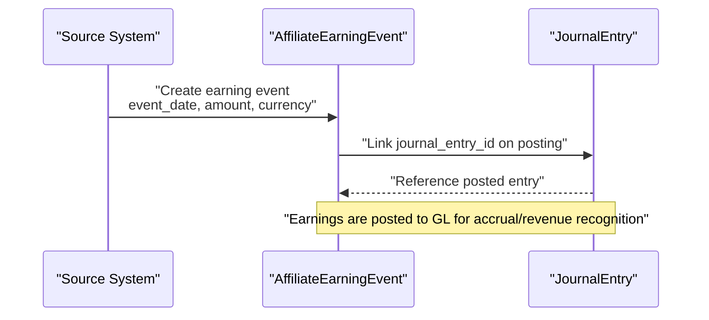
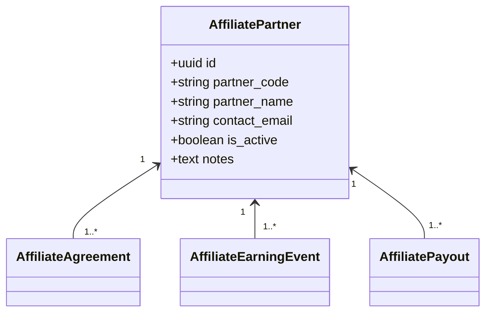
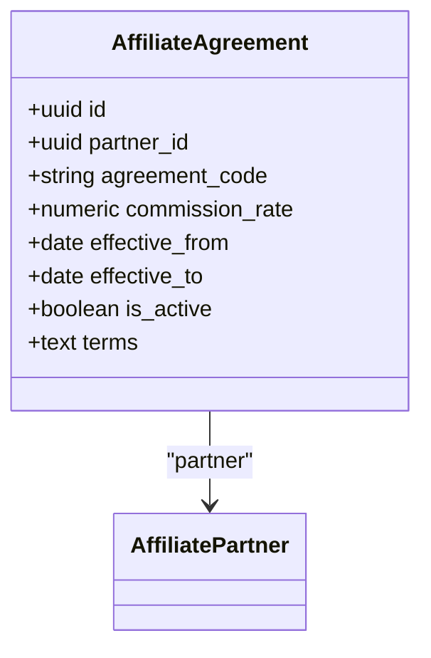
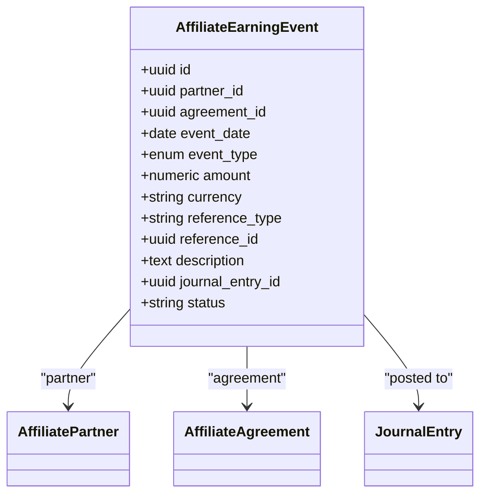
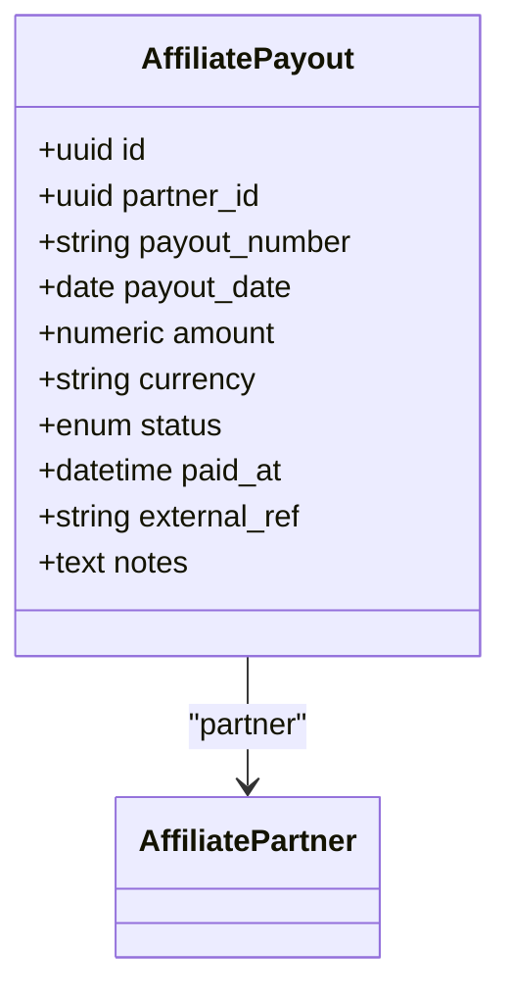
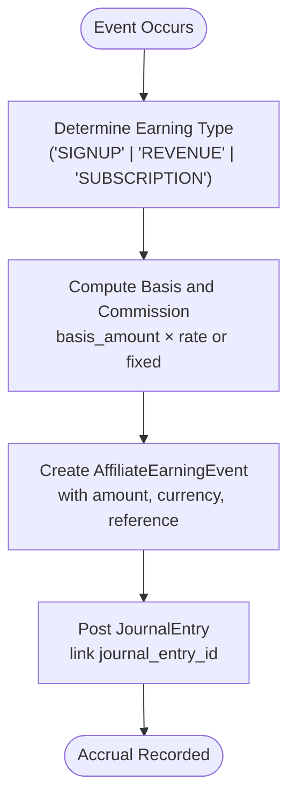
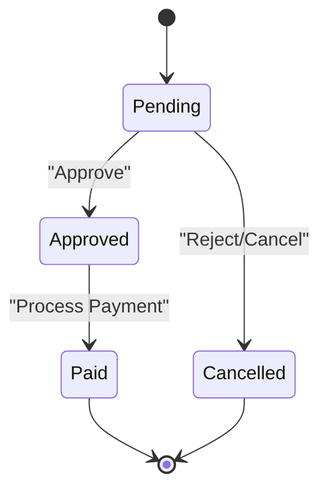
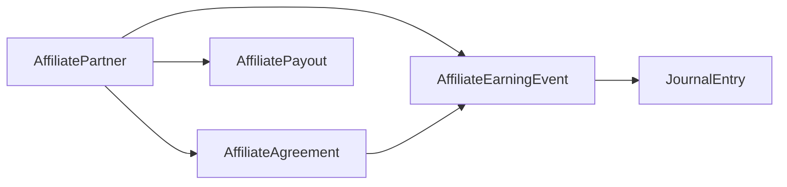

# Affiliate Tables

<cite>
**Referenced Files in This Document**
- [affiliate_agreement_model.py](file://app/modules/affiliates/models/affiliate_agreement_model.py)
- [affiliate_partner_model.py](file://app/modules/affiliates/models/affiliate_partner_model.py)
- [affiliate_earning_model.py](file://app/modules/affiliates/models/affiliate_earning_model.py)
- [fm_schema.sql](file://database/fm_schema.sql)
- [journal_entry_model.py](file://app/modules/general_ledger/models/journal_entry_model.py)
</cite>

## Table of Contents
1. [Introduction](#introduction)
2. [Project Structure](#project-structure)
3. [Core Components](#core-components)
4. [Architecture Overview](#architecture-overview)
5. [Detailed Component Analysis](#detailed-component-analysis)
6. [Dependency Analysis](#dependency-analysis)
7. [Performance Considerations](#performance-considerations)
8. [Troubleshooting Guide](#troubleshooting-guide)
9. [Conclusion](#conclusion)

## Introduction
This document describes the Affiliate module’s data model and operational flows for managing partner relationships, commission calculations, approvals, and financial postings. It covers:
- Affiliate Partner: master data for external partners
- Affiliate Agreement: contract terms and commission mechanics
- Affiliate Earning Event: recorded commission accruals linked to revenue or signup triggers
- Affiliate Payout: payment batches tracked against AP
- Integration with General Ledger for revenue recognition and accruals
- Approval workflows and audit trail

## Project Structure
The Affiliate domain is implemented as SQLAlchemy models under the affiliates module and backed by database tables defined in the schema migration file. The models are intentionally minimal and focused on the core entities and their relationships.

```mermaid
graph TB
subgraph "Affiliate Models"
AP["AffiliatePartner"]
AA["AffiliateAgreement"]
AEE["AffiliateEarningEvent"]
APY["AffiliatePayout"]
end
subgraph "General Ledger"
JE["JournalEntry"]
end
AP -- "1" <-- "1..*" AA
AP -- "1" <-- "1..*" AEE
AP -- "1" <-- "1..*" APY
AA -- "1" <-- "1..*" AEE
AEE -- "0..1" --> JE
```

**Diagram sources**
- [affiliate_partner_model.py](file://app/modules/affiliates/models/affiliate_partner_model.py#L7-L25)
- [affiliate_agreement_model.py](file://app/modules/affiliates/models/affiliate_agreement_model.py#L9-L26)
- [affiliate_earning_model.py](file://app/modules/affiliates/models/affiliate_earning_model.py#L25-L64)
- [fm_schema.sql](file://database/fm_schema.sql#L1219-L1320)
- [journal_entry_model.py](file://app/modules/general_ledger/models/journal_entry_model.py#L17-L57)

**Section sources**
- [affiliate_partner_model.py](file://app/modules/affiliates/models/affiliate_partner_model.py#L1-L25)
- [affiliate_agreement_model.py](file://app/modules/affiliates/models/affiliate_agreement_model.py#L1-L26)
- [affiliate_earning_model.py](file://app/modules/affiliates/models/affiliate_earning_model.py#L1-L64)
- [fm_schema.sql](file://database/fm_schema.sql#L1219-L1320)

## Core Components
- Affiliate Partner
  - Purpose: Master data for external partners in the affiliate program
  - Key attributes: partner_code, partner_name, contact_email, is_active, notes
  - Relationships: agreements, earning_events, payouts
- Affiliate Agreement
  - Purpose: Contract terms and commission mechanics per partner
  - Key attributes: agreement_code, commission_rate, effective_from, effective_to, is_active, terms
  - Relationships: partner
- Affiliate Earning Event
  - Purpose: Records individual commission accruals (e.g., signup, revenue, subscription)
  - Key attributes: event_date, event_type, amount, currency, reference_type/reference_id, description
  - Relationships: partner
- Affiliate Payout
  - Purpose: Batch/payment records to partners
  - Key attributes: payout_date, amount, currency, status, paid_at, external_ref, notes
  - Relationships: partner

**Section sources**
- [affiliate_partner_model.py](file://app/modules/affiliates/models/affiliate_partner_model.py#L7-L25)
- [affiliate_agreement_model.py](file://app/modules/affiliates/models/affiliate_agreement_model.py#L9-L26)
- [affiliate_earning_model.py](file://app/modules/affiliates/models/affiliate_earning_model.py#L25-L64)

## Architecture Overview
The Affiliate domain integrates with the General Ledger through a dedicated journal entry reference on earning events. This enables revenue recognition and accrual tracking aligned with financial reporting standards.



**Diagram sources**
- [fm_schema.sql](file://database/fm_schema.sql#L1268-L1287)
- [journal_entry_model.py](file://app/modules/general_ledger/models/journal_entry_model.py#L17-L57)

## Detailed Component Analysis

### Affiliate Partner
- Responsibilities
  - Stores partner master data and contact information
  - Maintains lifecycle flags (active/inactive)
  - Serves as the parent for agreements, earning events, and payouts
- Data model highlights
  - Unique partner_code
  - Optional notes and contact_email
  - Relationships to agreements, earning_events, payouts



**Diagram sources**
- [affiliate_partner_model.py](file://app/modules/affiliates/models/affiliate_partner_model.py#L7-L25)

**Section sources**
- [affiliate_partner_model.py](file://app/modules/affiliates/models/affiliate_partner_model.py#L7-L25)
- [fm_schema.sql](file://database/fm_schema.sql#L1219-L1242)

### Affiliate Agreement
- Responsibilities
  - Defines commission terms per partner
  - Tracks effective dates and activity status
  - Links earning events to a specific agreement
- Data model highlights
  - agreement_code (unique)
  - commission_rate with precision
  - effective_from/effective_to window
  - is_active flag



**Diagram sources**
- [affiliate_agreement_model.py](file://app/modules/affiliates/models/affiliate_agreement_model.py#L9-L26)

**Section sources**
- [affiliate_agreement_model.py](file://app/modules/affiliates/models/affiliate_agreement_model.py#L9-L26)
- [fm_schema.sql](file://database/fm_schema.sql#L1244-L1266)

### Affiliate Earning Event
- Responsibilities
  - Captures commission accruals triggered by events (signup, revenue, subscription)
  - Supports reference tracking to source documents
  - Integrates with General Ledger via journal_entry_id
- Data model highlights
  - event_type enum (SIGNUP, REVENUE, SUBSCRIPTION)
  - amount and currency
  - optional reference_type/reference_id
  - status defaults to pending until posted



**Diagram sources**
- [affiliate_earning_model.py](file://app/modules/affiliates/models/affiliate_earning_model.py#L25-L64)
- [fm_schema.sql](file://database/fm_schema.sql#L1268-L1293)
- [journal_entry_model.py](file://app/modules/general_ledger/models/journal_entry_model.py#L17-L57)

**Section sources**
- [affiliate_earning_model.py](file://app/modules/affiliates/models/affiliate_earning_model.py#L10-L64)
- [fm_schema.sql](file://database/fm_schema.sql#L1268-L1293)

### Affiliate Payout
- Responsibilities
  - Manages payment batches to partners
  - Tracks approval and processing state
  - Optionally links to AP payment for disbursement
- Data model highlights
  - payout_number (unique)
  - payout_date and amount
  - status lifecycle (PENDING, APPROVED, PAID, CANCELLED)
  - paid_at and external_ref for tracking



**Diagram sources**
- [affiliate_earning_model.py](file://app/modules/affiliates/models/affiliate_earning_model.py#L46-L64)
- [fm_schema.sql](file://database/fm_schema.sql#L1295-L1320)

**Section sources**
- [affiliate_earning_model.py](file://app/modules/affiliates/models/affiliate_earning_model.py#L46-L64)
- [fm_schema.sql](file://database/fm_schema.sql#L1295-L1320)

### Commission Calculation and Recognition
- Earning event creation
  - Triggered by business events (signup, revenue, subscription)
  - Amount computed from basis_amount and commission_rate or fixed amount
- Posting to General Ledger
  - Earning events link to a JournalEntry via journal_entry_id upon posting
  - Journal entries capture accruals and align with revenue recognition policies



**Diagram sources**
- [fm_schema.sql](file://database/fm_schema.sql#L1268-L1287)
- [journal_entry_model.py](file://app/modules/general_ledger/models/journal_entry_model.py#L17-L57)

**Section sources**
- [fm_schema.sql](file://database/fm_schema.sql#L1268-L1287)

### Approval Workflow and Audit Trail
- Approval pattern
  - Use a standardized approval workflow service pattern (submit_for_approval, approve, reject) with policy enforcement and segregation-of-duties validation
  - Include row_version checks for optimistic concurrency control
  - Log actions to an audit log model
- Affiliate payout lifecycle
  - Payouts progress through statuses (PENDING → APPROVED → PAID)
  - Approval requires policy checks and SOD validation
  - Paid status captures paid_at and external_ref for reconciliation



**Diagram sources**
- [affiliate_earning_model.py](file://app/modules/affiliates/models/affiliate_earning_model.py#L17-L23)
- [fm_schema.sql](file://database/fm_schema.sql#L1295-L1320)

**Section sources**
- [affiliate_earning_model.py](file://app/modules/affiliates/models/affiliate_earning_model.py#L17-L23)
- [fm_schema.sql](file://database/fm_schema.sql#L1295-L1320)

### Onboarding and Master Data Management
- Onboarding steps
  - Create AffiliatePartner with partner_code and contact details
  - Define AffiliateAgreement with commission_rate and effective dates
  - Configure earning event triggers and posting rules
- Master data maintenance
  - Keep partner_code unique and is_active flag current
  - Track notes and contact information for auditability

**Section sources**
- [affiliate_partner_model.py](file://app/modules/affiliates/models/affiliate_partner_model.py#L7-L25)
- [affiliate_agreement_model.py](file://app/modules/affiliates/models/affiliate_agreement_model.py#L9-L26)
- [fm_schema.sql](file://database/fm_schema.sql#L1219-L1266)

## Dependency Analysis
The Affiliate domain depends on:
- General Ledger models for journal entries and posting
- Legal entity context for compliance and reporting
- Approval and audit infrastructure for workflows



**Diagram sources**
- [affiliate_partner_model.py](file://app/modules/affiliates/models/affiliate_partner_model.py#L7-L25)
- [affiliate_agreement_model.py](file://app/modules/affiliates/models/affiliate_agreement_model.py#L9-L26)
- [affiliate_earning_model.py](file://app/modules/affiliates/models/affiliate_earning_model.py#L25-L64)
- [fm_schema.sql](file://database/fm_schema.sql#L1219-L1320)
- [journal_entry_model.py](file://app/modules/general_ledger/models/journal_entry_model.py#L17-L57)

**Section sources**
- [fm_schema.sql](file://database/fm_schema.sql#L1219-L1320)
- [journal_entry_model.py](file://app/modules/general_ledger/models/journal_entry_model.py#L17-L57)

## Performance Considerations
- Indexes
  - Ensure indexes on affiliate_agreement(legal_entity_id, affiliate_partner_id, status)
  - Ensure indexes on affiliate_earning_event(legal_entity_id, affiliate_partner_id, affiliate_agreement_id, event_date, status)
  - Ensure indexes on affiliate_payout(legal_entity_id, affiliate_partner_id, payout_number, payout_date, status)
- Data types
  - Use numeric types with appropriate precision for amounts and rates
  - Use date/datetime for temporal fields to enable efficient range queries
- Partitioning and archiving
  - Consider partitioning earning events and payouts by date for large datasets
  - Archive closed agreements and settled payouts to reduce active table sizes

## Troubleshooting Guide
- Duplicate agreement_code
  - Symptom: Integrity error on insert/update
  - Resolution: Ensure agreement_code is unique per partner
- Missing journal_entry_id on posted earnings
  - Symptom: Earning event remains unlinked to GL
  - Resolution: Verify posting pipeline sets journal_entry_id on successful journal creation
- Payout status inconsistencies
  - Symptom: Payout stuck in PENDING or APPROVED
  - Resolution: Confirm approval workflow transitions and AP payment linkage
- Currency mismatches
  - Symptom: Discrepancies in functional currency conversions
  - Resolution: Validate currency and exchange rate handling during posting

**Section sources**
- [affiliate_agreement_model.py](file://app/modules/affiliates/models/affiliate_agreement_model.py#L14-L14)
- [fm_schema.sql](file://database/fm_schema.sql#L1268-L1287)
- [affiliate_earning_model.py](file://app/modules/affiliates/models/affiliate_earning_model.py#L54-L57)

## Conclusion
The Affiliate module provides a clean, extensible foundation for managing partner relationships, commission mechanics, and financial postings. By leveraging journal entries for accruals and a structured approval workflow, the system supports accurate revenue recognition and robust financial reporting. Extending the model with additional event types, approval policies, and integration points follows the existing patterns established in the codebase.