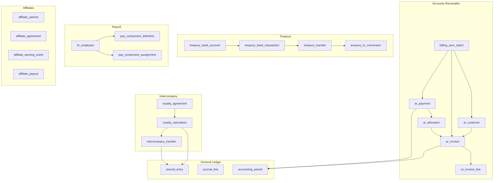
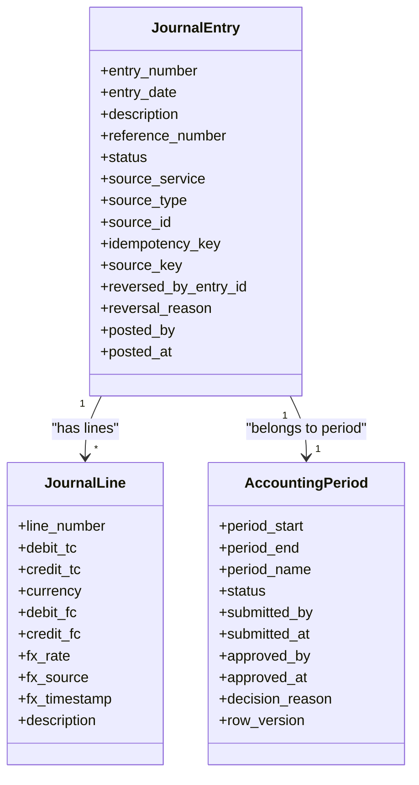
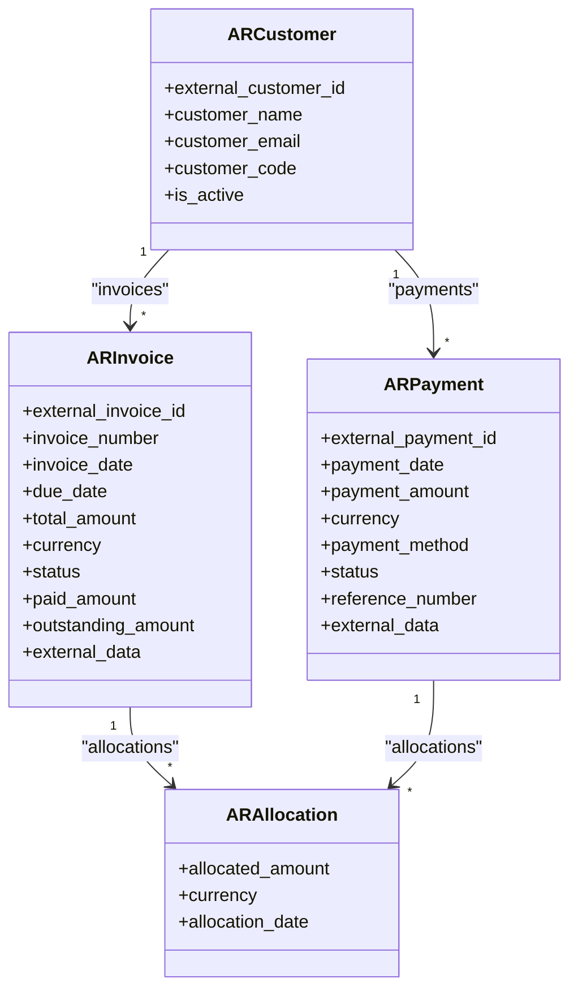
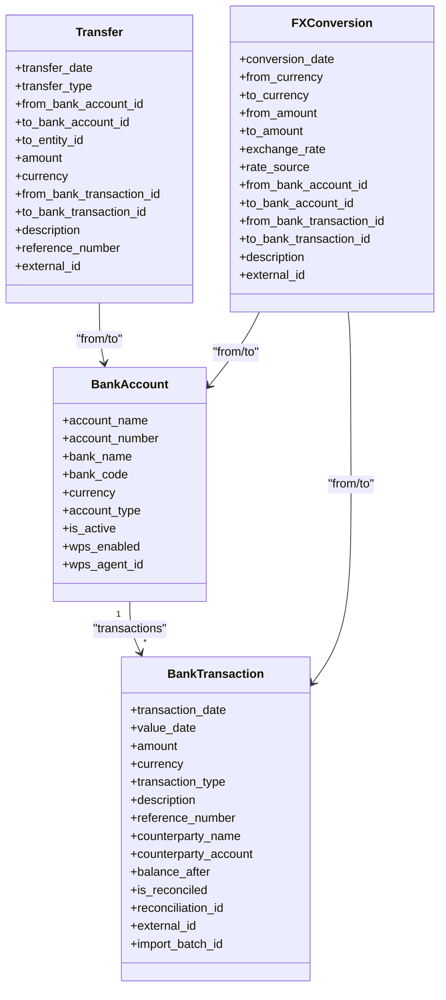
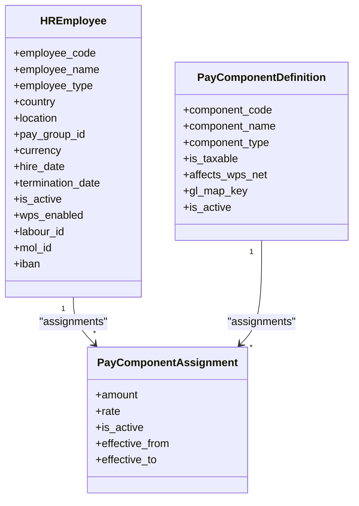
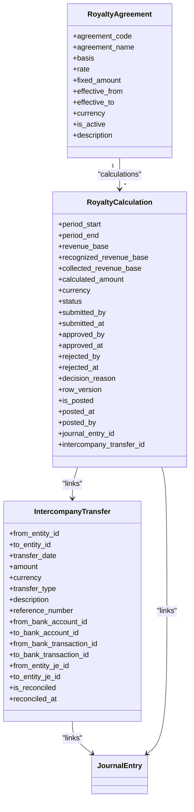
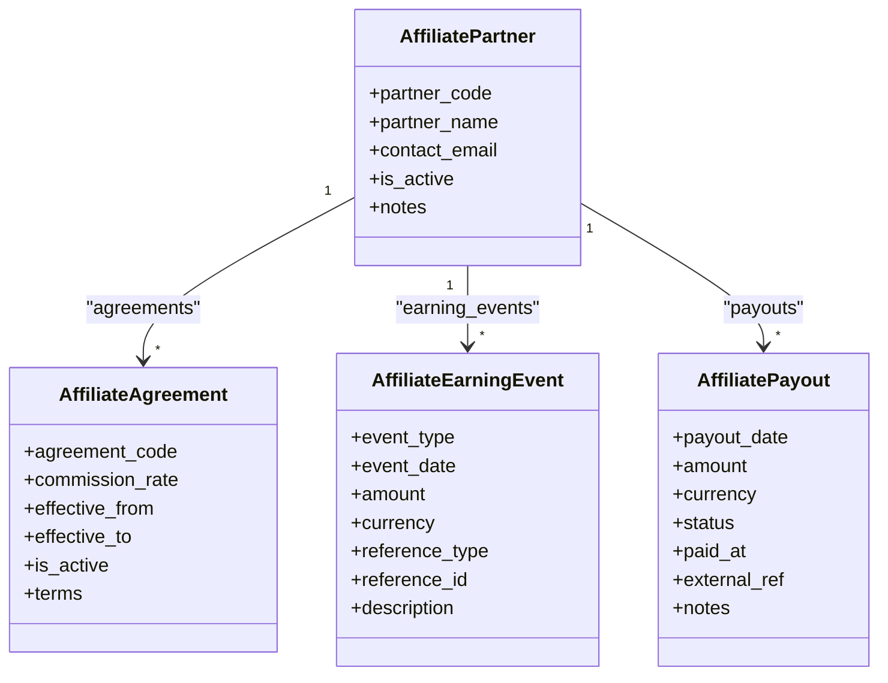
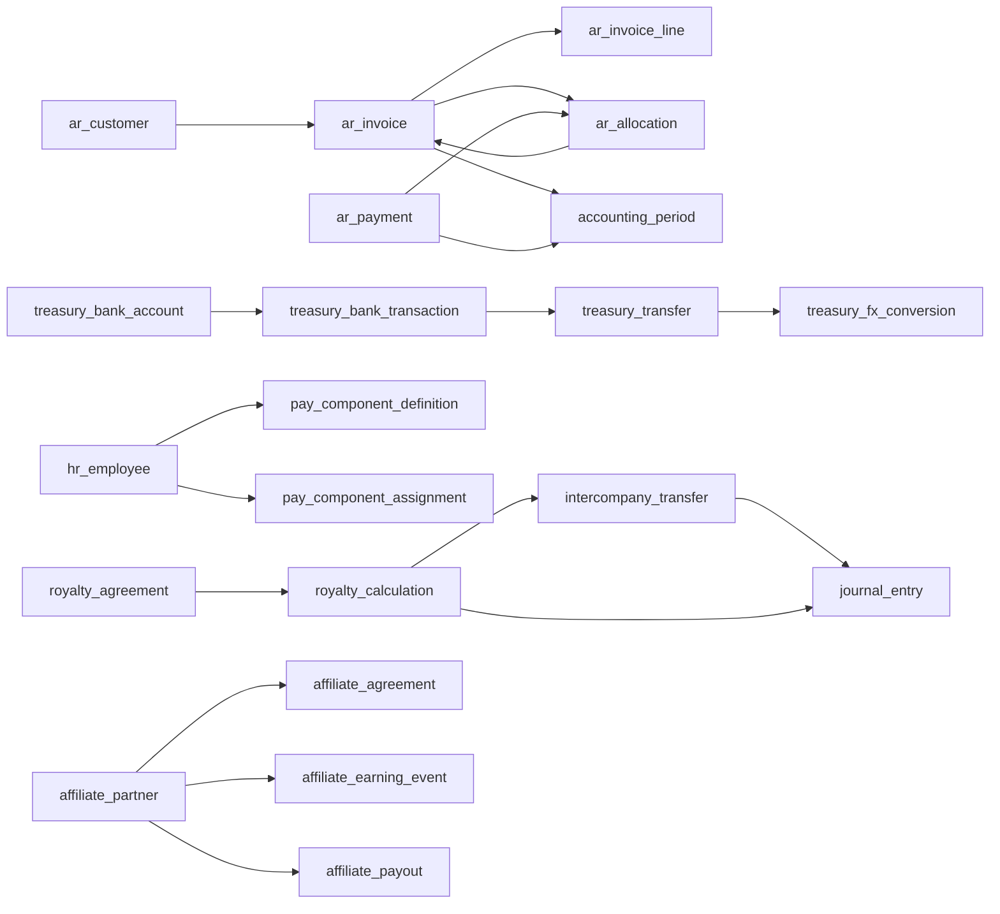

# Business Module Tables

<cite>
**Referenced Files in This Document**
- [journal_entry_model.py](file://app/modules/general_ledger/models/journal_entry_model.py)
- [accounting_period_model.py](file://app/modules/general_ledger/models/accounting_period_model.py)
- [ar_customer_model.py](file://app/modules/ar/models/ar_customer_model.py)
- [ar_invoice_model.py](file://app/modules/ar/models/ar_invoice_model.py)
- [ar_payment_model.py](file://app/modules/ar/models/ar_payment_model.py)
- [billing_sync_batch_model.py](file://app/modules/ar/models/billing_sync_batch_model.py)
- [bank_account_model.py](file://app/modules/treasury/models/bank_account_model.py)
- [bank_transaction_model.py](file://app/modules/treasury/models/bank_transaction_model.py)
- [transfer_model.py](file://app/modules/treasury/models/transfer_model.py)
- [fx_conversion_model.py](file://app/modules/treasury/models/fx_conversion_model.py)
- [employee_model.py](file://app/modules/payroll/models/employee_model.py)
- [pay_component_model.py](file://app/modules/payroll/models/pay_component_model.py)
- [intercompany_transfer_model.py](file://app/modules/intercompany/models/intercompany_transfer_model.py)
- [royalty_model.py](file://app/modules/intercompany/models/royalty_model.py)
- [affiliate_agreement_model.py](file://app/modules/affiliates/models/affiliate_agreement_model.py)
- [affiliate_earning_model.py](file://app/modules/affiliates/models/affiliate_earning_model.py)
- [affiliate_partner_model.py](file://app/modules/affiliates/models/affiliate_partner_model.py)
</cite>

## Table of Contents
1. [Introduction](#introduction)
2. [Project Structure](#project-structure)
3. [Core Components](#core-components)
4. [Architecture Overview](#architecture-overview)
5. [Detailed Component Analysis](#detailed-component-analysis)
6. [Dependency Analysis](#dependency-analysis)
7. [Performance Considerations](#performance-considerations)
8. [Troubleshooting Guide](#troubleshooting-guide)
9. [Conclusion](#conclusion)

## Introduction
This document provides comprehensive documentation for business module tables organized by functional area. It covers:
- General Ledger tables (journal_entry, journal_line, accounting_period) with posting mechanics and validation rules
- Accounts Receivable tables (ar_customer, ar_invoice, ar_payment, ar_allocation) and revenue recognition workflows
- Treasury tables (treasury_bank_account, treasury_bank_transaction, treasury_transfer, treasury_fx_conversion) and cash management processes
- Payroll tables (hr_employee, pay_component_definition, payroll_run) and compensation calculation
- Intercompany tables (intercompany_transfer, royalty) and affiliate management tables

For each module, we explain table relationships, business rules, constraints, and typical data flows.

## Project Structure
The business tables are implemented as SQLAlchemy models under dedicated modules:
- General Ledger: journal_entry, journal_line, accounting_period
- Accounts Receivable: ar_customer, ar_invoice, ar_payment, ar_allocation, billing_sync_batch
- Treasury: treasury_bank_account, treasury_bank_transaction, treasury_transfer, treasury_fx_conversion
- Payroll: hr_employee, pay_component_definition
- Intercompany: intercompany_transfer, royalty_agreement, royalty_calculation
- Affiliates: affiliate_partner, affiliate_agreement, affiliate_earning_event, affiliate_payout



**Diagram sources**
- [journal_entry_model.py](file://app/modules/general_ledger/models/journal_entry_model.py#L17-L128)
- [accounting_period_model.py](file://app/modules/general_ledger/models/accounting_period_model.py#L18-L50)
- [ar_customer_model.py](file://app/modules/ar/models/ar_customer_model.py#L8-L30)
- [ar_invoice_model.py](file://app/modules/ar/models/ar_invoice_model.py#L21-L81)
- [ar_payment_model.py](file://app/modules/ar/models/ar_payment_model.py#L19-L70)
- [billing_sync_batch_model.py](file://app/modules/ar/models/billing_sync_batch_model.py#L10-L40)
- [bank_account_model.py](file://app/modules/treasury/models/bank_account_model.py#L9-L36)
- [bank_transaction_model.py](file://app/modules/treasury/models/bank_transaction_model.py#L21-L52)
- [transfer_model.py](file://app/modules/treasury/models/transfer_model.py#L17-L49)
- [fx_conversion_model.py](file://app/modules/treasury/models/fx_conversion_model.py#L9-L41)
- [employee_model.py](file://app/modules/payroll/models/employee_model.py#L16-L75)
- [pay_component_model.py](file://app/modules/payroll/models/pay_component_model.py#L38-L88)
- [intercompany_transfer_model.py](file://app/modules/intercompany/models/intercompany_transfer_model.py#L16-L59)
- [royalty_model.py](file://app/modules/intercompany/models/royalty_model.py#L27-L98)
- [affiliate_partner_model.py](file://app/modules/affiliates/models/affiliate_partner_model.py#L7-L25)
- [affiliate_agreement_model.py](file://app/modules/affiliates/models/affiliate_agreement_model.py#L9-L27)
- [affiliate_earning_model.py](file://app/modules/affiliates/models/affiliate_earning_model.py#L25-L65)

**Section sources**
- [journal_entry_model.py](file://app/modules/general_ledger/models/journal_entry_model.py#L1-L128)
- [accounting_period_model.py](file://app/modules/general_ledger/models/accounting_period_model.py#L1-L50)
- [ar_customer_model.py](file://app/modules/ar/models/ar_customer_model.py#L1-L30)
- [ar_invoice_model.py](file://app/modules/ar/models/ar_invoice_model.py#L1-L81)
- [ar_payment_model.py](file://app/modules/ar/models/ar_payment_model.py#L1-L70)
- [billing_sync_batch_model.py](file://app/modules/ar/models/billing_sync_batch_model.py#L1-L40)
- [bank_account_model.py](file://app/modules/treasury/models/bank_account_model.py#L1-L36)
- [bank_transaction_model.py](file://app/modules/treasury/models/bank_transaction_model.py#L1-L52)
- [transfer_model.py](file://app/modules/treasury/models/transfer_model.py#L1-L49)
- [fx_conversion_model.py](file://app/modules/treasury/models/fx_conversion_model.py#L1-L41)
- [employee_model.py](file://app/modules/payroll/models/employee_model.py#L1-L75)
- [pay_component_model.py](file://app/modules/payroll/models/pay_component_model.py#L1-L88)
- [intercompany_transfer_model.py](file://app/modules/intercompany/models/intercompany_transfer_model.py#L1-L59)
- [royalty_model.py](file://app/modules/intercompany/models/royalty_model.py#L1-L98)
- [affiliate_partner_model.py](file://app/modules/affiliates/models/affiliate_partner_model.py#L1-L25)
- [affiliate_agreement_model.py](file://app/modules/affiliates/models/affiliate_agreement_model.py#L1-L27)
- [affiliate_earning_model.py](file://app/modules/affiliates/models/affiliate_earning_model.py#L1-L65)

## Core Components
This section summarizes the primary tables and their responsibilities across modules.

- General Ledger
  - journal_entry: Encapsulates ledger entries with source tracking, idempotency keys, and reversal metadata.
  - journal_line: Records individual debit/credit lines with transaction and functional currency amounts and FX details.
  - accounting_period: Defines monthly accounting periods with status and approval fields.

- Accounts Receivable
  - ar_customer: Master of customers synchronized from Billing with external IDs.
  - ar_invoice: Invoices synchronized from Billing with statuses and outstanding amounts.
  - ar_payment: Payments synchronized from Billing with allocation records to invoices.
  - ar_allocation: Links payments to invoices with allocated amounts.
  - billing_sync_batch: Tracks idempotent sync batches for customers, invoices, and payments.

- Treasury
  - treasury_bank_account: Bank account master per legal entity with WPS support.
  - treasury_bank_transaction: Bank statement lines with reconciliation flags and indexes.
  - treasury_transfer: Transfers between entities/accounts with treasury linkage.
  - treasury_fx_conversion: Realized FX conversions with optional bank account/transaction linkage.

- Payroll
  - hr_employee: Employee master with type, location, pay group, and WPS fields.
  - pay_component_definition: Standard component definitions (earnings, deductions, employer contributions).
  - pay_component_assignment: Assignments of components to employees with rates/amounts and validity dates.

- Intercompany
  - intercompany_transfer: Inter-entity transfers with treasury and journal entry linkage.
  - royalty_agreement: Agreements with calculation basis and rates.
  - royalty_calculation: Periodic calculations with approval workflow and posting fields.

- Affiliates
  - affiliate_partner: External partners in the affiliate program.
  - affiliate_agreement: Terms per partner with commission rates and validity.
  - affiliate_earning_event: Events credited to partners (signup, revenue, subscription).
  - affiliate_payout: Payout batches with status tracking.

**Section sources**
- [journal_entry_model.py](file://app/modules/general_ledger/models/journal_entry_model.py#L17-L128)
- [accounting_period_model.py](file://app/modules/general_ledger/models/accounting_period_model.py#L18-L50)
- [ar_customer_model.py](file://app/modules/ar/models/ar_customer_model.py#L8-L30)
- [ar_invoice_model.py](file://app/modules/ar/models/ar_invoice_model.py#L21-L81)
- [ar_payment_model.py](file://app/modules/ar/models/ar_payment_model.py#L19-L70)
- [billing_sync_batch_model.py](file://app/modules/ar/models/billing_sync_batch_model.py#L10-L40)
- [bank_account_model.py](file://app/modules/treasury/models/bank_account_model.py#L9-L36)
- [bank_transaction_model.py](file://app/modules/treasury/models/bank_transaction_model.py#L21-L52)
- [transfer_model.py](file://app/modules/treasury/models/transfer_model.py#L17-L49)
- [fx_conversion_model.py](file://app/modules/treasury/models/fx_conversion_model.py#L9-L41)
- [employee_model.py](file://app/modules/payroll/models/employee_model.py#L16-L75)
- [pay_component_model.py](file://app/modules/payroll/models/pay_component_model.py#L38-L88)
- [intercompany_transfer_model.py](file://app/modules/intercompany/models/intercompany_transfer_model.py#L16-L59)
- [royalty_model.py](file://app/modules/intercompany/models/royalty_model.py#L27-L98)
- [affiliate_partner_model.py](file://app/modules/affiliates/models/affiliate_partner_model.py#L7-L25)
- [affiliate_agreement_model.py](file://app/modules/affiliates/models/affiliate_agreement_model.py#L9-L27)
- [affiliate_earning_model.py](file://app/modules/affiliates/models/affiliate_earning_model.py#L25-L65)

## Architecture Overview
The modules are designed around domain-driven models with explicit relationships and constraints. Posting flows often connect AR/Treasury to General Ledger journal entries, while intercompany and royalty workflows tie back to journal entries and transfers.

```mermaid
graph TB
subgraph "AR"
AC["ar_customer"]
AI["ar_invoice"]
AR["ar_payment"]
AA["ar_allocation"]
end
subgraph "Treasury"
BA["treasury_bank_account"]
BT["treasury_bank_transaction"]
TR["treasury_transfer"]
FX["treasury_fx_conversion"]
end
subgraph "GL"
JE["journal_entry"]
JL["journal_line"]
AP["accounting_period"]
end
AC --> AI
AI --> AA
AR --> AA
AA --> JE
BT --> JE
TR --> JE
FX --> JE
AI --> AP
AR --> AP
```

**Diagram sources**
- [ar_customer_model.py](file://app/modules/ar/models/ar_customer_model.py#L8-L30)
- [ar_invoice_model.py](file://app/modules/ar/models/ar_invoice_model.py#L21-L81)
- [ar_payment_model.py](file://app/modules/ar/models/ar_payment_model.py#L19-L70)
- [bank_account_model.py](file://app/modules/treasury/models/bank_account_model.py#L9-L36)
- [bank_transaction_model.py](file://app/modules/treasury/models/bank_transaction_model.py#L21-L52)
- [transfer_model.py](file://app/modules/treasury/models/transfer_model.py#L17-L49)
- [fx_conversion_model.py](file://app/modules/treasury/models/fx_conversion_model.py#L9-L41)
- [journal_entry_model.py](file://app/modules/general_ledger/models/journal_entry_model.py#L17-L128)
- [accounting_period_model.py](file://app/modules/general_ledger/models/accounting_period_model.py#L18-L50)

## Detailed Component Analysis

### General Ledger Tables
- journal_entry
  - Purpose: Stores ledger entries with source tracking, idempotency, and reversal metadata.
  - Key fields: entry_number, entry_date, description, reference_number, status, source_service/type/id, idempotency_key, source_key, reversed_by_entry_id, posted_by/posted_at.
  - Constraints: Unique combination of legal_entity_id, book_id, and source_key; comment indicates immutability after posting.
  - Relationships: Back-populates book, period, lines; reversible entries link via reversed_by_entry_id.
  - Validation rules:
    - Status lifecycle: DRAFT → POSTED; can be REVERSED by linking another entry.
    - Source tracking ensures deterministic posting via source_key and idempotency_key.
- journal_line
  - Purpose: Records individual GL line items with transaction and functional currency amounts and FX details.
  - Key fields: debit_tc/credit_tc, currency, debit_fc/credit_fc, fx_rate/source/timestamp, description.
  - Constraints: Non-negative amounts; exactly one side must be zero (dr_or_cr); unique line number per entry.
  - Relationships: Belongs to journal_entry, Book, GLAccount; dimensions via JournalLineDimension.
  - Validation rules:
    - Debits equal credits enforced by constraints.
    - FX rate and source recorded for audit and revaluation.
- accounting_period
  - Purpose: Monthly accounting periods with status and approval workflow fields.
  - Key fields: book_id, period_start, period_end, period_name, status, submitted/approved fields, row_version.
  - Constraints: Unique period_start per book; comment indicates monthly periods per book.
  - Relationships: Back-populates book, journal_entries; used to constrain posting dates.



**Diagram sources**
- [journal_entry_model.py](file://app/modules/general_ledger/models/journal_entry_model.py#L17-L128)
- [accounting_period_model.py](file://app/modules/general_ledger/models/accounting_period_model.py#L18-L50)

**Section sources**
- [journal_entry_model.py](file://app/modules/general_ledger/models/journal_entry_model.py#L17-L128)
- [accounting_period_model.py](file://app/modules/general_ledger/models/accounting_period_model.py#L18-L50)

### Accounts Receivable Tables
- ar_customer
  - Purpose: Customer master synchronized from Billing with external IDs.
  - Key fields: external_customer_id (unique), customer_name, customer_email, customer_code, is_active.
  - Relationships: LegalEntity; cascading invoices and payments.
- ar_invoice
  - Purpose: Invoice synchronized from Billing with statuses and outstanding amounts.
  - Key fields: external_invoice_id (unique), invoice_number (unique), invoice_date, due_date, total_amount, currency, status, paid_amount, outstanding_amount, external_data.
  - Relationships: LegalEntity; ARCustomer; cascading lines and allocations.
  - Constraints: Outstanding computed as total - paid; unique invoice_number and external_invoice_id.
- ar_payment
  - Purpose: Payment synchronized from Billing with allocation records.
  - Key fields: external_payment_id (unique), payment_date, payment_amount, currency, payment_method, status, reference_number, external_data.
  - Relationships: LegalEntity; ARCustomer; cascading allocations.
- ar_allocation
  - Purpose: Allocation of payments to invoices.
  - Key fields: ar_payment_id, ar_invoice_id, allocated_amount, currency, allocation_date.
  - Relationships: ARPayment; ARInvoice.
  - Constraints: Unique payment/invoice pair.
- billing_sync_batch
  - Purpose: Idempotent sync tracking for Billing entities.
  - Key fields: batch_number (unique), status, cursor_start/end, counts, timestamps, error_message.
  - Relationships: LegalEntity, Book.



**Diagram sources**
- [ar_customer_model.py](file://app/modules/ar/models/ar_customer_model.py#L8-L30)
- [ar_invoice_model.py](file://app/modules/ar/models/ar_invoice_model.py#L21-L81)
- [ar_payment_model.py](file://app/modules/ar/models/ar_payment_model.py#L19-L70)
- [billing_sync_batch_model.py](file://app/modules/ar/models/billing_sync_batch_model.py#L10-L40)

**Section sources**
- [ar_customer_model.py](file://app/modules/ar/models/ar_customer_model.py#L8-L30)
- [ar_invoice_model.py](file://app/modules/ar/models/ar_invoice_model.py#L21-L81)
- [ar_payment_model.py](file://app/modules/ar/models/ar_payment_model.py#L19-L70)
- [billing_sync_batch_model.py](file://app/modules/ar/models/billing_sync_batch_model.py#L10-L40)

### Treasury Tables
- treasury_bank_account
  - Purpose: Bank account master per legal entity with WPS support.
  - Key fields: account_name, account_number, bank_name, bank_code, currency, account_type, is_active, wps_enabled/wps_agent_id.
  - Relationships: LegalEntity; cascading transactions and reconciliations.
- treasury_bank_transaction
  - Purpose: Bank statement line items with reconciliation and indexing.
  - Key fields: transaction_date, value_date, amount (+deposit, -withdrawal), currency, transaction_type, description, reference_number, counterparty, balance_after, is_reconciled, reconciliation_id, external_id, import_batch_id.
  - Constraints: Composite indexes on account/date and account/reconciled; comment indicates statement transactions.
- treasury_transfer
  - Purpose: Transfers between entities/accounts; supports intercompany, intra-entity, and external.
  - Key fields: transfer_date, transfer_type, from/to bank accounts/entities, amount/currency, from/to bank transactions, description, reference_number, external_id.
  - Relationships: LegalEntity (from/to), BankAccount (from/to), BankTransaction (from/to).
- treasury_fx_conversion
  - Purpose: Realized FX conversions with optional bank linkage.
  - Key fields: conversion_date, from/to currency/amount, exchange_rate, rate_source, from/to bank accounts/transactions, description, external_id.
  - Relationships: LegalEntity; BankAccount (from/to); BankTransaction (from/to).



**Diagram sources**
- [bank_account_model.py](file://app/modules/treasury/models/bank_account_model.py#L9-L36)
- [bank_transaction_model.py](file://app/modules/treasury/models/bank_transaction_model.py#L21-L52)
- [transfer_model.py](file://app/modules/treasury/models/transfer_model.py#L17-L49)
- [fx_conversion_model.py](file://app/modules/treasury/models/fx_conversion_model.py#L9-L41)

**Section sources**
- [bank_account_model.py](file://app/modules/treasury/models/bank_account_model.py#L9-L36)
- [bank_transaction_model.py](file://app/modules/treasury/models/bank_transaction_model.py#L21-L52)
- [transfer_model.py](file://app/modules/treasury/models/transfer_model.py#L17-L49)
- [fx_conversion_model.py](file://app/modules/treasury/models/fx_conversion_model.py#L9-L41)

### Payroll Tables
- hr_employee
  - Purpose: Employee master with type, location, pay group, and WPS fields.
  - Key fields: employee_code (unique), employee_name, employee_type, country, location, pay_group_id, currency, hire_date, termination_date, is_active, wps_enabled/labour_id/mol_id/iban.
  - Relationships: LegalEntity; PayGroup; cascading bank details, component assignments, payroll runs, commission ledger.
- pay_component_definition
  - Purpose: Standard component definitions (earnings, deductions, employer contributions).
  - Key fields: component_code (unique per entity), component_name, component_type, is_taxable, affects_wps_net, gl_map_key, is_active.
  - Relationships: LegalEntity; cascading assignments and run lines.
- pay_component_assignment
  - Purpose: Assignments of components to employees with rates/amounts and validity dates.
  - Key fields: hr_employee_id, pay_component_id, amount, rate, is_active, effective_from, effective_to.
  - Constraints: Unique employee/component pair; comment indicates assignments to employees.



**Diagram sources**
- [employee_model.py](file://app/modules/payroll/models/employee_model.py#L16-L75)
- [pay_component_model.py](file://app/modules/payroll/models/pay_component_model.py#L38-L88)

**Section sources**
- [employee_model.py](file://app/modules/payroll/models/employee_model.py#L16-L75)
- [pay_component_model.py](file://app/modules/payroll/models/pay_component_model.py#L38-L88)

### Intercompany Tables
- intercompany_transfer
  - Purpose: Inter-entity transfers with treasury and journal entry linkage.
  - Key fields: from/to entity, transfer_date, amount/currency, transfer_type, description/reference_number; treasury links; reconciliation flags.
  - Relationships: LegalEntity (from/to), BankAccount (from/to), BankTransaction (from/to), JournalEntry (from/to).
- royalty_agreement
  - Purpose: Agreements between entities with calculation basis and rates.
  - Key fields: from/to entity, agreement_code (unique), agreement_name, basis (REVENUE/RECOGNIZED/collected/FIXED), rate/fixed_amount, effective dates, currency, is_active, description.
  - Relationships: LegalEntity (from/to); cascading royalty calculations.
- royalty_calculation
  - Purpose: Periodic royalty calculations with approval workflow and posting fields.
  - Key fields: royalty_agreement_id, period_start/end, revenue bases, calculated_amount, currency; status with approval workflow; legacy posting fields; links to journal_entry and intercompany_transfer.



**Diagram sources**
- [intercompany_transfer_model.py](file://app/modules/intercompany/models/intercompany_transfer_model.py#L16-L59)
- [royalty_model.py](file://app/modules/intercompany/models/royalty_model.py#L27-L98)

**Section sources**
- [intercompany_transfer_model.py](file://app/modules/intercompany/models/intercompany_transfer_model.py#L16-L59)
- [royalty_model.py](file://app/modules/intercompany/models/royalty_model.py#L27-L98)

### Affiliate Management Tables
- affiliate_partner
  - Purpose: External partners in the affiliate program.
  - Key fields: partner_code (unique), partner_name, contact_email, is_active, notes.
  - Relationships: Cascading agreements, earning events, payouts.
- affiliate_agreement
  - Purpose: Terms per partner with commission rates and validity.
  - Key fields: partner_id, agreement_code (unique), commission_rate, effective dates, is_active, terms.
  - Relationships: AffiliatePartner.
- affiliate_earning_event
  - Purpose: Events credited to partners (signup, revenue, subscription).
  - Key fields: partner_id, event_type, event_date, amount, currency, reference_type/reference_id, description.
  - Relationships: AffiliatePartner.
- affiliate_payout
  - Purpose: Payout batches with status tracking.
  - Key fields: partner_id, payout_date, amount, currency, status, paid_at, external_ref, notes.
  - Relationships: AffiliatePartner.



**Diagram sources**
- [affiliate_partner_model.py](file://app/modules/affiliates/models/affiliate_partner_model.py#L7-L25)
- [affiliate_agreement_model.py](file://app/modules/affiliates/models/affiliate_agreement_model.py#L9-L27)
- [affiliate_earning_model.py](file://app/modules/affiliates/models/affiliate_earning_model.py#L25-L65)

**Section sources**
- [affiliate_partner_model.py](file://app/modules/affiliates/models/affiliate_partner_model.py#L7-L25)
- [affiliate_agreement_model.py](file://app/modules/affiliates/models/affiliate_agreement_model.py#L9-L27)
- [affiliate_earning_model.py](file://app/modules/affiliates/models/affiliate_earning_model.py#L25-L65)

## Dependency Analysis
This section highlights key dependencies and relationships across modules.



**Diagram sources**
- [ar_customer_model.py](file://app/modules/ar/models/ar_customer_model.py#L8-L30)
- [ar_invoice_model.py](file://app/modules/ar/models/ar_invoice_model.py#L21-L81)
- [ar_payment_model.py](file://app/modules/ar/models/ar_payment_model.py#L19-L70)
- [bank_account_model.py](file://app/modules/treasury/models/bank_account_model.py#L9-L36)
- [bank_transaction_model.py](file://app/modules/treasury/models/bank_transaction_model.py#L21-L52)
- [transfer_model.py](file://app/modules/treasury/models/transfer_model.py#L17-L49)
- [fx_conversion_model.py](file://app/modules/treasury/models/fx_conversion_model.py#L9-L41)
- [employee_model.py](file://app/modules/payroll/models/employee_model.py#L16-L75)
- [pay_component_model.py](file://app/modules/payroll/models/pay_component_model.py#L38-L88)
- [intercompany_transfer_model.py](file://app/modules/intercompany/models/intercompany_transfer_model.py#L16-L59)
- [royalty_model.py](file://app/modules/intercompany/models/royalty_model.py#L27-L98)
- [journal_entry_model.py](file://app/modules/general_ledger/models/journal_entry_model.py#L17-L128)
- [affiliate_partner_model.py](file://app/modules/affiliates/models/affiliate_partner_model.py#L7-L25)
- [affiliate_agreement_model.py](file://app/modules/affiliates/models/affiliate_agreement_model.py#L9-L27)
- [affiliate_earning_model.py](file://app/modules/affiliates/models/affiliate_earning_model.py#L25-L65)

**Section sources**
- [ar_customer_model.py](file://app/modules/ar/models/ar_customer_model.py#L8-L30)
- [ar_invoice_model.py](file://app/modules/ar/models/ar_invoice_model.py#L21-L81)
- [ar_payment_model.py](file://app/modules/ar/models/ar_payment_model.py#L19-L70)
- [bank_account_model.py](file://app/modules/treasury/models/bank_account_model.py#L9-L36)
- [bank_transaction_model.py](file://app/modules/treasury/models/bank_transaction_model.py#L21-L52)
- [transfer_model.py](file://app/modules/treasury/models/transfer_model.py#L17-L49)
- [fx_conversion_model.py](file://app/modules/treasury/models/fx_conversion_model.py#L9-L41)
- [employee_model.py](file://app/modules/payroll/models/employee_model.py#L16-L75)
- [pay_component_model.py](file://app/modules/payroll/models/pay_component_model.py#L38-L88)
- [intercompany_transfer_model.py](file://app/modules/intercompany/models/intercompany_transfer_model.py#L16-L59)
- [royalty_model.py](file://app/modules/intercompany/models/royalty_model.py#L27-L98)
- [journal_entry_model.py](file://app/modules/general_ledger/models/journal_entry_model.py#L17-L128)
- [affiliate_partner_model.py](file://app/modules/affiliates/models/affiliate_partner_model.py#L7-L25)
- [affiliate_agreement_model.py](file://app/modules/affiliates/models/affiliate_agreement_model.py#L9-L27)
- [affiliate_earning_model.py](file://app/modules/affiliates/models/affiliate_earning_model.py#L25-L65)

## Performance Considerations
- Indexes and constraints
  - Journal entries and lines use indexes on legal_entity_id, book_id, and source_key to ensure fast lookups and idempotency.
  - Treasury bank transactions leverage composite indexes on account/date and account/reconciled to optimize reconciliation queries.
- Immutability and idempotency
  - Journal entries are marked immutable after posting; source_key and idempotency_key prevent duplicate postings.
- Currency and FX
  - Separate transaction and functional currency fields reduce conversion overhead during posting; FX rate source and timestamp enable auditability.
- Partitioning and aggregation
  - Monthly accounting periods facilitate period-end processing and reporting; consider partitioning strategies for large datasets.

[No sources needed since this section provides general guidance]

## Troubleshooting Guide
- Journal Entry Issues
  - Symptom: Posting fails due to imbalance.
  - Action: Verify journal_line constraints enforce exactly one side positive and non-negative values; check FX rate and currency consistency.
- Duplicate Postings
  - Symptom: Duplicate journal entries appear.
  - Action: Confirm unique source_key and idempotency_key; review posting service logic to avoid reprocessing.
- AR Allocation Discrepancies
  - Symptom: Payments not fully applied to invoices.
  - Action: Check ARAllocation uniqueness and totals against payment/invoice amounts; reconcile partial payments and statuses.
- Treasury Reconciliation Gaps
  - Symptom: Transactions not marking as reconciled.
  - Action: Ensure is_reconciled flag and reconciliation_id are set; confirm indexes are utilized for reconciliation queries.
- Intercompany Transfer Mismatches
  - Symptom: Transfer balances mismatch between entities.
  - Action: Validate from/to journal entries and intercompany_transfer linkage; verify reconciliation flags and dates.
- Affiliate Payout Status Stalls
  - Symptom: Payouts remain pending.
  - Action: Review approval workflow fields and status transitions; confirm external_ref linkage to transfers.

**Section sources**
- [journal_entry_model.py](file://app/modules/general_ledger/models/journal_entry_model.py#L17-L128)
- [ar_payment_model.py](file://app/modules/ar/models/ar_payment_model.py#L19-L70)
- [bank_transaction_model.py](file://app/modules/treasury/models/bank_transaction_model.py#L21-L52)
- [intercompany_transfer_model.py](file://app/modules/intercompany/models/intercompany_transfer_model.py#L16-L59)
- [affiliate_earning_model.py](file://app/modules/affiliates/models/affiliate_earning_model.py#L25-L65)

## Conclusion
This documentation outlines the business module tables, their relationships, constraints, and typical flows across General Ledger, Accounts Receivable, Treasury, Payroll, Intercompany, and Affiliates. By adhering to the documented constraints and validation rules, organizations can maintain accurate financial records, streamline posting workflows, and support robust intercompany and affiliate management processes.

[No sources needed since this section summarizes without analyzing specific files]