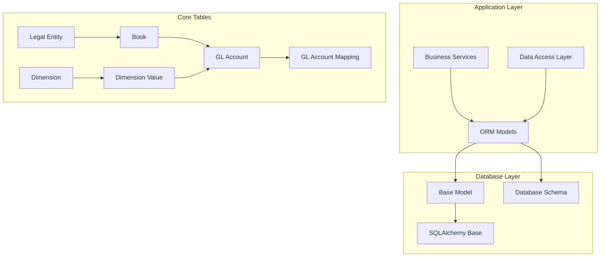
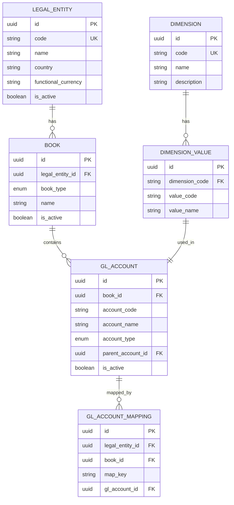
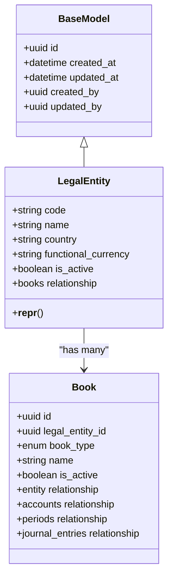
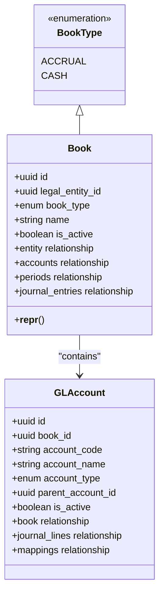
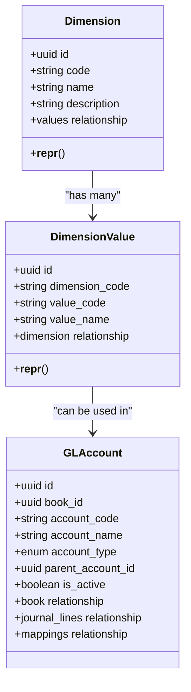
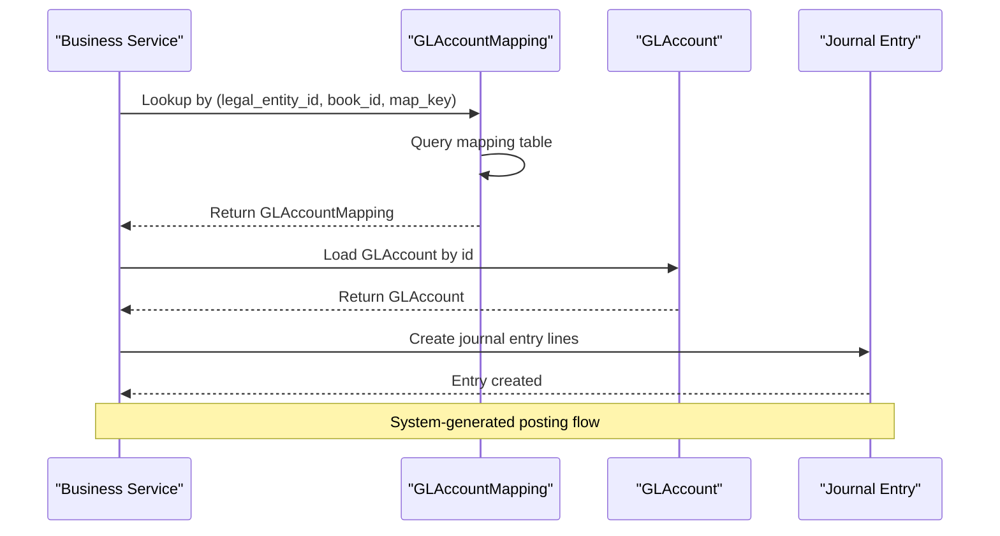
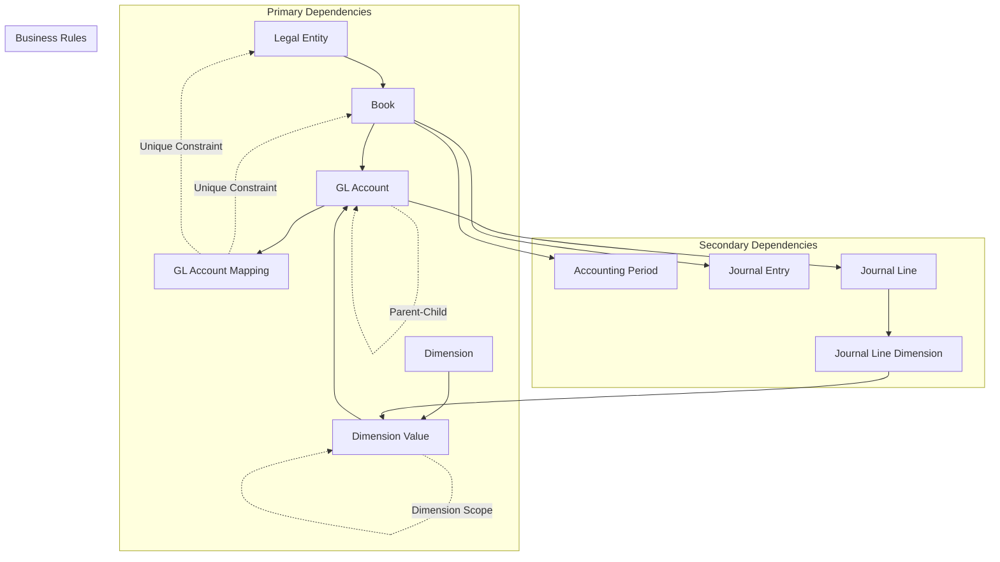

# Core Tables

<cite>
**Referenced Files in This Document**
- [legal_entity_model.py](file://app/modules/general_ledger/models/legal_entity_model.py)
- [book_model.py](file://app/modules/general_ledger/models/book_model.py)
- [dimension_model.py](file://app/modules/general_ledger/models/dimension_model.py)
- [gl_account_model.py](file://app/modules/general_ledger/models/gl_account_model.py)
- [fm_schema.sql](file://database/fm_schema.sql)
- [base_model.py](file://app/shared/models/base_model.py)
- [db_metadata.py](file://app/core/db_metadata.py)
- [coa_service.py](file://app/modules/general_ledger/services/coa_service.py)
- [coa_schemas.py](file://app/modules/general_ledger/schemas/coa_schemas.py)
</cite>

## Table of Contents
1. [Introduction](#introduction)
2. [Project Structure](#project-structure)
3. [Core Components](#core-components)
4. [Architecture Overview](#architecture-overview)
5. [Detailed Component Analysis](#detailed-component-analysis)
6. [Dependency Analysis](#dependency-analysis)
7. [Performance Considerations](#performance-considerations)
8. [Troubleshooting Guide](#troubleshooting-guide)
9. [Conclusion](#conclusion)

## Introduction

This document provides comprehensive documentation for the core system tables that form the foundation of the TrueVow Financial Management system. These tables enable multi-entity accounting, multi-book support, flexible dimension tagging, and automated posting through GL account mapping. The four primary tables covered are:

- Legal Entity: Represents companies or legal entities within the system
- Book: Defines accounting books (accrual vs cash basis) per legal entity
- Dimension and Dimension Value: Provide flexible tagging and reporting capabilities
- GL Account Mapping: Enables system-generated posting automation

These tables work together to support complex financial operations across multiple business units while maintaining data integrity and performance through strategic indexing and constraints.

## Project Structure

The core tables are implemented using SQLAlchemy ORM models with PostgreSQL backend. The architecture follows a layered approach:

**Diagram sources**
- [legal_entity_model.py](file://app/modules/general_ledger/models/legal_entity_model.py#L1-L22)
- [book_model.py](file://app/modules/general_ledger/models/book_model.py#L1-L36)
- [dimension_model.py](file://app/modules/general_ledger/models/dimension_model.py#L1-L40)
- [gl_account_model.py](file://app/modules/general_ledger/models/gl_account_model.py#L1-L80)
- [base_model.py](file://app/shared/models/base_model.py#L1-L18)
- [db_metadata.py](file://app/core/db_metadata.py#L1-L10)

**Section sources**
- [legal_entity_model.py](file://app/modules/general_ledger/models/legal_entity_model.py#L1-L22)
- [book_model.py](file://app/modules/general_ledger/models/book_model.py#L1-L36)
- [dimension_model.py](file://app/modules/general_ledger/models/dimension_model.py#L1-L40)
- [gl_account_model.py](file://app/modules/general_ledger/models/gl_account_model.py#L1-L80)
- [base_model.py](file://app/shared/models/base_model.py#L1-L18)
- [db_metadata.py](file://app/core/db_metadata.py#L1-L10)

## Core Components

### Legal Entity Table

The Legal Entity table represents individual companies or legal entities within the organization. It serves as the top-level organizational unit for multi-entity accounting.

**Table Structure:**
- `id`: UUID primary key with auto-generated values
- `code`: Unique string identifier (max 50 chars)
- `name`: Entity name (max 255 chars)
- `country`: Country code (max 10 chars)
- `functional_currency`: Base currency code (3 chars)
- `is_active`: Boolean flag for entity status

**Business Rules:**
- Code must be unique across all entities
- Country and functional_currency follow ISO standards
- Default active status is true
- All entities must have a valid currency code

**Relationships:**
- One-to-many with Book table (books)
- Cascade delete-orphan for child records

**Section sources**
- [legal_entity_model.py](file://app/modules/general_ledger/models/legal_entity_model.py#L7-L22)
- [fm_schema.sql](file://database/fm_schema.sql#L129-L143)

### Book Table

The Book table defines accounting books for each legal entity, supporting both accrual and cash basis accounting methods.

**Table Structure:**
- `id`: UUID primary key
- `legal_entity_id`: Foreign key to Legal Entity
- `book_type`: Enum with ACCRUAL or CASH values
- `name`: Book name (max 255 chars)
- `is_active`: Boolean flag

**Business Rules:**
- Each legal entity can have multiple books
- Book type determines accounting method
- Books are isolated per legal entity
- Default active status is true

**Relationships:**
- Many-to-one with Legal Entity (entity)
- One-to-many with GL Account (accounts)
- One-to-many with Accounting Period (periods)
- One-to-many with Journal Entry (journal_entries)

**Section sources**
- [book_model.py](file://app/modules/general_ledger/models/book_model.py#L15-L36)
- [fm_schema.sql](file://database/fm_schema.sql#L145-L158)

### Dimension and Dimension Value Tables

The Dimension and Dimension Value tables provide a flexible tagging system for financial reporting and analysis.

**Dimension Table:**
- `id`: UUID primary key
- `code`: Unique dimension code (max 50 chars)
- `name`: Dimension display name (max 255 chars)
- `description`: Optional description (max 500 chars)

**Dimension Value Table:**
- `id`: UUID primary key
- `dimension_code`: Foreign key to Dimension.code
- `value_code`: Internal value identifier (max 50 chars)
- `value_name`: Display name for the value (max 255 chars)

**Business Rules:**
- Dimension codes must be unique
- Dimension values are scoped to specific dimensions
- Values can be reused across different dimensions
- Hierarchical relationships can be established through naming conventions

**Relationships:**
- Dimension has one-to-many DimensionValue relationships
- DimensionValue belongs to Dimension

**Section sources**
- [dimension_model.py](file://app/modules/general_ledger/models/dimension_model.py#L8-L40)
- [fm_schema.sql](file://database/fm_schema.sql#L160-L186)

### GL Account Mapping Table

The GL Account Mapping table enables system-generated posting automation by linking business keys to specific GL accounts.

**Table Structure:**
- `id`: UUID primary key
- `legal_entity_id`: Foreign key to Legal Entity
- `book_id`: Foreign key to Book
- `map_key`: Business key identifier (max 100 chars)
- `gl_account_id`: Foreign key to GL Account

**Business Rules:**
- Composite unique constraint on (legal_entity_id, book_id, map_key)
- Prevents duplicate mappings for the same business key
- Ensures mappings are specific to legal entity and book combinations
- Supports system automation for recurring transactions

**Relationships:**
- Maps to GL Account (account)
- Links business logic to specific GL accounts

**Section sources**
- [gl_account_model.py](file://app/modules/general_ledger/models/gl_account_model.py#L61-L80)
- [fm_schema.sql](file://database/fm_schema.sql#L207-L220)

## Architecture Overview

The core tables form a hierarchical data model that supports multi-entity, multi-book financial operations:

**Diagram sources**
- [legal_entity_model.py](file://app/modules/general_ledger/models/legal_entity_model.py#L7-L22)
- [book_model.py](file://app/modules/general_ledger/models/book_model.py#L15-L36)
- [dimension_model.py](file://app/modules/general_ledger/models/dimension_model.py#L8-L40)
- [gl_account_model.py](file://app/modules/general_ledger/models/gl_account_model.py#L28-L80)
- [fm_schema.sql](file://database/fm_schema.sql#L129-L220)

## Detailed Component Analysis

### Legal Entity Implementation

The Legal Entity model extends the base model and provides essential organizational structure:

**Key Features:**
- Unique code enforcement ensures entity identification
- Functional currency supports multi-currency operations
- Active flag enables entity lifecycle management
- Relationship cascading maintains data integrity

**Diagram sources**
- [legal_entity_model.py](file://app/modules/general_ledger/models/legal_entity_model.py#L7-L22)
- [base_model.py](file://app/shared/models/base_model.py#L9-L18)

**Section sources**
- [legal_entity_model.py](file://app/modules/general_ledger/models/legal_entity_model.py#L7-L22)
- [base_model.py](file://app/shared/models/base_model.py#L9-L18)

### Book Implementation and Multi-Book Support

The Book model supports dual accounting methodologies within each legal entity:

**Multi-Book Architecture:**
- Each legal entity can maintain separate accrual and cash basis books
- GL accounts are isolated per book to prevent cross-book contamination
- Journal entries are constrained to specific books
- Periods operate independently within each book

**Diagram sources**
- [book_model.py](file://app/modules/general_ledger/models/book_model.py#L9-L36)
- [gl_account_model.py](file://app/modules/general_ledger/models/gl_account_model.py#L28-L58)

**Section sources**
- [book_model.py](file://app/modules/general_ledger/models/book_model.py#L9-L36)
- [gl_account_model.py](file://app/modules/general_ledger/models/gl_account_model.py#L28-L58)

### Dimension System for Flexible Tagging

The dimension system provides a scalable tagging mechanism for financial reporting:

**Dimension Usage Patterns:**
- Cost centers, departments, locations for expense tracking
- Product lines, regions for revenue analysis
- Custom business segments for operational reporting
- Hierarchical relationships through naming conventions

**Diagram sources**
- [dimension_model.py](file://app/modules/general_ledger/models/dimension_model.py#L8-L40)
- [gl_account_model.py](file://app/modules/general_ledger/models/gl_account_model.py#L28-L58)

**Section sources**
- [dimension_model.py](file://app/modules/general_ledger/models/dimension_model.py#L8-L40)

### GL Account Mapping for System Automation

The GL Account Mapping table enables automated posting through business key resolution:

**Mapping Resolution Process:**
1. Business service requests mapping for specific business key
2. System queries GL Account Mapping table
3. Returns associated GL account for posting
4. Journal entry created with resolved account

**Diagram sources**
- [gl_account_model.py](file://app/modules/general_ledger/models/gl_account_model.py#L61-L80)
- [coa_service.py](file://app/modules/general_ledger/services/coa_service.py#L101-L142)

**Section sources**
- [gl_account_model.py](file://app/modules/general_ledger/models/gl_account_model.py#L61-L80)
- [coa_service.py](file://app/modules/general_ledger/services/coa_service.py#L101-L142)

## Dependency Analysis

The core tables have well-defined relationships that ensure referential integrity and support complex financial operations:

**Dependency Characteristics:**
- **Cascading Deletes**: Child records automatically removed when parents are deleted
- **Unique Constraints**: Prevent duplicate mappings and ensure data integrity
- **Foreign Key Relationships**: Maintain referential integrity across the system
- **Index Coverage**: Strategic indexing supports high-performance queries

**Diagram sources**
- [fm_schema.sql](file://database/fm_schema.sql#L129-L220)
- [gl_account_model.py](file://app/modules/general_ledger/models/gl_account_model.py#L32-L68)

**Section sources**
- [fm_schema.sql](file://database/fm_schema.sql#L129-L220)
- [gl_account_model.py](file://app/modules/general_ledger/models/gl_account_model.py#L32-L68)

## Performance Considerations

The core tables are designed with performance optimization in mind through strategic indexing and architectural decisions:

### Indexing Strategy

**Critical Indexes:**
- `idx_legal_entity_code`: Accelerates entity lookups by code
- `idx_book_legal_entity_id`: Supports book queries per entity
- `idx_dimension_code`: Fast dimension value resolution
- `idx_gl_account_book_id`: Efficient GL account filtering
- `idx_gl_account_mapping_legal_entity_id`: Rapid mapping lookups
- `idx_gl_account_mapping_book_id`: Book-scoped mapping queries

**Composite Indexes:**
- `uq_gl_account_mapping_entity_book_key`: Enforces unique business key mappings
- `uq_accounting_period_book_start`: Prevents duplicate periods per book
- `uq_journal_line_entry_line`: Maintains line item integrity

### Performance Optimizations

**Query Patterns:**
- Entity-centric queries use unique code indexes
- Book-scoped operations leverage foreign key indexes
- Mapping operations utilize composite unique indexes
- Dimension queries benefit from dimension code indexes

**Memory Considerations:**
- UUID primary keys provide distributed key generation
- String indexes optimized for common query patterns
- Cascade relationships minimize orphaned data
- Enum types reduce storage overhead

**Scalability Factors:**
- Horizontal partitioning potential through entity separation
- Book isolation reduces query complexity
- Dimension values can be cached for frequently accessed tags
- Mapping table supports efficient business key resolution

**Section sources**
- [fm_schema.sql](file://database/fm_schema.sql#L142-L220)

## Troubleshooting Guide

Common issues and their resolutions when working with core tables:

### Entity Management Issues

**Problem**: Duplicate entity codes
- **Cause**: Attempting to create entities with existing codes
- **Solution**: Verify entity code uniqueness before creation
- **Prevention**: Implement validation in service layer

**Problem**: Entity not found errors
- **Cause**: Using incorrect entity code or inactive entities
- **Solution**: Check entity status and code accuracy
- **Prevention**: Validate entity existence before operations

### Book Configuration Problems

**Problem**: Multiple books for same entity
- **Cause**: Missing book type differentiation
- **Solution**: Ensure distinct book types (ACCRUAL/CASH)
- **Prevention**: Implement book type validation

**Problem**: Cross-book account contamination
- **Cause**: Incorrect book assignment
- **Solution**: Verify book_id in GL account creation
- **Prevention**: Enforce book-scoped operations

### Dimension Tagging Issues

**Problem**: Dimension value conflicts
- **Cause**: Duplicate dimension values within same dimension
- **Solution**: Check dimension code and value code combination
- **Prevention**: Implement dimension value uniqueness validation

**Problem**: Missing dimension requirements
- **Cause**: Journal entries without required dimensions
- **Solution**: Add COST_CENTER, DEPARTMENT, LOCATION tags
- **Prevention**: Configure dimension requirements in posting service

### Mapping Resolution Failures

**Problem**: Unresolved business keys
- **Cause**: Missing GL account mappings
- **Solution**: Create mappings for required business keys
- **Prevention**: Pre-populate common mappings during setup

**Problem**: Duplicate mapping entries
- **Cause**: Attempting to create duplicate business key mappings
- **Solution**: Update existing mapping instead of creating new ones
- **Prevention**: Check for existing mappings before creation

**Section sources**
- [coa_service.py](file://app/modules/general_ledger/services/coa_service.py#L101-L142)
- [fm_schema.sql](file://database/fm_schema.sql#L207-L220)

## Conclusion

The core tables architecture provides a robust foundation for multi-entity, multi-book financial operations with flexible dimension tagging and automated posting capabilities. The design emphasizes:

- **Data Integrity**: Comprehensive foreign key relationships and unique constraints
- **Performance**: Strategic indexing and efficient query patterns
- **Flexibility**: Support for multiple accounting methods and business configurations
- **Scalability**: Isolated business units and modular dimension systems

This foundation enables complex financial workflows while maintaining system reliability and performance across diverse business scenarios.