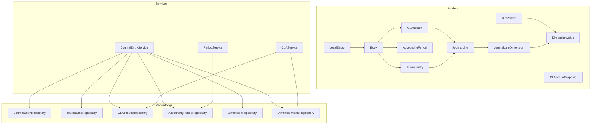
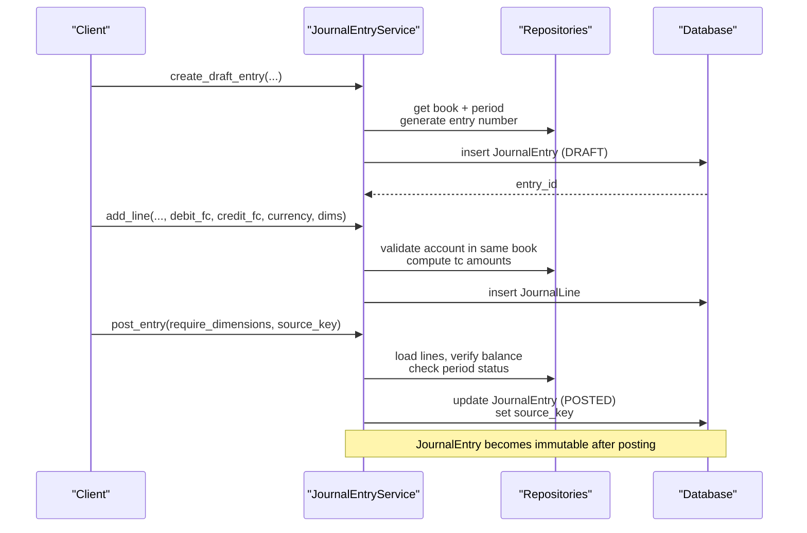
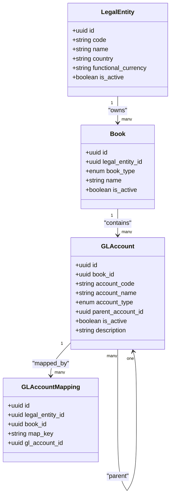
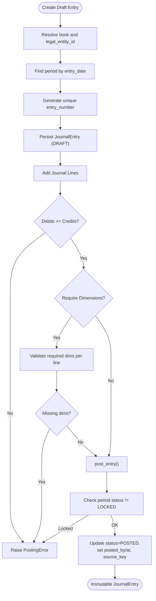
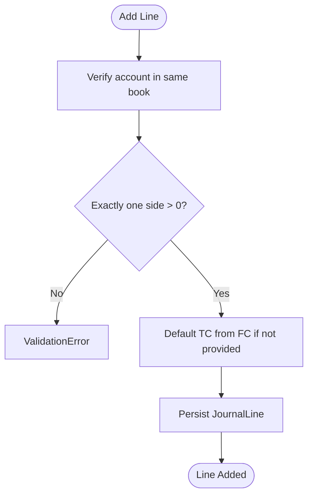
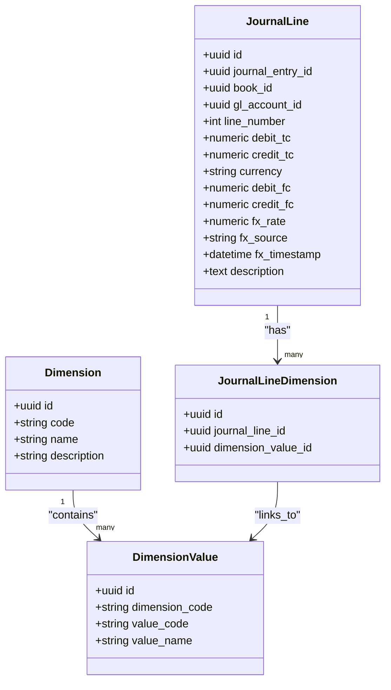
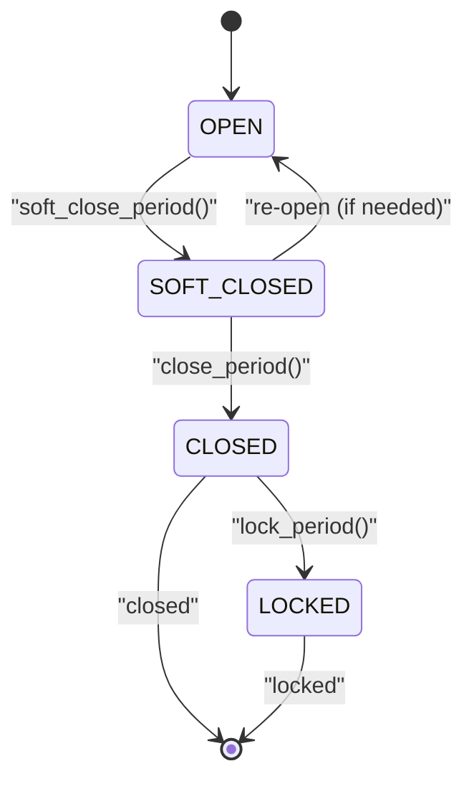
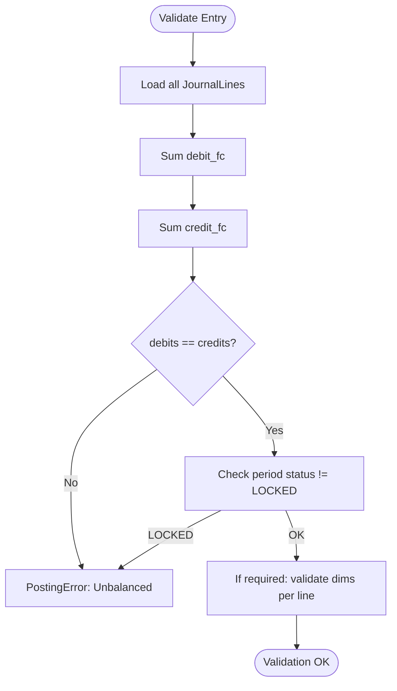
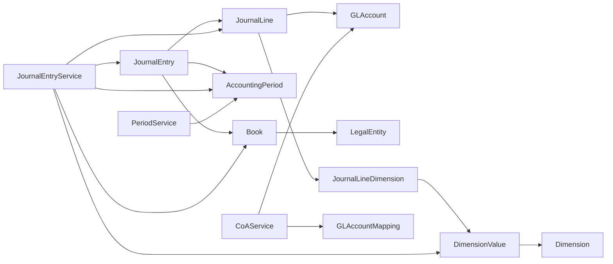

# General Ledger Tables

<cite>
**Referenced Files in This Document**
- [gl_account_model.py](file://app/modules/general_ledger/models/gl_account_model.py)
- [journal_entry_model.py](file://app/modules/general_ledger/models/journal_entry_model.py)
- [accounting_period_model.py](file://app/modules/general_ledger/models/accounting_period_model.py)
- [dimension_model.py](file://app/modules/general_ledger/models/dimension_model.py)
- [book_model.py](file://app/modules/general_ledger/models/book_model.py)
- [legal_entity_model.py](file://app/modules/general_ledger/models/legal_entity_model.py)
- [journal_entry_service.py](file://app/modules/general_ledger/services/journal_entry_service.py)
- [coa_service.py](file://app/modules/general_ledger/services/coa_service.py)
- [period_service.py](file://app/modules/general_ledger/services/period_service.py)
- [journal_entry_repository.py](file://app/modules/general_ledger/repositories/journal_entry_repository.py)
- [gl_account_repository.py](file://app/modules/general_ledger/repositories/gl_account_repository.py)
- [accounting_period_repository.py](file://app/modules/general_ledger/repositories/accounting_period_repository.py)
- [dimension_repository.py](file://app/modules/general_ledger/repositories/dimension_repository.py)
- [fm_schema.sql](file://database/fm_schema.sql)
</cite>

## Table of Contents
1. [Introduction](#introduction)
2. [Project Structure](#project-structure)
3. [Core Components](#core-components)
4. [Architecture Overview](#architecture-overview)
5. [Detailed Component Analysis](#detailed-component-analysis)
6. [Dependency Analysis](#dependency-analysis)
7. [Performance Considerations](#performance-considerations)
8. [Troubleshooting Guide](#troubleshooting-guide)
9. [Conclusion](#conclusion)

## Introduction
This document explains the General Ledger tables that underpin double-entry accounting in the system. It covers:
- Chart of Accounts (CoA): GL Account hierarchy and mappings
- Journal Entry lifecycle: creation, posting, reversals, and immutability
- Journal Lines: functional vs transaction currencies, FX handling, and dimensions
- Accounting Periods: period generation, statuses, and controls
- Audit and safety: idempotency, source keys, and uniqueness constraints

## Project Structure
The General Ledger domain is implemented under app/modules/general_ledger with models, repositories, services, and supporting schemas.

**Diagram sources**
- [legal_entity_model.py](file://app/modules/general_ledger/models/legal_entity_model.py#L7-L22)
- [book_model.py](file://app/modules/general_ledger/models/book_model.py#L15-L36)
- [gl_account_model.py](file://app/modules/general_ledger/models/gl_account_model.py#L28-L80)
- [accounting_period_model.py](file://app/modules/general_ledger/models/accounting_period_model.py#L18-L50)
- [journal_entry_model.py](file://app/modules/general_ledger/models/journal_entry_model.py#L17-L128)
- [dimension_model.py](file://app/modules/general_ledger/models/dimension_model.py#L8-L40)
- [journal_entry_repository.py](file://app/modules/general_ledger/repositories/journal_entry_repository.py#L16-L119)
- [gl_account_repository.py](file://app/modules/general_ledger/repositories/gl_account_repository.py#L10-L82)
- [accounting_period_repository.py](file://app/modules/general_ledger/repositories/accounting_period_repository.py#L14-L77)
- [dimension_repository.py](file://app/modules/general_ledger/repositories/dimension_repository.py#L9-L51)
- [journal_entry_service.py](file://app/modules/general_ledger/services/journal_entry_service.py#L40-L635)
- [coa_service.py](file://app/modules/general_ledger/services/coa_service.py#L14-L143)
- [period_service.py](file://app/modules/general_ledger/services/period_service.py#L18-L166)

**Section sources**
- [gl_account_model.py](file://app/modules/general_ledger/models/gl_account_model.py#L1-L80)
- [journal_entry_model.py](file://app/modules/general_ledger/models/journal_entry_model.py#L1-L128)
- [accounting_period_model.py](file://app/modules/general_ledger/models/accounting_period_model.py#L1-L50)
- [dimension_model.py](file://app/modules/general_ledger/models/dimension_model.py#L1-L40)
- [book_model.py](file://app/modules/general_ledger/models/book_model.py#L1-L36)
- [legal_entity_model.py](file://app/modules/general_ledger/models/legal_entity_model.py#L1-L22)
- [journal_entry_service.py](file://app/modules/general_ledger/services/journal_entry_service.py#L1-L635)
- [coa_service.py](file://app/modules/general_ledger/services/coa_service.py#L1-L143)
- [period_service.py](file://app/modules/general_ledger/services/period_service.py#L1-L166)
- [journal_entry_repository.py](file://app/modules/general_ledger/repositories/journal_entry_repository.py#L1-L119)
- [gl_account_repository.py](file://app/modules/general_ledger/repositories/gl_account_repository.py#L1-L82)
- [accounting_period_repository.py](file://app/modules/general_ledger/repositories/accounting_period_repository.py#L1-L77)
- [dimension_repository.py](file://app/modules/general_ledger/repositories/dimension_repository.py#L1-L51)
- [fm_schema.sql](file://database/fm_schema.sql#L128-L311)

## Core Components
- GL Account: Per-book chart of accounts with hierarchical parent-child relationships, account types, and system mappings.
- Journal Entry: Immutable records with DRAFT/POSTED/REVERSED states, source tracking, and period assignment.
- Journal Line: Double-entry rows with transaction and functional currency amounts, FX rate metadata, and line-level dimensions.
- Accounting Period: Monthly periods per book with OPEN/SOFT_CLOSED/CLOSED/LOCKED statuses and approval fields.
- Dimensions: Tag categories and values that attach to journal lines for reporting and analytics.

**Section sources**
- [gl_account_model.py](file://app/modules/general_ledger/models/gl_account_model.py#L9-L80)
- [journal_entry_model.py](file://app/modules/general_ledger/models/journal_entry_model.py#L10-L128)
- [accounting_period_model.py](file://app/modules/general_ledger/models/accounting_period_model.py#L9-L50)
- [dimension_model.py](file://app/modules/general_ledger/models/dimension_model.py#L8-L40)

## Architecture Overview
The system enforces double-entry integrity at multiple layers:
- Database constraints ensure balanced lines and unique identifiers.
- Services orchestrate posting workflows, enforce period locks, and validate dimensions.
- Repositories encapsulate queries and aggregates for balances and lookups.

**Diagram sources**
- [journal_entry_service.py](file://app/modules/general_ledger/services/journal_entry_service.py#L53-L242)
- [journal_entry_repository.py](file://app/modules/general_ledger/repositories/journal_entry_repository.py#L16-L75)
- [journal_entry_model.py](file://app/modules/general_ledger/models/journal_entry_model.py#L17-L58)

## Detailed Component Analysis

### GL Account and Chart of Accounts
- Fields: book_id, account_code, account_name, account_type, parent_account_id, is_active, description.
- Hierarchical parent/child relationship enables tree traversal for roll-ups.
- Mappings: system-generated postings can resolve map_key to a specific GL account per legal entity and book.
- Validation: account codes are unique per book; parent must belong to the same book.

**Diagram sources**
- [legal_entity_model.py](file://app/modules/general_ledger/models/legal_entity_model.py#L7-L22)
- [book_model.py](file://app/modules/general_ledger/models/book_model.py#L15-L36)
- [gl_account_model.py](file://app/modules/general_ledger/models/gl_account_model.py#L28-L80)

**Section sources**
- [gl_account_model.py](file://app/modules/general_ledger/models/gl_account_model.py#L9-L80)
- [coa_service.py](file://app/modules/general_ledger/services/coa_service.py#L23-L62)
- [gl_account_repository.py](file://app/modules/general_ledger/repositories/gl_account_repository.py#L16-L49)

### Journal Entry and Posting Mechanics
- Fields: legal_entity_id, book_id, period_id, entry_number, entry_date, description, reference_number, status, source tracking, reversal linkage, posted_by/at.
- Immutability: Once POSTED, JournalEntry cannot be modified; reversals create new entries.
- Numbering: Auto-generated JE-YYYYMMDD-XXXX sequence per book per day.
- Idempotency: idempotency_key prevents duplicate creation; source_key prevents duplicate postings.

**Diagram sources**
- [journal_entry_service.py](file://app/modules/general_ledger/services/journal_entry_service.py#L53-L242)
- [journal_entry_model.py](file://app/modules/general_ledger/models/journal_entry_model.py#L17-L58)

**Section sources**
- [journal_entry_model.py](file://app/modules/general_ledger/models/journal_entry_model.py#L10-L58)
- [journal_entry_service.py](file://app/modules/general_ledger/services/journal_entry_service.py#L53-L242)
- [journal_entry_repository.py](file://app/modules/general_ledger/repositories/journal_entry_repository.py#L22-L75)

### Journal Line: Currency and FX Handling
- Fields: journal_entry_id, book_id, gl_account_id, line_number, debit_tc/credit_tc, currency, debit_fc/credit_fc, fx_rate, fx_source, fx_timestamp, description.
- Constraints: Non-negative TC amounts; exactly one of debit or credit per line.
- FX: Optional fx_rate, source, and timestamp; transaction and functional amounts default to the same currency when not provided.

**Diagram sources**
- [journal_entry_service.py](file://app/modules/general_ledger/services/journal_entry_service.py#L102-L170)
- [journal_entry_model.py](file://app/modules/general_ledger/models/journal_entry_model.py#L68-L108)

**Section sources**
- [journal_entry_model.py](file://app/modules/general_ledger/models/journal_entry_model.py#L68-L108)
- [journal_entry_service.py](file://app/modules/general_ledger/services/journal_entry_service.py#L102-L170)

### Journal Line Dimensions
- JournalLineDimension links journal lines to dimension values via a many-to-many association.
- Required dimensions enforced during posting (e.g., COST_CENTER, DEPARTMENT, LOCATION).
- Dimensions are validated per line and stored as associations.

**Diagram sources**
- [journal_entry_model.py](file://app/modules/general_ledger/models/journal_entry_model.py#L110-L128)
- [dimension_model.py](file://app/modules/general_ledger/models/dimension_model.py#L8-L40)

**Section sources**
- [journal_entry_model.py](file://app/modules/general_ledger/models/journal_entry_model.py#L110-L128)
- [dimension_model.py](file://app/modules/general_ledger/models/dimension_model.py#L8-L40)
- [journal_entry_service.py](file://app/modules/general_ledger/services/journal_entry_service.py#L344-L382)

### Accounting Periods and Management
- Fields: book_id, period_start, period_end, period_name, status, approval metadata, row_version.
- Statuses: OPEN, SOFT_CLOSED, PENDING_CLOSE_APPROVAL, CLOSED, LOCKED.
- Operations: generate_periods, get_period_for_date, list_periods, soft_close, close, lock.

**Diagram sources**
- [accounting_period_model.py](file://app/modules/general_ledger/models/accounting_period_model.py#L9-L50)
- [period_service.py](file://app/modules/general_ledger/services/period_service.py#L89-L166)

**Section sources**
- [accounting_period_model.py](file://app/modules/general_ledger/models/accounting_period_model.py#L9-L50)
- [period_service.py](file://app/modules/general_ledger/services/period_service.py#L26-L166)
- [accounting_period_repository.py](file://app/modules/general_ledger/repositories/accounting_period_repository.py#L20-L77)

### Posting Validation Rules and Balance Checking
- Line-level checks: non-negative transaction amounts; exactly one side is non-zero.
- Entry-level checks: total functional currency debits equal total credits; optional dimension requirement enforcement.
- Period-level checks: posting prohibited if period is LOCKED; soft-close allows elevated access.
- Duplicate prevention: idempotency_key and source_key uniqueness constraints.

**Diagram sources**
- [journal_entry_service.py](file://app/modules/general_ledger/services/journal_entry_service.py#L194-L242)
- [journal_entry_model.py](file://app/modules/general_ledger/models/journal_entry_model.py#L99-L104)

**Section sources**
- [journal_entry_model.py](file://app/modules/general_ledger/models/journal_entry_model.py#L99-L104)
- [journal_entry_service.py](file://app/modules/general_ledger/services/journal_entry_service.py#L194-L242)

### Audit Trail and Safety Controls
- JournalEntry tracks source_service, source_type, source_id, idempotency_key, source_key, posted_by/at, and reversal linkage.
- Unique constraints: entry_number, (legal_entity_id, book_id, source_key), (book_id, period_start), (legal_entity_id, book_id, map_key).
- Database enums and check constraints enforce data integrity at rest.

**Section sources**
- [journal_entry_model.py](file://app/modules/general_ledger/models/journal_entry_model.py#L21-L54)
- [gl_account_model.py](file://app/modules/general_ledger/models/gl_account_model.py#L73-L76)
- [fm_schema.sql](file://database/fm_schema.sql#L241-L311)

## Dependency Analysis
The following diagram highlights primary dependencies among models and services:

**Diagram sources**
- [journal_entry_model.py](file://app/modules/general_ledger/models/journal_entry_model.py#L17-L128)
- [gl_account_model.py](file://app/modules/general_ledger/models/gl_account_model.py#L28-L80)
- [accounting_period_model.py](file://app/modules/general_ledger/models/accounting_period_model.py#L18-L50)
- [dimension_model.py](file://app/modules/general_ledger/models/dimension_model.py#L8-L40)
- [book_model.py](file://app/modules/general_ledger/models/book_model.py#L15-L36)
- [legal_entity_model.py](file://app/modules/general_ledger/models/legal_entity_model.py#L7-L22)
- [journal_entry_service.py](file://app/modules/general_ledger/services/journal_entry_service.py#L40-L635)
- [coa_service.py](file://app/modules/general_ledger/services/coa_service.py#L14-L143)
- [period_service.py](file://app/modules/general_ledger/services/period_service.py#L18-L166)

**Section sources**
- [journal_entry_model.py](file://app/modules/general_ledger/models/journal_entry_model.py#L17-L128)
- [gl_account_model.py](file://app/modules/general_ledger/models/gl_account_model.py#L28-L80)
- [accounting_period_model.py](file://app/modules/general_ledger/models/accounting_period_model.py#L18-L50)
- [dimension_model.py](file://app/modules/general_ledger/models/dimension_model.py#L8-L40)
- [book_model.py](file://app/modules/general_ledger/models/book_model.py#L15-L36)
- [legal_entity_model.py](file://app/modules/general_ledger/models/legal_entity_model.py#L7-L22)
- [journal_entry_service.py](file://app/modules/general_ledger/services/journal_entry_service.py#L40-L635)
- [coa_service.py](file://app/modules/general_ledger/services/coa_service.py#L14-L143)
- [period_service.py](file://app/modules/general_ledger/services/period_service.py#L18-L166)

## Performance Considerations
- Indexes on frequently filtered columns (book_id, period_id, entry_date, entry_number, status) improve query performance.
- Aggregations for balances leverage joins with JournalEntry status to avoid unposted entries.
- Period lookups by date use inclusive bounds to minimize scans.
- Dimension queries rely on composite indices for dimension_code/value_code pairs.

[No sources needed since this section provides general guidance]

## Troubleshooting Guide
Common issues and resolutions:
- Posting fails with “unbalanced”: Ensure total functional currency debits equal credits; verify no zero-only or dual-sided lines.
- Period locked: Cannot post to LOCKED periods; use SOFT_CLOSED with elevated permissions or close/lock the period appropriately.
- Duplicate entry: idempotency_key or source_key already exists; adjust idempotency_key or source_key to ensure uniqueness.
- Missing dimensions: Required dimensions must be attached to each line; add COST_CENTER, DEPARTMENT, LOCATION as applicable.
- Account not found: Verify account exists in the same book; use account_code lookup if needed.

**Section sources**
- [journal_entry_service.py](file://app/modules/general_ledger/services/journal_entry_service.py#L194-L242)
- [journal_entry_service.py](file://app/modules/general_ledger/services/journal_entry_service.py#L344-L382)
- [journal_entry_repository.py](file://app/modules/general_ledger/repositories/journal_entry_repository.py#L63-L75)

## Conclusion
The General Ledger tables and services implement robust double-entry accounting with strong integrity constraints, period controls, and audit-ready immutability. The design supports multi-entity, multi-book environments with flexible dimensions and safe posting workflows.