# Intercompany Tables

<cite>
**Referenced Files in This Document**
- [intercompany_transfer_model.py](file://app/modules/intercompany/models/intercompany_transfer_model.py)
- [intercompany_balance_model.py](file://app/modules/intercompany/models/intercompany_balance_model.py)
- [royalty_model.py](file://app/modules/intercompany/models/royalty_model.py)
- [intercompany_transfer_repository.py](file://app/modules/intercompany/repositories/intercompany_transfer_repository.py)
- [intercompany_balance_repository.py](file://app/modules/intercompany/repositories/intercompany_balance_repository.py)
- [royalty_repository.py](file://app/modules/intercompany/repositories/royalty_repository.py)
- [intercompany_transfer_service.py](file://app/modules/intercompany/services/intercompany_transfer_service.py)
- [intercompany_reconciliation_service.py](file://app/modules/intercompany/services/intercompany_reconciliation_service.py)
- [royalty_calculation_service.py](file://app/modules/intercompany/services/royalty_calculation_service.py)
- [royalty_approval_service.py](file://app/modules/intercompany/services/royalty_approval_service.py)
- [intercompany_transfer_routes.py](file://app/modules/intercompany/api/routes/intercompany_transfer_routes.py)
- [royalty_routes.py](file://app/modules/intercompany/api/routes/royalty_routes.py)
- [intercompany_schemas.py](file://app/modules/intercompany/schemas/intercompany_schemas.py)
</cite>

## Table of Contents
1. [Introduction](#introduction)
2. [Project Structure](#project-structure)
3. [Core Components](#core-components)
4. [Architecture Overview](#architecture-overview)
5. [Detailed Component Analysis](#detailed-component-analysis)
6. [Dependency Analysis](#dependency-analysis)
7. [Performance Considerations](#performance-considerations)
8. [Troubleshooting Guide](#troubleshooting-guide)
9. [Conclusion](#conclusion)
10. [Appendices](#appendices)

## Introduction
This document explains the Intercompany tables and workflows that manage cross-entity transactions and royalty calculations. It covers:
- Intercompany Transfer table and cash movements
- Intercompany Balance table and account tracking
- Royalty Agreement and Calculation tables, plus the royalty approval workflow and posting to journal entries
- Validation rules, transfer categorization, and consolidation implications
- Impact on financial reporting and tax considerations

## Project Structure
The intercompany domain is organized by concerns:
- Models define the persistent entities and relationships
- Repositories encapsulate data access and queries
- Services orchestrate business logic and integrate with other modules (general ledger, treasury)
- APIs expose routes for CRUD, posting, and reconciliation
- Schemas validate request/response payloads

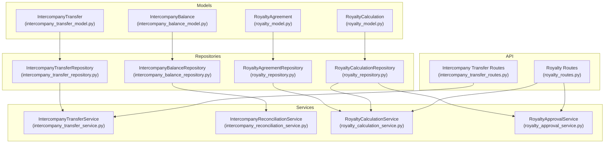

**Diagram sources**
- [intercompany_transfer_model.py](file://app/modules/intercompany/models/intercompany_transfer_model.py#L16-L59)
- [intercompany_balance_model.py](file://app/modules/intercompany/models/intercompany_balance_model.py#L17-L39)
- [royalty_model.py](file://app/modules/intercompany/models/royalty_model.py#L27-L98)
- [intercompany_transfer_repository.py](file://app/modules/intercompany/repositories/intercompany_transfer_repository.py#L12-L101)
- [intercompany_balance_repository.py](file://app/modules/intercompany/repositories/intercompany_balance_repository.py#L14-L55)
- [royalty_repository.py](file://app/modules/intercompany/repositories/royalty_repository.py#L15-L107)
- [intercompany_transfer_service.py](file://app/modules/intercompany/services/intercompany_transfer_service.py#L17-L232)
- [intercompany_reconciliation_service.py](file://app/modules/intercompany/services/intercompany_reconciliation_service.py#L14-L168)
- [royalty_calculation_service.py](file://app/modules/intercompany/services/royalty_calculation_service.py#L21-L202)
- [royalty_approval_service.py](file://app/modules/intercompany/services/royalty_approval_service.py#L25-L254)
- [intercompany_transfer_routes.py](file://app/modules/intercompany/api/routes/intercompany_transfer_routes.py#L18-L179)
- [royalty_routes.py](file://app/modules/intercompany/api/routes/royalty_routes.py#L29-L269)

**Section sources**
- [intercompany_transfer_model.py](file://app/modules/intercompany/models/intercompany_transfer_model.py#L1-L59)
- [intercompany_balance_model.py](file://app/modules/intercompany/models/intercompany_balance_model.py#L1-L39)
- [royalty_model.py](file://app/modules/intercompany/models/royalty_model.py#L1-L98)
- [intercompany_transfer_routes.py](file://app/modules/intercompany/api/routes/intercompany_transfer_routes.py#L1-L179)
- [royalty_routes.py](file://app/modules/intercompany/api/routes/royalty_routes.py#L1-L269)

## Core Components
This section documents the three core tables and their relationships.

### Intercompany Transfer Table
- Purpose: Records cross-entity cash and non-cash movements (e.g., CASH, ROYALTY, LOAN).
- Key fields:
  - Identifiers: from_entity_id, to_entity_id, transfer_date, amount, currency
  - Classification: transfer_type (e.g., CASH, ROYALTY)
  - Reference: reference_number, description
  - Treasury linkage: from_bank_account_id, to_bank_account_id, from_bank_transaction_id, to_bank_transaction_id
  - Journal entries: from_entity_je_id, to_entity_je_id
  - Reconciliation: is_reconciled, reconciled_at

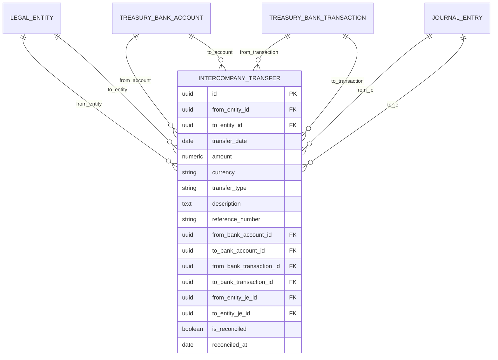

**Diagram sources**
- [intercompany_transfer_model.py](file://app/modules/intercompany/models/intercompany_transfer_model.py#L16-L59)

**Section sources**
- [intercompany_transfer_model.py](file://app/modules/intercompany/models/intercompany_transfer_model.py#L16-L59)

### Intercompany Balance Table
- Purpose: Stores balance snapshots between entity pairs as of a specific date, supporting receivable/payable tracking.
- Key fields:
  - from_entity_id, to_entity_id, as_of_date, balance_type (NET, RECEIVABLE, PAYABLE), balance_amount, currency
  - Unique constraint ensures one snapshot per entity pair/date/type

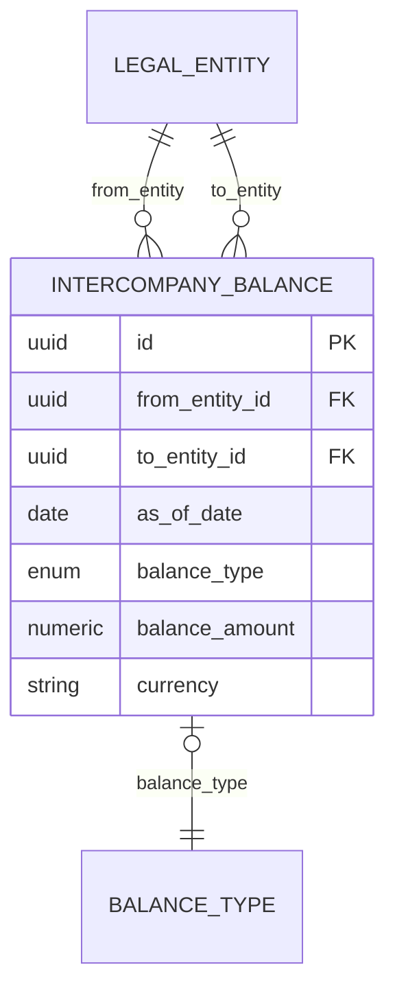

**Diagram sources**
- [intercompany_balance_model.py](file://app/modules/intercompany/models/intercompany_balance_model.py#L17-L39)

**Section sources**
- [intercompany_balance_model.py](file://app/modules/intercompany/models/intercompany_balance_model.py#L17-L39)

### Royalty Tables
- RoyaltyAgreement: Defines the terms between entities (from_entity_id, to_entity_id), basis (REVENUE, RECOGNIZED_REVENUE, COLLECTED_REVENUE, FIXED), rate/fixed_amount, currency, effective dates, and activity flag.
- RoyaltyCalculation: Per-period calculation with revenue bases, calculated_amount, currency, and approval workflow fields (status, submitted/approved/rejected timestamps and actors, decision_reason, row_version), plus legacy posting fields and intercompany_transfer_id linkage.

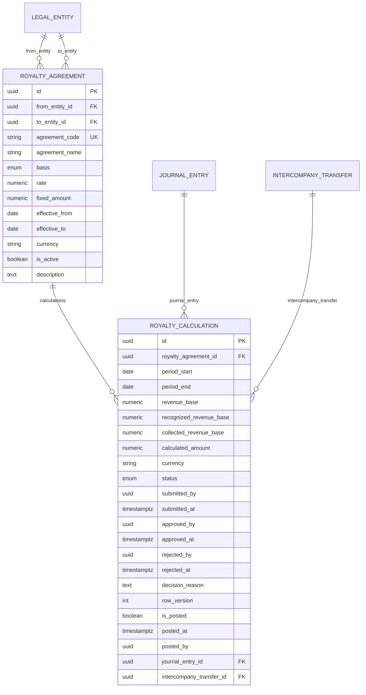

**Diagram sources**
- [royalty_model.py](file://app/modules/intercompany/models/royalty_model.py#L27-L98)

**Section sources**
- [royalty_model.py](file://app/modules/intercompany/models/royalty_model.py#L27-L98)

## Architecture Overview
The intercompany subsystem integrates with general ledger and treasury modules to post journal entries and link to bank accounts/transactions. The service layer enforces business rules, while repositories encapsulate persistence.

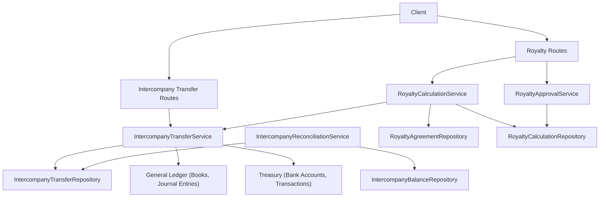

**Diagram sources**
- [intercompany_transfer_routes.py](file://app/modules/intercompany/api/routes/intercompany_transfer_routes.py#L18-L179)
- [royalty_routes.py](file://app/modules/intercompany/api/routes/royalty_routes.py#L29-L269)
- [intercompany_transfer_service.py](file://app/modules/intercompany/services/intercompany_transfer_service.py#L17-L232)
- [royalty_calculation_service.py](file://app/modules/intercompany/services/royalty_calculation_service.py#L21-L202)
- [royalty_approval_service.py](file://app/modules/intercompany/services/royalty_approval_service.py#L25-L254)
- [intercompany_reconciliation_service.py](file://app/modules/intercompany/services/intercompany_reconciliation_service.py#L14-L168)
- [intercompany_transfer_repository.py](file://app/modules/intercompany/repositories/intercompany_transfer_repository.py#L12-L101)
- [intercompany_balance_repository.py](file://app/modules/intercompany/repositories/intercompany_balance_repository.py#L14-L55)
- [royalty_repository.py](file://app/modules/intercompany/repositories/royalty_repository.py#L15-L107)

## Detailed Component Analysis

### Intercompany Transfer Service and Posting
- Creation validates entities differ, persists the transfer, and sets reconciliation flags.
- Posting creates dual journal entries (accrual books) with intercompany accounts and optional cash/bank accounts, then updates the transfer with journal entry IDs.

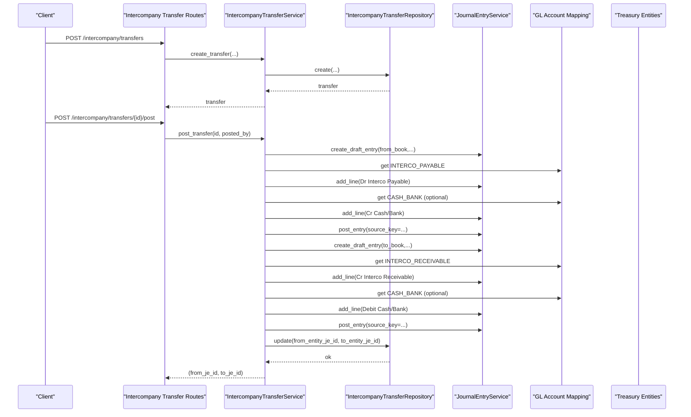

**Diagram sources**
- [intercompany_transfer_routes.py](file://app/modules/intercompany/api/routes/intercompany_transfer_routes.py#L48-L104)
- [intercompany_transfer_service.py](file://app/modules/intercompany/services/intercompany_transfer_service.py#L28-L219)

**Section sources**
- [intercompany_transfer_service.py](file://app/modules/intercompany/services/intercompany_transfer_service.py#L28-L219)
- [intercompany_transfer_routes.py](file://app/modules/intercompany/api/routes/intercompany_transfer_routes.py#L48-L104)

### Intercompany Reconciliation and Balance Tracking
- Calculates net balance between entity pairs up to a date.
- Creates or updates a balance snapshot with RECEIVABLE/PAYABLE/NET classification.
- Supports reconciliation marking and generating a reconciliation report.

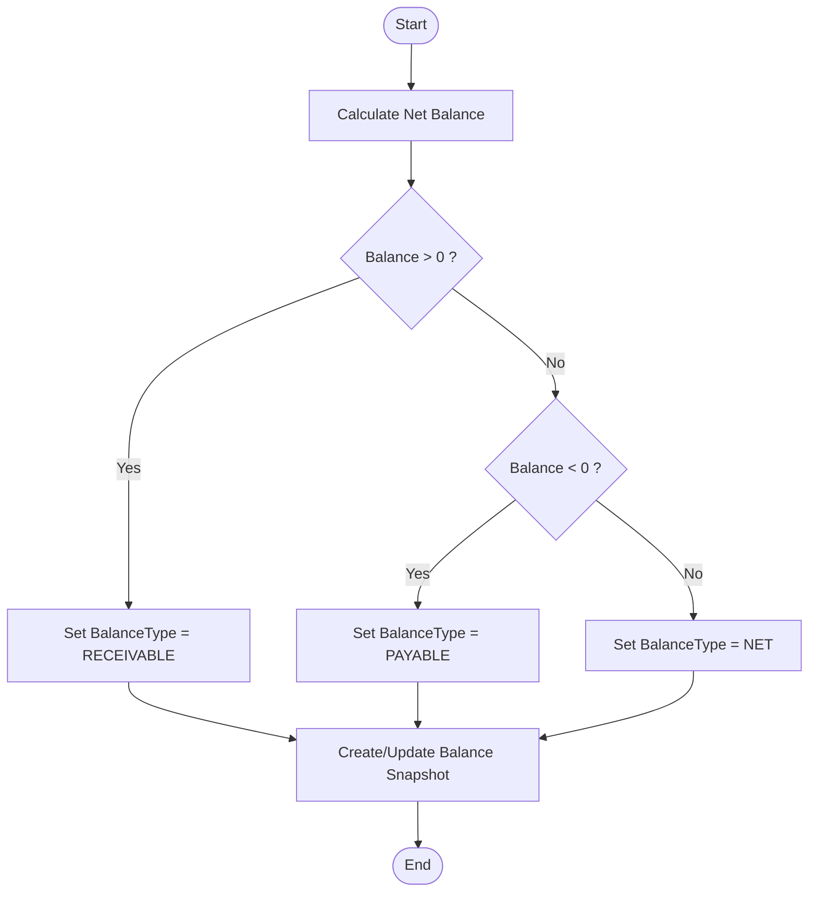

**Diagram sources**
- [intercompany_reconciliation_service.py](file://app/modules/intercompany/services/intercompany_reconciliation_service.py#L22-L93)
- [intercompany_transfer_repository.py](file://app/modules/intercompany/repositories/intercompany_transfer_repository.py#L77-L101)
- [intercompany_balance_model.py](file://app/modules/intercompany/models/intercompany_balance_model.py#L17-L39)

**Section sources**
- [intercompany_reconciliation_service.py](file://app/modules/intercompany/services/intercompany_reconciliation_service.py#L22-L168)
- [intercompany_transfer_repository.py](file://app/modules/intercompany/repositories/intercompany_transfer_repository.py#L77-L101)
- [intercompany_balance_repository.py](file://app/modules/intercompany/repositories/intercompany_balance_repository.py#L20-L55)

### Royalty Calculation Mechanics
- Determines revenue base depending on basis (RECOGNIZED_REVENUE, COLLECTED_REVENUE, REVENUE).
- Computes calculated_amount using rate or fixed amount.
- Persists the calculation and supports posting as an intercompany transfer.

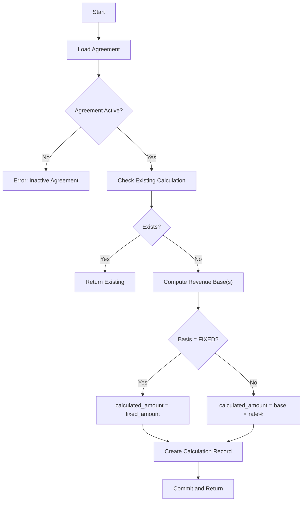

**Diagram sources**
- [royalty_calculation_service.py](file://app/modules/intercompany/services/royalty_calculation_service.py#L31-L104)

**Section sources**
- [royalty_calculation_service.py](file://app/modules/intercompany/services/royalty_calculation_service.py#L31-L104)

### Royalty Approval Workflow
- State machine: DRAFT → PENDING_APPROVAL → APPROVED/REJECTED.
- Enforces SoD checks and row-version optimistic locking.
- Logs audit actions.

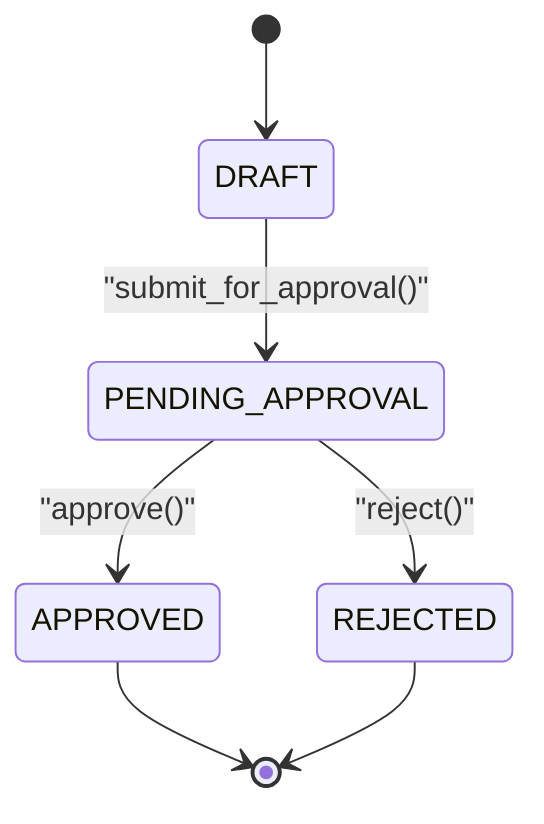

**Diagram sources**
- [royalty_model.py](file://app/modules/intercompany/models/royalty_model.py#L18-L25)
- [royalty_approval_service.py](file://app/modules/intercompany/services/royalty_approval_service.py#L33-L231)

**Section sources**
- [royalty_approval_service.py](file://app/modules/intercompany/services/royalty_approval_service.py#L33-L231)
- [royalty_model.py](file://app/modules/intercompany/models/royalty_model.py#L18-L25)

### Royalty Posting to Journal Entries
- Posts royalty calculation as an intercompany transfer with transfer_type set to ROYALTY.
- Creates dual journal entries and updates the calculation with journal entry and transfer IDs.

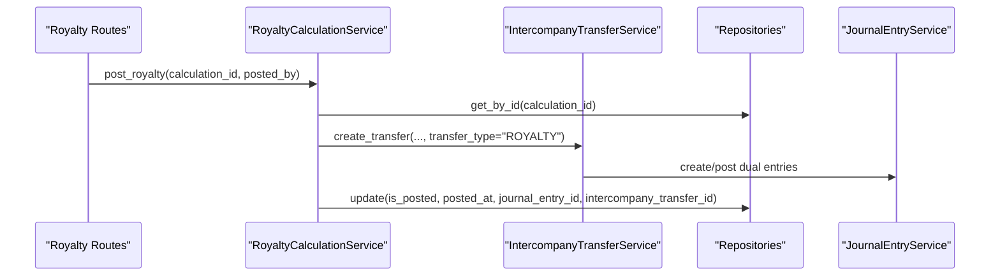

**Diagram sources**
- [royalty_routes.py](file://app/modules/intercompany/api/routes/royalty_routes.py#L200-L256)
- [royalty_calculation_service.py](file://app/modules/intercompany/services/royalty_calculation_service.py#L160-L202)
- [intercompany_transfer_service.py](file://app/modules/intercompany/services/intercompany_transfer_service.py#L72-L219)

**Section sources**
- [royalty_routes.py](file://app/modules/intercompany/api/routes/royalty_routes.py#L200-L256)
- [royalty_calculation_service.py](file://app/modules/intercompany/services/royalty_calculation_service.py#L160-L202)

## Dependency Analysis
- Models define foreign keys to legal entities, journal entries, and treasury entities.
- Repositories depend on SQLAlchemy async sessions and encapsulate queries.
- Services orchestrate cross-module dependencies (books, periods, GL mapping).
- APIs depend on schemas for validation and on idempotency for safe reprocessing.

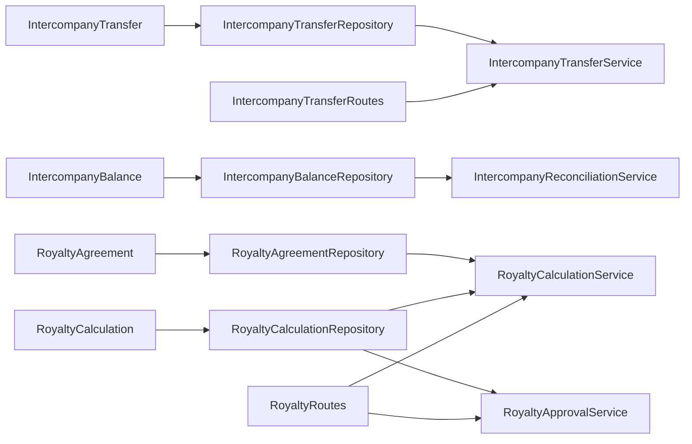

**Diagram sources**
- [intercompany_transfer_model.py](file://app/modules/intercompany/models/intercompany_transfer_model.py#L16-L59)
- [intercompany_balance_model.py](file://app/modules/intercompany/models/intercompany_balance_model.py#L17-L39)
- [royalty_model.py](file://app/modules/intercompany/models/royalty_model.py#L27-L98)
- [intercompany_transfer_repository.py](file://app/modules/intercompany/repositories/intercompany_transfer_repository.py#L12-L101)
- [intercompany_balance_repository.py](file://app/modules/intercompany/repositories/intercompany_balance_repository.py#L14-L55)
- [royalty_repository.py](file://app/modules/intercompany/repositories/royalty_repository.py#L15-L107)
- [intercompany_transfer_routes.py](file://app/modules/intercompany/api/routes/intercompany_transfer_routes.py#L18-L179)
- [royalty_routes.py](file://app/modules/intercompany/api/routes/royalty_routes.py#L29-L269)

**Section sources**
- [intercompany_transfer_model.py](file://app/modules/intercompany/models/intercompany_transfer_model.py#L16-L59)
- [intercompany_balance_model.py](file://app/modules/intercompany/models/intercompany_balance_model.py#L17-L39)
- [royalty_model.py](file://app/modules/intercompany/models/royalty_model.py#L27-L98)
- [intercompany_transfer_routes.py](file://app/modules/intercompany/api/routes/intercompany_transfer_routes.py#L18-L179)
- [royalty_routes.py](file://app/modules/intercompany/api/routes/royalty_routes.py#L29-L269)

## Performance Considerations
- Indexes on frequently filtered columns (entity IDs, dates, reconciliation flags) improve query performance for lists and balances.
- Batch operations for reconciliation and balance snapshots reduce repeated scans.
- Idempotency keys prevent duplicate postings and redundant journal entries.
- Consider partitioning or materialized summaries for large-scale intercompany reporting.

## Troubleshooting Guide
Common issues and resolutions:
- Missing ACCRUAL book for an entity during posting: ensure books are configured per legal entity.
- Account mapping missing: verify GL account mappings for INTERCO_PAYABLE, INTERCO_RECEIVABLE, and CASH_BANK.
- Duplicate posting attempts: rely on idempotency keys and source keys to avoid duplicates.
- Reconciliation mismatches: use reconciliation report and mark transfers as reconciled to align balances.
- Approval errors: confirm SoD compliance and row version freshness before approvals.

**Section sources**
- [intercompany_transfer_service.py](file://app/modules/intercompany/services/intercompany_transfer_service.py#L85-L122)
- [intercompany_reconciliation_service.py](file://app/modules/intercompany/services/intercompany_reconciliation_service.py#L94-L168)
- [royalty_approval_service.py](file://app/modules/intercompany/services/royalty_approval_service.py#L128-L141)

## Conclusion
The intercompany subsystem provides robust mechanisms to record cross-entity transfers, track balances, and automate royalty calculations with approval workflows and dual journal entries. Proper configuration of books, mappings, and adherence to validation and reconciliation processes ensures accurate consolidation and reporting.

## Appendices

### Intercompany Transaction Validation Rules
- Entities must differ for transfers.
- Agreements must be active for calculations.
- Fixed basis requires a fixed amount.
- Approval workflow requires proper SoD checks and row version handling.

**Section sources**
- [intercompany_transfer_routes.py](file://app/modules/intercompany/api/routes/intercompany_transfer_routes.py#L42-L45)
- [royalty_routes.py](file://app/modules/intercompany/api/routes/royalty_routes.py#L45-L48)
- [royalty_approval_service.py](file://app/modules/intercompany/services/royalty_approval_service.py#L54-L58)

### Transfer Categorization and Consolidation Implications
- Intercompany vs intra-entity vs external:
  - Intercompany: from_entity_id ≠ to_entity_id; recorded with intercompany accounts and reconciled.
  - Intra-entity: from_entity_id = to_entity_id; validated at creation.
  - External: not modeled here; typically handled via AR/AP or treasury modules.
- Consolidation:
  - Intercompany balances and transfers must be eliminated in consolidated financial statements.
  - Dual journal entries ensure proper reversal entries per entity’s books.

**Section sources**
- [intercompany_transfer_model.py](file://app/modules/intercompany/models/intercompany_transfer_model.py#L51-L58)
- [intercompany_transfer_routes.py](file://app/modules/intercompany/api/routes/intercompany_transfer_routes.py#L58-L72)

### Financial Reporting and Tax Considerations
- Dual journal entries per entity ensure local reporting accuracy.
- Intercompany balances support monthly/quarterly reconciliations and management reporting.
- Tax jurisdictions may require separate intercompany documentation; ensure adequate descriptions and reference numbers for audit trails.

**Section sources**
- [intercompany_transfer_routes.py](file://app/modules/intercompany/api/routes/intercompany_transfer_routes.py#L128-L133)
- [intercompany_schemas.py](file://app/modules/intercompany/schemas/intercompany_schemas.py#L9-L46)