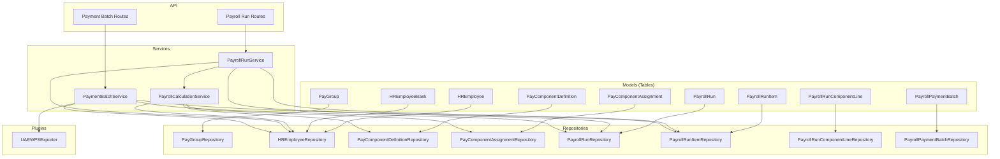
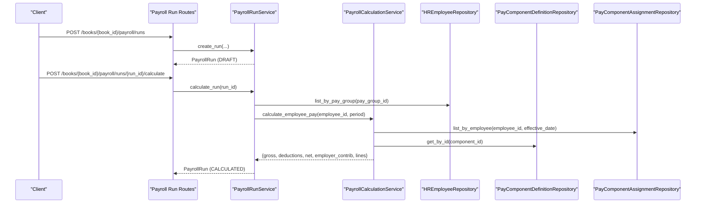
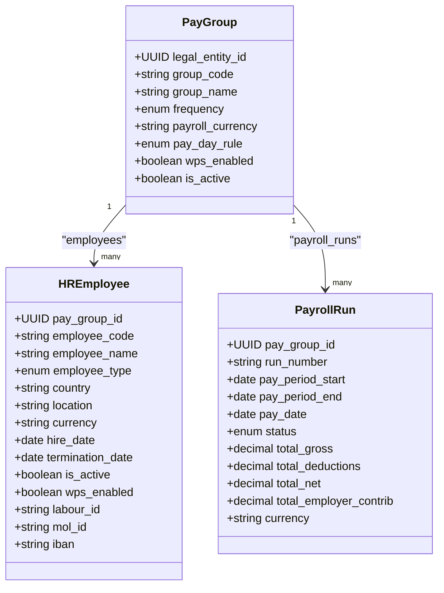
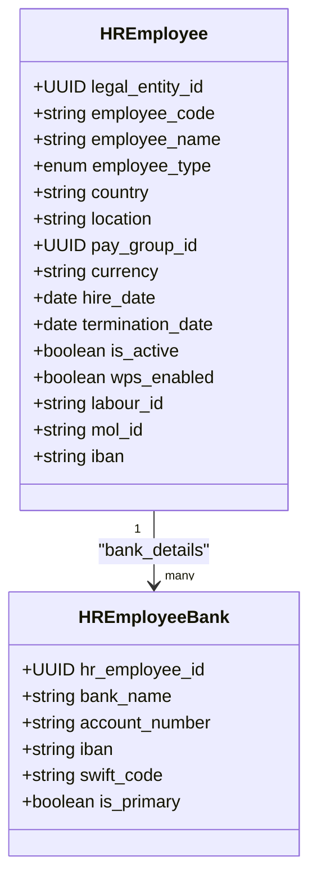
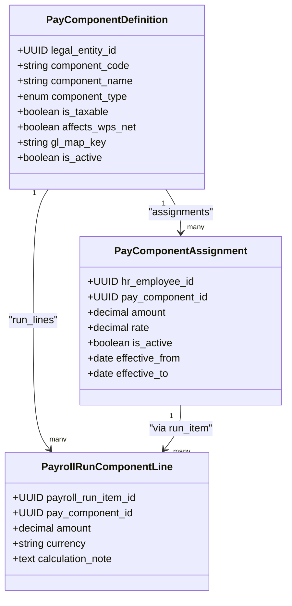
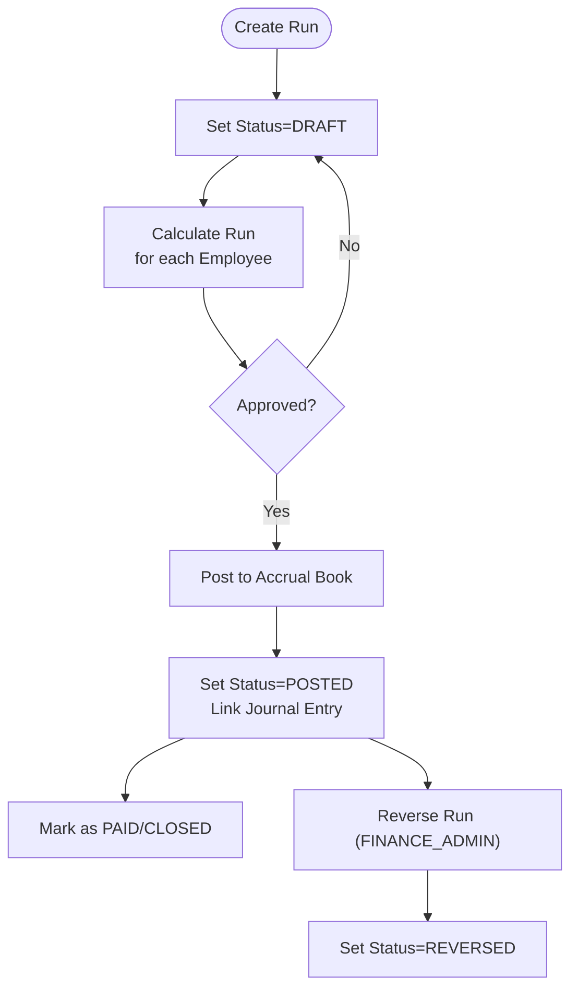
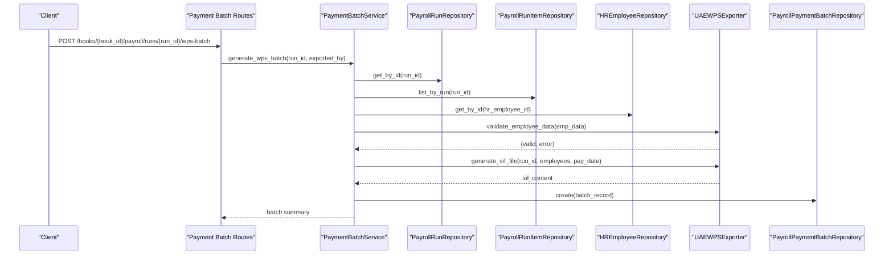
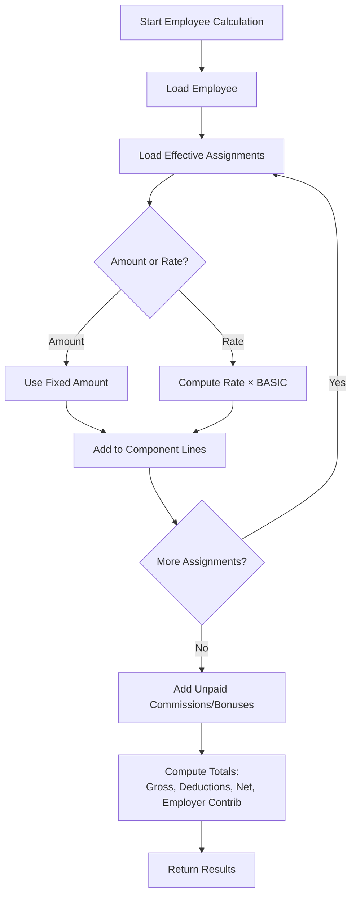
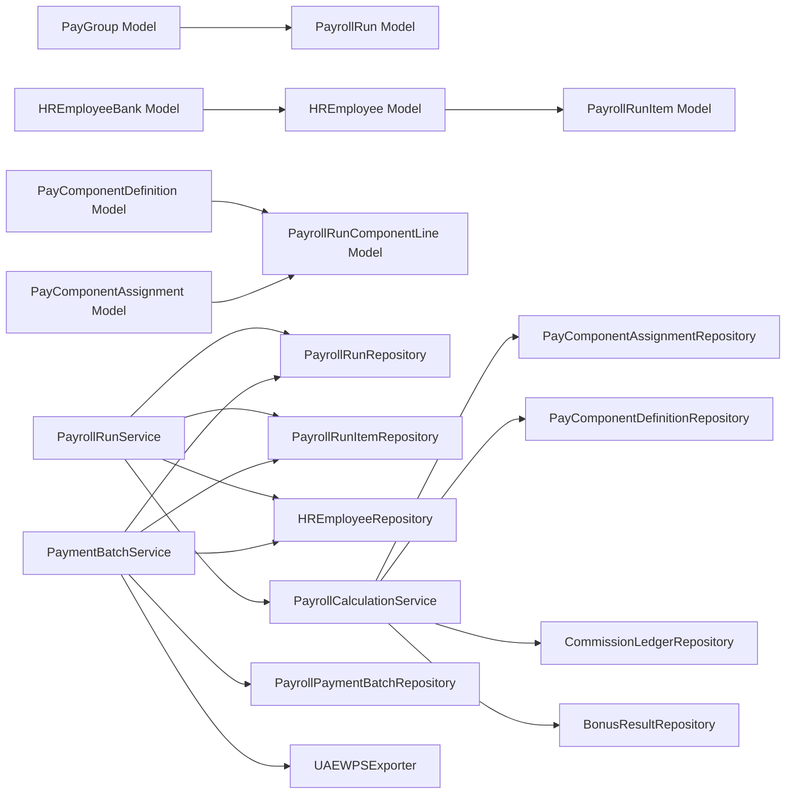

# Payroll Tables

<cite>
**Referenced Files in This Document**
- [pay_group_model.py](file://app/modules/payroll/models/pay_group_model.py)
- [employee_model.py](file://app/modules/payroll/models/employee_model.py)
- [pay_component_model.py](file://app/modules/payroll/models/pay_component_model.py)
- [payroll_run_model.py](file://app/modules/payroll/models/payroll_run_model.py)
- [payment_batch_model.py](file://app/modules/payroll/models/payment_batch_model.py)
- [payroll_calculation_service.py](file://app/modules/payroll/services/payroll_calculation_service.py)
- [payroll_run_service.py](file://app/modules/payroll/services/payroll_run_service.py)
- [payment_batch_service.py](file://app/modules/payroll/services/payment_batch_service.py)
- [pay_component_repository.py](file://app/modules/payroll/repositories/pay_component_repository.py)
- [employee_repository.py](file://app/modules/payroll/repositories/employee_repository.py)
- [payroll_run_repository.py](file://app/modules/payroll/repositories/payroll_run_repository.py)
- [wps_export.py](file://app/modules/payroll/plugins/wps_export.py)
- [payroll_run_routes.py](file://app/modules/payroll/api/routes/payroll_run_routes.py)
- [payment_batch_routes.py](file://app/modules/payroll/api/routes/payment_batch_routes.py)
- [payroll_run_schemas.py](file://app/modules/payroll/schemas/payroll_run_schemas.py)
</cite>

## Table of Contents
1. [Introduction](#introduction)
2. [Project Structure](#project-structure)
3. [Core Components](#core-components)
4. [Architecture Overview](#architecture-overview)
5. [Detailed Component Analysis](#detailed-component-analysis)
6. [Dependency Analysis](#dependency-analysis)
7. [Performance Considerations](#performance-considerations)
8. [Troubleshooting Guide](#troubleshooting-guide)
9. [Conclusion](#conclusion)

## Introduction
This document explains the Payroll tables and related services that implement employee compensation and tax processing. It covers:
- Pay Group table and payroll scheduling
- HR Employee table and employee master data
- HR Employee Bank table and payment distribution
- Pay Component Definition and Assignments for compensation components
- Payroll Run lifecycle and calculation algorithms
- Tax deduction handling and WPS integration patterns

The goal is to help both technical and non-technical readers understand how payroll data is modeled, processed, and integrated with financial systems.

## Project Structure
The Payroll domain is organized around models (tables), repositories (data access), services (business logic), plugins (integrations), and API routes (external interfaces). The following diagram maps the major components involved in payroll processing.

**Diagram sources**
- [pay_group_model.py](file://app/modules/payroll/models/pay_group_model.py#L24-L48)
- [employee_model.py](file://app/modules/payroll/models/employee_model.py#L16-L75)
- [pay_component_model.py](file://app/modules/payroll/models/pay_component_model.py#L38-L88)
- [payroll_run_model.py](file://app/modules/payroll/models/payroll_run_model.py#L23-L117)
- [payment_batch_model.py](file://app/modules/payroll/models/payment_batch_model.py#L18-L42)
- [payroll_calculation_service.py](file://app/modules/payroll/services/payroll_calculation_service.py#L22-L138)
- [payroll_run_service.py](file://app/modules/payroll/services/payroll_run_service.py#L25-L416)
- [payment_batch_service.py](file://app/modules/payroll/services/payment_batch_service.py#L16-L133)
- [wps_export.py](file://app/modules/payroll/plugins/wps_export.py#L9-L88)
- [payroll_run_routes.py](file://app/modules/payroll/api/routes/payroll_run_routes.py#L25-L302)
- [payment_batch_routes.py](file://app/modules/payroll/api/routes/payment_batch_routes.py#L10-L59)

**Section sources**
- [pay_group_model.py](file://app/modules/payroll/models/pay_group_model.py#L24-L48)
- [employee_model.py](file://app/modules/payroll/models/employee_model.py#L16-L75)
- [pay_component_model.py](file://app/modules/payroll/models/pay_component_model.py#L38-L88)
- [payroll_run_model.py](file://app/modules/payroll/models/payroll_run_model.py#L23-L117)
- [payment_batch_model.py](file://app/modules/payroll/models/payment_batch_model.py#L18-L42)
- [payroll_calculation_service.py](file://app/modules/payroll/services/payroll_calculation_service.py#L22-L138)
- [payroll_run_service.py](file://app/modules/payroll/services/payroll_run_service.py#L25-L416)
- [payment_batch_service.py](file://app/modules/payroll/services/payment_batch_service.py#L16-L133)
- [wps_export.py](file://app/modules/payroll/plugins/wps_export.py#L9-L88)
- [payroll_run_routes.py](file://app/modules/payroll/api/routes/payroll_run_routes.py#L25-L302)
- [payment_batch_routes.py](file://app/modules/payroll/api/routes/payment_batch_routes.py#L10-L59)

## Core Components
This section documents the core Payroll tables and their attributes, along with how they relate to each other.

- Pay Group table (pay_group)
  - Purpose: Defines payroll groups by legal entity, scheduling frequency, currency, pay day rule, and WPS enablement flag.
  - Key attributes: legal_entity_id, group_code, group_name, frequency, payroll_currency, pay_day_rule, wps_enabled, is_active.
  - Relationships: linked to LegalEntity; employees and payroll runs belong to a pay group.

- HR Employee table (hr_employee)
  - Purpose: Stores employee master data and WPS fields for UAE.
  - Key attributes: legal_entity_id, employee_code (unique), employee_name, employee_type, country, location, pay_group_id, currency, hire_date, termination_date, is_active; plus WPS fields: wps_enabled, labour_id, mol_id, iban.
  - Relationships: belongs to LegalEntity and PayGroup; has bank details and component assignments; linked to payroll run items.

- HR Employee Bank table (hr_employee_bank)
  - Purpose: Stores employee bank accounts and designates primary bank account.
  - Key attributes: hr_employee_id, bank_name, account_number, iban, swift_code, is_primary; unique constraint on (hr_employee_id, is_primary).
  - Relationships: belongs to HREmployee.

- Pay Component Definition table (pay_component_definition)
  - Purpose: Defines standardized compensation components (earnings, deductions, employer contributions).
  - Key attributes: legal_entity_id, component_code (unique per entity), component_name, component_type, is_taxable, affects_wps_net, gl_map_key, is_active.
  - Relationships: linked to LegalEntity; has component assignments and run lines.

- Pay Component Assignment table (pay_component_assignment)
  - Purpose: Assigns components to employees with amounts/rates and effective dates.
  - Key attributes: hr_employee_id, pay_component_id, amount, rate, is_active, effective_from, effective_to; unique constraint on (hr_employee_id, pay_component_id).
  - Relationships: belongs to HREmployee and PayComponentDefinition.

- Payroll Run table (payroll_run)
  - Purpose: Tracks a single payroll processing cycle for a pay group.
  - Key attributes: legal_entity_id, book_id, pay_group_id, run_number (unique), pay_period_start, pay_period_end, pay_date, status, totals (gross, deductions, net, employer contributions), currency, approval/approval metadata, posting metadata, row_version.
  - Relationships: belongs to LegalEntity, Book, PayGroup; contains run items and payment batches; links to JournalEntry after posting.

- Payroll Run Item table (payroll_run_item)
  - Purpose: Per-employee results within a payroll run.
  - Key attributes: payroll_run_id, hr_employee_id, gross_pay, total_deductions, net_pay, employer_contributions, currency.
  - Relationships: belongs to PayrollRun and HREmployee; contains component lines.

- Payroll Run Component Line table (payroll_run_component_line)
  - Purpose: Detailed breakdown of components per run item.
  - Key attributes: payroll_run_item_id, pay_component_id, amount, currency, calculation_note.
  - Relationships: belongs to PayrollRunItem and PayComponentDefinition.

- Payroll Payment Batch table (payroll_payment_batch)
  - Purpose: Export records for payment batches (e.g., WPS SIF).
  - Key attributes: payroll_run_id, batch_number (unique), export_type, status, file_path, file_hash, file_size, exported_at, exported_by, metadata.
  - Relationships: belongs to PayrollRun.

**Section sources**
- [pay_group_model.py](file://app/modules/payroll/models/pay_group_model.py#L24-L48)
- [employee_model.py](file://app/modules/payroll/models/employee_model.py#L16-L75)
- [pay_component_model.py](file://app/modules/payroll/models/pay_component_model.py#L38-L88)
- [payroll_run_model.py](file://app/modules/payroll/models/payroll_run_model.py#L23-L117)
- [payment_batch_model.py](file://app/modules/payroll/models/payment_batch_model.py#L18-L42)

## Architecture Overview
The Payroll subsystem follows a layered architecture:
- Models define the persistent schema and relationships.
- Repositories encapsulate data access queries.
- Services orchestrate business workflows (calculation, run lifecycle, batch generation).
- Plugins implement integrations (e.g., WPS export).
- API routes expose endpoints for external clients.

**Diagram sources**
- [payroll_run_routes.py](file://app/modules/payroll/api/routes/payroll_run_routes.py#L28-L66)
- [payroll_run_service.py](file://app/modules/payroll/services/payroll_run_service.py#L38-L147)
- [payroll_calculation_service.py](file://app/modules/payroll/services/payroll_calculation_service.py#L33-L124)
- [pay_component_repository.py](file://app/modules/payroll/repositories/pay_component_repository.py#L61-L85)
- [employee_repository.py](file://app/modules/payroll/repositories/employee_repository.py#L40-L52)

## Detailed Component Analysis

### Pay Group and Payroll Scheduling
- Pay Group defines:
  - Frequency: monthly, biweekly, weekly
  - Pay day rule: last business day, first business day, fixed day, monthly day 5
  - Currency and WPS enablement flag
  - Active flag and legal entity linkage
- Employees and Payroll Runs are grouped by Pay Group for scheduling and processing.

**Diagram sources**
- [pay_group_model.py](file://app/modules/payroll/models/pay_group_model.py#L24-L48)
- [employee_model.py](file://app/modules/payroll/models/employee_model.py#L16-L75)
- [payroll_run_model.py](file://app/modules/payroll/models/payroll_run_model.py#L23-L68)

**Section sources**
- [pay_group_model.py](file://app/modules/payroll/models/pay_group_model.py#L9-L34)
- [employee_model.py](file://app/modules/payroll/models/employee_model.py#L20-L44)
- [payroll_run_model.py](file://app/modules/payroll/models/payroll_run_model.py#L27-L48)

### HR Employee and Master Data
- Employee master data includes personal info, employment dates, type, and country/location.
- WPS fields (UAE): wps_enabled, labour_id, mol_id, iban.
- Employee belongs to a Pay Group and has bank details and component assignments.

**Diagram sources**
- [employee_model.py](file://app/modules/payroll/models/employee_model.py#L16-L75)

**Section sources**
- [employee_model.py](file://app/modules/payroll/models/employee_model.py#L16-L75)

### Pay Component Definition and Assignments
- Component definitions enumerate standardized components (earnings, deductions, employer contributions) with taxability and WPS net effects.
- Assignments link components to employees with either fixed amount or rate (and effective date range).
- Component lines are generated during run calculation.

**Diagram sources**
- [pay_component_model.py](file://app/modules/payroll/models/pay_component_model.py#L38-L88)

**Section sources**
- [pay_component_model.py](file://app/modules/payroll/models/pay_component_model.py#L10-L88)
- [pay_component_repository.py](file://app/modules/payroll/repositories/pay_component_repository.py#L15-L85)

### Payroll Run Lifecycle and Calculation
- Lifecycle stages: DRAFT → CALCULATED → APPROVED → POSTED → PAID/CLOSED or REVERSED.
- Calculation aggregates component assignments, adds commissions and bonuses, and computes totals per employee and run.
- Posting creates journal entries against mapped GL accounts and increments row_version for optimistic concurrency.

**Diagram sources**
- [payroll_run_model.py](file://app/modules/payroll/models/payroll_run_model.py#L10-L21)
- [payroll_run_service.py](file://app/modules/payroll/services/payroll_run_service.py#L75-L314)

**Section sources**
- [payroll_run_model.py](file://app/modules/payroll/models/payroll_run_model.py#L10-L68)
- [payroll_run_service.py](file://app/modules/payroll/services/payroll_run_service.py#L75-L314)

### Tax Deduction Handling and WPS Integration
- Taxability and WPS net effect are stored at the component level.
- WPS export plugin generates SIF files for UAE with validations for required fields and IBAN format.
- Payment batches capture export metadata and status.

**Diagram sources**
- [payment_batch_routes.py](file://app/modules/payroll/api/routes/payment_batch_routes.py#L13-L34)
- [payment_batch_service.py](file://app/modules/payroll/services/payment_batch_service.py#L27-L96)
- [wps_export.py](file://app/modules/payroll/plugins/wps_export.py#L41-L88)
- [payroll_run_repository.py](file://app/modules/payroll/repositories/payroll_run_repository.py#L70-L91)

**Section sources**
- [pay_component_model.py](file://app/modules/payroll/models/pay_component_model.py#L46-L47)
- [payment_batch_service.py](file://app/modules/payroll/services/payment_batch_service.py#L27-L96)
- [wps_export.py](file://app/modules/payroll/plugins/wps_export.py#L41-L88)
- [payment_batch_model.py](file://app/modules/payroll/models/payment_batch_model.py#L18-L42)

### Payroll Calculation Algorithm
The calculation algorithm aggregates component assignments per employee:
- Retrieve active assignments effective on the pay period end.
- Compute amounts: fixed amount or rate-based (using BASIC as base when rate is used).
- Sum earnings, deductions, and employer contributions.
- Append unpaid commissions and bonuses within the pay period.
- Produce component lines and totals.

**Diagram sources**
- [payroll_calculation_service.py](file://app/modules/payroll/services/payroll_calculation_service.py#L33-L124)
- [pay_component_repository.py](file://app/modules/payroll/repositories/pay_component_repository.py#L61-L85)

**Section sources**
- [payroll_calculation_service.py](file://app/modules/payroll/services/payroll_calculation_service.py#L33-L138)
- [pay_component_repository.py](file://app/modules/payroll/repositories/pay_component_repository.py#L61-L85)

## Dependency Analysis
This section maps dependencies among components and highlights coupling and cohesion.

**Diagram sources**
- [payroll_run_service.py](file://app/modules/payroll/services/payroll_run_service.py#L25-L36)
- [payroll_calculation_service.py](file://app/modules/payroll/services/payroll_calculation_service.py#L22-L31)
- [payment_batch_service.py](file://app/modules/payroll/services/payment_batch_service.py#L16-L25)

**Section sources**
- [payroll_run_service.py](file://app/modules/payroll/services/payroll_run_service.py#L25-L36)
- [payroll_calculation_service.py](file://app/modules/payroll/services/payroll_calculation_service.py#L22-L31)
- [payment_batch_service.py](file://app/modules/payroll/services/payment_batch_service.py#L16-L25)

## Performance Considerations
- Indexes on frequently filtered columns (e.g., pay_group_id, run_number, employee_code) improve query performance.
- Use pagination and limits when listing runs and items to avoid large result sets.
- Prefer batch operations for run calculation and component line creation to minimize round-trips.
- Cache component definitions and mappings where feasible to reduce repeated lookups.
- Validate WPS data early to avoid unnecessary export generation for invalid records.

## Troubleshooting Guide
Common issues and resolutions:
- Employee not found or inactive: Ensure employee exists and is active before calculation.
- Invalid pay group or mismatched legal entity: Confirm pay group belongs to the requested entity.
- Run not in expected status: Verify run status before performing transitions (calculate, approve, post).
- Posting failures: Check GL account mappings and period availability; ensure idempotency keys are used correctly.
- WPS export errors: Validate required fields and IBAN format; ensure employees are flagged for WPS.

**Section sources**
- [payroll_calculation_service.py](file://app/modules/payroll/services/payroll_calculation_service.py#L40-L46)
- [payroll_run_service.py](file://app/modules/payroll/services/payroll_run_service.py#L48-L54)
- [payroll_run_service.py](file://app/modules/payroll/services/payroll_run_service.py#L84-L85)
- [payroll_run_service.py](file://app/modules/payroll/services/payroll_run_service.py#L159-L160)
- [payroll_run_service.py](file://app/modules/payroll/services/payroll_run_service.py#L187-L188)
- [payment_batch_service.py](file://app/modules/payroll/services/payment_batch_service.py#L47-L67)
- [wps_export.py](file://app/modules/payroll/plugins/wps_export.py#L67-L87)

## Conclusion
The Payroll subsystem models compensation and tax processing with clear separation of concerns:
- Tables define the data model and relationships.
- Repositories encapsulate persistence logic.
- Services orchestrate calculation, run lifecycle, and batch generation.
- Plugins integrate with external systems (e.g., WPS).
- API routes provide controlled access to workflows.

This design supports scalability, maintainability, and compliance with regional requirements such as UAE WPS.