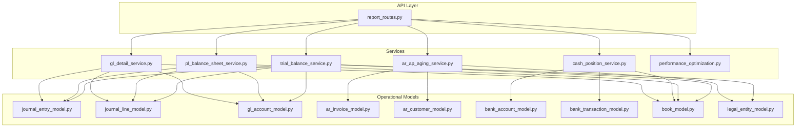
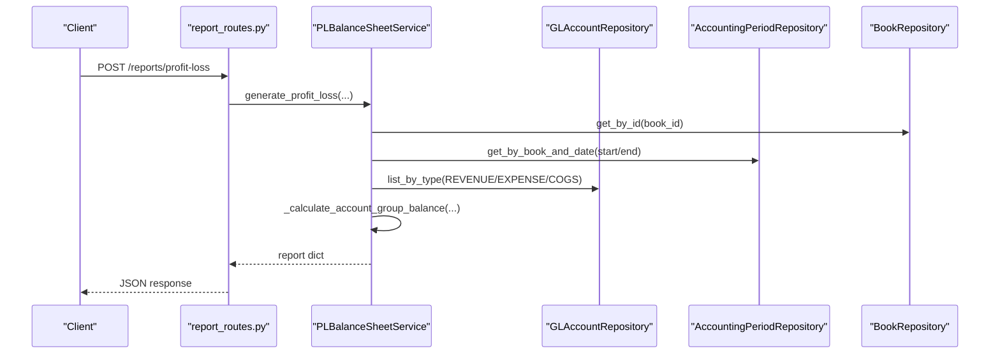
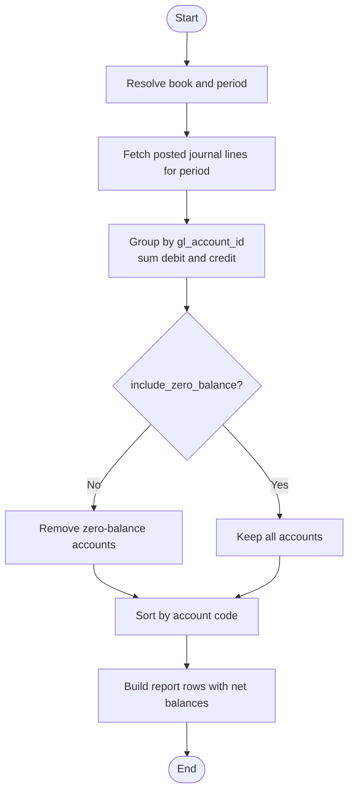
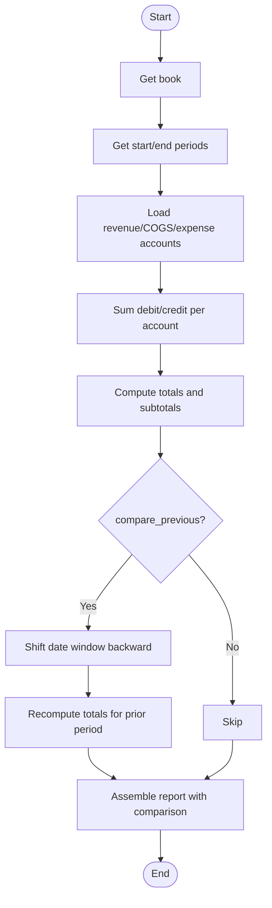
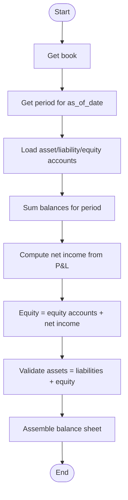
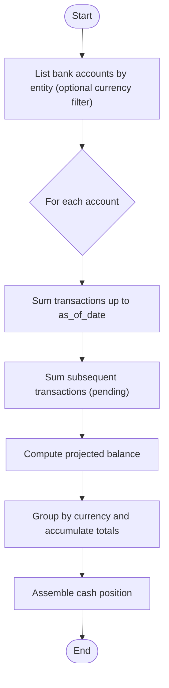
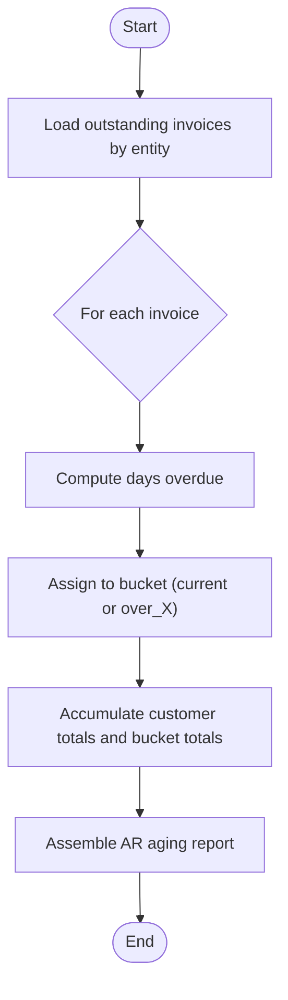
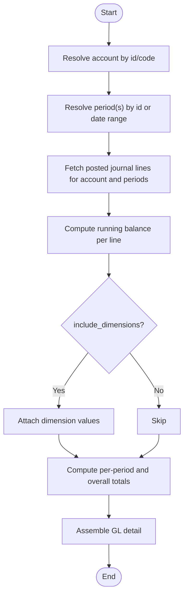
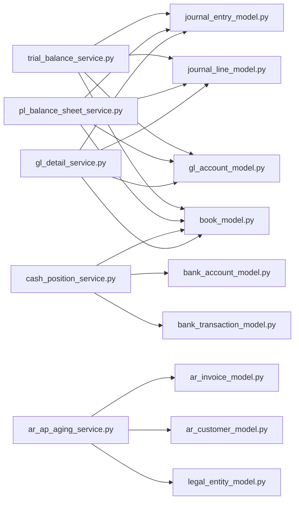

# Reporting Tables

<cite>
**Referenced Files in This Document**
- [report_routes.py](file://app/modules/reporting/api/routes/report_routes.py)
- [report_schemas.py](file://app/modules/reporting/schemas/report_schemas.py)
- [trial_balance_service.py](file://app/modules/reporting/services/trial_balance_service.py)
- [pl_balance_sheet_service.py](file://app/modules/reporting/services/pl_balance_sheet_service.py)
- [cash_position_service.py](file://app/modules/reporting/services/cash_position_service.py)
- [ar_ap_aging_service.py](file://app/modules/reporting/services/ar_ap_aging_service.py)
- [gl_detail_service.py](file://app/modules/reporting/services/gl_detail_service.py)
- [performance_optimization.py](file://app/modules/reporting/services/performance_optimization.py)
- [fm_schema.sql](file://database/fm_schema.sql)
- [journal_entry_model.py](file://app/modules/general_ledger/models/journal_entry_model.py)
- [journal_line_model.py](file://app/modules/general_ledger/models/journal_line_model.py)
- [gl_account_model.py](file://app/modules/general_ledger/models/gl_account_model.py)
- [ar_invoice_model.py](file://app/modules/ar/models/ar_invoice_model.py)
- [ar_customer_model.py](file://app/modules/ar/models/ar_customer_model.py)
- [bank_account_model.py](file://app/modules/treasury/models/bank_account_model.py)
- [bank_transaction_model.py](file://app/modules/treasury/models/bank_transaction_model.py)
- [book_model.py](file://app/modules/general_ledger/models/book_model.py)
- [legal_entity_model.py](file://app/modules/general_ledger/models/legal_entity_model.py)
</cite>

## Table of Contents
1. [Introduction](#introduction)
2. [Project Structure](#project-structure)
3. [Core Components](#core-components)
4. [Architecture Overview](#architecture-overview)
5. [Detailed Component Analysis](#detailed-component-analysis)
6. [Dependency Analysis](#dependency-analysis)
7. [Performance Considerations](#performance-considerations)
8. [Troubleshooting Guide](#troubleshooting-guide)
9. [Conclusion](#conclusion)

## Introduction
This document describes the reporting tables and data structures that power financial analytics and dashboards. It covers:
- Reporting views and materialized tables that aggregate data from operational tables
- Aging analysis tables for Accounts Receivable and Accounts Payable outstanding amounts by period buckets
- Cash position tables that track liquidity across bank accounts and currencies
- Trial balance and financial statement tables that summarize General Ledger activity
- Drill-down tables that maintain historical snapshots for reporting
- Data refresh strategies, aggregation algorithms, and performance optimization techniques
- The relationship between operational tables and reporting structures, including data lineage and audit trail requirements

## Project Structure
The reporting capability is implemented as a modular FastAPI application with dedicated services for each report type. The API routes expose endpoints for trial balance, profit & loss, balance sheet, cash position, AR aging, and GL detail. The services query operational models and repositories to compute aggregates and present structured results.

**Diagram sources**
- [report_routes.py](file://app/modules/reporting/api/routes/report_routes.py#L1-L199)
- [trial_balance_service.py](file://app/modules/reporting/services/trial_balance_service.py#L1-L130)
- [pl_balance_sheet_service.py](file://app/modules/reporting/services/pl_balance_sheet_service.py#L1-L293)
- [cash_position_service.py](file://app/modules/reporting/services/cash_position_service.py#L1-L149)
- [ar_ap_aging_service.py](file://app/modules/reporting/services/ar_ap_aging_service.py#L1-L120)
- [gl_detail_service.py](file://app/modules/reporting/services/gl_detail_service.py#L1-L157)
- [journal_entry_model.py](file://app/modules/general_ledger/models/journal_entry_model.py)
- [journal_line_model.py](file://app/modules/general_ledger/models/journal_line_model.py)
- [gl_account_model.py](file://app/modules/general_ledger/models/gl_account_model.py)
- [ar_invoice_model.py](file://app/modules/ar/models/ar_invoice_model.py)
- [ar_customer_model.py](file://app/modules/ar/models/ar_customer_model.py)
- [bank_account_model.py](file://app/modules/treasury/models/bank_account_model.py)
- [bank_transaction_model.py](file://app/modules/treasury/models/bank_transaction_model.py)
- [book_model.py](file://app/modules/general_ledger/models/book_model.py)
- [legal_entity_model.py](file://app/modules/general_ledger/models/legal_entity_model.py)

**Section sources**
- [report_routes.py](file://app/modules/reporting/api/routes/report_routes.py#L1-L199)
- [report_schemas.py](file://app/modules/reporting/schemas/report_schemas.py#L1-L57)

## Core Components
- Trial Balance: Summarizes account debits and credits for a given period or as-of date, optionally including zero balances.
- Profit & Loss: Computes revenue, cost of goods sold, expenses, gross profit, operating profit, and net profit for a period with optional prior-period comparison.
- Balance Sheet: Presents assets, liabilities, and equity as-of a specific date, derived from posted journal entries and P&L-derived retained earnings.
- Cash Position: Aggregates bank account balances as-of a date, pending transactions, and projected balances by currency.
- AR Aging: Calculates outstanding receivables by customer and aging buckets (default 0, 30, 60, 90+ days).
- GL Detail: Provides a transactional drill-down for a selected GL account within a period or date range, with optional dimension details.

**Section sources**
- [trial_balance_service.py](file://app/modules/reporting/services/trial_balance_service.py#L26-L130)
- [pl_balance_sheet_service.py](file://app/modules/reporting/services/pl_balance_sheet_service.py#L24-L202)
- [cash_position_service.py](file://app/modules/reporting/services/cash_position_service.py#L23-L101)
- [ar_ap_aging_service.py](file://app/modules/reporting/services/ar_ap_aging_service.py#L22-L120)
- [gl_detail_service.py](file://app/modules/reporting/services/gl_detail_service.py#L23-L157)

## Architecture Overview
The reporting architecture follows a layered pattern:
- API routes accept requests and delegate to service classes
- Services encapsulate report-specific logic, including joins, filters, and aggregations
- Services rely on repositories and models to access operational data
- Responses are returned as dictionaries with normalized structures for dashboards

**Diagram sources**
- [report_routes.py](file://app/modules/reporting/api/routes/report_routes.py#L46-L84)
- [pl_balance_sheet_service.py](file://app/modules/reporting/services/pl_balance_sheet_service.py#L24-L123)

## Detailed Component Analysis

### Trial Balance
- Inputs: book_id, period_id or as_of_date, include_zero_balance
- Algorithm:
  - Resolve book and period
  - Fetch all posted journal lines for the period
  - Aggregate debit and credit per account
  - Optionally filter out zero-balance accounts
  - Sort by account code
- Output: totals, balanced flag, and per-account rows

**Diagram sources**
- [trial_balance_service.py](file://app/modules/reporting/services/trial_balance_service.py#L26-L130)

**Section sources**
- [trial_balance_service.py](file://app/modules/reporting/services/trial_balance_service.py#L26-L130)

### Profit & Loss (Income Statement)
- Inputs: book_id, period_start, period_end, compare_previous
- Algorithm:
  - Resolve start and end periods
  - Retrieve revenue, COGS, and expense accounts
  - Sum posted journal lines for each group across the period range
  - Compute gross profit, operating profit, net profit
  - Optional: shift date range backward to compute prior period and deltas
- Output: totals and per-account details for revenue, COGS, expenses, plus optional comparison

**Diagram sources**
- [pl_balance_sheet_service.py](file://app/modules/reporting/services/pl_balance_sheet_service.py#L24-L123)

**Section sources**
- [pl_balance_sheet_service.py](file://app/modules/reporting/services/pl_balance_sheet_service.py#L24-L123)

### Balance Sheet
- Inputs: book_id, as_of_date
- Algorithm:
  - Resolve period containing as_of_date
  - Load asset, liability, and equity accounts
  - Sum posted journal lines for the period to get balances
  - Add retained earnings computed from current period P&L
  - Verify equality: assets = liabilities + equity
- Output: assets, liabilities, equity, retained earnings, totals, and balance check

**Diagram sources**
- [pl_balance_sheet_service.py](file://app/modules/reporting/services/pl_balance_sheet_service.py#L125-L202)

**Section sources**
- [pl_balance_sheet_service.py](file://app/modules/reporting/services/pl_balance_sheet_service.py#L125-L202)

### Cash Position
- Inputs: entity_id, as_of_date, currency (optional)
- Algorithm:
  - List bank accounts for entity (filter by currency if provided)
  - For each account:
    - Sum posted bank transactions up to as_of_date to compute balance
    - Sum subsequent transactions to compute pending debits/credits
    - Compute projected balance
  - Group by currency and produce totals
- Output: per-account details, per-currency totals, and summary counts

**Diagram sources**
- [cash_position_service.py](file://app/modules/reporting/services/cash_position_service.py#L23-L101)

**Section sources**
- [cash_position_service.py](file://app/modules/reporting/services/cash_position_service.py#L23-L101)

### AR Aging
- Inputs: entity_id, as_of_date, aging_buckets (default [0, 30, 60, 90])
- Algorithm:
  - Fetch all outstanding invoices for the entity
  - For each invoice, compute days overdue vs. due_date or invoice_date
  - Assign to current or “over X” bucket
  - Aggregate totals per customer and overall bucket totals
- Output: entity info, as_of_date, buckets, totals, and per-customer breakdown with invoice details

**Diagram sources**
- [ar_ap_aging_service.py](file://app/modules/reporting/services/ar_ap_aging_service.py#L22-L120)

**Section sources**
- [ar_ap_aging_service.py](file://app/modules/reporting/services/ar_ap_aging_service.py#L22-L120)

### GL Detail
- Inputs: book_id, account_id or account_code, period_id or (period_start, period_end), include_dimensions
- Algorithm:
  - Resolve account and period(s)
  - Fetch posted journal lines for the account and periods
  - Compute running balance per line
  - Optionally attach dimension values per line
  - Summarize per-period totals and overall totals
- Output: account metadata, period range, totals, and ordered transaction rows

**Diagram sources**
- [gl_detail_service.py](file://app/modules/reporting/services/gl_detail_service.py#L23-L157)

**Section sources**
- [gl_detail_service.py](file://app/modules/reporting/services/gl_detail_service.py#L23-L157)

## Dependency Analysis
The reporting services depend on operational models and repositories to compute aggregates. The database schema defines the authoritative tables and indexes used by these services.

**Diagram sources**
- [trial_balance_service.py](file://app/modules/reporting/services/trial_balance_service.py#L1-L130)
- [pl_balance_sheet_service.py](file://app/modules/reporting/services/pl_balance_sheet_service.py#L1-L293)
- [cash_position_service.py](file://app/modules/reporting/services/cash_position_service.py#L1-L149)
- [ar_ap_aging_service.py](file://app/modules/reporting/services/ar_ap_aging_service.py#L1-L120)
- [gl_detail_service.py](file://app/modules/reporting/services/gl_detail_service.py#L1-L157)
- [journal_entry_model.py](file://app/modules/general_ledger/models/journal_entry_model.py)
- [journal_line_model.py](file://app/modules/general_ledger/models/journal_line_model.py)
- [gl_account_model.py](file://app/modules/general_ledger/models/gl_account_model.py)
- [ar_invoice_model.py](file://app/modules/ar/models/ar_invoice_model.py)
- [ar_customer_model.py](file://app/modules/ar/models/ar_customer_model.py)
- [bank_account_model.py](file://app/modules/treasury/models/bank_account_model.py)
- [bank_transaction_model.py](file://app/modules/treasury/models/bank_transaction_model.py)
- [book_model.py](file://app/modules/general_ledger/models/book_model.py)
- [legal_entity_model.py](file://app/modules/general_ledger/models/legal_entity_model.py)

**Section sources**
- [fm_schema.sql](file://database/fm_schema.sql#L146-L297)
- [fm_schema.sql](file://database/fm_schema.sql#L316-L424)
- [fm_schema.sql](file://database/fm_schema.sql#L474-L526)

## Performance Considerations
- Indexing: The schema includes numerous indexes on foreign keys, status, date, and composite columns to accelerate reporting queries. The performance optimization service reviews missing indexes and suggests improvements.
- Query patterns: Services commonly join journal entries and lines, filter by posted status, and aggregate by account and period. Proper indexing on book_id, period_id, status, and date columns is essential.
- Statistics and maintenance: The performance service queries table statistics and slow query logs (when enabled) to guide vacuum/autoanalyze and index decisions.
- Recommendations:
  - Ensure indexes exist on frequently filtered columns (status, date ranges)
  - Maintain table statistics via regular vacuum/autoanalyze
  - Monitor slow queries and add targeted indexes for hotspots
  - Consider partitioning large tables by date where appropriate

**Section sources**
- [performance_optimization.py](file://app/modules/reporting/services/performance_optimization.py#L15-L172)
- [fm_schema.sql](file://database/fm_schema.sql#L264-L269)
- [fm_schema.sql](file://database/fm_schema.sql#L355-L361)
- [fm_schema.sql](file://database/fm_schema.sql#L518-L525)

## Troubleshooting Guide
- Validation errors:
  - Trial Balance requires either period_id or as_of_date; invalid combinations raise errors.
  - GL Detail requires either account_id or account_code and either period_id or a valid date range.
  - AR Aging requires entity_id and as_of_date; bucket defaults are applied if omitted.
- Period resolution:
  - Profit & Loss and Balance Sheet require valid periods for the given date range; otherwise, errors are raised.
- Zero-balance filtering:
  - Trial Balance supports inclusion/exclusion of zero balances via a flag.
- Currency filtering:
  - Cash Position supports optional currency filter to narrow results.
- Audit and lineage:
  - Journal entries are immutable after posting; ensure status filtering is set to posted for accurate reporting.
  - Dimension values can be included in GL Detail for granular drill-down.

**Section sources**
- [report_routes.py](file://app/modules/reporting/api/routes/report_routes.py#L25-L199)
- [trial_balance_service.py](file://app/modules/reporting/services/trial_balance_service.py#L26-L56)
- [gl_detail_service.py](file://app/modules/reporting/services/gl_detail_service.py#L23-L71)
- [ar_ap_aging_service.py](file://app/modules/reporting/services/ar_ap_aging_service.py#L22-L37)
- [pl_balance_sheet_service.py](file://app/modules/reporting/services/pl_balance_sheet_service.py#L24-L49)
- [journal_entry_model.py](file://app/modules/general_ledger/models/journal_entry_model.py)

## Conclusion
The reporting subsystem provides robust, modular services for financial analytics:
- Trial balance, P&L, and balance sheet leverage posted journal entries and account hierarchies
- AR aging and cash position integrate operational data from AR and treasury modules
- GL detail offers drill-down with optional dimensions for deep analysis
- The schema and indexes are designed to support efficient reporting, and the performance service aids ongoing optimization