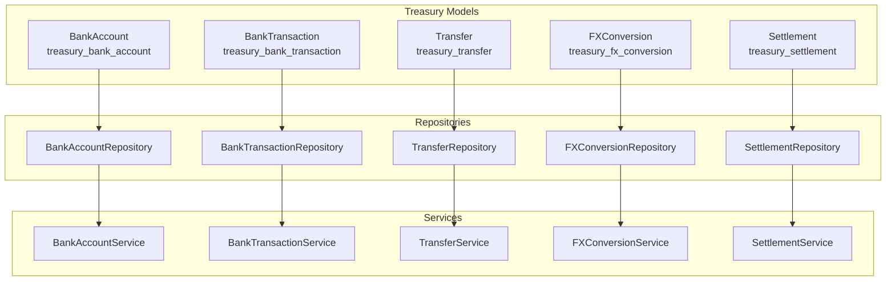
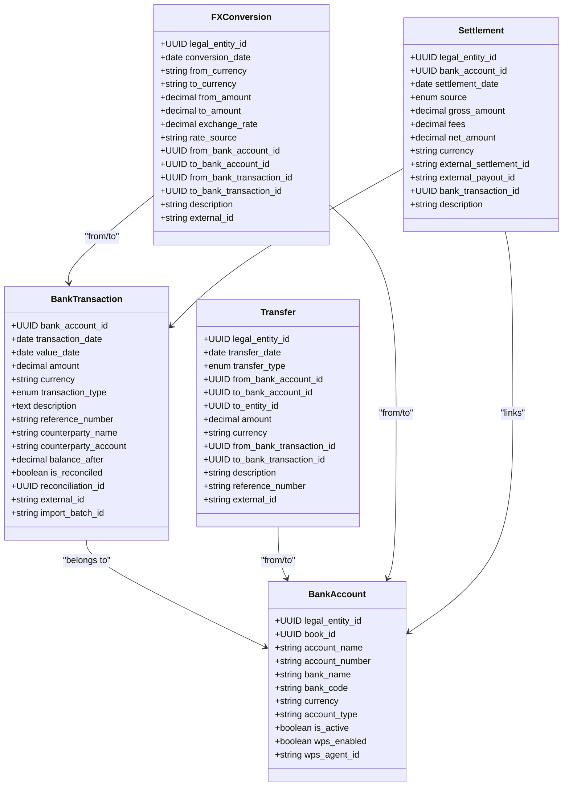
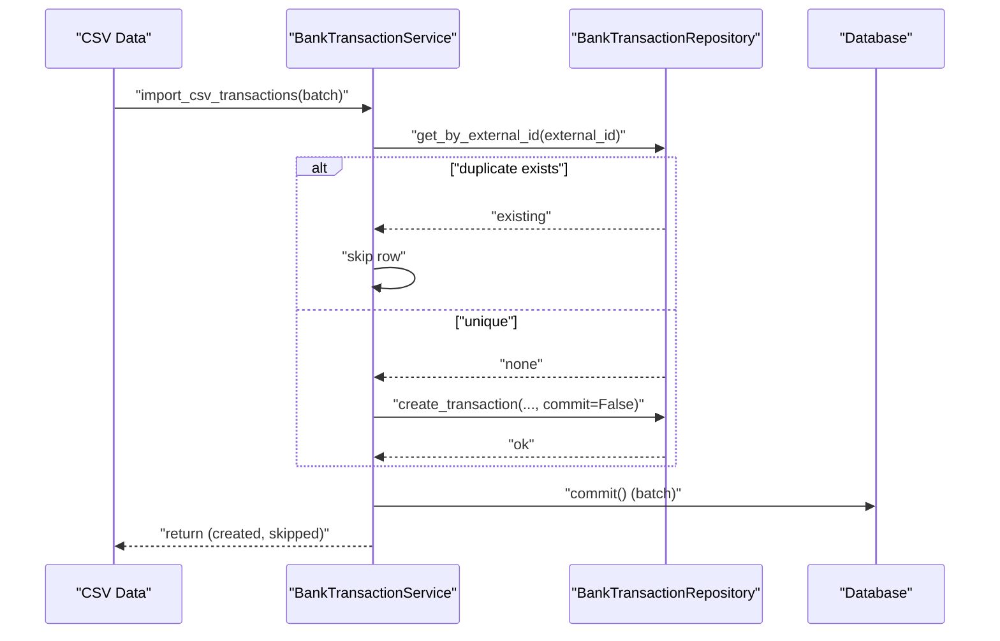
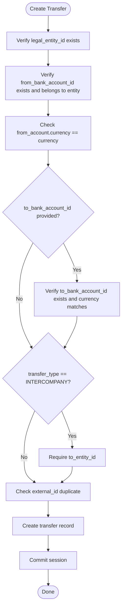
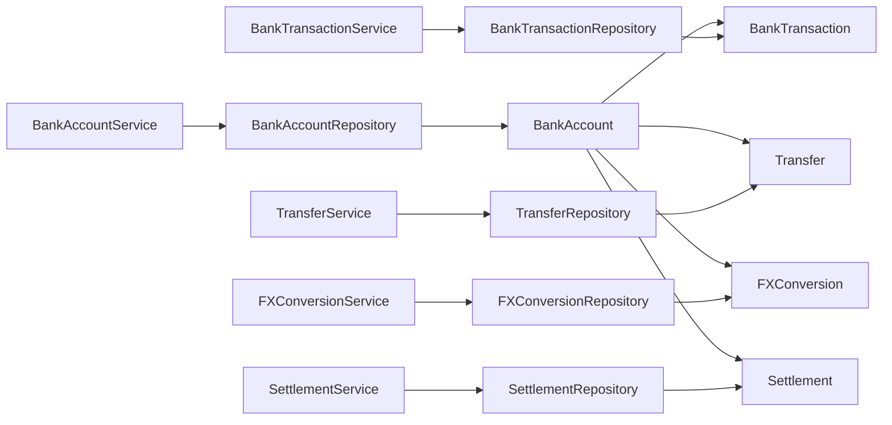

# Treasury Tables

<cite>
**Referenced Files in This Document**
- [bank_account_model.py](file://app/modules/treasury/models/bank_account_model.py)
- [bank_transaction_model.py](file://app/modules/treasury/models/bank_transaction_model.py)
- [transfer_model.py](file://app/modules/treasury/models/transfer_model.py)
- [fx_conversion_model.py](file://app/modules/treasury/models/fx_conversion_model.py)
- [settlement_model.py](file://app/modules/treasury/models/settlement_model.py)
- [bank_account_repository.py](file://app/modules/treasury/repositories/bank_account_repository.py)
- [bank_transaction_repository.py](file://app/modules/treasury/repositories/bank_transaction_repository.py)
- [transfer_repository.py](file://app/modules/treasury/repositories/transfer_repository.py)
- [fx_conversion_repository.py](file://app/modules/treasury/repositories/fx_conversion_repository.py)
- [settlement_repository.py](file://app/modules/treasury/repositories/settlement_repository.py)
- [bank_account_service.py](file://app/modules/treasury/services/bank_account_service.py)
- [bank_transaction_service.py](file://app/modules/treasury/services/bank_transaction_service.py)
- [transfer_service.py](file://app/modules/treasury/services/transfer_service.py)
- [fx_conversion_service.py](file://app/modules/treasury/services/fx_conversion_service.py)
- [settlement_service.py](file://app/modules/treasury/services/settlement_service.py)
</cite>

## Table of Contents
1. [Introduction](#introduction)
2. [Project Structure](#project-structure)
3. [Core Components](#core-components)
4. [Architecture Overview](#architecture-overview)
5. [Detailed Component Analysis](#detailed-component-analysis)
6. [Dependency Analysis](#dependency-analysis)
7. [Performance Considerations](#performance-considerations)
8. [Troubleshooting Guide](#troubleshooting-guide)
9. [Conclusion](#conclusion)

## Introduction
This document describes the Treasury domain tables and related services that manage cash operations and bank reconciliation. It covers:
- Bank Account table and cash management
- Bank Transaction table and bank statement processing
- Transfer table and cash movement tracking
- FX Conversion table and foreign exchange handling
- Settlement table and reconciliation linkage
It also documents validation rules, indexing strategies, and operational flows for reconciliation and cash position management.

## Project Structure
The Treasury domain is organized around models (tables), repositories (data access), and services (business logic). The models define the schema; repositories encapsulate queries; services orchestrate validations and operations.

**Diagram sources**
- [bank_account_model.py](file://app/modules/treasury/models/bank_account_model.py#L9-L36)
- [bank_transaction_model.py](file://app/modules/treasury/models/bank_transaction_model.py#L21-L52)
- [transfer_model.py](file://app/modules/treasury/models/transfer_model.py#L17-L49)
- [fx_conversion_model.py](file://app/modules/treasury/models/fx_conversion_model.py#L9-L41)
- [settlement_model.py](file://app/modules/treasury/models/settlement_model.py#L17-L48)
- [bank_account_repository.py](file://app/modules/treasury/repositories/bank_account_repository.py#L10-L40)
- [bank_transaction_repository.py](file://app/modules/treasury/repositories/bank_transaction_repository.py#L11-L97)
- [transfer_repository.py](file://app/modules/treasury/repositories/transfer_repository.py#L11-L67)
- [fx_conversion_repository.py](file://app/modules/treasury/repositories/fx_conversion_repository.py#L11-L45)
- [settlement_repository.py](file://app/modules/treasury/repositories/settlement_repository.py#L11-L48)
- [bank_account_service.py](file://app/modules/treasury/services/bank_account_service.py#L11-L97)
- [bank_transaction_service.py](file://app/modules/treasury/services/bank_transaction_service.py#L13-L171)
- [transfer_service.py](file://app/modules/treasury/services/transfer_service.py#L14-L113)
- [fx_conversion_service.py](file://app/modules/treasury/services/fx_conversion_service.py#L14-L112)
- [settlement_service.py](file://app/modules/treasury/services/settlement_service.py#L14-L124)

**Section sources**
- [bank_account_model.py](file://app/modules/treasury/models/bank_account_model.py#L9-L36)
- [bank_transaction_model.py](file://app/modules/treasury/models/bank_transaction_model.py#L21-L52)
- [transfer_model.py](file://app/modules/treasury/models/transfer_model.py#L17-L49)
- [fx_conversion_model.py](file://app/modules/treasury/models/fx_conversion_model.py#L9-L41)
- [settlement_model.py](file://app/modules/treasury/models/settlement_model.py#L17-L48)

## Core Components
This section documents each Treasury table with its purpose, key fields, relationships, and constraints.

- Bank Account (treasury_bank_account)
  - Purpose: Per-legal-entity bank account records supporting cash management and reconciliation.
  - Key fields: legal_entity_id, book_id, account_name, account_number, bank_name, bank_code, currency, account_type, is_active, wps_enabled, wps_agent_id.
  - Relationships: linked to LegalEntity; has many BankTransactions and ReconciliationSessions.
  - Notes: Supports UAE WPS via wps_enabled and wps_agent_id.

- Bank Transaction (treasury_bank_transaction)
  - Purpose: Individual statement lines imported from banks; supports reconciliation.
  - Key fields: bank_account_id, transaction_date, value_date, amount, currency, transaction_type, description, reference_number, counterparty_name, counterparty_account, balance_after, is_reconciled, reconciliation_id, external_id, import_batch_id.
  - Relationships: belongs to BankAccount.
  - Constraints: composite indexes on (bank_account_id, transaction_date) and (bank_account_id, is_reconciled); external_id is unique.

- Transfer (treasury_transfer)
  - Purpose: Tracks cash movements (intra-entity, intercompany, external).
  - Key fields: legal_entity_id, transfer_date, transfer_type, from_bank_account_id, to_bank_account_id, to_entity_id, amount, currency, from_bank_transaction_id, to_bank_transaction_id, description, reference_number, external_id.
  - Relationships: links LegalEntity, BankAccounts (from/to), optional BankTransactions (from/to).
  - Notes: transfer_type enum includes INTERCOMPANY, INTRA_ENTITY, EXTERNAL.

- FX Conversion (treasury_fx_conversion)
  - Purpose: Records realized foreign exchange conversions with linked bank transactions/accounts.
  - Key fields: legal_entity_id, conversion_date, from_currency, to_currency, from_amount, to_amount, exchange_rate, rate_source, from_bank_account_id, to_bank_account_id, from_bank_transaction_id, to_bank_transaction_id, description, external_id.
  - Relationships: links LegalEntity and BankAccounts/Transactions.

- Settlement (treasury_settlement)
  - Purpose: Payment gateway payouts and settlements (e.g., Stripe/TELR).
  - Key fields: legal_entity_id, bank_account_id, settlement_date, source, gross_amount, fees, net_amount, currency, external_settlement_id, external_payout_id, bank_transaction_id, description.
  - Constraints: composite unique constraint on (source, external_settlement_id) where external_settlement_id is not null.

**Section sources**
- [bank_account_model.py](file://app/modules/treasury/models/bank_account_model.py#L9-L36)
- [bank_transaction_model.py](file://app/modules/treasury/models/bank_transaction_model.py#L21-L52)
- [transfer_model.py](file://app/modules/treasury/models/transfer_model.py#L17-L49)
- [fx_conversion_model.py](file://app/modules/treasury/models/fx_conversion_model.py#L9-L41)
- [settlement_model.py](file://app/modules/treasury/models/settlement_model.py#L17-L48)

## Architecture Overview
The Treasury domain follows a layered architecture:
- Models define persistence schema and relationships.
- Repositories encapsulate CRUD and query logic.
- Services enforce business rules, validations, and cross-entity checks.
- External IDs prevent duplication during imports; indexes optimize common queries.

**Diagram sources**
- [bank_account_model.py](file://app/modules/treasury/models/bank_account_model.py#L9-L36)
- [bank_transaction_model.py](file://app/modules/treasury/models/bank_transaction_model.py#L21-L52)
- [transfer_model.py](file://app/modules/treasury/models/transfer_model.py#L17-L49)
- [fx_conversion_model.py](file://app/modules/treasury/models/fx_conversion_model.py#L9-L41)
- [settlement_model.py](file://app/modules/treasury/models/settlement_model.py#L17-L48)

## Detailed Component Analysis

### Bank Account Table
- Purpose: Centralize bank account metadata per legal entity, enabling cash management and reconciliation.
- Notable fields: currency, account_type, is_active, wps_enabled/wps_agent_id for UAE WPS.
- Relationships: Transactions and ReconciliationSessions.
- Access patterns: List by entity and currency; filter active accounts.

**Section sources**
- [bank_account_model.py](file://app/modules/treasury/models/bank_account_model.py#L9-L36)
- [bank_account_repository.py](file://app/modules/treasury/repositories/bank_account_repository.py#L10-L40)
- [bank_account_service.py](file://app/modules/treasury/services/bank_account_service.py#L11-L97)

### Bank Transaction Table
- Purpose: Statement line items with reconciliation support.
- Key fields: amount (+deposit, -withdrawal), transaction_type, is_reconciled, external_id, import_batch_id.
- Indexing: Optimizes lookups by account/date and account/reconciled flag.
- Processing: CSV import with atomic batch commit; deduplication via external_id.

**Diagram sources**
- [bank_transaction_service.py](file://app/modules/treasury/services/bank_transaction_service.py#L80-L132)
- [bank_transaction_repository.py](file://app/modules/treasury/repositories/bank_transaction_repository.py#L11-L97)

**Section sources**
- [bank_transaction_model.py](file://app/modules/treasury/models/bank_transaction_model.py#L21-L52)
- [bank_transaction_repository.py](file://app/modules/treasury/repositories/bank_transaction_repository.py#L11-L97)
- [bank_transaction_service.py](file://app/modules/treasury/services/bank_transaction_service.py#L13-L171)

### Transfer Table
- Purpose: Track cash movements across bank accounts and entities.
- Validation rules:
  - From/to accounts must belong to the specified legal entity and match currency.
  - Intercompany requires a destination entity.
  - External ID prevents duplicates.
- Relationships: Links LegalEntity, BankAccounts (from/to), optional BankTransactions.

**Diagram sources**
- [transfer_service.py](file://app/modules/treasury/services/transfer_service.py#L23-L89)
- [transfer_model.py](file://app/modules/treasury/models/transfer_model.py#L17-L49)

**Section sources**
- [transfer_model.py](file://app/modules/treasury/models/transfer_model.py#L17-L49)
- [transfer_repository.py](file://app/modules/treasury/repositories/transfer_repository.py#L11-L67)
- [transfer_service.py](file://app/modules/treasury/services/transfer_service.py#L14-L113)

### FX Conversion Table
- Purpose: Record realized FX conversions with validated rates and optional bank linkage.
- Validation rules:
  - from_currency must differ from to_currency.
  - Provided bank accounts must match currencies.
  - exchange_rate must match to_amount/from_amount within tolerance.
  - external_id prevents duplicates.

**Section sources**
- [fx_conversion_model.py](file://app/modules/treasury/models/fx_conversion_model.py#L9-L41)
- [fx_conversion_repository.py](file://app/modules/treasury/repositories/fx_conversion_repository.py#L11-L45)
- [fx_conversion_service.py](file://app/modules/treasury/services/fx_conversion_service.py#L14-L112)

### Settlement Table
- Purpose: Capture payment gateway settlements and payouts.
- Validation rules:
  - Bank account must belong to the entity and match currency.
  - gross_amount and fees must be non-negative.
  - net_amount must equal gross minus fees.
  - external_settlement_id must be unique per source/provider.
- Relationships: Links BankAccount and optional BankTransaction.

**Section sources**
- [settlement_model.py](file://app/modules/treasury/models/settlement_model.py#L17-L48)
- [settlement_repository.py](file://app/modules/treasury/repositories/settlement_repository.py#L11-L48)
- [settlement_service.py](file://app/modules/treasury/services/settlement_service.py#L14-L124)

## Dependency Analysis
- Models define foreign keys and relationships.
- Repositories depend on SQLAlchemy select and UUID-based filtering.
- Services depend on repositories and enforce business rules, including cross-entity and currency checks.
- External IDs enable idempotent imports; indexes optimize frequent queries.

**Diagram sources**
- [bank_account_model.py](file://app/modules/treasury/models/bank_account_model.py#L9-L36)
- [bank_transaction_model.py](file://app/modules/treasury/models/bank_transaction_model.py#L21-L52)
- [transfer_model.py](file://app/modules/treasury/models/transfer_model.py#L17-L49)
- [fx_conversion_model.py](file://app/modules/treasury/models/fx_conversion_model.py#L9-L41)
- [settlement_model.py](file://app/modules/treasury/models/settlement_model.py#L17-L48)
- [bank_account_repository.py](file://app/modules/treasury/repositories/bank_account_repository.py#L10-L40)
- [bank_transaction_repository.py](file://app/modules/treasury/repositories/bank_transaction_repository.py#L11-L97)
- [transfer_repository.py](file://app/modules/treasury/repositories/transfer_repository.py#L11-L67)
- [fx_conversion_repository.py](file://app/modules/treasury/repositories/fx_conversion_repository.py#L11-L45)
- [settlement_repository.py](file://app/modules/treasury/repositories/settlement_repository.py#L11-L48)
- [bank_account_service.py](file://app/modules/treasury/services/bank_account_service.py#L11-L97)
- [bank_transaction_service.py](file://app/modules/treasury/services/bank_transaction_service.py#L13-L171)
- [transfer_service.py](file://app/modules/treasury/services/transfer_service.py#L14-L113)
- [fx_conversion_service.py](file://app/modules/treasury/services/fx_conversion_service.py#L14-L112)
- [settlement_service.py](file://app/modules/treasury/services/settlement_service.py#L14-L124)

**Section sources**
- [bank_account_model.py](file://app/modules/treasury/models/bank_account_model.py#L9-L36)
- [bank_transaction_model.py](file://app/modules/treasury/models/bank_transaction_model.py#L21-L52)
- [transfer_model.py](file://app/modules/treasury/models/transfer_model.py#L17-L49)
- [fx_conversion_model.py](file://app/modules/treasury/models/fx_conversion_model.py#L9-L41)
- [settlement_model.py](file://app/modules/treasury/models/settlement_model.py#L17-L48)

## Performance Considerations
- Indexes:
  - BankTransaction: (bank_account_id, transaction_date) and (bank_account_id, is_reconciled) improve reconciliation and listing performance.
  - BankTransaction: external_id unique index prevents duplicates and speeds up dedupe checks.
  - BankAccount: indices on legal_entity_id and book_id support fast filtering.
- Pagination:
  - BankTransactionService supports cursor-based pagination to handle large datasets efficiently.
- Atomic batches:
  - CSV imports commit once after validating and creating all rows, minimizing transaction overhead.

**Section sources**
- [bank_transaction_model.py](file://app/modules/treasury/models/bank_transaction_model.py#L44-L48)
- [bank_transaction_repository.py](file://app/modules/treasury/repositories/bank_transaction_repository.py#L54-L84)
- [bank_transaction_service.py](file://app/modules/treasury/services/bank_transaction_service.py#L80-L132)

## Troubleshooting Guide
- Duplicate entries:
  - External IDs are unique; attempting to re-import the same external_id raises a duplicate error. Deduplicate upstream or use a new external_id.
- Currency mismatches:
  - Creating transactions/transfers/settlements fails if currencies do not match the associated account’s currency.
- Intercompany validation:
  - Intercompany transfers require a destination entity; missing this causes validation errors.
- FX rate validation:
  - Exchange rate must match the computed ratio of to_amount/from_amount within tolerance.
- Settlement amount validation:
  - Net amount must equal gross minus fees; otherwise, validation fails.

**Section sources**
- [bank_transaction_service.py](file://app/modules/treasury/services/bank_transaction_service.py#L49-L58)
- [transfer_service.py](file://app/modules/treasury/services/transfer_service.py#L43-L67)
- [fx_conversion_service.py](file://app/modules/treasury/services/fx_conversion_service.py#L44-L67)
- [settlement_service.py](file://app/modules/treasury/services/settlement_service.py#L52-L59)

## Conclusion
The Treasury tables form a cohesive system for cash management and bank reconciliation:
- BankAccount anchors cash positions per legal entity.
- BankTransaction captures statement activity with robust import and deduplication.
- Transfer tracks cash movements with strict validation rules.
- FXConversion ensures accurate realized exchange handling.
- Settlement integrates payment gateway data with reconciliation-ready records.
Together, these components provide strong data integrity, efficient querying, and extensible reconciliation workflows.