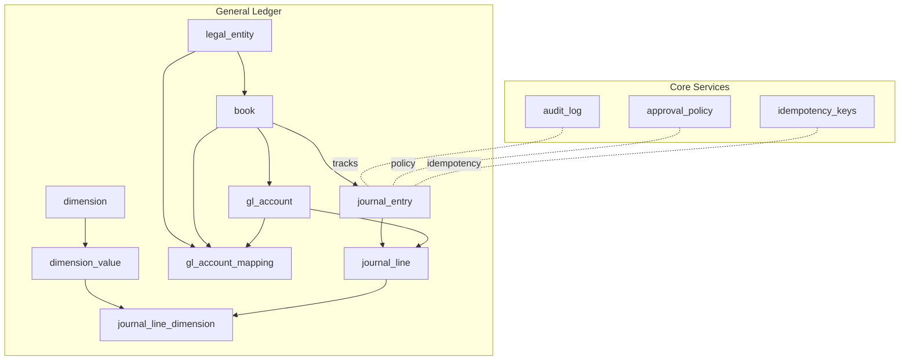
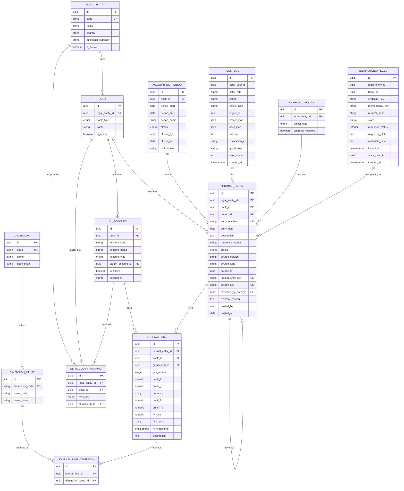
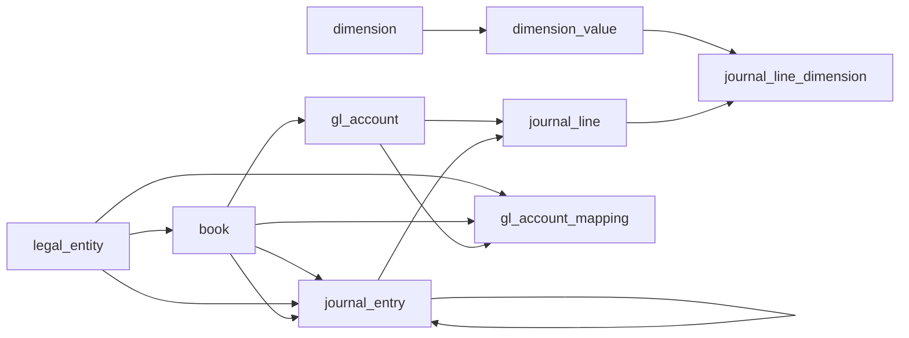

# Core Tables

<cite>
**Referenced Files in This Document**
- [legal_entity_model.py](file://app/modules/general_ledger/models/legal_entity_model.py)
- [book_model.py](file://app/modules/general_ledger/models/book_model.py)
- [dimension_model.py](file://app/modules/general_ledger/models/dimension_model.py)
- [gl_account_model.py](file://app/modules/general_ledger/models/gl_account_model.py)
- [journal_entry_model.py](file://app/modules/general_ledger/models/journal_entry_model.py)
- [audit_log_model.py](file://app/modules/core/models/audit_log_model.py)
- [approval_policy_model.py](file://app/modules/core/models/approval_policy_model.py)
- [idempotency_model.py](file://app/modules/core/models/idempotency_model.py)
- [fm_schema.sql](file://database/fm_schema.sql)
- [001_add_approval_workflow_fields_and_period_close_checklist.py](file://database/migrations/versions/001_add_approval_workflow_fields_and_period_close_checklist.py)
- [002_add_idempotency_and_source_key_safety.py](file://database/migrations/versions/002_add_idempotency_and_source_key_safety.py)
- [approval_policy_repository.py](file://app/modules/core/repositories/approval_policy_repository.py)
</cite>

## Table of Contents
1. [Introduction](#introduction)
2. [Project Structure](#project-structure)
3. [Core Components](#core-components)
4. [Architecture Overview](#architecture-overview)
5. [Detailed Component Analysis](#detailed-component-analysis)
6. [Dependency Analysis](#dependency-analysis)
7. [Performance Considerations](#performance-considerations)
8. [Troubleshooting Guide](#troubleshooting-guide)
9. [Conclusion](#conclusion)

## Introduction
This document describes the core database tables that underpin the TrueVow financial management system. It focuses on:
- Multi-entity support via legal_entity
- Multi-book accounting via book
- Tagging infrastructure via dimension and dimension_value
- System-generated postings via gl_account_mapping
- Audit trail via audit_log
- Approval policy management via approval_policy
- Idempotency tracking via idempotency_keys

It explains table schemas, primary and foreign key relationships, indexing strategy, and business rule enforcement. It also documents the audit trail mechanism, approval workflow integration, and idempotency key management, with practical query patterns for each core table.

## Project Structure
The core tables are defined both in SQLAlchemy models and in the canonical SQL schema. Migrations evolve the schema over time, adding constraints and indexes for safety and performance.

**Diagram sources**
- [fm_schema.sql](file://database/fm_schema.sql#L129-L221)
- [legal_entity_model.py](file://app/modules/general_ledger/models/legal_entity_model.py#L7-L22)
- [book_model.py](file://app/modules/general_ledger/models/book_model.py#L15-L36)
- [dimension_model.py](file://app/modules/general_ledger/models/dimension_model.py#L8-L40)
- [gl_account_model.py](file://app/modules/general_ledger/models/gl_account_model.py#L28-L80)
- [journal_entry_model.py](file://app/modules/general_ledger/models/journal_entry_model.py#L17-L128)
- [audit_log_model.py](file://app/modules/core/models/audit_log_model.py#L9-L43)
- [approval_policy_model.py](file://app/modules/core/models/approval_policy_model.py#L18-L36)
- [idempotency_model.py](file://app/modules/core/models/idempotency_model.py#L17-L54)

**Section sources**
- [fm_schema.sql](file://database/fm_schema.sql#L129-L221)
- [legal_entity_model.py](file://app/modules/general_ledger/models/legal_entity_model.py#L7-L22)
- [book_model.py](file://app/modules/general_ledger/models/book_model.py#L15-L36)
- [dimension_model.py](file://app/modules/general_ledger/models/dimension_model.py#L8-L40)
- [gl_account_model.py](file://app/modules/general_ledger/models/gl_account_model.py#L28-L80)
- [journal_entry_model.py](file://app/modules/general_ledger/models/journal_entry_model.py#L17-L128)
- [audit_log_model.py](file://app/modules/core/models/audit_log_model.py#L9-L43)
- [approval_policy_model.py](file://app/modules/core/models/approval_policy_model.py#L18-L36)
- [idempotency_model.py](file://app/modules/core/models/idempotency_model.py#L17-L54)

## Core Components
- legal_entity: Identifies companies and their functional currency and country.
- book: Per-entity accounting books (accrual vs cash).
- dimension and dimension_value: Tag categories and values for journal lines.
- gl_account: Chart of accounts per book; hierarchical parent-child structure.
- gl_account_mapping: Maps system-generated posting keys to GL accounts.
- journal_entry and journal_line: Immutable journal entries and balanced lines.
- audit_log: Comprehensive audit trail for mutations and critical operations.
- approval_policy: Enables per-entity, per-object-type approval requirements.
- idempotency_keys: Write-idempotency keys scoped by entity, book, and endpoint.

**Section sources**
- [legal_entity_model.py](file://app/modules/general_ledger/models/legal_entity_model.py#L7-L22)
- [book_model.py](file://app/modules/general_ledger/models/book_model.py#L15-L36)
- [dimension_model.py](file://app/modules/general_ledger/models/dimension_model.py#L8-L40)
- [gl_account_model.py](file://app/modules/general_ledger/models/gl_account_model.py#L28-L80)
- [journal_entry_model.py](file://app/modules/general_ledger/models/journal_entry_model.py#L17-L128)
- [audit_log_model.py](file://app/modules/core/models/audit_log_model.py#L9-L43)
- [approval_policy_model.py](file://app/modules/core/models/approval_policy_model.py#L18-L36)
- [idempotency_model.py](file://app/modules/core/models/idempotency_model.py#L17-L54)

## Architecture Overview
The core tables form a tightly integrated financial backbone:
- Legal entities own books; books own accounts, periods, and journal entries.
- Journal entries reference books and periods; lines reference accounts and attach dimensions.
- System-generated postings use gl_account_mapping keyed by legal_entity_id, book_id, and map_key.
- Audit logs capture all mutations; approval policies govern workflow gating; idempotency keys prevent duplicate writes.

**Diagram sources**
- [fm_schema.sql](file://database/fm_schema.sql#L129-L221)
- [journal_entry_model.py](file://app/modules/general_ledger/models/journal_entry_model.py#L17-L128)
- [gl_account_model.py](file://app/modules/general_ledger/models/gl_account_model.py#L28-L80)
- [dimension_model.py](file://app/modules/general_ledger/models/dimension_model.py#L8-L40)
- [audit_log_model.py](file://app/modules/core/models/audit_log_model.py#L9-L43)
- [approval_policy_model.py](file://app/modules/core/models/approval_policy_model.py#L18-L36)
- [idempotency_model.py](file://app/modules/core/models/idempotency_model.py#L17-L54)

## Detailed Component Analysis

### Legal Entity (multi-entity support)
- Purpose: Represents legal entities (companies) with country and functional currency.
- Key attributes: code (unique), name, country, functional_currency, is_active.
- Relationships: One-to-many with book.
- Business rules:
  - code is unique and indexed.
  - is_active defaults to true.
- Typical queries:
  - List active entities: SELECT id, code, name FROM legal_entity WHERE is_active = true ORDER BY code.
  - Get entity by code: SELECT * FROM legal_entity WHERE code = ? LIMIT 1.
  - Books for an entity: SELECT id, name, book_type FROM book WHERE legal_entity_id = ?.

**Section sources**
- [legal_entity_model.py](file://app/modules/general_ledger/models/legal_entity_model.py#L7-L22)
- [fm_schema.sql](file://database/fm_schema.sql#L129-L143)

### Book (multi-book accounting)
- Purpose: Per-entity books (accrual or cash).
- Key attributes: legal_entity_id (FK), book_type (enum), name, is_active.
- Relationships: One-to-many with gl_account, accounting_period, journal_entry; belongs to legal_entity.
- Business rules:
  - book_type enum includes ACCRUAL and CASH.
  - is_active defaults to true.
- Typical queries:
  - Active books for entity: SELECT id, name, book_type FROM book WHERE legal_entity_id = ? AND is_active = true.
  - Book by name and entity: SELECT id FROM book WHERE legal_entity_id = ? AND name = ? LIMIT 1.

**Section sources**
- [book_model.py](file://app/modules/general_ledger/models/book_model.py#L15-L36)
- [fm_schema.sql](file://database/fm_schema.sql#L145-L158)

### Dimension and Dimension Value (tagging)
- Purpose: Tagging framework for journal lines.
- Key attributes:
  - dimension: code (unique), name, description.
  - dimension_value: dimension_code (FK), value_code, value_name.
- Relationships: dimension -> dimension_value (one-to-many).
- Business rules:
  - dimension.code is unique and indexed.
  - dimension_value joins via dimension_code.
- Typical queries:
  - List dimensions: SELECT code, name FROM dimension ORDER BY code.
  - Values for a dimension: SELECT value_code, value_name FROM dimension_value WHERE dimension_code = ? ORDER BY value_code.
  - Attach dimension to journal line: INSERT INTO journal_line_dimension (journal_line_id, dimension_value_id) VALUES (?, ?).

**Section sources**
- [dimension_model.py](file://app/modules/general_ledger/models/dimension_model.py#L8-L40)
- [fm_schema.sql](file://database/fm_schema.sql#L160-L186)

### GL Account (chart of accounts)
- Purpose: Chart of accounts per book; supports hierarchical parent-child structure.
- Key attributes: book_id (FK), account_code, account_name, account_type (enum), parent_account_id (self-FK), is_active, description.
- Relationships: belongs to book; gl_account -> child_accounts (via parent_account_id); one-to-many with journal_line; one-to-many with gl_account_mapping.
- Business rules:
  - account_type enum includes asset/liability/equity/revenue/expense plus special types.
  - Hierarchical parent-child via self-FK.
- Typical queries:
  - Root accounts for a book: SELECT id, account_code, account_name FROM gl_account WHERE book_id = ? AND parent_account_id IS NULL ORDER BY account_code.
  - Children of an account: SELECT id, account_code, account_name FROM gl_account WHERE parent_account_id = ? ORDER BY account_code.
  - Account by code: SELECT id FROM gl_account WHERE book_id = ? AND account_code = ? LIMIT 1.

**Section sources**
- [gl_account_model.py](file://app/modules/general_ledger/models/gl_account_model.py#L28-L80)
- [fm_schema.sql](file://database/fm_schema.sql#L188-L205)

### GL Account Mapping (system-generated postings)
- Purpose: Maps system-generated posting keys to GL accounts for each legal entity and book.
- Key attributes: legal_entity_id (FK), book_id (FK), map_key, gl_account_id (FK).
- Relationships: belongs to GLAccount.
- Business rules:
  - Unique constraint on (legal_entity_id, book_id, map_key).
- Typical queries:
  - Lookup mapping: SELECT gl_account_id FROM gl_account_mapping WHERE legal_entity_id = ? AND book_id = ? AND map_key = ? LIMIT 1.
  - List mappings for entity: SELECT map_key, gl_account_id FROM gl_account_mapping WHERE legal_entity_id = ?.

**Section sources**
- [gl_account_model.py](file://app/modules/general_ledger/models/gl_account_model.py#L61-L80)
- [fm_schema.sql](file://database/fm_schema.sql#L207-L220)

### Journal Entry and Journal Line (immutable postings)
- Purpose: Immutable journal entries with balanced lines; supports reversals and source tracking.
- Key attributes:
  - journal_entry: legal_entity_id (FK), book_id (FK), period_id (FK), entry_number (unique), entry_date, description, reference_number, status (enum), source_service/type/id, idempotency_key (unique), source_key (unique), reversed_by_entry_id (self-FK), posted_by, posted_at.
  - journal_line: journal_entry_id (FK), book_id (FK), gl_account_id (FK), line_number, debit_tc/credit_tc, currency, debit_fc/credit_fc, fx_rate/source/timestamp, description.
- Relationships: journal_entry -> journal_lines; journal_line -> gl_account; journal_line -> journal_line_dimensions.
- Business rules:
  - journal_entry has a unique constraint on (legal_entity_id, book_id, source_key) enforced by migration.
  - journal_line enforces non-negative amounts and exactly one side (debit or credit).
  - journal_entry supports reversal via reversed_by_entry_id.
- Typical queries:
  - Post a journal entry: INSERT INTO journal_entry (legal_entity_id, book_id, period_id, entry_number, entry_date, status, source_service, source_type, source_id, idempotency_key, source_key) VALUES (?, ?, ?, ?, ?, 'DRAFT', ?, ?, ?, ?, ?).
  - Add lines: INSERT INTO journal_line (journal_entry_id, book_id, gl_account_id, line_number, debit_tc, credit_tc, currency, debit_fc, credit_fc, fx_rate, fx_source, fx_timestamp, description) VALUES (?, ?, ?, ?, ?, ?, ?, ?, ?, ?, ?, ?, ?).
  - Reverse an entry: UPDATE journal_entry SET status = 'REVERSED', reversed_by_entry_id = ?, reversal_reason = ? WHERE id = ?.
  - Query posted entries: SELECT entry_number, status, posted_at FROM journal_entry WHERE legal_entity_id = ? AND book_id = ? AND status = 'POSTED' ORDER BY entry_date DESC LIMIT 100.

**Section sources**
- [journal_entry_model.py](file://app/modules/general_ledger/models/journal_entry_model.py#L17-L128)
- [fm_schema.sql](file://database/fm_schema.sql#L241-L297)
- [002_add_idempotency_and_source_key_safety.py](file://database/migrations/versions/002_add_idempotency_and_source_key_safety.py#L24-L83)

### Audit Log (audit trail)
- Purpose: Comprehensive audit trail for all mutations and critical operations.
- Key attributes: actor_user_id, actor_role, action, object_type, object_id, before_json/after_json, reason, correlation_id, ip_address, user_agent, created_at.
- Indexes: actor_user_id+created_at, actor_id+timestamp, object_type+object_id, action+created_at.
- Typical queries:
  - Filter by action and time: SELECT * FROM audit_log WHERE action = ? AND created_at >= ? AND created_at <= ? ORDER BY created_at DESC LIMIT 1000.
  - Object-level audit: SELECT action, before_json, after_json, created_at FROM audit_log WHERE object_type = ? AND object_id = ? ORDER BY created_at DESC.
  - Correlation tracing: SELECT * FROM audit_log WHERE correlation_id = ? ORDER BY created_at ASC.

**Section sources**
- [audit_log_model.py](file://app/modules/core/models/audit_log_model.py#L9-L43)
- [fm_schema.sql](file://database/fm_schema.sql#L1453-L1476)

### Approval Policy (approval workflow)
- Purpose: Configure whether certain object types require approval per legal entity.
- Key attributes: legal_entity_id (FK), object_type (enum), approval_required.
- Business rules:
  - Unique constraint on (legal_entity_id, object_type).
  - Defaults to requiring approval if no policy exists.
- Typical queries:
  - Check if approval required: SELECT approval_required FROM approval_policy WHERE legal_entity_id = ? AND object_type = ?.
  - Default behavior: SELECT CASE WHEN COUNT(*) = 0 THEN TRUE ELSE approval_required END FROM approval_policy WHERE legal_entity_id = ? AND object_type = ?.

**Section sources**
- [approval_policy_model.py](file://app/modules/core/models/approval_policy_model.py#L18-L36)
- [approval_policy_repository.py](file://app/modules/core/repositories/approval_policy_repository.py#L10-L36)
- [fm_schema.sql](file://database/fm_schema.sql#L1453-L1476)

### Idempotency Keys (idempotency tracking)
- Purpose: Prevent duplicate writes for write APIs by scoping keys to entity, book, and endpoint.
- Key attributes: legal_entity_id (FK), book_id (FK), endpoint_key, idempotency_key, request_hash, state (enum), response_status, response_blob, metadata_json, locked_at, actor_user_id, created_at.
- Business rules:
  - Unique constraint on (legal_entity_id, book_id, endpoint_key, idempotency_key).
  - State transitions: PENDING -> COMPLETED/FAILED.
- Typical queries:
  - Reserve key: INSERT INTO idempotency_keys (legal_entity_id, book_id, endpoint_key, idempotency_key, request_hash, state, locked_at) VALUES (?, ?, ?, ?, ?, 'PENDING', NOW()) RETURNING id.
  - Replay response: SELECT response_status, response_blob FROM idempotency_keys WHERE legal_entity_id = ? AND book_id = ? AND endpoint_key = ? AND idempotency_key = ? AND state != 'FAILED'.
  - Mark completed: UPDATE idempotency_keys SET state = 'COMPLETED', response_status = ?, response_blob = ?, locked_at = NOW() WHERE id = ?.

**Section sources**
- [idempotency_model.py](file://app/modules/core/models/idempotency_model.py#L17-L54)
- [fm_schema.sql](file://database/fm_schema.sql#L1478-L1491)
- [002_add_idempotency_and_source_key_safety.py](file://database/migrations/versions/002_add_idempotency_and_source_key_safety.py#L84-L198)

## Dependency Analysis
- Foreign keys:
  - book.legal_entity_id -> legal_entity.id
  - gl_account.book_id -> book.id
  - gl_account_mapping.legal_entity_id -> legal_entity.id
  - gl_account_mapping.book_id -> book.id
  - gl_account_mapping.gl_account_id -> gl_account.id
  - journal_entry.legal_entity_id -> legal_entity.id
  - journal_entry.book_id -> book.id
  - journal_entry.period_id -> accounting_period.id
  - journal_line.journal_entry_id -> journal_entry.id
  - journal_line.book_id -> book.id
  - journal_line.gl_account_id -> gl_account.id
  - journal_line_dimension.journal_line_id -> journal_line.id
  - journal_line_dimension.dimension_value_id -> dimension_value.id
  - dimension_value.dimension_code -> dimension.code
- Unique constraints:
  - journal_entry: (legal_entity_id, book_id, source_key)
  - gl_account_mapping: (legal_entity_id, book_id, map_key)
  - idempotency_keys: (legal_entity_id, book_id, endpoint_key, idempotency_key)
- Indexes:
  - Many tables include composite indexes for frequent filters (e.g., legal_entity_id, book_id, status, date ranges).
  - Audit log indexes optimize filtering by actor/action/object/time.

**Diagram sources**
- [fm_schema.sql](file://database/fm_schema.sql#L129-L221)
- [journal_entry_model.py](file://app/modules/general_ledger/models/journal_entry_model.py#L17-L128)
- [gl_account_model.py](file://app/modules/general_ledger/models/gl_account_model.py#L28-L80)
- [dimension_model.py](file://app/modules/general_ledger/models/dimension_model.py#L8-L40)

**Section sources**
- [fm_schema.sql](file://database/fm_schema.sql#L129-L221)
- [journal_entry_model.py](file://app/modules/general_ledger/models/journal_entry_model.py#L17-L128)
- [gl_account_model.py](file://app/modules/general_ledger/models/gl_account_model.py#L28-L80)
- [dimension_model.py](file://app/modules/general_ledger/models/dimension_model.py#L8-L40)

## Performance Considerations
- Indexing strategy:
  - High-selectivity columns (codes, numbers, dates) are indexed (e.g., legal_entity.code, book.legal_entity_id, journal_entry.entry_number, journal_entry.entry_date).
  - Composite indexes optimize frequent queries (e.g., legal_entity_id+book_id+status, book_id+posted_at).
  - Audit log indexes enable fast filtering by actor, action, object, and time.
- Constraints:
  - Unique constraints on (legal_entity_id, book_id, source_key) prevent duplicate postings at the database level.
  - Unique constraints on mapping and idempotency scopes ensure correctness and simplify lookups.
- Data types:
  - Numeric types use precise scales for currency to avoid floating-point errors.
  - JSON fields store mutation diffs for auditability while remaining portable across databases.

[No sources needed since this section provides general guidance]

## Troubleshooting Guide
- Duplicate journal entries:
  - Symptom: Unique violation on (legal_entity_id, book_id, source_key).
  - Resolution: Ensure deterministic source_key generation and idempotency handling before posting.
  - Reference: Migration adds unique constraint and indexes for safety.
- Duplicate idempotency writes:
  - Symptom: Unique violation on (legal_entity_id, book_id, endpoint_key, idempotency_key).
  - Resolution: Reserve key with PENDING state, execute handler, then mark COMPLETED or FAILED.
- Audit trail gaps:
  - Symptom: Missing actions or missing correlation_id.
  - Resolution: Verify audit logging middleware captures actor_user_id, correlation_id, and action metadata.
- Approval policy misconfiguration:
  - Symptom: Unexpected approval gating.
  - Resolution: Check approval_policy rows for entity and object type; default is approval required if no policy exists.

**Section sources**
- [002_add_idempotency_and_source_key_safety.py](file://database/migrations/versions/002_add_idempotency_and_source_key_safety.py#L72-L78)
- [approval_policy_repository.py](file://app/modules/core/repositories/approval_policy_repository.py#L26-L35)
- [audit_log_model.py](file://app/modules/core/models/audit_log_model.py#L9-L43)
- [idempotency_model.py](file://app/modules/core/models/idempotency_model.py#L17-L54)

## Conclusion
The TrueVow core tables establish a robust, auditable, and scalable financial foundation:
- legal_entity and book provide multi-entity and multi-book accounting.
- dimension and dimension_value enable flexible tagging.
- gl_account and gl_account_mapping support system-generated postings.
- journal_entry and journal_line enforce immutability and balance.
- audit_log, approval_policy, and idempotency_keys ensure governance, workflow control, and idempotent writes.

Together, these tables and their constraints, indexes, and relationships deliver strong business rule enforcement and operational safety.