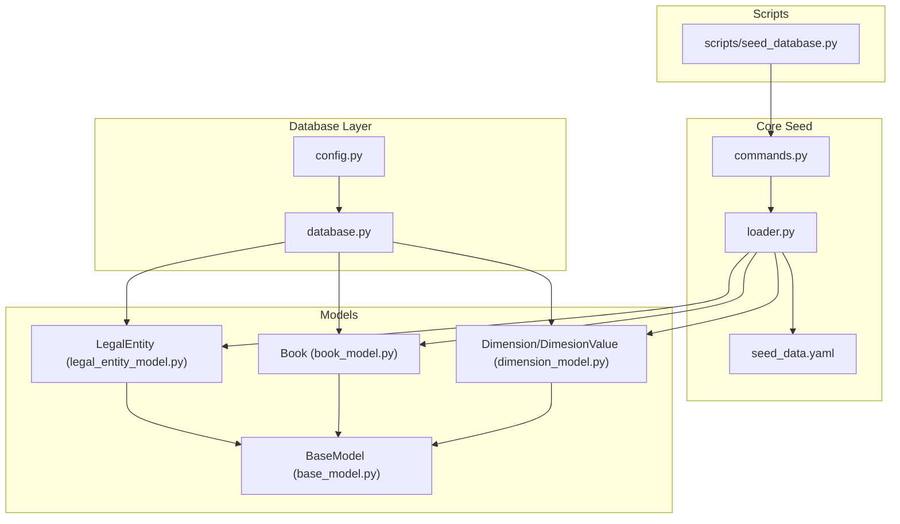
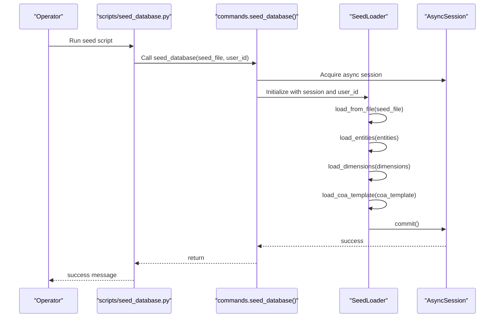
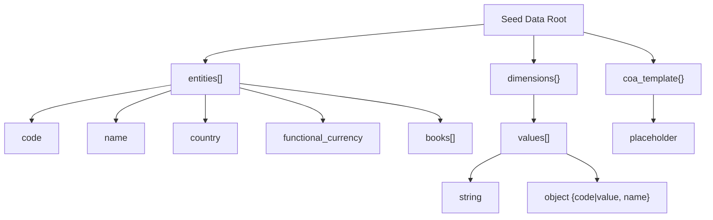
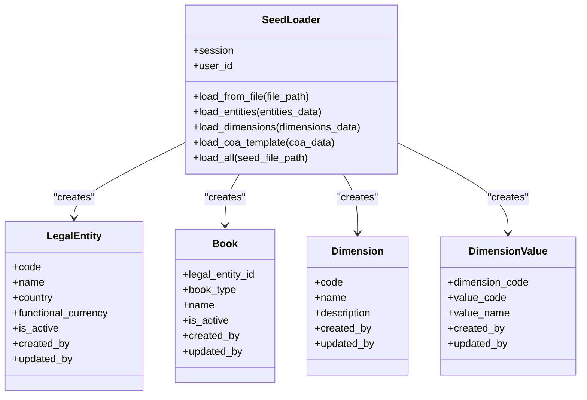
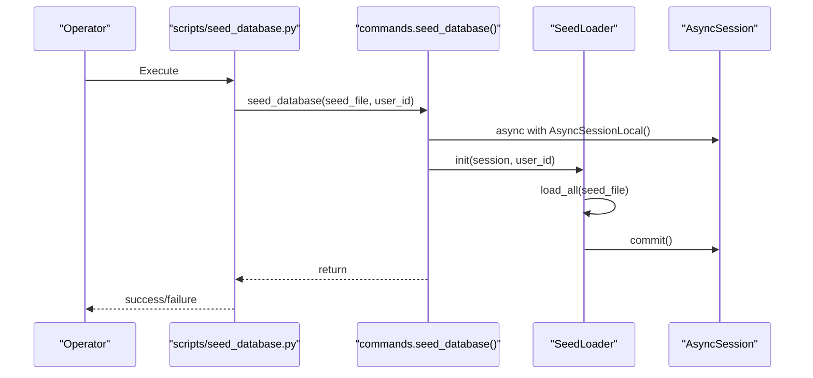
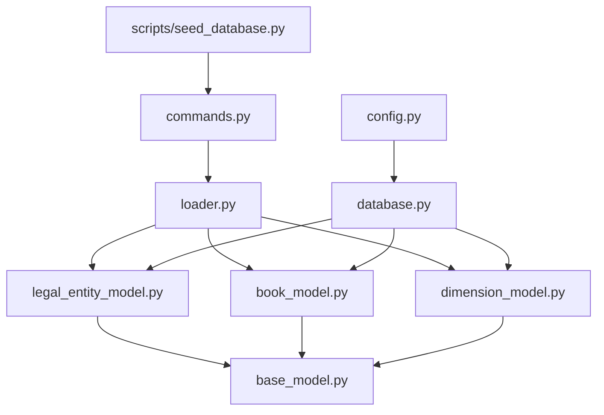

# Data Seeding

<cite>
**Referenced Files in This Document**
- [seed_data.yaml](file://app/core/seed/seed_data.yaml)
- [loader.py](file://app/core/seed/loader.py)
- [commands.py](file://app/core/seed/commands.py)
- [seed_database.py](file://scripts/seed_database.py)
- [legal_entity_model.py](file://app/modules/general_ledger/models/legal_entity_model.py)
- [book_model.py](file://app/modules/general_ledger/models/book_model.py)
- [dimension_model.py](file://app/modules/general_ledger/models/dimension_model.py)
- [base_model.py](file://app/shared/models/base_model.py)
- [database.py](file://app/core/database.py)
- [config.py](file://app/core/config.py)
- [conftest.py](file://tests/conftest.py)
</cite>

## Table of Contents
1. [Introduction](#introduction)
2. [Project Structure](#project-structure)
3. [Core Components](#core-components)
4. [Architecture Overview](#architecture-overview)
5. [Detailed Component Analysis](#detailed-component-analysis)
6. [Dependency Analysis](#dependency-analysis)
7. [Performance Considerations](#performance-considerations)
8. [Troubleshooting Guide](#troubleshooting-guide)
9. [Conclusion](#conclusion)
10. [Appendices](#appendices)

## Introduction
This document describes the database seeding system used to populate initial data and test fixtures for the TrueVow Financial Management service. It explains the YAML-based seed data structure, entity hierarchies, relationships, and reference data. It documents the seed loading process, data transformation pipeline, and validation mechanisms. It also details the command-line interface for seed operations, environment-specific seeding, and selective data loading. Finally, it covers seed data organization, naming conventions, maintenance procedures, and integration with testing environments, including security considerations for sensitive data and production seeding considerations.

## Project Structure
The seeding system is organized under the core application module and integrates with the database layer and general ledger models. Scripts provide a standalone entry point for seeding operations.

**Diagram sources**
- [seed_data.yaml](file://app/core/seed/seed_data.yaml#L1-L63)
- [loader.py](file://app/core/seed/loader.py#L1-L205)
- [commands.py](file://app/core/seed/commands.py#L1-L32)
- [seed_database.py](file://scripts/seed_database.py#L1-L53)
- [legal_entity_model.py](file://app/modules/general_ledger/models/legal_entity_model.py#L1-L22)
- [book_model.py](file://app/modules/general_ledger/models/book_model.py#L1-L36)
- [dimension_model.py](file://app/modules/general_ledger/models/dimension_model.py#L1-L40)
- [base_model.py](file://app/shared/models/base_model.py#L1-L18)
- [database.py](file://app/core/database.py#L1-L113)
- [config.py](file://app/core/config.py#L1-L74)

**Section sources**
- [seed_data.yaml](file://app/core/seed/seed_data.yaml#L1-L63)
- [loader.py](file://app/core/seed/loader.py#L1-L205)
- [commands.py](file://app/core/seed/commands.py#L1-L32)
- [seed_database.py](file://scripts/seed_database.py#L1-L53)
- [database.py](file://app/core/database.py#L1-L113)
- [config.py](file://app/core/config.py#L1-L74)

## Core Components
- Seed data file: Defines entities, books, and dimensions with values.
- Loader: Reads YAML, validates structure, and persists entities, books, and dimensions.
- Commands: Provides async seeding orchestration and CLI entry point.
- Script: Standalone script wrapper for seeding with environment preparation.
- Models: LegalEntity, Book, Dimension, and DimensionValue with shared base fields.
- Database layer: Async engine/session and model registration.

Key responsibilities:
- YAML parsing and validation
- Upsert semantics for entities and books
- Idempotent dimension and dimension value creation
- Transactional persistence with rollback on errors
- Environment-aware configuration via settings

**Section sources**
- [seed_data.yaml](file://app/core/seed/seed_data.yaml#L1-L63)
- [loader.py](file://app/core/seed/loader.py#L1-L205)
- [commands.py](file://app/core/seed/commands.py#L1-L32)
- [seed_database.py](file://scripts/seed_database.py#L1-L53)
- [legal_entity_model.py](file://app/modules/general_ledger/models/legal_entity_model.py#L1-L22)
- [book_model.py](file://app/modules/general_ledger/models/book_model.py#L1-L36)
- [dimension_model.py](file://app/modules/general_ledger/models/dimension_model.py#L1-L40)
- [base_model.py](file://app/shared/models/base_model.py#L1-L18)
- [database.py](file://app/core/database.py#L1-L113)
- [config.py](file://app/core/config.py#L1-L74)

## Architecture Overview
The seeding pipeline is a three-layer flow: script invocation, command orchestration, and data loader. The loader coordinates model creation and persistence against an async database session.

**Diagram sources**
- [seed_database.py](file://scripts/seed_database.py#L26-L52)
- [commands.py](file://app/core/seed/commands.py#L11-L27)
- [loader.py](file://app/core/seed/loader.py#L22-L204)
- [database.py](file://app/core/database.py#L88-L103)

## Detailed Component Analysis

### YAML Seed Data Structure
The seed data file defines:
- Entities: company-level records with code, name, country, functional currency, and books.
- Dimensions: tag categories with lists of values; values can be simple strings or structured objects.
- CoA template: placeholder for future chart of accounts templates.

Structure highlights:
- Entities list with required fields and enumerated book types.
- Dimensions map with arrays of values; supports simple strings and structured entries.
- CoA template section reserved for future use.

**Diagram sources**
- [seed_data.yaml](file://app/core/seed/seed_data.yaml#L4-L62)

**Section sources**
- [seed_data.yaml](file://app/core/seed/seed_data.yaml#L1-L63)

### Seed Loader and Data Transformation Pipeline
The loader performs:
- File loading with safe YAML parsing.
- Entity creation/upsert with existence checks and flush to obtain IDs.
- Book creation per entity with enumerated book types and uniqueness checks.
- Dimension and dimension value creation with idempotency and normalization.
- Transactional commit after all loads.

**Diagram sources**
- [loader.py](file://app/core/seed/loader.py#L15-L204)
- [legal_entity_model.py](file://app/modules/general_ledger/models/legal_entity_model.py#L7-L21)
- [book_model.py](file://app/modules/general_ledger/models/book_model.py#L15-L35)
- [dimension_model.py](file://app/modules/general_ledger/models/dimension_model.py#L8-L39)

**Section sources**
- [loader.py](file://app/core/seed/loader.py#L1-L205)
- [legal_entity_model.py](file://app/modules/general_ledger/models/legal_entity_model.py#L1-L22)
- [book_model.py](file://app/modules/general_ledger/models/book_model.py#L1-L36)
- [dimension_model.py](file://app/modules/general_ledger/models/dimension_model.py#L1-L40)

### Validation Mechanisms
- Entity validation: Skips incomplete entity entries and logs warnings.
- Book validation: Validates enumerated book types and skips invalid entries.
- Dimension validation: Ensures values are lists and normalizes simple strings to structured entries.
- Existence checks: Prevents duplicates for entities, books, and dimension values.
- Transaction safety: Rollback on exceptions and explicit commit on success.

**Section sources**
- [loader.py](file://app/core/seed/loader.py#L46-L95)
- [loader.py](file://app/core/seed/loader.py#L117-L175)
- [loader.py](file://app/core/seed/loader.py#L21-L31)

### Command-Line Interface and Operations
- Script entry point: Provides a standalone script to seed the database with environment preparation.
- Command function: Orchestrates async session acquisition, loader initialization, and transaction lifecycle.
- CLI defaults: Uses a default seed file path and optional user ID for audit fields.

**Diagram sources**
- [seed_database.py](file://scripts/seed_database.py#L26-L52)
- [commands.py](file://app/core/seed/commands.py#L11-L27)
- [loader.py](file://app/core/seed/loader.py#L186-L204)

**Section sources**
- [seed_database.py](file://scripts/seed_database.py#L1-L53)
- [commands.py](file://app/core/seed/commands.py#L1-L32)

### Environment-Specific Seeding and Selective Loading
- Environment configuration: Database URL selection and JWT secret handling via settings.
- Selective data loading: The loader processes top-level keys (entities, dimensions, coa_template) independently, enabling partial seeding by omitting sections.
- Test integration: Tests create isolated sessions and can reuse seed data for deterministic fixtures.

**Section sources**
- [config.py](file://app/core/config.py#L23-L48)
- [loader.py](file://app/core/seed/loader.py#L186-L204)
- [conftest.py](file://tests/conftest.py#L37-L84)

### Seed Data Organization, Naming Conventions, and Maintenance
- File location: Centralized seed data file under the core seed package.
- Naming conventions:
  - Entity code: short, uppercase identifiers.
  - Dimension codes: uppercase underscore-separated categories.
  - Dimension values: normalized uppercase codes derived from simple strings.
- Maintenance procedures:
  - Keep seed data in version control.
  - Validate YAML structure before committing.
  - Use idempotent loaders to avoid re-seeding issues.
  - Prefer structured dimension values for clarity and consistency.

**Section sources**
- [seed_data.yaml](file://app/core/seed/seed_data.yaml#L4-L62)
- [loader.py](file://app/core/seed/loader.py#L142-L175)

### Integration with Testing Environments
- Test database setup: Asynchronous engine and session creation with optional in-memory SQLite.
- Fixture alignment: Tests can rely on seeded data for consistent scenarios.
- Isolation: Per-test sessions and schema cleanup minimize cross-test interference.

**Section sources**
- [conftest.py](file://tests/conftest.py#L61-L84)
- [database.py](file://app/core/database.py#L88-L103)

## Dependency Analysis
The loader depends on models and the async database layer. The commands and script depend on the loader and database configuration. The models inherit shared base fields for auditability.

**Diagram sources**
- [commands.py](file://app/core/seed/commands.py#L1-L32)
- [loader.py](file://app/core/seed/loader.py#L1-L205)
- [seed_database.py](file://scripts/seed_database.py#L1-L53)
- [legal_entity_model.py](file://app/modules/general_ledger/models/legal_entity_model.py#L1-L22)
- [book_model.py](file://app/modules/general_ledger/models/book_model.py#L1-L36)
- [dimension_model.py](file://app/modules/general_ledger/models/dimension_model.py#L1-L40)
- [base_model.py](file://app/shared/models/base_model.py#L1-L18)
- [database.py](file://app/core/database.py#L1-L113)
- [config.py](file://app/core/config.py#L1-L74)

**Section sources**
- [loader.py](file://app/core/seed/loader.py#L9-L13)
- [database.py](file://app/core/database.py#L6-L83)
- [config.py](file://app/core/config.py#L23-L48)

## Performance Considerations
- Batch flushes: The loader flushes after entity creation and dimension value creation to obtain IDs efficiently.
- Minimal round trips: Uses existence checks to avoid redundant inserts.
- Async I/O: Leverages async sessions for non-blocking database operations.
- Recommendations:
  - Keep seed files small and focused for development.
  - Use transactions to ensure atomicity.
  - Avoid excessive dimension values to reduce insert overhead.

[No sources needed since this section provides general guidance]

## Troubleshooting Guide
Common issues and resolutions:
- Seed file not found: Verify the path and permissions; the command logs an error and exits early.
- Invalid book type: Loader warns and skips unknown book types; ensure enums match expected values.
- Missing JWT secret: The script sets a dummy key for seeding; ensure proper secrets are configured in production.
- Duplicate entities/books/values: Loader skips existing records; confirm database state if duplicates appear.
- Transaction failures: The command rolls back on exceptions; inspect logs for the root cause.

**Section sources**
- [commands.py](file://app/core/seed/commands.py#L15-L27)
- [loader.py](file://app/core/seed/loader.py#L78-L82)
- [loader.py](file://app/core/seed/loader.py#L56-L59)
- [seed_database.py](file://scripts/seed_database.py#L18-L20)

## Conclusion
The seeding system provides a robust, idempotent mechanism to initialize essential reference data and entities. Its YAML-driven structure, validation, and transactional persistence make it suitable for development, testing, and controlled production seeding. By following the naming conventions and maintenance procedures outlined here, teams can keep seed data manageable and secure.

[No sources needed since this section summarizes without analyzing specific files]

## Appendices

### Example Workflows
- Create seed data:
  - Define entities with required fields and desired books.
  - Add dimension categories and values; prefer structured entries for clarity.
  - Commit the YAML file to version control.
- Modify seed data:
  - Update values or add new categories; keep existing entries intact to preserve idempotency.
  - Validate structure locally before committing.
- Load seed data:
  - Run the seed script to apply changes to the target environment.
  - Confirm successful completion and review logs for warnings.

[No sources needed since this section provides general guidance]

### Security and Production Considerations
- Sensitive data: Seed files should not contain sensitive information. Mask or exclude personal data.
- Secrets: Ensure production environments have proper JWT and database secrets configured; avoid embedding secrets in scripts.
- Idempotency: Rely on upsert logic to prevent accidental duplication during repeated seeding.
- Auditing: The base model captures created_by and updated_by; pass a user ID when appropriate for audit trails.

**Section sources**
- [base_model.py](file://app/shared/models/base_model.py#L13-L17)
- [seed_database.py](file://scripts/seed_database.py#L18-L20)
- [config.py](file://app/core/config.py#L37-L48)