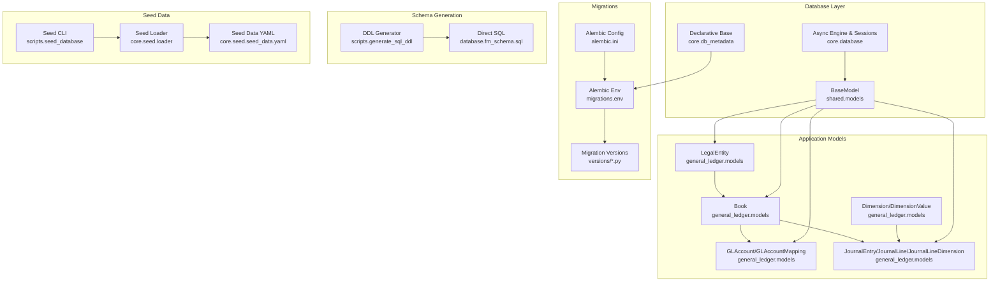
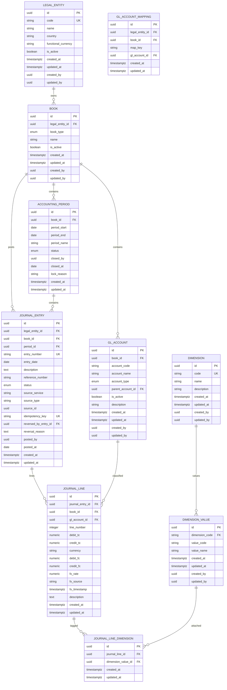
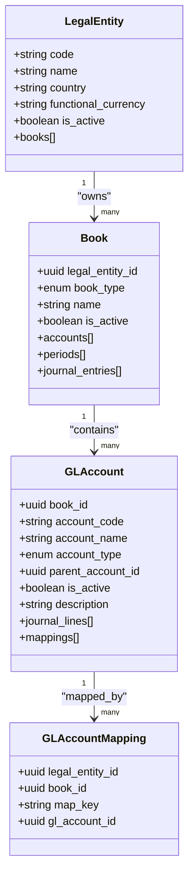
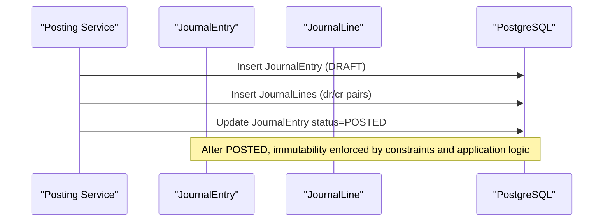
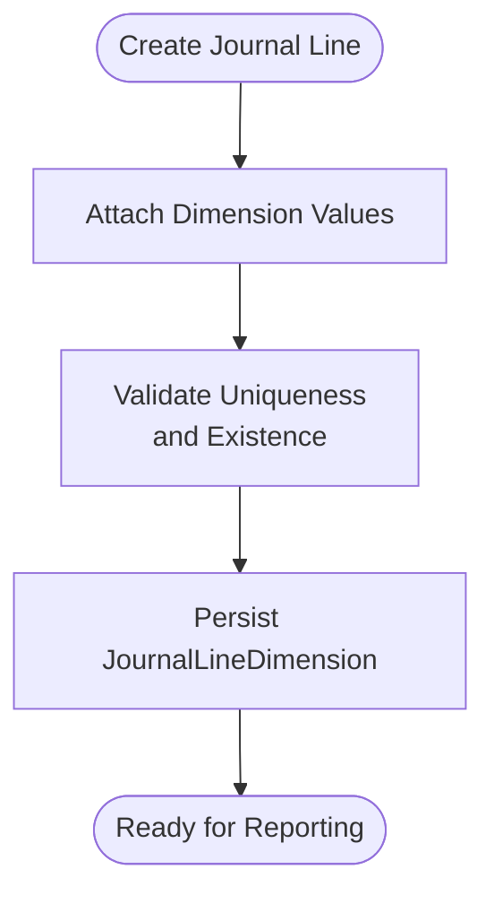
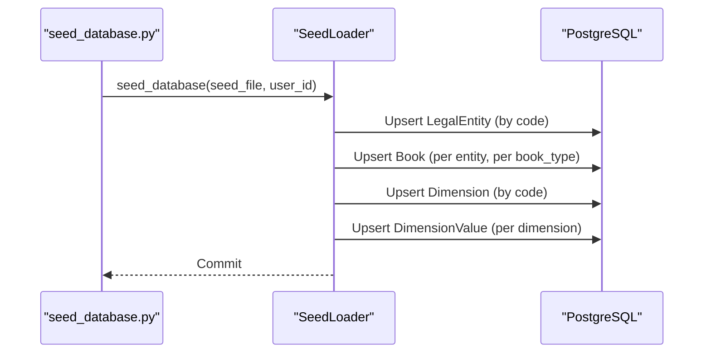
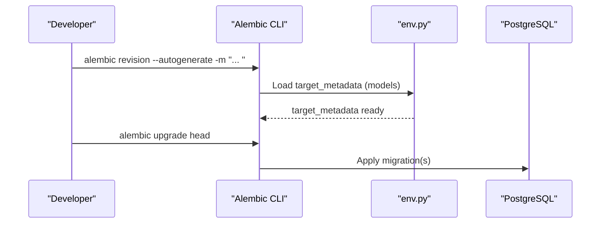
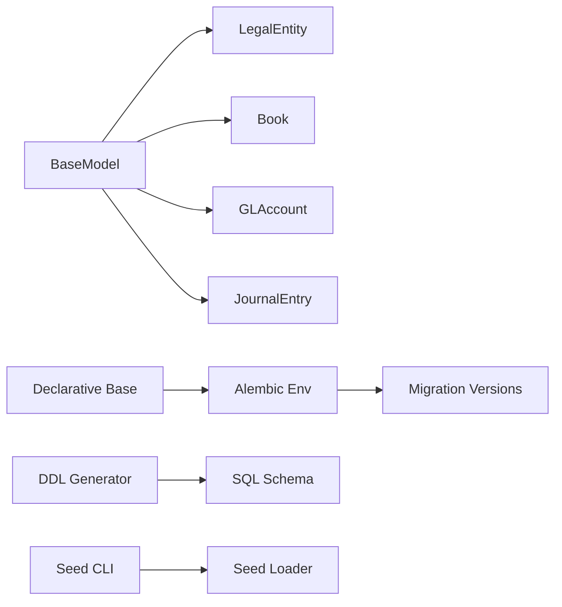

# Database Design

<cite>
**Referenced Files in This Document**
- [fm_schema.sql](file://database/fm_schema.sql)
- [env.py](file://database/migrations/env.py)
- [alembic.ini](file://alembic.ini)
- [generate_sql_ddl.py](file://scripts/generate_sql_ddl.py)
- [seed_database.py](file://scripts/seed_database.py)
- [loader.py](file://app/core/seed/loader.py)
- [seed_data.yaml](file://app/core/seed/seed_data.yaml)
- [database.py](file://app/core/database.py)
- [db_metadata.py](file://app/core/db_metadata.py)
- [base_model.py](file://app/shared/models/base_model.py)
- [legal_entity_model.py](file://app/modules/general_ledger/models/legal_entity_model.py)
- [book_model.py](file://app/modules/general_ledger/models/book_model.py)
- [gl_account_model.py](file://app/modules/general_ledger/models/gl_account_model.py)
- [journal_entry_model.py](file://app/modules/general_ledger/models/journal_entry_model.py)
- [001_add_approval_workflow_fields_and_period_close_checklist.py](file://database/migrations/versions/001_add_approval_workflow_fields_and_period_close_checklist.py)
- [005_add_idempotency_metadata.py](file://database/migrations/versions/005_add_idempotency_metadata.py)
</cite>

## Table of Contents
1. [Introduction](#introduction)
2. [Project Structure](#project-structure)
3. [Core Components](#core-components)
4. [Architecture Overview](#architecture-overview)
5. [Detailed Component Analysis](#detailed-component-analysis)
6. [Dependency Analysis](#dependency-analysis)
7. [Performance Considerations](#performance-considerations)
8. [Troubleshooting Guide](#troubleshooting-guide)
9. [Conclusion](#conclusion)
10. [Appendices](#appendices)

## Introduction
This document describes the TrueVow Financial Management system’s PostgreSQL database design. It covers the multi-entity and multi-book accounting model, the complete schema, entity-relationship diagrams, indexing strategy, data types, constraints, and the Alembic migration system. It also documents seed data management, migration strategy, and operational considerations such as security, backups, and maintenance.

## Project Structure
The database design is implemented via:
- A declarative SQLAlchemy model layer under app/modules and app/shared
- An Alembic migration environment that loads models and metadata
- A DDL generator script to produce SQL for direct deployment
- A seed data loader and YAML-based seed dataset

**Diagram sources**
- [env.py](file://database/migrations/env.py#L28-L100)
- [alembic.ini](file://alembic.ini#L1-L115)
- [generate_sql_ddl.py](file://scripts/generate_sql_ddl.py#L20-L65)
- [seed_database.py](file://scripts/seed_database.py#L22-L38)
- [loader.py](file://app/core/seed/loader.py#L15-L205)
- [seed_data.yaml](file://app/core/seed/seed_data.yaml#L1-L63)
- [database.py](file://app/core/database.py#L6-L86)
- [db_metadata.py](file://app/core/db_metadata.py#L1-L10)
- [base_model.py](file://app/shared/models/base_model.py#L9-L18)
- [legal_entity_model.py](file://app/modules/general_ledger/models/legal_entity_model.py#L7-L22)
- [book_model.py](file://app/modules/general_ledger/models/book_model.py#L15-L36)
- [gl_account_model.py](file://app/modules/general_ledger/models/gl_account_model.py#L28-L80)
- [journal_entry_model.py](file://app/modules/general_ledger/models/journal_entry_model.py#L17-L128)

**Section sources**
- [env.py](file://database/migrations/env.py#L1-L198)
- [alembic.ini](file://alembic.ini#L1-L115)
- [generate_sql_ddl.py](file://scripts/generate_sql_ddl.py#L1-L114)
- [seed_database.py](file://scripts/seed_database.py#L1-L53)
- [loader.py](file://app/core/seed/loader.py#L1-L205)
- [seed_data.yaml](file://app/core/seed/seed_data.yaml#L1-L63)
- [database.py](file://app/core/database.py#L1-L113)
- [db_metadata.py](file://app/core/db_metadata.py#L1-L10)
- [base_model.py](file://app/shared/models/base_model.py#L1-L18)
- [legal_entity_model.py](file://app/modules/general_ledger/models/legal_entity_model.py#L1-L22)
- [book_model.py](file://app/modules/general_ledger/models/book_model.py#L1-L36)
- [gl_account_model.py](file://app/modules/general_ledger/models/gl_account_model.py#L1-L80)
- [journal_entry_model.py](file://app/modules/general_ledger/models/journal_entry_model.py#L1-L128)

## Core Components
- Multi-entity and multi-book accounting:
  - LegalEntity represents companies (entities)
  - Book represents books per entity (ACCRUAL or CASH)
  - GLAccount defines chart of accounts per book
  - JournalEntry and JournalLine implement double-entry accounting
- Dimensions and tagging:
  - Dimension and DimensionValue define tag categories and values
  - JournalLineDimension attaches tags to lines
- Seed data:
  - YAML-driven loader creates entities, books, dimensions, and values
- Alembic migrations:
  - Environment loads models and metadata for autogenerate
  - Migration versions add new tables and columns safely

**Section sources**
- [legal_entity_model.py](file://app/modules/general_ledger/models/legal_entity_model.py#L7-L22)
- [book_model.py](file://app/modules/general_ledger/models/book_model.py#L15-L36)
- [gl_account_model.py](file://app/modules/general_ledger/models/gl_account_model.py#L28-L80)
- [journal_entry_model.py](file://app/modules/general_ledger/models/journal_entry_model.py#L17-L128)
- [loader.py](file://app/core/seed/loader.py#L33-L205)
- [seed_data.yaml](file://app/core/seed/seed_data.yaml#L1-L63)
- [env.py](file://database/migrations/env.py#L28-L100)

## Architecture Overview
The database architecture enforces:
- Entity-level isolation via legal_entity_id on transactional tables
- Book-level segregation via book_id on GL and journals
- Period-level control via accounting_period
- Immutable journal entries after posting with reversal tracking
- Dimensional analytics via dimension_value tagging on journal lines

**Diagram sources**
- [fm_schema.sql](file://database/fm_schema.sql#L129-L311)
- [legal_entity_model.py](file://app/modules/general_ledger/models/legal_entity_model.py#L7-L22)
- [book_model.py](file://app/modules/general_ledger/models/book_model.py#L15-L36)
- [gl_account_model.py](file://app/modules/general_ledger/models/gl_account_model.py#L28-L80)
- [journal_entry_model.py](file://app/modules/general_ledger/models/journal_entry_model.py#L17-L128)

## Detailed Component Analysis

### Multi-Entity and Multi-Book Accounting
- LegalEntity: top-level entity with unique code and functional currency
- Book: per-entity books (ACCRUAL or CASH), linked to LegalEntity
- GLAccount: chart of accounts per Book with hierarchical parent-child support
- GLAccountMapping: maps system keys to GL accounts per LegalEntity+Book

**Diagram sources**
- [legal_entity_model.py](file://app/modules/general_ledger/models/legal_entity_model.py#L7-L22)
- [book_model.py](file://app/modules/general_ledger/models/book_model.py#L15-L36)
- [gl_account_model.py](file://app/modules/general_ledger/models/gl_account_model.py#L28-L80)

**Section sources**
- [legal_entity_model.py](file://app/modules/general_ledger/models/legal_entity_model.py#L7-L22)
- [book_model.py](file://app/modules/general_ledger/models/book_model.py#L15-L36)
- [gl_account_model.py](file://app/modules/general_ledger/models/gl_account_model.py#L28-L80)

### Journal Entries and Lines
- JournalEntry: immutable after posting; tracks source, idempotency, and reversals
- JournalLine: per-line debits/credits in transaction and functional currencies; enforces balance via check constraints
- JournalLineDimension: attaches DimensionValue to JournalLine

**Diagram sources**
- [journal_entry_model.py](file://app/modules/general_ledger/models/journal_entry_model.py#L17-L128)
- [fm_schema.sql](file://database/fm_schema.sql#L241-L298)

**Section sources**
- [journal_entry_model.py](file://app/modules/general_ledger/models/journal_entry_model.py#L17-L128)
- [fm_schema.sql](file://database/fm_schema.sql#L241-L298)

### Dimensions and Tagging
- Dimension and DimensionValue define categorical tags
- JournalLineDimension links lines to dimension values

**Diagram sources**
- [fm_schema.sql](file://database/fm_schema.sql#L160-L187)
- [fm_schema.sql](file://database/fm_schema.sql#L299-L311)

**Section sources**
- [fm_schema.sql](file://database/fm_schema.sql#L160-L187)
- [fm_schema.sql](file://database/fm_schema.sql#L299-L311)

### Seed Data Management
- YAML seed_data.yaml defines entities, books, and dimensions/values
- SeedLoader loads entities and books, then dimensions and values
- CLI script seeds the database from YAML

**Diagram sources**
- [seed_database.py](file://scripts/seed_database.py#L26-L48)
- [loader.py](file://app/core/seed/loader.py#L33-L205)
- [seed_data.yaml](file://app/core/seed/seed_data.yaml#L4-L62)

**Section sources**
- [seed_database.py](file://scripts/seed_database.py#L1-L53)
- [loader.py](file://app/core/seed/loader.py#L1-L205)
- [seed_data.yaml](file://app/core/seed/seed_data.yaml#L1-L63)

### Alembic Migration System
- env.py loads Base and imports all models to populate target_metadata for autogenerate
- alembic.ini configures script_location and logging
- Migration versions add tables/columns incrementally (e.g., checklist table, idempotency metadata)

**Diagram sources**
- [env.py](file://database/migrations/env.py#L28-L100)
- [alembic.ini](file://alembic.ini#L1-L115)
- [001_add_approval_workflow_fields_and_period_close_checklist.py](file://database/migrations/versions/001_add_approval_workflow_fields_and_period_close_checklist.py#L19-L53)
- [005_add_idempotency_metadata.py](file://database/migrations/versions/005_add_idempotency_metadata.py#L21-L33)

**Section sources**
- [env.py](file://database/migrations/env.py#L1-L198)
- [alembic.ini](file://alembic.ini#L1-L115)
- [001_add_approval_workflow_fields_and_period_close_checklist.py](file://database/migrations/versions/001_add_approval_workflow_fields_and_period_close_checklist.py#L1-L63)
- [005_add_idempotency_metadata.py](file://database/migrations/versions/005_add_idempotency_metadata.py#L1-L33)

## Dependency Analysis
- Model dependencies:
  - BaseModel provides common fields and UUID primary keys
  - General ledger models define core hierarchy (LE → BK → COA → JE)
  - Seed loader depends on models for upserts
- Migration dependencies:
  - env.py imports all models to build target_metadata
  - Alembic config sets script_location and logging

**Diagram sources**
- [base_model.py](file://app/shared/models/base_model.py#L9-L18)
- [legal_entity_model.py](file://app/modules/general_ledger/models/legal_entity_model.py#L7-L22)
- [book_model.py](file://app/modules/general_ledger/models/book_model.py#L15-L36)
- [gl_account_model.py](file://app/modules/general_ledger/models/gl_account_model.py#L28-L80)
- [journal_entry_model.py](file://app/modules/general_ledger/models/journal_entry_model.py#L17-L128)
- [db_metadata.py](file://app/core/db_metadata.py#L1-L10)
- [env.py](file://database/migrations/env.py#L28-L100)
- [generate_sql_ddl.py](file://scripts/generate_sql_ddl.py#L20-L65)
- [seed_database.py](file://scripts/seed_database.py#L22-L38)
- [loader.py](file://app/core/seed/loader.py#L15-L205)

**Section sources**
- [base_model.py](file://app/shared/models/base_model.py#L1-L18)
- [db_metadata.py](file://app/core/db_metadata.py#L1-L10)
- [env.py](file://database/migrations/env.py#L1-L198)
- [generate_sql_ddl.py](file://scripts/generate_sql_ddl.py#L1-L114)
- [seed_database.py](file://scripts/seed_database.py#L1-L53)
- [loader.py](file://app/core/seed/loader.py#L1-L205)

## Performance Considerations
- Indexing strategy:
  - High-selectivity foreign keys indexed (legal_entity_id, book_id, period_id, gl_account_id)
  - Business keys indexed (entry_number, external ids, codes)
  - Composite indexes for frequent filters (bank_account_id + transaction_date, status)
- Data types:
  - UUIDs for primary keys and foreign keys
  - Numeric with fixed scale for monetary values
  - Enums for statuses and types to reduce storage and improve query safety
- Constraints:
  - Unique constraints on (entity, book, source_key) for idempotent journal entries
  - Check constraints enforce balanced journal lines
- Query patterns:
  - Use targeted indexes for AR/AP/inventory sync, treasury reconciliation, payroll runs
  - Consider partitioning strategies for large historical tables (not shown in current schema)

[No sources needed since this section provides general guidance]

## Troubleshooting Guide
- Migration connectivity:
  - env.py prefers pooler URLs and raises explicit errors if no database URL is found
  - Use FINANCIAL_MANAGEMENT_DATABASE_SESSION_POOLER_URL or DATABASE_URL
- Operational errors:
  - env.py catches OperationalError and suggests using Session/Transaction pooler URL
- Seed failures:
  - loader logs warnings for incomplete records and skips invalid entries
  - Ensure seed_data.yaml conforms to expected structure

**Section sources**
- [env.py](file://database/migrations/env.py#L105-L127)
- [env.py](file://database/migrations/env.py#L180-L191)
- [loader.py](file://app/core/seed/loader.py#L46-L58)

## Conclusion
The TrueVow Financial Management system employs a robust multi-entity, multi-book accounting design with dimensional tagging, immutable journal entries, and a disciplined Alembic migration process. The seed data pipeline accelerates onboarding, while the DDL generator supports direct deployment. Together, these components provide a scalable foundation for financial operations across entities and books.

[No sources needed since this section summarizes without analyzing specific files]

## Appendices

### A. Complete Schema Reference
- Core tables: legal_entity, book, dimension, dimension_value, gl_account, gl_account_mapping, accounting_period, journal_entry, journal_line, journal_line_dimension
- Enumerations: book_type, period_status, account_type, journal_entry_status, invoice_status, payment_status, schedule_status, transaction_type, transfer_type, reconciliation_status, payroll_run_status, component_type, pay_frequency, pay_day_rule, employee_type
- Indexes and comments are embedded in the schema for discoverability

**Section sources**
- [fm_schema.sql](file://database/fm_schema.sql#L1-L1496)

### B. Alembic Configuration and Commands
- alembic.ini sets script_location and logging
- env.py loads models and metadata; supports offline/online modes
- Typical commands:
  - alembic revision --autogenerate -m "..."
  - alembic upgrade head
  - alembic downgrade -1

**Section sources**
- [alembic.ini](file://alembic.ini#L1-L115)
- [env.py](file://database/migrations/env.py#L146-L198)

### C. DDL Generation Workflow
- scripts/generate_sql_ddl.py builds CREATE TABLE and CREATE INDEX statements from SQLAlchemy models
- Output can be executed directly in PostgreSQL or pasted into Supabase SQL Editor

**Section sources**
- [generate_sql_ddl.py](file://scripts/generate_sql_ddl.py#L20-L114)

### D. Security, Backups, and Maintenance
- Security:
  - Use dedicated database URLs for migrations and runtime
  - Prefer pooler URLs for improved connectivity
- Backups:
  - Regular logical backups of production database
  - Validate restore procedures periodically
- Maintenance:
  - Monitor long-running queries and slow indexes
  - Keep Alembic revisions minimal and descriptive
  - Rotate secrets and review connection strings regularly

[No sources needed since this section provides general guidance]