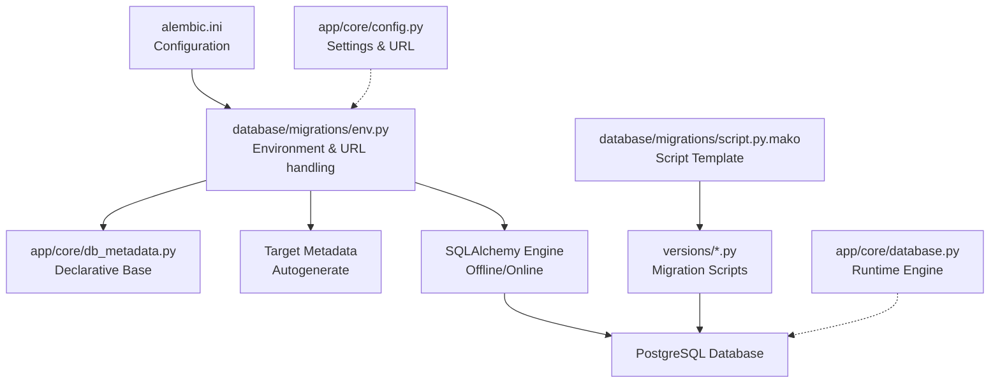
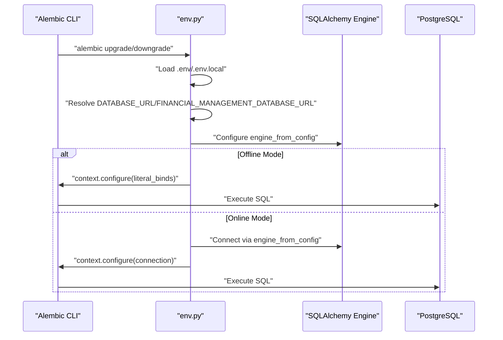
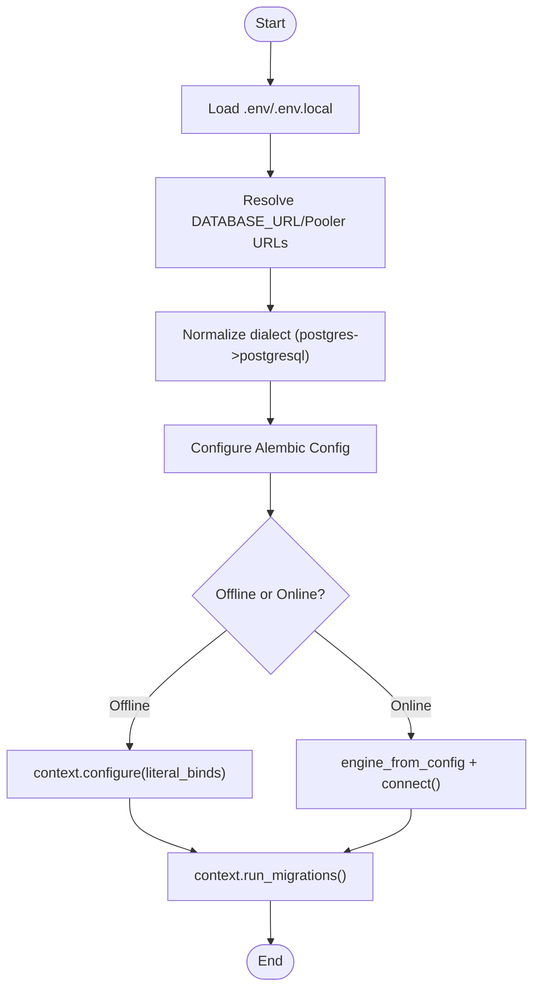
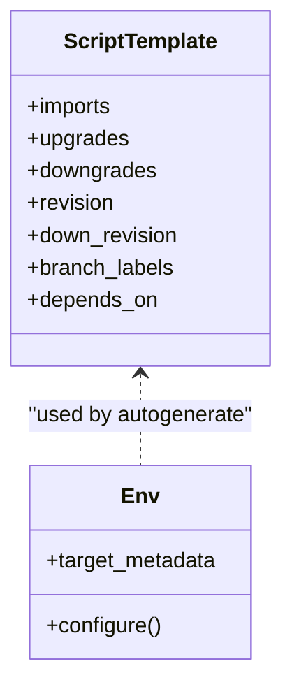
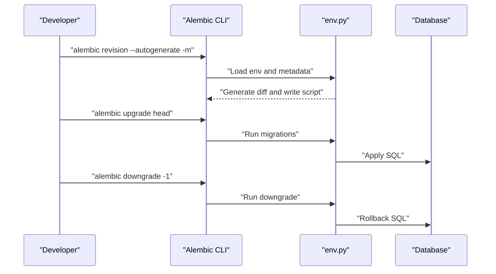
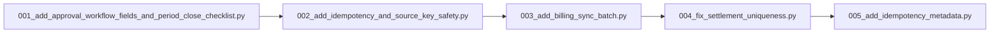
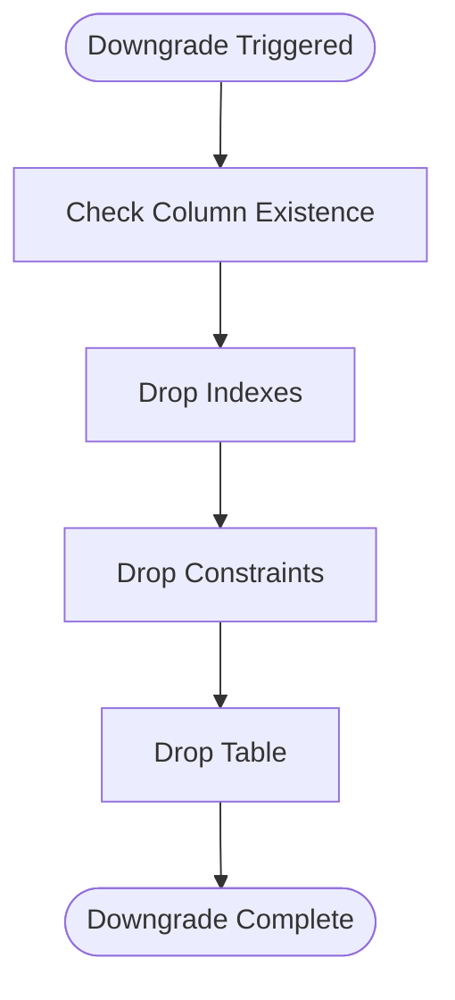
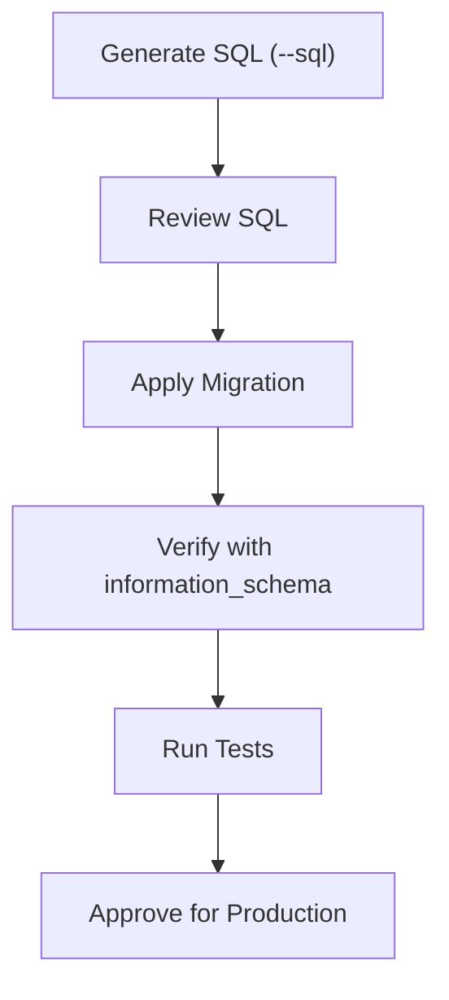
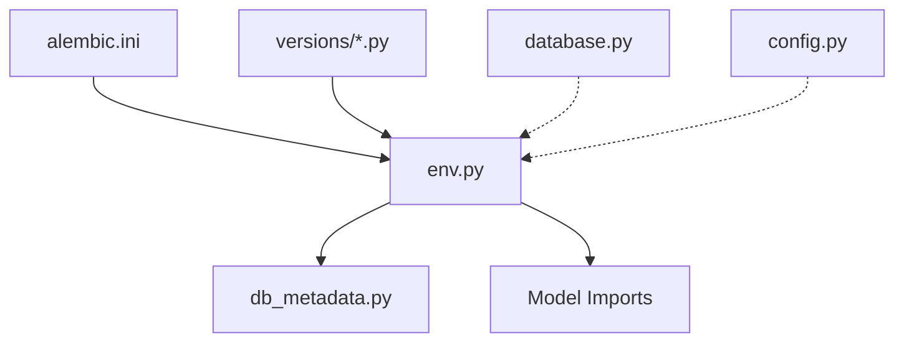

# Migration Management

<cite>
**Referenced Files in This Document**
- [alembic.ini](file://alembic.ini)
- [env.py](file://database/migrations/env.py)
- [script.py.mako](file://database/migrations/script.py.mako)
- [README.md](file://database/migrations/README.md)
- [database.py](file://app/core/database.py)
- [db_metadata.py](file://app/core/db_metadata.py)
- [config.py](file://app/core/config.py)
- [001_add_approval_workflow_fields_and_period_close_checklist.py](file://database/migrations/versions/001_add_approval_workflow_fields_and_period_close_checklist.py)
- [002_add_idempotency_and_source_key_safety.py](file://database/migrations/versions/002_add_idempotency_and_source_key_safety.py)
- [003_add_billing_sync_batch.py](file://database/migrations/versions/003_add_billing_sync_batch.py)
- [004_fix_settlement_uniqueness.py](file://database/migrations/versions/004_fix_settlement_uniqueness.py)
- [005_add_idempotency_metadata.py](file://database/migrations/versions/005_add_idempotency_metadata.py)
- [DATABASE_MIGRATION_CLARIFICATION.md](file://docs/01-main/DATABASE_MIGRATION_CLARIFICATION.md)
- [MIGRATION_INSTRUCTIONS.md](file://docs/01-main/MIGRATION_INSTRUCTIONS.md)
- [MIGRATION_VERIFICATION.md](file://docs/01-main/MIGRATION_VERIFICATION.md)
</cite>

## Table of Contents
1. [Introduction](#introduction)
2. [Project Structure](#project-structure)
3. [Core Components](#core-components)
4. [Architecture Overview](#architecture-overview)
5. [Detailed Component Analysis](#detailed-component-analysis)
6. [Dependency Analysis](#dependency-analysis)
7. [Performance Considerations](#performance-considerations)
8. [Troubleshooting Guide](#troubleshooting-guide)
9. [Conclusion](#conclusion)
10. [Appendices](#appendices)

## Introduction
This document describes the Alembic-based migration system used to manage database schema changes for the TrueVow Financial Management application. It explains the migration environment configuration, script generation templates, and the migration execution workflow. It also covers versioning strategy, dependency management, rollback procedures, verification and testing methodology, and production deployment best practices. Practical examples illustrate common migration patterns such as adding columns, creating tables, modifying constraints, and performing data transformations. Finally, it documents status tracking, conflict resolution, safety measures, backup requirements, and rollback planning.

## Project Structure
The migration system is organized under the database/migrations directory with the following key elements:
- alembic.ini: Alembic configuration including script location, path handling, and logging.
- database/migrations/env.py: Migration environment that loads database credentials from environment variables, prepares SQLAlchemy metadata for autogenerate, and runs migrations offline or online.
- database/migrations/script.py.mako: Template for generating revision scripts with placeholders for imports, upgrade/downgrade logic, and revision identifiers.
- database/migrations/versions/: Directory containing numbered migration files implementing schema changes.
- app/core/db_metadata.py: Declarative Base used by migrations to populate target_metadata for autogenerate.
- app/core/database.py: Application database engine and session factory (used at runtime; migrations import only db_metadata).
- app/core/config.py: Application settings including database URL selection and conversion logic.

**Diagram sources**
- [alembic.ini](file://alembic.ini#L1-L115)
- [env.py](file://database/migrations/env.py#L1-L198)
- [script.py.mako](file://database/migrations/script.py.mako#L1-L25)
- [db_metadata.py](file://app/core/db_metadata.py#L1-L10)
- [database.py](file://app/core/database.py#L1-L113)
- [config.py](file://app/core/config.py#L1-L74)

**Section sources**
- [alembic.ini](file://alembic.ini#L1-L115)
- [env.py](file://database/migrations/env.py#L1-L198)
- [script.py.mako](file://database/migrations/script.py.mako#L1-L25)
- [db_metadata.py](file://app/core/db_metadata.py#L1-L10)
- [database.py](file://app/core/database.py#L1-L113)
- [config.py](file://app/core/config.py#L1-L74)

## Core Components
- Alembic configuration (alembic.ini): Defines script_location, prepend_sys_path, logging, and optional hooks. It centralizes Alembic behavior for the project.
- Migration environment (env.py): Loads environment variables from .env and .env.local, resolves database URLs, normalizes dialects, and configures offline/online migration execution. It imports all model classes to populate target_metadata for autogenerate.
- Script template (script.py.mako): Provides a reusable template for revision scripts with placeholders for imports, upgrade/downgrade logic, and revision metadata.
- Migration scripts (versions/*.py): Implement schema changes with explicit upgrade and downgrade functions. They define revision identifiers, dependencies, and branch labels.
- Declarative Base (db_metadata.py): Provides a lightweight Base for migrations without loading application settings.
- Runtime database (database.py): Creates the async engine and sessions for application use; migrations import only db_metadata to avoid loading app settings.
- Settings (config.py): Provides database URL selection and conversion logic for runtime; migrations use env.py to resolve database URLs.

**Section sources**
- [alembic.ini](file://alembic.ini#L1-L115)
- [env.py](file://database/migrations/env.py#L1-L198)
- [script.py.mako](file://database/migrations/script.py.mako#L1-L25)
- [db_metadata.py](file://app/core/db_metadata.py#L1-L10)
- [database.py](file://app/core/database.py#L1-L113)
- [config.py](file://app/core/config.py#L1-L74)

## Architecture Overview
The migration architecture separates concerns between configuration, environment setup, script generation, and execution. The environment loads credentials safely, constructs target metadata for autogenerate, and executes migrations either offline or online. Migration scripts encapsulate schema changes and are versioned to ensure reproducibility and rollback capability.

**Diagram sources**
- [env.py](file://database/migrations/env.py#L146-L198)
- [alembic.ini](file://alembic.ini#L61-L61)

**Section sources**
- [env.py](file://database/migrations/env.py#L146-L198)
- [alembic.ini](file://alembic.ini#L61-L61)

## Detailed Component Analysis

### Migration Environment Configuration
- Environment variable precedence: The environment resolver prefers session pooler URLs, then general pooler URLs, then DATABASE_URL, then FINANCIAL_MANAGEMENT_DATABASE_URL. It raises a clear error if none are found and replaces postgres:// with postgresql:// for SQLAlchemy compatibility.
- Target metadata population: env.py imports all model classes to populate Base.metadata, enabling autogenerate to compare the current schema snapshot with the database.
- Offline/online execution: env.py supports both modes. Online mode uses a sync engine for Alembic while the application remains async, handling OperationalError with actionable hints for DNS/network connectivity.

**Diagram sources**
- [env.py](file://database/migrations/env.py#L105-L133)
- [env.py](file://database/migrations/env.py#L146-L198)

**Section sources**
- [env.py](file://database/migrations/env.py#L105-L133)
- [env.py](file://database/migrations/env.py#L146-L198)

### Script Generation Templates
- Template structure: script.py.mako defines placeholders for imports, upgrade/downgrade logic, and revision metadata (revision, down_revision, branch_labels, depends_on). This ensures consistent revision scaffolding across the project.
- Autogenerate integration: env.py sets target_metadata to Base.metadata, enabling Alembic’s autogenerate to produce accurate diffs based on model definitions.

**Diagram sources**
- [script.py.mako](file://database/migrations/script.py.mako#L1-L25)
- [env.py](file://database/migrations/env.py#L139-L140)

**Section sources**
- [script.py.mako](file://database/migrations/script.py.mako#L1-L25)
- [env.py](file://database/migrations/env.py#L139-L140)

### Migration Execution Workflow
- Initialization: alembic init is configured to use database/migrations as script_location.
- Revision creation: alembic revision --autogenerate generates a new migration file in versions/.
- Applying migrations: alembic upgrade head applies pending migrations in order.
- Rollback: alembic downgrade -1 reverts the last migration; each migration script defines downgrade logic.

**Diagram sources**
- [README.md](file://database/migrations/README.md#L7-L19)
- [env.py](file://database/migrations/env.py#L146-L198)

**Section sources**
- [README.md](file://database/migrations/README.md#L7-L19)
- [env.py](file://database/migrations/env.py#L146-L198)

### Migration Versioning Strategy and Dependencies
- Numeric prefixes: Migration filenames use zero-padded numeric prefixes (e.g., 001, 002) to ensure lexicographic ordering matches chronological order.
- Revision metadata: Each migration script defines revision, down_revision, branch_labels, and depends_on to establish version lineage and dependencies.
- Example migrations demonstrate:
  - Creating tables and enums, adding indexes and constraints.
  - Altering tables with safe backfills and partial unique constraints.
  - Conditional DDL using information_schema checks and DO blocks.

**Diagram sources**
- [001_add_approval_workflow_fields_and_period_close_checklist.py](file://database/migrations/versions/001_add_approval_workflow_fields_and_period_close_checklist.py#L1-L63)
- [002_add_idempotency_and_source_key_safety.py](file://database/migrations/versions/002_add_idempotency_and_source_key_safety.py#L1-L279)
- [003_add_billing_sync_batch.py](file://database/migrations/versions/003_add_billing_sync_batch.py#L1-L79)
- [004_fix_settlement_uniqueness.py](file://database/migrations/versions/004_fix_settlement_uniqueness.py#L1-L60)
- [005_add_idempotency_metadata.py](file://database/migrations/versions/005_add_idempotency_metadata.py#L1-L33)

**Section sources**
- [001_add_approval_workflow_fields_and_period_close_checklist.py](file://database/migrations/versions/001_add_approval_workflow_fields_and_period_close_checklist.py#L1-L63)
- [002_add_idempotency_and_source_key_safety.py](file://database/migrations/versions/002_add_idempotency_and_source_key_safety.py#L1-L279)
- [003_add_billing_sync_batch.py](file://database/migrations/versions/003_add_billing_sync_batch.py#L1-L79)
- [004_fix_settlement_uniqueness.py](file://database/migrations/versions/004_fix_settlement_uniqueness.py#L1-L60)
- [005_add_idempotency_metadata.py](file://database/migrations/versions/005_add_idempotency_metadata.py#L1-L33)

### Rollback Procedures
- Downgrade semantics: Each migration script implements a downgrade function to reverse changes. Rollbacks drop indexes, tables, constraints, and restore previous column definitions.
- Example rollbacks:
  - Dropping indexes and tables in reverse order.
  - Restoring unique constraints and dropping partial indexes.
  - Reverting column renames and restoring legacy columns.

**Diagram sources**
- [002_add_idempotency_and_source_key_safety.py](file://database/migrations/versions/002_add_idempotency_and_source_key_safety.py#L205-L279)
- [003_add_billing_sync_batch.py](file://database/migrations/versions/003_add_billing_sync_batch.py#L69-L79)

**Section sources**
- [002_add_idempotency_and_source_key_safety.py](file://database/migrations/versions/002_add_idempotency_and_source_key_safety.py#L205-L279)
- [003_add_billing_sync_batch.py](file://database/migrations/versions/003_add_billing_sync_batch.py#L69-L79)

### Migration Verification and Testing Methodology
- Pre-deploy verification: Use alembic upgrade --sql to generate SQL and review before applying.
- Post-deploy checks: Verify table existence, enum types, and column presence using information_schema queries.
- Test coverage: The project includes tests for idempotency replay, source key duplication prevention, row version conflicts, reconciliation safety, and endpoint key stability.

**Diagram sources**
- [MIGRATION_INSTRUCTIONS.md](file://docs/01-main/MIGRATION_INSTRUCTIONS.md#L44-L52)
- [MIGRATION_INSTRUCTIONS.md](file://docs/01-main/MIGRATION_INSTRUCTIONS.md#L69-L96)
- [MIGRATION_VERIFICATION.md](file://docs/01-main/MIGRATION_VERIFICATION.md#L127-L150)

**Section sources**
- [MIGRATION_INSTRUCTIONS.md](file://docs/01-main/MIGRATION_INSTRUCTIONS.md#L44-L52)
- [MIGRATION_INSTRUCTIONS.md](file://docs/01-main/MIGRATION_INSTRUCTIONS.md#L69-L96)
- [MIGRATION_VERIFICATION.md](file://docs/01-main/MIGRATION_VERIFICATION.md#L127-L150)

### Common Migration Patterns
- Adding columns with safe defaults and backfills:
  - Add nullable column, backfill deterministic values, then alter to NOT NULL with foreign key constraints.
  - Example: Adding legal_entity_id and source_key to journal_entry with partial unique index enforcement.
- Creating tables and enums:
  - Define enums conditionally using DO blocks, then create tables with appropriate constraints and indexes.
  - Example: Creating billing_sync_batch with shared enum type and unique batch_number.
- Modifying constraints:
  - Drop single-column unique constraints and add composite unique constraints with conditions.
  - Example: Fixing treasury_settlement uniqueness by adding a composite unique index with WHERE clause.
- Data transformations:
  - Conditional updates and partial unique indexes to preserve drafts while enforcing uniqueness for posted entries.
  - Example: Backfilling source_key for posted journal entries and leaving drafts NULL.

**Section sources**
- [002_add_idempotency_and_source_key_safety.py](file://database/migrations/versions/002_add_idempotency_and_source_key_safety.py#L24-L83)
- [003_add_billing_sync_batch.py](file://database/migrations/versions/003_add_billing_sync_batch.py#L23-L66)
- [004_fix_settlement_uniqueness.py](file://database/migrations/versions/004_fix_settlement_uniqueness.py#L23-L42)
- [002_add_idempotency_and_source_key_safety.py](file://database/migrations/versions/002_add_idempotency_and_source_key_safety.py#L40-L57)

### Migration Status Tracking and Conflict Resolution
- Status tracking: Use alembic current and heads to inspect applied and pending revisions.
- Conflict resolution: When encountering OperationalError during online migrations, switch to session pooler URL or verify DNS/network reachability as suggested by environment error messages.
- Production readiness: Follow pre-deploy steps—generate SQL, review, apply, and verify—then run tests to confirm behavior.

**Section sources**
- [env.py](file://database/migrations/env.py#L180-L189)
- [MIGRATION_INSTRUCTIONS.md](file://docs/01-main/MIGRATION_INSTRUCTIONS.md#L27-L41)

### Production Deployment Procedures
- Environment preparation: Ensure .env or .env.local contains DATABASE_URL or FINANCIAL_MANAGEMENT_DATABASE_URL and JWT_SECRET_KEY.
- Migration lifecycle:
  - Generate migration: alembic revision --autogenerate -m "..."
  - Review SQL: alembic upgrade head --sql > migration.sql
  - Apply: alembic upgrade head
  - Verify: Run verification queries and tests
- Best practices:
  - Always include rollback logic in migrations.
  - Test on development/staging databases first.
  - Keep migrations small and focused.
  - Document rationale and dependencies in migration comments.

**Section sources**
- [DATABASE_MIGRATION_CLARIFICATION.md](file://docs/01-main/DATABASE_MIGRATION_CLARIFICATION.md#L42-L70)
- [README.md](file://database/migrations/README.md#L7-L19)

## Dependency Analysis
The migration system exhibits low coupling between components:
- env.py depends on db_metadata.py for target_metadata and on application model imports to populate metadata for autogenerate.
- alembic.ini configures script_location and logging; it does not depend on application code.
- Runtime database.py and config.py are separate from migration environment to avoid loading app settings during migrations.

**Diagram sources**
- [alembic.ini](file://alembic.ini#L5-L5)
- [env.py](file://database/migrations/env.py#L28-L100)
- [db_metadata.py](file://app/core/db_metadata.py#L1-L10)
- [database.py](file://app/core/database.py#L1-L113)
- [config.py](file://app/core/config.py#L1-L74)

**Section sources**
- [alembic.ini](file://alembic.ini#L5-L5)
- [env.py](file://database/migrations/env.py#L28-L100)
- [db_metadata.py](file://app/core/db_metadata.py#L1-L10)
- [database.py](file://app/core/database.py#L1-L113)
- [config.py](file://app/core/config.py#L1-L74)

## Performance Considerations
- Indexing strategy: Create indexes on frequently queried columns and composite indexes for common filters (e.g., book_id, posted_at).
- Partial unique indexes: Use partial unique indexes to enforce uniqueness only for specific rows (e.g., posted entries), allowing flexibility for drafts.
- Backfill efficiency: Perform deterministic backfills and minimize long-running transactions by batching updates where possible.
- Pooler usage: Prefer session pooler URLs for improved connectivity and reduced DNS failures during migrations.

**Section sources**
- [002_add_idempotency_and_source_key_safety.py](file://database/migrations/versions/002_add_idempotency_and_source_key_safety.py#L72-L83)
- [002_add_idempotency_and_source_key_safety.py](file://database/migrations/versions/002_add_idempotency_and_source_key_safety.py#L84-L84)
- [env.py](file://database/migrations/env.py#L109-L116)

## Troubleshooting Guide
- Database connectivity errors: If migrations fail with OperationalError, check DNS/network reachability and consider switching to a session pooler URL as suggested by environment error messages.
- Missing database URL: Ensure DATABASE_URL or FINANCIAL_MANAGEMENT_DATABASE_URL is set in .env or .env.local; migrations will raise a clear error if not found.
- Review and regenerate: Use alembic upgrade --sql to generate and review SQL before applying; regenerate migrations if autogenerate produces unexpected diffs.
- Verification queries: Confirm table existence, enum types, and column presence using information_schema queries as documented in migration instructions.

**Section sources**
- [env.py](file://database/migrations/env.py#L117-L127)
- [env.py](file://database/migrations/env.py#L180-L189)
- [MIGRATION_INSTRUCTIONS.md](file://docs/01-main/MIGRATION_INSTRUCTIONS.md#L44-L52)
- [MIGRATION_INSTRUCTIONS.md](file://docs/01-main/MIGRATION_INSTRUCTIONS.md#L69-L96)

## Conclusion
The Alembic migration system in this project is designed for reliability and safety. It separates migration concerns from application settings, provides robust environment configuration, and enforces best practices such as including rollback logic, verifying schema changes, and testing thoroughly. By following the documented workflow and leveraging the included examples and verification steps, teams can confidently manage schema evolution in development, staging, and production environments.

## Appendices
- Migration lifecycle summary:
  - Initialize Alembic and configure script_location.
  - Create revisions with --autogenerate and review generated SQL.
  - Apply migrations with alembic upgrade head.
  - Verify schema and run tests.
  - Rollback with alembic downgrade -1 if necessary.

**Section sources**
- [README.md](file://database/migrations/README.md#L7-L19)
- [DATABASE_MIGRATION_CLARIFICATION.md](file://docs/01-main/DATABASE_MIGRATION_CLARIFICATION.md#L63-L70)