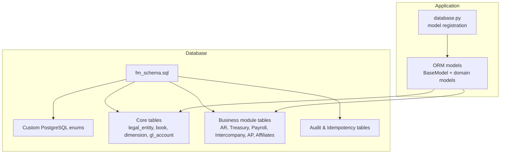
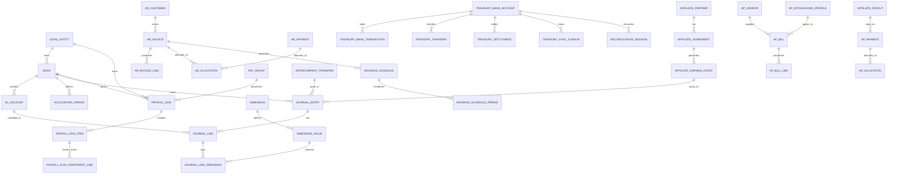
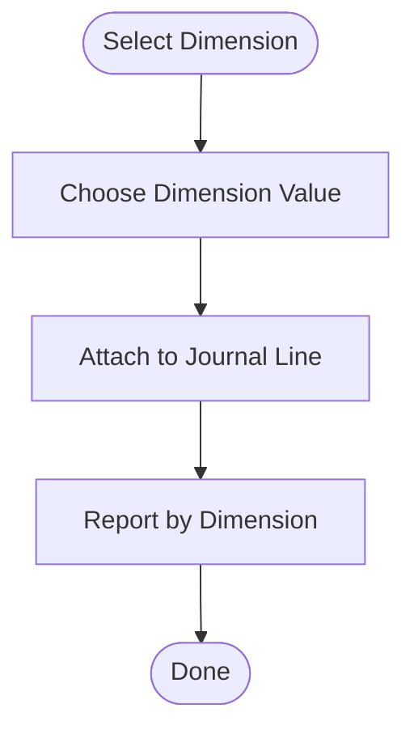
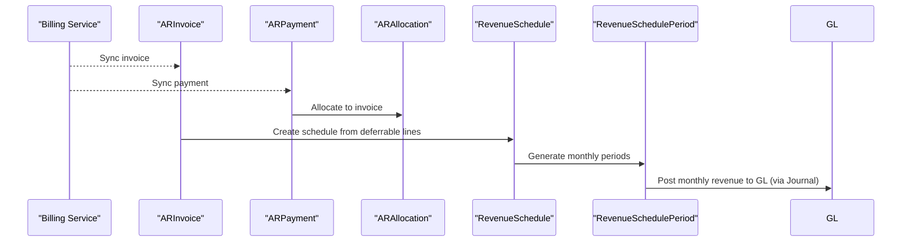
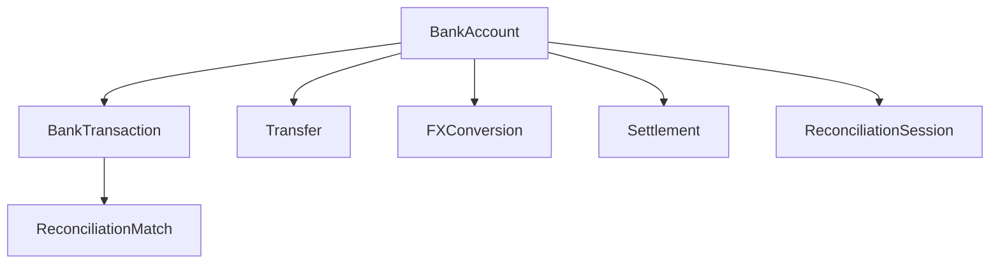
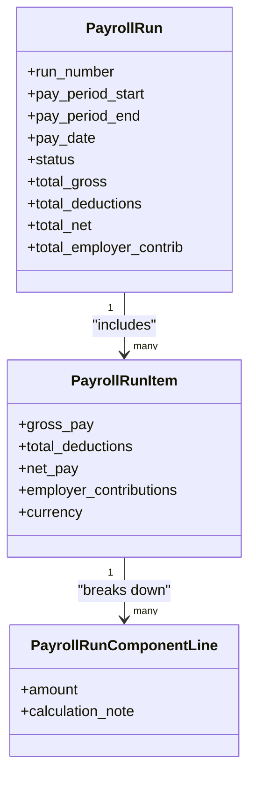
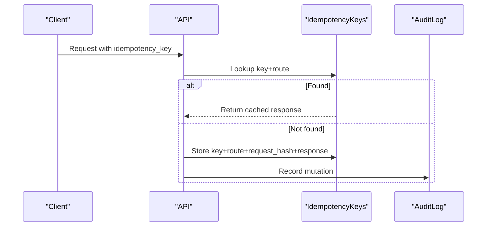
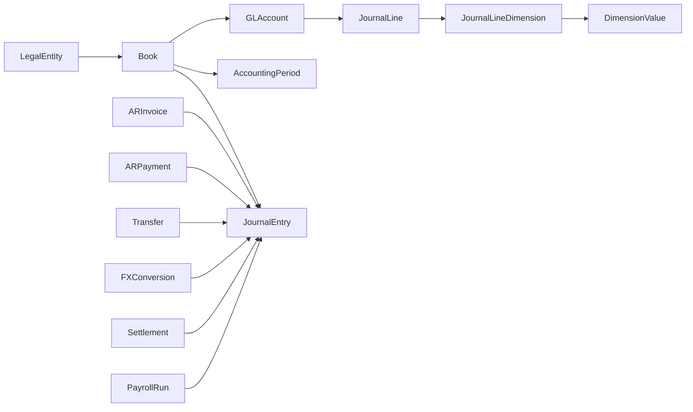

# Schema Overview

<cite>
**Referenced Files in This Document**
- [fm_schema.sql](file://database/fm_schema.sql)
- [database.py](file://app/core/database.py)
- [base_model.py](file://app/shared/models/base_model.py)
- [legal_entity_model.py](file://app/modules/general_ledger/models/legal_entity_model.py)
- [book_model.py](file://app/modules/general_ledger/models/book_model.py)
- [dimension_model.py](file://app/modules/general_ledger/models/dimension_model.py)
- [gl_account_model.py](file://app/modules/general_ledger/models/gl_account_model.py)
- [ar_invoice_model.py](file://app/modules/ar/models/ar_invoice_model.py)
- [bank_account_model.py](file://app/modules/treasury/models/bank_account_model.py)
- [payroll_run_model.py](file://app/modules/payroll/models/payroll_run_model.py)
- [004_fix_settlement_uniqueness.py](file://database/migrations/versions/004_fix_settlement_uniqueness.py)
- [005_add_idempotency_metadata.py](file://database/migrations/versions/005_add_idempotency_metadata.py)
</cite>

## Table of Contents
1. [Introduction](#introduction)
2. [Project Structure](#project-structure)
3. [Core Components](#core-components)
4. [Architecture Overview](#architecture-overview)
5. [Detailed Component Analysis](#detailed-component-analysis)
6. [Dependency Analysis](#dependency-analysis)
7. [Performance Considerations](#performance-considerations)
8. [Troubleshooting Guide](#troubleshooting-guide)
9. [Conclusion](#conclusion)

## Introduction
This document provides a comprehensive schema overview for the TrueVow Financial Management system. It explains the database architecture, entity relationship diagram, and core table structure. It also details the multi-entity and multi-book accounting concepts, enumerations, and design principles such as UUID primary keys, immutability after posting, audit trails, and idempotency. Finally, it documents the relationships among core tables (legal_entity, book, dimension, gl_account) and business module tables (ar_invoice, treasury_bank_account, payroll_run), along with custom PostgreSQL enum types and their usage.

## Project Structure
The schema is defined in a single SQL script and mirrored by SQLAlchemy ORM models. The Python application registers all models so that Alembic can manage migrations against the database.



**Diagram sources**
- [fm_schema.sql](file://database/fm_schema.sql#L1-L1496)
- [database.py](file://app/core/database.py#L1-L113)

**Section sources**
- [fm_schema.sql](file://database/fm_schema.sql#L1-L1496)
- [database.py](file://app/core/database.py#L1-L113)

## Core Components
This section outlines the foundational building blocks of the financial schema and how they relate to each other.

- Legal Entity
  - Represents a company or legal entity.
  - Primary key: UUID.
  - Active flag and metadata for country and functional currency.
  - Relationship: One-to-many with Book.

- Book
  - Per-entity accounting books (ACCRUAL or CASH).
  - Foreign key to Legal Entity.
  - Relationships: One-to-many with GLAccount, AccountingPeriod, JournalEntry.

- Dimension and Dimension Value
  - Dimensions define tag categories (e.g., cost centers).
  - Dimension Values are the actual tag values under each dimension.
  - Relationship: One-to-many Dimension -> DimensionValue.

- GL Account
  - Chart of Accounts per book.
  - Hierarchical parent-child relationships supported.
  - Relationships: One-to-many with JournalLine; many-to-one with Book; one-to-many with GLAccountMapping.

- GL Account Mapping
  - Maps system-defined keys to GL accounts for automated postings.
  - Composite unique constraint on (legal_entity_id, book_id, map_key).

- Accounting Period
  - Monthly periods per book with status (OPEN, SOFT_CLOSED, CLOSED, LOCKED).
  - Unique constraint on (book_id, period_start).

- Journal Entry and Journal Line
  - Journal Entries are immutable after posting.
  - Journal Lines must balance (debit equals credit) and link to GL Accounts and Dimensions.
  - Indexes on book_id, period_id, entry_number, status, idempotency_key.

- Audit and Idempotency
  - Audit log captures mutations and critical operations.
  - Idempotency keys prevent duplicate writes across routes.

**Section sources**
- [fm_schema.sql](file://database/fm_schema.sql#L129-L270)
- [legal_entity_model.py](file://app/modules/general_ledger/models/legal_entity_model.py#L1-L22)
- [book_model.py](file://app/modules/general_ledger/models/book_model.py#L1-L36)
- [dimension_model.py](file://app/modules/general_ledger/models/dimension_model.py#L1-L40)
- [gl_account_model.py](file://app/modules/general_ledger/models/gl_account_model.py#L1-L80)

## Architecture Overview
The TrueVow schema supports multi-entity and multi-book accounting. Each Legal Entity can have multiple Books (e.g., ACCRUAL and CASH). Each Book contains a Chart of Accounts (GL Accounts), which are used to post Journal Entries. Journal Lines link to GL Accounts and optional Dimensions. Business modules (AR, Treasury, Payroll, Intercompany, AP, Affiliates) post to the General Ledger via Journal Entries and maintain their own operational tables.



**Diagram sources**
- [fm_schema.sql](file://database/fm_schema.sql#L129-L1496)

## Detailed Component Analysis

### Multi-Entity and Multi-Book Accounting
- Legal Entity defines the organizational boundary.
- Book defines the accounting method (ACCRUAL or CASH) and links to Legal Entity.
- GL Account belongs to a Book and categorizes transactions.
- Journal Entry posts to a Book and a Period; after posting, it becomes immutable.
- This separation enables entity-level and method-level reporting and compliance.

```mermaid
sequenceDiagram
participant Client as "Client"
participant GL as "General Ledger"
participant JE as "JournalEntry"
participant JL as "JournalLine"
participant COA as "GLAccount"
Client->>GL : Create JournalEntry (book_id, period_id, description)
GL->>JE : Insert entry (status=DRAFT)
Client->>GL : Add JournalLines (gl_account_id, debit/credit)
GL->>JL : Insert lines (balances validated)
Client->>GL : Post JournalEntry (status=POSTED)
GL->>JE : Set posted_by/posted_at
Note over JE,JL : JE becomes immutable; JL balances must hold
```

**Diagram sources**
- [fm_schema.sql](file://database/fm_schema.sql#L241-L297)
- [gl_account_model.py](file://app/modules/general_ledger/models/gl_account_model.py#L28-L58)

**Section sources**
- [book_model.py](file://app/modules/general_ledger/models/book_model.py#L15-L36)
- [gl_account_model.py](file://app/modules/general_ledger/models/gl_account_model.py#L28-L80)
- [fm_schema.sql](file://database/fm_schema.sql#L241-L297)

### Dimensions and Tagging
- Dimensions are categories (e.g., COST_CENTER).
- Dimension Values are the actual tags (e.g., DEV, SALES).
- Journal Line Dimension attaches a Dimension Value to a Journal Line for reporting granularity.



**Diagram sources**
- [fm_schema.sql](file://database/fm_schema.sql#L160-L187)
- [fm_schema.sql](file://database/fm_schema.sql#L299-L310)

**Section sources**
- [dimension_model.py](file://app/modules/general_ledger/models/dimension_model.py#L8-L40)
- [fm_schema.sql](file://database/fm_schema.sql#L160-L187)
- [fm_schema.sql](file://database/fm_schema.sql#L299-L310)

### Custom PostgreSQL Enum Types
The schema defines numerous enums for statuses, types, and classifications. These are created idempotently and used across tables to ensure consistent state and classification.

- Examples include:
  - book_type: ACCRUAL, CASH
  - period_status: OPEN, SOFT_CLOSED, CLOSED, LOCKED
  - account_type: ASSET, LIABILITY, EQUITY, REVENUE, EXPENSE, plus special types
  - journal_entry_status: DRAFT, POSTED, REVERSED
  - invoice_status: DRAFT, ISSUED, PAID, PARTIALLY_PAID, OVERDUE, CANCELLED, REFUNDED
  - payment_status: PENDING, COMPLETED, FAILED, REFUNDED, PARTIALLY_REFUNDED
  - transaction_type: DEPOSIT, WITHDRAWAL, TRANSFER_IN, TRANSFER_OUT, FEE, INTEREST, OTHER
  - transfer_type: INTERCOMPANY, INTRA_ENTITY, EXTERNAL
  - reconciliation_status: DRAFT, IN_PROGRESS, COMPLETED, CLOSED
  - payroll_run_status: DRAFT, CALCULATED, APPROVED, POSTED, PAID, CLOSED
  - component_type: EARNING, DEDUCTION, EMPLOYER_CONTRIBUTION
  - pay_frequency: MONTHLY, BIWEEKLY, WEEKLY
  - pay_day_rule: LAST_BUSINESS_DAY, FIRST_BUSINESS_DAY, FIXED_DAY, MONTHLY_DAY_5
  - employee_type: EMPLOYEE, CONTRACTOR, DIRECTOR

These enums are referenced by:
- Book.book_type
- AccountingPeriod.status
- GLAccount.account_type
- JournalEntry.status
- ARInvoice.status
- ARPayment.status
- TreasuryBankTransaction.transaction_type
- TreasuryTransfer.transfer_type
- ReconciliationSession.status
- PayrollRun.status
- PayComponentDefinition.component_type
- PayGroup.frequency and pay_day_rule
- HREmployee.employee_type

**Section sources**
- [fm_schema.sql](file://database/fm_schema.sql#L16-L124)

### AR (Accounts Receivable) Module
- AR Customer: Customer master with external ID mapping.
- AR Invoice: Invoice synced from Billing with amounts, currency, status, and due date.
- AR Invoice Line: Line items with quantities, unit prices, and deferral flags.
- AR Payment: Payments synced from Billing with status and method.
- AR Allocation: Links payments to invoices.
- Revenue Schedule and Revenue Schedule Period: Deferred revenue recognition aligned to invoice lines and monthly periods.



**Diagram sources**
- [fm_schema.sql](file://database/fm_schema.sql#L316-L469)
- [ar_invoice_model.py](file://app/modules/ar/models/ar_invoice_model.py#L21-L81)

**Section sources**
- [ar_invoice_model.py](file://app/modules/ar/models/ar_invoice_model.py#L21-L81)
- [fm_schema.sql](file://database/fm_schema.sql#L316-L469)

### Treasury Module
- Bank Account: Per-entity bank accounts with currency and WPS flags.
- Bank Transaction: Statement line items with reconciliation flags and external IDs.
- Transfer: Cash movements (intercompany, intra-entity, external) linking to bank accounts and journal entries.
- FX Conversion: Currency conversions with optional linkage to bank transactions and journal entries.
- Settlement: Settlements with external IDs and optional linkage to bank transactions and journal entries.
- Reconciliation Session and Reconciliation Match: Bank vs. GL matching.



**Diagram sources**
- [fm_schema.sql](file://database/fm_schema.sql#L474-L655)
- [bank_account_model.py](file://app/modules/treasury/models/bank_account_model.py#L9-L36)

**Section sources**
- [bank_account_model.py](file://app/modules/treasury/models/bank_account_model.py#L9-L36)
- [fm_schema.sql](file://database/fm_schema.sql#L474-L655)

### Payroll Module
- Pay Group: Pay groups with frequency, pay day rules, and currency.
- HR Employee: Employee master with type, location, and pay group assignment.
- Pay Component Definition and Assignment: Earnings, deductions, and employer contributions with assignments to employees.
- Payroll Run, Payroll Run Item, Payroll Run Component Line: Full lifecycle from calculation to posting and payment batches.



**Diagram sources**
- [payroll_run_model.py](file://app/modules/payroll/models/payroll_run_model.py#L23-L117)

**Section sources**
- [payroll_run_model.py](file://app/modules/payroll/models/payroll_run_model.py#L23-L117)

### Audit Trail and Idempotency
- Audit Log: Captures actor, role, action, object type/id, before/after snapshots, reason, IP, and timestamp.
- Idempotency Keys: Prevents duplicate writes by storing hashed requests and cached responses, with optional metadata JSON for correlation.



**Diagram sources**
- [fm_schema.sql](file://database/fm_schema.sql#L1453-L1491)

**Section sources**
- [fm_schema.sql](file://database/fm_schema.sql#L1453-L1491)

## Dependency Analysis
The schema exhibits strong referential integrity and layered dependencies:
- Core tables (Legal Entity, Book, Dimension, GL Account) form the foundation.
- Business modules depend on core tables and post to the General Ledger.
- Audit and Idempotency tables support operational safety and reliability.



**Diagram sources**
- [fm_schema.sql](file://database/fm_schema.sql#L129-L270)

**Section sources**
- [fm_schema.sql](file://database/fm_schema.sql#L129-L270)

## Performance Considerations
- UUID primary keys: Provide distributed uniqueness but can fragment indexes; use appropriate indexing strategies.
- Extensive indexes: On foreign keys, status, dates, and unique constraints to speed up joins and filters.
- Immutability after posting: Ensures read performance and auditability; avoid frequent updates to posted Journal Entries.
- Partitioning opportunities: Consider partitioning large tables (e.g., BankTransaction, JournalLine) by date ranges.
- Materialized views: For frequently accessed reports (e.g., trial balance, aged receivables).
- Connection pooling: Configured in the application for async database connections.

[No sources needed since this section provides general guidance]

## Troubleshooting Guide
Common issues and resolutions grounded in schema design:

- Duplicate Settlements Across Providers
  - Problem: Same external ID from different sources causing duplicates.
  - Resolution: Composite unique constraint on (source, external_settlement_id) where external_settlement_id is not null.
  - Migration reference: [004_fix_settlement_uniqueness.py](file://database/migrations/versions/004_fix_settlement_uniqueness.py#L23-L42)

- Idempotency Metadata
  - Need to correlate sync operations (e.g., batch IDs, cursors).
  - Enhancement: Added metadata_json column to idempotency_keys for correlation/audit.
  - Migration reference: [005_add_idempotency_metadata.py](file://database/migrations/versions/005_add_idempotency_metadata.py#L21-L28)

- Journal Entry Balancing
  - Symptom: JournalLine insert fails due to debit/credit checks.
  - Cause: Debit and credit must be non-negative and exactly one must be zero per line.
  - Reference: [fm_schema.sql](file://database/fm_schema.sql#L272-L297)

- Period Status Constraints
  - Symptom: Cannot close a period out of order.
  - Cause: Period status transitions governed by enum and business logic.
  - Reference: [fm_schema.sql](file://database/fm_schema.sql#L222-L239)

**Section sources**
- [004_fix_settlement_uniqueness.py](file://database/migrations/versions/004_fix_settlement_uniqueness.py#L23-L42)
- [005_add_idempotency_metadata.py](file://database/migrations/versions/005_add_idempotency_metadata.py#L21-L28)
- [fm_schema.sql](file://database/fm_schema.sql#L272-L297)
- [fm_schema.sql](file://database/fm_schema.sql#L222-L239)

## Conclusion
The TrueVow Financial Management schema is designed around multi-entity, multi-book accounting with robust dimension tagging, immutable journaling, and operational safeguards (audit trail and idempotency). The ORM models align with the SQL schema, ensuring consistency across development and deployment. The custom PostgreSQL enums enforce data integrity and enable clear state management across modules. Migrations continue to refine constraints and operational capabilities, such as settlement uniqueness and idempotency metadata.