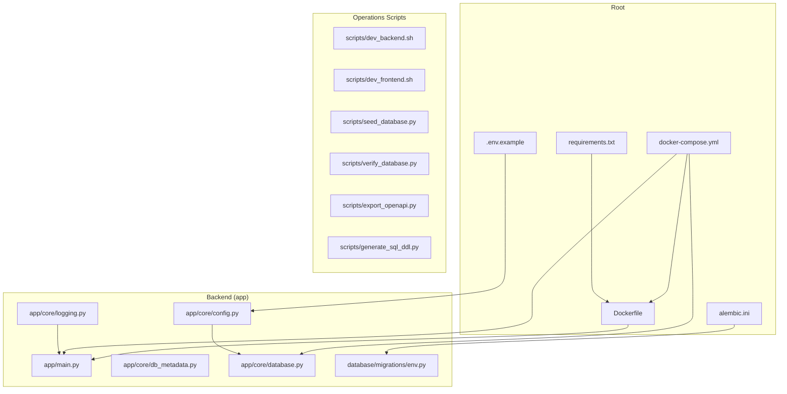
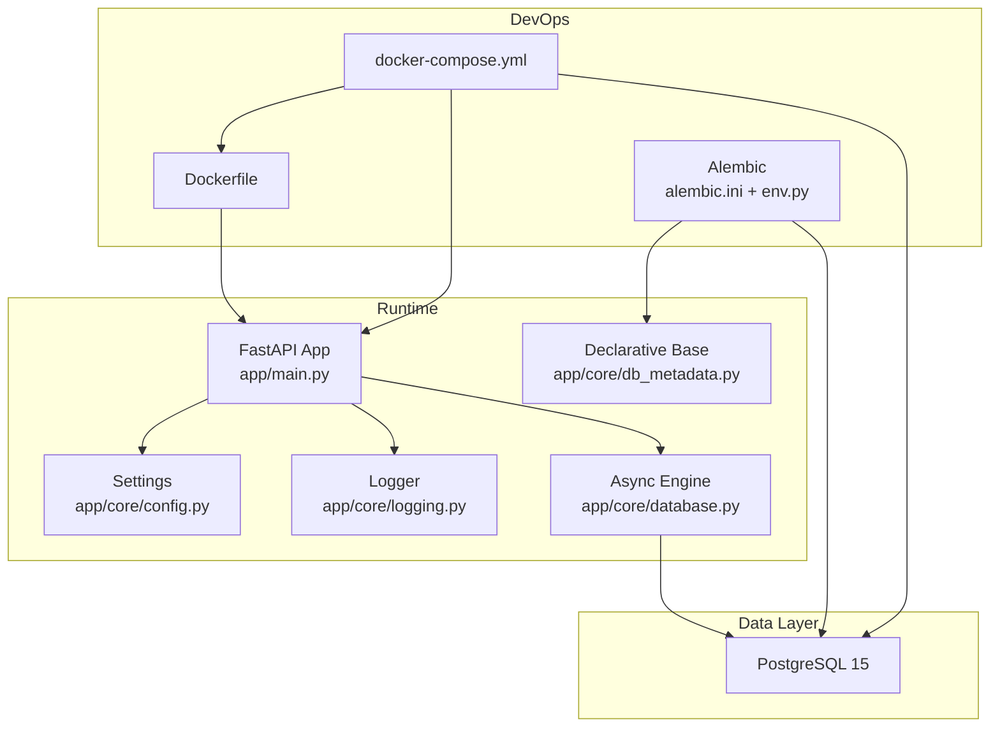
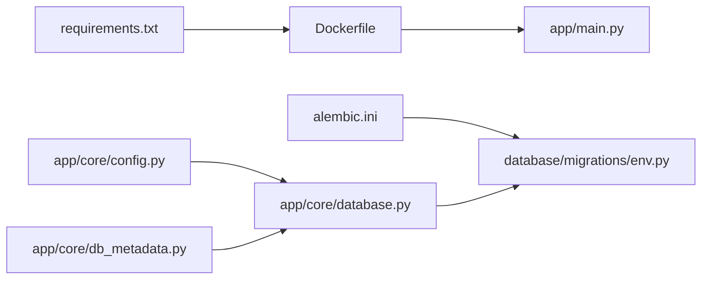

# Deployment and Operations

<cite>
**Referenced Files in This Document**
- [Dockerfile](file://Dockerfile)
- [docker-compose.yml](file://docker-compose.yml)
- [alembic.ini](file://alembic.ini)
- [database/migrations/env.py](file://database/migrations/env.py)
- [app/main.py](file://app/main.py)
- [app/core/config.py](file://app/core/config.py)
- [app/core/database.py](file://app/core/database.py)
- [app/core/db_metadata.py](file://app/core/db_metadata.py)
- [app/core/logging.py](file://app/core/logging.py)
- [requirements.txt](file://requirements.txt)
- [scripts/dev_backend.sh](file://scripts/dev_backend.sh)
- [scripts/dev_frontend.sh](file://scripts/dev_frontend.sh)
- [scripts/seed_database.py](file://scripts/seed_database.py)
- [scripts/verify_database.py](file://scripts/verify_database.py)
- [scripts/export_openapi.py](file://scripts/export_openapi.py)
- [scripts/generate_sql_ddl.py](file://scripts/generate_sql_ddl.py)
- [.env.example](file://.env.example)
</cite>

## Table of Contents
1. [Introduction](#introduction)
2. [Project Structure](#project-structure)
3. [Core Components](#core-components)
4. [Architecture Overview](#architecture-overview)
5. [Detailed Component Analysis](#detailed-component-analysis)
6. [Dependency Analysis](#dependency-analysis)
7. [Performance Considerations](#performance-considerations)
8. [Troubleshooting Guide](#troubleshooting-guide)
9. [Conclusion](#conclusion)
10. [Appendices](#appendices)

## Introduction
This document provides comprehensive deployment and operations guidance for the TrueVow Financial Management system. It covers containerized deployment with Docker and Docker Compose, multi-stage build considerations, environment configuration, database migration management with Alembic, operational scripts, production deployment procedures, monitoring and logging, maintenance tasks, development workflows, hot reload capabilities, local development environments, backup and disaster recovery, and operational troubleshooting.

## Project Structure
The repository is organized into:
- Backend application under app/, including FastAPI entry point, configuration, logging, database setup, and module-specific code.
- Database migration assets under database/migrations/.
- Operational scripts under scripts/.
- Frontend under frontend/.
- Containerization artifacts at the repository root (Dockerfile, docker-compose.yml).
- Configuration templates and requirements at the root.

**Diagram sources**
- [Dockerfile](file://Dockerfile#L1-L28)
- [docker-compose.yml](file://docker-compose.yml#L1-L42)
- [alembic.ini](file://alembic.ini#L1-L115)
- [database/migrations/env.py](file://database/migrations/env.py#L1-L198)
- [app/main.py](file://app/main.py#L1-L54)
- [app/core/config.py](file://app/core/config.py#L1-L74)
- [app/core/database.py](file://app/core/database.py#L1-L113)
- [app/core/db_metadata.py](file://app/core/db_metadata.py#L1-L10)
- [app/core/logging.py](file://app/core/logging.py#L1-L34)
- [requirements.txt](file://requirements.txt#L1-L53)
- [.env.example](file://.env.example#L1-L23)
- [scripts/dev_backend.sh](file://scripts/dev_backend.sh#L1-L77)
- [scripts/dev_frontend.sh](file://scripts/dev_frontend.sh#L1-L64)
- [scripts/seed_database.py](file://scripts/seed_database.py#L1-L53)
- [scripts/verify_database.py](file://scripts/verify_database.py#L1-L240)
- [scripts/export_openapi.py](file://scripts/export_openapi.py#L1-L74)
- [scripts/generate_sql_ddl.py](file://scripts/generate_sql_ddl.py#L1-L114)

**Section sources**
- [Dockerfile](file://Dockerfile#L1-L28)
- [docker-compose.yml](file://docker-compose.yml#L1-L42)
- [requirements.txt](file://requirements.txt#L1-L53)
- [app/main.py](file://app/main.py#L1-L54)
- [app/core/config.py](file://app/core/config.py#L1-L74)
- [app/core/database.py](file://app/core/database.py#L1-L113)
- [app/core/db_metadata.py](file://app/core/db_metadata.py#L1-L10)
- [app/core/logging.py](file://app/core/logging.py#L1-L34)
- [alembic.ini](file://alembic.ini#L1-L115)
- [database/migrations/env.py](file://database/migrations/env.py#L1-L198)
- [.env.example](file://.env.example#L1-L23)
- [scripts/dev_backend.sh](file://scripts/dev_backend.sh#L1-L77)
- [scripts/dev_frontend.sh](file://scripts/dev_frontend.sh#L1-L64)
- [scripts/seed_database.py](file://scripts/seed_database.py#L1-L53)
- [scripts/verify_database.py](file://scripts/verify_database.py#L1-L240)
- [scripts/export_openapi.py](file://scripts/export_openapi.py#L1-L74)
- [scripts/generate_sql_ddl.py](file://scripts/generate_sql_ddl.py#L1-L114)

## Core Components
- Containerization: Single-container Dockerfile builds a Python 3.11 slim image, installs system dependencies, copies application code, exposes port 8000, and runs Uvicorn with the FastAPI app entry point.
- Orchestration: docker-compose.yml defines two services: a Postgres 15 Alpine database with health checks and persistent volume, and the TrueVow service built from the Dockerfile. The service mounts the backend app and logs directories, sets environment variables, and enables hot reload.
- Configuration: Application settings are loaded via Pydantic Settings from .env and .env.local, supporting DATABASE_URL/FINANCIAL_MANAGEMENT_DATABASE_URL and JWT secrets. Logging uses Loguru when available, with rotating file logs in production.
- Database: Async SQLAlchemy engine configured with pool size and overflow, sessions managed via async_sessionmaker, and Base imported for migrations.
- Migrations: Alembic configuration loads environment variables from .env/.env.local and supports multiple URL preferences, with offline/online modes and explicit URL normalization for Supabase pooler compatibility.
- Operational Scripts: Development bootstrap scripts for backend and frontend, database verification and seeding, OpenAPI export, and DDL generation for direct SQL execution.

**Section sources**
- [Dockerfile](file://Dockerfile#L1-L28)
- [docker-compose.yml](file://docker-compose.yml#L1-L42)
- [app/core/config.py](file://app/core/config.py#L1-L74)
- [app/core/logging.py](file://app/core/logging.py#L1-L34)
- [app/core/database.py](file://app/core/database.py#L1-L113)
- [app/core/db_metadata.py](file://app/core/db_metadata.py#L1-L10)
- [alembic.ini](file://alembic.ini#L1-L115)
- [database/migrations/env.py](file://database/migrations/env.py#L1-L198)
- [scripts/dev_backend.sh](file://scripts/dev_backend.sh#L1-L77)
- [scripts/dev_frontend.sh](file://scripts/dev_frontend.sh#L1-L64)
- [scripts/verify_database.py](file://scripts/verify_database.py#L1-L240)
- [scripts/seed_database.py](file://scripts/seed_database.py#L1-L53)
- [scripts/export_openapi.py](file://scripts/export_openapi.py#L1-L74)
- [scripts/generate_sql_ddl.py](file://scripts/generate_sql_ddl.py#L1-L114)

## Architecture Overview
The system consists of a FastAPI service backed by an asynchronous SQLAlchemy engine connecting to a PostgreSQL database. Alembic manages schema migrations independently of the application runtime. Development and production deployments leverage Docker and Docker Compose, with hot reload enabled locally.

**Diagram sources**
- [app/main.py](file://app/main.py#L1-L54)
- [app/core/config.py](file://app/core/config.py#L1-L74)
- [app/core/logging.py](file://app/core/logging.py#L1-L34)
- [app/core/database.py](file://app/core/database.py#L1-L113)
- [app/core/db_metadata.py](file://app/core/db_metadata.py#L1-L10)
- [alembic.ini](file://alembic.ini#L1-L115)
- [database/migrations/env.py](file://database/migrations/env.py#L1-L198)
- [Dockerfile](file://Dockerfile#L1-L28)
- [docker-compose.yml](file://docker-compose.yml#L1-L42)

## Detailed Component Analysis

### Containerized Deployment with Docker
- Image build: Python 3.11 slim base, system dependencies (gcc, postgresql-client), pip installation of requirements, copy of application code, creation of logs directory, expose port 8000, run Uvicorn pointing to the FastAPI app.
- Multi-stage considerations: The current Dockerfile is a single stage optimized for simplicity and hot reload during development. For production, consider a multi-stage build to reduce image size and improve security.
- Health checks: Postgres service includes a health check using pg_isready. The application service does not define a health check; consider adding a readiness/liveness probe in orchestrator configurations.

**Section sources**
- [Dockerfile](file://Dockerfile#L1-L28)
- [docker-compose.yml](file://docker-compose.yml#L1-L42)

### Container Orchestration with Docker Compose
- Services:
  - postgres: Postgres 15 Alpine with environment variables for credentials and database name, mapped port 5432, named volume for persistence, and health check.
  - fm-service: Built from Dockerfile, environment variables for DATABASE_URL, ENVIRONMENT, and LOG_LEVEL, mapped port 8000, depends on postgres being healthy, mounts app and logs directories, and runs Uvicorn with --reload for hot reload.
- Volumes: Named volume for Postgres data ensures persistence across container restarts.

**Section sources**
- [docker-compose.yml](file://docker-compose.yml#L1-L42)

### Environment Configuration
- Settings class loads from .env and .env.local, supports DATABASE_URL and FINANCIAL_MANAGEMENT_DATABASE_URL, auto-converts to asyncpg when needed, validates JWT secret presence, and sets observability flags.
- Example environment variables include DATABASE_URL, JWT_SECRET_KEY, ENVIRONMENT, LOG_LEVEL, and optional integration URLs.

**Section sources**
- [app/core/config.py](file://app/core/config.py#L1-L74)
- [.env.example](file://.env.example#L1-L23)

### Database Migration Management with Alembic
- Alembic configuration:
  - script_location set to database/migrations.
  - Logging configuration for sqlalchemy and alembic.
  - Environment loading from .env/.env.local from repository root and current working directory.
  - URL resolution prefers pooler URLs for connectivity, normalizes postgres:// to postgresql://, escapes % for ConfigParser, and raises actionable errors if no URL is found.
- Migration execution:
  - Offline mode writes migrations without connecting.
  - Online mode creates a sync engine for Alembic and runs migrations within a transaction, with DNS/network hints for pooler failures.

**Section sources**
- [alembic.ini](file://alembic.ini#L1-L115)
- [database/migrations/env.py](file://database/migrations/env.py#L1-L198)

### Operational Scripts
- dev_backend.sh:
  - Creates .env from .env.example if missing, sets up a virtual environment, installs dependencies, starts PostgreSQL container if not running, runs migrations, executes tests, and prints instructions to start the server with hot reload.
- dev_frontend.sh:
  - Validates Node.js 18+, installs pnpm, installs dependencies, runs lint and typecheck, builds the frontend, and prints instructions to start the dev server.
- verify_database.py:
  - Tests database connection, checks for expected tables and ENUMs, and verifies audit fields (created_by, updated_by) across tables.
- seed_database.py:
  - Seeds the database with predefined YAML data for legal entities, books, dimensions, and related records.
- export_openapi.py:
  - Exports the FastAPI OpenAPI schema to a JSON file for documentation and tooling.
- generate_sql_ddl.py:
  - Generates SQL DDL statements from SQLAlchemy models for direct execution in the database.

**Section sources**
- [scripts/dev_backend.sh](file://scripts/dev_backend.sh#L1-L77)
- [scripts/dev_frontend.sh](file://scripts/dev_frontend.sh#L1-L64)
- [scripts/verify_database.py](file://scripts/verify_database.py#L1-L240)
- [scripts/seed_database.py](file://scripts/seed_database.py#L1-L53)
- [scripts/export_openapi.py](file://scripts/export_openapi.py#L1-L74)
- [scripts/generate_sql_ddl.py](file://scripts/generate_sql_ddl.py#L1-L114)

### Logging Configuration
- Uses Loguru when available; otherwise falls back to stdlib logging.
- Production logging rotates daily with a 30-day retention to logs/fm_service_{time:YYYY-MM-DD}.log.
- Development logging prints to stdout with structured formatting.

**Section sources**
- [app/core/logging.py](file://app/core/logging.py#L1-L34)

### Database Connectivity and Sessions
- Async engine created from effective_database_url with configurable pool size and overflow.
- AsyncSessionLocal factory provides sessions with expire_on_commit disabled.
- get_db_session dependency yields sessions safely closed after use.

**Section sources**
- [app/core/database.py](file://app/core/database.py#L1-L113)

### Health Endpoint
- A /health endpoint returns service status, version, and service identifier.

**Section sources**
- [app/main.py](file://app/main.py#L33-L40)

### Multi-Stage Build Considerations
- Current Dockerfile is a single stage suitable for development and quick iteration.
- Recommended production improvements:
  - Separate build and runtime stages to minimize image size.
  - Install only runtime dependencies in the final stage.
  - Use a non-root user for the final runtime container.
  - Add a health check for the application service.

**Section sources**
- [Dockerfile](file://Dockerfile#L1-L28)

### Hot Reload and Local Development
- docker-compose.yml sets command with --reload for Uvicorn, enabling automatic restarts on code changes.
- Mounts ./app to /app/app and ./logs to /app/logs for live updates and persistent logs.

**Section sources**
- [docker-compose.yml](file://docker-compose.yml#L38-L38)

### Development Workflows
- Backend:
  - Ensure .env exists; if not, copy from .env.example and set required variables.
  - Create and activate a virtual environment, install dependencies, start PostgreSQL container, run migrations, and execute tests.
- Frontend:
  - Verify Node.js 18+, install pnpm, install dependencies, run lint/typecheck/build, then start the dev server.

**Section sources**
- [scripts/dev_backend.sh](file://scripts/dev_backend.sh#L1-L77)
- [scripts/dev_frontend.sh](file://scripts/dev_frontend.sh#L1-L64)

### Production Deployment Procedures
- Prepare environment:
  - Set DATABASE_URL and JWT_SECRET_KEY in production environment variables.
  - Choose appropriate LOG_LEVEL and ENVIRONMENT.
- Build and deploy:
  - Build the image using the Dockerfile.
  - Deploy the postgres service and the application service with persistent volumes for Postgres data.
  - Remove or disable hot reload in production.
- Migrate schema:
  - Run Alembic migrations using the env.py configuration to connect to the production database.
- Verify:
  - Confirm database connectivity and schema completeness using verify_database.py.
  - Export OpenAPI schema for documentation and tooling.

**Section sources**
- [docker-compose.yml](file://docker-compose.yml#L1-L42)
- [alembic.ini](file://alembic.ini#L1-L115)
- [database/migrations/env.py](file://database/migrations/env.py#L1-L198)
- [scripts/verify_database.py](file://scripts/verify_database.py#L1-L240)
- [scripts/export_openapi.py](file://scripts/export_openapi.py#L1-L74)

### Monitoring and Observability
- Logging:
  - INFO level by default; production logs rotate daily with 30-day retention.
  - Consider integrating structured logging with external systems (e.g., log aggregation) for centralized monitoring.
- Metrics:
  - enable_metrics flag is available in settings; integrate Prometheus or similar metrics exporter as needed.

**Section sources**
- [app/core/logging.py](file://app/core/logging.py#L1-L34)
- [app/core/config.py](file://app/core/config.py#L63-L66)

### Maintenance Tasks
- Database verification:
  - Use verify_database.py to check connectivity, tables, ENUMs, and audit fields.
- Schema generation:
  - Use generate_sql_ddl.py to produce SQL DDL for direct execution in the database.
- OpenAPI export:
  - Use export_openapi.py to export the API schema for documentation and tooling.
- Seeding:
  - Use seed_database.py to populate initial data for development or onboarding.

**Section sources**
- [scripts/verify_database.py](file://scripts/verify_database.py#L1-L240)
- [scripts/generate_sql_ddl.py](file://scripts/generate_sql_ddl.py#L1-L114)
- [scripts/export_openapi.py](file://scripts/export_openapi.py#L1-L74)
- [scripts/seed_database.py](file://scripts/seed_database.py#L1-L53)

### Backup and Disaster Recovery
- Data protection:
  - Persist Postgres data using the named volume in docker-compose.yml.
  - Regularly back up the Postgres volume and store offsite.
- Recovery:
  - Restore from backups and redeploy the stack.
  - After restore, verify database connectivity and run Alembic migrations to ensure schema alignment.

**Section sources**
- [docker-compose.yml](file://docker-compose.yml#L13-L14)

### Operational Troubleshooting
- Database connectivity:
  - Use verify_database.py to test connection and inspect schema completeness.
- Migration issues:
  - Ensure DATABASE_URL is set and normalized; prefer pooler URLs if direct host fails DNS.
- Logs:
  - Check stdout logs and production log files under logs/.

**Section sources**
- [scripts/verify_database.py](file://scripts/verify_database.py#L1-L240)
- [database/migrations/env.py](file://database/migrations/env.py#L105-L133)
- [app/core/logging.py](file://app/core/logging.py#L15-L22)

## Dependency Analysis
The backend depends on FastAPI, Uvicorn, SQLAlchemy (async), asyncpg, Alembic, and Pydantic settings. The Dockerfile installs system dependencies and Python packages from requirements.txt. Alembic env.py loads environment variables and imports all models to populate target_metadata.

**Diagram sources**
- [requirements.txt](file://requirements.txt#L1-L53)
- [Dockerfile](file://Dockerfile#L1-L28)
- [app/main.py](file://app/main.py#L1-L54)
- [app/core/config.py](file://app/core/config.py#L1-L74)
- [app/core/database.py](file://app/core/database.py#L1-L113)
- [app/core/db_metadata.py](file://app/core/db_metadata.py#L1-L10)
- [alembic.ini](file://alembic.ini#L1-L115)
- [database/migrations/env.py](file://database/migrations/env.py#L1-L198)

**Section sources**
- [requirements.txt](file://requirements.txt#L1-L53)
- [Dockerfile](file://Dockerfile#L1-L28)
- [app/core/config.py](file://app/core/config.py#L1-L74)
- [app/core/database.py](file://app/core/database.py#L1-L113)
- [app/core/db_metadata.py](file://app/core/db_metadata.py#L1-L10)
- [alembic.ini](file://alembic.ini#L1-L115)
- [database/migrations/env.py](file://database/migrations/env.py#L1-L198)

## Performance Considerations
- Database pooling: Tune database_pool_size and database_max_overflow in settings for expected concurrency.
- Logging overhead: Production logs rotate and retain for 30 days; monitor disk usage.
- Container resources: Allocate CPU/memory limits and requests in orchestrator for predictable performance.
- Hot reload: Disable in production to avoid unnecessary restarts and resource consumption.

[No sources needed since this section provides general guidance]

## Troubleshooting Guide
- Missing .env:
  - Backend script creates .env from .env.example if missing; set DATABASE_URL and JWT_SECRET_KEY.
- Docker not running:
  - Start Docker Desktop and ensure containers can be started.
- PostgreSQL not ready:
  - docker-compose health check uses pg_isready; wait for service_healthy before starting the application.
- Migration connectivity:
  - Ensure DATABASE_URL is set; prefer pooler URLs if direct host fails DNS.
- Database verification failures:
  - Use verify_database.py to identify missing tables, ENUMs, or audit fields.

**Section sources**
- [scripts/dev_backend.sh](file://scripts/dev_backend.sh#L12-L24)
- [docker-compose.yml](file://docker-compose.yml#L15-L19)
- [database/migrations/env.py](file://database/migrations/env.py#L105-L133)
- [scripts/verify_database.py](file://scripts/verify_database.py#L22-L44)

## Conclusion
The TrueVow Financial Management system provides a robust foundation for containerized deployment with Docker and Docker Compose, clear environment configuration, and comprehensive operational scripts. Alembic handles migrations independently of runtime settings, while logging and observability are configurable for both development and production. Following the procedures outlined here ensures reliable deployments, maintainable operations, and streamlined development workflows.

[No sources needed since this section summarizes without analyzing specific files]

## Appendices

### Appendix A: Environment Variables Reference
- DATABASE_URL: Database connection string for asyncpg.
- FINANCIAL_MANAGEMENT_DATABASE_URL: Alternative database URL variable.
- JWT_SECRET_KEY: Secret key for JWT signing; required in development and mandatory in production.
- FINANCIAL_MANAGEMENT_SECRET_KEY: Alternative JWT secret variable.
- ENVIRONMENT: Environment label (development/production).
- LOG_LEVEL: Logging verbosity.
- APP_NAME and APP_VERSION: Application metadata.
- Optional integrations: BILLING_SERVICE_URL/BILLING_SERVICE_API_KEY, TREASURY_SERVICE_URL/TREASURY_SERVICE_API_KEY.

**Section sources**
- [app/core/config.py](file://app/core/config.py#L10-L61)
- [.env.example](file://.env.example#L1-L23)

### Appendix B: Key Endpoints and Scripts
- Health endpoint: GET /health
- Alembic commands: Upgrade/downgrade via Alembic CLI using alembic.ini and env.py.
- Scripts:
  - scripts/dev_backend.sh
  - scripts/dev_frontend.sh
  - scripts/verify_database.py
  - scripts/seed_database.py
  - scripts/export_openapi.py
  - scripts/generate_sql_ddl.py

**Section sources**
- [app/main.py](file://app/main.py#L33-L40)
- [alembic.ini](file://alembic.ini#L1-L115)
- [database/migrations/env.py](file://database/migrations/env.py#L1-L198)
- [scripts/dev_backend.sh](file://scripts/dev_backend.sh#L1-L77)
- [scripts/dev_frontend.sh](file://scripts/dev_frontend.sh#L1-L64)
- [scripts/verify_database.py](file://scripts/verify_database.py#L1-L240)
- [scripts/seed_database.py](file://scripts/seed_database.py#L1-L53)
- [scripts/export_openapi.py](file://scripts/export_openapi.py#L1-L74)
- [scripts/generate_sql_ddl.py](file://scripts/generate_sql_ddl.py#L1-L114)