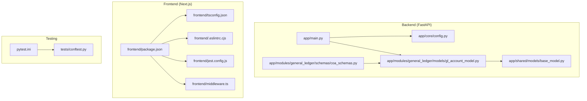
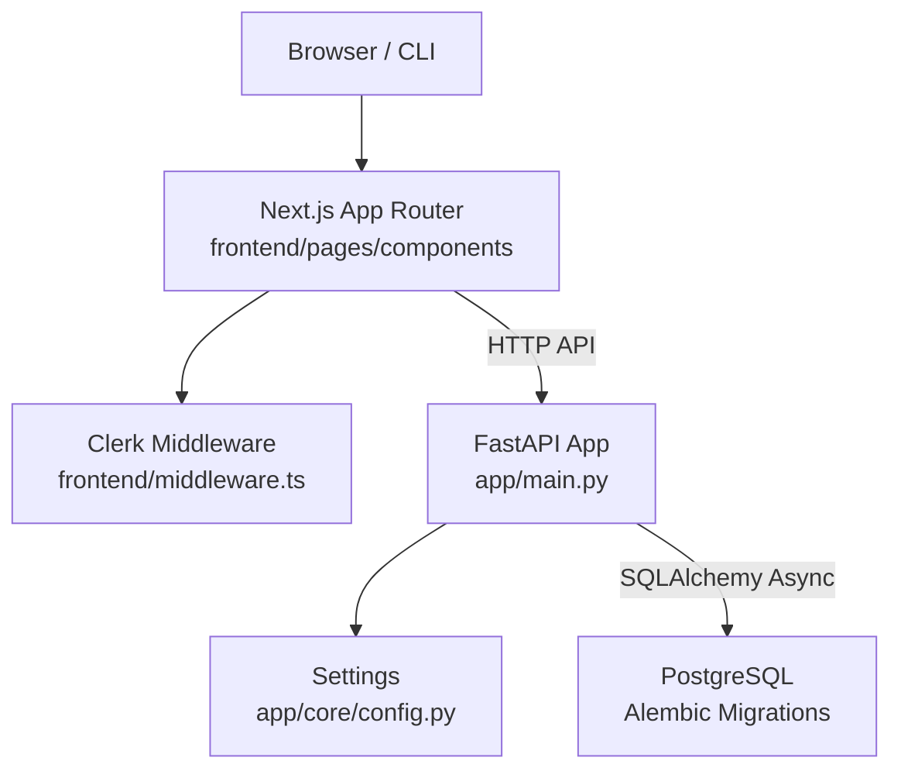
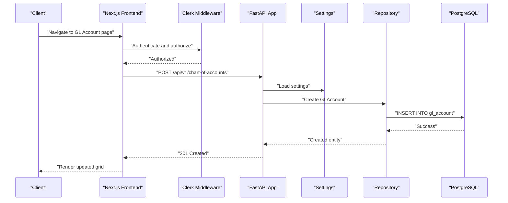
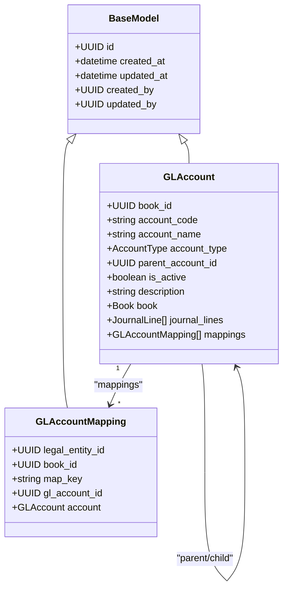
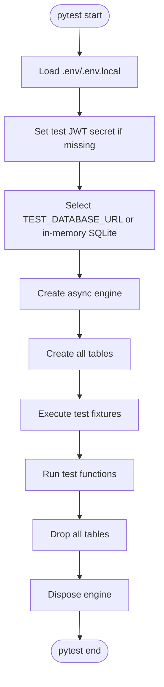
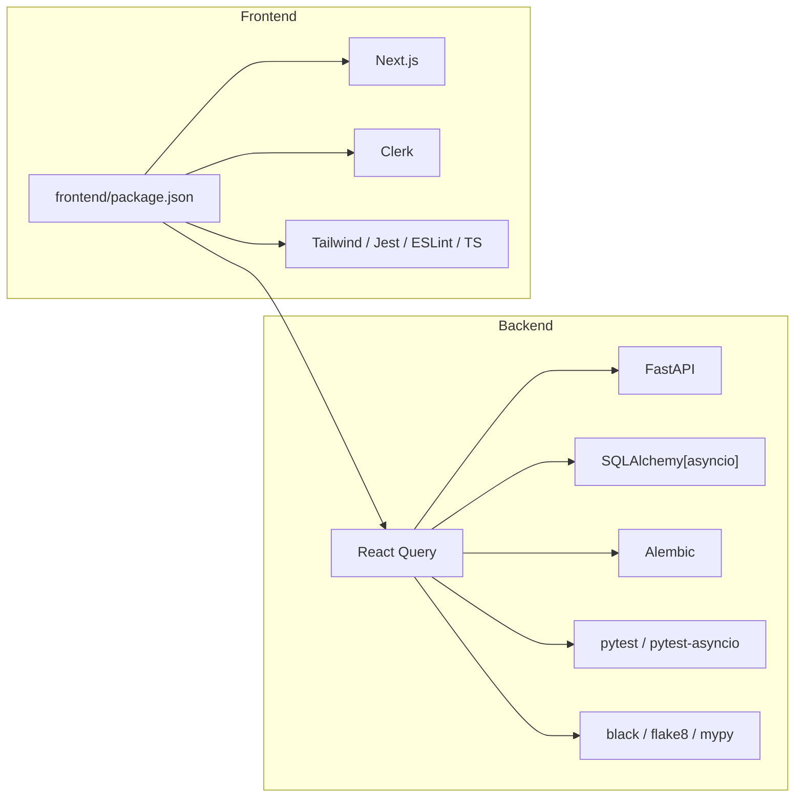

# Development Guidelines

<cite>
**Referenced Files in This Document**
- [README.md](file://README.md)
- [README_DEV_SETUP.md](file://README_DEV_SETUP.md)
- [requirements.txt](file://requirements.txt)
- [pytest.ini](file://pytest.ini)
- [app/main.py](file://app/main.py)
- [app/core/config.py](file://app/core/config.py)
- [app/shared/models/base_model.py](file://app/shared/models/base_model.py)
- [app/modules/general_ledger/models/gl_account_model.py](file://app/modules/general_ledger/models/gl_account_model.py)
- [app/modules/general_ledger/schemas/coa_schemas.py](file://app/modules/general_ledger/schemas/coa_schemas.py)
- [tests/conftest.py](file://tests/conftest.py)
- [frontend/package.json](file://frontend/package.json)
- [frontend/tsconfig.json](file://frontend/tsconfig.json)
- [frontend/.eslintrc.cjs](file://frontend/.eslintrc.cjs)
- [frontend/jest.config.js](file://frontend/jest.config.js)
- [frontend/tailwind.config.js](file://frontend/tailwind.config.js)
- [frontend/middleware.ts](file://frontend/middleware.ts)
- [scripts/dev_backend.sh](file://scripts/dev_backend.sh)
- [scripts/dev_frontend.sh](file://scripts/dev_frontend.sh)
</cite>

## Table of Contents
1. [Introduction](#introduction)
2. [Project Structure](#project-structure)
3. [Core Components](#core-components)
4. [Architecture Overview](#architecture-overview)
5. [Detailed Component Analysis](#detailed-component-analysis)
6. [Dependency Analysis](#dependency-analysis)
7. [Performance Considerations](#performance-considerations)
8. [Troubleshooting Guide](#troubleshooting-guide)
9. [Conclusion](#conclusion)
10. [Appendices](#appendices)

## Introduction
This document defines comprehensive development guidelines for the TrueVow Financial Management system. It covers coding standards for Python/FastAPI backend and TypeScript/Next.js React frontend, project structure conventions, naming patterns, architectural principles, code review processes, pull request guidelines, quality gates, development workflow, branching strategies, release management, code formatting, linting, and testing requirements. Guidance is grounded in the repository’s actual configuration and code to ensure maintainability, security, and scalability.

## Project Structure
The repository follows a modular monolith with clear separation of concerns:
- Backend: FastAPI application under app/, organized by domain modules (ar, ap, general_ledger, payroll, treasury, reporting, intercompany, core, auth, api).
- Database: SQLAlchemy ORM models under modules/*/models, repositories under modules/*/repositories, services under modules/*/services, and schemas under modules/*/schemas.
- Frontend: Next.js application under frontend/ with pages, components, hooks, contexts, and UI primitives.
- Shared: Base models and repositories under app/shared/.
- Tests: pytest-based tests under tests/ with fixtures in tests/conftest.py.
- Scripts: Developer automation under scripts/.

**Diagram sources**
- [app/main.py](file://app/main.py#L1-L54)
- [app/core/config.py](file://app/core/config.py#L1-L74)
- [app/shared/models/base_model.py](file://app/shared/models/base_model.py#L1-L18)
- [app/modules/general_ledger/models/gl_account_model.py](file://app/modules/general_ledger/models/gl_account_model.py#L1-L80)
- [app/modules/general_ledger/schemas/coa_schemas.py](file://app/modules/general_ledger/schemas/coa_schemas.py#L1-L62)
- [frontend/package.json](file://frontend/package.json#L1-L55)
- [frontend/tsconfig.json](file://frontend/tsconfig.json#L1-L28)
- [frontend/.eslintrc.cjs](file://frontend/.eslintrc.cjs#L1-L6)
- [frontend/jest.config.js](file://frontend/jest.config.js#L1-L32)
- [frontend/middleware.ts](file://frontend/middleware.ts#L1-L10)
- [pytest.ini](file://pytest.ini#L1-L8)
- [tests/conftest.py](file://tests/conftest.py#L1-L188)

**Section sources**
- [README.md](file://README.md#L75-L96)
- [README_DEV_SETUP.md](file://README_DEV_SETUP.md#L1-L195)
- [frontend/package.json](file://frontend/package.json#L1-L55)
- [frontend/tsconfig.json](file://frontend/tsconfig.json#L1-L28)

## Core Components
- Application entry and routing: The backend FastAPI app initializes middleware, registers routers, and exposes health checks.
- Configuration: Centralized settings via Pydantic BaseSettings supporting environment-specific overrides and validation.
- Shared models: Abstract base model with standardized identity and audit fields.
- Domain models and schemas: Example GL account model and Pydantic schemas demonstrate typed request/response contracts.
- Testing: Pytest configuration and comprehensive fixtures for async database sessions and domain entities.

Key implementation references:
- Backend entrypoint and middleware registration: [app/main.py](file://app/main.py#L1-L54)
- Settings and environment variables: [app/core/config.py](file://app/core/config.py#L1-L74)
- Base model with common fields: [app/shared/models/base_model.py](file://app/shared/models/base_model.py#L1-L18)
- GL account model and enums: [app/modules/general_ledger/models/gl_account_model.py](file://app/modules/general_ledger/models/gl_account_model.py#L1-L80)
- GL account schemas: [app/modules/general_ledger/schemas/coa_schemas.py](file://app/modules/general_ledger/schemas/coa_schemas.py#L1-L62)
- Pytest configuration and fixtures: [pytest.ini](file://pytest.ini#L1-L8), [tests/conftest.py](file://tests/conftest.py#L1-L188)

**Section sources**
- [app/main.py](file://app/main.py#L1-L54)
- [app/core/config.py](file://app/core/config.py#L1-L74)
- [app/shared/models/base_model.py](file://app/shared/models/base_model.py#L1-L18)
- [app/modules/general_ledger/models/gl_account_model.py](file://app/modules/general_ledger/models/gl_account_model.py#L1-L80)
- [app/modules/general_ledger/schemas/coa_schemas.py](file://app/modules/general_ledger/schemas/coa_schemas.py#L1-L62)
- [pytest.ini](file://pytest.ini#L1-L8)
- [tests/conftest.py](file://tests/conftest.py#L1-L188)

## Architecture Overview
The system is designed with a security-first, modular backend and a modern frontend:
- Backend: FastAPI with async SQLAlchemy, JWT-based authentication, CORS, and structured middleware pipeline.
- Frontend: Next.js App Router with Clerk authentication, React Query for data fetching, Tailwind CSS for styling, and strict TypeScript configuration.
- Data flow: Domain modules encapsulate models, repositories, services, and schemas; API routes expose domain capabilities; tests validate behavior.

**Diagram sources**
- [frontend/middleware.ts](file://frontend/middleware.ts#L1-L10)
- [frontend/package.json](file://frontend/package.json#L1-L55)
- [app/main.py](file://app/main.py#L1-L54)
- [app/core/config.py](file://app/core/config.py#L1-L74)

## Detailed Component Analysis

### Backend Coding Standards and Conventions
- Language and framework: Python 3.11+ with FastAPI and async SQLAlchemy.
- Configuration: Centralized via Pydantic settings with environment variable precedence and validation.
- Models: Abstract base model enforces UUID primary keys and audit timestamps; domain models define relationships and constraints.
- Schemas: Pydantic models for request/response validation and serialization.
- Testing: Async fixtures, in-memory SQLite fallback, and explicit test database URL support.

Recommended practices derived from repository configuration:
- Use async SQLAlchemy for I/O-bound database operations.
- Centralize environment configuration and validation.
- Define Pydantic schemas alongside models for API contracts.
- Prefer fixtures for reusable test setup.

**Section sources**
- [requirements.txt](file://requirements.txt#L1-L53)
- [app/core/config.py](file://app/core/config.py#L1-L74)
- [app/shared/models/base_model.py](file://app/shared/models/base_model.py#L1-L18)
- [app/modules/general_ledger/models/gl_account_model.py](file://app/modules/general_ledger/models/gl_account_model.py#L1-L80)
- [app/modules/general_ledger/schemas/coa_schemas.py](file://app/modules/general_ledger/schemas/coa_schemas.py#L1-L62)
- [pytest.ini](file://pytest.ini#L1-L8)
- [tests/conftest.py](file://tests/conftest.py#L1-L188)

### Frontend Coding Standards and Conventions
- Language and framework: TypeScript with Next.js App Router, React Query, and Tailwind CSS.
- Configuration: Strict TypeScript compiler options, ESLint via Next.js config, Jest for unit/integration tests, and Tailwind content scanning.
- Authentication: Clerk middleware with public routes for sign-in/sign-up.
- Component architecture: Pages under app/ with shared components, hooks, contexts, and UI primitives.

Recommended practices derived from repository configuration:
- Keep strict TypeScript settings and run typecheck in CI.
- Enforce linting with ESLint Next.js recommended config.
- Use React Query for caching and optimistic updates.
- Maintain a consistent component library and shared UI primitives.

**Section sources**
- [frontend/package.json](file://frontend/package.json#L1-L55)
- [frontend/tsconfig.json](file://frontend/tsconfig.json#L1-L28)
- [frontend/.eslintrc.cjs](file://frontend/.eslintrc.cjs#L1-L6)
- [frontend/jest.config.js](file://frontend/jest.config.js#L1-L32)
- [frontend/tailwind.config.js](file://frontend/tailwind.config.js#L1-L59)
- [frontend/middleware.ts](file://frontend/middleware.ts#L1-L10)

### API Workflow (Example: GL Account)
This sequence illustrates a typical backend request flow for a domain operation.

**Diagram sources**
- [frontend/middleware.ts](file://frontend/middleware.ts#L1-L10)
- [app/main.py](file://app/main.py#L1-L54)
- [app/core/config.py](file://app/core/config.py#L1-L74)
- [app/modules/general_ledger/models/gl_account_model.py](file://app/modules/general_ledger/models/gl_account_model.py#L1-L80)

### Data Model: GL Account
The GL account model demonstrates typed enums, relationships, and constraints.

**Diagram sources**
- [app/shared/models/base_model.py](file://app/shared/models/base_model.py#L1-L18)
- [app/modules/general_ledger/models/gl_account_model.py](file://app/modules/general_ledger/models/gl_account_model.py#L1-L80)

### Testing Flow
The testing flow leverages async fixtures and optional external database connectivity.

**Diagram sources**
- [tests/conftest.py](file://tests/conftest.py#L1-L188)
- [pytest.ini](file://pytest.ini#L1-L8)

## Dependency Analysis
- Backend dependencies: FastAPI, Uvicorn, Pydantic, SQLAlchemy async, Alembic, httpx/aiohttp, forex-python, pytest-asyncio, black/flake8/mypy.
- Frontend dependencies: Next.js, React, Clerk, React Query, Tailwind, Zod, Jest, ESLint, TypeScript.

**Diagram sources**
- [requirements.txt](file://requirements.txt#L1-L53)
- [frontend/package.json](file://frontend/package.json#L1-L55)

**Section sources**
- [requirements.txt](file://requirements.txt#L1-L53)
- [frontend/package.json](file://frontend/package.json#L1-L55)

## Performance Considerations
- Asynchronous I/O: Use async SQLAlchemy and FastAPI to handle concurrent requests efficiently.
- Connection pooling: Configure pool sizes and overflow in settings for predictable resource usage.
- Caching: Use React Query for client-side caching and reduce redundant API calls.
- Database migrations: Keep Alembic migrations idempotent and scoped to minimize downtime during upgrades.
- Linting and typechecking: Enforce early detection of performance pitfalls and regressions.

[No sources needed since this section provides general guidance]

## Troubleshooting Guide
Common setup and runtime issues:
- Backend
  - Missing environment variables: Ensure DATABASE_URL and JWT_SECRET_KEY are configured.
  - Docker not running: Start Docker Desktop and run the PostgreSQL container.
  - Migration failures: Verify database connectivity and run migrations again.
  - Test failures: Confirm TEST_DATABASE_URL or availability of aiosqlite for in-memory tests.
- Frontend
  - Node.js version: Ensure Node.js 18+ is installed.
  - pnpm not found: Install pnpm globally and rerun installation.
  - Lint/typecheck/build errors: Review ESLint and TypeScript configurations.

Verification steps and scripts:
- Backend verification: migrations, tests, and server startup.
- Frontend verification: lint, typecheck, build, and dev server.

**Section sources**
- [README_DEV_SETUP.md](file://README_DEV_SETUP.md#L132-L147)
- [scripts/dev_backend.sh](file://scripts/dev_backend.sh#L1-L77)
- [scripts/dev_frontend.sh](file://scripts/dev_frontend.sh#L1-L64)

## Conclusion
These guidelines establish a consistent, secure, and scalable development process for TrueVow Financial Management. By adhering to the outlined standards, conventions, and quality gates, contributors can extend existing modules and introduce new functionality while preserving system integrity and performance.

[No sources needed since this section summarizes without analyzing specific files]

## Appendices

### A. Development Workflow and Branching Strategy
- Feature branches: Develop new features in isolated branches prefixed with feature/, fix bugs in hotfix/, and prepare releases in release/.
- Commit hygiene: Use clear, imperative commit messages; keep commits focused and atomic.
- Pull requests: Open PRs against develop for features and main for hotfixes; ensure CI passes and at least one reviewer approves.
- Code review: Focus on correctness, security, maintainability, and adherence to standards.
- Quality gates: All PRs must pass linting, typechecking, tests, and security scans before merging.

[No sources needed since this section provides general guidance]

### B. Release Management Procedures
- Versioning: Increment semantic versioning according to changes.
- Changelog: Maintain a changelog summarizing breaking changes, features, and fixes.
- Pre-release: Tag release candidates and run integration tests across environments.
- Production deployment: Use automated pipelines to deploy after successful QA and approvals.

[No sources needed since this section provides general guidance]

### C. Formatting and Linting Rules
- Backend
  - Formatting: Use black for consistent code style.
  - Linting: Use flake8 for style and complexity checks.
  - Type checking: Use mypy for static type validation.
- Frontend
  - Formatting/Linting: Use ESLint Next.js recommended config.
  - Type checking: Use tsc with no emit in CI.
  - Styling: Use Tailwind classes and avoid inline styles.

**Section sources**
- [requirements.txt](file://requirements.txt#L48-L52)
- [frontend/.eslintrc.cjs](file://frontend/.eslintrc.cjs#L1-L6)
- [frontend/tsconfig.json](file://frontend/tsconfig.json#L1-L28)

### D. Testing Requirements
- Backend
  - Test runner: pytest with asyncio mode enabled.
  - Async fixtures: Use async database sessions and cleanup.
  - Coverage: Aim for high coverage across models, services, and schemas.
- Frontend
  - Unit tests: Use Jest with JSDOM environment.
  - Coverage: Collect coverage from components, contexts, hooks, and lib.

**Section sources**
- [pytest.ini](file://pytest.ini#L1-L8)
- [tests/conftest.py](file://tests/conftest.py#L1-L188)
- [frontend/jest.config.js](file://frontend/jest.config.js#L1-L32)

### E. Extending Existing Modules and Adding New Functionality
- Follow the module pattern: models, repositories, services, schemas, and api/routes.
- Respect domain boundaries: keep modules cohesive and minimize cross-module coupling.
- Add migrations: Use Alembic to evolve schema safely.
- Write tests: Cover new models, services, and API endpoints.
- Update configuration: Add environment variables as needed in settings.

[No sources needed since this section provides general guidance]