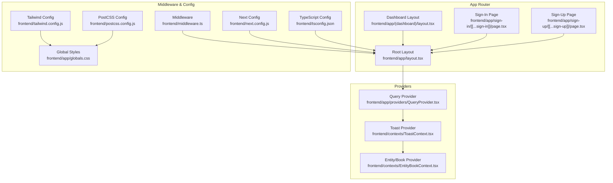
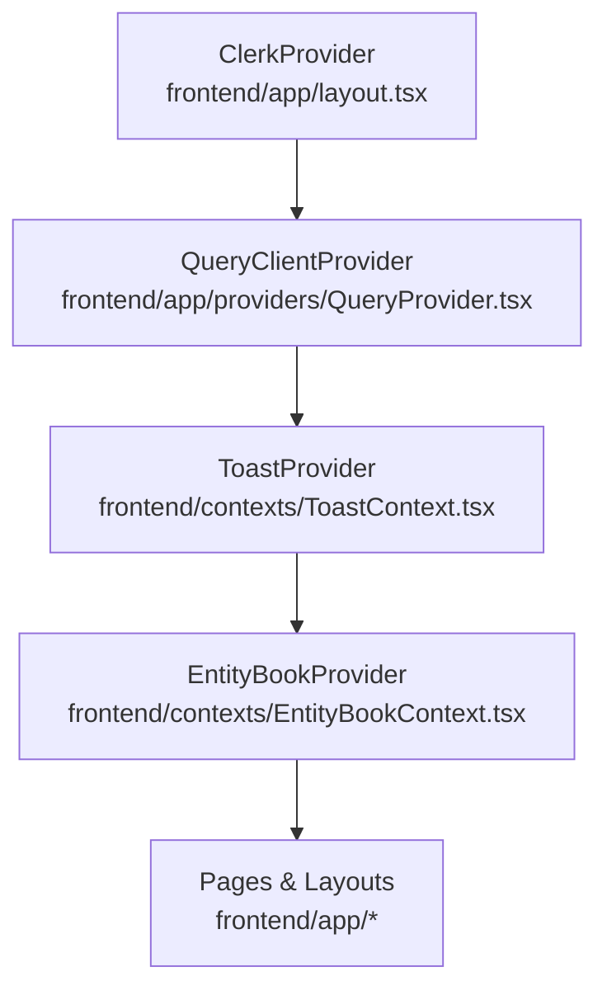
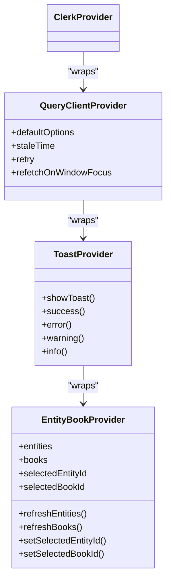
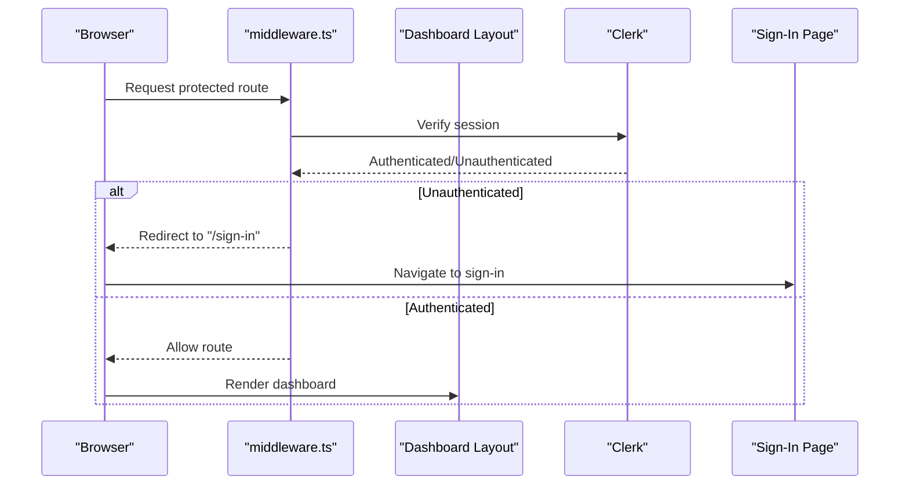
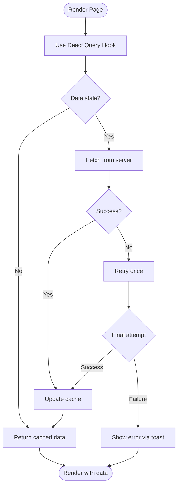
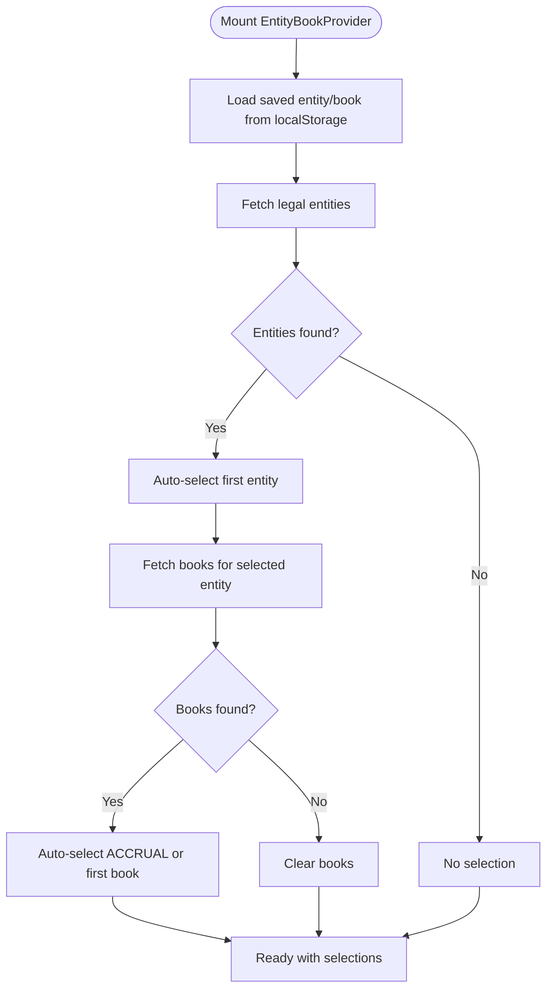
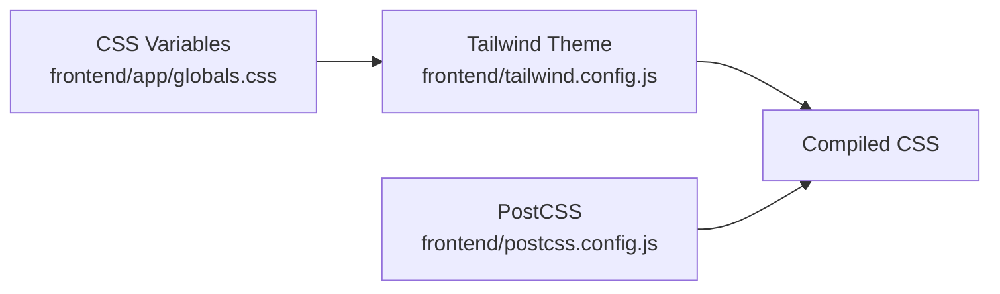
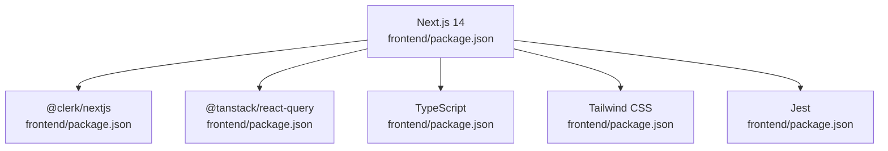

# Application Structure

<cite>
**Referenced Files in This Document**
- [layout.tsx](file://frontend/app/layout.tsx)
- [QueryProvider.tsx](file://frontend/app/providers/QueryProvider.tsx)
- [middleware.ts](file://frontend/middleware.ts)
- [next.config.js](file://frontend/next.config.js)
- [package.json](file://frontend/package.json)
- [ToastContext.tsx](file://frontend/contexts/ToastContext.tsx)
- [EntityBookContext.tsx](file://frontend/contexts/EntityBookContext.tsx)
- [tsconfig.json](file://frontend/tsconfig.json)
- [tailwind.config.js](file://frontend/tailwind.config.js)
- [postcss.config.js](file://frontend/postcss.config.js)
- [globals.css](file://frontend/app/globals.css)
- [layout.tsx](file://frontend/app/(dashboard)/layout.tsx)
- [page.tsx](file://frontend/app/sign-in/[[...sign-in]]/page.tsx)
- [page.tsx](file://frontend/app/sign-up/[[...sign-up]]/page.tsx)
</cite>

## Table of Contents
1. [Introduction](#introduction)
2. [Project Structure](#project-structure)
3. [Core Components](#core-components)
4. [Architecture Overview](#architecture-overview)
5. [Detailed Component Analysis](#detailed-component-analysis)
6. [Dependency Analysis](#dependency-analysis)
7. [Performance Considerations](#performance-considerations)
8. [Troubleshooting Guide](#troubleshooting-guide)
9. [Conclusion](#conclusion)
10. [Appendices](#appendices)

## Introduction
This document describes the Next.js application structure and configuration for the TrueVow Financial Management frontend. It explains the app directory layout, routing patterns, middleware configuration, and the provider hierarchy including React Query, authentication, and global state management. It also covers Next.js configuration options, build settings, environment variables, and practical guidance for extending the structure and maintaining configuration consistency across environments.

## Project Structure
The frontend is a Next.js 14 application using the App Router. The structure centers around:
- app/: The App Router entry point with nested routes, layouts, and pages
- app/providers/: Client-side providers for data fetching and UI state
- contexts/: Custom React contexts for global state (toasts, entity/book selection)
- components/: Shared UI components organized by common, layout, and page-specific groups
- hooks/: Custom hooks for domain-specific data fetching and state
- utils/: Utilities (e.g., Excel paste handler)
- Configuration files for TypeScript, Tailwind CSS, PostCSS, and Next.js

**Diagram sources**
- [layout.tsx](file://frontend/app/layout.tsx#L1-L37)
- [QueryProvider.tsx](file://frontend/app/providers/QueryProvider.tsx#L1-L26)
- [ToastContext.tsx](file://frontend/contexts/ToastContext.tsx#L1-L86)
- [EntityBookContext.tsx](file://frontend/contexts/EntityBookContext.tsx#L1-L158)
- [layout.tsx](file://frontend/app/(dashboard)/layout.tsx#L1-L18)
- [page.tsx](file://frontend/app/sign-in/[[...sign-in]]/page.tsx#L1-L10)
- [page.tsx](file://frontend/app/sign-up/[[...sign-up]]/page.tsx#L1-L10)
- [middleware.ts](file://frontend/middleware.ts#L1-L10)
- [next.config.js](file://frontend/next.config.js#L1-L7)
- [tsconfig.json](file://frontend/tsconfig.json#L1-L28)
- [tailwind.config.js](file://frontend/tailwind.config.js#L1-L59)
- [postcss.config.js](file://frontend/postcss.config.js#L1-L4)
- [globals.css](file://frontend/app/globals.css#L1-L52)

**Section sources**
- [layout.tsx](file://frontend/app/layout.tsx#L1-L37)
- [QueryProvider.tsx](file://frontend/app/providers/QueryProvider.tsx#L1-L26)
- [ToastContext.tsx](file://frontend/contexts/ToastContext.tsx#L1-L86)
- [EntityBookContext.tsx](file://frontend/contexts/EntityBookContext.tsx#L1-L158)
- [layout.tsx](file://frontend/app/(dashboard)/layout.tsx#L1-L18)
- [page.tsx](file://frontend/app/sign-in/[[...sign-in]]/page.tsx#L1-L10)
- [page.tsx](file://frontend/app/sign-up/[[...sign-up]]/page.tsx#L1-L10)
- [middleware.ts](file://frontend/middleware.ts#L1-L10)
- [next.config.js](file://frontend/next.config.js#L1-L7)
- [tsconfig.json](file://frontend/tsconfig.json#L1-L28)
- [tailwind.config.js](file://frontend/tailwind.config.js#L1-L59)
- [postcss.config.js](file://frontend/postcss.config.js#L1-L4)
- [globals.css](file://frontend/app/globals.css#L1-L52)

## Core Components
- Root layout composes providers in a strict order to ensure proper data flow and UI behavior.
- QueryProvider initializes React Query with default caching and retry policies.
- ClerkProvider enables authentication across the app.
- ToastProvider exposes a toast service and renders a persistent toast container.
- EntityBookProvider manages legal entity and book selection with persistence and loading states.
- Middleware enforces authentication for protected routes while allowing sign-in/sign-up.

Key configuration highlights:
- Next.js configuration enables strict mode.
- TypeScript configuration uses bundler module resolution and path aliases.
- Tailwind CSS is configured to scan app, components, and pages directories with custom design tokens.
- PostCSS applies Tailwind and Autoprefixer.

**Section sources**
- [layout.tsx](file://frontend/app/layout.tsx#L1-L37)
- [QueryProvider.tsx](file://frontend/app/providers/QueryProvider.tsx#L1-L26)
- [ToastContext.tsx](file://frontend/contexts/ToastContext.tsx#L1-L86)
- [EntityBookContext.tsx](file://frontend/contexts/EntityBookContext.tsx#L1-L158)
- [middleware.ts](file://frontend/middleware.ts#L1-L10)
- [next.config.js](file://frontend/next.config.js#L1-L7)
- [tsconfig.json](file://frontend/tsconfig.json#L1-L28)
- [tailwind.config.js](file://frontend/tailwind.config.js#L1-L59)
- [postcss.config.js](file://frontend/postcss.config.js#L1-L4)

## Architecture Overview
The provider hierarchy ensures predictable data and UI state propagation:
- Authentication (Clerk) wraps all content.
- Data fetching (React Query) wraps UI state providers.
- Toast notifications wrap entity/book selection.
- Entity/book selection wraps page content.

**Diagram sources**
- [layout.tsx](file://frontend/app/layout.tsx#L22-L34)
- [QueryProvider.tsx](file://frontend/app/providers/QueryProvider.tsx#L6-L25)
- [ToastContext.tsx](file://frontend/contexts/ToastContext.tsx#L69-L84)
- [EntityBookContext.tsx](file://frontend/contexts/EntityBookContext.tsx#L138-L156)

## Detailed Component Analysis

### Provider Hierarchy and Responsibilities
- ClerkProvider: Centralizes authentication state and routing guards.
- QueryClientProvider: Initializes React Query with conservative defaults (retry, stale time, window focus behavior).
- ToastProvider: Manages toast lifecycle and exposes convenience methods for success/error/warning/info.
- EntityBookProvider: Loads legal entities and books, persists selections, and orchestrates loading states.

**Diagram sources**
- [layout.tsx](file://frontend/app/layout.tsx#L22-L34)
- [QueryProvider.tsx](file://frontend/app/providers/QueryProvider.tsx#L6-L18)
- [ToastContext.tsx](file://frontend/contexts/ToastContext.tsx#L46-L84)
- [EntityBookContext.tsx](file://frontend/contexts/EntityBookContext.tsx#L38-L156)

**Section sources**
- [layout.tsx](file://frontend/app/layout.tsx#L1-L37)
- [QueryProvider.tsx](file://frontend/app/providers/QueryProvider.tsx#L1-L26)
- [ToastContext.tsx](file://frontend/contexts/ToastContext.tsx#L1-L86)
- [EntityBookContext.tsx](file://frontend/contexts/EntityBookContext.tsx#L1-L158)

### Routing Patterns and Authentication Flow
- Protected dashboard layout checks authentication via Clerk and redirects unauthenticated users to sign-in.
- Sign-in and sign-up pages render Clerk’s hosted components.
- Middleware defines public routes and matchers to apply authentication globally.

**Diagram sources**
- [layout.tsx](file://frontend/app/(dashboard)/layout.tsx#L10-L14)
- [page.tsx](file://frontend/app/sign-in/[[...sign-in]]/page.tsx#L1-L10)
- [middleware.ts](file://frontend/middleware.ts#L3-L5)

**Section sources**
- [layout.tsx](file://frontend/app/(dashboard)/layout.tsx#L1-L18)
- [page.tsx](file://frontend/app/sign-in/[[...sign-in]]/page.tsx#L1-L10)
- [page.tsx](file://frontend/app/sign-up/[[...sign-up]]/page.tsx#L1-L10)
- [middleware.ts](file://frontend/middleware.ts#L1-L10)

### Data Fetching and Caching Strategy
React Query is configured with:
- Retry: 1 attempt on failure
- Stale time: 5 minutes
- Refetch on window focus disabled

This reduces network overhead and improves perceived performance for read-heavy financial data.

**Diagram sources**
- [QueryProvider.tsx](file://frontend/app/providers/QueryProvider.tsx#L10-L16)

**Section sources**
- [QueryProvider.tsx](file://frontend/app/providers/QueryProvider.tsx#L1-L26)

### Global State Management
EntityBookProvider:
- Persists selections in localStorage
- Auto-selects first entity and preferred book (ACCRUAL if available)
- Exposes refresh methods and loading state
- Integrates with toast provider for error feedback

**Diagram sources**
- [EntityBookContext.tsx](file://frontend/contexts/EntityBookContext.tsx#L47-L133)

**Section sources**
- [EntityBookContext.tsx](file://frontend/contexts/EntityBookContext.tsx#L1-L158)

### UI Theming and Styling
- Tailwind CSS scans app, components, and pages directories.
- Design tokens are defined via CSS variables in globals.css with light/dark themes.
- PostCSS pipeline applies Tailwind directives and autoprefixing.

**Diagram sources**
- [globals.css](file://frontend/app/globals.css#L5-L41)
- [tailwind.config.js](file://frontend/tailwind.config.js#L10-L55)
- [postcss.config.js](file://frontend/postcss.config.js#L1-L4)

**Section sources**
- [globals.css](file://frontend/app/globals.css#L1-L52)
- [tailwind.config.js](file://frontend/tailwind.config.js#L1-L59)
- [postcss.config.js](file://frontend/postcss.config.js#L1-L4)

## Dependency Analysis
The frontend depends on Next.js 14, Clerk for authentication, and React Query for data fetching. TypeScript, Tailwind CSS, and Jest are used for type safety, styling, and testing respectively.

**Diagram sources**
- [package.json](file://frontend/package.json#L15-L34)

**Section sources**
- [package.json](file://frontend/package.json#L1-L55)

## Performance Considerations
- React Query default options reduce unnecessary refetches and retries to balance freshness and performance.
- Persisted selections minimize repeated API calls during navigation.
- Strict mode and modern bundler module resolution improve build reliability and tree-shaking.

[No sources needed since this section provides general guidance]

## Troubleshooting Guide
Common areas to check:
- Authentication redirects: Verify middleware matchers and public routes.
- Provider order: Ensure Clerk wraps QueryClientProvider, which wraps ToastProvider, which wraps EntityBookProvider.
- Environment variables: Confirm Clerk and API base URL are configured in the runtime environment.
- Styling issues: Validate Tailwind content paths and CSS variable definitions.

**Section sources**
- [middleware.ts](file://frontend/middleware.ts#L7-L9)
- [layout.tsx](file://frontend/app/layout.tsx#L22-L34)
- [globals.css](file://frontend/app/globals.css#L5-L41)

## Conclusion
The application follows a clean, layered architecture with explicit provider responsibilities, robust authentication via Clerk, and efficient data fetching with React Query. The configuration emphasizes developer experience and maintainability through TypeScript, Tailwind CSS, and standardized tooling.

[No sources needed since this section summarizes without analyzing specific files]

## Appendices

### Extending the Application Structure
- Add new pages under app/ with appropriate layouts and nested route groups.
- Introduce new providers by wrapping existing providers in the root layout or specific layouts.
- Create new contexts under contexts/ for domain-specific state and expose hooks for consumption.
- Add new API clients under lib/api/ and integrate with React Query for caching and invalidation.

[No sources needed since this section provides general guidance]

### Adding New Providers
- Wrap the new provider inside the existing hierarchy in the root layout to ensure availability across the app.
- Keep providers focused on single responsibilities and avoid deep nesting that complicates debugging.
- Use local storage sparingly and ensure fallbacks when unavailable.

**Section sources**
- [layout.tsx](file://frontend/app/layout.tsx#L22-L34)

### Maintaining Configuration Consistency
- Align Next.js, TypeScript, and Tailwind configurations across environments using environment variables for API endpoints and Clerk keys.
- Keep default React Query options centralized in the QueryProvider to enforce consistent caching behavior.
- Use consistent naming and folder structures for routes, contexts, and components to simplify onboarding and maintenance.

**Section sources**
- [next.config.js](file://frontend/next.config.js#L1-L7)
- [tsconfig.json](file://frontend/tsconfig.json#L21-L23)
- [tailwind.config.js](file://frontend/tailwind.config.js#L4-L9)
- [QueryProvider.tsx](file://frontend/app/providers/QueryProvider.tsx#L10-L16)