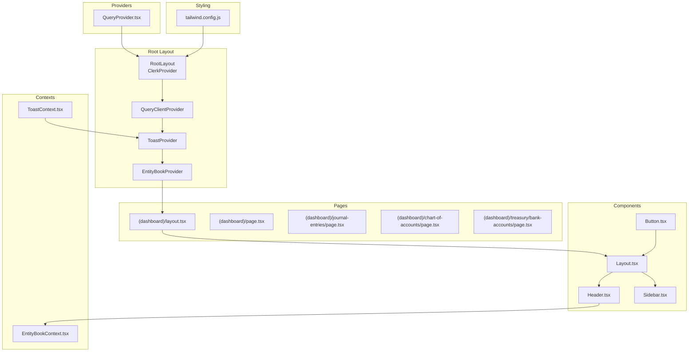
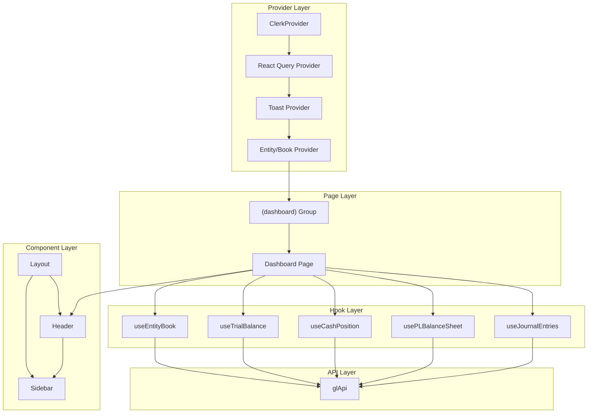
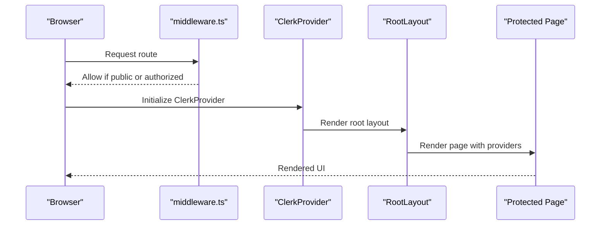
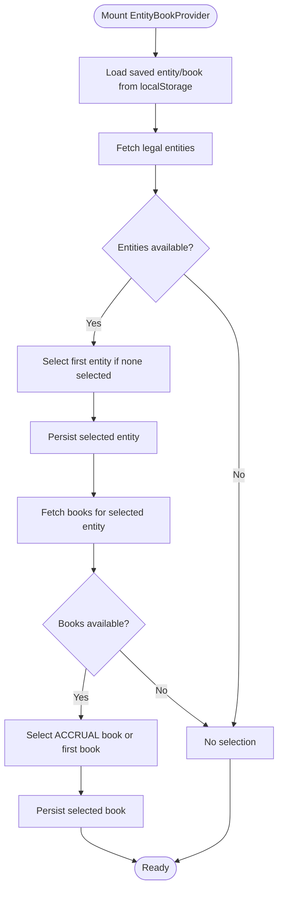
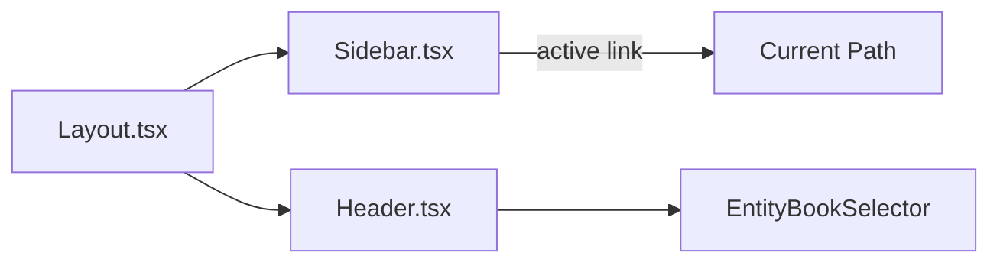
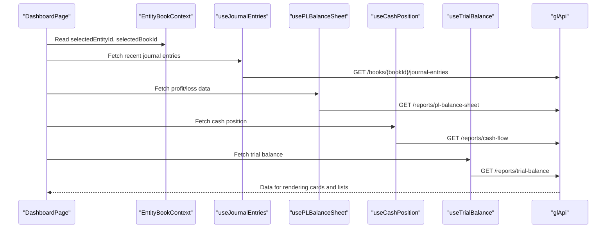
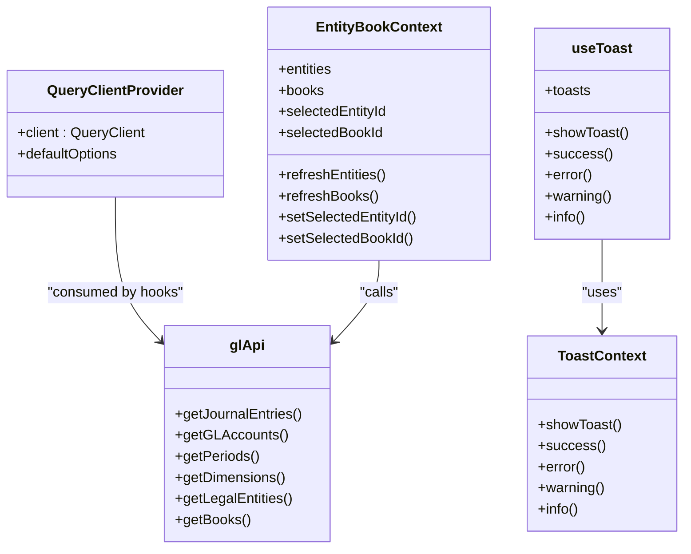
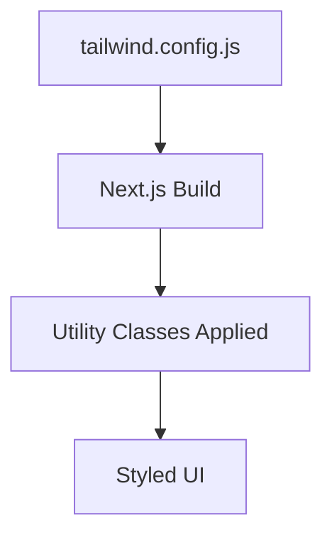
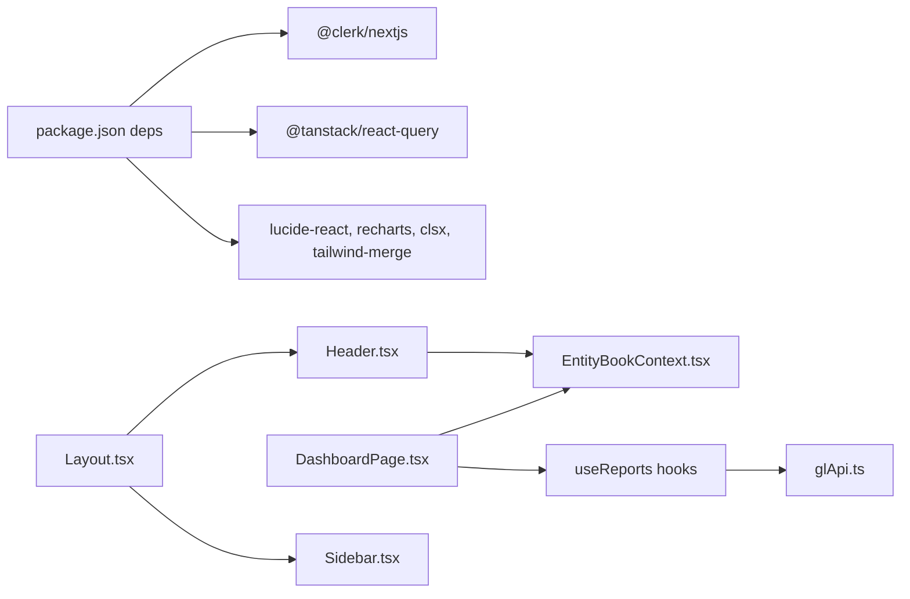

# Frontend Application

<cite>
**Referenced Files in This Document**
- [layout.tsx](file://frontend/app/layout.tsx)
- [QueryProvider.tsx](file://frontend/app/providers/QueryProvider.tsx)
- [middleware.ts](file://frontend/middleware.ts)
- [package.json](file://frontend/package.json)
- [tailwind.config.js](file://frontend/tailwind.config.js)
- [ToastContext.tsx](file://frontend/contexts/ToastContext.tsx)
- [EntityBookContext.tsx](file://frontend/contexts/EntityBookContext.tsx)
- [Layout.tsx](file://frontend/components/layout/Layout.tsx)
- [Header.tsx](file://frontend/components/layout/Header.tsx)
- [Sidebar.tsx](file://frontend/components/layout/Sidebar.tsx)
- [DashboardPage.tsx](file://frontend/components/pages/dashboard/DashboardPage.tsx)
- [useToast.ts](file://frontend/hooks/useToast.ts)
- [glApi.ts](file://frontend/lib/api/glApi.ts)
- [Button.tsx](file://frontend/components/common/Button.tsx)
</cite>

## Table of Contents
1. [Introduction](#introduction)
2. [Project Structure](#project-structure)
3. [Core Components](#core-components)
4. [Architecture Overview](#architecture-overview)
5. [Detailed Component Analysis](#detailed-component-analysis)
6. [Dependency Analysis](#dependency-analysis)
7. [Performance Considerations](#performance-considerations)
8. [Troubleshooting Guide](#troubleshooting-guide)
9. [Conclusion](#conclusion)
10. [Appendices](#appendices)

## Introduction
This document describes the frontend application for the TrueVow Financial Management system built with Next.js App Router. It explains the application’s layout and navigation system, provider hierarchy, styling approach with Tailwind CSS, component architecture, page organization, and state management patterns. It also covers React Query integration, custom hooks, utility functions, middleware configuration, authentication flow, routing patterns, and practical guidance for extending the frontend while maintaining design consistency.

## Project Structure
The frontend is organized under the Next.js App Router convention with a dedicated app directory. Providers are mounted at the root layout to wrap all pages. Authentication is handled via Clerk middleware and ClerkProvider. Styling leverages Tailwind CSS with a centralized configuration. The UI is composed of reusable components grouped by common, layout, pages, and ui categories. Hooks encapsulate data fetching and state logic, and a typed API client provides strongly-typed service calls.

**Diagram sources**
- [layout.tsx](file://frontend/app/layout.tsx#L16-L36)
- [QueryProvider.tsx](file://frontend/app/providers/QueryProvider.tsx#L6-L25)
- [ToastContext.tsx](file://frontend/contexts/ToastContext.tsx#L46-L84)
- [EntityBookContext.tsx](file://frontend/contexts/EntityBookContext.tsx#L38-L156)
- [Layout.tsx](file://frontend/components/layout/Layout.tsx#L14-L49)
- [Header.tsx](file://frontend/components/layout/Header.tsx#L12-L41)
- [Sidebar.tsx](file://frontend/components/layout/Sidebar.tsx#L27-L57)
- [Button.tsx](file://frontend/components/common/Button.tsx#L11-L13)
- [tailwind.config.js](file://frontend/tailwind.config.js#L1-L59)

**Section sources**
- [layout.tsx](file://frontend/app/layout.tsx#L1-L37)
- [package.json](file://frontend/package.json#L15-L34)
- [tailwind.config.js](file://frontend/tailwind.config.js#L1-L59)

## Core Components
- Root layout mounts providers in a strict order: ClerkProvider → QueryClientProvider → ToastProvider → EntityBookProvider → children. This ensures authentication, caching, notifications, and entity/book selection are globally available.
- Middleware enforces authentication for protected routes and whitelists sign-in/sign-up.
- Tailwind CSS is configured with a design system using CSS variables for colors and radii, enabling consistent theming across components.
- Contexts:
  - ToastContext manages global toast notifications with imperative helpers and automatic dismissal.
  - EntityBookContext manages legal entity and book selection, persistence in localStorage, and loading states.
- Layout composes a sticky header, collapsible sidebar, breadcrumbs area, and main content region with a command palette and global search.

**Section sources**
- [layout.tsx](file://frontend/app/layout.tsx#L16-L36)
- [middleware.ts](file://frontend/middleware.ts#L1-L10)
- [tailwind.config.js](file://frontend/tailwind.config.js#L10-L55)
- [ToastContext.tsx](file://frontend/contexts/ToastContext.tsx#L46-L84)
- [EntityBookContext.tsx](file://frontend/contexts/EntityBookContext.tsx#L38-L156)
- [Layout.tsx](file://frontend/components/layout/Layout.tsx#L14-L49)

## Architecture Overview
The frontend follows a layered architecture:
- Provider layer: authentication, caching, notifications, and entity/book selection.
- Page layer: route groups and pages under the (dashboard) group.
- Component layer: shared components for layout and common UI.
- Hook layer: data fetching and state logic with React Query.
- API layer: typed client for backend endpoints.

**Diagram sources**
- [layout.tsx](file://frontend/app/layout.tsx#L22-L31)
- [QueryProvider.tsx](file://frontend/app/providers/QueryProvider.tsx#L6-L25)
- [ToastContext.tsx](file://frontend/contexts/ToastContext.tsx#L69-L84)
- [EntityBookContext.tsx](file://frontend/contexts/EntityBookContext.tsx#L138-L156)
- [DashboardPage.tsx](file://frontend/components/pages/dashboard/DashboardPage.tsx#L11-L28)
- [Header.tsx](file://frontend/components/layout/Header.tsx#L12-L41)
- [Sidebar.tsx](file://frontend/components/layout/Sidebar.tsx#L27-L57)
- [glApi.ts](file://frontend/lib/api/glApi.ts#L126-L319)

## Detailed Component Analysis

### Provider Hierarchy and Authentication Flow
- Authentication is enforced by Clerk middleware for protected routes and allows public access to sign-in and sign-up.
- Root layout wraps the app with ClerkProvider so pages can use Clerk hooks.
- The middleware matcher ensures all routes except static assets and API routes are protected.

**Diagram sources**
- [middleware.ts](file://frontend/middleware.ts#L1-L10)
- [layout.tsx](file://frontend/app/layout.tsx#L22-L31)

**Section sources**
- [middleware.ts](file://frontend/middleware.ts#L1-L10)
- [layout.tsx](file://frontend/app/layout.tsx#L22-L31)

### State Management with Contexts
- ToastContext provides:
  - Imperative helpers for success, error, warning, info, and generic show.
  - Automatic cleanup of timed toasts.
  - A separate state context for direct access to the toast array.
- EntityBookContext provides:
  - Lists of legal entities and books.
  - Selected entity and book with persistence in localStorage.
  - Loading state and refresh functions.
  - Side effects to select default book and reset selections when entity changes.

**Diagram sources**
- [EntityBookContext.tsx](file://frontend/contexts/EntityBookContext.tsx#L47-L133)

**Section sources**
- [ToastContext.tsx](file://frontend/contexts/ToastContext.tsx#L46-L84)
- [useToast.ts](file://frontend/hooks/useToast.ts#L6-L75)
- [EntityBookContext.tsx](file://frontend/contexts/EntityBookContext.tsx#L38-L156)

### Layout and Navigation System
- Layout composes:
  - Sidebar with navigation items and active-state highlighting based on current path.
  - Header with search trigger, user button, and entity/book selector.
  - Breadcrumbs area and main content region.
- Navigation items cover core financial domains: dashboard, journal entries, chart of accounts, accounting periods, treasury, AR/AP modules, payroll, intercompany, and reports.

**Diagram sources**
- [Sidebar.tsx](file://frontend/components/layout/Sidebar.tsx#L27-L57)
- [Header.tsx](file://frontend/components/layout/Header.tsx#L12-L41)
- [Layout.tsx](file://frontend/components/layout/Layout.tsx#L14-L49)

**Section sources**
- [Layout.tsx](file://frontend/components/layout/Layout.tsx#L14-L49)
- [Header.tsx](file://frontend/components/layout/Header.tsx#L12-L41)
- [Sidebar.tsx](file://frontend/components/layout/Sidebar.tsx#L7-L25)

### Page Organization and Example: Dashboard
- Pages are organized under the (dashboard) route group.
- The DashboardPage demonstrates:
  - Consumption of EntityBookContext for legal entity and book selection.
  - React Query hooks for recent journal entries and financial summaries.
  - Formatting utilities for currency and dates.
  - Quick action links and summary cards.

**Diagram sources**
- [DashboardPage.tsx](file://frontend/components/pages/dashboard/DashboardPage.tsx#L11-L28)
- [glApi.ts](file://frontend/lib/api/glApi.ts#L126-L319)

**Section sources**
- [DashboardPage.tsx](file://frontend/components/pages/dashboard/DashboardPage.tsx#L11-L181)

### React Query Integration and Custom Hooks
- QueryClientProvider sets default caching behavior:
  - No window focus refetch.
  - Retry attempts.
  - Stale time of five minutes.
- Custom hooks (e.g., useJournalEntries, useReports) encapsulate data fetching and expose data, loading, and error states for consumption in pages.
- The typed glApi centralizes endpoint calls and request/response shapes.

**Diagram sources**
- [QueryProvider.tsx](file://frontend/app/providers/QueryProvider.tsx#L6-L25)
- [useToast.ts](file://frontend/hooks/useToast.ts#L6-L75)
- [ToastContext.tsx](file://frontend/contexts/ToastContext.tsx#L46-L84)
- [EntityBookContext.tsx](file://frontend/contexts/EntityBookContext.tsx#L38-L156)
- [glApi.ts](file://frontend/lib/api/glApi.ts#L126-L319)

**Section sources**
- [QueryProvider.tsx](file://frontend/app/providers/QueryProvider.tsx#L6-L25)
- [useToast.ts](file://frontend/hooks/useToast.ts#L6-L75)
- [glApi.ts](file://frontend/lib/api/glApi.ts#L126-L319)

### Styling Approach with Tailwind CSS
- Tailwind is configured with:
  - Dark mode support via class strategy.
  - Content paths covering pages, components, app, and src.
  - Design tokens using CSS variables for colors and border radius.
- Components apply utility classes consistently, with a Button wrapper delegating to a reusable ui component.

**Diagram sources**
- [tailwind.config.js](file://frontend/tailwind.config.js#L1-L59)
- [Button.tsx](file://frontend/components/common/Button.tsx#L11-L13)

**Section sources**
- [tailwind.config.js](file://frontend/tailwind.config.js#L1-L59)
- [Button.tsx](file://frontend/components/common/Button.tsx#L11-L13)

## Dependency Analysis
- External libraries include Next.js, Clerk for authentication, React Query for caching, and UI-related packages (e.g., date-fns, recharts, lucide-react).
- Internal dependencies:
  - Pages depend on contexts and hooks.
  - Hooks depend on the typed API client.
  - Layout components depend on contexts and shared UI.

**Diagram sources**
- [package.json](file://frontend/package.json#L15-L34)
- [DashboardPage.tsx](file://frontend/components/pages/dashboard/DashboardPage.tsx#L11-L28)
- [EntityBookContext.tsx](file://frontend/contexts/EntityBookContext.tsx#L38-L156)
- [glApi.ts](file://frontend/lib/api/glApi.ts#L126-L319)
- [Layout.tsx](file://frontend/components/layout/Layout.tsx#L14-L49)
- [Header.tsx](file://frontend/components/layout/Header.tsx#L12-L41)
- [Sidebar.tsx](file://frontend/components/layout/Sidebar.tsx#L27-L57)

**Section sources**
- [package.json](file://frontend/package.json#L15-L34)
- [DashboardPage.tsx](file://frontend/components/pages/dashboard/DashboardPage.tsx#L11-L28)
- [glApi.ts](file://frontend/lib/api/glApi.ts#L126-L319)

## Performance Considerations
- React Query defaults reduce network pressure:
  - Stale cache for five minutes.
  - Limited retries.
  - Disabled refetch on window focus to avoid unnecessary background requests.
- Persisted entity/book selection reduces redundant API calls on initial loads.
- Prefer virtualization and pagination for large datasets (e.g., journal entries grids) to minimize DOM and re-renders.

[No sources needed since this section provides general guidance]

## Troubleshooting Guide
- Authentication issues:
  - Verify middleware matcher and public routes configuration.
  - Ensure ClerkProvider is present in the root layout.
- Toast notifications:
  - Confirm ToastProvider is mounted and useToast/useToastContext are used within provider boundaries.
- Entity/Book selection:
  - Check localStorage keys and confirm refresh functions are called after selection changes.
- Styling:
  - Validate Tailwind content paths and ensure CSS variables are defined for theme tokens.

**Section sources**
- [middleware.ts](file://frontend/middleware.ts#L7-L9)
- [layout.tsx](file://frontend/app/layout.tsx#L22-L31)
- [ToastContext.tsx](file://frontend/contexts/ToastContext.tsx#L46-L84)
- [EntityBookContext.tsx](file://frontend/contexts/EntityBookContext.tsx#L38-L156)
- [tailwind.config.js](file://frontend/tailwind.config.js#L1-L59)

## Conclusion
The TrueVow Financial Management frontend is structured around a robust provider hierarchy, consistent layout and navigation, and a cohesive state management model using contexts and React Query. The typed API layer and shared components promote maintainability and scalability. Following the established patterns enables safe extension of pages, components, and hooks while preserving design consistency.

[No sources needed since this section summarizes without analyzing specific files]

## Appendices
- Extending with new pages:
  - Place new pages under the (dashboard) group or create new route groups as needed.
  - Wrap page content with the existing Layout component for consistent header, sidebar, and breadcrumbs.
  - Consume EntityBookContext for entity/book-aware data fetching.
- Adding new components:
  - Use the common and ui directories as templates.
  - Apply Tailwind utility classes and respect design tokens from Tailwind configuration.
- Integrating new data:
  - Add typed endpoints to glApi and create or reuse hooks that encapsulate data fetching.
  - Use React Query default options to optimize caching behavior.

[No sources needed since this section provides general guidance]