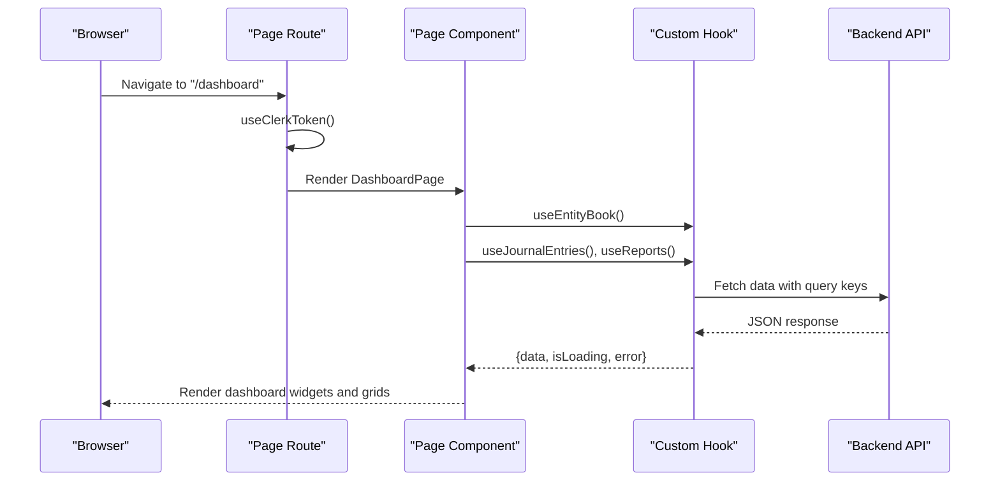
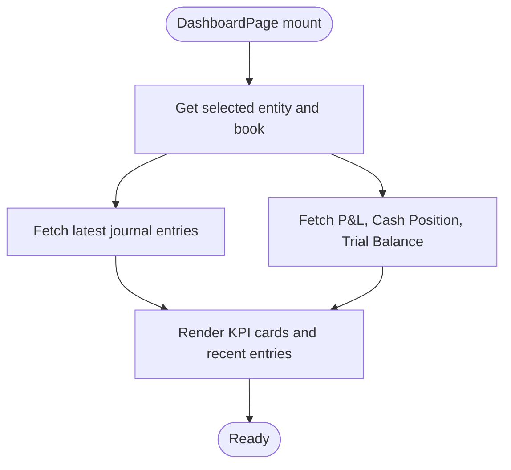
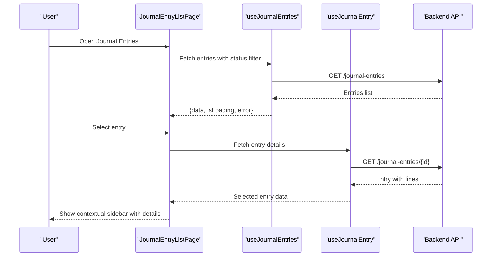
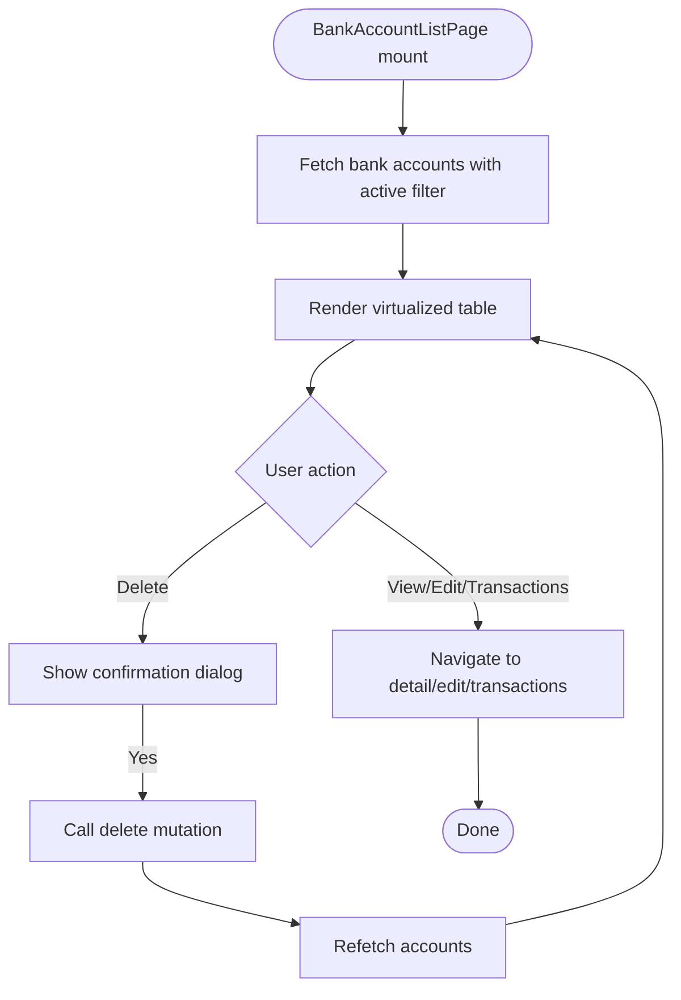
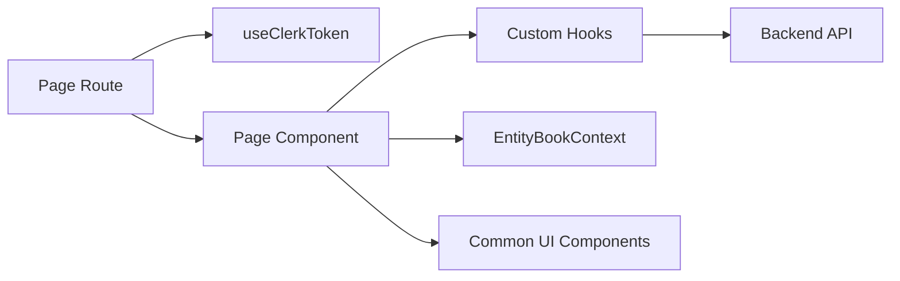

# Page Components

<cite>
**Referenced Files in This Document**
- [RootLayout](file://frontend/app/layout.tsx)
- [DashboardLayout](file://frontend/app/(dashboard)/layout.tsx)
- [Dashboard Page Route](file://frontend/app/(dashboard)/dashboard/page.tsx)
- [Journal Entries List Route](file://frontend/app/(dashboard)/journal-entries/page.tsx)
- [AR Invoices List Route](file://frontend/app/(dashboard)/ar/invoices/page.tsx)
- [AP Vendors List Route](file://frontend/app/(dashboard)/ap/vendors/page.tsx)
- [Payroll Employees List Route](file://frontend/app/(dashboard)/payroll/employees/page.tsx)
- [Treasury Bank Accounts List Route](file://frontend/app/(dashboard)/treasury/bank-accounts/page.tsx)
- [Dashboard Page Component](file://frontend/components/pages/dashboard/DashboardPage.tsx)
- [Journal Entry List Page Component](file://frontend/components/pages/journal-entries/JournalEntryListPage.tsx)
- [AR Invoice List Page Component](file://frontend/components/pages/ar/ARInvoiceListPage.tsx)
- [AP Vendor List Page Component](file://frontend/components/pages/ap/APVendorListPage.tsx)
- [Employee List Page Component](file://frontend/components/pages/payroll/EmployeeListPage.tsx)
- [Bank Account List Page Component](file://frontend/components/pages/treasury/BankAccountListPage.tsx)
- [Reports Page Component](file://frontend/components/pages/reports/ReportsPage.tsx)
- [Main Layout Component](file://frontend/components/layout/Layout.tsx)
- [Entity Book Provider](file://frontend/app/providers/QueryProvider.tsx)
- [Toast Provider](file://frontend/app/providers/QueryProvider.tsx)
- [Entity Book Context](file://frontend/contexts/EntityBookContext.tsx)
- [Toast Context](file://frontend/contexts/ToastContext.tsx)
- [useClerkToken Hook](file://frontend/hooks/useClerkToken.ts)
- [useJournalEntries Hook](file://frontend/hooks/useJournalEntries.ts)
- [useReports Hook](file://frontend/hooks/useReports.ts)
- [useTreasury Hook](file://frontend/hooks/useTreasury.ts)
- [VirtualizedTableWrapper](file://frontend/components/common/VirtualizedTableWrapper.tsx)
- [ContextualSidebar](file://frontend/components/common/ContextualSidebar.tsx)
- [useKeyboardShortcuts Hook](file://frontend/hooks/useKeyboardShortcuts.ts)
</cite>

## Table of Contents
1. [Introduction](#introduction)
2. [Project Structure](#project-structure)
3. [Core Components](#core-components)
4. [Architecture Overview](#architecture-overview)
5. [Detailed Component Analysis](#detailed-component-analysis)
6. [Dependency Analysis](#dependency-analysis)
7. [Performance Considerations](#performance-considerations)
8. [Troubleshooting Guide](#troubleshooting-guide)
9. [Conclusion](#conclusion)

## Introduction
This document explains the page component architecture and organization for the TrueVow Financial Management frontend. It covers the major functional areas: dashboard, journal entries, AR invoices, AP vendors, payroll, treasury, and reports. The guide details page structure, data fetching patterns, backend integration via hooks, navigation consistency, state management, form handling, and grid/table implementations. It also provides guidelines for creating new pages, implementing CRUD operations, and extending existing pages.

## Project Structure
The frontend follows a Next.js app router structure with route groups for protected dashboards and dedicated page components under components/pages. Providers wrap the application to supply global state and caching.

```mermaid
graph TB
subgraph "App Router"
RL["RootLayout<br/>(frontend/app/layout.tsx)"]
DL["DashboardLayout<br/>(frontend/app/(dashboard)/layout.tsx)"]
DRoute["Dashboard Route<br/>(frontend/app/(dashboard)/dashboard/page.tsx)"]
JEListRoute["Journal Entries Route<br/>(frontend/app/(dashboard)/journal-entries/page.tsx)"]
ARRoute["AR Invoices Route<br/>(frontend/app/(dashboard)/ar/invoices/page.tsx)"]
APRoute["AP Vendors Route<br/>(frontend/app/(dashboard)/ap/vendors/page.tsx)"]
PRRoute["Payroll Employees Route<br/>(frontend/app/(dashboard)/payroll/employees/page.tsx)"]
TRRoute["Treasury Bank Accounts Route<br/>(frontend/app/(dashboard)/treasury/bank-accounts/page.tsx)"]
end
subgraph "Providers"
QP["QueryProvider<br/>(frontend/app/providers/QueryProvider.tsx)"]
TP["ToastProvider<br/>(frontend/app/providers/QueryProvider.tsx)"]
EBC["EntityBookProvider<br/>(frontend/contexts/EntityBookContext.tsx)"]
end
subgraph "Page Components"
DP["DashboardPage<br/>(frontend/components/pages/dashboard/DashboardPage.tsx)"]
JELP["JournalEntryListPage<br/>(frontend/components/pages/journal-entries/JournalEntryListPage.tsx)"]
ARLP["ARInvoiceListPage<br/>(frontend/components/pages/ar/ARInvoiceListPage.tsx)"]
APLP["APVendorListPage<br/>(frontend/components/pages/ap/APVendorListPage.tsx)"]
ELP["EmployeeListPage<br/>(frontend/components/pages/payroll/EmployeeListPage.tsx)"]
BALP["BankAccountListPage<br/>(frontend/components/pages/treasury/BankAccountListPage.tsx)"]
RPT["ReportsPage<br/>(frontend/components/pages/reports/ReportsPage.tsx)"]
end
RL --> QP --> TP --> EBC
RL --> DL
DL --> DRoute --> DP
DL --> JEListRoute --> JELP
DL --> ARRoute --> ARLP
DL --> APRoute --> APLP
DL --> PRRoute --> ELP
DL --> TRRoute --> BALP
```

**Diagram sources**
- [RootLayout](file://frontend/app/layout.tsx#L16-L36)
- [DashboardLayout](file://frontend/app/(dashboard)/layout.tsx#L5-L17)
- [Dashboard Page Route](file://frontend/app/(dashboard)/dashboard/page.tsx#L6-L9)
- [Journal Entries List Route](file://frontend/app/(dashboard)/journal-entries/page.tsx#L6-L9)
- [AR Invoices List Route](file://frontend/app/(dashboard)/ar/invoices/page.tsx#L6-L9)
- [AP Vendors List Route](file://frontend/app/(dashboard)/ap/vendors/page.tsx#L6-L9)
- [Payroll Employees List Route](file://frontend/app/(dashboard)/payroll/employees/page.tsx#L6-L9)
- [Treasury Bank Accounts List Route](file://frontend/app/(dashboard)/treasury/bank-accounts/page.tsx#L6-L9)
- [Dashboard Page Component](file://frontend/components/pages/dashboard/DashboardPage.tsx#L11-L180)
- [Journal Entry List Page Component](file://frontend/components/pages/journal-entries/JournalEntryListPage.tsx#L11-L257)
- [AR Invoice List Page Component](file://frontend/components/pages/ar/ARInvoiceListPage.tsx#L3-L10)
- [AP Vendor List Page Component](file://frontend/components/pages/ap/APVendorListPage.tsx#L3-L10)
- [Employee List Page Component](file://frontend/components/pages/payroll/EmployeeListPage.tsx#L3-L10)
- [Bank Account List Page Component](file://frontend/components/pages/treasury/BankAccountListPage.tsx#L9-L150)
- [Reports Page Component](file://frontend/components/pages/reports/ReportsPage.tsx#L5-L85)

**Section sources**
- [RootLayout](file://frontend/app/layout.tsx#L1-L37)
- [DashboardLayout](file://frontend/app/(dashboard)/layout.tsx#L1-L18)

## Core Components
- Root layout initializes providers for authentication, query caching, toast notifications, and entity/book selection.
- Dashboard layout enforces authentication and wraps content with the main application layout.
- Page routes are lightweight wrappers that initialize tokens and render page components.
- Page components encapsulate business logic, data fetching, state, and UI rendering.

Key provider and context responsibilities:
- QueryProvider: React Query client initialization for API caching and refetching.
- ToastProvider: Global toast notification delivery.
- EntityBookProvider: Selected legal entity and book context for multi-entity environments.

**Section sources**
- [RootLayout](file://frontend/app/layout.tsx#L16-L36)
- [DashboardLayout](file://frontend/app/(dashboard)/layout.tsx#L5-L17)
- [Entity Book Provider](file://frontend/app/providers/QueryProvider.tsx)
- [Toast Provider](file://frontend/app/providers/QueryProvider.tsx)
- [Entity Book Context](file://frontend/contexts/EntityBookContext.tsx)
- [Toast Context](file://frontend/contexts/ToastContext.tsx)

## Architecture Overview
The page architecture follows a layered pattern:
- Routes: Thin wrappers that initialize authentication tokens and render page components.
- Page Components: Fetch data via hooks, manage local state, and render reusable UI components.
- Hooks: Encapsulate API calls, caching, and pagination logic.
- Shared UI: Common components like VirtualizedTableWrapper, ContextualSidebar, and layout building blocks.

**Diagram sources**
- [Dashboard Page Route](file://frontend/app/(dashboard)/dashboard/page.tsx#L6-L9)
- [Dashboard Page Component](file://frontend/components/pages/dashboard/DashboardPage.tsx#L11-L28)
- [useClerkToken Hook](file://frontend/hooks/useClerkToken.ts)
- [useJournalEntries Hook](file://frontend/hooks/useJournalEntries.ts)
- [useReports Hook](file://frontend/hooks/useReports.ts)

## Detailed Component Analysis

### Dashboard
- Purpose: Overview of financial KPIs, recent journal entries, and quick actions.
- Data fetching: Uses multiple report hooks and a journal entries hook with entity/book context.
- State: Uses EntityBookContext for legal entity and book selection.
- UI: Responsive cards, summary metrics, and links to detailed views.

**Diagram sources**
- [Dashboard Page Component](file://frontend/components/pages/dashboard/DashboardPage.tsx#L11-L28)

**Section sources**
- [Dashboard Page Component](file://frontend/components/pages/dashboard/DashboardPage.tsx#L11-L180)
- [Dashboard Page Route](file://frontend/app/(dashboard)/dashboard/page.tsx#L6-L9)

### Journal Entries
- Purpose: List, filter, and preview journal entries with a contextual sidebar for details.
- Data fetching: useJournalEntries for listing; useJournalEntry for selected entry details.
- State: Local filters (status), selected entry ID, keyboard shortcuts.
- UI: Virtualized table, contextual sidebar, bulk actions, and global search integration.

**Diagram sources**
- [Journal Entry List Page Component](file://frontend/components/pages/journal-entries/JournalEntryListPage.tsx#L11-L19)
- [useJournalEntries Hook](file://frontend/hooks/useJournalEntries.ts)
- [useJournalEntry Hook](file://frontend/hooks/useJournalEntries.ts)

**Section sources**
- [Journal Entry List Page Component](file://frontend/components/pages/journal-entries/JournalEntryListPage.tsx#L11-L257)
- [Journal Entries List Route](file://frontend/app/(dashboard)/journal-entries/page.tsx#L6-L9)
- [VirtualizedTableWrapper](file://frontend/components/common/VirtualizedTableWrapper.tsx)
- [ContextualSidebar](file://frontend/components/common/ContextualSidebar.tsx)
- [useKeyboardShortcuts Hook](file://frontend/hooks/useKeyboardShortcuts.ts)

### AR Invoices
- Current state: Placeholder page indicating future implementation.
- Guidance: Follow the Journal Entries page pattern for listing, filtering, and contextual details.

**Section sources**
- [AR Invoice List Page Component](file://frontend/components/pages/ar/ARInvoiceListPage.tsx#L3-L10)
- [AR Invoices List Route](file://frontend/app/(dashboard)/ar/invoices/page.tsx#L6-L9)

### AP Vendors
- Current state: Placeholder page indicating future implementation.
- Guidance: Mirror the Bank Accounts page for listing, filtering, and CRUD actions.

**Section sources**
- [AP Vendor List Page Component](file://frontend/components/pages/ap/APVendorListPage.tsx#L3-L10)
- [AP Vendors List Route](file://frontend/app/(dashboard)/ap/vendors/page.tsx#L6-L9)

### Payroll Employees
- Current state: Placeholder page indicating future implementation.
- Guidance: Similar to EmployeeListPage pattern—virtualized grid, filters, and action buttons.

**Section sources**
- [Employee List Page Component](file://frontend/components/pages/payroll/EmployeeListPage.tsx#L3-L10)
- [Payroll Employees List Route](file://frontend/app/(dashboard)/payroll/employees/page.tsx#L6-L9)

### Treasury Bank Accounts
- Purpose: Manage bank accounts with filtering, deletion, and transaction navigation.
- Data fetching: useBankAccounts for listing; mutation hook for deletion.
- State: Local filter (active/inactive), confirmation dialog, and delete mutation state.
- UI: Virtualized table with currency formatting, status badges, and action buttons.

**Diagram sources**
- [Bank Account List Page Component](file://frontend/components/pages/treasury/BankAccountListPage.tsx#L9-L24)
- [useTreasury Hook](file://frontend/hooks/useTreasury.ts)

**Section sources**
- [Bank Account List Page Component](file://frontend/components/pages/treasury/BankAccountListPage.tsx#L9-L150)
- [Treasury Bank Accounts List Route](file://frontend/app/(dashboard)/treasury/bank-accounts/page.tsx#L6-L9)

### Reports
- Purpose: Central hub for accessing financial reports with icons and descriptions.
- Implementation: Static list with links to report pages or related lists.

**Section sources**
- [Reports Page Component](file://frontend/components/pages/reports/ReportsPage.tsx#L5-L85)

## Dependency Analysis
The page components depend on:
- Authentication: useClerkToken ensures API requests carry valid tokens.
- Data fetching: Custom hooks encapsulate query keys, pagination, and caching.
- Context: EntityBookContext supplies selected legal entity and book for multi-entity scenarios.
- UI primitives: VirtualizedTableWrapper for large datasets, ContextualSidebar for detail panes.

**Diagram sources**
- [Dashboard Page Route](file://frontend/app/(dashboard)/dashboard/page.tsx#L6-L9)
- [Dashboard Page Component](file://frontend/components/pages/dashboard/DashboardPage.tsx#L11-L28)
- [useClerkToken Hook](file://frontend/hooks/useClerkToken.ts)
- [useJournalEntries Hook](file://frontend/hooks/useJournalEntries.ts)
- [useReports Hook](file://frontend/hooks/useReports.ts)
- [Entity Book Context](file://frontend/contexts/EntityBookContext.tsx)
- [VirtualizedTableWrapper](file://frontend/components/common/VirtualizedTableWrapper.tsx)

**Section sources**
- [Main Layout Component](file://frontend/components/layout/Layout.tsx#L14-L50)
- [Dashboard Page Component](file://frontend/components/pages/dashboard/DashboardPage.tsx#L11-L28)

## Performance Considerations
- Virtualization: Use VirtualizedTableWrapper for large lists to minimize DOM nodes and improve scroll performance.
- Pagination and Filtering: Keep query keys stable and avoid unnecessary re-fetches by leveraging React Query’s cache.
- Context Selection: Limit heavy computations in EntityBookContext to only required fields.
- Conditional Fetching: Enable hooks only when IDs or filters are present to reduce network load.
- Keyboard Shortcuts: Use shortcuts to reduce mouse interactions and improve accessibility.

## Troubleshooting Guide
- Authentication errors: Ensure useClerkToken is called in each route before data fetches.
- Empty states: Pages render friendly messages when no data is found; confirm filters and query parameters.
- Network errors: Error boundaries display generic messages; check browser console and network tab.
- Context issues: Verify EntityBookProvider wraps the application and selected entity/book are set.
- Table rendering: If rows appear cut off, adjust VirtualizedTableWrapper height and estimateSize.

**Section sources**
- [Dashboard Page Component](file://frontend/components/pages/dashboard/DashboardPage.tsx#L38-L52)
- [Journal Entry List Page Component](file://frontend/components/pages/journal-entries/JournalEntryListPage.tsx#L38-L52)
- [Bank Account List Page Component](file://frontend/components/pages/treasury/BankAccountListPage.tsx#L26-L40)

## Conclusion
The page components follow a consistent pattern: thin routes, robust page components, and reusable hooks and UI primitives. This architecture supports scalability, maintainability, and a unified user experience across functional areas. Use the provided patterns to implement new pages, integrate backend APIs, and extend existing functionality while preserving navigation consistency and performance.