# State Management

<cite>
**Referenced Files in This Document**
- [useAP.ts](file://frontend/hooks/useAP.ts)
- [useAPBills.ts](file://frontend/hooks/useAPBills.ts)
- [useAR.ts](file://frontend/hooks/useAR.ts)
- [useJournalEntries.ts](file://frontend/hooks/useJournalEntries.ts)
- [usePayroll.ts](file://frontend/hooks/usePayroll.ts)
- [useTreasury.ts](file://frontend/hooks/useTreasury.ts)
- [useReports.ts](file://frontend/hooks/useReports.ts)
- [useToast.ts](file://frontend/hooks/useToast.ts)
- [useClerkToken.ts](file://frontend/hooks/useClerkToken.ts)
- [useDimensions.ts](file://frontend/hooks/useDimensions.ts)
- [useGLAccounts.ts](file://frontend/hooks/useGLAccounts.ts)
- [usePeriods.ts](file://frontend/hooks/usePeriods.ts)
- [useApprovalWorkflows.ts](file://frontend/hooks/useApprovalWorkflows.ts)
- [useKeyboardShortcuts.ts](file://frontend/hooks/useKeyboardShortcuts.ts)
- [useUndoRedo.ts](file://frontend/hooks/useUndoRedo.ts)
- [EntityBookContext.tsx](file://frontend/contexts/EntityBookContext.tsx)
- [ToastContext.tsx](file://frontend/contexts/ToastContext.tsx)
- [QueryProvider.tsx](file://frontend/app/providers/QueryProvider.tsx)
</cite>

## Table of Contents
1. [Introduction](#introduction)
2. [Project Structure](#project-structure)
3. [Core Components](#core-components)
4. [Architecture Overview](#architecture-overview)
5. [Detailed Component Analysis](#detailed-component-analysis)
6. [Dependency Analysis](#dependency-analysis)
7. [Performance Considerations](#performance-considerations)
8. [Troubleshooting Guide](#troubleshooting-guide)
9. [Conclusion](#conclusion)
10. [Appendices](#appendices)

## Introduction
This document explains the state management patterns and custom hooks used in the frontend. It covers React Query integration for data fetching and caching, query keys, mutations, and optimistic updates. It documents domain-specific hooks for AP, AR, journal entries, payroll, treasury, and reports, along with context providers for entity/book selection and toast notifications. It also provides guidelines for implementing new hooks, managing complex state flows, handling side effects, and extending state management for new features.

## Project Structure
The state management spans three layers:
- Provider layer: React Query client provider and global contexts for entity/book and toasts
- Domain hooks: Specialized hooks per financial domain (AP, AR, GL, Payroll, Treasury, Reporting)
- Utility hooks: Authentication token handling, keyboard shortcuts, undo/redo for grids

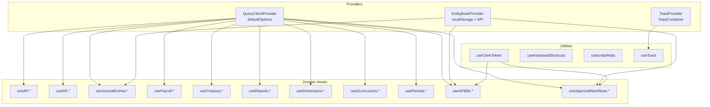

**Diagram sources**
- [QueryProvider.tsx](file://frontend/app/providers/QueryProvider.tsx#L6-L25)
- [EntityBookContext.tsx](file://frontend/contexts/EntityBookContext.tsx#L38-L157)
- [ToastContext.tsx](file://frontend/contexts/ToastContext.tsx#L46-L85)
- [useAP.ts](file://frontend/hooks/useAP.ts#L1-L294)
- [useAR.ts](file://frontend/hooks/useAR.ts#L1-L327)
- [useJournalEntries.ts](file://frontend/hooks/useJournalEntries.ts#L1-L202)
- [usePayroll.ts](file://frontend/hooks/usePayroll.ts#L1-L575)
- [useTreasury.ts](file://frontend/hooks/useTreasury.ts#L1-L354)
- [useReports.ts](file://frontend/hooks/useReports.ts#L1-L72)
- [useDimensions.ts](file://frontend/hooks/useDimensions.ts#L1-L125)
- [useGLAccounts.ts](file://frontend/hooks/useGLAccounts.ts#L1-L129)
- [usePeriods.ts](file://frontend/hooks/usePeriods.ts#L1-L141)
- [useAPBills.ts](file://frontend/hooks/useAPBills.ts#L1-L67)
- [useApprovalWorkflows.ts](file://frontend/hooks/useApprovalWorkflows.ts#L1-L546)
- [useClerkToken.ts](file://frontend/hooks/useClerkToken.ts#L1-L24)
- [useKeyboardShortcuts.ts](file://frontend/hooks/useKeyboardShortcuts.ts#L1-L159)
- [useUndoRedo.ts](file://frontend/hooks/useUndoRedo.ts#L1-L164)
- [useToast.ts](file://frontend/hooks/useToast.ts#L1-L76)

**Section sources**
- [QueryProvider.tsx](file://frontend/app/providers/QueryProvider.tsx#L1-L26)
- [EntityBookContext.tsx](file://frontend/contexts/EntityBookContext.tsx#L1-L158)
- [ToastContext.tsx](file://frontend/contexts/ToastContext.tsx#L1-L86)

## Core Components
- React Query client provider with default caching and retry policies
- EntityBook context for legal entity and book selection with persistence and API-driven refresh
- Toast context and hook for global notifications
- Domain hooks encapsulate CRUD and workflow operations with query keys and optimistic updates
- Utility hooks for authentication token propagation, keyboard shortcuts, and undo/redo

**Section sources**
- [QueryProvider.tsx](file://frontend/app/providers/QueryProvider.tsx#L6-L25)
- [EntityBookContext.tsx](file://frontend/contexts/EntityBookContext.tsx#L38-L157)
- [ToastContext.tsx](file://frontend/contexts/ToastContext.tsx#L46-L85)
- [useToast.ts](file://frontend/hooks/useToast.ts#L6-L75)

## Architecture Overview
The system uses React Query for centralized caching and invalidation, with domain hooks orchestrating optimistic updates and server-side synchronization. Contexts provide cross-cutting concerns like entity/book scoping and toast notifications. Approval workflows integrate with backend endpoints via Clerk tokens.

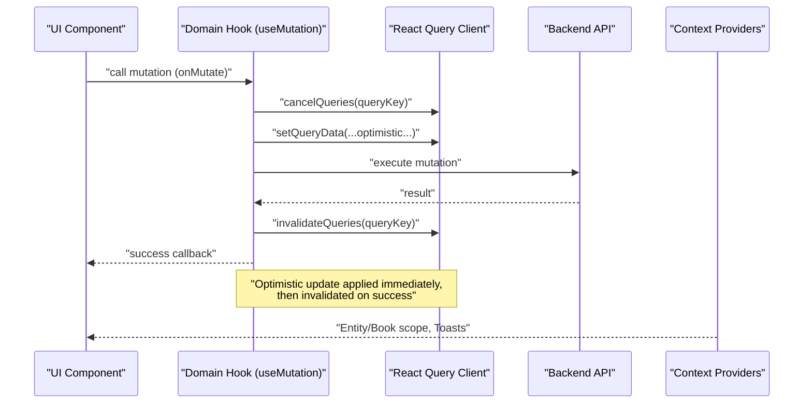

**Diagram sources**
- [useAP.ts](file://frontend/hooks/useAP.ts#L28-L59)
- [useAR.ts](file://frontend/hooks/useAR.ts#L29-L60)
- [useJournalEntries.ts](file://frontend/hooks/useJournalEntries.ts#L41-L79)
- [usePayroll.ts](file://frontend/hooks/usePayroll.ts#L41-L72)
- [useTreasury.ts](file://frontend/hooks/useTreasury.ts#L34-L65)
- [useReports.ts](file://frontend/hooks/useReports.ts#L1-L72)
- [useClerkToken.ts](file://frontend/hooks/useClerkToken.ts#L6-L23)
- [EntityBookContext.tsx](file://frontend/contexts/EntityBookContext.tsx#L38-L157)
- [ToastContext.tsx](file://frontend/contexts/ToastContext.tsx#L46-L85)

## Detailed Component Analysis

### React Query Integration and Patterns
- Default client options: disable refetch on window focus, retry once, cache for five minutes
- Query keys are arrays that encode parameters and resource identity
- Mutations use optimistic updates with onMutate to write temporary data, onError to rollback, and onSuccess to invalidate queries
- Some workflows use direct fetch with Clerk tokens for approval actions

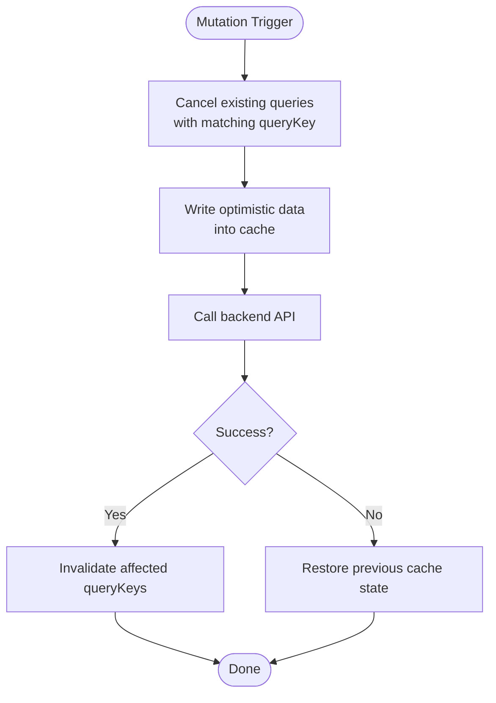

**Diagram sources**
- [useAP.ts](file://frontend/hooks/useAP.ts#L33-L58)
- [useAR.ts](file://frontend/hooks/useAR.ts#L67-L102)
- [useJournalEntries.ts](file://frontend/hooks/useJournalEntries.ts#L53-L78)
- [usePayroll.ts](file://frontend/hooks/usePayroll.ts#L46-L71)
- [useTreasury.ts](file://frontend/hooks/useTreasury.ts#L39-L64)
- [useApprovalWorkflows.ts](file://frontend/hooks/useApprovalWorkflows.ts#L18-L44)

**Section sources**
- [QueryProvider.tsx](file://frontend/app/providers/QueryProvider.tsx#L9-L17)
- [useAP.ts](file://frontend/hooks/useAP.ts#L13-L128)
- [useAR.ts](file://frontend/hooks/useAR.ts#L13-L129)
- [useJournalEntries.ts](file://frontend/hooks/useJournalEntries.ts#L41-L99)
- [usePayroll.ts](file://frontend/hooks/usePayroll.ts#L41-L141)
- [useTreasury.ts](file://frontend/hooks/useTreasury.ts#L34-L134)
- [useApprovalWorkflows.ts](file://frontend/hooks/useApprovalWorkflows.ts#L13-L546)

### AP Domain Hooks
- Vendors: list, detail, create, update, delete with optimistic updates and cache invalidation
- Invoices: list, detail, create, post with optimistic status transitions
- Payments: list, detail, create with optimistic updates
- Aging: query with parameters

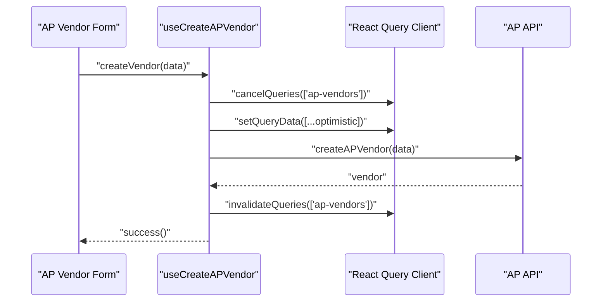

**Diagram sources**
- [useAP.ts](file://frontend/hooks/useAP.ts#L28-L59)

**Section sources**
- [useAP.ts](file://frontend/hooks/useAP.ts#L12-L128)
- [useAPBills.ts](file://frontend/hooks/useAPBills.ts#L8-L67)

### AR Domain Hooks
- Customers: list, detail, create, update, delete with optimistic updates
- Invoices: list, detail, create, post with optimistic status transitions
- Payments: list, detail, create with optimistic updates
- Revenue schedules: list, detail, recognize with cache invalidation
- Aging: query with parameters

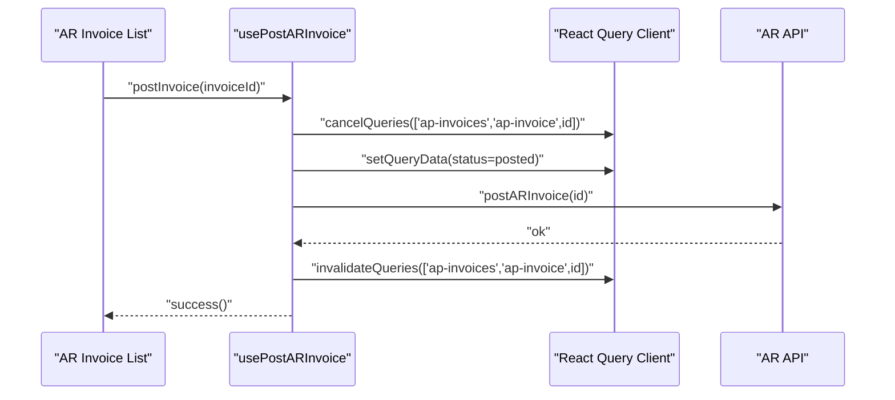

**Diagram sources**
- [useAR.ts](file://frontend/hooks/useAR.ts#L186-L226)

**Section sources**
- [useAR.ts](file://frontend/hooks/useAR.ts#L13-L327)

### Journal Entries Hooks
- List, detail, create, post, reverse with optimistic updates
- Bulk upsert lines and validation
- Uses EntityBook context for book-scoped queries

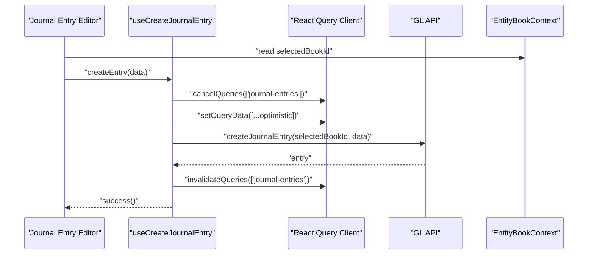

**Diagram sources**
- [useJournalEntries.ts](file://frontend/hooks/useJournalEntries.ts#L41-L79)
- [EntityBookContext.tsx](file://frontend/contexts/EntityBookContext.tsx#L12-L23)

**Section sources**
- [useJournalEntries.ts](file://frontend/hooks/useJournalEntries.ts#L5-L150)

### Payroll Hooks
- Employees, pay groups, pay components
- Payroll runs: create, calculate, approve, post with cache invalidation
- Commission and bonus plans
- Payment batches and payslips
- Bulk upsert adjustments and recalculation

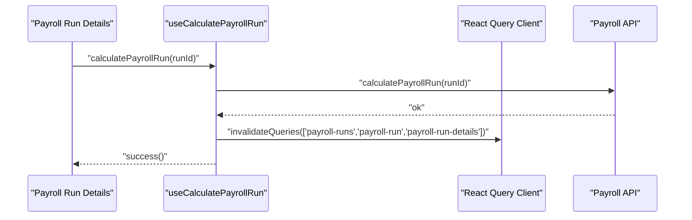

**Diagram sources**
- [usePayroll.ts](file://frontend/hooks/usePayroll.ts#L323-L333)

**Section sources**
- [usePayroll.ts](file://frontend/hooks/usePayroll.ts#L21-L575)

### Treasury Hooks
- Bank accounts: list, detail, create, update, delete with optimistic updates
- Bank transactions: list and import
- Transfers and FX conversions: list, detail, create with optimistic statuses
- Reconciliation: sessions, matches, auto-match, confirm, complete
- Cash position

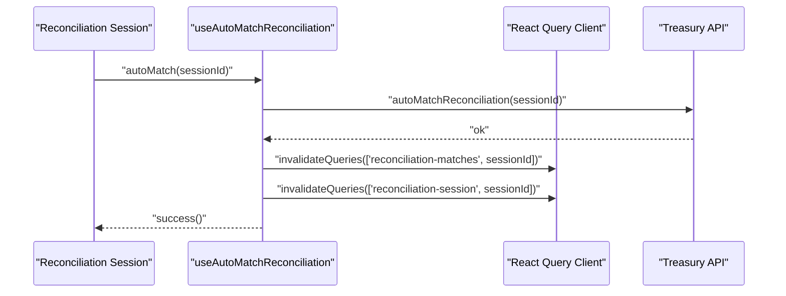

**Diagram sources**
- [useTreasury.ts](file://frontend/hooks/useTreasury.ts#L311-L320)

**Section sources**
- [useTreasury.ts](file://frontend/hooks/useTreasury.ts#L18-L354)

### Reporting Hooks
- Trial balance, P&L and balance sheet, cash flow, GL detail

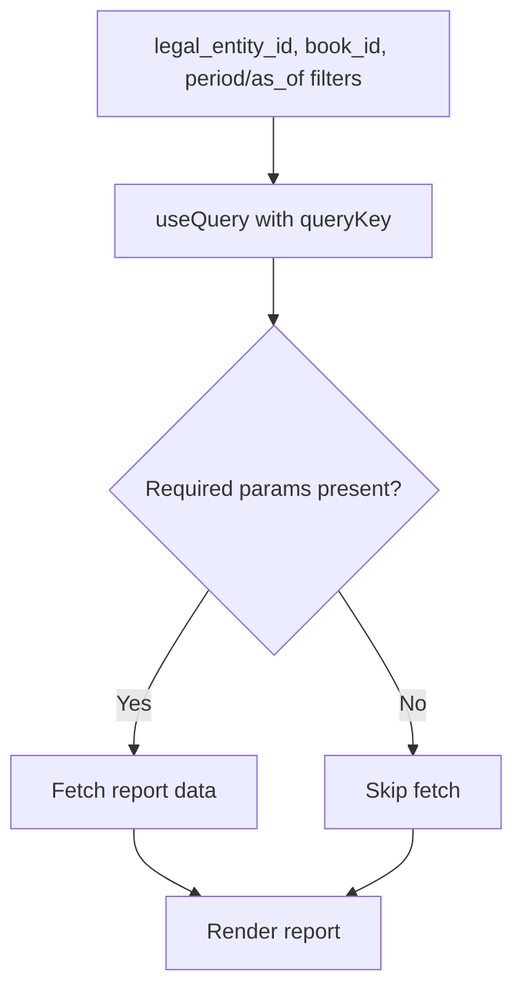

**Diagram sources**
- [useReports.ts](file://frontend/hooks/useReports.ts#L4-L72)

**Section sources**
- [useReports.ts](file://frontend/hooks/useReports.ts#L1-L72)

### Context Providers
- EntityBookContext: manages legal entities and books, persists selections, loads defaults, and exposes refresh methods
- ToastContext: global toast queue with typed messages and lifecycle

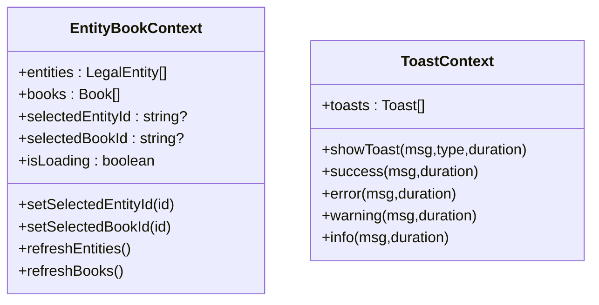

**Diagram sources**
- [EntityBookContext.tsx](file://frontend/contexts/EntityBookContext.tsx#L7-L19)
- [ToastContext.tsx](file://frontend/contexts/ToastContext.tsx#L15-L28)

**Section sources**
- [EntityBookContext.tsx](file://frontend/contexts/EntityBookContext.tsx#L38-L157)
- [ToastContext.tsx](file://frontend/contexts/ToastContext.tsx#L46-L85)

### Utility Hooks
- useClerkToken: synchronizes Clerk auth token to localStorage for API interceptors
- useKeyboardShortcuts: global keyboard shortcuts with configurable modifiers and actions
- useUndoRedo: grid-level undo/redo with bounded history

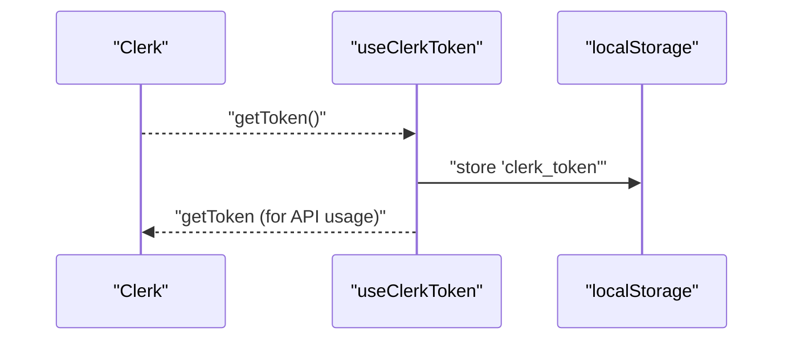

**Diagram sources**
- [useClerkToken.ts](file://frontend/hooks/useClerkToken.ts#L6-L23)

**Section sources**
- [useClerkToken.ts](file://frontend/hooks/useClerkToken.ts#L1-L24)
- [useKeyboardShortcuts.ts](file://frontend/hooks/useKeyboardShortcuts.ts#L33-L78)
- [useUndoRedo.ts](file://frontend/hooks/useUndoRedo.ts#L19-L130)

## Dependency Analysis
- Domain hooks depend on React Query for caching and invalidation
- Approval workflows depend on Clerk token hook and EntityBook context for book-scoped endpoints
- Journal entries and AP bills depend on EntityBook context for book scoping
- Toasts are consumed via useToast hook from ToastContext

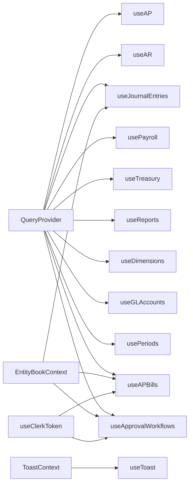

**Diagram sources**
- [QueryProvider.tsx](file://frontend/app/providers/QueryProvider.tsx#L6-L25)
- [useAP.ts](file://frontend/hooks/useAP.ts#L1-L20)
- [useAR.ts](file://frontend/hooks/useAR.ts#L1-L20)
- [useJournalEntries.ts](file://frontend/hooks/useJournalEntries.ts#L1-L20)
- [usePayroll.ts](file://frontend/hooks/usePayroll.ts#L1-L20)
- [useTreasury.ts](file://frontend/hooks/useTreasury.ts#L1-L20)
- [useReports.ts](file://frontend/hooks/useReports.ts#L1-L20)
- [useDimensions.ts](file://frontend/hooks/useDimensions.ts#L1-L20)
- [useGLAccounts.ts](file://frontend/hooks/useGLAccounts.ts#L1-L20)
- [usePeriods.ts](file://frontend/hooks/usePeriods.ts#L1-L20)
- [useAPBills.ts](file://frontend/hooks/useAPBills.ts#L1-L20)
- [useApprovalWorkflows.ts](file://frontend/hooks/useApprovalWorkflows.ts#L1-L20)
- [EntityBookContext.tsx](file://frontend/contexts/EntityBookContext.tsx#L38-L157)
- [useClerkToken.ts](file://frontend/hooks/useClerkToken.ts#L1-L24)
- [ToastContext.tsx](file://frontend/contexts/ToastContext.tsx#L46-L85)
- [useToast.ts](file://frontend/hooks/useToast.ts#L1-L76)

**Section sources**
- [useApprovalWorkflows.ts](file://frontend/hooks/useApprovalWorkflows.ts#L1-L546)
- [useAPBills.ts](file://frontend/hooks/useAPBills.ts#L1-L67)
- [useJournalEntries.ts](file://frontend/hooks/useJournalEntries.ts#L1-L202)
- [EntityBookContext.tsx](file://frontend/contexts/EntityBookContext.tsx#L38-L157)

## Performance Considerations
- Stale-time caching reduces redundant network requests for frequently accessed lists
- Retry-once balances resilience with avoiding thundering herds
- Optimitic updates improve perceived latency; ensure onError rollbacks are precise
- Prefer targeted invalidation over broad cache clears to minimize re-fetches
- For large grids, bound undo/redo history to avoid memory pressure

[No sources needed since this section provides general guidance]

## Troubleshooting Guide
- If optimistic updates appear inconsistent, verify that onMutate writes to the correct query keys and that onError restores the exact previous state snapshot
- If approvals fail, check that Clerk token is present and that the correct bookId is selected in EntityBook context
- If lists do not refresh after edits, ensure onSuccess invalidates the intended query keys
- If toasts do not show, verify ToastProvider wraps the app and useToast is called within the provider

**Section sources**
- [useAP.ts](file://frontend/hooks/useAP.ts#L49-L58)
- [useAR.ts](file://frontend/hooks/useAR.ts#L89-L102)
- [useJournalEntries.ts](file://frontend/hooks/useJournalEntries.ts#L137-L149)
- [useClerkToken.ts](file://frontend/hooks/useClerkToken.ts#L6-L23)
- [EntityBookContext.tsx](file://frontend/contexts/EntityBookContext.tsx#L38-L157)
- [ToastContext.tsx](file://frontend/contexts/ToastContext.tsx#L46-L85)
- [useToast.ts](file://frontend/hooks/useToast.ts#L6-L10)

## Conclusion
The frontend employs a consistent state management strategy centered on React Query for caching and synchronization, with domain-specific hooks that encapsulate optimistic updates and side effects. Contexts provide cross-cutting concerns for entity/book scoping and notifications. The patterns demonstrated here enable predictable, responsive financial workflows and offer a clear extension surface for new features.

[No sources needed since this section summarizes without analyzing specific files]

## Appendices

### Guidelines for Implementing New Hooks
- Define a stable queryKey array that encodes parameters and resource identity
- Use useQuery for reads; use useMutation for writes
- Implement onMutate for optimistic updates; cancelQueries first, then setQueryData with a temporary item
- Implement onError to restore previous cache state
- Implement onSuccess to invalidate related queries
- For book-scoped resources, read selectedBookId from EntityBookContext
- For approval workflows, propagate Clerk token via useClerkToken and call backend endpoints directly
- Keep hooks pure; delegate side effects to callbacks and context providers

**Section sources**
- [useAP.ts](file://frontend/hooks/useAP.ts#L13-L128)
- [useJournalEntries.ts](file://frontend/hooks/useJournalEntries.ts#L41-L99)
- [useApprovalWorkflows.ts](file://frontend/hooks/useApprovalWorkflows.ts#L13-L546)
- [EntityBookContext.tsx](file://frontend/contexts/EntityBookContext.tsx#L12-L23)
- [useClerkToken.ts](file://frontend/hooks/useClerkToken.ts#L6-L23)

### Managing Complex State Flows and Side Effects
- Use targeted invalidation to keep caches consistent
- For multi-resource updates (e.g., invoices and payments), invalidate both query keys in onSuccess
- For approval workflows, invalidate the specific resource and lists
- For grids, consider useUndoRedo to support user-initiated rollbacks

**Section sources**
- [usePayroll.ts](file://frontend/hooks/usePayroll.ts#L327-L333)
- [useTreasury.ts](file://frontend/hooks/useTreasury.ts#L315-L320)
- [useUndoRedo.ts](file://frontend/hooks/useUndoRedo.ts#L19-L130)

### Data Synchronization Patterns
- Optimistic writes followed by cache invalidation
- Conditional fetches gated by presence of required identifiers (e.g., bookId)
- Persistence of selections in localStorage with context refresh

**Section sources**
- [useJournalEntries.ts](file://frontend/hooks/useJournalEntries.ts#L15-L23)
- [EntityBookContext.tsx](file://frontend/contexts/EntityBookContext.tsx#L46-L52)
- [useReports.ts](file://frontend/hooks/useReports.ts#L10-L14)

### Extending State Management for New Features
- Add a new domain hook under frontend/hooks with queryKey, useQuery/useMutation, and optimistic updates
- Integrate with EntityBook context when book scoping is required
- Wrap the app with ToastProvider to enable global notifications
- For approval workflows, reuse useClerkToken and direct fetch patterns

**Section sources**
- [useApprovalWorkflows.ts](file://frontend/hooks/useApprovalWorkflows.ts#L13-L546)
- [ToastContext.tsx](file://frontend/contexts/ToastContext.tsx#L46-L85)
- [EntityBookContext.tsx](file://frontend/contexts/EntityBookContext.tsx#L38-L157)