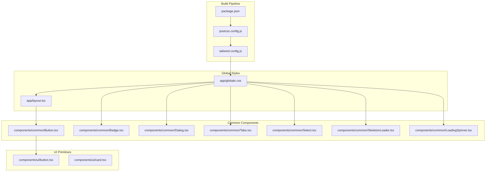
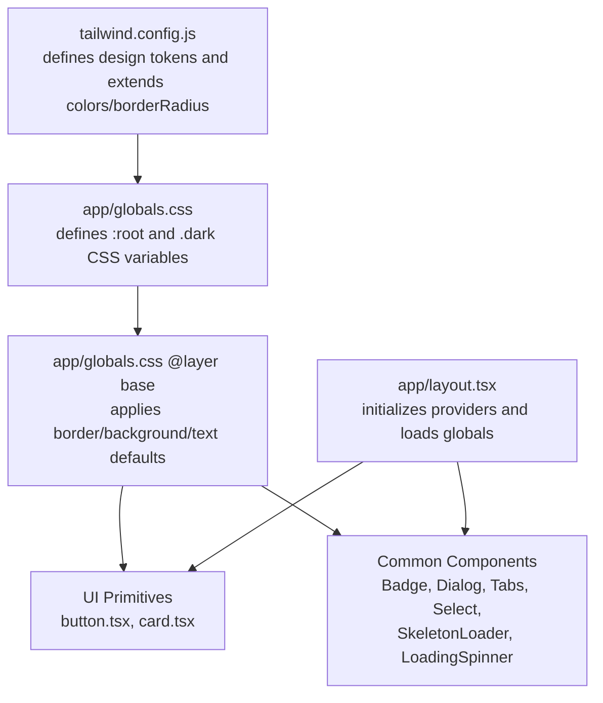
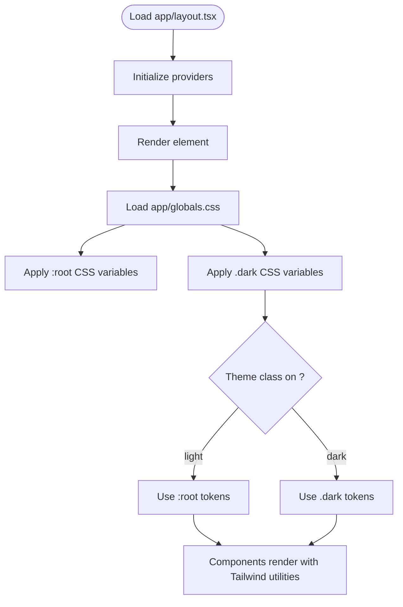
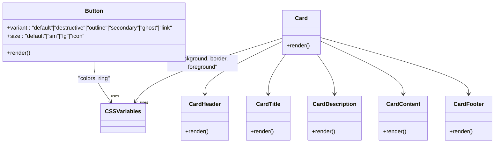
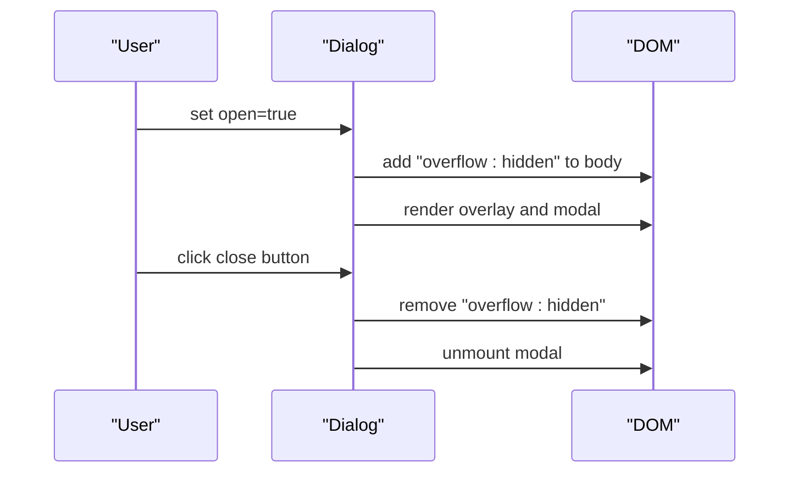
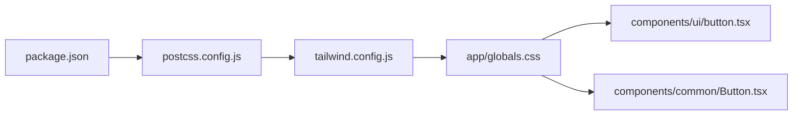

# Styling and Theming

<cite>
**Referenced Files in This Document**
- [tailwind.config.js](file://frontend/tailwind.config.js)
- [globals.css](file://frontend/app/globals.css)
- [layout.tsx](file://frontend/app/layout.tsx)
- [postcss.config.js](file://frontend/postcss.config.js)
- [package.json](file://frontend/package.json)
- [button.tsx](file://frontend/components/ui/button.tsx)
- [card.tsx](file://frontend/components/ui/card.tsx)
- [common/Button.tsx](file://frontend/components/common/Button.tsx)
- [common/Badge.tsx](file://frontend/components/common/Badge.tsx)
- [common/Dialog.tsx](file://frontend/components/common/Dialog.tsx)
- [common/Tabs.tsx](file://frontend/components/common/Tabs.tsx)
- [common/Select.tsx](file://frontend/components/common/Select.tsx)
- [common/SkeletonLoader.tsx](file://frontend/components/common/SkeletonLoader.tsx)
- [common/LoadingSpinner.tsx](file://frontend/components/common/LoadingSpinner.tsx)
</cite>

## Table of Contents
1. [Introduction](#introduction)
2. [Project Structure](#project-structure)
3. [Core Components](#core-components)
4. [Architecture Overview](#architecture-overview)
5. [Detailed Component Analysis](#detailed-component-analysis)
6. [Dependency Analysis](#dependency-analysis)
7. [Performance Considerations](#performance-considerations)
8. [Troubleshooting Guide](#troubleshooting-guide)
9. [Conclusion](#conclusion)

## Introduction
This document explains the styling and theming approach used in the frontend application. It covers Tailwind CSS configuration, the design system built from UI primitives and common components, dark/light theme support via CSS variables, and responsive design strategies. It also provides guidelines for maintaining design consistency, extending the design system, and implementing animations and loaders.

## Project Structure
The styling pipeline is organized around:
- Tailwind CSS configuration that defines design tokens and extends color palettes and border radius.
- Global CSS variables that define light and dark themes and apply base styles.
- UI primitives (button, card) and common components (Badge, Dialog, Tabs, Select, SkeletonLoader, LoadingSpinner) that consume Tailwind utilities and design tokens.
- PostCSS pipeline that compiles Tailwind and autoprefixes output.
- Next.js root layout that initializes providers and loads global styles.

**Diagram sources**
- [postcss.config.js](file://frontend/postcss.config.js#L1-L4)
- [tailwind.config.js](file://frontend/tailwind.config.js#L1-L59)
- [globals.css](file://frontend/app/globals.css#L1-L52)
- [layout.tsx](file://frontend/app/layout.tsx#L1-L37)
- [button.tsx](file://frontend/components/ui/button.tsx#L1-L40)
- [card.tsx](file://frontend/components/ui/card.tsx#L1-L55)
- [common/Button.tsx](file://frontend/components/common/Button.tsx#L1-L14)
- [common/Badge.tsx](file://frontend/components/common/Badge.tsx#L1-L31)
- [common/Dialog.tsx](file://frontend/components/common/Dialog.tsx#L1-L66)
- [common/Tabs.tsx](file://frontend/components/common/Tabs.tsx#L1-L103)
- [common/Select.tsx](file://frontend/components/common/Select.tsx#L1-L31)
- [common/SkeletonLoader.tsx](file://frontend/components/common/SkeletonLoader.tsx#L1-L54)
- [common/LoadingSpinner.tsx](file://frontend/components/common/LoadingSpinner.tsx#L1-L29)

**Section sources**
- [postcss.config.js](file://frontend/postcss.config.js#L1-L4)
- [tailwind.config.js](file://frontend/tailwind.config.js#L1-L59)
- [globals.css](file://frontend/app/globals.css#L1-L52)
- [layout.tsx](file://frontend/app/layout.tsx#L1-L37)

## Core Components
This section documents the foundational design system components and how they enforce consistent styling.

- Button primitive
  - Provides variants (default, destructive, outline, secondary, ghost, link) and sizes (default, sm, lg, icon).
  - Uses Tailwind utilities and CSS variables for colors and spacing.
  - Reference: [button.tsx](file://frontend/components/ui/button.tsx#L1-L40)

- Card primitive
  - Includes Card, CardHeader, CardTitle, CardDescription, CardContent, and CardFooter.
  - Applies background, border, and shadow tokens consistently.
  - Reference: [card.tsx](file://frontend/components/ui/card.tsx#L1-L55)

- Common Button wrapper
  - Thin wrapper around the UI Button that forwards props and className.
  - Reference: [common/Button.tsx](file://frontend/components/common/Button.tsx#L1-L14)

- Badge
  - Renders a small, pill-shaped indicator with variant-based coloring.
  - Reference: [common/Badge.tsx](file://frontend/components/common/Badge.tsx#L1-L31)

- Dialog
  - Modal dialog with backdrop, header, and content area; manages body scroll behavior.
  - Reference: [common/Dialog.tsx](file://frontend/components/common/Dialog.tsx#L1-L66)

- Tabs
  - Tabs provider/context with TabsList, TabsTrigger, and TabsContent.
  - Active/inactive states use background and foreground tokens.
  - Reference: [common/Tabs.tsx](file://frontend/components/common/Tabs.tsx#L1-L103)

- Select
  - Styled select element with focus ring and placeholder styling.
  - Reference: [common/Select.tsx](file://frontend/components/common/Select.tsx#L1-L31)

- SkeletonLoader and LoadingSpinner
  - SkeletonLoader uses pulse animation and gray backgrounds.
  - LoadingSpinner animates a spinning border with primary color.
  - References: [common/SkeletonLoader.tsx](file://frontend/components/common/SkeletonLoader.tsx#L1-L54), [common/LoadingSpinner.tsx](file://frontend/components/common/LoadingSpinner.tsx#L1-L29)

**Section sources**
- [button.tsx](file://frontend/components/ui/button.tsx#L1-L40)
- [card.tsx](file://frontend/components/ui/card.tsx#L1-L55)
- [common/Button.tsx](file://frontend/components/common/Button.tsx#L1-L14)
- [common/Badge.tsx](file://frontend/components/common/Badge.tsx#L1-L31)
- [common/Dialog.tsx](file://frontend/components/common/Dialog.tsx#L1-L66)
- [common/Tabs.tsx](file://frontend/components/common/Tabs.tsx#L1-L103)
- [common/Select.tsx](file://frontend/components/common/Select.tsx#L1-L31)
- [common/SkeletonLoader.tsx](file://frontend/components/common/SkeletonLoader.tsx#L1-L54)
- [common/LoadingSpinner.tsx](file://frontend/components/common/LoadingSpinner.tsx#L1-L29)

## Architecture Overview
The styling architecture centers on:
- Tailwind CSS generating utility classes from a centralized configuration.
- CSS variables in global styles defining theme tokens for light and dark modes.
- UI primitives encapsulating atomic styles and exposing consistent props.
- Common components composing primitives and adding behavior while preserving design consistency.

**Diagram sources**
- [tailwind.config.js](file://frontend/tailwind.config.js#L1-L59)
- [globals.css](file://frontend/app/globals.css#L1-L52)
- [layout.tsx](file://frontend/app/layout.tsx#L1-L37)
- [button.tsx](file://frontend/components/ui/button.tsx#L1-L40)
- [card.tsx](file://frontend/components/ui/card.tsx#L1-L55)
- [common/Badge.tsx](file://frontend/components/common/Badge.tsx#L1-L31)
- [common/Dialog.tsx](file://frontend/components/common/Dialog.tsx#L1-L66)
- [common/Tabs.tsx](file://frontend/components/common/Tabs.tsx#L1-L103)
- [common/Select.tsx](file://frontend/components/common/Select.tsx#L1-L31)
- [common/SkeletonLoader.tsx](file://frontend/components/common/SkeletonLoader.tsx#L1-L54)
- [common/LoadingSpinner.tsx](file://frontend/components/common/LoadingSpinner.tsx#L1-L29)

## Detailed Component Analysis

### Tailwind Configuration and Theme Tokens
- Dark mode strategy uses a class-based toggle on the html element.
- Content paths scan pages, components, app, and src for tree-shaking.
- Theme extends:
  - Container centering and padding with a max screen size.
  - Color palette mapped to CSS variables for background, foreground, primary, secondary, destructive, muted, accent, card, border, input, and ring.
  - Border radius mapped to a CSS variable with scaled values for lg, md, sm.
- Plugins array is empty, keeping the setup minimal.

**Section sources**
- [tailwind.config.js](file://frontend/tailwind.config.js#L1-L59)

### Global Styles and Dark/Light Theming
- Base layer applies border and text colors globally using CSS variables.
- Light theme variables are defined in :root.
- Dark theme variables are defined under .dark.
- Body inherits background and text colors from CSS variables.
- The class-based dark mode is toggled at the HTML element level; ensure your application sets the class on html to switch themes.

**Diagram sources**
- [layout.tsx](file://frontend/app/layout.tsx#L16-L36)
- [globals.css](file://frontend/app/globals.css#L5-L51)

**Section sources**
- [layout.tsx](file://frontend/app/layout.tsx#L1-L37)
- [globals.css](file://frontend/app/globals.css#L1-L52)

### UI Primitives: Button and Card
- Button
  - Accepts variant and size props; renders consistent paddings, heights, and colors using Tailwind utilities and CSS variables.
  - Focus states include ring and offset ring utilities.
- Card
  - Encapsulates a bordered, rounded container with card background and foreground tokens.
  - Provides semantic subcomponents for header, title, description, content, and footer.

**Diagram sources**
- [button.tsx](file://frontend/components/ui/button.tsx#L1-L40)
- [card.tsx](file://frontend/components/ui/card.tsx#L1-L55)

**Section sources**
- [button.tsx](file://frontend/components/ui/button.tsx#L1-L40)
- [card.tsx](file://frontend/components/ui/card.tsx#L1-L55)

### Common Components: Badge, Dialog, Tabs, Select, SkeletonLoader, LoadingSpinner
- Badge
  - Pill indicators with variant-based background and text colors.
- Dialog
  - Overlay backdrop and modal container; prevents body scroll when open; uses button primitive for close.
- Tabs
  - Provider/context pattern for controlled tab selection; active/inactive states styled with background and foreground tokens.
- Select
  - Styled native select with focus ring and placeholder styling.
- SkeletonLoader
  - Pulse animation with varying widths per line; includes table and card variants.
- LoadingSpinner
  - Spinning border with primary color and accessible label.

**Diagram sources**
- [common/Dialog.tsx](file://frontend/components/common/Dialog.tsx#L16-L65)

**Section sources**
- [common/Badge.tsx](file://frontend/components/common/Badge.tsx#L1-L31)
- [common/Dialog.tsx](file://frontend/components/common/Dialog.tsx#L1-L66)
- [common/Tabs.tsx](file://frontend/components/common/Tabs.tsx#L1-L103)
- [common/Select.tsx](file://frontend/components/common/Select.tsx#L1-L31)
- [common/SkeletonLoader.tsx](file://frontend/components/common/SkeletonLoader.tsx#L1-L54)
- [common/LoadingSpinner.tsx](file://frontend/components/common/LoadingSpinner.tsx#L1-L29)

## Dependency Analysis
- Build dependencies
  - Tailwind CSS and Autoprefixer are configured in PostCSS.
  - Tailwind is configured to scan pages, components, app, and src.
- Runtime dependencies
  - clsx and tailwind-merge are used in components to merge and deduplicate class names.
- Theme and tokens
  - CSS variables in globals.css feed Tailwind color utilities and border radius utilities.

**Diagram sources**
- [package.json](file://frontend/package.json#L1-L55)
- [postcss.config.js](file://frontend/postcss.config.js#L1-L4)
- [tailwind.config.js](file://frontend/tailwind.config.js#L1-L59)
- [globals.css](file://frontend/app/globals.css#L1-L52)
- [button.tsx](file://frontend/components/ui/button.tsx#L1-L40)
- [common/Button.tsx](file://frontend/components/common/Button.tsx#L1-L14)

**Section sources**
- [package.json](file://frontend/package.json#L1-L55)
- [postcss.config.js](file://frontend/postcss.config.js#L1-L4)
- [tailwind.config.js](file://frontend/tailwind.config.js#L1-L59)
- [globals.css](file://frontend/app/globals.css#L1-L52)
- [button.tsx](file://frontend/components/ui/button.tsx#L1-L40)
- [common/Button.tsx](file://frontend/components/common/Button.tsx#L1-L14)

## Performance Considerations
- Keep Tailwind content globs scoped to reduce CSS size.
- Prefer CSS variables for theme tokens to minimize repeated utility classes.
- Use clsx and tailwind-merge to avoid redundant classes and improve runtime class composition.
- Limit heavy animations; SkeletonLoader and LoadingSpinner are lightweight but avoid excessive nested animations.

## Troubleshooting Guide
- Theme not switching
  - Ensure the class-based dark mode is toggled on the html element.
  - Verify .dark variables are present and applied in globals.css.
  - Confirm Tailwind darkMode setting is configured to class.
- Colors look incorrect
  - Check that variant and size props are passed correctly to UI primitives.
  - Ensure CSS variables resolve to expected HSL values in light/dark modes.
- Dialog scroll issue
  - Confirm Dialog sets body overflow to hidden when open and restores it on close/unmount.
- Focus rings not visible
  - Verify focus utilities are included in component classes and that ring color tokens are defined.

**Section sources**
- [globals.css](file://frontend/app/globals.css#L25-L41)
- [tailwind.config.js](file://frontend/tailwind.config.js#L3-L3)
- [common/Dialog.tsx](file://frontend/components/common/Dialog.tsx#L17-L26)
- [button.tsx](file://frontend/components/ui/button.tsx#L14-L14)

## Conclusion
The frontend employs a clean, maintainable styling approach:
- Tailwind CSS with a class-based dark mode and CSS variable-driven tokens.
- A small set of UI primitives and common components that consistently apply design tokens.
- A PostCSS pipeline that compiles Tailwind and autoprefixes output.
Follow the guidelines to keep design consistency, extend the design system thoughtfully, and implement responsive and animated components with confidence.