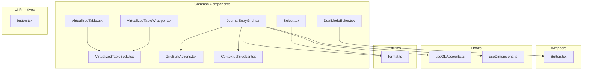
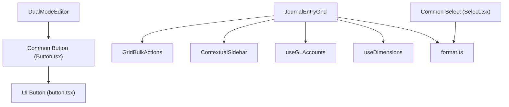
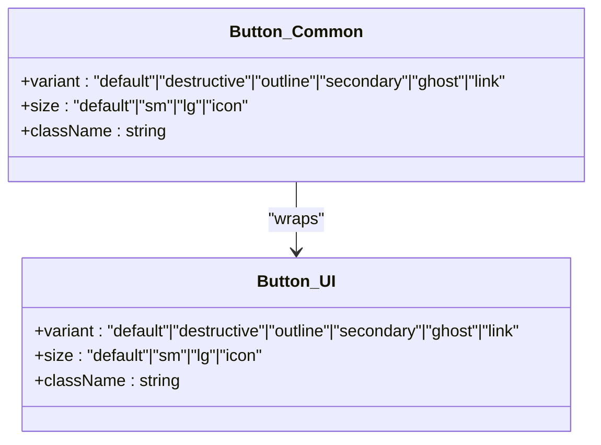
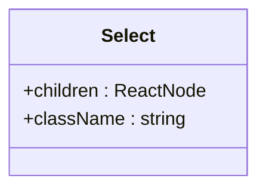
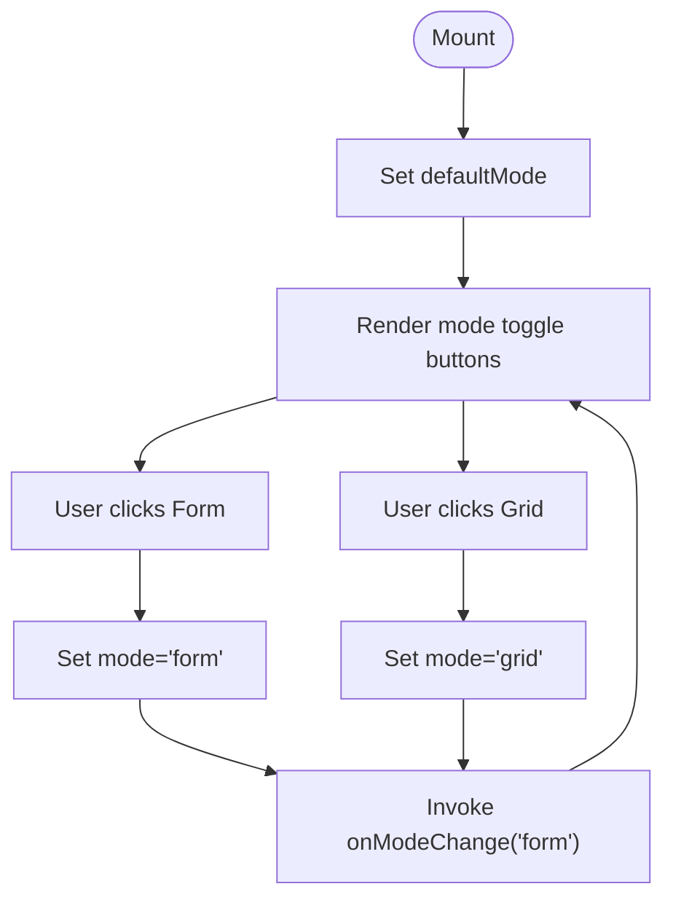
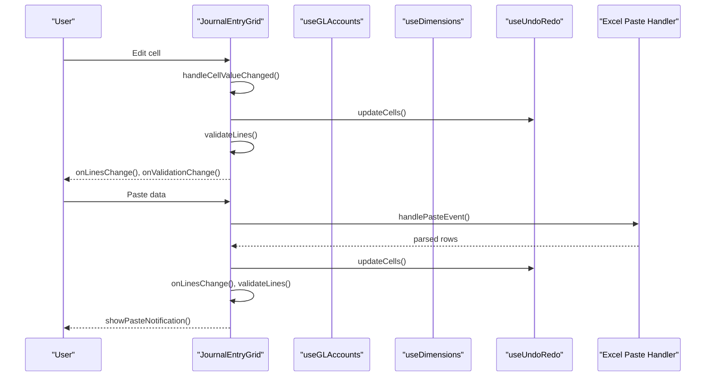
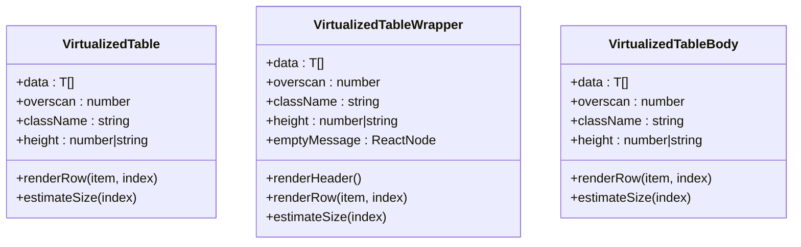
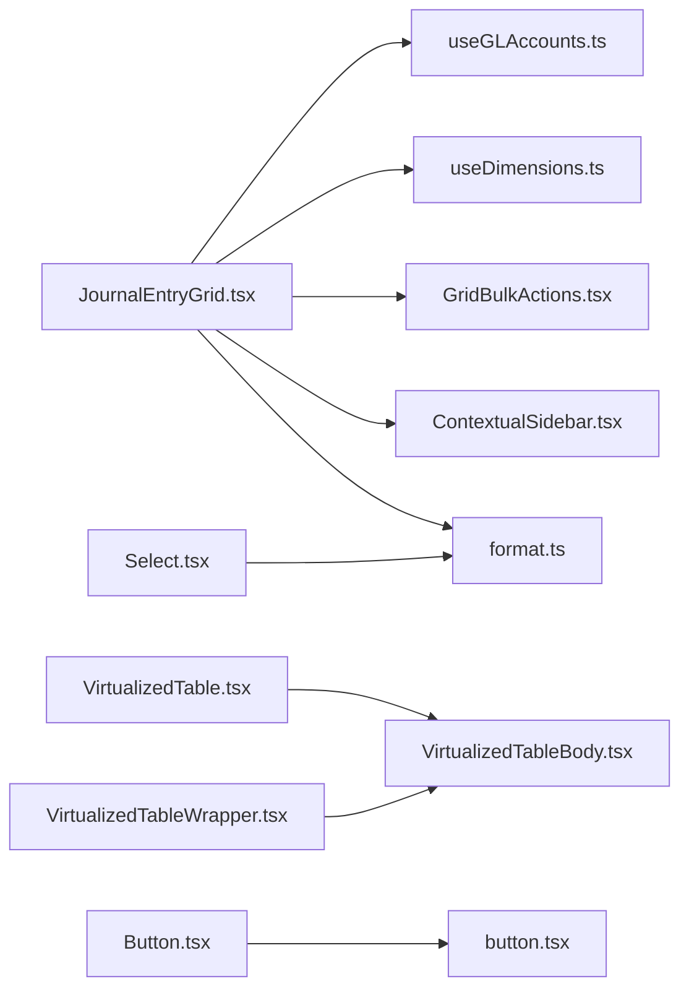

# UI Components

<cite>
**Referenced Files in This Document**
- [Button.tsx](file://frontend/components/common/Button.tsx)
- [Select.tsx](file://frontend/components/common/Select.tsx)
- [DualModeEditor.tsx](file://frontend/components/common/DualModeEditor.tsx)
- [JournalEntryGrid.tsx](file://frontend/components/common/JournalEntryGrid.tsx)
- [VirtualizedTable.tsx](file://frontend/components/common/VirtualizedTable.tsx)
- [VirtualizedTableWrapper.tsx](file://frontend/components/common/VirtualizedTableWrapper.tsx)
- [VirtualizedTableBody.tsx](file://frontend/components/common/VirtualizedTableBody.tsx)
- [GridBulkActions.tsx](file://frontend/components/common/GridBulkActions.tsx)
- [ContextualSidebar.tsx](file://frontend/components/common/ContextualSidebar.tsx)
- [button.tsx](file://frontend/components/ui/button.tsx)
- [useGLAccounts.ts](file://frontend/hooks/useGLAccounts.ts)
- [useDimensions.ts](file://frontend/hooks/useDimensions.ts)
- [format.ts](file://frontend/lib/utils/format.ts)
- [page.tsx](file://frontend/app/(dashboard)/journal-entries/page.tsx)
</cite>

## Table of Contents
1. [Introduction](#introduction)
2. [Project Structure](#project-structure)
3. [Core Components](#core-components)
4. [Architecture Overview](#architecture-overview)
5. [Detailed Component Analysis](#detailed-component-analysis)
6. [Dependency Analysis](#dependency-analysis)
7. [Performance Considerations](#performance-considerations)
8. [Troubleshooting Guide](#troubleshooting-guide)
9. [Conclusion](#conclusion)
10. [Appendices](#appendices)

## Introduction
This document describes the UI component library and common components used across the financial management application. It focuses on reusable components including Button, Select, DualModeEditor, JournalEntryGrid, and VirtualizedTable. For each component, we explain props, customization options, usage patterns, composition guidelines, styling approaches, accessibility compliance, and integration patterns. We also provide guidance on extending components for specific business requirements.

## Project Structure
The UI components are organized under frontend/components/common and frontend/components/ui. Common components encapsulate business UI patterns (e.g., dual-mode editors, grids, virtualized tables), while ui components provide low-level primitives (e.g., Button) that other components compose.

**Diagram sources**
- [Button.tsx](file://frontend/components/common/Button.tsx#L1-L14)
- [Select.tsx](file://frontend/components/common/Select.tsx#L1-L31)
- [DualModeEditor.tsx](file://frontend/components/common/DualModeEditor.tsx#L1-L69)
- [JournalEntryGrid.tsx](file://frontend/components/common/JournalEntryGrid.tsx#L1-L703)
- [VirtualizedTable.tsx](file://frontend/components/common/VirtualizedTable.tsx#L1-L68)
- [VirtualizedTableWrapper.tsx](file://frontend/components/common/VirtualizedTableWrapper.tsx#L1-L95)
- [VirtualizedTableBody.tsx](file://frontend/components/common/VirtualizedTableBody.tsx#L1-L81)
- [GridBulkActions.tsx](file://frontend/components/common/GridBulkActions.tsx#L1-L128)
- [ContextualSidebar.tsx](file://frontend/components/common/ContextualSidebar.tsx#L1-L75)
- [button.tsx](file://frontend/components/ui/button.tsx#L1-L40)
- [useGLAccounts.ts](file://frontend/hooks/useGLAccounts.ts#L1-L129)
- [useDimensions.ts](file://frontend/hooks/useDimensions.ts#L1-L125)
- [format.ts](file://frontend/lib/utils/format.ts#L1-L36)

**Section sources**
- [Button.tsx](file://frontend/components/common/Button.tsx#L1-L14)
- [Select.tsx](file://frontend/components/common/Select.tsx#L1-L31)
- [DualModeEditor.tsx](file://frontend/components/common/DualModeEditor.tsx#L1-L69)
- [JournalEntryGrid.tsx](file://frontend/components/common/JournalEntryGrid.tsx#L1-L703)
- [VirtualizedTable.tsx](file://frontend/components/common/VirtualizedTable.tsx#L1-L68)
- [VirtualizedTableWrapper.tsx](file://frontend/components/common/VirtualizedTableWrapper.tsx#L1-L95)
- [VirtualizedTableBody.tsx](file://frontend/components/common/VirtualizedTableBody.tsx#L1-L81)
- [GridBulkActions.tsx](file://frontend/components/common/GridBulkActions.tsx#L1-L128)
- [ContextualSidebar.tsx](file://frontend/components/common/ContextualSidebar.tsx#L1-L75)
- [button.tsx](file://frontend/components/ui/button.tsx#L1-L40)
- [useGLAccounts.ts](file://frontend/hooks/useGLAccounts.ts#L1-L129)
- [useDimensions.ts](file://frontend/hooks/useDimensions.ts#L1-L125)
- [format.ts](file://frontend/lib/utils/format.ts#L1-L36)

## Core Components
This section summarizes the primary components and their responsibilities.

- Button: A wrapper around the UI primitive button with consistent variants and sizes.
- Select: A styled native select element with consistent focus and disabled states.
- DualModeEditor: A container that toggles between form and grid editing modes.
- JournalEntryGrid: An advanced spreadsheet-like grid for journal entries with validation, copy/paste, undo/redo, and bulk actions.
- VirtualizedTable family: Virtualization primitives for large datasets, including a minimal virtualized table, a wrapper with sticky header, and a virtualized tbody.

**Section sources**
- [Button.tsx](file://frontend/components/common/Button.tsx#L1-L14)
- [Select.tsx](file://frontend/components/common/Select.tsx#L1-L31)
- [DualModeEditor.tsx](file://frontend/components/common/DualModeEditor.tsx#L1-L69)
- [JournalEntryGrid.tsx](file://frontend/components/common/JournalEntryGrid.tsx#L1-L703)
- [VirtualizedTable.tsx](file://frontend/components/common/VirtualizedTable.tsx#L1-L68)
- [VirtualizedTableWrapper.tsx](file://frontend/components/common/VirtualizedTableWrapper.tsx#L1-L95)
- [VirtualizedTableBody.tsx](file://frontend/components/common/VirtualizedTableBody.tsx#L1-L81)

## Architecture Overview
The common components build on UI primitives and shared hooks/utilities. JournalEntryGrid integrates with domain-specific hooks for GL accounts and dimensions, and uses a grid library for spreadsheet-like behavior. VirtualizedTable components rely on a virtualization library to efficiently render large lists.

**Diagram sources**
- [button.tsx](file://frontend/components/ui/button.tsx#L1-L40)
- [Button.tsx](file://frontend/components/common/Button.tsx#L1-L14)
- [Select.tsx](file://frontend/components/common/Select.tsx#L1-L31)
- [DualModeEditor.tsx](file://frontend/components/common/DualModeEditor.tsx#L1-L69)
- [JournalEntryGrid.tsx](file://frontend/components/common/JournalEntryGrid.tsx#L1-L703)
- [GridBulkActions.tsx](file://frontend/components/common/GridBulkActions.tsx#L1-L128)
- [ContextualSidebar.tsx](file://frontend/components/common/ContextualSidebar.tsx#L1-L75)
- [useGLAccounts.ts](file://frontend/hooks/useGLAccounts.ts#L1-L129)
- [useDimensions.ts](file://frontend/hooks/useDimensions.ts#L1-L125)
- [format.ts](file://frontend/lib/utils/format.ts#L1-L36)

## Detailed Component Analysis

### Button
- Purpose: Provides a consistent button across the application with variants and sizes aligned to the design system.
- Props:
  - variant: One of default, destructive, outline, secondary, ghost, link.
  - size: One of default, sm, lg, icon.
  - Additional button attributes supported via inherited HTML attributes.
- Composition: Wraps the UI primitive button and forwards className and other props.
- Accessibility: Inherits standard button semantics; ensure labels are descriptive.
- Styling: Uses design tokens for colors and spacing; variants and sizes are mutually exclusive.

**Diagram sources**
- [Button.tsx](file://frontend/components/common/Button.tsx#L6-L13)
- [button.tsx](file://frontend/components/ui/button.tsx#L4-L36)

**Section sources**
- [Button.tsx](file://frontend/components/common/Button.tsx#L1-L14)
- [button.tsx](file://frontend/components/ui/button.tsx#L1-L40)

### Select
- Purpose: Styled native select element with consistent focus, disabled, and placeholder states.
- Props:
  - children: React nodes for option elements.
  - Additional select attributes supported via inherited HTML attributes.
- Accessibility: Use option elements; ensure labels and values are meaningful.
- Styling: Applies consistent border, padding, focus ring, and disabled opacity.

**Diagram sources**
- [Select.tsx](file://frontend/components/common/Select.tsx#L6-L29)

**Section sources**
- [Select.tsx](file://frontend/components/common/Select.tsx#L1-L31)

### DualModeEditor
- Purpose: Toggle between guided form mode and spreadsheet-style grid mode for data entry.
- Props:
  - formMode: React node for the form UI.
  - gridMode: React node for the grid UI.
  - defaultMode: Initial mode ('form' | 'grid').
  - onModeChange: Callback invoked when mode changes.
  - className: Optional wrapper class.
- Behavior: Maintains internal mode state and exposes toggle buttons with icons and labels.
- Accessibility: Buttons include aria-labels for screen readers.

**Diagram sources**
- [DualModeEditor.tsx](file://frontend/components/common/DualModeEditor.tsx#L19-L31)

**Section sources**
- [DualModeEditor.tsx](file://frontend/components/common/DualModeEditor.tsx#L1-L69)

### JournalEntryGrid
- Purpose: Excel-like grid for journal entry lines with validation, copy/paste, undo/redo, and bulk actions.
- Props:
  - lines: Array of journal line objects with typed fields.
  - onLinesChange: Callback receiving updated lines.
  - onValidationChange: Optional callback receiving validity and errors.
  - legalEntityId, bookId: Context for data fetching.
  - defaultCurrency: Currency for formatting.
  - className: Wrapper class.
- Data model (JournalLine):
  - account_code, account_name, description, debit_amount, credit_amount, currency, fx_rate, cost_center, department, location, project, customer_id, vendor_id, tax_code, _errors.
- Features:
  - Column definitions with editors and renderers for accounts and dimensions.
  - Inline validation per line and total balance check.
  - Copy/paste handling with targeted updates and undo/redo integration.
  - Keyboard shortcuts (fill down), undo/redo, add/delete rows.
  - Contextual sidebar for selected row details.
  - Bulk actions toolbar for applying dimensions/accounts to selected rows.
- Hooks and utilities:
  - useGLAccounts and useDimensions for dropdown options.
  - useUndoRedo and useUndoRedoKeyboard for state management.
  - formatCurrency for display.
- Accessibility:
  - Grid uses proper roles and labels.
  - Error cells highlighted with accessible styling.
  - Tooltips for validation messages.

**Diagram sources**
- [JournalEntryGrid.tsx](file://frontend/components/common/JournalEntryGrid.tsx#L219-L271)
- [JournalEntryGrid.tsx](file://frontend/components/common/JournalEntryGrid.tsx#L274-L312)
- [JournalEntryGrid.tsx](file://frontend/components/common/JournalEntryGrid.tsx#L315-L374)
- [useGLAccounts.ts](file://frontend/hooks/useGLAccounts.ts#L1-L129)
- [useDimensions.ts](file://frontend/hooks/useDimensions.ts#L1-L125)

**Section sources**
- [JournalEntryGrid.tsx](file://frontend/components/common/JournalEntryGrid.tsx#L1-L703)
- [GridBulkActions.tsx](file://frontend/components/common/GridBulkActions.tsx#L1-L128)
- [ContextualSidebar.tsx](file://frontend/components/common/ContextualSidebar.tsx#L1-L75)
- [useGLAccounts.ts](file://frontend/hooks/useGLAccounts.ts#L1-L129)
- [useDimensions.ts](file://frontend/hooks/useDimensions.ts#L1-L125)
- [format.ts](file://frontend/lib/utils/format.ts#L1-L36)

### VirtualizedTable Family
- VirtualizedTable: Minimal virtualized table container with a renderRow function and optional sizing/overscan.
- VirtualizedTableWrapper: Complete table with sticky header and virtualized body; useful for replacing entire tables.
- VirtualizedTableBody: Virtualized tbody replacement for existing tables.
- Props (all):
  - data: Array of items.
  - renderRow: Function rendering a single row.
  - estimateSize: Optional function returning row height.
  - overscan: Number of rows to render outside viewport.
  - className: Container class.
  - height: Container height (number or string).
  - emptyMessage: Optional message when data is empty (wrapper).
- Accessibility:
  - Root container has role="table".
  - Rows have role="row" and aria-rowindex.
  - Body container has role="presentation".

**Diagram sources**
- [VirtualizedTable.tsx](file://frontend/components/common/VirtualizedTable.tsx#L6-L22)
- [VirtualizedTableWrapper.tsx](file://frontend/components/common/VirtualizedTableWrapper.tsx#L6-L30)
- [VirtualizedTableBody.tsx](file://frontend/components/common/VirtualizedTableBody.tsx#L6-L32)

**Section sources**
- [VirtualizedTable.tsx](file://frontend/components/common/VirtualizedTable.tsx#L1-L68)
- [VirtualizedTableWrapper.tsx](file://frontend/components/common/VirtualizedTableWrapper.tsx#L1-L95)
- [VirtualizedTableBody.tsx](file://frontend/components/common/VirtualizedTableBody.tsx#L1-L81)

## Dependency Analysis
- JournalEntryGrid depends on:
  - Domain hooks (useGLAccounts, useDimensions) for dropdown options.
  - Undo/redo hooks for state management.
  - Formatting utilities for currency display.
  - Shared components (GridBulkActions, ContextualSidebar).
- VirtualizedTable components depend on a virtualization library and expose a simple API for rendering large lists.
- Button and Select wrap UI primitives and forward props, maintaining loose coupling.

**Diagram sources**
- [JournalEntryGrid.tsx](file://frontend/components/common/JournalEntryGrid.tsx#L1-L703)
- [useGLAccounts.ts](file://frontend/hooks/useGLAccounts.ts#L1-L129)
- [useDimensions.ts](file://frontend/hooks/useDimensions.ts#L1-L125)
- [GridBulkActions.tsx](file://frontend/components/common/GridBulkActions.tsx#L1-L128)
- [ContextualSidebar.tsx](file://frontend/components/common/ContextualSidebar.tsx#L1-L75)
- [format.ts](file://frontend/lib/utils/format.ts#L1-L36)
- [VirtualizedTable.tsx](file://frontend/components/common/VirtualizedTable.tsx#L1-L68)
- [VirtualizedTableBody.tsx](file://frontend/components/common/VirtualizedTableBody.tsx#L1-L81)
- [VirtualizedTableWrapper.tsx](file://frontend/components/common/VirtualizedTableWrapper.tsx#L1-L95)
- [Button.tsx](file://frontend/components/common/Button.tsx#L1-L14)
- [button.tsx](file://frontend/components/ui/button.tsx#L1-L40)
- [Select.tsx](file://frontend/components/common/Select.tsx#L1-L31)

**Section sources**
- [JournalEntryGrid.tsx](file://frontend/components/common/JournalEntryGrid.tsx#L1-L703)
- [VirtualizedTable.tsx](file://frontend/components/common/VirtualizedTable.tsx#L1-L68)
- [VirtualizedTableWrapper.tsx](file://frontend/components/common/VirtualizedTableWrapper.tsx#L1-L95)
- [VirtualizedTableBody.tsx](file://frontend/components/common/VirtualizedTableBody.tsx#L1-L81)
- [Button.tsx](file://frontend/components/common/Button.tsx#L1-L14)
- [Select.tsx](file://frontend/components/common/Select.tsx#L1-L31)
- [useGLAccounts.ts](file://frontend/hooks/useGLAccounts.ts#L1-L129)
- [useDimensions.ts](file://frontend/hooks/useDimensions.ts#L1-L125)
- [format.ts](file://frontend/lib/utils/format.ts#L1-L36)

## Performance Considerations
- Virtualization:
  - Prefer VirtualizedTable or VirtualizedTableWrapper for large datasets to avoid rendering overhead.
  - Tune estimateSize and overscan to balance smoothness and memory usage.
- Grid:
  - JournalEntryGrid uses virtualization internally for rows; keep column counts reasonable and avoid excessive re-renders by updating only changed cells.
  - Use memoized column definitions and value formatters.
- Formatting:
  - Currency formatting is delegated to a utility; cache results when appropriate in higher-level components.
- Event handling:
  - Debounce or batch updates for frequent events (e.g., paste) to minimize re-renders.

[No sources needed since this section provides general guidance]

## Troubleshooting Guide
- Button/Select not responding:
  - Verify forwarded props and className are applied correctly; ensure no conflicting styles override pointer-events or opacity.
- JournalEntryGrid validation errors:
  - Check that onValidationChange receives expected arguments and that _errors are populated on lines.
  - Confirm accounts/dimensions hooks return data before grid initialization.
- Copy/paste issues:
  - Ensure clipboard event handlers are attached and parsed data matches column order.
  - Verify undo/redo integration applies updates consistently.
- VirtualizedTable not scrolling:
  - Confirm height is set and parent container has overflow hidden/auto.
  - Ensure estimateSize returns realistic heights.

**Section sources**
- [JournalEntryGrid.tsx](file://frontend/components/common/JournalEntryGrid.tsx#L315-L374)
- [JournalEntryGrid.tsx](file://frontend/components/common/JournalEntryGrid.tsx#L219-L271)
- [VirtualizedTable.tsx](file://frontend/components/common/VirtualizedTable.tsx#L25-L30)

## Conclusion
The UI component library provides consistent, accessible, and performant building blocks for financial workflows. Components like JournalEntryGrid integrate domain logic and user-friendly features, while VirtualizedTable components enable efficient rendering of large datasets. By composing these components thoughtfully and following the guidelines here, teams can implement robust, maintainable interfaces.

[No sources needed since this section summarizes without analyzing specific files]

## Appendices

### Usage Patterns and Examples
- Button:
  - Use variant and size to match context (e.g., destructive for delete actions).
  - Forward className for layout adjustments.
- Select:
  - Populate options dynamically using domain hooks or static lists.
  - Combine with forms and validation.
- DualModeEditor:
  - Pair formMode with guided forms and gridMode with spreadsheet-style editing.
  - Use onModeChange to synchronize external state.
- JournalEntryGrid:
  - Bind lines and onLinesChange to form state.
  - Integrate validation feedback and totals display.
  - Use GridBulkActions and ContextualSidebar for enhanced UX.
- VirtualizedTable:
  - Replace large tables with VirtualizedTableWrapper for sticky headers.
  - Use VirtualizedTableBody inside existing tables to virtualize the body.

**Section sources**
- [Button.tsx](file://frontend/components/common/Button.tsx#L1-L14)
- [Select.tsx](file://frontend/components/common/Select.tsx#L1-L31)
- [DualModeEditor.tsx](file://frontend/components/common/DualModeEditor.tsx#L1-L69)
- [JournalEntryGrid.tsx](file://frontend/components/common/JournalEntryGrid.tsx#L1-L703)
- [VirtualizedTableWrapper.tsx](file://frontend/components/common/VirtualizedTableWrapper.tsx#L1-L95)
- [VirtualizedTableBody.tsx](file://frontend/components/common/VirtualizedTableBody.tsx#L1-L81)

### Accessibility Checklist
- Buttons and links:
  - Provide descriptive labels; ensure focus visibility and keyboard operability.
- Forms and selects:
  - Associate labels with controls; manage disabled states.
- Grids:
  - Use roles and aria-* attributes; ensure tooltips and error indicators are announced.
- Virtualized lists:
  - Maintain semantic roles; ensure screen readers announce row indices and counts.

**Section sources**
- [button.tsx](file://frontend/components/ui/button.tsx#L1-L40)
- [Select.tsx](file://frontend/components/common/Select.tsx#L1-L31)
- [JournalEntryGrid.tsx](file://frontend/components/common/JournalEntryGrid.tsx#L568-L600)
- [VirtualizedTable.tsx](file://frontend/components/common/VirtualizedTable.tsx#L37-L60)

### Integration Patterns
- Page-level integration:
  - Example page imports a dedicated page component and initializes authentication hooks before rendering.
- Component composition:
  - Wrap UI primitives with common components to enforce design consistency.
  - Compose common components to build complex forms and grids.

**Section sources**
- [page.tsx](file://frontend/app/(dashboard)/journal-entries/page.tsx#L1-L10)