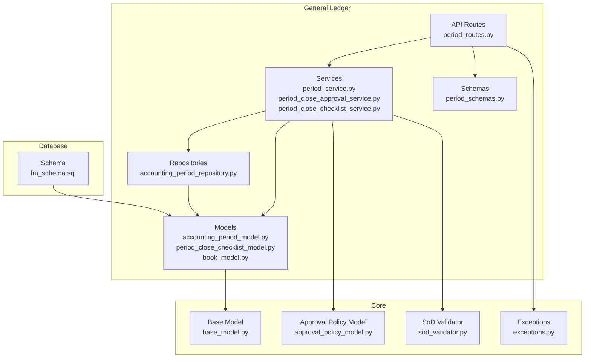
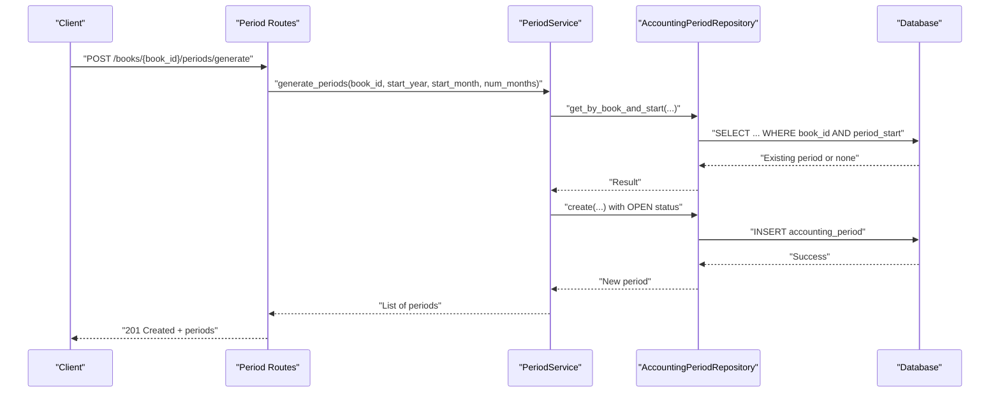
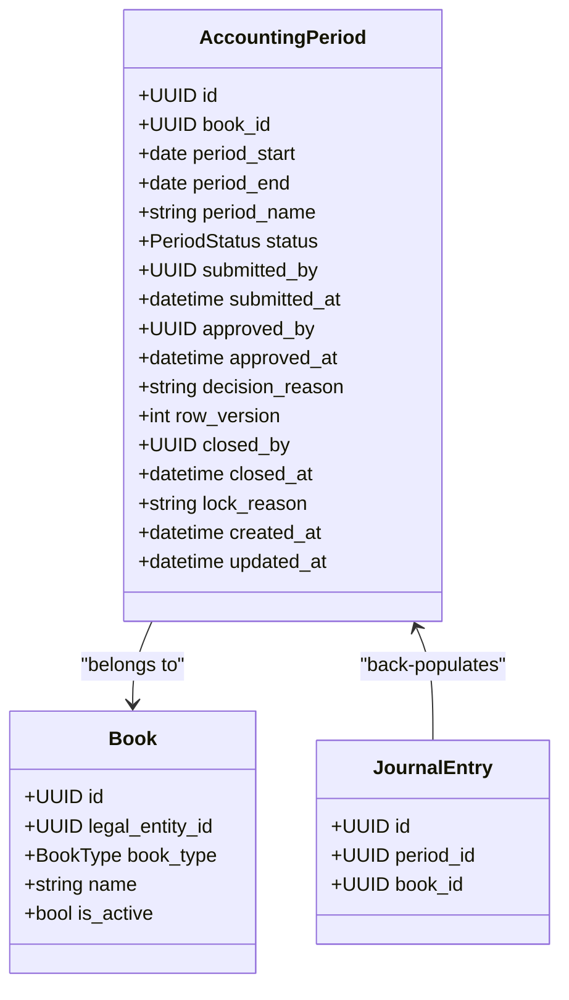
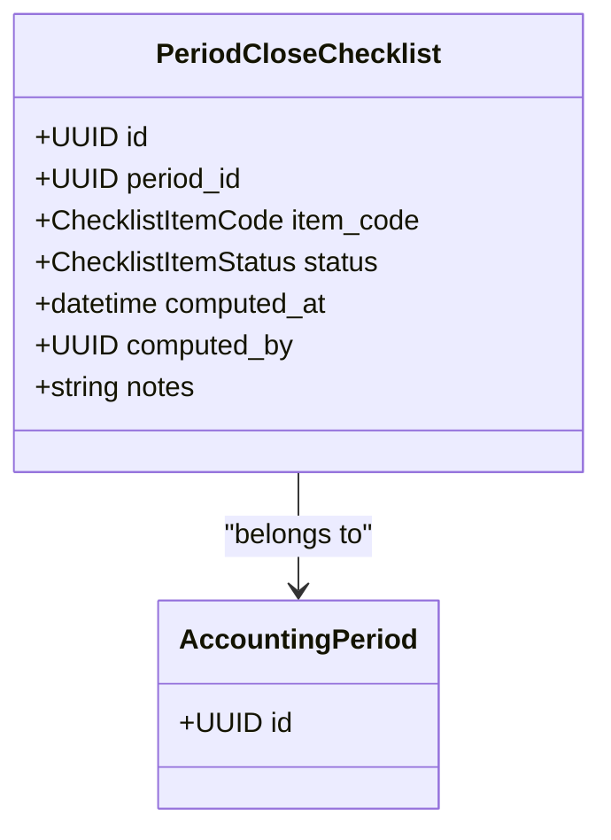
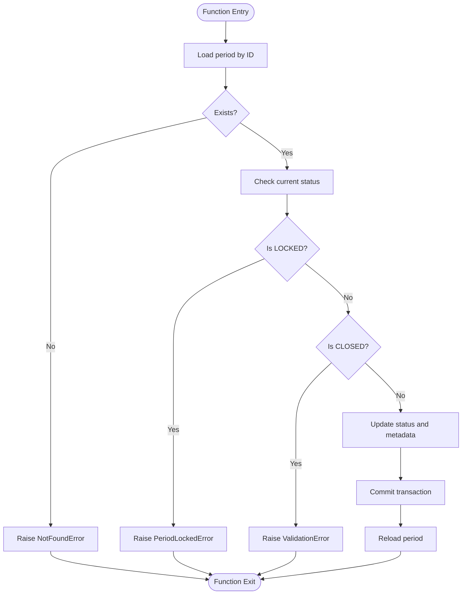
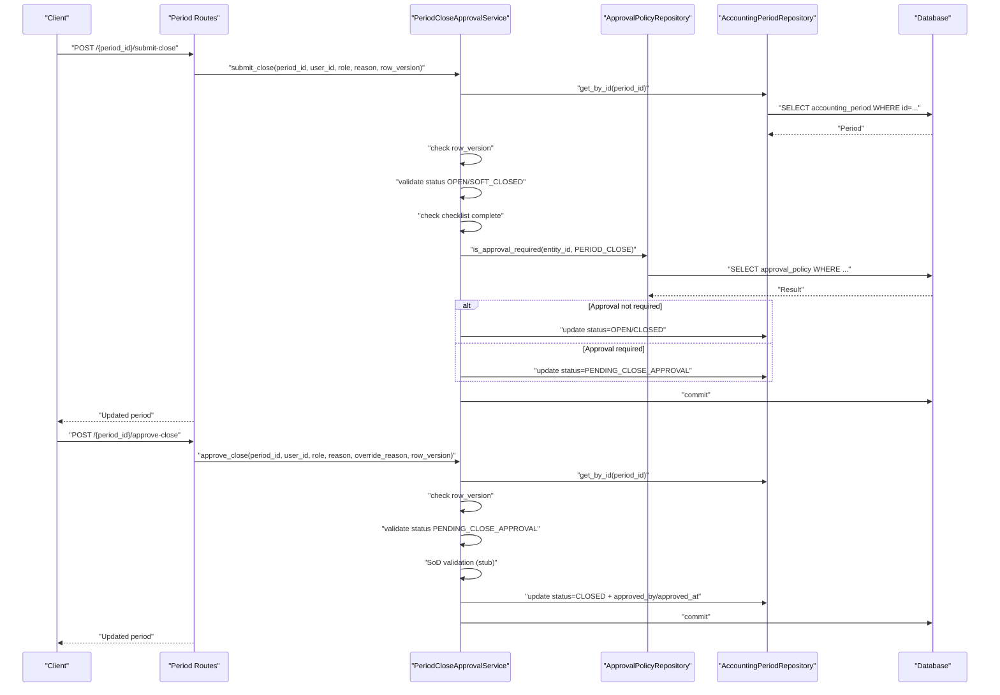
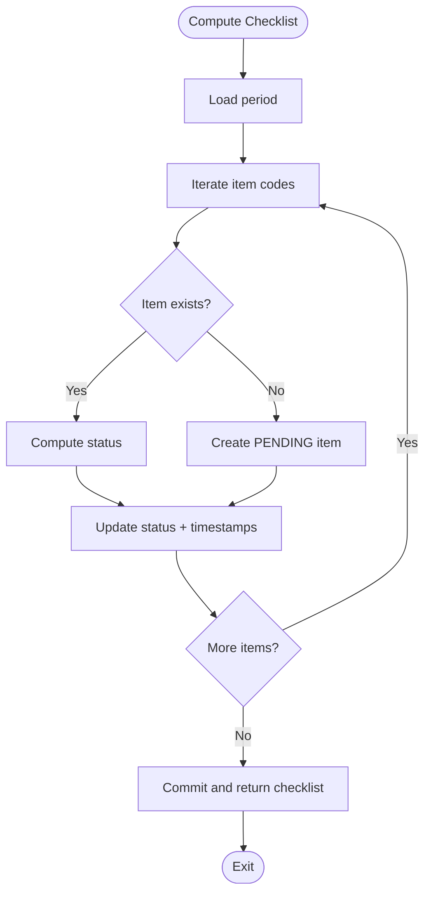
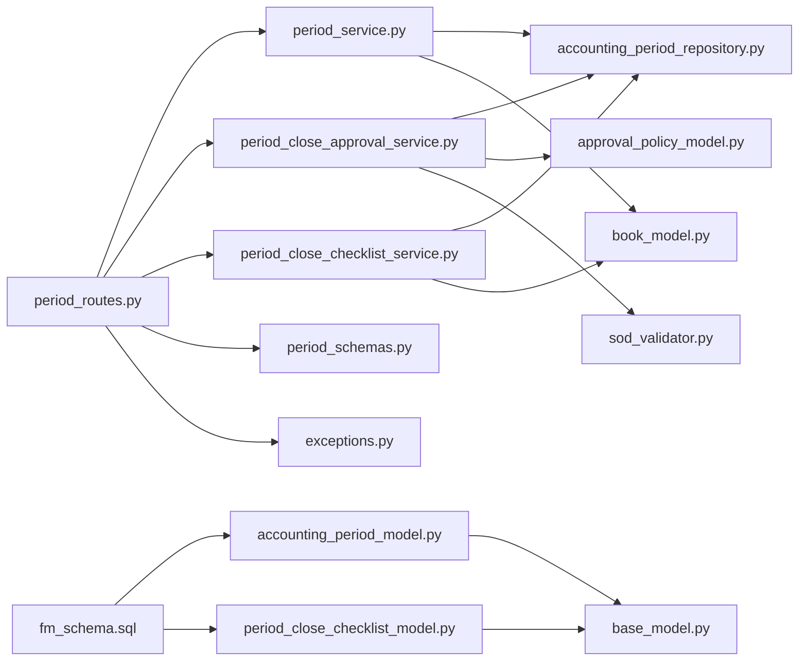
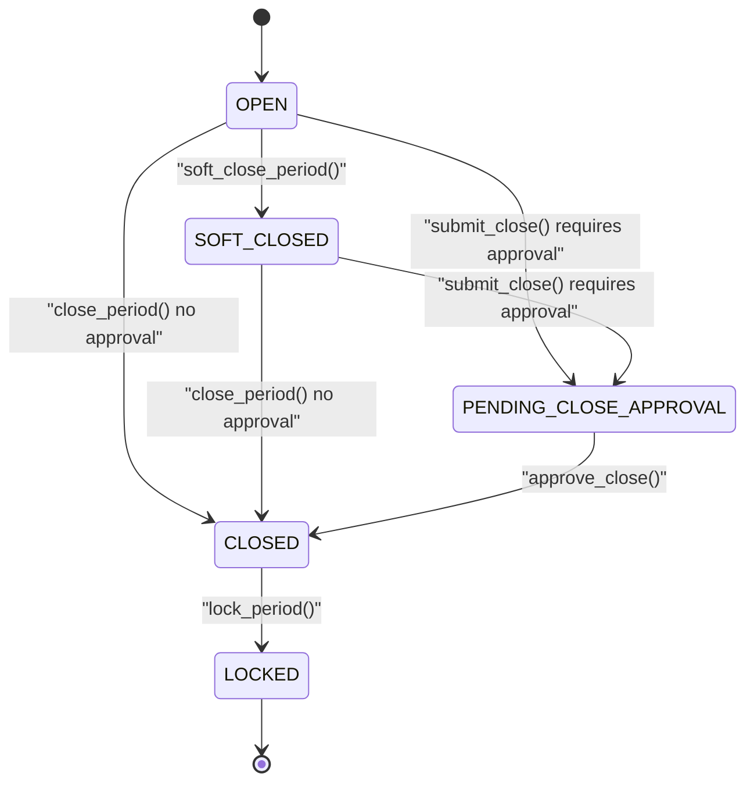

# Accounting Period Management

<cite>
**Referenced Files in This Document**
- [accounting_period_model.py](file://app/modules/general_ledger/models/accounting_period_model.py)
- [period_service.py](file://app/modules/general_ledger/services/period_service.py)
- [period_routes.py](file://app/modules/general_ledger/api/routes/period_routes.py)
- [period_schemas.py](file://app/modules/general_ledger/schemas/period_schemas.py)
- [accounting_period_repository.py](file://app/modules/general_ledger/repositories/accounting_period_repository.py)
- [period_close_approval_service.py](file://app/modules/general_ledger/services/period_close_approval_service.py)
- [period_close_checklist_service.py](file://app/modules/general_ledger/services/period_close_checklist_service.py)
- [period_close_checklist_model.py](file://app/modules/general_ledger/models/period_close_checklist_model.py)
- [book_model.py](file://app/modules/general_ledger/models/book_model.py)
- [approval_policy_model.py](file://app/modules/core/models/approval_policy_model.py)
- [sod_validator.py](file://app/modules/core/services/sod_validator.py)
- [base_model.py](file://app/shared/models/base_model.py)
- [exceptions.py](file://app/core/exceptions.py)
- [fm_schema.sql](file://database/fm_schema.sql)
</cite>

## Table of Contents
1. [Introduction](#introduction)
2. [Project Structure](#project-structure)
3. [Core Components](#core-components)
4. [Architecture Overview](#architecture-overview)
5. [Detailed Component Analysis](#detailed-component-analysis)
6. [Dependency Analysis](#dependency-analysis)
7. [Performance Considerations](#performance-considerations)
8. [Troubleshooting Guide](#troubleshooting-guide)
9. [Conclusion](#conclusion)
10. [Appendices](#appendices)

## Introduction
This document describes the Accounting Period Management system in TrueVow Financial Management. It covers the period lifecycle: creation, opening, closing, soft-closing, locking, and status management. It documents the accounting period models, their date ranges, statuses, and restrictions; the period routes API for operations and status changes; period close workflows including approval and checklist; validation rules, overlap prevention, and audit trail requirements; fiscal calendar support; period-end procedures; and exception handling for closed periods.

## Project Structure
The period management feature is implemented under the General Ledger module with clear separation of concerns:
- Models define the domain entities and enumerations
- Services encapsulate business logic for period operations and close workflows
- Repositories handle persistence and queries
- API routes expose endpoints with request/response schemas
- Supporting models and services provide approval policies and segregation of duties checks

**Diagram sources**
- [period_routes.py](file://app/modules/general_ledger/api/routes/period_routes.py#L1-L264)
- [period_service.py](file://app/modules/general_ledger/services/period_service.py#L1-L166)
- [period_close_approval_service.py](file://app/modules/general_ledger/services/period_close_approval_service.py#L1-L207)
- [period_close_checklist_service.py](file://app/modules/general_ledger/services/period_close_checklist_service.py#L1-L311)
- [accounting_period_model.py](file://app/modules/general_ledger/models/accounting_period_model.py#L1-L50)
- [period_close_checklist_model.py](file://app/modules/general_ledger/models/period_close_checklist_model.py#L1-L47)
- [book_model.py](file://app/modules/general_ledger/models/book_model.py#L1-L36)
- [approval_policy_model.py](file://app/modules/core/models/approval_policy_model.py#L1-L36)
- [sod_validator.py](file://app/modules/core/services/sod_validator.py#L1-L78)
- [base_model.py](file://app/shared/models/base_model.py#L1-L18)
- [fm_schema.sql](file://database/fm_schema.sql#L1-L200)

**Section sources**
- [period_routes.py](file://app/modules/general_ledger/api/routes/period_routes.py#L1-L264)
- [period_service.py](file://app/modules/general_ledger/services/period_service.py#L1-L166)
- [accounting_period_model.py](file://app/modules/general_ledger/models/accounting_period_model.py#L1-L50)
- [period_close_checklist_model.py](file://app/modules/general_ledger/models/period_close_checklist_model.py#L1-L47)
- [book_model.py](file://app/modules/general_ledger/models/book_model.py#L1-L36)
- [fm_schema.sql](file://database/fm_schema.sql#L1-L200)

## Core Components
- AccountingPeriod model defines monthly periods with date ranges, status, and approval metadata. It enforces uniqueness per book and start date and supports legacy fields for backward compatibility.
- PeriodStatus enumeration defines OPEN, SOFT_CLOSED, PENDING_CLOSE_APPROVAL, CLOSED, and LOCKED states.
- PeriodCloseChecklist model tracks close readiness items (BANK_REC_DONE, REVREC_DONE, PAYROLL_POSTED, ROYALTY_POSTED, AR_AGING_READY, AP_AGING_READY) with statuses PENDING, COMPLETE, or SKIPPED.
- PeriodService orchestrates period generation, retrieval, listing, closing, soft-closing, and locking with validation and error handling.
- PeriodCloseApprovalService manages submission and approval of period closes, including SoD checks and audit logging.
- PeriodCloseChecklistService computes and maintains checklist items based on current system state.
- API routes expose endpoints for generating periods, listing periods, retrieving a period, closing a period, submitting/approving period close, locking a period, and managing the close checklist.

**Section sources**
- [accounting_period_model.py](file://app/modules/general_ledger/models/accounting_period_model.py#L9-L46)
- [period_service.py](file://app/modules/general_ledger/services/period_service.py#L18-L166)
- [period_close_approval_service.py](file://app/modules/general_ledger/services/period_close_approval_service.py#L31-L207)
- [period_close_checklist_service.py](file://app/modules/general_ledger/services/period_close_checklist_service.py#L21-L311)
- [period_routes.py](file://app/modules/general_ledger/api/routes/period_routes.py#L32-L264)
- [period_schemas.py](file://app/modules/general_ledger/schemas/period_schemas.py#L1-L93)
- [period_close_checklist_model.py](file://app/modules/general_ledger/models/period_close_checklist_model.py#L9-L43)

## Architecture Overview
The system follows a layered architecture:
- API layer validates requests and delegates to services
- Service layer encapsulates business rules and coordinates repositories and models
- Repository layer handles database queries and persistence
- Models define domain entities and constraints
- Core services (approval policy, SoD) integrate with business workflows

**Diagram sources**
- [period_routes.py](file://app/modules/general_ledger/api/routes/period_routes.py#L35-L55)
- [period_service.py](file://app/modules/general_ledger/services/period_service.py#L26-L67)
- [accounting_period_repository.py](file://app/modules/general_ledger/repositories/accounting_period_repository.py#L35-L47)

**Section sources**
- [period_routes.py](file://app/modules/general_ledger/api/routes/period_routes.py#L35-L55)
- [period_service.py](file://app/modules/general_ledger/services/period_service.py#L26-L67)
- [accounting_period_repository.py](file://app/modules/general_ledger/repositories/accounting_period_repository.py#L14-L77)

## Detailed Component Analysis

### Accounting Period Model
The AccountingPeriod entity represents monthly accounting periods with:
- Date range: period_start and period_end
- Name: period_name (e.g., "YYYY-MM")
- Status: PeriodStatus (OPEN, SOFT_CLOSED, PENDING_CLOSE_APPROVAL, CLOSED, LOCKED)
- Approval fields: submitted_by/submitted_at, approved_by/approved_at, decision_reason
- Locking: closed_by/closed_at and lock_reason
- Relationships: back-populated to Book and JournalEntry
- Constraints: unique constraint on (book_id, period_start)

**Diagram sources**
- [accounting_period_model.py](file://app/modules/general_ledger/models/accounting_period_model.py#L18-L46)
- [book_model.py](file://app/modules/general_ledger/models/book_model.py#L15-L32)

**Section sources**
- [accounting_period_model.py](file://app/modules/general_ledger/models/accounting_period_model.py#L18-L46)
- [book_model.py](file://app/modules/general_ledger/models/book_model.py#L15-L32)

### Period Close Checklist Model
The checklist tracks readiness items for period closure:
- Item codes: BANK_REC_DONE, REVREC_DONE, PAYROLL_POSTED, ROYALTY_POSTED, AR_AGING_READY, AP_AGING_READY
- Statuses: PENDING, COMPLETE, SKIPPED
- Computed by and timestamps track automation or manual completion

**Diagram sources**
- [period_close_checklist_model.py](file://app/modules/general_ledger/models/period_close_checklist_model.py#L26-L43)
- [accounting_period_model.py](file://app/modules/general_ledger/models/accounting_period_model.py#L18-L46)

**Section sources**
- [period_close_checklist_model.py](file://app/modules/general_ledger/models/period_close_checklist_model.py#L9-L43)

### Period Service Implementation
Responsibilities:
- Generate periods for a book across a fiscal year/month range
- Retrieve periods by ID or by date containment
- List periods with optional status filter
- Close periods (direct close)
- Soft-close periods (allow elevated-role postings)
- Lock periods (prevent all postings; requires prior closure)

Validation and constraints:
- Prevents closing already closed or locked periods
- Prevents locking non-closed periods
- Uses repository methods to prevent overlaps via unique constraint

**Diagram sources**
- [period_service.py](file://app/modules/general_ledger/services/period_service.py#L89-L114)

**Section sources**
- [period_service.py](file://app/modules/general_ledger/services/period_service.py#L18-L166)
- [accounting_period_repository.py](file://app/modules/general_ledger/repositories/accounting_period_repository.py#L14-L77)
- [exceptions.py](file://app/core/exceptions.py#L35-L37)

### Period Close Approval Workflow
The approval workflow supports:
- Submitting a period for close (transitions OPEN/SOFT_CLOSED → PENDING_CLOSE_APPROVAL or CLOSED if no approval required)
- Approving a period close (transitions PENDING_CLOSE_APPROVAL → CLOSED)
- SoD validation (stubbed; can be extended)
- Audit logging for submit/approve actions

**Diagram sources**
- [period_routes.py](file://app/modules/general_ledger/api/routes/period_routes.py#L105-L152)
- [period_close_approval_service.py](file://app/modules/general_ledger/services/period_close_approval_service.py#L39-L166)
- [approval_policy_model.py](file://app/modules/core/models/approval_policy_model.py#L9-L32)
- [sod_validator.py](file://app/modules/core/services/sod_validator.py#L14-L24)

**Section sources**
- [period_close_approval_service.py](file://app/modules/general_ledger/services/period_close_approval_service.py#L31-L207)
- [approval_policy_model.py](file://app/modules/core/models/approval_policy_model.py#L18-L32)
- [sod_validator.py](file://app/modules/core/services/sod_validator.py#L14-L24)

### Period Close Checklist Computation
The checklist service computes readiness for period close:
- Ensures checklist items exist for all item codes
- Computes status based on system state:
  - BANK_REC_DONE: all active bank accounts reconciled for the period
  - REVREC_DONE: placeholder; depends on accrual vs cash book
  - PAYROLL_POSTED: payroll runs posted for the period
  - ROYALTY_POSTED: royalty calculations posted for the period
  - AR_AGING_READY: placeholder
  - AP_AGING_READY: placeholder
- Supports manual completion and notes

**Diagram sources**
- [period_close_checklist_service.py](file://app/modules/general_ledger/services/period_close_checklist_service.py#L28-L73)

**Section sources**
- [period_close_checklist_service.py](file://app/modules/general_ledger/services/period_close_checklist_service.py#L21-L311)

### Period Routes API
Key endpoints:
- POST /books/{book_id}/periods/generate: Create monthly periods for a book
- GET /books/{book_id}/periods: List periods (filter by status)
- GET /books/{book_id}/periods/{period_id}: Get a period
- POST /books/{book_id}/periods/{period_id}/close: Close a period
- POST /books/{book_id}/periods/{period_id}/submit-close: Submit period for close approval
- POST /books/{book_id}/periods/{period_id}/approve-close: Approve period close
- POST /books/{book_id}/periods/{period_id}/lock: Lock a period (idempotent)
- GET /books/{book_id}/periods/{period_id}/checklist: Get checklist
- POST /books/{book_id}/periods/{period_id}/checklist/compute: Compute checklist
- POST /books/{book_id}/periods/{period_id}/checklist/{item_code}/complete: Mark item complete

Request/response schemas define payload structures and response shapes.

**Section sources**
- [period_routes.py](file://app/modules/general_ledger/api/routes/period_routes.py#L32-L264)
- [period_schemas.py](file://app/modules/general_ledger/schemas/period_schemas.py#L8-L93)

## Dependency Analysis
The following diagram shows key dependencies among components:

**Diagram sources**
- [period_routes.py](file://app/modules/general_ledger/api/routes/period_routes.py#L1-L264)
- [period_service.py](file://app/modules/general_ledger/services/period_service.py#L1-L166)
- [period_close_approval_service.py](file://app/modules/general_ledger/services/period_close_approval_service.py#L1-L207)
- [period_close_checklist_service.py](file://app/modules/general_ledger/services/period_close_checklist_service.py#L1-L311)
- [accounting_period_repository.py](file://app/modules/general_ledger/repositories/accounting_period_repository.py#L1-L77)
- [accounting_period_model.py](file://app/modules/general_ledger/models/accounting_period_model.py#L1-L50)
- [period_close_checklist_model.py](file://app/modules/general_ledger/models/period_close_checklist_model.py#L1-L47)
- [book_model.py](file://app/modules/general_ledger/models/book_model.py#L1-L36)
- [approval_policy_model.py](file://app/modules/core/models/approval_policy_model.py#L1-L36)
- [sod_validator.py](file://app/modules/core/services/sod_validator.py#L1-L78)
- [base_model.py](file://app/shared/models/base_model.py#L1-L18)
- [period_schemas.py](file://app/modules/general_ledger/schemas/period_schemas.py#L1-L93)
- [exceptions.py](file://app/core/exceptions.py#L1-L43)
- [fm_schema.sql](file://database/fm_schema.sql#L1-L200)

**Section sources**
- [period_routes.py](file://app/modules/general_ledger/api/routes/period_routes.py#L1-L264)
- [period_service.py](file://app/modules/general_ledger/services/period_service.py#L1-L166)
- [period_close_approval_service.py](file://app/modules/general_ledger/services/period_close_approval_service.py#L1-L207)
- [period_close_checklist_service.py](file://app/modules/general_ledger/services/period_close_checklist_service.py#L1-L311)
- [accounting_period_model.py](file://app/modules/general_ledger/models/accounting_period_model.py#L1-L50)
- [period_close_checklist_model.py](file://app/modules/general_ledger/models/period_close_checklist_model.py#L1-L47)
- [book_model.py](file://app/modules/general_ledger/models/book_model.py#L1-L36)
- [approval_policy_model.py](file://app/modules/core/models/approval_policy_model.py#L1-L36)
- [sod_validator.py](file://app/modules/core/services/sod_validator.py#L1-L78)
- [base_model.py](file://app/shared/models/base_model.py#L1-L18)
- [period_schemas.py](file://app/modules/general_ledger/schemas/period_schemas.py#L1-L93)
- [exceptions.py](file://app/core/exceptions.py#L1-L43)
- [fm_schema.sql](file://database/fm_schema.sql#L1-L200)

## Performance Considerations
- Indexes: Periods are indexed by book_id and period_start, enabling efficient lookups by book/date and preventing duplicates.
- Query patterns: Repository methods target specific filters (by book+date, by book+start, list by book with optional status) to minimize scans.
- Batch operations: Period generation iterates months and creates records; batching via repository ensures single commit reduces overhead.
- Checklist computation: Iterates fixed set of item codes and performs targeted queries per item; consider caching or precomputation if performance becomes a concern.

[No sources needed since this section provides general guidance]

## Troubleshooting Guide
Common issues and resolutions:
- Period not found: Ensure the period_id exists and belongs to the specified book. API routes validate existence and ownership for lock operations.
- Validation errors during close/soft-close/lock: Review current status and business rules (e.g., cannot close already closed or locked periods; cannot lock non-closed periods).
- Period locked: Operations that modify locked periods are blocked; unlock or adjust workflow accordingly.
- Approval workflow failures: Checklist completeness and approval policy requirements must be satisfied; SoD validation is currently stubbed and can be extended.
- Idempotency for lock: The lock endpoint applies idempotency keys to prevent duplicate effects.

**Section sources**
- [period_routes.py](file://app/modules/general_ledger/api/routes/period_routes.py#L154-L209)
- [period_service.py](file://app/modules/general_ledger/services/period_service.py#L89-L166)
- [exceptions.py](file://app/core/exceptions.py#L35-L37)
- [period_close_approval_service.py](file://app/modules/general_ledger/services/period_close_approval_service.py#L39-L166)

## Conclusion
The Accounting Period Management system provides robust lifecycle management for monthly accounting periods, integrated close workflows with approval and checklist enforcement, and strong validation and audit capabilities. The modular design separates concerns across models, services, repositories, and APIs, supporting maintainability and extensibility. Fiscal calendar support is implicit through monthly period generation and date-range queries.

[No sources needed since this section summarizes without analyzing specific files]

## Appendices

### Period Status Lifecycle

**Diagram sources**
- [accounting_period_model.py](file://app/modules/general_ledger/models/accounting_period_model.py#L9-L15)
- [period_close_approval_service.py](file://app/modules/general_ledger/services/period_close_approval_service.py#L39-L166)
- [period_service.py](file://app/modules/general_ledger/services/period_service.py#L89-L166)

### Database Schema Notes
- Enumerations for period_status are created idempotently in the schema.
- Unique constraints on accounting_period ensure no overlapping periods per book.
- Checklist items are uniquely constrained by (period_id, item_code).

**Section sources**
- [fm_schema.sql](file://database/fm_schema.sql#L23-L28)
- [accounting_period_model.py](file://app/modules/general_ledger/models/accounting_period_model.py#L43-L46)
- [period_close_checklist_model.py](file://app/modules/general_ledger/models/period_close_checklist_model.py#L40-L43)