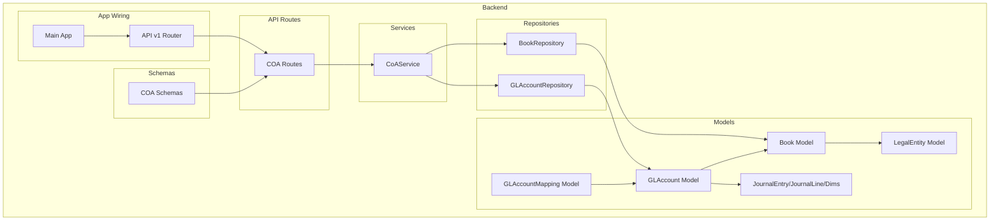
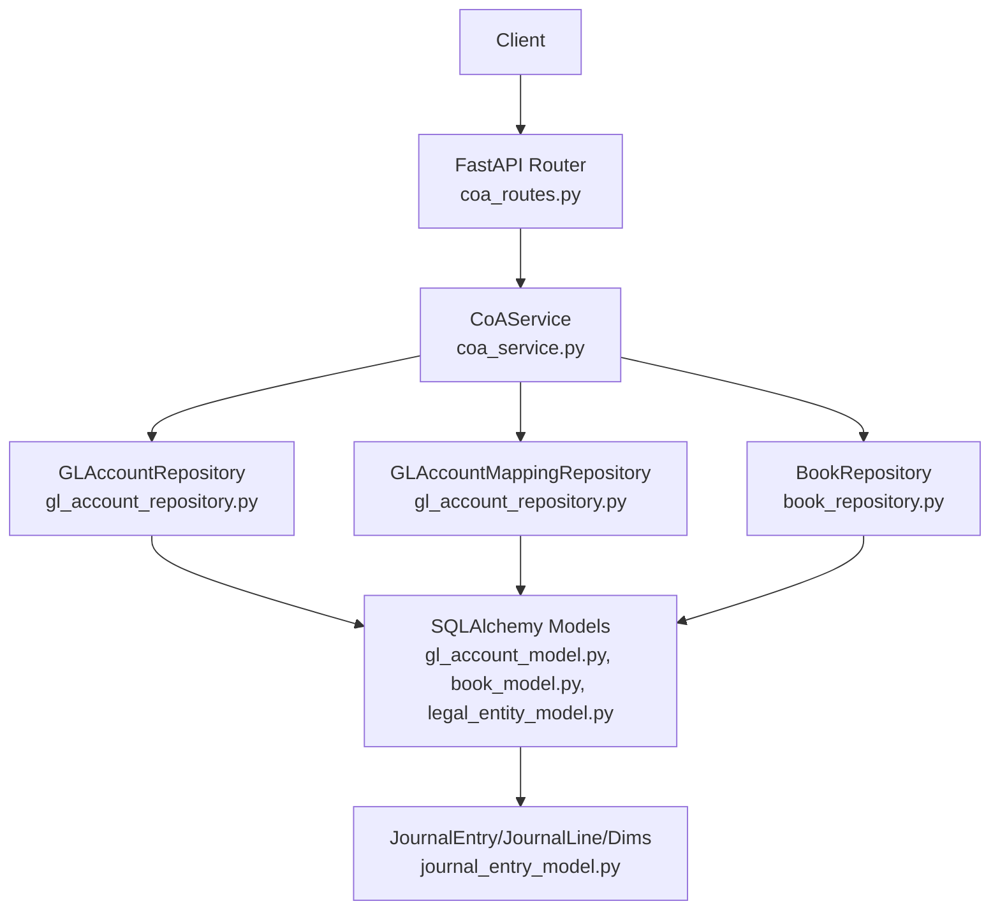
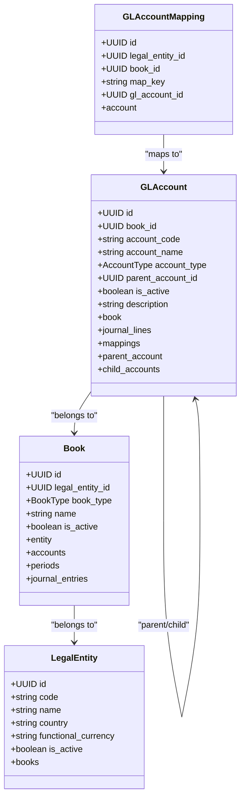
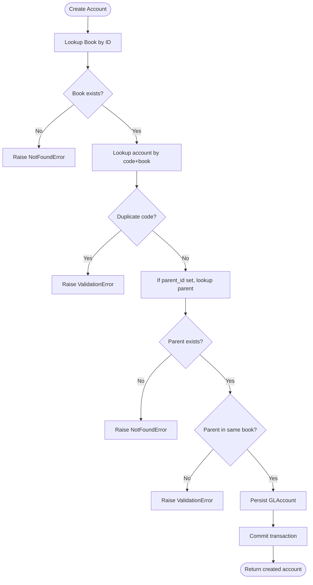
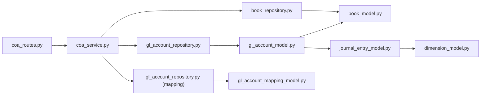

# Chart of Accounts Management

<cite>
**Referenced Files in This Document**
- [app/modules/general_ledger/models/gl_account_model.py](file://app/modules/general_ledger/models/gl_account_model.py)
- [app/modules/general_ledger/models/book_model.py](file://app/modules/general_ledger/models/book_model.py)
- [app/modules/general_ledger/models/legal_entity_model.py](file://app/modules/general_ledger/models/legal_entity_model.py)
- [app/modules/general_ledger/schemas/coa_schemas.py](file://app/modules/general_ledger/schemas/coa_schemas.py)
- [app/modules/general_ledger/api/routes/coa_routes.py](file://app/modules/general_ledger/api/routes/coa_routes.py)
- [app/modules/general_ledger/services/coa_service.py](file://app/modules/general_ledger/services/coa_service.py)
- [app/modules/general_ledger/repositories/gl_account_repository.py](file://app/modules/general_ledger/repositories/gl_account_repository.py)
- [app/modules/general_ledger/repositories/book_repository.py](file://app/modules/general_ledger/repositories/book_repository.py)
- [app/modules/general_ledger/models/journal_entry_model.py](file://app/modules/general_ledger/models/journal_entry_model.py)
- [app/modules/general_ledger/models/dimension_model.py](file://app/modules/general_ledger/models/dimension_model.py)
- [app/api/v1/__init__.py](file://app/api/v1/__init__.py)
- [app/main.py](file://app/main.py)
- [frontend/app/(dashboard)/chart-of-accounts/page.tsx](file://frontend/app/(dashboard)/chart-of-accounts/page.tsx)
- [frontend/app/(dashboard)/chart-of-accounts/new/page.tsx](file://frontend/app/(dashboard)/chart-of-accounts/new/page.tsx)
- [frontend/app/(dashboard)/chart-of-accounts/[id]/edit/page.tsx](file://frontend/app/(dashboard)/chart-of-accounts/[id]/edit/page.tsx)
</cite>

## Table of Contents
1. [Introduction](#introduction)
2. [Project Structure](#project-structure)
3. [Core Components](#core-components)
4. [Architecture Overview](#architecture-overview)
5. [Detailed Component Analysis](#detailed-component-analysis)
6. [Dependency Analysis](#dependency-analysis)
7. [Performance Considerations](#performance-considerations)
8. [Troubleshooting Guide](#troubleshooting-guide)
9. [Conclusion](#conclusion)
10. [Appendices](#appendices)

## Introduction
This document describes the Chart of Accounts (COA) management functionality in TrueVow Financial Management. It covers the GL account models, hierarchy management, classification systems, multi-book support, and the API endpoints for creating, listing, retrieving, updating accounts, and managing mappings. It also documents validation rules, account code uniqueness, parent-child relationships, and how the COA integrates with journal entries and dimensions.

## Project Structure
The COA implementation spans models, schemas, repositories, services, and API routes under the General Ledger module. The routes are included into the v1 API router and exposed via the main application entry point.

**Diagram sources**
- [app/modules/general_ledger/models/gl_account_model.py](file://app/modules/general_ledger/models/gl_account_model.py#L28-L58)
- [app/modules/general_ledger/models/book_model.py](file://app/modules/general_ledger/models/book_model.py#L15-L35)
- [app/modules/general_ledger/models/legal_entity_model.py](file://app/modules/general_ledger/models/legal_entity_model.py#L7-L21)
- [app/modules/general_ledger/models/journal_entry_model.py](file://app/modules/general_ledger/models/journal_entry_model.py#L17-L107)
- [app/modules/general_ledger/schemas/coa_schemas.py](file://app/modules/general_ledger/schemas/coa_schemas.py#L8-L61)
- [app/modules/general_ledger/repositories/gl_account_repository.py](file://app/modules/general_ledger/repositories/gl_account_repository.py#L10-L49)
- [app/modules/general_ledger/repositories/book_repository.py](file://app/modules/general_ledger/repositories/book_repository.py#L10-L35)
- [app/modules/general_ledger/services/coa_service.py](file://app/modules/general_ledger/services/coa_service.py#L14-L142)
- [app/modules/general_ledger/api/routes/coa_routes.py](file://app/modules/general_ledger/api/routes/coa_routes.py#L17-L122)
- [app/api/v1/__init__.py](file://app/api/v1/__init__.py#L34-L71)
- [app/main.py](file://app/main.py#L29-L30)

**Section sources**
- [app/modules/general_ledger/models/gl_account_model.py](file://app/modules/general_ledger/models/gl_account_model.py#L1-L80)
- [app/modules/general_ledger/models/book_model.py](file://app/modules/general_ledger/models/book_model.py#L1-L36)
- [app/modules/general_ledger/models/legal_entity_model.py](file://app/modules/general_ledger/models/legal_entity_model.py#L1-L22)
- [app/modules/general_ledger/schemas/coa_schemas.py](file://app/modules/general_ledger/schemas/coa_schemas.py#L1-L62)
- [app/modules/general_ledger/api/routes/coa_routes.py](file://app/modules/general_ledger/api/routes/coa_routes.py#L1-L123)
- [app/modules/general_ledger/services/coa_service.py](file://app/modules/general_ledger/services/coa_service.py#L1-L143)
- [app/modules/general_ledger/repositories/gl_account_repository.py](file://app/modules/general_ledger/repositories/gl_account_repository.py#L1-L82)
- [app/modules/general_ledger/repositories/book_repository.py](file://app/modules/general_ledger/repositories/book_repository.py#L1-L36)
- [app/api/v1/__init__.py](file://app/api/v1/__init__.py#L1-L72)
- [app/main.py](file://app/main.py#L1-L54)

## Core Components
- GLAccount model defines the chart of accounts entries with attributes such as book association, account code/name/type, optional parent for hierarchy, activity flag, and description. It includes a self-referencing parent/child relationship.
- GLAccountMapping model links a GL account to a legal entity and book via a map key (e.g., AR/AP/PAYROLL_PAYABLE), ensuring uniqueness per entity/book/key.
- Book model represents an accounting book (accrual or cash) per legal entity, with cascading deletion of dependent accounts and periods.
- LegalEntity model represents companies with country and functional currency, owning multiple books.
- COA Schemas define Pydantic models for creating/updating accounts and mappings, and for response serialization.
- COA Routes expose endpoints for account CRUD, listing, and mapping creation/retrieval.
- CoAService orchestrates validations, cross-entity checks, and repository interactions.
- Repositories encapsulate data access for accounts and mappings, and provide book lookup helpers.

**Section sources**
- [app/modules/general_ledger/models/gl_account_model.py](file://app/modules/general_ledger/models/gl_account_model.py#L9-L58)
- [app/modules/general_ledger/models/book_model.py](file://app/modules/general_ledger/models/book_model.py#L9-L35)
- [app/modules/general_ledger/models/legal_entity_model.py](file://app/modules/general_ledger/models/legal_entity_model.py#L7-L21)
- [app/modules/general_ledger/schemas/coa_schemas.py](file://app/modules/general_ledger/schemas/coa_schemas.py#L8-L61)
- [app/modules/general_ledger/api/routes/coa_routes.py](file://app/modules/general_ledger/api/routes/coa_routes.py#L17-L122)
- [app/modules/general_ledger/services/coa_service.py](file://app/modules/general_ledger/services/coa_service.py#L14-L142)
- [app/modules/general_ledger/repositories/gl_account_repository.py](file://app/modules/general_ledger/repositories/gl_account_repository.py#L10-L81)
- [app/modules/general_ledger/repositories/book_repository.py](file://app/modules/general_ledger/repositories/book_repository.py#L10-L35)

## Architecture Overview
The COA subsystem follows a layered architecture:
- API layer: FastAPI routes under /api/v1/books/{book_id}/accounts
- Service layer: CoAService validates inputs, enforces business rules, and coordinates repositories
- Repository layer: Typed SQLAlchemy repositories for accounts, mappings, and books
- Model layer: SQLAlchemy ORM models with relationships and constraints
- Integration: JournalEntry/JournalLine models reference GL accounts; Dimensions attach to journal lines

**Diagram sources**
- [app/modules/general_ledger/api/routes/coa_routes.py](file://app/modules/general_ledger/api/routes/coa_routes.py#L17-L122)
- [app/modules/general_ledger/services/coa_service.py](file://app/modules/general_ledger/services/coa_service.py#L14-L142)
- [app/modules/general_ledger/repositories/gl_account_repository.py](file://app/modules/general_ledger/repositories/gl_account_repository.py#L10-L81)
- [app/modules/general_ledger/repositories/book_repository.py](file://app/modules/general_ledger/repositories/book_repository.py#L10-L35)
- [app/modules/general_ledger/models/gl_account_model.py](file://app/modules/general_ledger/models/gl_account_model.py#L28-L58)
- [app/modules/general_ledger/models/book_model.py](file://app/modules/general_ledger/models/book_model.py#L15-L35)
- [app/modules/general_ledger/models/legal_entity_model.py](file://app/modules/general_ledger/models/legal_entity_model.py#L7-L21)
- [app/modules/general_ledger/models/journal_entry_model.py](file://app/modules/general_ledger/models/journal_entry_model.py#L17-L107)

## Detailed Component Analysis

### GL Account Models and Hierarchy
- AccountType enumeration supports standard types (Asset, Liability, Equity, Revenue, Expense) plus special/subtypes (AR, AP, Cash, Deferred Revenue, Other Asset/Liability, Other Income, Other Income/Expense, Contra Revenue).
- GLAccount includes:
  - book_id foreign key to Book
  - account_code (unique per book), account_name, account_type, parent_account_id (self-reference), is_active, description
  - Relationships: book, journal_lines, mappings
  - Self-referential parent/child relationship enables hierarchical queries
- GLAccountMapping:
  - legal_entity_id, book_id, map_key (unique per entity/book/key), gl_account_id
  - Ensures deterministic mapping for system-generated postings

**Diagram sources**
- [app/modules/general_ledger/models/gl_account_model.py](file://app/modules/general_ledger/models/gl_account_model.py#L9-L58)
- [app/modules/general_ledger/models/book_model.py](file://app/modules/general_ledger/models/book_model.py#L9-L35)
- [app/modules/general_ledger/models/legal_entity_model.py](file://app/modules/general_ledger/models/legal_entity_model.py#L7-L21)

**Section sources**
- [app/modules/general_ledger/models/gl_account_model.py](file://app/modules/general_ledger/models/gl_account_model.py#L9-L58)
- [app/modules/general_ledger/models/book_model.py](file://app/modules/general_ledger/models/book_model.py#L9-L35)
- [app/modules/general_ledger/models/legal_entity_model.py](file://app/modules/general_ledger/models/legal_entity_model.py#L7-L21)

### COA Service Implementation
Responsibilities:
- Create account: verifies book existence, ensures account_code uniqueness per book, validates parent account presence and same-book requirement, persists the account, commits transaction
- Retrieve/list accounts: by ID or by book (active-only option)
- Update account: allows name, description, and activity flag updates (code/type immutability enforced by design)
- Create/update mapping: verifies account belongs to the specified book, upserts mapping by unique key, commits transaction
- Retrieve mapping: by legal entity, book, and map key

Validation rules:
- Account code uniqueness per book
- Parent account must belong to the same book
- Mapping must reference an account within the same book

**Diagram sources**
- [app/modules/general_ledger/services/coa_service.py](file://app/modules/general_ledger/services/coa_service.py#L23-L62)

**Section sources**
- [app/modules/general_ledger/services/coa_service.py](file://app/modules/general_ledger/services/coa_service.py#L14-L142)

### COA Routes API Endpoints
- POST /api/v1/books/{book_id}/accounts
  - Purpose: Create a new GL account
  - Request body: GLAccountCreate schema
  - Response: GLAccountResponse (201)
  - Validation: NotFoundError for missing book/parent; ValidationError for duplicate code or parent-book mismatch
- GET /api/v1/books/{book_id}/accounts
  - Purpose: List accounts for a book
  - Query: active_only (default true)
  - Response: Array of GLAccountResponse
- GET /api/v1/books/{book_id}/accounts/{account_id}
  - Purpose: Get account by ID
  - Response: GLAccountResponse (404 if not found)
- PATCH /api/v1/books/{book_id}/accounts/{account_id}
  - Purpose: Update account (name, description, is_active)
  - Response: GLAccountResponse (404 if not found)
- POST /api/v1/books/{book_id}/accounts/mappings
  - Purpose: Create or update mapping
  - Request body: GLAccountMappingCreate
  - Response: GLAccountMappingResponse (400/404 on validation/error)
- GET /api/v1/books/{book_id}/accounts/mappings/{map_key}
  - Purpose: Get mapping by legal_entity_id and map_key
  - Query: legal_entity_id
  - Response: GLAccountMappingResponse (404 if not found)

Integration wiring:
- Routes are included in the v1 router under /api/v1
- Application entry point mounts the v1 router

**Section sources**
- [app/modules/general_ledger/api/routes/coa_routes.py](file://app/modules/general_ledger/api/routes/coa_routes.py#L17-L122)
- [app/api/v1/__init__.py](file://app/api/v1/__init__.py#L34-L41)
- [app/main.py](file://app/main.py#L29-L30)

### Frontend Integration
- Pages:
  - List accounts: frontend/app/(dashboard)/chart-of-accounts/page.tsx renders ChartOfAccountsPage
  - Create account: frontend/app/(dashboard)/chart-of-accounts/new/page.tsx renders ChartOfAccountFormPage
  - Edit account: frontend/app/(dashboard)/chart-of-accounts/[id]/edit/page.tsx renders ChartOfAccountFormPage
- These pages integrate with backend endpoints described above.

**Section sources**
- [frontend/app/(dashboard)/chart-of-accounts/page.tsx](file://frontend/app/(dashboard)/chart-of-accounts/page.tsx#L1-L12)
- [frontend/app/(dashboard)/chart-of-accounts/new/page.tsx](file://frontend/app/(dashboard)/chart-of-accounts/new/page.tsx#L1-L10)
- [frontend/app/(dashboard)/chart-of-accounts/[id]/edit/page.tsx](file://frontend/app/(dashboard)/chart-of-accounts/[id]/edit/page.tsx#L1-L10)

## Dependency Analysis
- API routes depend on CoAService
- CoAService depends on GLAccountRepository, GLAccountMappingRepository, and BookRepository
- Models define relationships and constraints; repositories encapsulate queries
- JournalEntry/JournalLine reference GLAccount, enabling posting against COA accounts
- Dimensions attach to journal lines for reporting segmentation

**Diagram sources**
- [app/modules/general_ledger/api/routes/coa_routes.py](file://app/modules/general_ledger/api/routes/coa_routes.py#L17-L122)
- [app/modules/general_ledger/services/coa_service.py](file://app/modules/general_ledger/services/coa_service.py#L14-L22)
- [app/modules/general_ledger/repositories/gl_account_repository.py](file://app/modules/general_ledger/repositories/gl_account_repository.py#L10-L81)
- [app/modules/general_ledger/repositories/book_repository.py](file://app/modules/general_ledger/repositories/book_repository.py#L10-L35)
- [app/modules/general_ledger/models/gl_account_model.py](file://app/modules/general_ledger/models/gl_account_model.py#L28-L58)
- [app/modules/general_ledger/models/book_model.py](file://app/modules/general_ledger/models/book_model.py#L15-L35)
- [app/modules/general_ledger/models/journal_entry_model.py](file://app/modules/general_ledger/models/journal_entry_model.py#L17-L107)
- [app/modules/general_ledger/models/dimension_model.py](file://app/modules/general_ledger/models/dimension_model.py#L8-L39)

**Section sources**
- [app/modules/general_ledger/api/routes/coa_routes.py](file://app/modules/general_ledger/api/routes/coa_routes.py#L17-L122)
- [app/modules/general_ledger/services/coa_service.py](file://app/modules/general_ledger/services/coa_service.py#L14-L22)
- [app/modules/general_ledger/repositories/gl_account_repository.py](file://app/modules/general_ledger/repositories/gl_account_repository.py#L10-L81)
- [app/modules/general_ledger/repositories/book_repository.py](file://app/modules/general_ledger/repositories/book_repository.py#L10-L35)
- [app/modules/general_ledger/models/gl_account_model.py](file://app/modules/general_ledger/models/gl_account_model.py#L28-L58)
- [app/modules/general_ledger/models/book_model.py](file://app/modules/general_ledger/models/book_model.py#L15-L35)
- [app/modules/general_ledger/models/journal_entry_model.py](file://app/modules/general_ledger/models/journal_entry_model.py#L17-L107)
- [app/modules/general_ledger/models/dimension_model.py](file://app/modules/general_ledger/models/dimension_model.py#L8-L39)

## Performance Considerations
- Indexes: account_code and book_id are indexed on GLAccount; book_id is indexed on GLAccountMapping; legal_entity_id/book_id/map_key are indexed on GLAccountMapping; book.legal_entity_id is indexed on Book.
- Queries:
  - Listing accounts by book is ordered by account_code
  - Active-only listing filters by is_active
  - Mapping retrieval uses composite unique constraint for O(1) lookup
- Recommendations:
  - Add database indexes on frequently filtered fields if additional filters are introduced
  - Consider pagination for large COAs
  - Batch operations for bulk imports should leverage repository bulk insert APIs if extended

[No sources needed since this section provides general guidance]

## Troubleshooting Guide
Common errors and resolutions:
- 404 Not Found
  - Book not found when creating an account
  - Parent account not found
  - Account not found during update
  - Mapping not found during retrieval
- 400 Bad Request
  - Duplicate account code in the same book
  - Parent account belongs to a different book
  - Account in mapping does not belong to the specified book
- Validation tips:
  - Ensure account_code length constraints are met
  - Ensure map_key length constraints are met
  - Confirm account_type is one of the supported values

**Section sources**
- [app/modules/general_ledger/services/coa_service.py](file://app/modules/general_ledger/services/coa_service.py#L33-L49)
- [app/modules/general_ledger/services/coa_service.py](file://app/modules/general_ledger/services/coa_service.py#L109-L114)
- [app/modules/general_ledger/schemas/coa_schemas.py](file://app/modules/general_ledger/schemas/coa_schemas.py#L8-L15)
- [app/modules/general_ledger/schemas/coa_schemas.py](file://app/modules/general_ledger/schemas/coa_schemas.py#L42-L47)

## Conclusion
TrueVow’s COA module provides a robust foundation for managing GL accounts with multi-book support, hierarchical parent-child relationships, and system-mapping capabilities. The API exposes standard CRUD operations with strong validation and clear error signaling. Integration with journal entries and dimensions enables accurate financial posting and reporting.

[No sources needed since this section summarizes without analyzing specific files]

## Appendices

### Account Classification and Hierarchy Examples
- Classifications:
  - Standard: Asset, Liability, Equity, Revenue, Expense
  - Subtypes: AR, AP, Cash, Deferred Revenue, Other Asset/Liability, Other Income/Expense, Contra Revenue
- Hierarchies:
  - Parent-child relationships enable roll-ups and reporting segments
  - Parent must reside in the same book as child
- Multi-book support:
  - Each LegalEntity can maintain separate Accrual and Cash books
  - Accounts are isolated per book; mappings tie system keys to accounts per entity/book

**Section sources**
- [app/modules/general_ledger/models/gl_account_model.py](file://app/modules/general_ledger/models/gl_account_model.py#L9-L26)
- [app/modules/general_ledger/models/book_model.py](file://app/modules/general_ledger/models/book_model.py#L9-L22)
- [app/modules/general_ledger/models/legal_entity_model.py](file://app/modules/general_ledger/models/legal_entity_model.py#L11-L18)

### Audit Trail and Journal Integration
- JournalEntry and JournalLine reference GLAccount, enabling auditability of postings
- JournalLine includes transaction and functional currency amounts, FX info, and dimensions
- Dimensions are attached to journal lines for granular reporting

**Section sources**
- [app/modules/general_ledger/models/journal_entry_model.py](file://app/modules/general_ledger/models/journal_entry_model.py#L17-L107)
- [app/modules/general_ledger/models/dimension_model.py](file://app/modules/general_ledger/models/dimension_model.py#L8-L39)