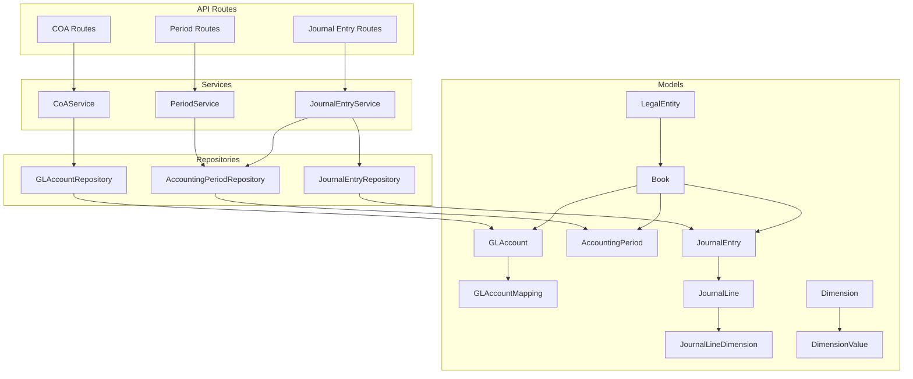
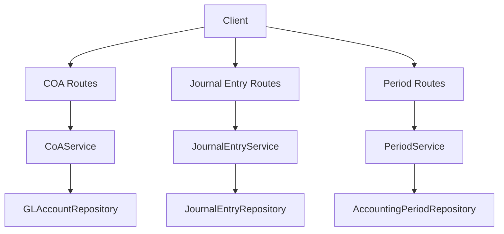
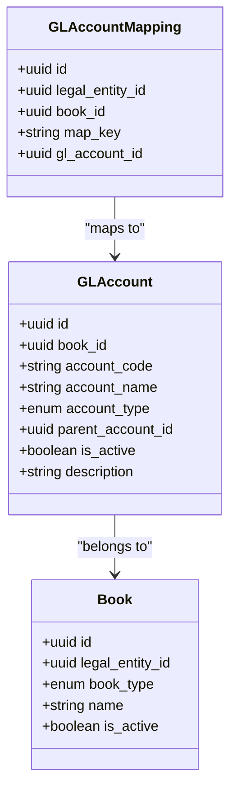
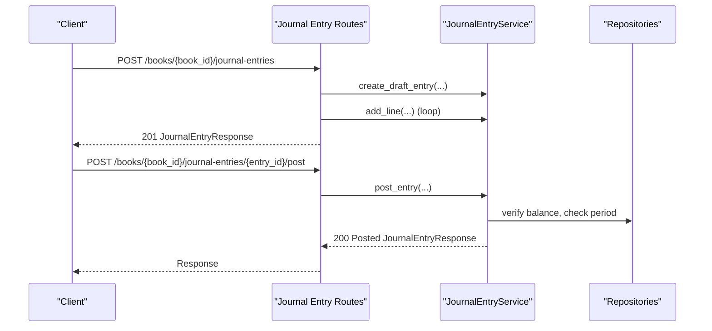
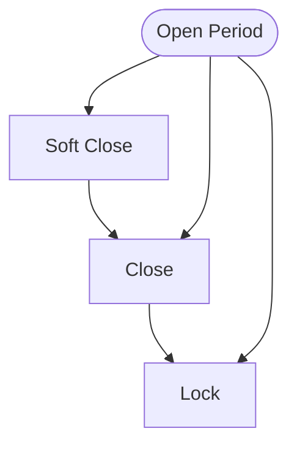
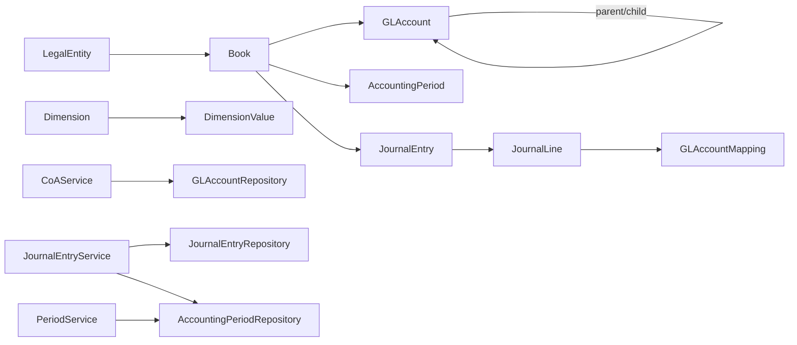
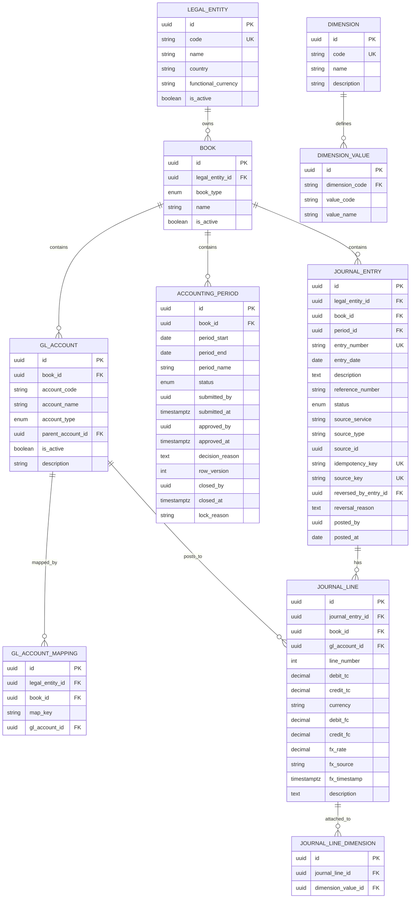
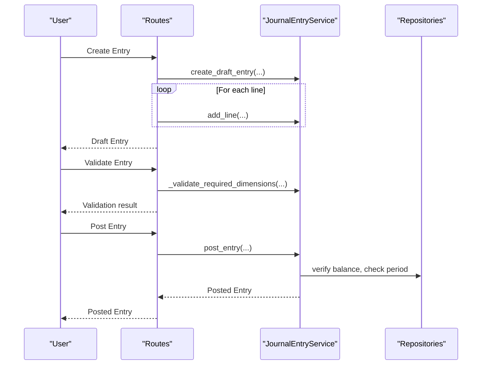
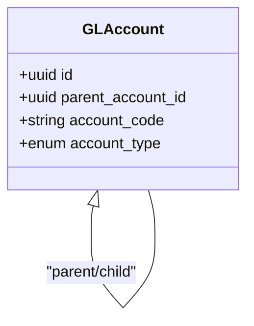
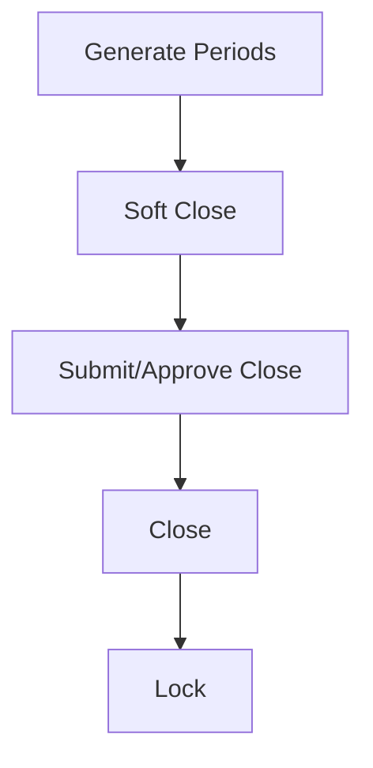

# General Ledger Module

<cite>
**Referenced Files in This Document**
- [gl_account_model.py](file://app/modules/general_ledger/models/gl_account_model.py)
- [journal_entry_model.py](file://app/modules/general_ledger/models/journal_entry_model.py)
- [accounting_period_model.py](file://app/modules/general_ledger/models/accounting_period_model.py)
- [book_model.py](file://app/modules/general_ledger/models/book_model.py)
- [dimension_model.py](file://app/modules/general_ledger/models/dimension_model.py)
- [legal_entity_model.py](file://app/modules/general_ledger/models/legal_entity_model.py)
- [coa_service.py](file://app/modules/general_ledger/services/coa_service.py)
- [journal_entry_service.py](file://app/modules/general_ledger/services/journal_entry_service.py)
- [period_service.py](file://app/modules/general_ledger/services/period_service.py)
- [coa_routes.py](file://app/modules/general_ledger/api/routes/coa_routes.py)
- [journal_entry_routes.py](file://app/modules/general_ledger/api/routes/journal_entry_routes.py)
- [period_routes.py](file://app/modules/general_ledger/api/routes/period_routes.py)
- [coa_schemas.py](file://app/modules/general_ledger/schemas/coa_schemas.py)
- [journal_entry_schemas.py](file://app/modules/general_ledger/schemas/journal_entry_schemas.py)
- [period_schemas.py](file://app/modules/general_ledger/schemas/period_schemas.py)
- [gl_account_repository.py](file://app/modules/general_ledger/repositories/gl_account_repository.py)
- [journal_entry_repository.py](file://app/modules/general_ledger/repositories/journal_entry_repository.py)
- [accounting_period_repository.py](file://app/modules/general_ledger/repositories/accounting_period_repository.py)
</cite>

## Table of Contents
1. [Introduction](#introduction)
2. [Project Structure](#project-structure)
3. [Core Components](#core-components)
4. [Architecture Overview](#architecture-overview)
5. [Detailed Component Analysis](#detailed-component-analysis)
6. [Dependency Analysis](#dependency-analysis)
7. [Performance Considerations](#performance-considerations)
8. [Troubleshooting Guide](#troubleshooting-guide)
9. [Conclusion](#conclusion)
10. [Appendices](#appendices)

## Introduction
This document describes the General Ledger module of TrueVow Financial Management. It covers chart of accounts (COA) management, journal entry processing, and accounting period management. It explains the service implementations behind the APIs, the data models and their relationships, and outlines multi-book support and consolidation considerations. Examples include ledger posting workflows, account hierarchies, and period closing procedures.

## Project Structure
The General Ledger module is organized by domain: models define the persistent entities and relationships; services encapsulate business logic; repositories provide data access; schemas define request/response contracts; and FastAPI routes expose the public endpoints grouped by resource.

**Diagram sources**
- [gl_account_model.py](file://app/modules/general_ledger/models/gl_account_model.py#L28-L80)
- [journal_entry_model.py](file://app/modules/general_ledger/models/journal_entry_model.py#L17-L128)
- [accounting_period_model.py](file://app/modules/general_ledger/models/accounting_period_model.py#L18-L50)
- [book_model.py](file://app/modules/general_ledger/models/book_model.py#L15-L36)
- [dimension_model.py](file://app/modules/general_ledger/models/dimension_model.py#L8-L40)
- [gl_account_repository.py](file://app/modules/general_ledger/repositories/gl_account_repository.py#L10-L82)
- [journal_entry_repository.py](file://app/modules/general_ledger/repositories/journal_entry_repository.py#L16-L119)
- [accounting_period_repository.py](file://app/modules/general_ledger/repositories/accounting_period_repository.py#L14-L77)
- [coa_service.py](file://app/modules/general_ledger/services/coa_service.py#L14-L143)
- [journal_entry_service.py](file://app/modules/general_ledger/services/journal_entry_service.py#L40-L635)
- [period_service.py](file://app/modules/general_ledger/services/period_service.py#L18-L166)
- [coa_routes.py](file://app/modules/general_ledger/api/routes/coa_routes.py#L17-L123)
- [journal_entry_routes.py](file://app/modules/general_ledger/api/routes/journal_entry_routes.py#L28-L377)
- [period_routes.py](file://app/modules/general_ledger/api/routes/period_routes.py#L32-L264)

**Section sources**
- [gl_account_model.py](file://app/modules/general_ledger/models/gl_account_model.py#L1-L80)
- [journal_entry_model.py](file://app/modules/general_ledger/models/journal_entry_model.py#L1-L128)
- [accounting_period_model.py](file://app/modules/general_ledger/models/accounting_period_model.py#L1-L50)
- [book_model.py](file://app/modules/general_ledger/models/book_model.py#L1-L36)
- [dimension_model.py](file://app/modules/general_ledger/models/dimension_model.py#L1-L40)
- [legal_entity_model.py](file://app/modules/general_ledger/models/legal_entity_model.py#L1-L22)

## Core Components
- Chart of Accounts (COA)
  - GLAccount defines chart of accounts entries per book, including hierarchy via parent_account_id and account types.
  - GLAccountMapping links system-generated posting keys to GL accounts per legal entity and book.
- Journal Entries
  - JournalEntry captures immutable entries per book and period, with statuses and source tracking.
  - JournalLine holds per-line debit/credit amounts in transaction and functional currencies, FX metadata, and dimensions.
  - JournalLineDimension attaches dimension values to lines.
- Accounting Periods
  - AccountingPeriod defines monthly periods per book with lifecycle statuses and approval metadata.
- Books and Legal Entities
  - Book represents an accounting book (Accrual or Cash) per legal entity.
  - LegalEntity represents companies with functional currency and active flag.

**Section sources**
- [gl_account_model.py](file://app/modules/general_ledger/models/gl_account_model.py#L9-L80)
- [journal_entry_model.py](file://app/modules/general_ledger/models/journal_entry_model.py#L10-L128)
- [accounting_period_model.py](file://app/modules/general_ledger/models/accounting_period_model.py#L9-L50)
- [book_model.py](file://app/modules/general_ledger/models/book_model.py#L9-L36)
- [dimension_model.py](file://app/modules/general_ledger/models/dimension_model.py#L8-L40)
- [legal_entity_model.py](file://app/modules/general_ledger/models/legal_entity_model.py#L7-L22)

## Architecture Overview
The module follows layered architecture:
- API routes accept requests and delegate to services.
- Services orchestrate repositories and enforce business rules.
- Repositories encapsulate SQLAlchemy queries.
- Models define persistence and relationships.

**Diagram sources**
- [coa_routes.py](file://app/modules/general_ledger/api/routes/coa_routes.py#L17-L123)
- [journal_entry_routes.py](file://app/modules/general_ledger/api/routes/journal_entry_routes.py#L28-L377)
- [period_routes.py](file://app/modules/general_ledger/api/routes/period_routes.py#L32-L264)
- [coa_service.py](file://app/modules/general_ledger/services/coa_service.py#L14-L143)
- [journal_entry_service.py](file://app/modules/general_ledger/services/journal_entry_service.py#L40-L635)
- [period_service.py](file://app/modules/general_ledger/services/period_service.py#L18-L166)
- [gl_account_repository.py](file://app/modules/general_ledger/repositories/gl_account_repository.py#L10-L82)
- [journal_entry_repository.py](file://app/modules/general_ledger/repositories/journal_entry_repository.py#L16-L119)
- [accounting_period_repository.py](file://app/modules/general_ledger/repositories/accounting_period_repository.py#L14-L77)

## Detailed Component Analysis

### Chart of Accounts (COA)
- Responsibilities
  - Create, update, list GL accounts.
  - Manage GLAccountMapping for system-generated postings keyed by legal entity, book, and map key.
- Key validations
  - Account code uniqueness per book.
  - Parent account must be in the same book.
  - Mapping account must belong to the specified book.
- Hierarchies
  - Self-referencing parent/child relationships enable tree-like COA structures.

**Diagram sources**
- [gl_account_model.py](file://app/modules/general_ledger/models/gl_account_model.py#L28-L80)
- [book_model.py](file://app/modules/general_ledger/models/book_model.py#L15-L36)

**Section sources**
- [coa_service.py](file://app/modules/general_ledger/services/coa_service.py#L23-L143)
- [gl_account_model.py](file://app/modules/general_ledger/models/gl_account_model.py#L28-L80)
- [gl_account_repository.py](file://app/modules/general_ledger/repositories/gl_account_repository.py#L16-L82)

### Journal Entry Processing
- Responsibilities
  - Create draft entries with idempotency support.
  - Add lines with validation (mutually exclusive debit/credit, currency, FX).
  - Post entries (immutable), enforcing period status and balance checks.
  - Reverse entries with automatic reversal entry creation.
  - Bulk upsert lines with per-row error reporting.
- Constraints
  - Unique entry numbers per book per day.
  - Unique source_key per legal entity/book for posted entries.
  - Period locked or closed prevents posting.
  - Required dimensions enforced on post (COST_CENTER, DEPARTMENT, LOCATION).

**Diagram sources**
- [journal_entry_routes.py](file://app/modules/general_ledger/api/routes/journal_entry_routes.py#L31-L185)
- [journal_entry_service.py](file://app/modules/general_ledger/services/journal_entry_service.py#L53-L242)
- [journal_entry_repository.py](file://app/modules/general_ledger/repositories/journal_entry_repository.py#L22-L74)

**Section sources**
- [journal_entry_service.py](file://app/modules/general_ledger/services/journal_entry_service.py#L53-L635)
- [journal_entry_model.py](file://app/modules/general_ledger/models/journal_entry_model.py#L17-L128)
- [journal_entry_repository.py](file://app/modules/general_ledger/repositories/journal_entry_repository.py#L16-L119)

### Accounting Period Management
- Responsibilities
  - Generate monthly periods for a book.
  - List periods with optional status filter.
  - Close periods (OPEN -> CLOSED).
  - Soft close (OPEN -> SOFT_CLOSED).
  - Lock periods (CLOSED -> LOCKED) to prevent all postings.
  - Period close approval workflow and checklist endpoints.
- Status transitions
  - OPEN -> SOFT_CLOSED -> CLOSED -> LOCKED (with constraints).

**Diagram sources**
- [period_service.py](file://app/modules/general_ledger/services/period_service.py#L89-L166)
- [accounting_period_model.py](file://app/modules/general_ledger/models/accounting_period_model.py#L18-L50)

**Section sources**
- [period_service.py](file://app/modules/general_ledger/services/period_service.py#L26-L166)
- [accounting_period_model.py](file://app/modules/general_ledger/models/accounting_period_model.py#L18-L50)
- [period_routes.py](file://app/modules/general_ledger/api/routes/period_routes.py#L35-L264)

### Multi-Book Support and Consolidation Considerations
- Multi-book per legal entity
  - Book records separate accrual vs cash books for the same legal entity.
  - All GL entities (GLAccount, JournalEntry, JournalLine, AccountingPeriod) are bound to a Book.
- Cross-entity considerations
  - LegalEntity is the top-level organizational unit; books belong to legal entities.
  - Consolidation would require mapping books across legal entities and aligning currencies and dimensions.
- Practical implications
  - COA and mappings are scoped to a Book.
  - Journal entries are posted within a Book’s period context.
  - Period close approvals and locks are enforced per Book.

**Section sources**
- [book_model.py](file://app/modules/general_ledger/models/book_model.py#L15-L36)
- [legal_entity_model.py](file://app/modules/general_ledger/models/legal_entity_model.py#L7-L22)
- [gl_account_model.py](file://app/modules/general_ledger/models/gl_account_model.py#L28-L80)
- [journal_entry_model.py](file://app/modules/general_ledger/models/journal_entry_model.py#L17-L128)
- [accounting_period_model.py](file://app/modules/general_ledger/models/accounting_period_model.py#L18-L50)

## Dependency Analysis
- Model-to-model relationships
  - LegalEntity -> Book (one-to-many)
  - Book -> GLAccount (one-to-many), -> AccountingPeriod (one-to-many), -> JournalEntry (one-to-many)
  - GLAccount <-> GLAccount (self-reference for hierarchy)
  - JournalEntry -> JournalLine (one-to-many), -> AccountingPeriod
  - JournalLine -> GLAccount, -> JournalLineDimension (one-to-many)
  - Dimension -> DimensionValue (one-to-many)
- Service-to-repository coupling
  - CoAService depends on GLAccountRepository, GLAccountMappingRepository, BookRepository.
  - JournalEntryService depends on JournalEntryRepository, JournalLineRepository, AccountingPeriodRepository, GLAccountRepository, Dimension repositories, BookRepository.
  - PeriodService depends on AccountingPeriodRepository, BookRepository.

**Diagram sources**
- [gl_account_model.py](file://app/modules/general_ledger/models/gl_account_model.py#L28-L80)
- [journal_entry_model.py](file://app/modules/general_ledger/models/journal_entry_model.py#L17-L128)
- [accounting_period_model.py](file://app/modules/general_ledger/models/accounting_period_model.py#L18-L50)
- [dimension_model.py](file://app/modules/general_ledger/models/dimension_model.py#L8-L40)
- [coa_service.py](file://app/modules/general_ledger/services/coa_service.py#L14-L143)
- [journal_entry_service.py](file://app/modules/general_ledger/services/journal_entry_service.py#L40-L635)
- [period_service.py](file://app/modules/general_ledger/services/period_service.py#L18-L166)
- [gl_account_repository.py](file://app/modules/general_ledger/repositories/gl_account_repository.py#L10-L82)
- [journal_entry_repository.py](file://app/modules/general_ledger/repositories/journal_entry_repository.py#L16-L119)
- [accounting_period_repository.py](file://app/modules/general_ledger/repositories/accounting_period_repository.py#L14-L77)

**Section sources**
- [gl_account_model.py](file://app/modules/general_ledger/models/gl_account_model.py#L28-L80)
- [journal_entry_model.py](file://app/modules/general_ledger/models/journal_entry_model.py#L17-L128)
- [accounting_period_model.py](file://app/modules/general_ledger/models/accounting_period_model.py#L18-L50)
- [dimension_model.py](file://app/modules/general_ledger/models/dimension_model.py#L8-L40)
- [coa_service.py](file://app/modules/general_ledger/services/coa_service.py#L14-L143)
- [journal_entry_service.py](file://app/modules/general_ledger/services/journal_entry_service.py#L40-L635)
- [period_service.py](file://app/modules/general_ledger/services/period_service.py#L18-L166)

## Performance Considerations
- Indexing
  - Foreign keys and frequently queried fields (book_id, period_id, entry_date, entry_number, source_key) are indexed in models.
- Query patterns
  - Listing entries by book and filtering by status/period improves readability but may benefit from pagination and selective loading of lines.
- Currency and FX
  - Separate transaction and functional currency fields enable accurate reporting; ensure appropriate indexing on currency and FX fields if used for analytics.
- Idempotency
  - Idempotency keys and source_key uniqueness prevent duplicate postings and reduce retries.

[No sources needed since this section provides general guidance]

## Troubleshooting Guide
- Common errors and causes
  - Not Found: Book, Account, Entry, Period.
  - Validation: Lines must have exactly one of debit or credit; entries must balance; dimensions required on post.
  - Period Locked: Posting blocked if period is LOCKED; soft close allows elevated access.
  - Duplicate Entry: Idempotency key or source_key conflict detected.
- Resolution steps
  - Verify book context and period availability for the entry date.
  - Ensure dimension values exist and match required codes.
  - Confirm period status before posting.
  - Use validation endpoint to inspect totals and per-line dimension issues.

**Section sources**
- [journal_entry_routes.py](file://app/modules/general_ledger/api/routes/journal_entry_routes.py#L247-L306)
- [journal_entry_service.py](file://app/modules/general_ledger/services/journal_entry_service.py#L171-L314)
- [period_service.py](file://app/modules/general_ledger/services/period_service.py#L89-L166)

## Conclusion
The General Ledger module provides robust COA, journal entry, and period management with strong constraints around immutability, balance, and period controls. Multi-book and multi-entity support are built into the data model, enabling future consolidation workflows. The service-layer design keeps business logic centralized while the repository pattern supports maintainable data access.

[No sources needed since this section summarizes without analyzing specific files]

## Appendices

### API Endpoints Summary

- COA Routes
  - POST /books/{book_id}/accounts
  - GET /books/{book_id}/accounts
  - GET /books/{book_id}/accounts/{account_id}
  - PATCH /books/{book_id}/accounts/{account_id}
  - POST /books/{book_id}/accounts/mappings
  - GET /books/{book_id}/accounts/mappings/{map_key}

- Journal Entry Routes
  - POST /books/{book_id}/journal-entries
  - GET /books/{book_id}/journal-entries
  - GET /books/{book_id}/journal-entries/{entry_id}
  - POST /books/{book_id}/journal-entries/{entry_id}/post
  - POST /books/{book_id}/journal-entries/{entry_id}/reverse
  - POST /books/{book_id}/journal-entries/{entry_id}:validate
  - POST /books/{book_id}/journal-entries/{entry_id}/lines:bulkUpsert

- Period Routes
  - POST /books/{book_id}/periods/generate
  - GET /books/{book_id}/periods
  - GET /books/{book_id}/periods/{period_id}
  - POST /books/{book_id}/periods/{period_id}/close
  - POST /books/{book_id}/periods/{period_id}/submit-close
  - POST /books/{book_id}/periods/{period_id}/approve-close
  - POST /books/{book_id}/periods/{period_id}/lock
  - GET /books/{book_id}/periods/{period_id}/checklist
  - POST /books/{book_id}/periods/{period_id}/checklist/compute
  - POST /books/{book_id}/periods/{period_id}/checklist/{item_code}/complete

**Section sources**
- [coa_routes.py](file://app/modules/general_ledger/api/routes/coa_routes.py#L17-L123)
- [journal_entry_routes.py](file://app/modules/general_ledger/api/routes/journal_entry_routes.py#L28-L377)
- [period_routes.py](file://app/modules/general_ledger/api/routes/period_routes.py#L32-L264)

### Data Models and Relationships

**Diagram sources**
- [legal_entity_model.py](file://app/modules/general_ledger/models/legal_entity_model.py#L7-L22)
- [book_model.py](file://app/modules/general_ledger/models/book_model.py#L15-L36)
- [gl_account_model.py](file://app/modules/general_ledger/models/gl_account_model.py#L28-L80)
- [accounting_period_model.py](file://app/modules/general_ledger/models/accounting_period_model.py#L18-L50)
- [journal_entry_model.py](file://app/modules/general_ledger/models/journal_entry_model.py#L17-L128)
- [dimension_model.py](file://app/modules/general_ledger/models/dimension_model.py#L8-L40)

### Example Workflows

- Ledger Posting
  - Create draft entry with lines.
  - Validate entry (balance and dimensions).
  - Post entry (immutability enforced).
  - Optional reversal with automatic reversal entry.

**Diagram sources**
- [journal_entry_routes.py](file://app/modules/general_ledger/api/routes/journal_entry_routes.py#L31-L306)
- [journal_entry_service.py](file://app/modules/general_ledger/services/journal_entry_service.py#L53-L242)
- [journal_entry_repository.py](file://app/modules/general_ledger/repositories/journal_entry_repository.py#L63-L74)

- Account Hierarchies
  - Parent-child relationships enable grouping assets, liabilities, revenues, expenses under higher-level categories.

**Diagram sources**
- [gl_account_model.py](file://app/modules/general_ledger/models/gl_account_model.py#L53-L58)

- Period Closing Procedures
  - Generate periods.
  - Soft close (optional).
  - Close period.
  - Approve close (approval workflow).
  - Lock period (final state).

**Diagram sources**
- [period_routes.py](file://app/modules/general_ledger/api/routes/period_routes.py#L35-L152)
- [period_service.py](file://app/modules/general_ledger/services/period_service.py#L26-L166)