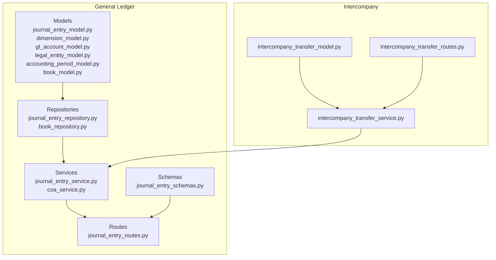
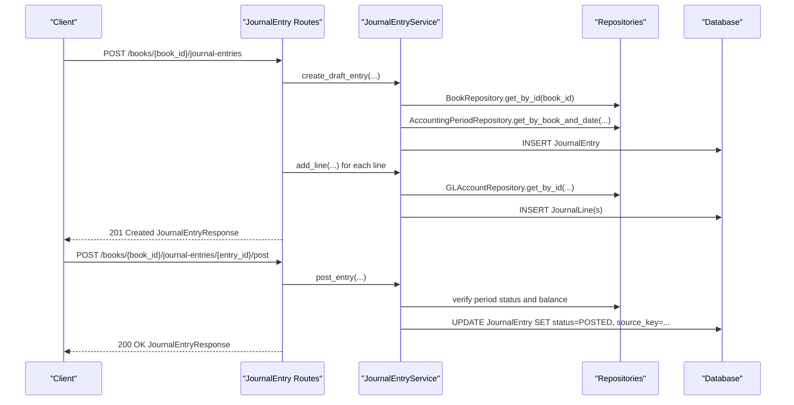
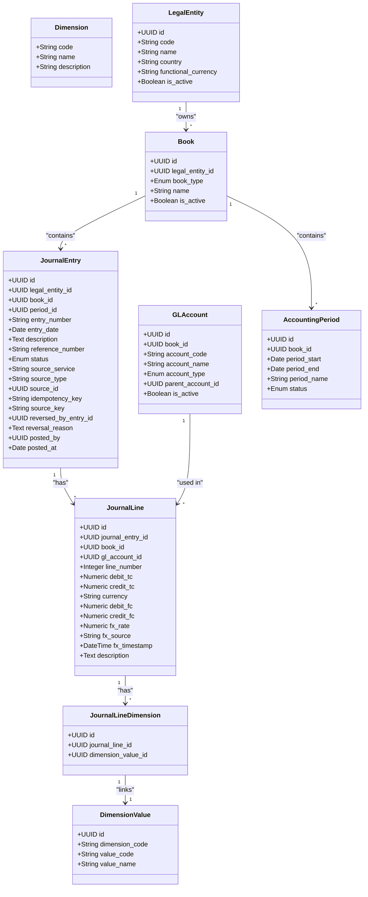
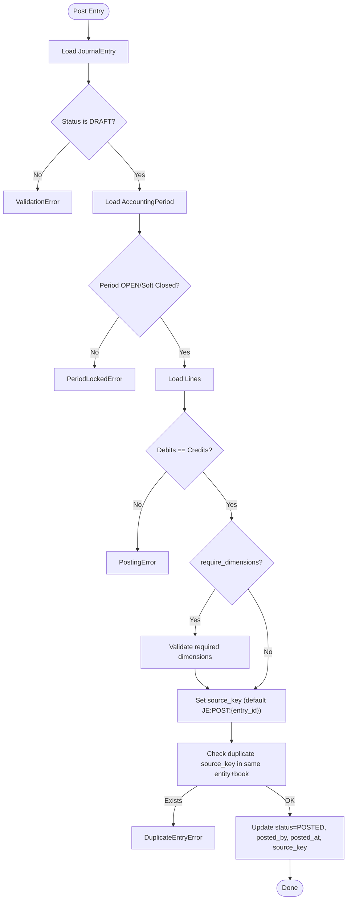
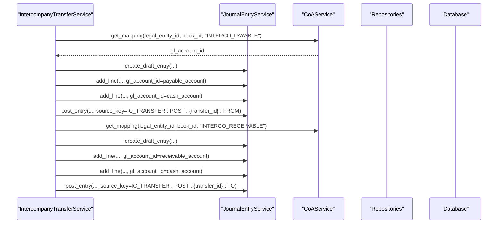
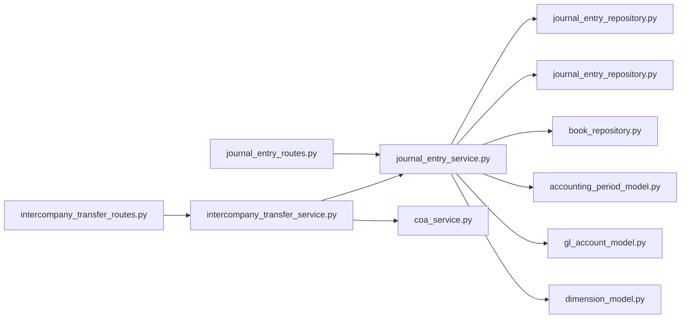

# Journal Entry Processing

<cite>
**Referenced Files in This Document**
- [journal_entry_model.py](file://app/modules/general_ledger/models/journal_entry_model.py)
- [journal_entry_routes.py](file://app/modules/general_ledger/api/routes/journal_entry_routes.py)
- [journal_entry_service.py](file://app/modules/general_ledger/services/journal_entry_service.py)
- [journal_entry_schemas.py](file://app/modules/general_ledger/schemas/journal_entry_schemas.py)
- [journal_entry_repository.py](file://app/modules/general_ledger/repositories/journal_entry_repository.py)
- [dimension_model.py](file://app/modules/general_ledger/models/dimension_model.py)
- [gl_account_model.py](file://app/modules/general_ledger/models/gl_account_model.py)
- [legal_entity_model.py](file://app/modules/general_ledger/models/legal_entity_model.py)
- [accounting_period_model.py](file://app/modules/general_ledger/models/accounting_period_model.py)
- [book_model.py](file://app/modules/general_ledger/models/book_model.py)
- [book_repository.py](file://app/modules/general_ledger/repositories/book_repository.py)
- [coa_service.py](file://app/modules/general_ledger/services/coa_service.py)
- [intercompany_transfer_service.py](file://app/modules/intercompany/services/intercompany_transfer_service.py)
- [intercompany_transfer_model.py](file://app/modules/intercompany/models/intercompany_transfer_model.py)
- [intercompany_transfer_routes.py](file://app/modules/intercompany/api/routes/intercompany_transfer_routes.py)
</cite>

## Table of Contents
1. [Introduction](#introduction)
2. [Project Structure](#project-structure)
3. [Core Components](#core-components)
4. [Architecture Overview](#architecture-overview)
5. [Detailed Component Analysis](#detailed-component-analysis)
6. [Dependency Analysis](#dependency-analysis)
7. [Performance Considerations](#performance-considerations)
8. [Troubleshooting Guide](#troubleshooting-guide)
9. [Conclusion](#conclusion)
10. [Appendices](#appendices)

## Introduction
This document describes the Journal Entry processing system in TrueVow Financial Management. It covers the end-to-end lifecycle of journal entries: creation, validation, posting, reversal, and querying. It documents the models, APIs, services, and repositories involved, along with multi-currency support, exchange rate handling, and integration with other modules such as intercompany transfers and chart of accounts.

## Project Structure
The journal entry subsystem is organized around models, repositories, services, schemas, and API routes under the General Ledger module. Supporting models include dimensions, GL accounts, legal entities, books, and accounting periods. Intercompany module integrates with journal entries for cross-entity transfers.

**Diagram sources**
- [journal_entry_model.py](file://app/modules/general_ledger/models/journal_entry_model.py#L1-L128)
- [journal_entry_routes.py](file://app/modules/general_ledger/api/routes/journal_entry_routes.py#L1-L377)
- [journal_entry_service.py](file://app/modules/general_ledger/services/journal_entry_service.py#L1-L635)
- [journal_entry_repository.py](file://app/modules/general_ledger/repositories/journal_entry_repository.py#L1-L119)
- [dimension_model.py](file://app/modules/general_ledger/models/dimension_model.py#L1-L40)
- [gl_account_model.py](file://app/modules/general_ledger/models/gl_account_model.py#L1-L80)
- [legal_entity_model.py](file://app/modules/general_ledger/models/legal_entity_model.py#L1-L22)
- [accounting_period_model.py](file://app/modules/general_ledger/models/accounting_period_model.py#L1-L50)
- [book_model.py](file://app/modules/general_ledger/models/book_model.py#L1-L36)
- [book_repository.py](file://app/modules/general_ledger/repositories/book_repository.py#L1-L36)
- [coa_service.py](file://app/modules/general_ledger/services/coa_service.py#L1-L143)
- [intercompany_transfer_service.py](file://app/modules/intercompany/services/intercompany_transfer_service.py#L114-L182)
- [intercompany_transfer_model.py](file://app/modules/intercompany/models/intercompany_transfer_model.py#L31-L58)
- [intercompany_transfer_routes.py](file://app/modules/intercompany/api/routes/intercompany_transfer_routes.py#L48-L78)

**Section sources**
- [journal_entry_model.py](file://app/modules/general_ledger/models/journal_entry_model.py#L1-L128)
- [journal_entry_routes.py](file://app/modules/general_ledger/api/routes/journal_entry_routes.py#L1-L377)
- [journal_entry_service.py](file://app/modules/general_ledger/services/journal_entry_service.py#L1-L635)
- [journal_entry_repository.py](file://app/modules/general_ledger/repositories/journal_entry_repository.py#L1-L119)
- [dimension_model.py](file://app/modules/general_ledger/models/dimension_model.py#L1-L40)
- [gl_account_model.py](file://app/modules/general_ledger/models/gl_account_model.py#L1-L80)
- [legal_entity_model.py](file://app/modules/general_ledger/models/legal_entity_model.py#L1-L22)
- [accounting_period_model.py](file://app/modules/general_ledger/models/accounting_period_model.py#L1-L50)
- [book_model.py](file://app/modules/general_ledger/models/book_model.py#L1-L36)
- [book_repository.py](file://app/modules/general_ledger/repositories/book_repository.py#L1-L36)
- [coa_service.py](file://app/modules/general_ledger/services/coa_service.py#L1-L143)
- [intercompany_transfer_service.py](file://app/modules/intercompany/services/intercompany_transfer_service.py#L114-L182)
- [intercompany_transfer_model.py](file://app/modules/intercompany/models/intercompany_transfer_model.py#L31-L58)
- [intercompany_transfer_routes.py](file://app/modules/intercompany/api/routes/intercompany_transfer_routes.py#L48-L78)

## Core Components
- JournalEntry and JournalLine models define the structure of entries and lines, including transaction and functional currency amounts, FX metadata, and dimensions linkage.
- JournalEntryService orchestrates creation, validation, posting, reversal, and bulk line operations.
- JournalEntryRepository and JournalLineRepository provide persistence operations.
- API routes expose endpoints for CRUD, posting, reversal, validation, and bulk line upsert.
- Schemas define request/response contracts for the journal entry API.
- Supporting models: dimensions, GL accounts, legal entities, books, and accounting periods.

Key capabilities:
- Multi-currency: transaction currency (tc) and functional currency (fc) stored separately; FX rate, source, and timestamp supported.
- Dimensions: per-line associations validated during posting when required.
- Idempotency: enforced via idempotency_key and source_key to prevent duplicates.
- Period controls: posting blocked if period is locked.

**Section sources**
- [journal_entry_model.py](file://app/modules/general_ledger/models/journal_entry_model.py#L10-L128)
- [journal_entry_service.py](file://app/modules/general_ledger/services/journal_entry_service.py#L40-L635)
- [journal_entry_repository.py](file://app/modules/general_ledger/repositories/journal_entry_repository.py#L16-L119)
- [journal_entry_routes.py](file://app/modules/general_ledger/api/routes/journal_entry_routes.py#L31-L377)
- [journal_entry_schemas.py](file://app/modules/general_ledger/schemas/journal_entry_schemas.py#L9-L136)
- [dimension_model.py](file://app/modules/general_ledger/models/dimension_model.py#L8-L40)
- [gl_account_model.py](file://app/modules/general_ledger/models/gl_account_model.py#L28-L80)
- [accounting_period_model.py](file://app/modules/general_ledger/models/accounting_period_model.py#L18-L50)

## Architecture Overview
The system follows a layered architecture:
- API layer validates requests and delegates to the service layer.
- Service layer coordinates repositories and enforces business rules (posting, reversal, validation).
- Repository layer handles persistence and queries.
- Models define domain entities and constraints.

**Diagram sources**
- [journal_entry_routes.py](file://app/modules/general_ledger/api/routes/journal_entry_routes.py#L31-L185)
- [journal_entry_service.py](file://app/modules/general_ledger/services/journal_entry_service.py#L53-L242)
- [journal_entry_repository.py](file://app/modules/general_ledger/repositories/journal_entry_repository.py#L16-L75)
- [book_repository.py](file://app/modules/general_ledger/repositories/book_repository.py#L16-L28)
- [accounting_period_model.py](file://app/modules/general_ledger/models/accounting_period_model.py#L18-L50)

## Detailed Component Analysis

### Journal Entry Models
The models define the core entities and constraints:
- JournalEntry: entry-level metadata, source tracking, idempotency, reversal tracking, and status.
- JournalLine: per-line transaction and functional amounts, FX fields, and dimension associations.
- JournalLineDimension: many-to-many link between lines and dimension values.
- Supporting models: GLAccount, Dimension/DimensionValue, LegalEntity, Book, AccountingPeriod.

**Diagram sources**
- [journal_entry_model.py](file://app/modules/general_ledger/models/journal_entry_model.py#L17-L128)
- [gl_account_model.py](file://app/modules/general_ledger/models/gl_account_model.py#L28-L80)
- [dimension_model.py](file://app/modules/general_ledger/models/dimension_model.py#L8-L40)
- [legal_entity_model.py](file://app/modules/general_ledger/models/legal_entity_model.py#L7-L22)
- [book_model.py](file://app/modules/general_ledger/models/book_model.py#L15-L36)
- [accounting_period_model.py](file://app/modules/general_ledger/models/accounting_period_model.py#L18-L50)

**Section sources**
- [journal_entry_model.py](file://app/modules/general_ledger/models/journal_entry_model.py#L10-L128)
- [gl_account_model.py](file://app/modules/general_ledger/models/gl_account_model.py#L9-L80)
- [dimension_model.py](file://app/modules/general_ledger/models/dimension_model.py#L8-L40)
- [legal_entity_model.py](file://app/modules/general_ledger/models/legal_entity_model.py#L7-L22)
- [book_model.py](file://app/modules/general_ledger/models/book_model.py#L9-L36)
- [accounting_period_model.py](file://app/modules/general_ledger/models/accounting_period_model.py#L9-L50)

### Journal Entry Service
Responsibilities:
- Create draft entries with auto-generated entry numbers scoped by book and date.
- Add lines with validation (account in same book, either debit or credit, not both).
- Post entries (enforce balance, period status, dimension requirements, and uniqueness via source_key).
- Reverse entries (create reversal entry with swapped debits/credits).
- Bulk upsert lines (create/update/delete with dimension resolution).
- Validate entries externally via a dedicated endpoint.

**Diagram sources**
- [journal_entry_service.py](file://app/modules/general_ledger/services/journal_entry_service.py#L171-L242)

**Section sources**
- [journal_entry_service.py](file://app/modules/general_ledger/services/journal_entry_service.py#L53-L342)
- [journal_entry_service.py](file://app/modules/general_ledger/services/journal_entry_service.py#L344-L410)
- [journal_entry_service.py](file://app/modules/general_ledger/services/journal_entry_service.py#L410-L635)

### Journal Entry Routes API
Endpoints:
- POST /books/{book_id}/journal-entries: Create a draft entry and lines.
- GET /books/{book_id}/journal-entries: List entries with filters.
- GET /books/{book_id}/journal-entries/{entry_id}: Retrieve entry with lines.
- POST /books/{book_id}/journal-entries/{entry_id}/post: Post entry (idempotent).
- POST /books/{book_id}/journal-entries/{entry_id}/reverse: Reverse a posted entry (idempotent).
- POST /books/{book_id}/journal-entries/{entry_id}:validate: Validate balance and dimensions.
- POST /books/{book_id}/journal-entries/{entry_id}/lines:bulkUpsert: Bulk upsert lines.

Idempotency:
- Uses header Idempotency-Key or request idempotency_key.
- Applies idempotency wrapper with endpoint keys for posting and reversal.

Validation:
- Validates balance and dimension requirements (when posting with require_dimensions).

Bulk Upsert:
- Supports UPSERT and DELETE operations per row with per-row error reporting.

**Section sources**
- [journal_entry_routes.py](file://app/modules/general_ledger/api/routes/journal_entry_routes.py#L31-L84)
- [journal_entry_routes.py](file://app/modules/general_ledger/api/routes/journal_entry_routes.py#L86-L104)
- [journal_entry_routes.py](file://app/modules/general_ledger/api/routes/journal_entry_routes.py#L107-L122)
- [journal_entry_routes.py](file://app/modules/general_ledger/api/routes/journal_entry_routes.py#L124-L185)
- [journal_entry_routes.py](file://app/modules/general_ledger/api/routes/journal_entry_routes.py#L187-L245)
- [journal_entry_routes.py](file://app/modules/general_ledger/api/routes/journal_entry_routes.py#L247-L306)
- [journal_entry_routes.py](file://app/modules/general_ledger/api/routes/journal_entry_routes.py#L309-L377)

### Journal Entry Schemas
- JournalEntryCreate: request for creating a draft entry with lines.
- JournalLineCreate: per-line request with currency, amounts, FX fields, and dimension IDs.
- JournalEntryPostRequest: posting request with actor and dimension requirement flag.
- JournalEntryReverseRequest: reversal request with reason and optional reversal date.
- JournalEntryResponse: full entry with lines.
- JournalLineBulkUpsertItem/Request/Response/Error: bulk upsert contract with per-row errors.

**Section sources**
- [journal_entry_schemas.py](file://app/modules/general_ledger/schemas/journal_entry_schemas.py#L9-L35)
- [journal_entry_schemas.py](file://app/modules/general_ledger/schemas/journal_entry_schemas.py#L37-L48)
- [journal_entry_schemas.py](file://app/modules/general_ledger/schemas/journal_entry_schemas.py#L49-L97)
- [journal_entry_schemas.py](file://app/modules/general_ledger/schemas/journal_entry_schemas.py#L99-L136)

### Multi-Currency and Exchange Rate Handling
- Each JournalLine stores:
  - Transaction currency amounts (debit_tc, credit_tc) and currency.
  - Functional currency amounts (debit_fc, credit_fc).
  - FX rate, FX source, and FX timestamp.
- When FX rate is provided, functional amounts can be derived; otherwise defaults are used.
- Currency is validated as a 3-character ISO code.
- Period locks prevent posting to closed periods.

**Section sources**
- [journal_entry_model.py](file://app/modules/general_ledger/models/journal_entry_model.py#L77-L90)
- [journal_entry_service.py](file://app/modules/general_ledger/services/journal_entry_service.py#L102-L169)
- [journal_entry_service.py](file://app/modules/general_ledger/services/journal_entry_service.py#L410-L635)

### Approval Workflows and Audit Requirements
- Period close workflow: periods have OPEN, SOFT_CLOSED, PENDING_CLOSE_APPROVAL, CLOSED, LOCKED statuses.
- Posting requires period to be OPEN or SOFT_CLOSED; LOCKED blocks posting.
- Journal entries are immutable after posting; reversal creates a new entry and marks original as reversed.
- Audit trail: source_service/source_type/source_id/idempotency_key/source_key track origin and idempotency.
- Reversal reason recorded on the original entry.

**Section sources**
- [accounting_period_model.py](file://app/modules/general_ledger/models/accounting_period_model.py#L9-L50)
- [journal_entry_model.py](file://app/modules/general_ledger/models/journal_entry_model.py#L38-L45)
- [journal_entry_routes.py](file://app/modules/general_ledger/api/routes/journal_entry_routes.py#L124-L185)
- [journal_entry_routes.py](file://app/modules/general_ledger/api/routes/journal_entry_routes.py#L187-L245)

### Integration with Other Modules
- Intercompany transfers:
  - System-generated journal entries for intercompany payable/receivable and optional cash/bank.
  - Uses GL account mappings keyed by entity/book/map_key.
  - Both entities’ books receive synchronized entries with idempotency keys.
- Chart of Accounts:
  - GL account mappings enable automated postings by map_key.
  - CoAService manages mappings and account hierarchies.

**Diagram sources**
- [intercompany_transfer_service.py](file://app/modules/intercompany/services/intercompany_transfer_service.py#L114-L182)
- [coa_service.py](file://app/modules/general_ledger/services/coa_service.py#L135-L143)
- [journal_entry_service.py](file://app/modules/general_ledger/services/journal_entry_service.py#L171-L242)

**Section sources**
- [intercompany_transfer_service.py](file://app/modules/intercompany/services/intercompany_transfer_service.py#L114-L182)
- [intercompany_transfer_model.py](file://app/modules/intercompany/models/intercompany_transfer_model.py#L31-L58)
- [intercompany_transfer_routes.py](file://app/modules/intercompany/api/routes/intercompany_transfer_routes.py#L48-L78)
- [coa_service.py](file://app/modules/general_ledger/services/coa_service.py#L135-L143)

## Dependency Analysis
- Models depend on SQLAlchemy ORM and PostgreSQL UUID types.
- Repositories encapsulate SQL queries and joins.
- Services orchestrate repositories and enforce business rules.
- Routes depend on schemas and core middleware for idempotency and user context.
- Intercompany module depends on GL account mappings and journal entry service.

**Diagram sources**
- [journal_entry_routes.py](file://app/modules/general_ledger/api/routes/journal_entry_routes.py#L1-L377)
- [journal_entry_service.py](file://app/modules/general_ledger/services/journal_entry_service.py#L1-L635)
- [journal_entry_repository.py](file://app/modules/general_ledger/repositories/journal_entry_repository.py#L1-L119)
- [book_repository.py](file://app/modules/general_ledger/repositories/book_repository.py#L1-L36)
- [accounting_period_model.py](file://app/modules/general_ledger/models/accounting_period_model.py#L1-L50)
- [gl_account_model.py](file://app/modules/general_ledger/models/gl_account_model.py#L1-L80)
- [dimension_model.py](file://app/modules/general_ledger/models/dimension_model.py#L1-L40)
- [intercompany_transfer_routes.py](file://app/modules/intercompany/api/routes/intercompany_transfer_routes.py#L48-L78)
- [intercompany_transfer_service.py](file://app/modules/intercompany/services/intercompany_transfer_service.py#L114-L182)
- [coa_service.py](file://app/modules/general_ledger/services/coa_service.py#L1-L143)

**Section sources**
- [journal_entry_routes.py](file://app/modules/general_ledger/api/routes/journal_entry_routes.py#L1-L377)
- [journal_entry_service.py](file://app/modules/general_ledger/services/journal_entry_service.py#L1-L635)
- [journal_entry_repository.py](file://app/modules/general_ledger/repositories/journal_entry_repository.py#L1-L119)
- [intercompany_transfer_routes.py](file://app/modules/intercompany/api/routes/intercompany_transfer_routes.py#L48-L78)
- [intercompany_transfer_service.py](file://app/modules/intercompany/services/intercompany_transfer_service.py#L114-L182)

## Performance Considerations
- Indexes on journal_entry (book_id, period_id, entry_number, entry_date, status, idempotency_key) and journal_line (journal_entry_id, line_number) improve query performance.
- Bulk upsert minimizes round-trips by batching operations and returning per-row errors.
- Period checks and balance verification occur before writes to fail fast.
- Idempotency reduces redundant processing and prevents duplicate postings.

[No sources needed since this section provides general guidance]

## Troubleshooting Guide
Common issues and resolutions:
- Validation errors:
  - Unbalanced entries: ensure debits equal credits.
  - Missing dimension values: attach required dimensions (COST_CENTER, DEPARTMENT, LOCATION) when posting with require_dimensions.
  - Invalid account: account must belong to the same book as the entry.
- Posting errors:
  - Period locked: wait until period is OPEN or SOFT_CLOSED.
  - Duplicate source_key: avoid re-posting the same source_key; use a new idempotency_key if retrying.
- Reversal errors:
  - Only POSTED entries can be reversed; already-reversed entries cannot be reversed again.
- Bulk upsert errors:
  - Per-row error codes indicate invalid account_code, missing required fields, or dimension not found.

**Section sources**
- [journal_entry_routes.py](file://app/modules/general_ledger/api/routes/journal_entry_routes.py#L247-L306)
- [journal_entry_service.py](file://app/modules/general_ledger/services/journal_entry_service.py#L171-L242)
- [journal_entry_service.py](file://app/modules/general_ledger/services/journal_entry_service.py#L244-L313)
- [journal_entry_service.py](file://app/modules/general_ledger/services/journal_entry_service.py#L410-L635)

## Conclusion
The Journal Entry subsystem provides a robust, idempotent, and auditable framework for financial posting. It supports multi-currency with explicit transaction and functional amounts, enforces dimensional controls, integrates with intercompany workflows, and maintains immutability after posting. The separation of concerns across models, repositories, services, and routes ensures maintainability and extensibility.

[No sources needed since this section summarizes without analyzing specific files]

## Appendices

### Typical Journal Entries
- Manual journal entry: draft entry with two or more lines, balanced amounts, and required dimensions.
- Cross-entity transfer: intercompany payable/receivable entries with optional cash/bank adjustments.
- Automated posting: system-generated entries using GL account mappings (e.g., INTERCO_PAYABLE, INTERCO_RECEIVABLE).

**Section sources**
- [intercompany_transfer_service.py](file://app/modules/intercompany/services/intercompany_transfer_service.py#L114-L182)
- [coa_service.py](file://app/modules/general_ledger/services/coa_service.py#L135-L143)

### Consolidation Processes
- Journal entries are posted per book and entity; consolidation occurs at higher levels using intercompany reconciliation and elimination entries generated elsewhere in the system.

[No sources needed since this section provides general guidance]