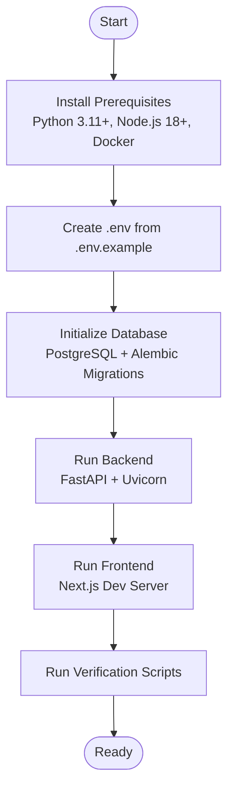
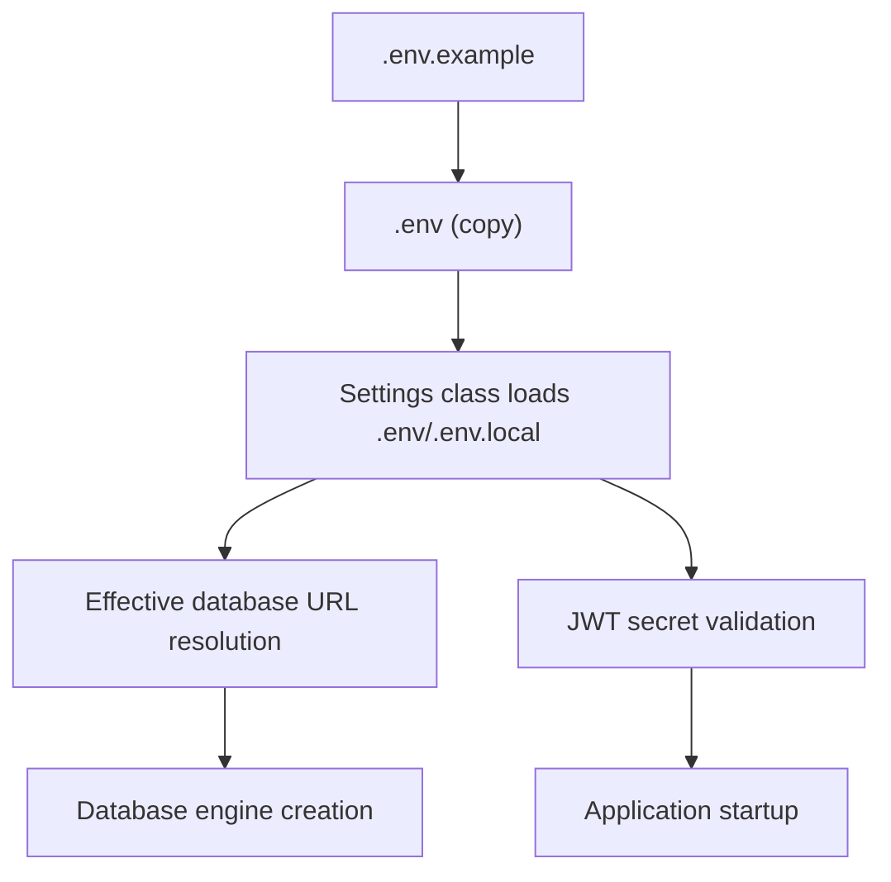
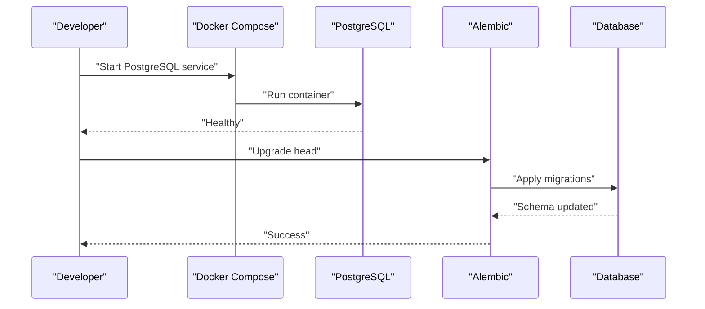
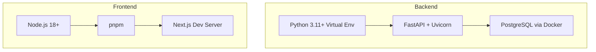
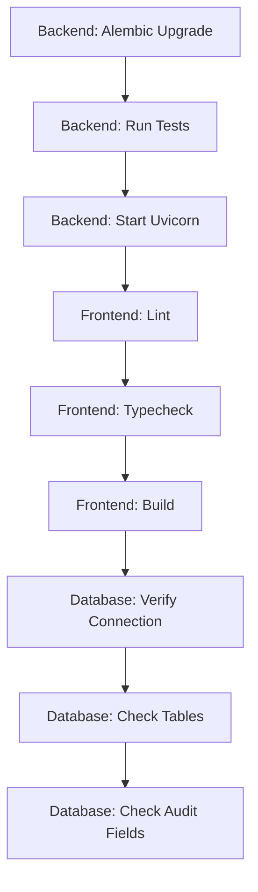
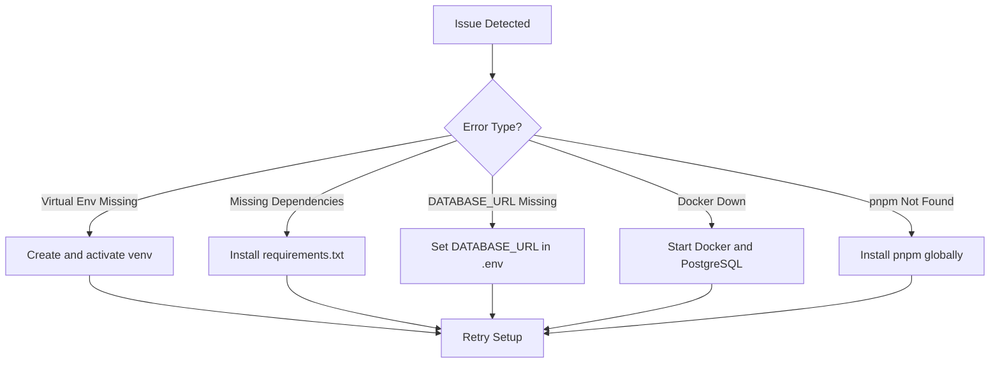

# Getting Started

<cite>
**Referenced Files in This Document**
- [README.md](file://README.md)
- [README_DEV_SETUP.md](file://README_DEV_SETUP.md)
- [.env.example](file://.env.example)
- [requirements.txt](file://requirements.txt)
- [frontend/package.json](file://frontend/package.json)
- [docker-compose.yml](file://docker-compose.yml)
- [Dockerfile](file://Dockerfile)
- [app/main.py](file://app/main.py)
- [app/core/config.py](file://app/core/config.py)
- [app/core/database.py](file://app/core/database.py)
- [scripts/dev_backend.sh](file://scripts/dev_backend.sh)
- [scripts/dev_frontend.sh](file://scripts/dev_frontend.sh)
- [scripts/seed_database.py](file://scripts/seed_database.py)
- [scripts/verify_database.py](file://scripts/verify_database.py)
- [alembic.ini](file://alembic.ini)
- [pytest.ini](file://pytest.ini)
- [frontend/tsconfig.json](file://frontend/tsconfig.json)
</cite>

## Table of Contents
1. [Introduction](#introduction)
2. [Prerequisites](#prerequisites)
3. [Installation Overview](#installation-overview)
4. [Step-by-Step Installation](#step-by-step-installation)
5. [Environment Setup](#environment-setup)
6. [Database Initialization](#database-initialization)
7. [First Run Procedures](#first-run-procedures)
8. [Development Environment Setup](#development-environment-setup)
9. [Verification Steps](#verification-steps)
10. [Troubleshooting Guide](#troubleshooting-guide)
11. [Conclusion](#conclusion)

## Introduction
TrueVow Financial Management is a finance-grade accounting system built with Python and FastAPI for the backend and Next.js for the frontend. It supports Accounts Receivable (AR), Accounts Payable (AP), General Ledger, Payroll, Treasury, Intercompany, and Reporting modules. The system emphasizes security-first design with separate services, databases, and authentication, and integrates with external services for billing and treasury.

This guide walks you through setting up the development environment, configuring environment variables, initializing the database, and running both backend and frontend applications.

## Prerequisites
- Python 3.11+
- Node.js 18+
- Docker Desktop (for PostgreSQL)
- Git

These requirements are validated by the development setup guide and project configuration.

**Section sources**
- [README_DEV_SETUP.md](file://README_DEV_SETUP.md#L7-L13)
- [requirements.txt](file://requirements.txt#L1-L53)
- [frontend/package.json](file://frontend/package.json#L1-L55)

## Installation Overview
The installation process consists of:
- Preparing the environment (Python virtual environment, Node.js, Docker)
- Setting up environment variables
- Initializing the database with migrations
- Running backend and frontend applications
- Verifying the installation

[No sources needed since this diagram shows conceptual workflow, not actual code structure]

## Step-by-Step Installation
Follow these steps to install and run the system locally:

1. Clone the repository and navigate to the project root.
2. Prepare the environment:
   - Create a Python virtual environment and activate it.
   - Install Python dependencies from requirements.txt.
3. Prepare the database:
   - Start PostgreSQL using Docker Compose.
   - Run Alembic migrations to create schema.
4. Prepare the frontend:
   - Install Node.js dependencies using pnpm.
   - Run lint, typecheck, and build.
5. Start the backend and frontend servers.
6. Verify the installation using provided scripts.

**Section sources**
- [README_DEV_SETUP.md](file://README_DEV_SETUP.md#L16-L98)
- [scripts/dev_backend.sh](file://scripts/dev_backend.sh#L1-L77)
- [scripts/dev_frontend.sh](file://scripts/dev_frontend.sh#L1-L64)

## Environment Setup
Create and configure your environment variables:

- Copy `.env.example` to `.env` and edit the required values:
  - DATABASE_URL: PostgreSQL connection string
  - JWT_SECRET_KEY: Generate a secure secret key
- Optional variables:
  - ENVIRONMENT, LOG_LEVEL
  - BILLING_SERVICE_URL and BILLING_SERVICE_API_KEY (for AR sync)
  - TREASURY_SERVICE_URL and TREASURY_SERVICE_API_KEY (for treasury integration)

The backend reads environment variables via a settings class that supports multiple naming conventions and validates required keys.

**Diagram sources**
- [.env.example](file://.env.example#L1-L23)
- [app/core/config.py](file://app/core/config.py#L7-L74)
- [app/core/database.py](file://app/core/database.py#L88-L94)

**Section sources**
- [.env.example](file://.env.example#L1-L23)
- [app/core/config.py](file://app/core/config.py#L7-L74)

## Database Initialization
Initialize the database using Docker Compose and Alembic:

- Start PostgreSQL:
  - Use Docker Compose to start the Postgres service.
- Apply migrations:
  - Run Alembic upgrade to head to create schema and tables.
- Optional: Seed the database with initial data using the seed script.

**Diagram sources**
- [docker-compose.yml](file://docker-compose.yml#L1-L42)
- [alembic.ini](file://alembic.ini#L1-L115)
- [scripts/verify_database.py](file://scripts/verify_database.py#L22-L44)

**Section sources**
- [docker-compose.yml](file://docker-compose.yml#L1-L42)
- [alembic.ini](file://alembic.ini#L1-L115)
- [scripts/seed_database.py](file://scripts/seed_database.py#L1-L53)

## First Run Procedures
After completing setup, start the services:

- Backend:
  - Activate the Python virtual environment.
  - Start the FastAPI server with Uvicorn in reload mode.
- Frontend:
  - Navigate to the frontend directory.
  - Start the Next.js development server.

Optionally, run verification scripts to confirm database connectivity and schema completeness.

**Section sources**
- [README_DEV_SETUP.md](file://README_DEV_SETUP.md#L54-L98)
- [app/main.py](file://app/main.py#L33-L40)

## Development Environment Setup
Set up both backend and frontend environments:

- Backend (FastAPI):
  - Use the automated script or manual steps to create a virtual environment, install dependencies, start PostgreSQL, run migrations, and start the server.
- Frontend (Next.js):
  - Use the automated script or manual steps to install pnpm, dependencies, lint, typecheck, build, and start the dev server.

**Diagram sources**
- [README_DEV_SETUP.md](file://README_DEV_SETUP.md#L16-L98)
- [scripts/dev_backend.sh](file://scripts/dev_backend.sh#L1-L77)
- [scripts/dev_frontend.sh](file://scripts/dev_frontend.sh#L1-L64)

**Section sources**
- [README_DEV_SETUP.md](file://README_DEV_SETUP.md#L16-L98)
- [scripts/dev_backend.sh](file://scripts/dev_backend.sh#L1-L77)
- [scripts/dev_frontend.sh](file://scripts/dev_frontend.sh#L1-L64)

## Verification Steps
Verify your installation using the following commands:

- Backend:
  - Run Alembic upgrade to head.
  - Execute tests with pytest.
  - Start the Uvicorn server.
- Frontend:
  - Run lint checks.
  - Run typecheck.
  - Build the project.
- Database:
  - Use the verification script to test connection, check tables, and verify audit fields.

**Diagram sources**
- [README_DEV_SETUP.md](file://README_DEV_SETUP.md#L132-L147)
- [pytest.ini](file://pytest.ini#L1-L8)
- [scripts/verify_database.py](file://scripts/verify_database.py#L213-L240)

**Section sources**
- [README_DEV_SETUP.md](file://README_DEV_SETUP.md#L132-L147)
- [pytest.ini](file://pytest.ini#L1-L8)
- [scripts/verify_database.py](file://scripts/verify_database.py#L213-L240)

## Troubleshooting Guide
Common setup issues and resolutions:

- Virtual environment not found:
  - Create and activate the virtual environment.
- Missing dependencies:
  - Activate the virtual environment and install dependencies from requirements.txt.
- DATABASE_URL not set:
  - Copy .env.example to .env and fill in DATABASE_URL.
- Docker not running:
  - Start Docker Desktop and run the PostgreSQL service.
- pnpm not found:
  - Install pnpm globally.

**Diagram sources**
- [README_DEV_SETUP.md](file://README_DEV_SETUP.md#L151-L171)

**Section sources**
- [README_DEV_SETUP.md](file://README_DEV_SETUP.md#L151-L171)

## Conclusion
You now have the TrueVow Financial Management system running locally. The backend is configured with FastAPI and PostgreSQL, while the frontend runs with Next.js. Use the provided scripts and verification steps to ensure everything is set up correctly. For ongoing development, follow the established patterns for environment variables, migrations, and testing.