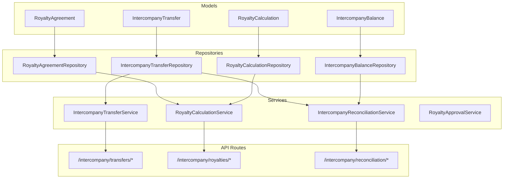
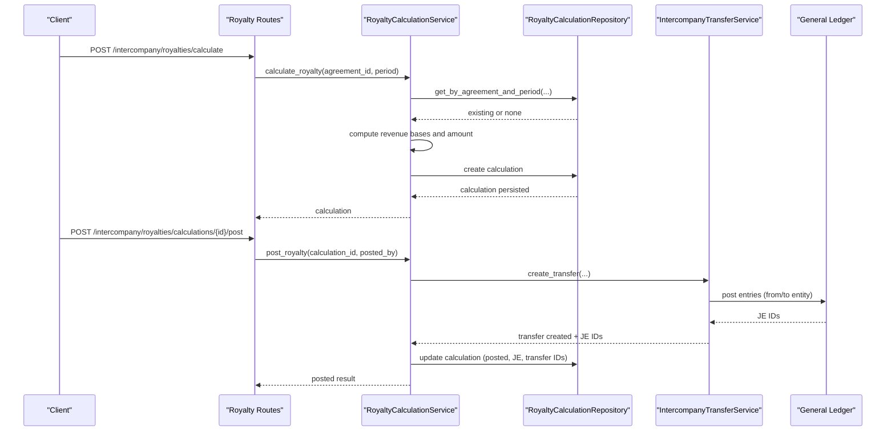
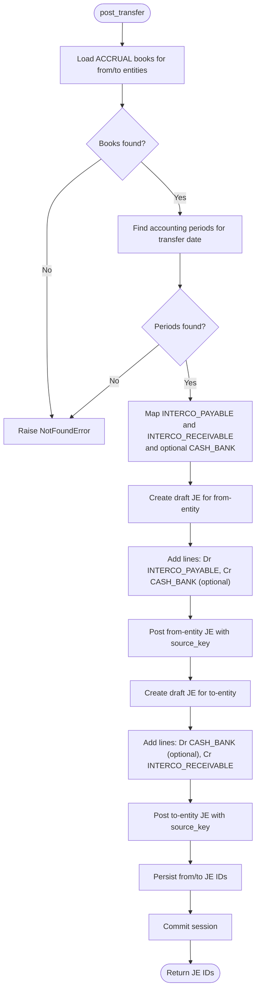
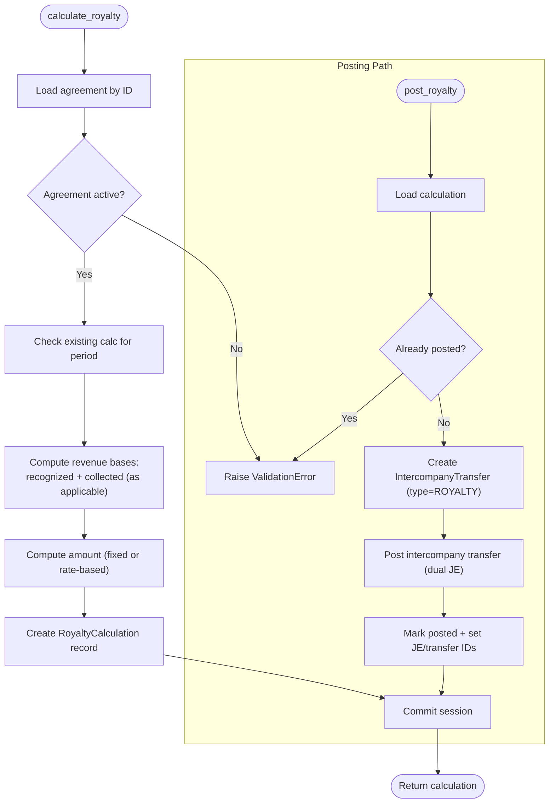
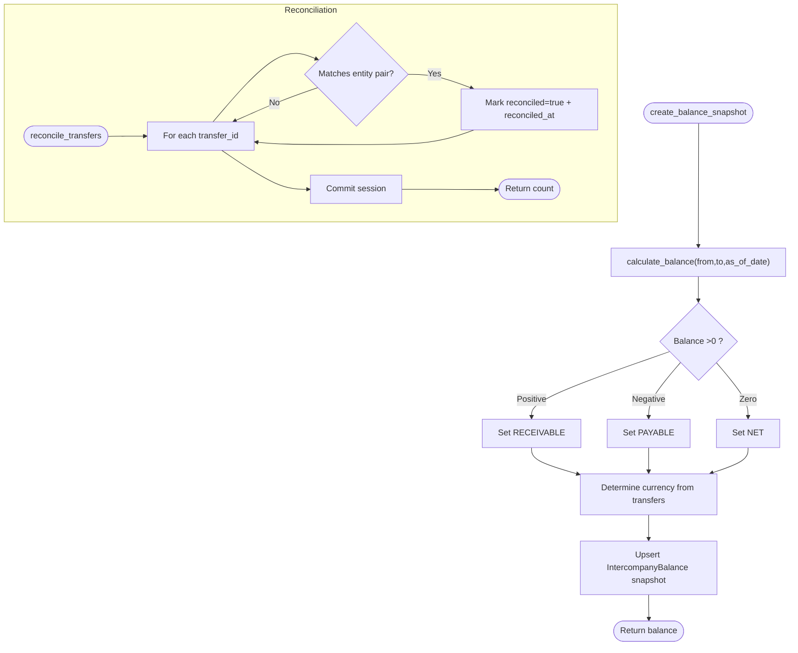
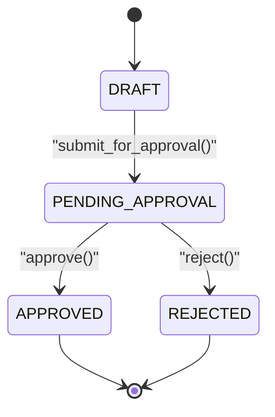
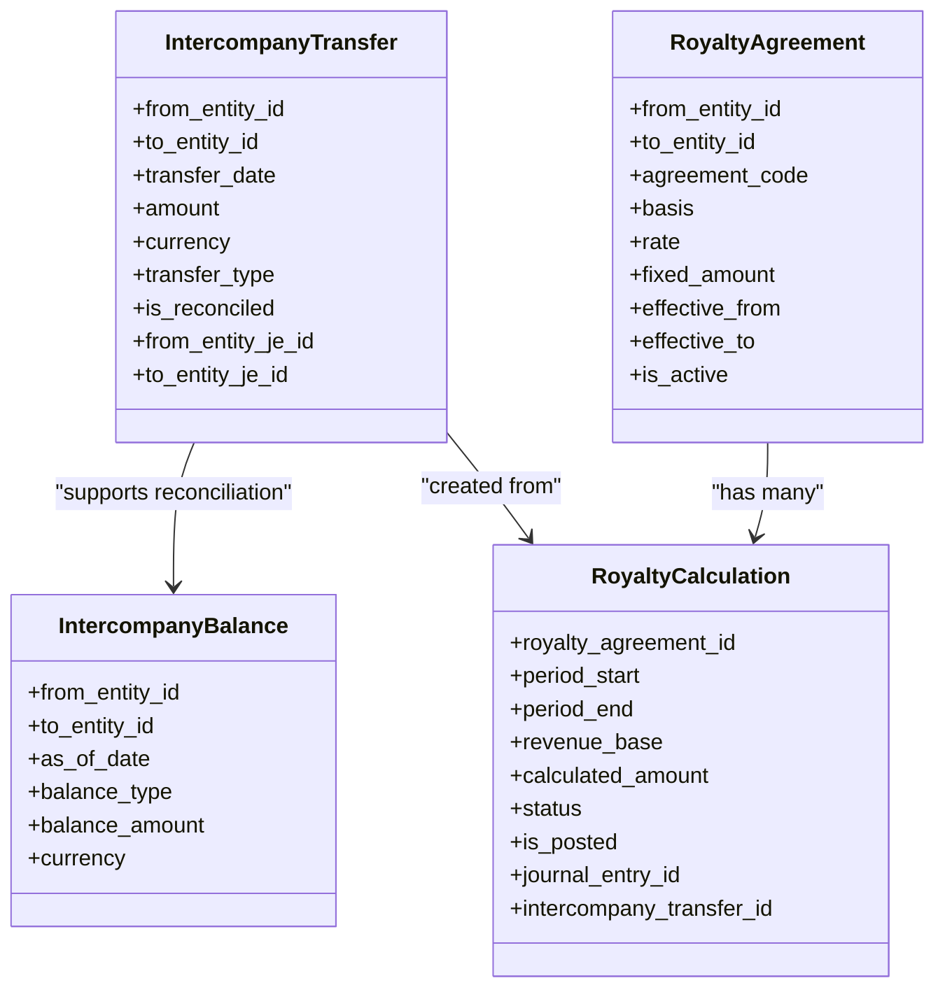
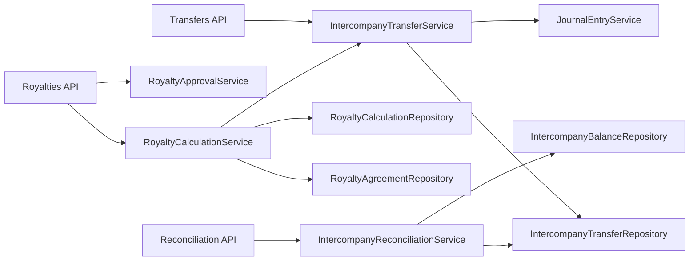

# Intercompany Module

<cite>
**Referenced Files in This Document**
- [intercompany_transfer_model.py](file://app/modules/intercompany/models/intercompany_transfer_model.py)
- [royalty_model.py](file://app/modules/intercompany/models/royalty_model.py)
- [intercompany_balance_model.py](file://app/modules/intercompany/models/intercompany_balance_model.py)
- [intercompany_schemas.py](file://app/modules/intercompany/schemas/intercompany_schemas.py)
- [intercompany_transfer_service.py](file://app/modules/intercompany/services/intercompany_transfer_service.py)
- [royalty_calculation_service.py](file://app/modules/intercompany/services/royalty_calculation_service.py)
- [intercompany_reconciliation_service.py](file://app/modules/intercompany/services/intercompany_reconciliation_service.py)
- [royalty_approval_service.py](file://app/modules/intercompany/services/royalty_approval_service.py)
- [intercompany_transfer_routes.py](file://app/modules/intercompany/api/routes/intercompany_transfer_routes.py)
- [royalty_routes.py](file://app/modules/intercompany/api/routes/royalty_routes.py)
- [reconciliation_routes.py](file://app/modules/intercompany/api/routes/reconciliation_routes.py)
- [intercompany_transfer_repository.py](file://app/modules/intercompany/repositories/intercompany_transfer_repository.py)
- [royalty_repository.py](file://app/modules/intercompany/repositories/royalty_repository.py)
- [intercompany_balance_repository.py](file://app/modules/intercompany/repositories/intercompany_balance_repository.py)
</cite>

## Table of Contents
1. [Introduction](#introduction)
2. [Project Structure](#project-structure)
3. [Core Components](#core-components)
4. [Architecture Overview](#architecture-overview)
5. [Detailed Component Analysis](#detailed-component-analysis)
6. [Dependency Analysis](#dependency-analysis)
7. [Performance Considerations](#performance-considerations)
8. [Troubleshooting Guide](#troubleshooting-guide)
9. [Conclusion](#conclusion)
10. [Appendices](#appendices)

## Introduction
The Intercompany module manages financial flows and accounting across legal entities within an organization. It supports:
- Intercompany transfer management (creation, posting, reconciliation)
- Royalty calculation and approval workflows
- Cross-entity balance tracking and reconciliation reporting
- Consolidation-ready data via dual-entity journal entries and intercompany elimination references

This document explains the models, services, repositories, and API routes that implement intercompany transfer processing, royalty accruals, cross-entity reconciliation, and consolidated reporting. It also provides examples of typical workflows and guidance for consolidation and compliance.

## Project Structure
The Intercompany module follows a layered architecture:
- Models define domain entities and enumerations
- Repositories encapsulate persistence logic
- Services orchestrate business logic and integrate with other modules (e.g., General Ledger)
- Schemas validate and serialize API requests/responses
- API routes expose endpoints for transfers, royalties, and reconciliation

**Diagram sources**
- [intercompany_transfer_model.py](file://app/modules/intercompany/models/intercompany_transfer_model.py#L16-L59)
- [royalty_model.py](file://app/modules/intercompany/models/royalty_model.py#L27-L98)
- [intercompany_balance_model.py](file://app/modules/intercompany/models/intercompany_balance_model.py#L17-L39)
- [intercompany_transfer_repository.py](file://app/modules/intercompany/repositories/intercompany_transfer_repository.py#L12-L101)
- [royalty_repository.py](file://app/modules/intercompany/repositories/royalty_repository.py#L15-L107)
- [intercompany_balance_repository.py](file://app/modules/intercompany/repositories/intercompany_balance_repository.py#L14-L55)
- [intercompany_transfer_service.py](file://app/modules/intercompany/services/intercompany_transfer_service.py#L17-L232)
- [royalty_calculation_service.py](file://app/modules/intercompany/services/royalty_calculation_service.py#L21-L202)
- [intercompany_reconciliation_service.py](file://app/modules/intercompany/services/intercompany_reconciliation_service.py#L14-L168)
- [royalty_approval_service.py](file://app/modules/intercompany/services/royalty_approval_service.py#L25-L254)
- [intercompany_transfer_routes.py](file://app/modules/intercompany/api/routes/intercompany_transfer_routes.py#L18-L179)
- [royalty_routes.py](file://app/modules/intercompany/api/routes/royalty_routes.py#L29-L269)
- [reconciliation_routes.py](file://app/modules/intercompany/api/routes/reconciliation_routes.py#L12-L109)

**Section sources**
- [intercompany_transfer_model.py](file://app/modules/intercompany/models/intercompany_transfer_model.py#L1-L59)
- [royalty_model.py](file://app/modules/intercompany/models/royalty_model.py#L1-L98)
- [intercompany_balance_model.py](file://app/modules/intercompany/models/intercompany_balance_model.py#L1-L39)
- [intercompany_transfer_routes.py](file://app/modules/intercompany/api/routes/intercompany_transfer_routes.py#L1-L179)
- [royalty_routes.py](file://app/modules/intercompany/api/routes/royalty_routes.py#L1-L269)
- [reconciliation_routes.py](file://app/modules/intercompany/api/routes/reconciliation_routes.py#L1-L109)

## Core Components
- IntercompanyTransfer: Records cross-entity transfers with dual-book journal entry linkage and reconciliation flags.
- RoyaltyAgreement: Defines intercompany royalty terms (basis, rates, fixed amounts) and validity windows.
- RoyaltyCalculation: Stores calculated amounts per period with approval workflow and posting metadata.
- IntercompanyBalance: Snapshots net/receivable/payable positions between entity pairs.

Key enumerations:
- TransferDirection: FROM_ENTITY, TO_ENTITY
- RoyaltyBasis: REVENUE, RECOGNIZED_REVENUE, COLLECTED_REVENUE, FIXED
- BalanceType: NET, RECEIVABLE, PAYABLE

**Section sources**
- [intercompany_transfer_model.py](file://app/modules/intercompany/models/intercompany_transfer_model.py#L10-L59)
- [royalty_model.py](file://app/modules/intercompany/models/royalty_model.py#L10-L51)
- [intercompany_balance_model.py](file://app/modules/intercompany/models/intercompany_balance_model.py#L10-L39)

## Architecture Overview
The module integrates tightly with General Ledger for dual-entity journal entries and with AR/AP for revenue bases. The service layer coordinates:
- IntercompanyTransferService: Creates transfers, posts to both entities’ books, and updates JE IDs
- RoyaltyCalculationService: Computes royalty based on AR/AP and revenue schedules, then posts as intercompany transfers
- IntercompanyReconciliationService: Calculates balances, creates snapshots, and reconciles transfers
- RoyaltyApprovalService: Manages approval workflow with SoD checks and audit logs

**Diagram sources**
- [royalty_routes.py](file://app/modules/intercompany/api/routes/royalty_routes.py#L107-L206)
- [royalty_calculation_service.py](file://app/modules/intercompany/services/royalty_calculation_service.py#L31-L202)
- [intercompany_transfer_service.py](file://app/modules/intercompany/services/intercompany_transfer_service.py#L72-L220)
- [intercompany_transfer_repository.py](file://app/modules/intercompany/repositories/intercompany_transfer_repository.py#L12-L101)

## Detailed Component Analysis

### Intercompany Transfer Service
Responsibilities:
- Validate entities and uniqueness
- Create transfer records
- Post to both entities’ ACCRUAL books with dual journal entries
- Link journal entries and update reconciliation flags
- Retrieve account mappings for intercompany accounts and cash/bank

Processing logic:
- Fetch ACCRUAL books and accounting periods for both entities
- Build dual journal entries (Dr Intercompany Payable / Cr Cash/Bank for from-entity; Dr Cash/Bank / Cr Intercompany Receivable for to-entity)
- Post entries with idempotency keys scoped to the from-entity ACCRUAL book
- Persist JE IDs and commit

**Diagram sources**
- [intercompany_transfer_service.py](file://app/modules/intercompany/services/intercompany_transfer_service.py#L72-L220)

**Section sources**
- [intercompany_transfer_service.py](file://app/modules/intercompany/services/intercompany_transfer_service.py#L17-L232)

### Royalty Calculation Service
Responsibilities:
- Compute royalty based on agreement basis (REVENUE, RECOGNIZED_REVENUE, COLLECTED_REVENUE, FIXED)
- Retrieve recognized revenue from revenue schedules filtered by entity
- Retrieve collected revenue from AR payments filtered by entity
- Create royalty calculation records with computed amounts
- Post royalty as intercompany transfer and link journal entries and transfer

**Diagram sources**
- [royalty_calculation_service.py](file://app/modules/intercompany/services/royalty_calculation_service.py#L31-L202)

**Section sources**
- [royalty_calculation_service.py](file://app/modules/intercompany/services/royalty_calculation_service.py#L21-L202)

### Intercompany Reconciliation Service
Responsibilities:
- Calculate net intercompany balance between entity pairs up to a date
- Create balance snapshots with RECEIVABLE/PAYABLE/NET classification
- Reconcile transfers by marking them as reconciled
- Generate reconciliation reports with counts and transfer details

**Diagram sources**
- [intercompany_reconciliation_service.py](file://app/modules/intercompany/services/intercompany_reconciliation_service.py#L22-L168)

**Section sources**
- [intercompany_reconciliation_service.py](file://app/modules/intercompany/services/intercompany_reconciliation_service.py#L14-L168)

### Royalty Approval Service
Responsibilities:
- Manage state transitions for royalty runs: DRAFT → PENDING_APPROVAL → APPROVED/REJECTED
- Enforce SoD (Segregation of Duties) constraints during approvals
- Log audit actions with before/after statuses and reasons
- Support row-version optimistic locking for concurrency safety

**Diagram sources**
- [royalty_approval_service.py](file://app/modules/intercompany/services/royalty_approval_service.py#L25-L254)

**Section sources**
- [royalty_approval_service.py](file://app/modules/intercompany/services/royalty_approval_service.py#L25-L254)

### Intercompany Models
- IntercompanyTransfer: Links to legal entities, treasury accounts/transactions, and dual journal entries; tracks reconciliation status.
- RoyaltyAgreement: Defines basis, rate/fixed amount, currency, and validity window; links to legal entities.
- RoyaltyCalculation: Stores computed amounts per period, approval workflow fields, and posting metadata.
- IntercompanyBalance: Snapshot of balances with unique constraint per entity pair/date/type.

**Diagram sources**
- [intercompany_transfer_model.py](file://app/modules/intercompany/models/intercompany_transfer_model.py#L16-L59)
- [royalty_model.py](file://app/modules/intercompany/models/royalty_model.py#L27-L98)
- [intercompany_balance_model.py](file://app/modules/intercompany/models/intercompany_balance_model.py#L17-L39)

**Section sources**
- [intercompany_transfer_model.py](file://app/modules/intercompany/models/intercompany_transfer_model.py#L16-L59)
- [royalty_model.py](file://app/modules/intercompany/models/royalty_model.py#L27-L98)
- [intercompany_balance_model.py](file://app/modules/intercompany/models/intercompany_balance_model.py#L17-L39)

### Intercompany API Routes
Endpoints:
- Transfers
  - POST /intercompany/transfers
  - POST /intercompany/transfers/{transfer_id}/post
  - GET /intercompany/transfers
  - GET /intercompany/transfers/{transfer_id}
  - GET /intercompany/transfers/balance
- Royalties
  - POST /intercompany/royalties/agreements
  - GET /intercompany/royalties/agreements
  - GET /intercompany/royalties/agreements/{agreement_id}
  - POST /intercompany/royalties/calculate
  - POST /intercompany/royalties/runs/{run_id}/submit-approval
  - POST /intercompany/royalties/runs/{run_id}/approve
  - POST /intercompany/royalties/runs/{run_id}/reject
  - POST /intercompany/royalties/calculations/{calculation_id}/post
  - GET /intercompany/royalties/calculations/unposted
- Reconciliation
  - POST /intercompany/reconciliation/balance-snapshot
  - POST /intercompany/reconciliation/reconcile
  - GET /intercompany/reconciliation/report
  - GET /intercompany/reconciliation/balance

Idempotency:
- Transfer posting and royalty posting endpoints apply idempotency scoping to the from-entity ACCRUAL book.

**Section sources**
- [intercompany_transfer_routes.py](file://app/modules/intercompany/api/routes/intercompany_transfer_routes.py#L18-L179)
- [royalty_routes.py](file://app/modules/intercompany/api/routes/royalty_routes.py#L29-L269)
- [reconciliation_routes.py](file://app/modules/intercompany/api/routes/reconciliation_routes.py#L12-L109)

## Dependency Analysis
- Services depend on repositories for persistence and on General Ledger services for journal entries.
- Routes depend on services and enforce idempotency for critical posting endpoints.
- Models define relationships and constraints; repositories implement queries; services coordinate workflows.

**Diagram sources**
- [intercompany_transfer_routes.py](file://app/modules/intercompany/api/routes/intercompany_transfer_routes.py#L18-L179)
- [royalty_routes.py](file://app/modules/intercompany/api/routes/royalty_routes.py#L29-L269)
- [reconciliation_routes.py](file://app/modules/intercompany/api/routes/reconciliation_routes.py#L12-L109)
- [intercompany_transfer_service.py](file://app/modules/intercompany/services/intercompany_transfer_service.py#L17-L232)
- [royalty_calculation_service.py](file://app/modules/intercompany/services/royalty_calculation_service.py#L21-L202)
- [intercompany_reconciliation_service.py](file://app/modules/intercompany/services/intercompany_reconciliation_service.py#L14-L168)

**Section sources**
- [intercompany_transfer_service.py](file://app/modules/intercompany/services/intercompany_transfer_service.py#L17-L232)
- [royalty_calculation_service.py](file://app/modules/intercompany/services/royalty_calculation_service.py#L21-L202)
- [intercompany_reconciliation_service.py](file://app/modules/intercompany/services/intercompany_reconciliation_service.py#L14-L168)

## Performance Considerations
- Queries use indexed fields (entity IDs, dates) to minimize scans.
- Calculations fetch only required aggregates (recognized revenue and collected payments) and avoid unnecessary joins.
- Idempotency scopes reduce duplicate postings and retries.
- Batch listing endpoints support pagination and filtering to control payload sizes.

[No sources needed since this section provides general guidance]

## Troubleshooting Guide
Common issues and resolutions:
- Not found errors when entities or books are missing during posting
  - Ensure legal entities exist and ACCRUAL books are configured for both entities.
- Validation errors for invalid transfers (same from/to entity, zero/negative amounts)
  - Validate entity IDs and amount constraints before creation.
- Approval workflow errors (SoD violations, wrong status)
  - Confirm user role, row version, and current status before submitting/approving/rejecting.
- Duplicate posting attempts
  - Use idempotency keys to prevent reprocessing; verify posted status before retrying.

**Section sources**
- [intercompany_transfer_service.py](file://app/modules/intercompany/services/intercompany_transfer_service.py#L42-L70)
- [royalty_approval_service.py](file://app/modules/intercompany/services/royalty_approval_service.py#L54-L82)
- [intercompany_transfer_routes.py](file://app/modules/intercompany/api/routes/intercompany_transfer_routes.py#L78-L99)

## Conclusion
The Intercompany module provides a robust framework for managing intra-entity financial flows, royalty computations, and cross-entity reconciliation. Its dual-entity journal entry design ensures consolidation readiness, while approval workflows and SoD enforcement support governance and compliance. The modular architecture enables maintainability and extensibility for future enhancements.

[No sources needed since this section summarizes without analyzing specific files]

## Appendices

### Example Workflows

- Intercompany Transaction Processing
  - Create transfer: POST /intercompany/transfers
  - Post transfer: POST /intercompany/transfers/{id}/post (idempotent)
  - Verify reconciliation flag and linked journal entries

- Royalty Accruals
  - Create agreement: POST /intercompany/royalties/agreements
  - Calculate royalty: POST /intercompany/royalties/calculate
  - Submit for approval: POST /intercompany/royalties/runs/{run_id}/submit-approval
  - Approve: POST /intercompany/royalties/runs/{run_id}/approve
  - Post royalty: POST /intercompany/royalties/calculations/{id}/post (idempotent)

- Elimination Procedures
  - Use the dual journal entries generated during transfer posting to eliminate intercompany receivables/payables in consolidation.
  - Reference the intercompany transfer ID and journal entry IDs for auditability.

- Cross-Entity Reconciliation
  - Create balance snapshot: POST /intercompany/reconciliation/balance-snapshot
  - Reconcile transfers: POST /intercompany/reconciliation/reconcile
  - Generate report: GET /intercompany/reconciliation/report

[No sources needed since this section provides general guidance]

### Consolidation and Regulatory Compliance Notes
- Dual-entity journal entries ensure proper elimination entries in consolidated statements.
- Approval workflows and audit logs support SOX-like controls.
- Idempotency and row-version handling improve data integrity and reduce risk of duplicate postings.

[No sources needed since this section provides general guidance]