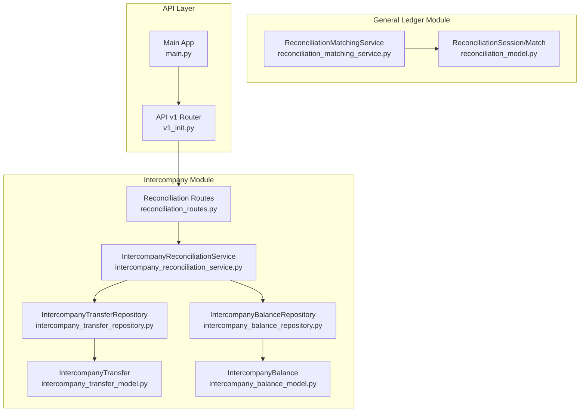
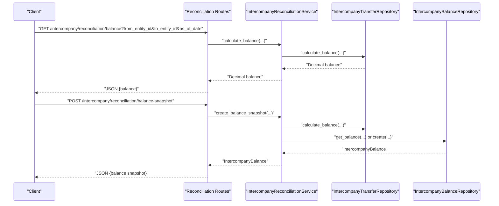
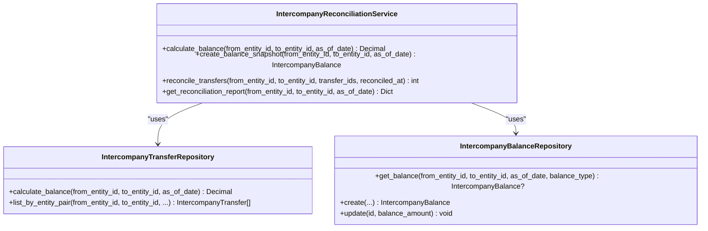
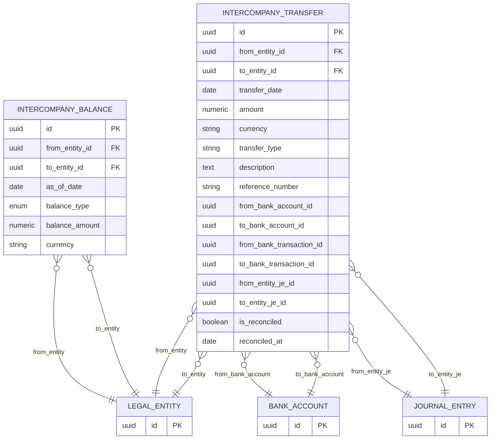
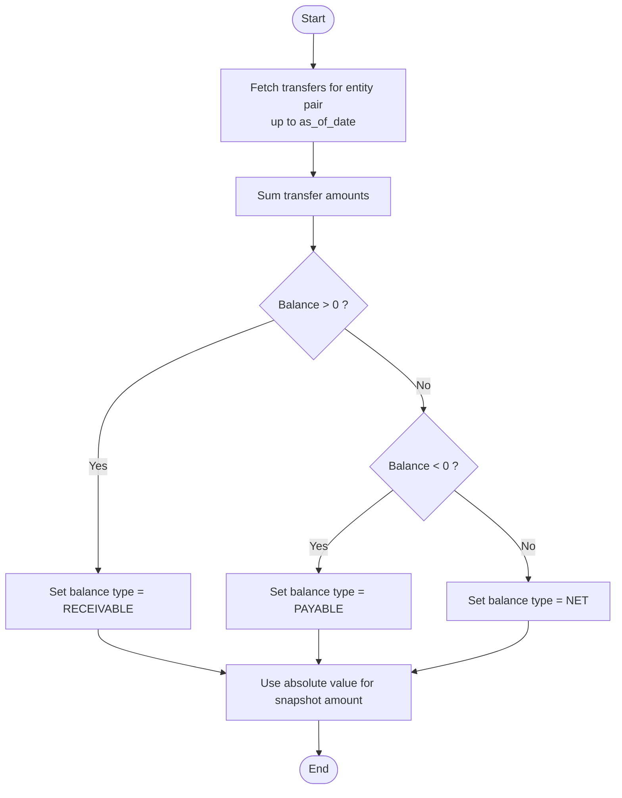
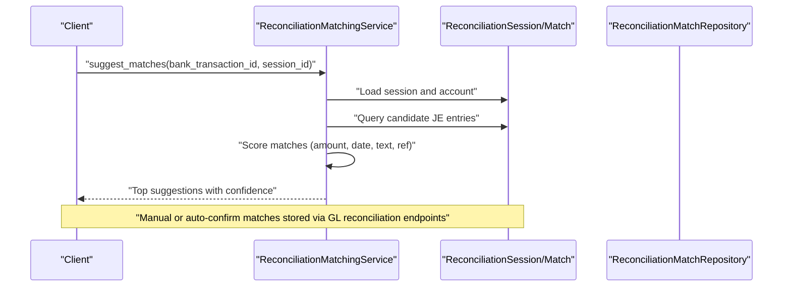
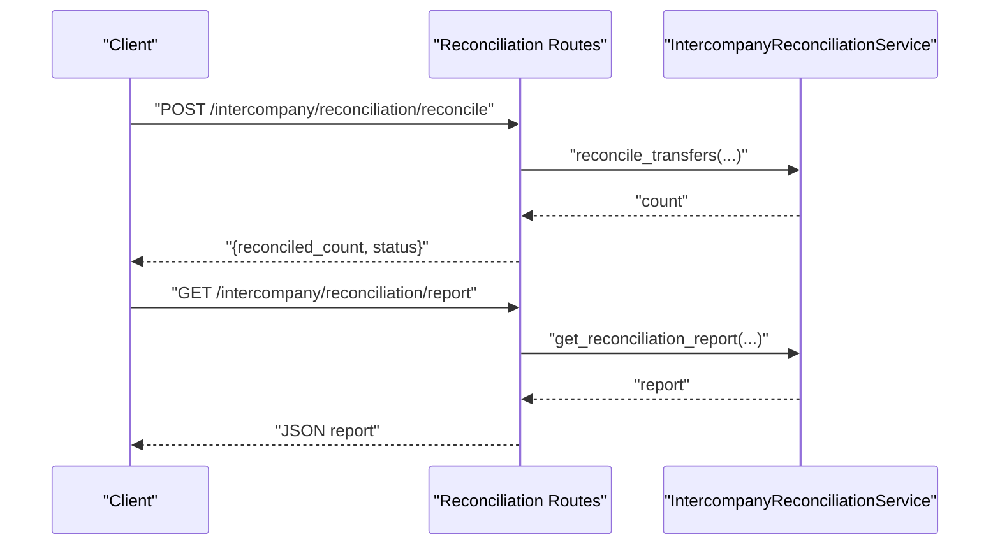
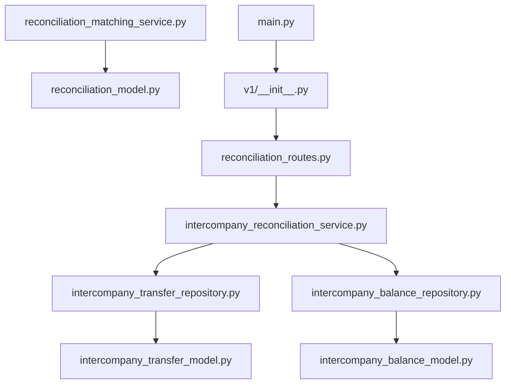
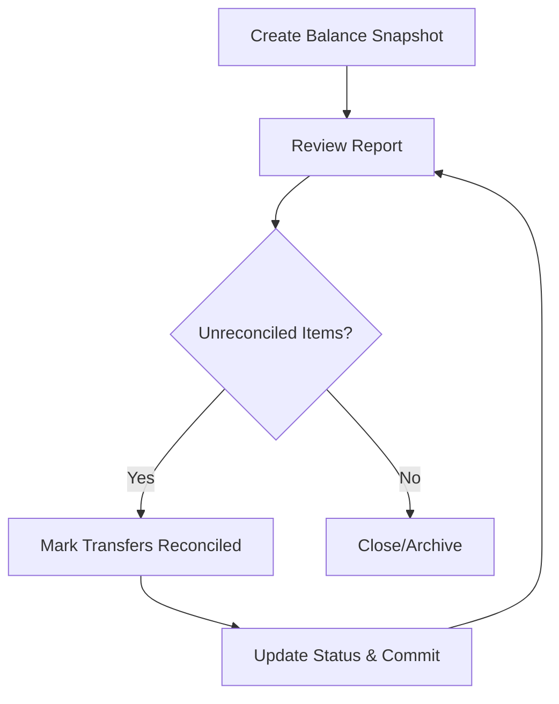

# Intercompany Reconciliation

<cite>
**Referenced Files in This Document**
- [intercompany_reconciliation_service.py](file://app/modules/intercompany/services/intercompany_reconciliation_service.py)
- [intercompany_balance_model.py](file://app/modules/intercompany/models/intercompany_balance_model.py)
- [intercompany_transfer_model.py](file://app/modules/intercompany/models/intercompany_transfer_model.py)
- [intercompany_balance_repository.py](file://app/modules/intercompany/repositories/intercompany_balance_repository.py)
- [intercompany_transfer_repository.py](file://app/modules/intercompany/repositories/intercompany_transfer_repository.py)
- [reconciliation_routes.py](file://app/modules/intercompany/api/routes/reconciliation_routes.py)
- [intercompany_schemas.py](file://app/modules/intercompany/schemas/intercompany_schemas.py)
- [intercompany_transfer_service.py](file://app/modules/intercompany/services/intercompany_transfer_service.py)
- [v1_init.py](file://app/api/v1/__init__.py)
- [main.py](file://app/main.py)
- [reconciliation_model.py](file://app/modules/general_ledger/models/reconciliation_model.py)
- [reconciliation_matching_service.py](file://app/modules/general_ledger/services/reconciliation_matching_service.py)
- [ADDENDUM_B_RECONCILIATION_MATCHING.md](file://docs/01-main/ADDENDUM_B_RECONCILIATION_MATCHING.md)
</cite>

## Table of Contents
1. [Introduction](#introduction)
2. [Project Structure](#project-structure)
3. [Core Components](#core-components)
4. [Architecture Overview](#architecture-overview)
5. [Detailed Component Analysis](#detailed-component-analysis)
6. [Dependency Analysis](#dependency-analysis)
7. [Performance Considerations](#performance-considerations)
8. [Troubleshooting Guide](#troubleshooting-guide)
9. [Conclusion](#conclusion)
10. [Appendices](#appendices)

## Introduction
This document describes the Intercompany Reconciliation system, focusing on balance calculation, elimination procedures, and reconciliation matching. It explains the IntercompanyReconciliationService implementation, intra-entity transaction matching, outstanding balance tracking, and consolidation adjustments. It also documents intercompany balance models, entity pair relationships, balance aging, and reconciliation status tracking. The reconciliation API endpoints for balance queries, reconciliation sessions, and adjustment processing are covered, along with examples of intercompany receivable/payable matching, timing differences resolution, and elimination entries. Finally, reconciliation workflows, exception handling, and audit procedures are addressed.

## Project Structure
The Intercompany Reconciliation system is implemented within the intercompany module and integrates with general ledger and treasury components. The API is exposed under the v1 router and registered in the main application.

**Diagram sources**
- [reconciliation_routes.py](file://app/modules/intercompany/api/routes/reconciliation_routes.py#L1-L109)
- [intercompany_reconciliation_service.py](file://app/modules/intercompany/services/intercompany_reconciliation_service.py#L1-L168)
- [intercompany_transfer_repository.py](file://app/modules/intercompany/repositories/intercompany_transfer_repository.py#L1-L101)
- [intercompany_balance_repository.py](file://app/modules/intercompany/repositories/intercompany_balance_repository.py#L1-L55)
- [intercompany_transfer_model.py](file://app/modules/intercompany/models/intercompany_transfer_model.py#L1-L59)
- [intercompany_balance_model.py](file://app/modules/intercompany/models/intercompany_balance_model.py#L1-L39)
- [reconciliation_model.py](file://app/modules/general_ledger/models/reconciliation_model.py#L1-L68)
- [reconciliation_matching_service.py](file://app/modules/general_ledger/services/reconciliation_matching_service.py#L1-L270)
- [v1_init.py](file://app/api/v1/__init__.py#L26-L62)
- [main.py](file://app/main.py#L29-L30)

**Section sources**
- [v1_init.py](file://app/api/v1/__init__.py#L26-L62)
- [main.py](file://app/main.py#L29-L30)

## Core Components
- IntercompanyReconciliationService orchestrates reconciliation operations: balance calculation, balance snapshot creation, transfer reconciliation, and reconciliation reporting.
- IntercompanyTransferRepository encapsulates transfer queries and balance computation for entity pairs.
- IntercompanyBalanceRepository manages balance snapshots with uniqueness constraints per entity pair, date, and balance type.
- IntercompanyTransfer and IntercompanyBalance models define the domain entities and their relationships.
- Reconciliation routes expose endpoints for balance snapshots, reconciliation, reporting, and balance queries.

**Section sources**
- [intercompany_reconciliation_service.py](file://app/modules/intercompany/services/intercompany_reconciliation_service.py#L14-L168)
- [intercompany_transfer_repository.py](file://app/modules/intercompany/repositories/intercompany_transfer_repository.py#L12-L101)
- [intercompany_balance_repository.py](file://app/modules/intercompany/repositories/intercompany_balance_repository.py#L14-L55)
- [intercompany_transfer_model.py](file://app/modules/intercompany/models/intercompany_transfer_model.py#L16-L59)
- [intercompany_balance_model.py](file://app/modules/intercompany/models/intercompany_balance_model.py#L17-L39)
- [reconciliation_routes.py](file://app/modules/intercompany/api/routes/reconciliation_routes.py#L15-L109)

## Architecture Overview
The reconciliation workflow connects API routes to the service layer, repositories, and models. Balance snapshots capture the net position between entity pairs as of a given date. Reconciliation marks transfers as settled and updates status for reporting.

**Diagram sources**
- [reconciliation_routes.py](file://app/modules/intercompany/api/routes/reconciliation_routes.py#L88-L109)
- [intercompany_reconciliation_service.py](file://app/modules/intercompany/services/intercompany_reconciliation_service.py#L22-L93)
- [intercompany_transfer_repository.py](file://app/modules/intercompany/repositories/intercompany_transfer_repository.py#L77-L101)
- [intercompany_balance_repository.py](file://app/modules/intercompany/repositories/intercompany_balance_repository.py#L20-L36)

## Detailed Component Analysis

### IntercompanyReconciliationService
Responsibilities:
- Balance calculation for an entity pair up to a specific date.
- Creation of balance snapshots with type classification (receivable/payable/net).
- Batch reconciliation of transfers for a specific entity pair.
- Generation of reconciliation reports including counts and transfer details.

Key behaviors:
- Balance type determination based on sign of the computed amount.
- Snapshot existence checks and updates to avoid duplicates.
- Transfer reconciliation updates with atomic commit.

**Diagram sources**
- [intercompany_reconciliation_service.py](file://app/modules/intercompany/services/intercompany_reconciliation_service.py#L14-L168)
- [intercompany_transfer_repository.py](file://app/modules/intercompany/repositories/intercompany_transfer_repository.py#L12-L101)
- [intercompany_balance_repository.py](file://app/modules/intercompany/repositories/intercompany_balance_repository.py#L14-L55)

**Section sources**
- [intercompany_reconciliation_service.py](file://app/modules/intercompany/services/intercompany_reconciliation_service.py#L22-L168)

### Intercompany Transfer and Balance Models
- IntercompanyTransfer captures intra-entity movements with reconciliation flags and optional treasury/journal links.
- IntercompanyBalance stores snapshots with a unique constraint on entity pair, date, and balance type.

**Diagram sources**
- [intercompany_transfer_model.py](file://app/modules/intercompany/models/intercompany_transfer_model.py#L16-L59)
- [intercompany_balance_model.py](file://app/modules/intercompany/models/intercompany_balance_model.py#L17-L39)

**Section sources**
- [intercompany_transfer_model.py](file://app/modules/intercompany/models/intercompany_transfer_model.py#L16-L59)
- [intercompany_balance_model.py](file://app/modules/intercompany/models/intercompany_balance_model.py#L17-L39)

### Balance Calculation Algorithm
The balance is computed as the sum of intercompany transfers between a pair of entities up to a specified date. The algorithm:
- Filters transfers by entity pair and optional date cutoff.
- Aggregates amounts to produce a net balance.
- Determines balance type (receivable/payable/net) for snapshot creation.

**Diagram sources**
- [intercompany_transfer_repository.py](file://app/modules/intercompany/repositories/intercompany_transfer_repository.py#L77-L101)
- [intercompany_reconciliation_service.py](file://app/modules/intercompany/services/intercompany_reconciliation_service.py#L22-L93)

**Section sources**
- [intercompany_transfer_repository.py](file://app/modules/intercompany/repositories/intercompany_transfer_repository.py#L77-L101)
- [intercompany_reconciliation_service.py](file://app/modules/intercompany/services/intercompany_reconciliation_service.py#L22-L93)

### Reconciliation Matching and Elimination Procedures
- Intra-entity transaction matching is supported by the general ledger reconciliation matching service, which computes confidence scores based on amount, date proximity, description similarity, and reference matching.
- Elimination entries are generated during intercompany transfer posting, creating intercompany receivable/payable entries per entity and linking to journal entries.

**Diagram sources**
- [reconciliation_matching_service.py](file://app/modules/general_ledger/services/reconciliation_matching_service.py#L54-L150)
- [reconciliation_model.py](file://app/modules/general_ledger/models/reconciliation_model.py#L18-L68)

**Section sources**
- [reconciliation_matching_service.py](file://app/modules/general_ledger/services/reconciliation_matching_service.py#L54-L270)
- [intercompany_transfer_service.py](file://app/modules/intercompany/services/intercompany_transfer_service.py#L114-L182)

### Reconciliation API Endpoints
Endpoints:
- POST /api/v1/intercompany/reconciliation/balance-snapshot: Create a balance snapshot for an entity pair as of a date.
- POST /api/v1/intercompany/reconciliation/reconcile: Mark selected transfers as reconciled for an entity pair.
- GET /api/v1/intercompany/reconciliation/report: Retrieve reconciliation report for an entity pair as of a date.
- GET /api/v1/intercompany/reconciliation/balance: Retrieve the net balance for an entity pair (today if not specified).

**Diagram sources**
- [reconciliation_routes.py](file://app/modules/intercompany/api/routes/reconciliation_routes.py#L43-L86)

**Section sources**
- [reconciliation_routes.py](file://app/modules/intercompany/api/routes/reconciliation_routes.py#L15-L109)
- [v1_init.py](file://app/api/v1/__init__.py#L26-L62)
- [main.py](file://app/main.py#L29-L30)

### Intercompany Receivable/Payable Matching Examples
- Example scenario: Entity A transfers cash to Entity B. The system posts intercompany entries eliminating the balances across entities and links them to journal entries. Reconciliation can mark the underlying transfers as reconciled.
- Timing differences: If a transfer is recorded after the reporting date, it will not appear in the balance until the cutoff date. Snapshots can be created for historical dates to reflect prior positions.

**Section sources**
- [intercompany_transfer_service.py](file://app/modules/intercompany/services/intercompany_transfer_service.py#L114-L182)
- [intercompany_reconciliation_service.py](file://app/modules/intercompany/services/intercompany_reconciliation_service.py#L22-L93)

### Consolidation Adjustments
- Balance snapshots capture the net intercompany exposure as of a date, enabling consolidation adjustments by eliminating intra-entity balances.
- Reconciliation reports support variance analysis and adjustments by highlighting unreconciled items.

**Section sources**
- [intercompany_reconciliation_service.py](file://app/modules/intercompany/services/intercompany_reconciliation_service.py#L123-L168)
- [intercompany_balance_model.py](file://app/modules/intercompany/models/intercompany_balance_model.py#L17-L39)

## Dependency Analysis
The reconciliation service depends on repositories for transfer and balance operations. The API routes depend on the service and expose standardized endpoints. The general ledger reconciliation components provide complementary matching capabilities.

**Diagram sources**
- [reconciliation_routes.py](file://app/modules/intercompany/api/routes/reconciliation_routes.py#L1-L109)
- [intercompany_reconciliation_service.py](file://app/modules/intercompany/services/intercompany_reconciliation_service.py#L1-L168)
- [intercompany_transfer_repository.py](file://app/modules/intercompany/repositories/intercompany_transfer_repository.py#L1-L101)
- [intercompany_balance_repository.py](file://app/modules/intercompany/repositories/intercompany_balance_repository.py#L1-L55)
- [intercompany_transfer_model.py](file://app/modules/intercompany/models/intercompany_transfer_model.py#L1-L59)
- [intercompany_balance_model.py](file://app/modules/intercompany/models/intercompany_balance_model.py#L1-L39)
- [reconciliation_matching_service.py](file://app/modules/general_ledger/services/reconciliation_matching_service.py#L1-L270)
- [reconciliation_model.py](file://app/modules/general_ledger/models/reconciliation_model.py#L1-L68)
- [v1_init.py](file://app/api/v1/__init__.py#L26-L62)
- [main.py](file://app/main.py#L29-L30)

**Section sources**
- [intercompany_reconciliation_service.py](file://app/modules/intercompany/services/intercompany_reconciliation_service.py#L17-L21)
- [intercompany_transfer_repository.py](file://app/modules/intercompany/repositories/intercompany_transfer_repository.py#L12-L16)
- [intercompany_balance_repository.py](file://app/modules/intercompany/repositories/intercompany_balance_repository.py#L14-L18)

## Performance Considerations
- Balance calculations and listings use indexed filters on entity IDs and dates to minimize scan costs.
- Snapshot creation avoids duplicates via unique constraints and updates existing records when appropriate.
- Recommendations:
  - Add pagination and limits for listing endpoints.
  - Indexes on reconciliation flags and dates improve reconciliation queries.
  - Batch reconciliation operations should be executed within transactions to maintain consistency.

[No sources needed since this section provides general guidance]

## Troubleshooting Guide
Common issues and resolutions:
- Validation errors: Ensure entity IDs, dates, and amounts meet schema constraints.
- Not found errors: Verify entity pair existence and transfer IDs.
- Duplicate snapshots: The service checks for existing snapshots and updates them; confirm unique constraints are respected.
- Reconciliation mismatches: Confirm entity pair alignment and reconciliation flags before marking as reconciled.

**Section sources**
- [intercompany_reconciliation_service.py](file://app/modules/intercompany/services/intercompany_reconciliation_service.py#L104-L121)
- [intercompany_balance_repository.py](file://app/modules/intercompany/repositories/intercompany_balance_repository.py#L20-L36)
- [intercompany_schemas.py](file://app/modules/intercompany/schemas/intercompany_schemas.py#L9-L21)

## Conclusion
The Intercompany Reconciliation system provides robust mechanisms for calculating balances, capturing snapshots, reconciling transfers, and generating reports. Its integration with general ledger reconciliation services enables intelligent matching and supports elimination procedures during consolidation. The modular design ensures maintainability and extensibility for future enhancements such as automated matching and advanced audit trails.

[No sources needed since this section summarizes without analyzing specific files]

## Appendices

### Reconciliation Workflow Overview

[No sources needed since this diagram shows conceptual workflow, not actual code structure]

### Matching Algorithm Guidance
- The general ledger reconciliation matching service demonstrates scoring and confidence thresholds suitable for intercompany transfer matching.
- Intercompany-specific matching can leverage amount equality, date tolerance, and reference matching aligned with intercompany transfer attributes.

**Section sources**
- [reconciliation_matching_service.py](file://app/modules/general_ledger/services/reconciliation_matching_service.py#L54-L150)
- [ADDENDUM_B_RECONCILIATION_MATCHING.md](file://docs/01-main/ADDENDUM_B_RECONCILIATION_MATCHING.md#L10-L30)