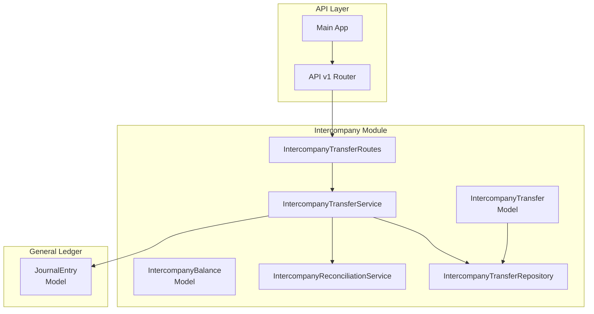
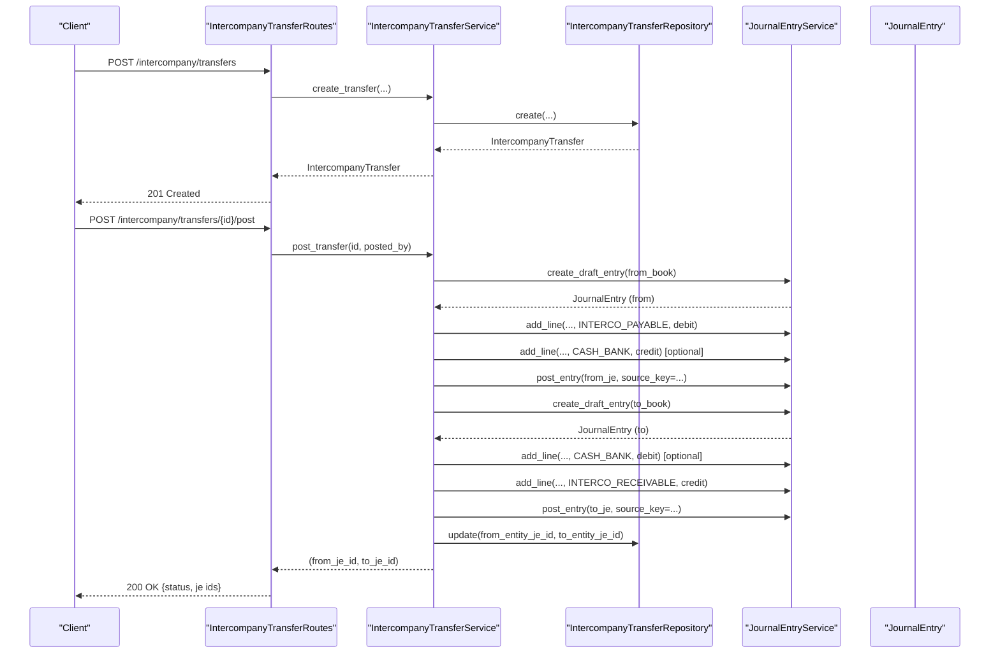
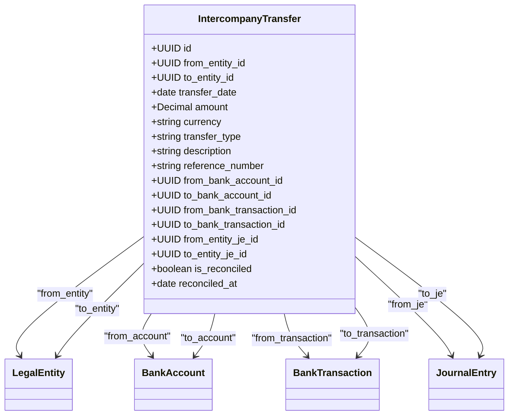
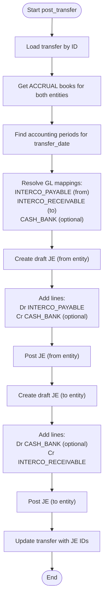
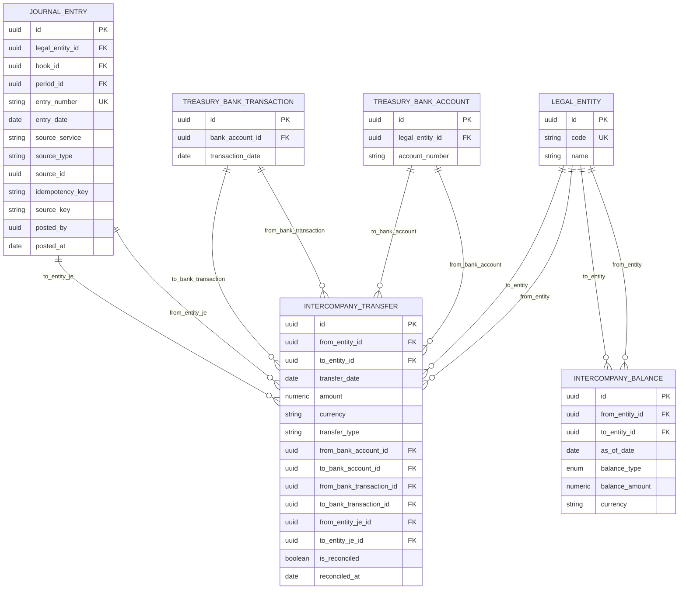
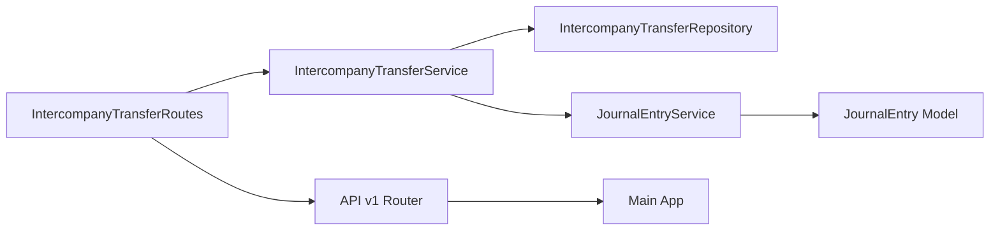

# Intercompany Transfers

<cite>
**Referenced Files in This Document**
- [intercompany_transfer_model.py](file://app/modules/intercompany/models/intercompany_transfer_model.py)
- [intercompany_balance_model.py](file://app/modules/intercompany/models/intercompany_balance_model.py)
- [intercompany_transfer_service.py](file://app/modules/intercompany/services/intercompany_transfer_service.py)
- [intercompany_reconciliation_service.py](file://app/modules/intercompany/services/intercompany_reconciliation_service.py)
- [intercompany_transfer_routes.py](file://app/modules/intercompany/api/routes/intercompany_transfer_routes.py)
- [intercompany_schemas.py](file://app/modules/intercompany/schemas/intercompany_schemas.py)
- [intercompany_transfer_repository.py](file://app/modules/intercompany/repositories/intercompany_transfer_repository.py)
- [journal_entry_model.py](file://app/modules/general_ledger/models/journal_entry_model.py)
- [endpoint_keys.py](file://app/core/endpoint_keys.py)
- [v1 router](file://app/api/v1/__init__.py)
- [main.py](file://app/main.py)
</cite>

## Table of Contents
1. [Introduction](#introduction)
2. [Project Structure](#project-structure)
3. [Core Components](#core-components)
4. [Architecture Overview](#architecture-overview)
5. [Detailed Component Analysis](#detailed-component-analysis)
6. [Dependency Analysis](#dependency-analysis)
7. [Performance Considerations](#performance-considerations)
8. [Troubleshooting Guide](#troubleshooting-guide)
9. [Conclusion](#conclusion)
10. [Appendices](#appendices)

## Introduction
This document describes the Intercompany Transfers functionality in the TrueVow Financial Management system. It covers the end-to-end lifecycle of intercompany transfers: creation, posting, and balance tracking. It explains the IntercompanyTransferService implementation, including transfer creation, posting logic, and dual-entity journal entry generation. It documents the intercompany transfer models, their relationships, transfer types, and posting states. It also lists the API endpoints for creating transfers, posting transfers, listing transfers, retrieving individual transfers, and computing balances. Finally, it provides examples of intercompany fund transfers, loan arrangements, and intercompany receivable/payable management, along with validation rules, currency handling, and audit trail requirements.

## Project Structure
The Intercompany Transfers feature is implemented as part of the intercompany module. The module integrates with general ledger and treasury models and exposes REST endpoints via FastAPI.

**Diagram sources**
- [intercompany_transfer_model.py](file://app/modules/intercompany/models/intercompany_transfer_model.py#L16-L58)
- [intercompany_balance_model.py](file://app/modules/intercompany/models/intercompany_balance_model.py#L17-L38)
- [intercompany_transfer_service.py](file://app/modules/intercompany/services/intercompany_transfer_service.py#L17-L27)
- [intercompany_reconciliation_service.py](file://app/modules/intercompany/services/intercompany_reconciliation_service.py#L14-L21)
- [intercompany_transfer_routes.py](file://app/modules/intercompany/api/routes/intercompany_transfer_routes.py#L18-L179)
- [intercompany_transfer_repository.py](file://app/modules/intercompany/repositories/intercompany_transfer_repository.py#L12-L16)
- [journal_entry_model.py](file://app/modules/general_ledger/models/journal_entry_model.py#L17-L57)
- [v1 router](file://app/api/v1/__init__.py#L59-L62)
- [main.py](file://app/main.py#L29-L30)

**Section sources**
- [intercompany_transfer_model.py](file://app/modules/intercompany/models/intercompany_transfer_model.py#L1-L58)
- [intercompany_transfer_service.py](file://app/modules/intercompany/services/intercompany_transfer_service.py#L17-L27)
- [intercompany_transfer_routes.py](file://app/modules/intercompany/api/routes/intercompany_transfer_routes.py#L18-L179)
- [v1 router](file://app/api/v1/__init__.py#L59-L62)
- [main.py](file://app/main.py#L29-L30)

## Core Components
- IntercompanyTransfer model: Represents a single intercompany transfer with entity linkage, amount, currency, type, treasury links, and journal entry linkage.
- IntercompanyBalance model: Stores balance snapshots with type (NET, RECEIVABLE, PAYABLE), amount, and currency.
- IntercompanyTransferService: Orchestrates transfer creation and posting, coordinates with books, periods, GL mappings, and journal entry service.
- IntercompanyReconciliationService: Computes balances, creates balance snapshots, reconciles transfers, and generates reconciliation reports.
- IntercompanyTransferRepository: Provides persistence operations for transfers, including filtering, pagination, and balance calculations.
- API routes: Expose endpoints for creating, posting, listing, retrieving, and querying balances for intercompany transfers.
- JournalEntry model: Underpins dual-entity journal entries generated during posting.

**Section sources**
- [intercompany_transfer_model.py](file://app/modules/intercompany/models/intercompany_transfer_model.py#L16-L58)
- [intercompany_balance_model.py](file://app/modules/intercompany/models/intercompany_balance_model.py#L17-L38)
- [intercompany_transfer_service.py](file://app/modules/intercompany/services/intercompany_transfer_service.py#L17-L27)
- [intercompany_reconciliation_service.py](file://app/modules/intercompany/services/intercompany_reconciliation_service.py#L14-L21)
- [intercompany_transfer_repository.py](file://app/modules/intercompany/repositories/intercompany_transfer_repository.py#L12-L16)
- [journal_entry_model.py](file://app/modules/general_ledger/models/journal_entry_model.py#L17-L57)

## Architecture Overview
Intercompany transfers are created as draft records and later posted to both entities’ books. Posting generates two journal entries (one per entity) linked back to the transfer record. Balances are tracked and can be queried or snapshotted.

**Diagram sources**
- [intercompany_transfer_routes.py](file://app/modules/intercompany/api/routes/intercompany_transfer_routes.py#L21-L103)
- [intercompany_transfer_service.py](file://app/modules/intercompany/services/intercompany_transfer_service.py#L28-L219)
- [journal_entry_model.py](file://app/modules/general_ledger/models/journal_entry_model.py#L17-L57)

## Detailed Component Analysis

### IntercompanyTransfer Model
- Purpose: Stores intercompany transfer records with entity linkage, amount, currency, type, treasury links, and journal entry linkage.
- Key fields:
  - from_entity_id, to_entity_id: Legal entity identifiers.
  - transfer_date, amount, currency, transfer_type, description, reference_number.
  - Treasury links: from_bank_account_id, to_bank_account_id, from_bank_transaction_id, to_bank_transaction_id.
  - Journal entry linkage: from_entity_je_id, to_entity_je_id.
  - Reconciliation: is_reconciled, reconciled_at.
- Relationships: Links to LegalEntity, BankAccount, BankTransaction, and JournalEntry.

**Diagram sources**
- [intercompany_transfer_model.py](file://app/modules/intercompany/models/intercompany_transfer_model.py#L16-L58)

**Section sources**
- [intercompany_transfer_model.py](file://app/modules/intercompany/models/intercompany_transfer_model.py#L16-L58)

### IntercompanyBalance Model
- Purpose: Stores balance snapshots for intercompany pairs.
- Key fields:
  - from_entity_id, to_entity_id, as_of_date, balance_type (NET, RECEIVABLE, PAYABLE), balance_amount, currency.
- Constraints: Unique constraint on (from_entity_id, to_entity_id, as_of_date, balance_type).

**Section sources**
- [intercompany_balance_model.py](file://app/modules/intercompany/models/intercompany_balance_model.py#L17-L38)

### IntercompanyTransferService
- Responsibilities:
  - Create transfers with validation (entities exist, distinct, amount positive, currency three-letter).
  - Post transfers to both entities’ ACCRUAL books, generating dual journal entries.
  - Resolve GL account mappings for INTERCO_PAYABLE, INTERCO_RECEIVABLE, and CASH_BANK.
  - Manage periods and books per entity.
  - Update transfer with journal entry IDs upon successful posting.
- Posting logic:
  - From entity: Debit Intercompany Payable, Credit Cash/Bank (if applicable).
  - To entity: Debit Cash/Bank (if applicable), Credit Intercompany Receivable.
  - Journal entries are posted with deterministic source keys scoped to the from entity’s ACCRUAL book.

**Diagram sources**
- [intercompany_transfer_service.py](file://app/modules/intercompany/services/intercompany_transfer_service.py#L72-L219)

**Section sources**
- [intercompany_transfer_service.py](file://app/modules/intercompany/services/intercompany_transfer_service.py#L28-L232)

### IntercompanyReconciliationService
- Responsibilities:
  - Calculate net balance between two entities up to a date.
  - Create balance snapshots with appropriate balance type (RECEIVABLE/PAYABLE/NET).
  - Reconcile transfers by marking them as reconciled.
  - Generate reconciliation reports with counts and transfer details.

**Section sources**
- [intercompany_reconciliation_service.py](file://app/modules/intercompany/services/intercompany_reconciliation_service.py#L22-L168)

### IntercompanyTransferRepository
- Responsibilities:
  - List transfers between an entity pair with optional filters (date range, reconciliation status).
  - List transfers for an entity (from, to, or both directions).
  - Calculate net balance for an entity pair up to a date.

**Section sources**
- [intercompany_transfer_repository.py](file://app/modules/intercompany/repositories/intercompany_transfer_repository.py#L18-L101)

### API Endpoints
- Create transfer
  - Method: POST
  - Path: /intercompany/transfers
  - Request body: IntercompanyTransferCreate
  - Response: IntercompanyTransferResponse
  - Validation: Amount > 0, Currency three-letter, Entities exist and differ.
- Post transfer
  - Method: POST
  - Path: /intercompany/transfers/{transfer_id}/post
  - Request body: IntercompanyTransferPostRequest
  - Response: JSON with transfer_id, from_entity_je_id, to_entity_je_id, status
  - Idempotency: Endpoint key IC_TRANSFER_POST scoped to the from entity’s ACCRUAL book.
- List transfers
  - Method: GET
  - Path: /intercompany/transfers
  - Query params: from_entity_id, to_entity_id, entity_id, start_date, end_date, limit, offset
  - Response: Array of IntercompanyTransferResponse
- Get transfer by ID
  - Method: GET
  - Path: /intercompany/transfers/{transfer_id}
  - Response: IntercompanyTransferResponse
- Get intercompany balance
  - Method: GET
  - Path: /intercompany/transfers/balance
  - Query params: from_entity_id, to_entity_id, as_of_date
  - Response: JSON with from_entity_id, to_entity_id, as_of_date, balance

**Section sources**
- [intercompany_transfer_routes.py](file://app/modules/intercompany/api/routes/intercompany_transfer_routes.py#L21-L179)
- [intercompany_schemas.py](file://app/modules/intercompany/schemas/intercompany_schemas.py#L9-L46)
- [endpoint_keys.py](file://app/core/endpoint_keys.py#L17-L19)
- [v1 router](file://app/api/v1/__init__.py#L59-L62)
- [main.py](file://app/main.py#L29-L30)

### Data Models and Relationships

**Diagram sources**
- [intercompany_transfer_model.py](file://app/modules/intercompany/models/intercompany_transfer_model.py#L16-L58)
- [intercompany_balance_model.py](file://app/modules/intercompany/models/intercompany_balance_model.py#L17-L38)
- [journal_entry_model.py](file://app/modules/general_ledger/models/journal_entry_model.py#L17-L57)

## Dependency Analysis
- Routing and inclusion:
  - Intercompany transfer routes are included in the API v1 router and exposed under /api/v1.
- Service dependencies:
  - IntercompanyTransferService depends on repositories for transfers, legal entities, and books, and on JournalEntryService for posting.
- Posting idempotency:
  - The post endpoint uses a dedicated endpoint key and scopes idempotency to the from entity’s ACCRUAL book.

**Diagram sources**
- [intercompany_transfer_routes.py](file://app/modules/intercompany/api/routes/intercompany_transfer_routes.py#L18-L179)
- [intercompany_transfer_service.py](file://app/modules/intercompany/services/intercompany_transfer_service.py#L17-L27)
- [journal_entry_model.py](file://app/modules/general_ledger/models/journal_entry_model.py#L17-L57)
- [v1 router](file://app/api/v1/__init__.py#L59-L62)
- [main.py](file://app/main.py#L29-L30)

**Section sources**
- [intercompany_transfer_routes.py](file://app/modules/intercompany/api/routes/intercompany_transfer_routes.py#L18-L179)
- [intercompany_transfer_service.py](file://app/modules/intercompany/services/intercompany_transfer_service.py#L17-L27)
- [v1 router](file://app/api/v1/__init__.py#L59-L62)
- [main.py](file://app/main.py#L29-L30)

## Performance Considerations
- Indexing: Transfer queries leverage indexed fields (entity IDs, transfer date, reconciliation flag) to optimize filtering and sorting.
- Pagination: Listing endpoints support limit and offset to control payload sizes.
- Single-pass balance calculation: The repository computes net balances in-memory over filtered results.
- Idempotency: Posting uses deterministic source keys and idempotency scoping to avoid duplicate postings.

[No sources needed since this section provides general guidance]

## Troubleshooting Guide
- Transfer not found
  - Symptoms: 404 responses when retrieving or posting transfers.
  - Causes: Invalid transfer ID or missing records.
  - Resolution: Verify transfer ID and existence in the repository.
- Entity not found
  - Symptoms: Validation errors during creation.
  - Causes: from_entity_id or to_entity_id do not correspond to existing legal entities.
  - Resolution: Confirm entity IDs and existence in the legal entity repository.
- Same entity transfer
  - Symptoms: Validation error indicating entities must be different.
  - Resolution: Use distinct from_entity_id and to_entity_id.
- Missing ACCRUAL book
  - Symptoms: Errors when posting transfers.
  - Causes: No ACCRUAL book configured for one or both entities.
  - Resolution: Ensure ACCRUAL books exist for both entities.
- No accounting period
  - Symptoms: Errors when posting due to missing period.
  - Resolution: Confirm accounting periods exist for the transfer date in both entities’ books.
- Account mapping not found
  - Symptoms: Errors resolving INTERCO_PAYABLE, INTERCO_RECEIVABLE, or CASH_BANK.
  - Resolution: Set up GL account mappings for the entities and books.
- Duplicate posting
  - Symptoms: Idempotency errors.
  - Resolution: Retry with the same idempotency key; the system will return the previous result.

**Section sources**
- [intercompany_transfer_routes.py](file://app/modules/intercompany/api/routes/intercompany_transfer_routes.py#L42-L103)
- [intercompany_transfer_service.py](file://app/modules/intercompany/services/intercompany_transfer_service.py#L42-L98)
- [intercompany_reconciliation_service.py](file://app/modules/intercompany/services/intercompany_reconciliation_service.py#L22-L33)

## Conclusion
The Intercompany Transfers feature provides a robust mechanism for recording, posting, and tracking intercompany movements across entities. It enforces validation, supports dual-entity journal entries, and offers reconciliation capabilities with balance snapshots. The API exposes straightforward endpoints for creation, posting, listing, retrieval, and balance computation, integrating seamlessly with the broader financial management system.

[No sources needed since this section summarizes without analyzing specific files]

## Appendices

### API Definitions
- Create transfer
  - Method: POST
  - Path: /api/v1/intercompany/transfers
  - Request body: IntercompanyTransferCreate
  - Response: IntercompanyTransferResponse
- Post transfer
  - Method: POST
  - Path: /api/v1/intercompany/transfers/{transfer_id}/post
  - Request body: IntercompanyTransferPostRequest
  - Response: JSON with transfer_id, from_entity_je_id, to_entity_je_id, status
  - Idempotency: Endpoint key IC_TRANSFER_POST scoped to the from entity’s ACCRUAL book
- List transfers
  - Method: GET
  - Path: /api/v1/intercompany/transfers
  - Query params: from_entity_id, to_entity_id, entity_id, start_date, end_date, limit, offset
  - Response: Array of IntercompanyTransferResponse
- Get transfer by ID
  - Method: GET
  - Path: /api/v1/intercompany/transfers/{transfer_id}
  - Response: IntercompanyTransferResponse
- Get intercompany balance
  - Method: GET
  - Path: /api/v1/intercompany/transfers/balance
  - Query params: from_entity_id, to_entity_id, as_of_date
  - Response: JSON with from_entity_id, to_entity_id, as_of_date, balance

**Section sources**
- [intercompany_transfer_routes.py](file://app/modules/intercompany/api/routes/intercompany_transfer_routes.py#L21-L179)
- [endpoint_keys.py](file://app/core/endpoint_keys.py#L17-L19)
- [v1 router](file://app/api/v1/__init__.py#L59-L62)
- [main.py](file://app/main.py#L29-L30)

### Examples
- Intercompany fund transfer
  - Create a transfer with transfer_type set to a cash-related value, optionally linking from_bank_account_id and to_bank_account_id.
  - Post the transfer to generate dual journal entries in both entities’ ACCRUAL books.
- Loan arrangement
  - Use transfer_type to represent loans; maintain intercompany receivable/payable accounts via mappings.
  - Track outstanding balances and reconcile as payments occur.
- Intercompany receivable/payable management
  - Use the balance endpoint to compute net positions between entities.
  - Create balance snapshots for reporting and reconciliation.

[No sources needed since this section provides general guidance]

### Validation Rules and Currency Handling
- Validation rules:
  - Entities must exist and be different.
  - Amount must be greater than zero.
  - Currency must be a three-letter ISO code.
  - Transfer date must resolve to valid accounting periods in both entities’ books.
- Currency handling:
  - Amount and functional currency amounts are stored with two decimal places.
  - Journal lines capture transaction currency and functional currency amounts.

**Section sources**
- [intercompany_schemas.py](file://app/modules/intercompany/schemas/intercompany_schemas.py#L9-L21)
- [intercompany_transfer_service.py](file://app/modules/intercompany/services/intercompany_transfer_service.py#L42-L53)
- [journal_entry_model.py](file://app/modules/general_ledger/models/journal_entry_model.py#L68-L107)

### Audit Trail Requirements
- Journal entries capture source tracking (service, type, ID), idempotency keys, and source keys for deterministic posting.
- Posted entries include posted_by and posted_at metadata.
- Intercompany transfers link to journal entries for traceability.

**Section sources**
- [journal_entry_model.py](file://app/modules/general_ledger/models/journal_entry_model.py#L31-L44)
- [intercompany_transfer_service.py](file://app/modules/intercompany/services/intercompany_transfer_service.py#L125-L166)