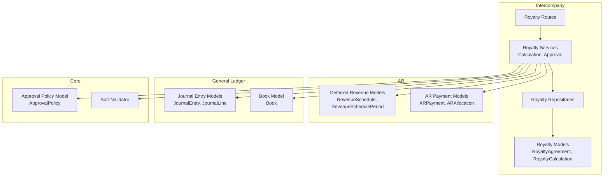
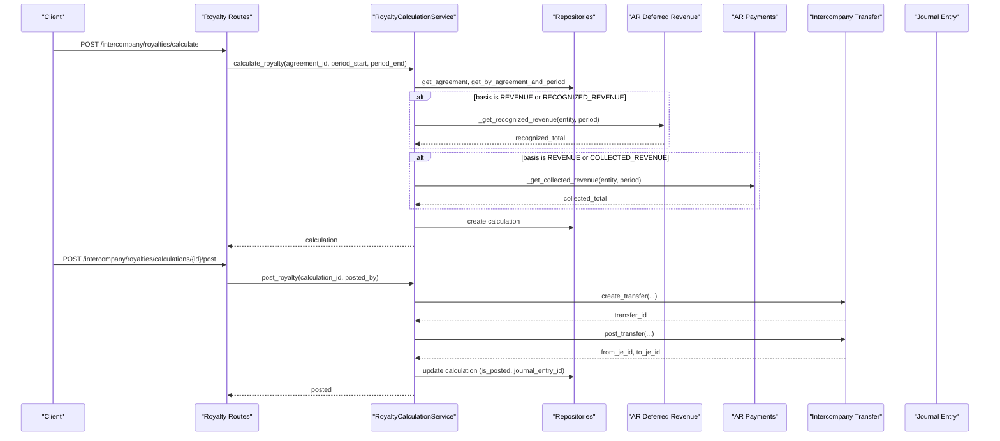
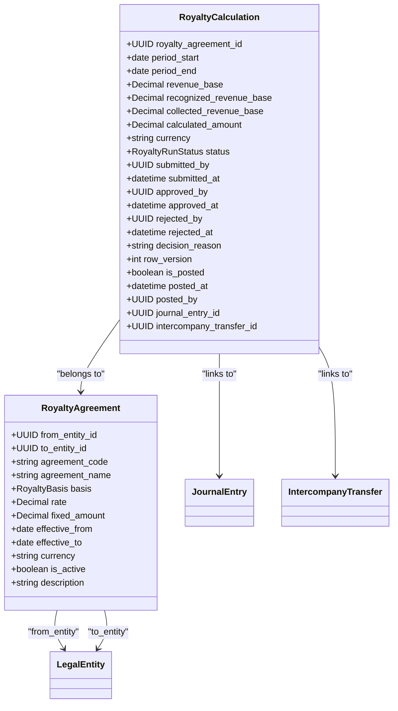
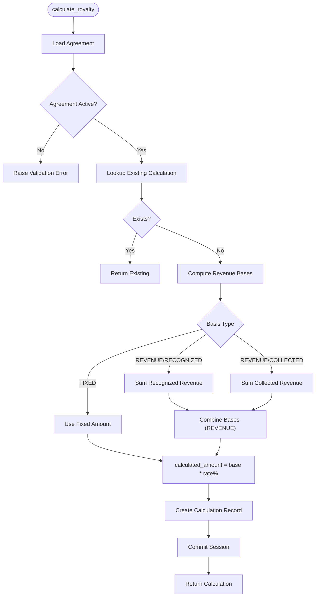
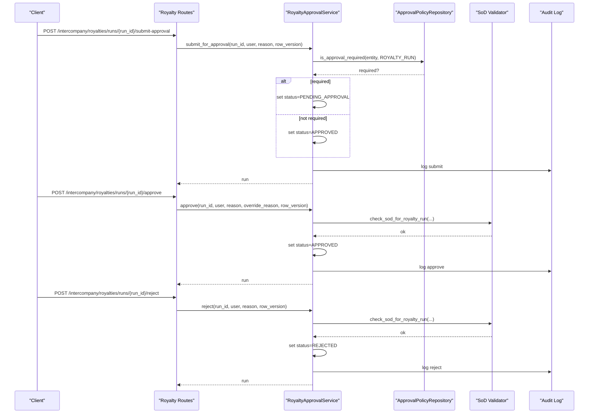
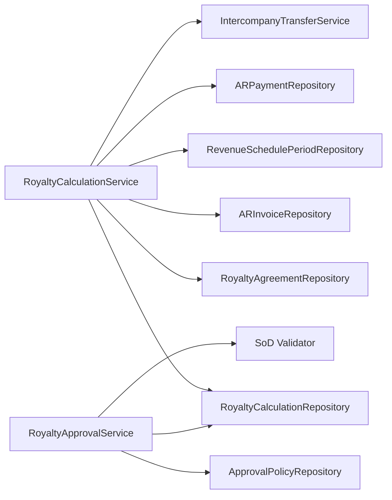

# Royalty Management

<cite>
**Referenced Files in This Document**
- [royalty_model.py](file://app/modules/intercompany/models/royalty_model.py)
- [royalty_calculation_service.py](file://app/modules/intercompany/services/royalty_calculation_service.py)
- [royalty_approval_service.py](file://app/modules/intercompany/services/royalty_approval_service.py)
- [royalty_repository.py](file://app/modules/intercompany/repositories/royalty_repository.py)
- [royalty_routes.py](file://app/modules/intercompany/api/routes/royalty_routes.py)
- [deferred_revenue_model.py](file://app/modules/ar/models/deferred_revenue_model.py)
- [ar_payment_model.py](file://app/modules/ar/models/ar_payment_model.py)
- [intercompany_transfer_model.py](file://app/modules/intercompany/models/intercompany_transfer_model.py)
- [journal_entry_model.py](file://app/modules/general_ledger/models/journal_entry_model.py)
- [book_model.py](file://app/modules/general_ledver/models/book_model.py)
- [approval_policy_model.py](file://app/modules/core/models/approval_policy_model.py)
- [sod_validator.py](file://app/modules/core/services/sod_validator.py)
</cite>

## Table of Contents
1. [Introduction](#introduction)
2. [Project Structure](#project-structure)
3. [Core Components](#core-components)
4. [Architecture Overview](#architecture-overview)
5. [Detailed Component Analysis](#detailed-component-analysis)
6. [Dependency Analysis](#dependency-analysis)
7. [Performance Considerations](#performance-considerations)
8. [Troubleshooting Guide](#troubleshooting-guide)
9. [Conclusion](#conclusion)
10. [Appendices](#appendices)

## Introduction
This document describes the Royalty Management system within the TrueVow Financial Management platform. It covers royalty calculation algorithms, approval workflows, and payment processing. It explains the RoyaltyCalculationService implementation including formula-based calculations, rate structures, and accrual generation. It documents the royalty approval service with workflow routing, approval hierarchies, and policy enforcement. It also outlines royalty models including royalty agreements, calculation periods, and payment schedules, and provides examples of product royalty calculations, licensing fees, and performance-based payments. Finally, it addresses royalty allocation across entities, tax implications, and reporting requirements.

## Project Structure
The Royalty Management module is organized around models, repositories, services, and API routes under the intercompany domain. Supporting models from AR (deferred revenue and payments), General Ledger (journal entries and books), and Core (approval policies and SoD validation) integrate with the royalty lifecycle.

**Diagram sources**
- [royalty_model.py](file://app/modules/intercompany/models/royalty_model.py#L27-L97)
- [royalty_calculation_service.py](file://app/modules/intercompany/services/royalty_calculation_service.py#L21-L201)
- [royalty_approval_service.py](file://app/modules/intercompany/services/royalty_approval_service.py#L25-L253)
- [royalty_repository.py](file://app/modules/intercompany/repositories/royalty_repository.py#L15-L106)
- [royalty_routes.py](file://app/modules/intercompany/api/routes/royalty_routes.py#L29-L268)
- [deferred_revenue_model.py](file://app/modules/ar/models/deferred_revenue_model.py#L17-L70)
- [ar_payment_model.py](file://app/modules/ar/models/ar_payment_model.py#L19-L69)
- [journal_entry_model.py](file://app/modules/general_ledger/models/journal_entry_model.py#L17-L127)
- [book_model.py](file://app/modules/general_ledger/models/book_model.py#L15-L35)
- [approval_policy_model.py](file://app/modules/core/models/approval_policy_model.py#L18-L35)
- [sod_validator.py](file://app/modules/core/services/sod_validator.py#L27-L38)

**Section sources**
- [royalty_model.py](file://app/modules/intercompany/models/royalty_model.py#L1-L98)
- [royalty_routes.py](file://app/modules/intercompany/api/routes/royalty_routes.py#L1-L269)

## Core Components
- RoyaltyAgreement: Defines the terms of a royalty arrangement between two legal entities, including basis (REVENUE, RECOGNIZED_REVENUE, COLLECTED_REVENUE, FIXED), rate or fixed amount, currency, and validity dates.
- RoyaltyCalculation: Stores calculated royalty for a period with revenue bases, calculated amount, and workflow/status fields for approval and posting.
- RoyaltyCalculationService: Implements calculation logic, revenue sourcing from AR and deferred revenue, and posts calculations as intercompany transfers with journal entries.
- RoyaltyApprovalService: Manages the approval workflow with submission, approval, rejection, SoD checks, and audit logging.
- RoyaltyAgreementRepository and RoyaltyCalculationRepository: Provide persistence and queries for agreements and calculations.
- API Routes: Expose endpoints for agreements, calculations, approvals, and posting with idempotency and row-version safeguards.

**Section sources**
- [royalty_model.py](file://app/modules/intercompany/models/royalty_model.py#L10-L97)
- [royalty_calculation_service.py](file://app/modules/intercompany/services/royalty_calculation_service.py#L21-L201)
- [royalty_approval_service.py](file://app/modules/intercompany/services/royalty_approval_service.py#L25-L253)
- [royalty_repository.py](file://app/modules/intercompany/repositories/royalty_repository.py#L15-L106)
- [royalty_routes.py](file://app/modules/intercompany/api/routes/royalty_routes.py#L32-L268)

## Architecture Overview
The system follows a layered architecture:
- API layer exposes CRUD and workflow endpoints.
- Service layer encapsulates business logic for calculation, posting, and approvals.
- Repository layer abstracts persistence.
- Domain models define entities and relationships.
- Integrations with AR deferred revenue and AR payments supply the revenue bases.
- Intercompany transfer and journal entry models support accrual generation and posting.

**Diagram sources**
- [royalty_routes.py](file://app/modules/intercompany/api/routes/royalty_routes.py#L107-L255)
- [royalty_calculation_service.py](file://app/modules/intercompany/services/royalty_calculation_service.py#L31-L201)
- [deferred_revenue_model.py](file://app/modules/ar/models/deferred_revenue_model.py#L47-L70)
- [ar_payment_model.py](file://app/modules/ar/models/ar_payment_model.py#L19-L46)
- [intercompany_transfer_model.py](file://app/modules/intercompany/models/intercompany_transfer_model.py#L16-L58)
- [journal_entry_model.py](file://app/modules/general_ledger/models/journal_entry_model.py#L17-L57)

## Detailed Component Analysis

### Royalty Models
The models define the core entities and their relationships:
- RoyaltyBasis enumerates calculation bases.
- RoyaltyRunStatus defines workflow states.
- RoyaltyAgreement holds agreement terms and relationships to calculations.
- RoyaltyCalculation stores per-period results and workflow/posting metadata.

**Diagram sources**
- [royalty_model.py](file://app/modules/intercompany/models/royalty_model.py#L27-L97)

**Section sources**
- [royalty_model.py](file://app/modules/intercompany/models/royalty_model.py#L10-L97)

### Royalty Calculation Service
Responsibilities:
- Validates agreement existence and activity.
- Prevents duplicate calculations for the same agreement and period.
- Computes revenue bases from:
  - Recognized revenue from AR deferred revenue schedules.
  - Collected revenue from AR payments within the period.
- Applies rate or fixed amount based on basis.
- Persists calculation and supports posting to intercompany transfer and journal entries.

**Diagram sources**
- [royalty_calculation_service.py](file://app/modules/intercompany/services/royalty_calculation_service.py#L31-L104)
- [deferred_revenue_model.py](file://app/modules/ar/models/deferred_revenue_model.py#L47-L70)
- [ar_payment_model.py](file://app/modules/ar/models/ar_payment_model.py#L19-L46)

**Section sources**
- [royalty_calculation_service.py](file://app/modules/intercompany/services/royalty_calculation_service.py#L21-L201)

### Royalty Approval Service
Responsibilities:
- Submits runs for approval or auto-approves based on approval policy.
- Enforces row-version concurrency control.
- Performs segregation of duties checks for approvals.
- Logs audit events for all actions.
- Supports rejection with mandatory reasons.

**Diagram sources**
- [royalty_approval_service.py](file://app/modules/intercompany/services/royalty_approval_service.py#L33-L230)
- [approval_policy_model.py](file://app/modules/core/models/approval_policy_model.py#L18-L35)
- [sod_validator.py](file://app/modules/core/services/sod_validator.py#L27-L38)
- [royalty_routes.py](file://app/modules/intercompany/api/routes/royalty_routes.py#L127-L197)

**Section sources**
- [royalty_approval_service.py](file://app/modules/intercompany/services/royalty_approval_service.py#L25-L253)

### API Endpoints and Workflows
Endpoints:
- Agreements: create, list, get by ID.
- Calculations: calculate for a period, list unposted.
- Runs: submit for approval, approve, reject.
- Posting: post calculation as intercompany transfer with idempotency and accrual book scoping.

Idempotency and posting:
- Posting requires an idempotency key scoped to the legal entity’s accrual book.
- The handler creates an intercompany transfer and posts it for both entities, linking journal entries.

**Section sources**
- [royalty_routes.py](file://app/modules/intercompany/api/routes/royalty_routes.py#L32-L268)
- [book_model.py](file://app/modules/general_ledger/models/book_model.py#L15-L35)

## Dependency Analysis
Key dependencies:
- RoyaltyCalculationService depends on:
  - RoyaltyAgreementRepository and RoyaltyCalculationRepository for persistence.
  - ARInvoiceRepository and RevenueSchedulePeriodRepository for recognized revenue.
  - ARPaymentRepository for collected revenue.
  - IntercompanyTransferService for posting.
- RoyaltyApprovalService depends on:
  - ApprovalPolicyRepository for policy checks.
  - SoD validator for segregation of duties.
  - Audit logging for compliance.

**Diagram sources**
- [royalty_calculation_service.py](file://app/modules/intercompany/services/royalty_calculation_service.py#L7-L29)
- [royalty_approval_service.py](file://app/modules/intercompany/services/royalty_approval_service.py#L12-L31)
- [royalty_repository.py](file://app/modules/intercompany/repositories/royalty_repository.py#L15-L106)

**Section sources**
- [royalty_calculation_service.py](file://app/modules/intercompany/services/royalty_calculation_service.py#L21-L30)
- [royalty_approval_service.py](file://app/modules/intercompany/services/royalty_approval_service.py#L25-L32)

## Performance Considerations
- Calculation queries:
  - Recognized revenue aggregation uses joins with filters on legal entity and recognized periods; ensure appropriate indexing on entity, period dates, and recognized flags.
  - Collected revenue aggregation filters AR payments by date; ensure indexes on payment_date and legal_entity_id.
- Idempotency:
  - Posting uses idempotency keys scoped to legal entity and accrual book to prevent duplicate postings.
- Concurrency:
  - Row-version increments on state transitions protect against concurrent updates.
- Batch operations:
  - Listing unposted calculations supports pagination and entity filtering to avoid heavy scans.

[No sources needed since this section provides general guidance]

## Troubleshooting Guide
Common issues and resolutions:
- Not found errors:
  - Creating agreements with duplicate codes or calculating non-existent runs triggers not-found errors.
- Validation errors:
  - Inactive agreements, invalid basis combinations, or missing fixed amount for FIXED basis cause validation failures.
- Posting errors:
  - Already posted calculations cannot be reposted; ensure status checks before posting.
- Approval errors:
  - Non-draft status prevents submission; pending-only actions require correct workflow state.
  - Rejection requires a reason; SoD violations raise specific errors.
- Idempotency:
  - Posting requires a valid accrual book for the from-entity; ensure entity-book mapping exists.

**Section sources**
- [royalty_routes.py](file://app/modules/intercompany/api/routes/royalty_routes.py#L40-L68)
- [royalty_calculation_service.py](file://app/modules/intercompany/services/royalty_calculation_service.py#L160-L201)
- [royalty_approval_service.py](file://app/modules/intercompany/services/royalty_approval_service.py#L33-L230)

## Conclusion
The Royalty Management system integrates AR revenue recognition and collections with intercompany transfer and journal entry posting. It enforces policy-driven approvals and segregation of duties, supports idempotent posting, and maintains audit trails. The modular design enables clear separation of concerns across models, repositories, services, and APIs, facilitating maintainability and extensibility.

[No sources needed since this section summarizes without analyzing specific files]

## Appendices

### Example Scenarios
- Product royalty calculations:
  - Basis REVENUE: Sum of recognized and collected revenue within the period, multiplied by the rate percentage.
  - Basis RECOGNIZED_REVENUE: Only recognized revenue multiplied by the rate percentage.
  - Basis COLLECTED_REVENUE: Only collected payments multiplied by the rate percentage.
  - Basis FIXED: Fixed amount regardless of revenue.
- Licensing fees:
  - Define an agreement with FIXED basis and a fixed amount; calculate and post monthly or quarterly periods.
- Performance-based payments:
  - Define an agreement with REVENUE or RECOGNIZED_REVENUE basis; adjust rates periodically via new agreements with effective dates.

[No sources needed since this section provides general guidance]

### Tax Implications and Reporting
- Accrual generation:
  - Posting maps to intercompany transfers and journal entries per entity, enabling accrual-based reporting.
- Currency and functional currency:
  - Amounts and FX details are handled at the journal entry level; ensure proper currency and FX setup for accurate reporting.
- Reporting:
  - Use GL detail and trial balance services to reconcile intercompany balances and royalty accruals across entities.

[No sources needed since this section provides general guidance]