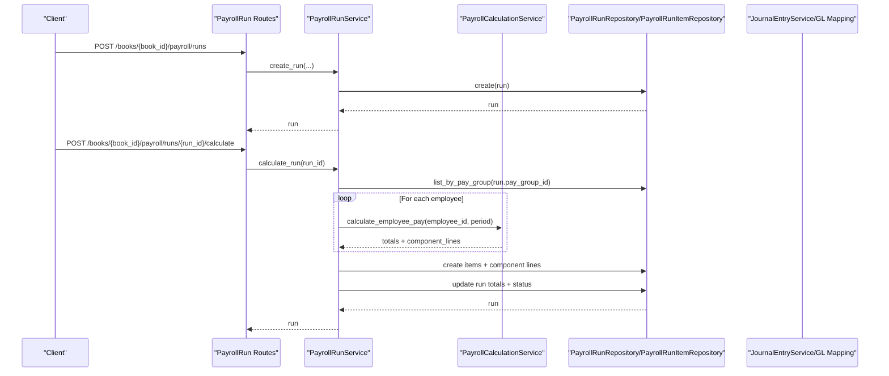
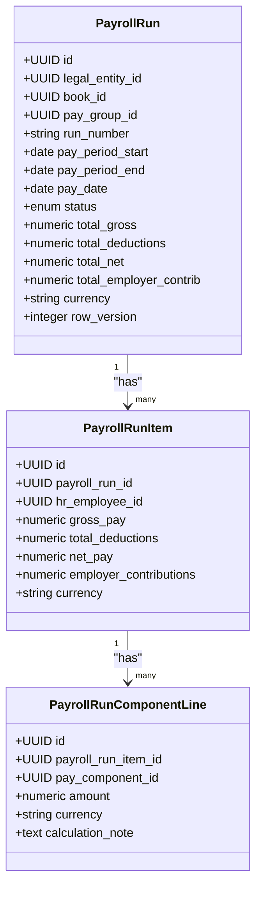
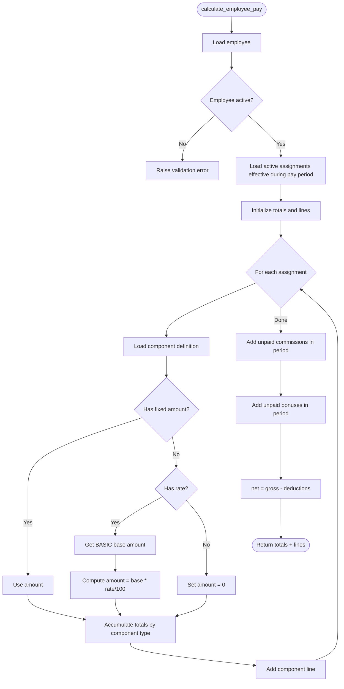
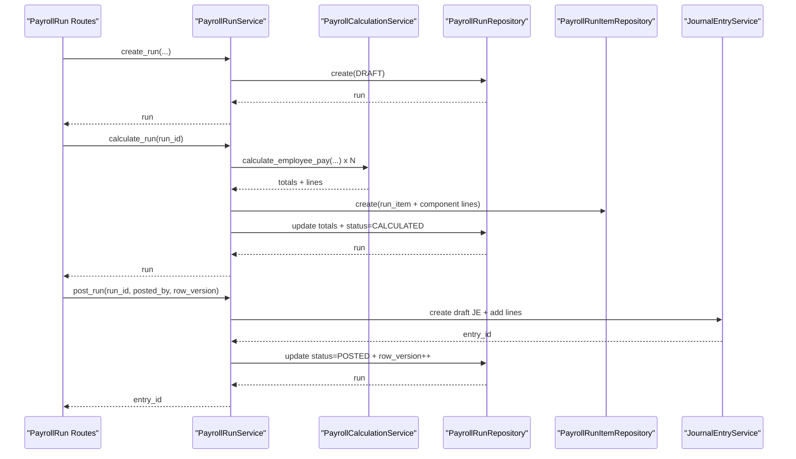
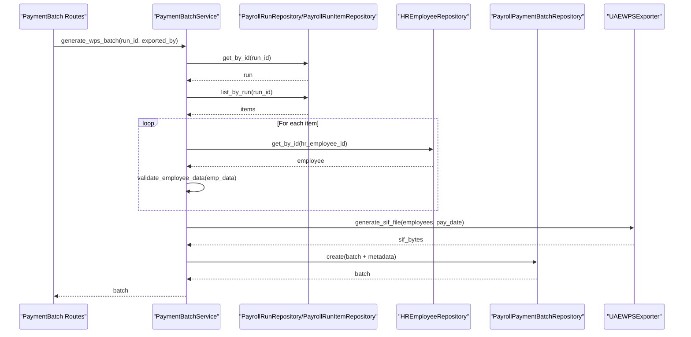
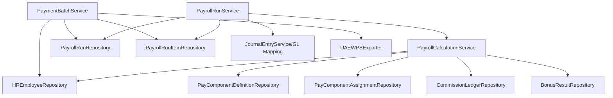

# Core Payroll Functionality

<cite>
**Referenced Files in This Document**
- [employee_model.py](file://app/modules/payroll/models/employee_model.py)
- [pay_component_model.py](file://app/modules/payroll/models/pay_component_model.py)
- [pay_group_model.py](file://app/modules/payroll/models/pay_group_model.py)
- [payroll_run_model.py](file://app/modules/payroll/models/payroll_run_model.py)
- [payment_batch_model.py](file://app/modules/payroll/models/payment_batch_model.py)
- [bonus_model.py](file://app/modules/payroll/models/bonus_model.py)
- [commission_model.py](file://app/modules/payroll/models/commission_model.py)
- [payroll_calculation_service.py](file://app/modules/payroll/services/payroll_calculation_service.py)
- [payroll_run_service.py](file://app/modules/payroll/services/payroll_run_service.py)
- [payment_batch_service.py](file://app/modules/payroll/services/payment_batch_service.py)
- [wps_export.py](file://app/modules/payroll/plugins/wps_export.py)
- [employee_repository.py](file://app/modules/payroll/repositories/employee_repository.py)
- [pay_component_repository.py](file://app/modules/payroll/repositories/pay_component_repository.py)
- [payroll_run_repository.py](file://app/modules/payroll/repositories/payroll_run_repository.py)
- [payroll_run_routes.py](file://app/modules/payroll/api/routes/payroll_run_routes.py)
- [payment_batch_routes.py](file://app/modules/payroll/api/routes/payment_batch_routes.py)
</cite>

## Table of Contents
1. [Introduction](#introduction)
2. [Project Structure](#project-structure)
3. [Core Components](#core-components)
4. [Architecture Overview](#architecture-overview)
5. [Detailed Component Analysis](#detailed-component-analysis)
6. [Dependency Analysis](#dependency-analysis)
7. [Performance Considerations](#performance-considerations)
8. [Troubleshooting Guide](#troubleshooting-guide)
9. [Conclusion](#conclusion)

## Introduction
This document explains the core payroll functionality implemented in the TrueVow Financial Management system. It covers:
- Payroll calculation service for salary computations, overtime, and benefit deductions
- Payroll run service for run creation, calculation, approval, posting, and reversal
- Payment batch service for generating WPS payment distributions
- Employee model structure with personal details, employment history, and compensation setup
- Pay component models for earnings, deductions, and benefits
- Pay group models for grouping employees by pay schedules and tax categories
- Examples of payroll processing workflows, calculation algorithms, and data validation patterns

## Project Structure
The payroll domain is organized by models, repositories, services, and API routes:
- Models define the data structures and relationships for employees, pay components, pay groups, payroll runs, and payment batches
- Repositories encapsulate data access patterns for CRUD operations
- Services orchestrate business logic for calculation, run lifecycle, and batch generation
- API routes expose endpoints for creating runs, triggering calculations, approvals, postings, reversals, and batch generation

```mermaid
graph TB
subgraph "Models"
EM["HREmployee<br/>Employee model"]
PB["PayComponentDefinition<br/>Pay component definition"]
PA["PayComponentAssignment<br/>Component assignment"]
PG["PayGroup<br/>Pay group"]
PR["PayrollRun<br/>Payroll run"]
PRI["PayrollRunItem<br/>Per-employee run item"]
PRC["PayrollRunComponentLine<br/>Component line"]
PBM["PayrollPaymentBatch<br/>Payment batch"]
CM["CommissionLedger<br/>Commission ledger"]
BR["BonusResult<br/>Bonus result"]
end
subgraph "Repositories"
ER["HREmployeeRepository"]
PCR["PayComponentDefinitionRepository"]
PAR["PayComponentAssignmentRepository"]
PRR["PayrollRunRepository"]
PRIR["PayrollRunItemRepository"]
PRLR["PayrollRunComponentLineRepository"]
end
subgraph "Services"
PCS["PayrollCalculationService"]
PRS["PayrollRunService"]
PBS["PaymentBatchService"]
end
subgraph "Plugins"
WPS["UAEWPSExporter"]
end
EM --> ER
PB --> PCR
PA --> PAR
PG --> PRR
PR --> PRR
PRI --> PRIR
PRC --> PRLR
PBM --> PRR
CM --> PRR
BR --> PRR
PRS --> PCS
PRS --> PRR
PRS --> PRIR
PRS --> WPS
PBS --> PRR
PBS --> PRIR
PBS --> ER
PBS --> WPS
```

**Diagram sources**
- [employee_model.py](file://app/modules/payroll/models/employee_model.py#L16-L51)
- [pay_component_model.py](file://app/modules/payroll/models/pay_component_model.py#L38-L87)
- [pay_group_model.py](file://app/modules/payroll/models/pay_group_model.py#L24-L47)
- [payroll_run_model.py](file://app/modules/payroll/models/payroll_run_model.py#L23-L116)
- [payment_batch_model.py](file://app/modules/payroll/models/payment_batch_model.py#L18-L41)
- [payroll_calculation_service.py](file://app/modules/payroll/services/payroll_calculation_service.py#L22-L137)
- [payroll_run_service.py](file://app/modules/payroll/services/payroll_run_service.py#L25-L415)
- [payment_batch_service.py](file://app/modules/payroll/services/payment_batch_service.py#L16-L132)
- [wps_export.py](file://app/modules/payroll/plugins/wps_export.py#L41-L87)

**Section sources**
- [employee_model.py](file://app/modules/payroll/models/employee_model.py#L1-L75)
- [pay_component_model.py](file://app/modules/payroll/models/pay_component_model.py#L1-L88)
- [pay_group_model.py](file://app/modules/payroll/models/pay_group_model.py#L1-L48)
- [payroll_run_model.py](file://app/modules/payroll/models/payroll_run_model.py#L1-L117)
- [payment_batch_model.py](file://app/modules/payroll/models/payment_batch_model.py#L1-L42)
- [payroll_calculation_service.py](file://app/modules/payroll/services/payroll_calculation_service.py#L1-L138)
- [payroll_run_service.py](file://app/modules/payroll/services/payroll_run_service.py#L1-L416)
- [payment_batch_service.py](file://app/modules/payroll/services/payment_batch_service.py#L1-L133)
- [wps_export.py](file://app/modules/payroll/plugins/wps_export.py#L1-L88)

## Core Components
- Employee model: Stores personal details, employment history, pay group linkage, currency, and WPS-related fields. Includes relationships to pay group, bank details, component assignments, and payroll run items.
- Pay component models: Define component definitions (earnings, deductions, employer contributions) and employee assignments with amounts/rates and validity dates.
- Pay group model: Defines pay frequency, pay day rules, currency, and whether WPS is enabled.
- Payroll run models: Represent run lifecycle (draft, calculated, pending approval, approved, posted, paid, closed, rejected, reversed), totals, and links to items and component lines.
- Payment batch model: Captures batch generation metadata, export type, status, and file hashes.
- Calculation service: Computes per-employee pay from component assignments, adds commissions and bonuses, and aggregates totals.
- Run service: Manages run creation, calculation, approval, posting to GL, and reversal with idempotency and optimistic concurrency.
- Payment batch service: Generates WPS SIF files for eligible employees and validates data according to WPS requirements.

**Section sources**
- [employee_model.py](file://app/modules/payroll/models/employee_model.py#L16-L51)
- [pay_component_model.py](file://app/modules/payroll/models/pay_component_model.py#L38-L87)
- [pay_group_model.py](file://app/modules/payroll/models/pay_group_model.py#L24-L47)
- [payroll_run_model.py](file://app/modules/payroll/models/payroll_run_model.py#L23-L116)
- [payment_batch_model.py](file://app/modules/payroll/models/payment_batch_model.py#L18-L41)
- [payroll_calculation_service.py](file://app/modules/payroll/services/payroll_calculation_service.py#L22-L137)
- [payroll_run_service.py](file://app/modules/payroll/services/payroll_run_service.py#L25-L415)
- [payment_batch_service.py](file://app/modules/payroll/services/payment_batch_service.py#L16-L132)

## Architecture Overview
The payroll system follows a layered architecture:
- API routes accept requests and delegate to services
- Services coordinate repositories and external systems (GL mapping, journal entries)
- Repositories handle database queries and updates
- Models define persistence and relationships
- Plugins encapsulate export-specific logic

**Diagram sources**
- [payroll_run_routes.py](file://app/modules/payroll/api/routes/payroll_run_routes.py#L28-L65)
- [payroll_run_service.py](file://app/modules/payroll/services/payroll_run_service.py#L38-L147)
- [payroll_calculation_service.py](file://app/modules/payroll/services/payroll_calculation_service.py#L33-L124)
- [payroll_run_repository.py](file://app/modules/payroll/repositories/payroll_run_repository.py#L16-L91)

## Detailed Component Analysis

### Employee Model
The employee model captures personal and employment details, pay group association, currency, and WPS fields. It maintains relationships to:
- Legal entity
- Pay group
- Bank details (one-to-many)
- Component assignments (one-to-many)
- Payroll run items (one-to-many)
- Commission ledger (one-to-many)

Key attributes include employee code, name, type, country/location, hire/termination dates, active flag, and WPS identifiers (labour ID, MOL ID, IBAN).

**Section sources**
- [employee_model.py](file://app/modules/payroll/models/employee_model.py#L16-L51)

### Pay Component Models
Pay component definitions categorize items as earnings, deductions, or employer contributions, with taxability and WPS net pay impact flags. Assignments link employees to components with fixed amounts or rates, effective date windows, and activity flags. These models enable flexible pay structures and accurate calculations.

- Definition model: component code/name/type, taxability, WPS net impact, GL mapping key, active flag
- Assignment model: employee ID, component ID, amount/rate, effective dates, active flag

**Section sources**
- [pay_component_model.py](file://app/modules/payroll/models/pay_component_model.py#L38-L87)

### Pay Group Model
Pay groups define pay frequency (monthly, biweekly, weekly), pay day rules (last/first business day, fixed day), currency, and WPS enablement. They connect employees and payroll runs, ensuring consistent scheduling and processing rules.

**Section sources**
- [pay_group_model.py](file://app/modules/payroll/models/pay_group_model.py#L24-L47)

### Payroll Run Models
Payroll runs track lifecycle status, pay period, pay date, totals (gross, deductions, net, employer contributions), currency, and approval/posting metadata. Per-employee run items capture individual pay breakdowns and component lines detail each earning/deduction/contribution.

**Diagram sources**
- [payroll_run_model.py](file://app/modules/payroll/models/payroll_run_model.py#L23-L116)

**Section sources**
- [payroll_run_model.py](file://app/modules/payroll/models/payroll_run_model.py#L23-L116)

### Payment Batch Model
Payment batches represent generated export files (e.g., WPS SIF), capturing batch number, export type, status, file metadata, and timestamps. They link back to the originating payroll run.

**Section sources**
- [payment_batch_model.py](file://app/modules/payroll/models/payment_batch_model.py#L18-L41)

### Payroll Calculation Service
The calculation service computes per-employee pay by:
- Validating employee existence and active status
- Fetching active component assignments effective during the pay period
- Computing amounts from fixed amounts or rate-based formulas (using BASIC as base)
- Aggregating earnings, deductions, and employer contributions
- Including unpaid commissions and bonuses within the pay period
- Returning totals and component line breakdowns

**Diagram sources**
- [payroll_calculation_service.py](file://app/modules/payroll/services/payroll_calculation_service.py#L33-L124)

**Section sources**
- [payroll_calculation_service.py](file://app/modules/payroll/services/payroll_calculation_service.py#L22-L137)

### Payroll Run Service
The run service manages the end-to-end run lifecycle:
- Creation: Validates pay group and entity, generates run number, initializes run in DRAFT
- Calculation: Loads employees in the pay group, calculates per-employee pay, persists items and component lines, updates totals and status to CALCULATED
- Approval: Transitions status to APPROVED with approver metadata
- Posting: Creates journal entries mapping payroll expenses/liabilities and employer contribution accounts, supports idempotency and optimistic locking, updates run to POSTED
- Reversal: Creates reversal journal entries and marks run as REVERSED

**Diagram sources**
- [payroll_run_routes.py](file://app/modules/payroll/api/routes/payroll_run_routes.py#L28-L198)
- [payroll_run_service.py](file://app/modules/payroll/services/payroll_run_service.py#L38-L314)

**Section sources**
- [payroll_run_service.py](file://app/modules/payroll/services/payroll_run_service.py#L25-L415)

### Payment Batch Service
The payment batch service generates WPS SIF files for eligible employees:
- Validates run status is POSTED
- Collects run items and related employee data
- Filters employees with WPS enabled and validates required fields (labour ID, MOL ID, IBAN, positive net pay)
- Uses the WPS exporter plugin to generate SIF content and compute file hash
- Persists batch record with metadata and returns batch details

**Diagram sources**
- [payment_batch_routes.py](file://app/modules/payroll/api/routes/payment_batch_routes.py#L13-L34)
- [payment_batch_service.py](file://app/modules/payroll/services/payment_batch_service.py#L27-L96)
- [wps_export.py](file://app/modules/payroll/plugins/wps_export.py#L41-L87)

**Section sources**
- [payment_batch_service.py](file://app/modules/payroll/services/payment_batch_service.py#L16-L132)
- [wps_export.py](file://app/modules/payroll/plugins/wps_export.py#L1-L88)

### Data Validation Patterns
- Employee validation: Active status and WPS eligibility for batch generation
- Component validation: Effective date windows and active flags for assignments
- Run validation: Status checks before calculation/approval/posting/reversal
- WPS validation: Required fields presence, IBAN format, and positive amounts

**Section sources**
- [payroll_calculation_service.py](file://app/modules/payroll/services/payroll_calculation_service.py#L40-L46)
- [payment_batch_service.py](file://app/modules/payroll/services/payment_batch_service.py#L47-L62)
- [wps_export.py](file://app/modules/payroll/plugins/wps_export.py#L67-L87)

## Dependency Analysis
The services depend on repositories for data access and on each other for orchestration. The run service depends on the calculation service and GL services for posting. The payment batch service depends on the run, run items, employee, and WPS exporter.

**Diagram sources**
- [payroll_calculation_service.py](file://app/modules/payroll/services/payroll_calculation_service.py#L7-L31)
- [payroll_run_service.py](file://app/modules/payroll/services/payroll_run_service.py#L7-L36)
- [payment_batch_service.py](file://app/modules/payroll/services/payment_batch_service.py#L7-L25)

**Section sources**
- [payroll_calculation_service.py](file://app/modules/payroll/services/payroll_calculation_service.py#L1-L138)
- [payroll_run_service.py](file://app/modules/payroll/services/payroll_run_service.py#L1-L416)
- [payment_batch_service.py](file://app/modules/payroll/services/payment_batch_service.py#L1-L133)

## Performance Considerations
- Calculation batching: The run service iterates employees and performs per-employee calculations; consider pagination and async I/O to scale with large workforces
- Component lookup: Use repository methods with indexed fields (component code, employee ID) to minimize query overhead
- Totals aggregation: Accumulate totals in memory and persist a single run update to reduce transaction overhead
- WPS export: Validate early and skip invalid records to avoid unnecessary processing
- Idempotency and optimistic concurrency: Ensure efficient conflict detection and retries to prevent redundant work

## Troubleshooting Guide
Common issues and resolutions:
- Employee not found or inactive: Ensure the employee exists and is active before calculation
- Pay group mismatch: Verify the pay group belongs to the requested legal entity
- Status transitions: Ensure runs are in the expected status before performing actions (e.g., calculate only from DRAFT, post only from APPROVED)
- Posting guardrails: If a journal entry with the same source key already exists, posting is skipped; confirm run state and GL mapping keys
- WPS validation failures: Confirm required fields (labour ID, MOL ID, IBAN) and amounts; IBAN must meet UAE format requirements
- Reversal restrictions: Reversal requires POSTED status and a valid journal entry; ensure proper permissions and period availability

**Section sources**
- [payroll_run_service.py](file://app/modules/payroll/services/payroll_run_service.py#L172-L314)
- [payment_batch_service.py](file://app/modules/payroll/services/payment_batch_service.py#L47-L67)
- [wps_export.py](file://app/modules/payroll/plugins/wps_export.py#L67-L87)

## Conclusion
The payroll system integrates robust models, repositories, and services to support end-to-end processing from run creation to payment batch generation. The calculation service accurately aggregates earnings, deductions, and employer contributions, while the run service enforces lifecycle controls and GL integration. The payment batch service streamlines WPS export with strong validation and metadata tracking.