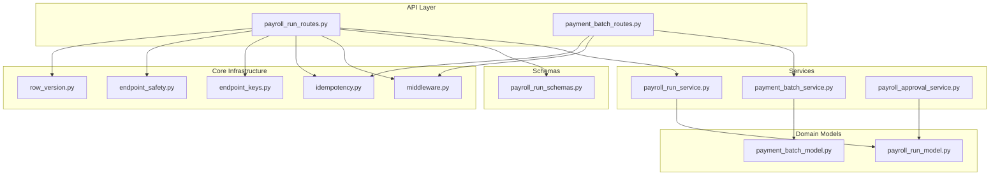
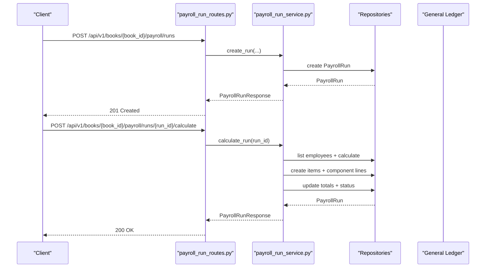
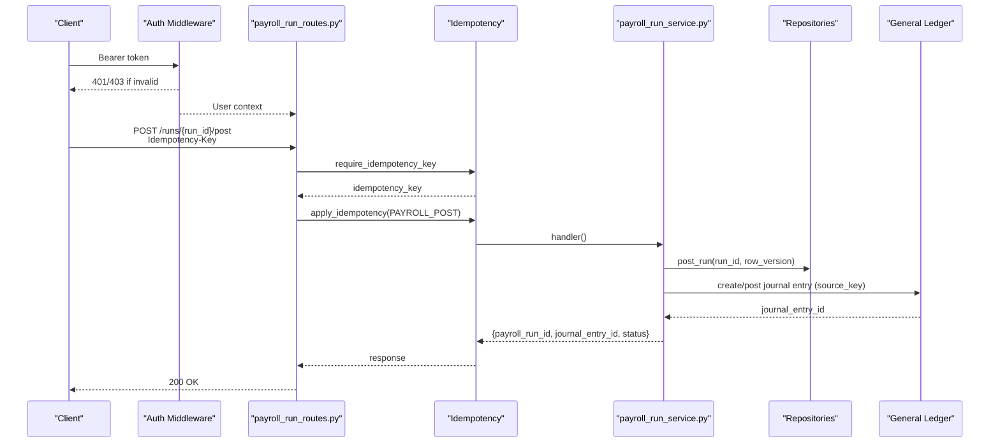
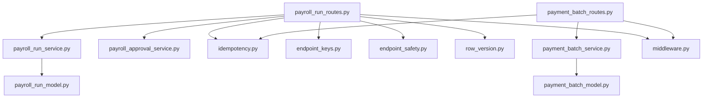

# Payroll API Endpoints

<cite>
**Referenced Files in This Document**
- [payroll_run_routes.py](file://app/modules/payroll/api/routes/payroll_run_routes.py)
- [payment_batch_routes.py](file://app/modules/payroll/api/routes/payment_batch_routes.py)
- [payroll_run_schemas.py](file://app/modules/payroll/schemas/payroll_run_schemas.py)
- [payroll_run_model.py](file://app/modules/payroll/models/payroll_run_model.py)
- [payment_batch_model.py](file://app/modules/payroll/models/payment_batch_model.py)
- [payroll_run_service.py](file://app/modules/payroll/services/payroll_run_service.py)
- [payment_batch_service.py](file://app/modules/payroll/services/payment_batch_service.py)
- [payroll_approval_service.py](file://app/modules/payroll/services/payroll_approval_service.py)
- [middleware.py](file://app/auth/middleware.py)
- [idempotency.py](file://app/core/idempotency.py)
- [endpoint_keys.py](file://app/core/endpoint_keys.py)
- [endpoint_safety.py](file://app/core/endpoint_safety.py)
- [row_version.py](file://app/core/row_version.py)
- [v1_init.py](file://app/api/v1/__init__.py)
- [main.py](file://app/main.py)
</cite>

## Table of Contents
1. [Introduction](#introduction)
2. [Project Structure](#project-structure)
3. [Core Components](#core-components)
4. [Architecture Overview](#architecture-overview)
5. [Detailed Component Analysis](#detailed-component-analysis)
6. [Dependency Analysis](#dependency-analysis)
7. [Performance Considerations](#performance-considerations)
8. [Troubleshooting Guide](#troubleshooting-guide)
9. [Conclusion](#conclusion)

## Introduction
This document provides comprehensive API documentation for payroll endpoints, focusing on payroll run lifecycle management and payment batch operations. It covers route definitions, request/response schemas, authentication and authorization requirements, error handling, idempotency guarantees, and safety mechanisms. The documented endpoints include:
- Payroll run creation, calculation, approval submission, approval, rejection, posting, and reversal
- Payment batch generation and file download

## Project Structure
The payroll module is organized by feature with clear separation of concerns:
- API routes define HTTP endpoints and request/response models
- Services encapsulate business logic and workflow orchestration
- Repositories handle persistence operations
- Models define domain entities and enumerations
- Schemas validate and serialize request/response payloads
- Core infrastructure supports authentication, idempotency, and safety policies

**Diagram sources**
- [payroll_run_routes.py](file://app/modules/payroll/api/routes/payroll_run_routes.py#L25-L302)
- [payment_batch_routes.py](file://app/modules/payroll/api/routes/payment_batch_routes.py#L10-L59)
- [payroll_run_service.py](file://app/modules/payroll/services/payroll_run_service.py#L25-L416)
- [payment_batch_service.py](file://app/modules/payroll/services/payment_batch_service.py#L16-L133)
- [payroll_approval_service.py](file://app/modules/payroll/services/payroll_approval_service.py#L26-L253)
- [payroll_run_model.py](file://app/modules/payroll/models/payroll_run_model.py#L23-L117)
- [payment_batch_model.py](file://app/modules/payroll/models/payment_batch_model.py#L18-L42)
- [payroll_run_schemas.py](file://app/modules/payroll/schemas/payroll_run_schemas.py#L9-L102)
- [middleware.py](file://app/auth/middleware.py#L17-L140)
- [idempotency.py](file://app/core/idempotency.py#L23-L482)
- [endpoint_keys.py](file://app/core/endpoint_keys.py#L13-L15)
- [endpoint_safety.py](file://app/core/endpoint_safety.py#L31-L118)
- [row_version.py](file://app/core/row_version.py#L8-L31)

**Section sources**
- [v1_init.py](file://app/api/v1/__init__.py#L22-L57)
- [main.py](file://app/main.py#L29-L31)

## Core Components
- Payroll run routes: Define endpoints for payroll lifecycle operations under /api/v1/books/{book_id}/payroll/runs
- Payment batch routes: Define endpoints for batch generation and file retrieval under /api/v1/books/{book_id}/payroll
- Services: Encapsulate workflow logic, validations, and integrations with general ledger and HR repositories
- Models: Define domain entities (PayrollRun, PayrollRunItem, PayrollPaymentBatch) and statuses
- Schemas: Validate and serialize request/response payloads
- Authentication and authorization: JWT bearer token validation and financial management service access checks
- Idempotency and safety: Centralized idempotency enforcement with endpoint-specific TTLs and retry policies

**Section sources**
- [payroll_run_routes.py](file://app/modules/payroll/api/routes/payroll_run_routes.py#L25-L302)
- [payment_batch_routes.py](file://app/modules/payroll/api/routes/payment_batch_routes.py#L10-L59)
- [payroll_run_service.py](file://app/modules/payroll/services/payroll_run_service.py#L25-L416)
- [payment_batch_service.py](file://app/modules/payroll/services/payment_batch_service.py#L16-L133)
- [payroll_run_model.py](file://app/modules/payroll/models/payroll_run_model.py#L10-L117)
- [payment_batch_model.py](file://app/modules/payroll/models/payment_batch_model.py#L9-L42)
- [payroll_run_schemas.py](file://app/modules/payroll/schemas/payroll_run_schemas.py#L9-L102)
- [middleware.py](file://app/auth/middleware.py#L17-L140)
- [idempotency.py](file://app/core/idempotency.py#L23-L482)
- [endpoint_safety.py](file://app/core/endpoint_safety.py#L31-L118)

## Architecture Overview
The payroll API follows a layered architecture:
- HTTP layer: FastAPI routes handle requests and responses
- Service layer: Business logic orchestrates calculations, approvals, postings, and reversals
- Persistence layer: Repositories manage database operations
- Domain models: Represent entities and statuses
- Core infrastructure: Authentication, idempotency, and safety policies

**Diagram sources**
- [payroll_run_routes.py](file://app/modules/payroll/api/routes/payroll_run_routes.py#L28-L66)
- [payroll_run_service.py](file://app/modules/payroll/services/payroll_run_service.py#L38-L147)

## Detailed Component Analysis

### Payroll Run Routes
Endpoints for payroll run lifecycle management:

- POST /api/v1/books/{book_id}/payroll/runs
  - Purpose: Create a new payroll run
  - Authentication: Requires valid JWT with financial management service access
  - Request body: PayrollRunCreate schema
  - Response: PayrollRunResponse (201 Created)
  - Validation: Pay group ownership and currency consistency
  - Error codes: 400 (validation), 404 (not found)

- POST /api/v1/books/{book_id}/payroll/runs/{run_id}/calculate
  - Purpose: Compute payroll amounts for all eligible employees
  - Authentication: Requires valid JWT with financial management service access
  - Response: PayrollRunResponse (200 OK)
  - Validation: Run must be in DRAFT status
  - Error codes: 400 (validation), 404 (not found)

- POST /api/v1/books/{book_id}/payroll/runs/{run_id}/submit-approval
  - Purpose: Submit run for approval or auto-approve if policy not required
  - Authentication: Requires valid JWT with financial management service access
  - Request body: PayrollRunSubmitApprovalRequest (includes row_version)
  - Response: PayrollRunResponse
  - Validation: Row version check, status must be CALCULATED
  - Authorization: Role-based checks via approval policy
  - Error codes: 400 (approval error), 404 (not found)

- POST /api/v1/books/{book_id}/payroll/runs/{run_id}/approve
  - Purpose: Approve a payroll run pending approval
  - Authentication: Requires valid JWT with financial management service access
  - Request body: PayrollRunApproveRequest (includes row_version)
  - Response: PayrollRunResponse
  - Validation: Row version check, status must be PENDING_APPROVAL, SoD validation
  - Error codes: 400 (approval error), 404 (not found)

- POST /api/v1/books/{book_id}/payroll/runs/{run_id}/reject
  - Purpose: Reject a payroll run pending approval
  - Authentication: Requires valid JWT with financial management service access
  - Request body: PayrollRunRejectRequest (includes row_version)
  - Response: PayrollRunResponse
  - Validation: Row version check, status must be PENDING_APPROVAL, SoD validation
  - Error codes: 400 (approval error), 404 (not found)

- POST /api/v1/books/{book_id}/payroll/runs/{run_id}/post
  - Purpose: Post payroll run to accrual book (journal entry)
  - Authentication: Requires valid JWT with financial management service access
  - Request body: PayrollRunPostRequest (requires Idempotency-Key header)
  - Response: JSON with payroll_run_id, journal_entry_id, status (200 OK)
  - Validation: Row version check, status must be APPROVED, book ownership
  - Idempotency: Enforced via idempotency key and endpoint key PAYROLL_POST
  - Safety: Uses source_key to prevent duplicate journal entries
  - Error codes: 400 (validation), 404 (not found), 409 (conflict), 425 (too early)

- POST /api/v1/books/{book_id}/payroll/runs/{run_id}/reverse
  - Purpose: Reverse a posted payroll run (FINANCE_ADMIN only)
  - Authentication: Requires valid JWT with financial management service access
  - Request body: PayrollRunReverseRequest
  - Response: PayrollRunResponse
  - Validation: Run must be POSTED, book ownership, FINANCE_ADMIN role
  - Idempotency: Enforced via idempotency key and endpoint key PAYROLL_REVERSE
  - Safety: Uses source_key to prevent duplicate reversals
  - Error codes: 400 (validation), 403 (forbidden), 404 (not found), 409 (conflict)

Request/Response Schemas
- PayrollRunCreate: entity_id, book_id, pay_group_id, pay_period_start, pay_period_end, pay_date
- PayrollRunSubmitApprovalRequest: reason (optional), row_version (required)
- PayrollRunApproveRequest: reason (optional), override_reason (optional), row_version (required)
- PayrollRunRejectRequest: reason (required), required_changes (optional), row_version (required)
- PayrollRunPostRequest: reason (optional), idempotency_key (optional), row_version (required)
- PayrollRunReverseRequest: reason (required), reversal_date (optional)
- PayrollRunResponse: comprehensive run details including totals, status, audit fields, and items

Parameter Validation
- UUID path parameters validated by FastAPI routing
- Row version enforced via optimistic locking
- Status transitions validated by service logic
- Book ownership verified before posting/reversal

Error Handling
- HTTPException with appropriate status codes
- 401 Unauthorized for invalid or missing tokens
- 403 Forbidden for insufficient permissions
- 404 Not Found for missing resources
- 400 Bad Request for validation errors
- 409 Conflict for row version mismatches or idempotency conflicts
- 425 Too Early for concurrent idempotent requests

Idempotency and Safety Mechanisms
- Idempotency-Key header required for POST /runs/{run_id}/post
- Canonical request hashing and stable serialization
- Endpoint-specific TTLs and retry policies
- Safe-to-retry flags for payroll posting and reversal
- Source_key-based uniqueness for journal entries and reversals

**Section sources**
- [payroll_run_routes.py](file://app/modules/payroll/api/routes/payroll_run_routes.py#L28-L264)
- [payroll_run_schemas.py](file://app/modules/payroll/schemas/payroll_run_schemas.py#L9-L102)
- [payroll_run_model.py](file://app/modules/payroll/models/payroll_run_model.py#L10-L117)
- [payroll_approval_service.py](file://app/modules/payroll/services/payroll_approval_service.py#L34-L228)
- [payroll_run_service.py](file://app/modules/payroll/services/payroll_run_service.py#L172-L367)
- [idempotency.py](file://app/core/idempotency.py#L219-L482)
- [endpoint_keys.py](file://app/core/endpoint_keys.py#L13-L15)
- [endpoint_safety.py](file://app/core/endpoint_safety.py#L31-L118)
- [row_version.py](file://app/core/row_version.py#L8-L31)

### Payment Batch Routes
Endpoints for batch processing operations:

- POST /api/v1/books/{book_id}/payroll/runs/{run_id}/wps-batch
  - Purpose: Generate WPS payment batch from a posted payroll run
  - Authentication: Requires valid JWT with financial management service access
  - Query parameters: exported_by (UUID)
  - Response: JSON with batch_id, batch_number, export_type, status, file_size (201 Created)
  - Validation: Run must be POSTED, employees must have WPS eligibility and valid data
  - Error codes: 400 (validation), 404 (not found)

- GET /api/v1/books/{book_id}/payroll/batches/{batch_id}/download
  - Purpose: Download generated payment batch file
  - Authentication: Requires valid JWT with financial management service access
  - Response: Binary stream (application/octet-stream) with attachment header
  - Validation: Batch must exist, file content must be retrievable
  - Error codes: 404 (not found)

Request/Response Schemas
- PayrollPaymentBatch: batch_number, export_type, status, file_path, file_hash, file_size, exported_at, exported_by, metadata
- BatchStatus: GENERATED, EXPORTED, SUBMITTED, PROCESSED, FAILED

Integration Patterns
- WPS exporter plugin validates employee data and generates SIF files
- Batch records track export metadata and file hashes
- Download endpoint regenerates content when needed

**Section sources**
- [payment_batch_routes.py](file://app/modules/payroll/api/routes/payment_batch_routes.py#L13-L59)
- [payment_batch_model.py](file://app/modules/payroll/models/payment_batch_model.py#L9-L42)
- [payment_batch_service.py](file://app/modules/payroll/services/payment_batch_service.py#L27-L133)

### Authentication and Authorization
- JWT Bearer token validation against centralized auth service or local decoding
- Financial management service access verification
- User context extraction with user_id, email, roles, and permissions
- Role-based restrictions for reversal operations (FINANCE_ADMIN only)

**Section sources**
- [middleware.py](file://app/auth/middleware.py#L17-L140)

### Idempotency and Safety Policies
- Centralized idempotency enforcement with canonical JSON hashing
- Endpoint-specific TTLs and retry policies
- Safe-to-retry flags for payroll posting and reversal
- Source_key-based uniqueness for journal entries and reversals

**Section sources**
- [idempotency.py](file://app/core/idempotency.py#L23-L482)
- [endpoint_safety.py](file://app/core/endpoint_safety.py#L31-L118)
- [endpoint_keys.py](file://app/core/endpoint_keys.py#L13-L15)

## Architecture Overview

**Diagram sources**
- [payroll_run_routes.py](file://app/modules/payroll/api/routes/payroll_run_routes.py#L141-L199)
- [idempotency.py](file://app/core/idempotency.py#L219-L482)
- [payroll_run_service.py](file://app/modules/payroll/services/payroll_run_service.py#L172-L314)

## Detailed Component Analysis

### Payroll Run Service
Responsibilities:
- Create runs with unique numbering and currency alignment
- Calculate per-employee pay and aggregate totals
- Manage approval workflow transitions
- Post runs to accrual books with journal entries
- Reverse posted runs with proper period handling
- Maintain row version for optimistic concurrency

Key flows:
- Calculation aggregates component lines and updates run totals
- Posting validates period availability and uses source_key uniqueness
- Reversal delegates to general ledger service with reversal source_key

**Section sources**
- [payroll_run_service.py](file://app/modules/payroll/services/payroll_run_service.py#L38-L416)

### Payment Batch Service
Responsibilities:
- Generate WPS batches from posted payroll runs
- Validate employee data and filter eligible participants
- Create batch records with metadata and file hashes
- Provide batch file download capability

**Section sources**
- [payment_batch_service.py](file://app/modules/payroll/services/payment_batch_service.py#L27-L133)

### Approval Service
Responsibilities:
- Enforce approval policy decisions
- Validate segregation of duties (SoD) during approvals
- Track audit logs for all actions
- Support override reasons for authorized roles

**Section sources**
- [payroll_approval_service.py](file://app/modules/payroll/services/payroll_approval_service.py#L34-L228)

### Data Models
- PayrollRun: Immutable after posting, tracks status, totals, and audit fields
- PayrollRunItem: Per-employee run items with component line breakdowns
- PayrollPaymentBatch: Export batches with status and metadata

**Section sources**
- [payroll_run_model.py](file://app/modules/payroll/models/payroll_run_model.py#L23-L117)
- [payment_batch_model.py](file://app/modules/payroll/models/payment_batch_model.py#L18-L42)

## Dependency Analysis

**Diagram sources**
- [payroll_run_routes.py](file://app/modules/payroll/api/routes/payroll_run_routes.py#L25-L302)
- [payment_batch_routes.py](file://app/modules/payroll/api/routes/payment_batch_routes.py#L10-L59)
- [payroll_run_service.py](file://app/modules/payroll/services/payroll_run_service.py#L25-L416)
- [payment_batch_service.py](file://app/modules/payroll/services/payment_batch_service.py#L16-L133)
- [payroll_approval_service.py](file://app/modules/payroll/services/payroll_approval_service.py#L26-L253)
- [payroll_run_model.py](file://app/modules/payroll/models/payroll_run_model.py#L23-L117)
- [payment_batch_model.py](file://app/modules/payroll/models/payment_batch_model.py#L18-L42)
- [middleware.py](file://app/auth/middleware.py#L17-L140)
- [idempotency.py](file://app/core/idempotency.py#L23-L482)
- [endpoint_keys.py](file://app/core/endpoint_keys.py#L13-L15)
- [endpoint_safety.py](file://app/core/endpoint_safety.py#L31-L118)
- [row_version.py](file://app/core/row_version.py#L8-L31)

**Section sources**
- [payroll_run_routes.py](file://app/modules/payroll/api/routes/payroll_run_routes.py#L25-L302)
- [payment_batch_routes.py](file://app/modules/payroll/api/routes/payment_batch_routes.py#L10-L59)

## Performance Considerations
- Idempotency keys reduce duplicate processing overhead
- Canonical JSON encoding ensures consistent hashing
- Endpoint TTLs balance concurrency control with responsiveness
- Journal entry creation leverages source_key uniqueness to avoid redundant writes
- Batch generation filters invalid employees early to minimize processing

[No sources needed since this section provides general guidance]

## Troubleshooting Guide
Common issues and resolutions:
- Authentication failures: Verify JWT validity and financial management service access
- Authorization failures: Ensure user has required roles (e.g., FINANCE_ADMIN for reversal)
- Row version conflicts: Refresh data and resend with current row_version
- Idempotency conflicts: Use unique Idempotency-Key or wait for lock TTL expiration
- Status transition errors: Confirm run status matches expected workflow stage
- Batch generation failures: Check employee WPS eligibility and required fields

**Section sources**
- [middleware.py](file://app/auth/middleware.py#L17-L140)
- [row_version.py](file://app/core/row_version.py#L8-L31)
- [idempotency.py](file://app/core/idempotency.py#L283-L377)
- [payroll_run_routes.py](file://app/modules/payroll/api/routes/payroll_run_routes.py#L141-L264)

## Conclusion
The payroll API provides a robust, secure, and idempotent interface for managing payroll runs and payment batches. It enforces strong validation, authorization, and safety mechanisms while supporting reliable integration patterns through idempotency and source_key uniqueness. The modular architecture enables maintainability and extensibility for future enhancements.