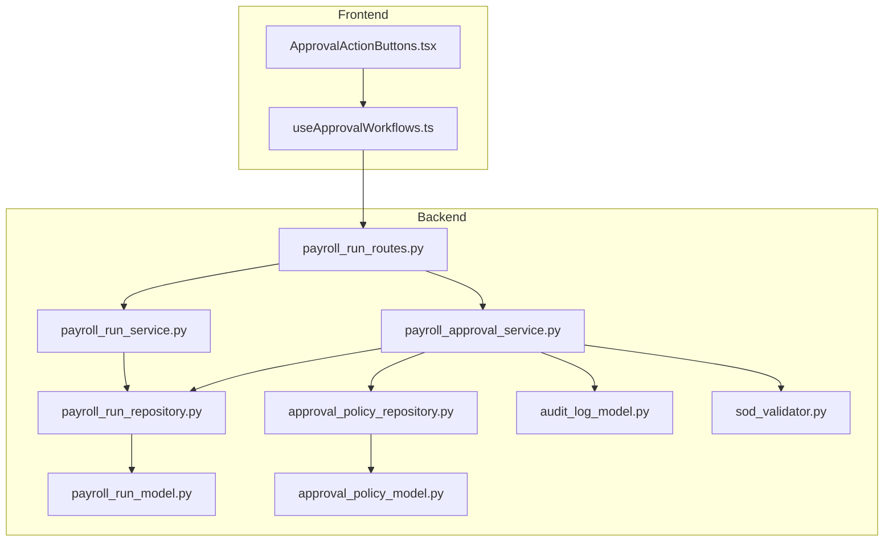
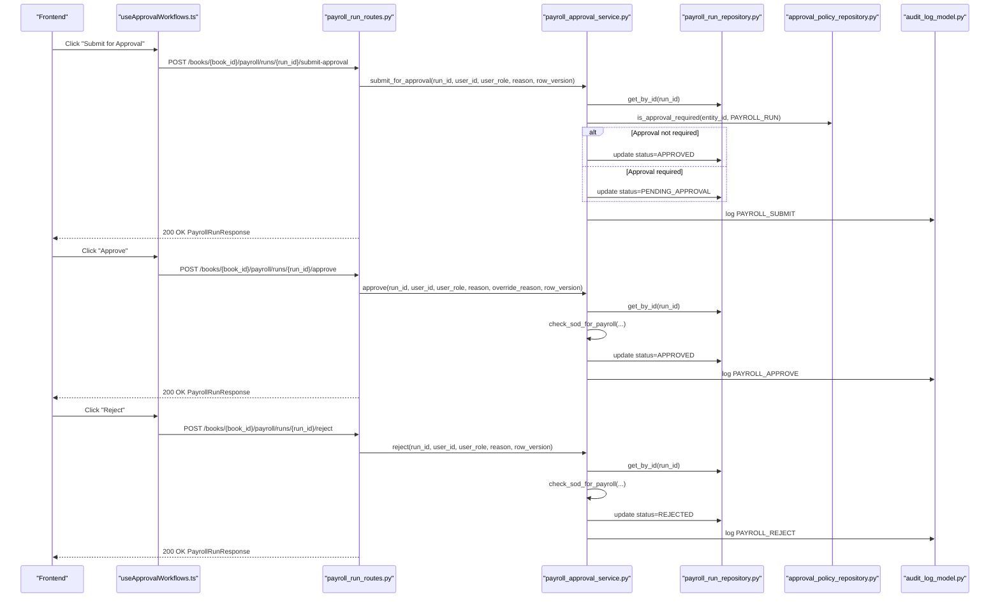
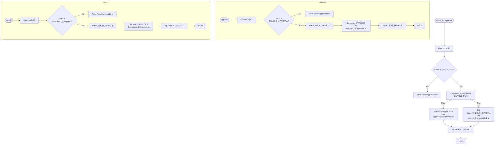
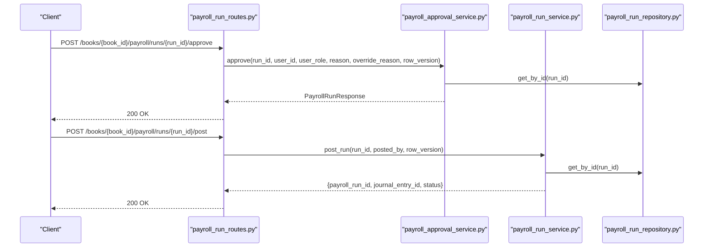
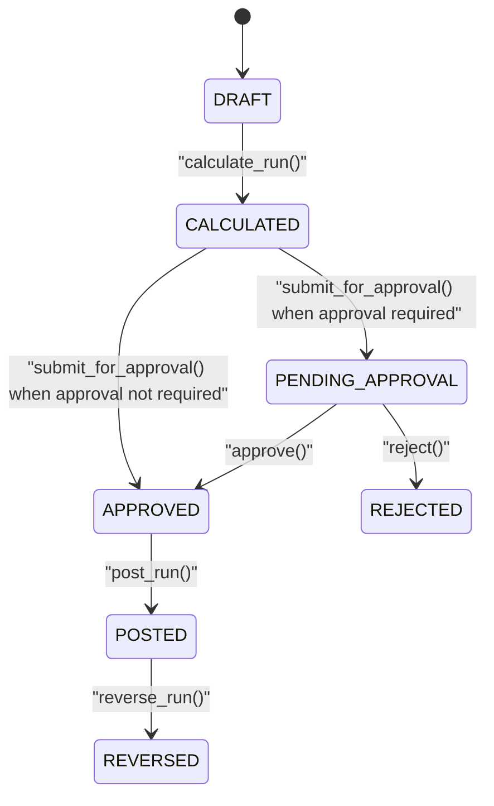
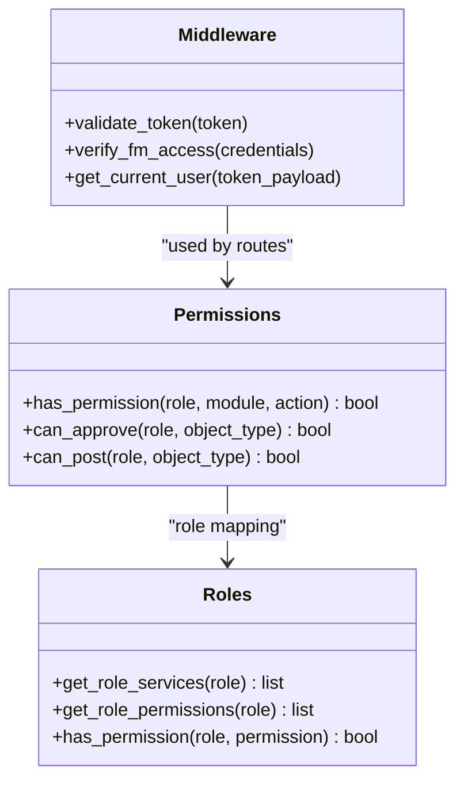
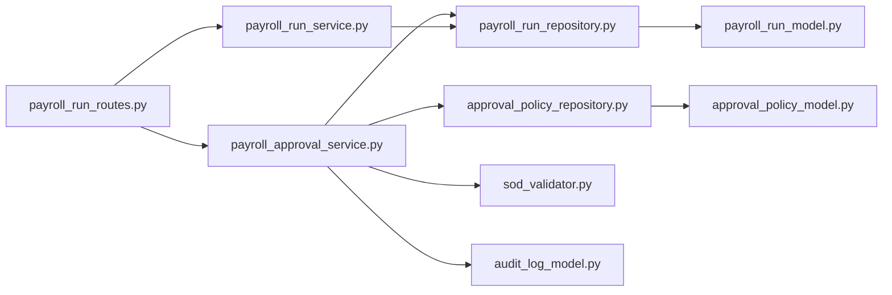

# Payroll Approval Workflow

<cite>
**Referenced Files in This Document**
- [payroll_approval_service.py](file://app/modules/payroll/services/payroll_approval_service.py)
- [payroll_run_routes.py](file://app/modules/payroll/api/routes/payroll_run_routes.py)
- [payroll_run_model.py](file://app/modules/payroll/models/payroll_run_model.py)
- [payroll_run_schemas.py](file://app/modules/payroll/schemas/payroll_run_schemas.py)
- [payroll_run_repository.py](file://app/modules/payroll/repositories/payroll_run_repository.py)
- [payroll_run_service.py](file://app/modules/payroll/services/payroll_run_service.py)
- [approval_policy_model.py](file://app/modules/core/models/approval_policy_model.py)
- [approval_policy_repository.py](file://app/modules/core/repositories/approval_policy_repository.py)
- [audit_log_model.py](file://app/modules/core/models/audit_log_model.py)
- [sod_validator.py](file://app/modules/core/services/sod_validator.py)
- [middleware.py](file://app/auth/middleware.py)
- [permissions.py](file://app/auth/permissions.py)
- [roles.py](file://app/auth/roles.py)
- [001_add_approval_workflow_fields_and_period_close_checklist.py](file://database/migrations/versions/001_add_approval_workflow_fields_and_period_close_checklist.py)
- [ApprovalActionButtons.tsx](file://frontend/components/common/ApprovalActionButtons.tsx)
- [useApprovalWorkflows.ts](file://frontend/hooks/useApprovalWorkflows.ts)
</cite>

## Table of Contents
1. [Introduction](#introduction)
2. [Project Structure](#project-structure)
3. [Core Components](#core-components)
4. [Architecture Overview](#architecture-overview)
5. [Detailed Component Analysis](#detailed-component-analysis)
6. [Dependency Analysis](#dependency-analysis)
7. [Performance Considerations](#performance-considerations)
8. [Troubleshooting Guide](#troubleshooting-guide)
9. [Conclusion](#conclusion)
10. [Appendices](#appendices)

## Introduction
This document describes the payroll approval workflow system, covering the end-to-end process for submitting, reviewing, approving, rejecting, and posting payroll runs. It explains the approval submission and review processes, authorization hierarchies, approval policy enforcement, role-based access controls, audit trail requirements, and integration with payroll run routes. It also documents approval schemas for request/response validation, provides examples of approval scenarios, escalation procedures, compliance requirements, and approval status tracking and notification systems.

## Project Structure
The payroll approval workflow spans backend services, API routes, models, repositories, schemas, and frontend components:
- Backend: Services orchestrate state transitions; routes expose endpoints; models define data structures; repositories encapsulate persistence; schemas validate requests/responses.
- Frontend: UI components render approval actions and integrate with backend APIs via React Query hooks.

**Diagram sources**
- [payroll_run_routes.py](file://app/modules/payroll/api/routes/payroll_run_routes.py#L1-L302)
- [payroll_approval_service.py](file://app/modules/payroll/services/payroll_approval_service.py#L1-L253)
- [payroll_run_service.py](file://app/modules/payroll/services/payroll_run_service.py#L1-L416)
- [payroll_run_repository.py](file://app/modules/payroll/repositories/payroll_run_repository.py#L1-L107)
- [approval_policy_repository.py](file://app/modules/core/repositories/approval_policy_repository.py#L1-L36)
- [payroll_run_model.py](file://app/modules/payroll/models/payroll_run_model.py#L1-L117)
- [approval_policy_model.py](file://app/modules/core/models/approval_policy_model.py#L1-L36)
- [audit_log_model.py](file://app/modules/core/models/audit_log_model.py#L1-L43)
- [sod_validator.py](file://app/modules/core/services/sod_validator.py#L1-L78)
- [ApprovalActionButtons.tsx](file://frontend/components/common/ApprovalActionButtons.tsx#L1-L297)
- [useApprovalWorkflows.ts](file://frontend/hooks/useApprovalWorkflows.ts#L1-L546)

**Section sources**
- [payroll_approval_service.py](file://app/modules/payroll/services/payroll_approval_service.py#L1-L253)
- [payroll_run_routes.py](file://app/modules/payroll/api/routes/payroll_run_routes.py#L1-L302)
- [payroll_run_model.py](file://app/modules/payroll/models/payroll_run_model.py#L1-L117)
- [payroll_run_schemas.py](file://app/modules/payroll/schemas/payroll_run_schemas.py#L1-L102)
- [payroll_run_repository.py](file://app/modules/payroll/repositories/payroll_run_repository.py#L1-L107)
- [approval_policy_model.py](file://app/modules/core/models/approval_policy_model.py#L1-L36)
- [approval_policy_repository.py](file://app/modules/core/repositories/approval_policy_repository.py#L1-L36)
- [audit_log_model.py](file://app/modules/core/models/audit_log_model.py#L1-L43)
- [sod_validator.py](file://app/modules/core/services/sod_validator.py#L1-L78)
- [ApprovalActionButtons.tsx](file://frontend/components/common/ApprovalActionButtons.tsx#L1-L297)
- [useApprovalWorkflows.ts](file://frontend/hooks/useApprovalWorkflows.ts#L1-L546)

## Core Components
- PayrollApprovalService: Implements approval lifecycle (submit, approve, reject) with state transitions, SoD checks, and audit logging.
- PayrollRunRoutes: Exposes REST endpoints for payroll run operations and delegates approval actions to the service layer.
- PayrollRunService: Manages run creation, calculation, posting, and reversal; integrates with GL posting.
- Models and Repositories: Define run statuses, approval fields, and persistence; enforce optimistic concurrency via row_version.
- Approval Policy: Per-entity configuration determining whether approval is required for payroll runs.
- Audit Log: Captures all approval actions with before/after status snapshots.
- Role-Based Access Control: Middleware and permission matrices govern who can submit, approve, reject, and post.

**Section sources**
- [payroll_approval_service.py](file://app/modules/payroll/services/payroll_approval_service.py#L26-L253)
- [payroll_run_routes.py](file://app/modules/payroll/api/routes/payroll_run_routes.py#L68-L139)
- [payroll_run_service.py](file://app/modules/payroll/services/payroll_run_service.py#L25-L416)
- [payroll_run_model.py](file://app/modules/payroll/models/payroll_run_model.py#L10-L68)
- [approval_policy_model.py](file://app/modules/core/models/approval_policy_model.py#L9-L36)
- [approval_policy_repository.py](file://app/modules/core/repositories/approval_policy_repository.py#L10-L36)
- [audit_log_model.py](file://app/modules/core/models/audit_log_model.py#L9-L43)
- [middleware.py](file://app/auth/middleware.py#L17-L140)
- [permissions.py](file://app/auth/permissions.py#L8-L127)
- [roles.py](file://app/auth/roles.py#L7-L119)

## Architecture Overview
The approval workflow follows a state machine with explicit transitions and policy-driven gating. The frontend triggers actions that call backend routes, which validate permissions, enforce SoD, and persist state changes with audit trails.

**Diagram sources**
- [payroll_run_routes.py](file://app/modules/payroll/api/routes/payroll_run_routes.py#L68-L139)
- [payroll_approval_service.py](file://app/modules/payroll/services/payroll_approval_service.py#L34-L228)
- [payroll_run_repository.py](file://app/modules/payroll/repositories/payroll_run_repository.py#L16-L21)
- [approval_policy_repository.py](file://app/modules/core/repositories/approval_policy_repository.py#L26-L36)
- [audit_log_model.py](file://app/modules/core/models/audit_log_model.py#L9-L43)
- [useApprovalWorkflows.ts](file://frontend/hooks/useApprovalWorkflows.ts#L13-L126)

## Detailed Component Analysis

### Payroll Approval Service
Implements the core approval logic:
- Submission: Validates status and row_version, checks approval policy, transitions to PENDING_APPROVAL or APPROVED, logs audit event.
- Approval: Enforces SoD validation, updates approved fields, increments row_version, logs audit event.
- Rejection: Requires reason, enforces SoD, transitions to REJECTED, logs audit event.

**Diagram sources**
- [payroll_approval_service.py](file://app/modules/payroll/services/payroll_approval_service.py#L34-L228)

**Section sources**
- [payroll_approval_service.py](file://app/modules/payroll/services/payroll_approval_service.py#L26-L253)

### Payroll Run Routes
Defines REST endpoints for payroll operations:
- POST /runs: Create payroll run
- POST /runs/{run_id}/calculate: Calculate payroll run
- POST /runs/{run_id}/submit-approval: Submit for approval
- POST /runs/{run_id}/approve: Approve payroll run
- POST /runs/{run_id}/reject: Reject payroll run
- POST /runs/{run_id}/post: Post payroll run (integration with GL posting)
- GET /runs: List payroll runs
- GET /runs/{run_id}: Get payroll run details

**Diagram sources**
- [payroll_run_routes.py](file://app/modules/payroll/api/routes/payroll_run_routes.py#L68-L199)

**Section sources**
- [payroll_run_routes.py](file://app/modules/payroll/api/routes/payroll_run_routes.py#L1-L302)

### Payroll Run Model and Status Machine
Defines run statuses and approval-related fields:
- Statuses: DRAFT, CALCULATED, PENDING_APPROVAL, APPROVED, POSTED, PAID, CLOSED, REJECTED, REVERSED
- Approval fields: submitted_by/submitted_at, approved_by/approved_at, rejected_by/rejected_at, decision_reason
- Row version for optimistic concurrency

**Diagram sources**
- [payroll_run_model.py](file://app/modules/payroll/models/payroll_run_model.py#L10-L68)

**Section sources**
- [payroll_run_model.py](file://app/modules/payroll/models/payroll_run_model.py#L10-L68)

### Approval Policy Enforcement
Per-entity configuration determines whether approval is required for payroll runs:
- ApprovalObjectType includes PAYROLL_RUN
- Default behavior: approval required if no policy configured

**Section sources**
- [approval_policy_model.py](file://app/modules/core/models/approval_policy_model.py#L9-L36)
- [approval_policy_repository.py](file://app/modules/core/repositories/approval_policy_repository.py#L10-L36)

### Role-Based Access Controls and Authorization Hierarchies
- Middleware validates tokens and ensures access to financial management service; extracts user_id, roles, and permissions.
- Permission matrix defines granular permissions per role for payroll operations (submit, approve, reject, post).
- Roles include PAYROLL_PREPARER, PAYROLL_APPROVER, FINANCE_ADMIN, etc.

**Diagram sources**
- [middleware.py](file://app/auth/middleware.py#L17-L140)
- [permissions.py](file://app/auth/permissions.py#L8-L127)
- [roles.py](file://app/auth/roles.py#L7-L119)

**Section sources**
- [middleware.py](file://app/auth/middleware.py#L17-L140)
- [permissions.py](file://app/auth/permissions.py#L8-L127)
- [roles.py](file://app/auth/roles.py#L7-L119)

### Audit Trail Requirements
- AuditLog captures actor_user_id, actor_role, action, object_type, object_id, before_json, after_json, reason, timestamps, and correlation_id.
- PayrollApprovalService logs PAYROLL_SUBMIT, PAYROLL_APPROVE, PAYROLL_REJECT actions with before/after status snapshots.

**Section sources**
- [audit_log_model.py](file://app/modules/core/models/audit_log_model.py#L9-L43)
- [payroll_approval_service.py](file://app/modules/payroll/services/payroll_approval_service.py#L230-L253)

### Approval Schemas for Request/Response Validation
Request/response schemas define the shape of approval operations:
- SubmitApprovalRequest: reason, row_version
- ApproveRequest: reason, override_reason, row_version
- RejectRequest: reason, required_changes, row_version
- PostRequest: reason, idempotency_key, row_version
- Response: includes status, approval timestamps, decision_reason, row_version, and items

**Section sources**
- [payroll_run_schemas.py](file://app/modules/payroll/schemas/payroll_run_schemas.py#L19-L50)
- [payroll_run_schemas.py](file://app/modules/payroll/schemas/payroll_run_schemas.py#L69-L102)

### Frontend Integration and User Experience
- ApprovalActionButtons renders conditional buttons based on status and permissions.
- useApprovalWorkflows.ts integrates with TanStack Query to call backend endpoints for submit, approve, reject, and post actions.

**Section sources**
- [ApprovalActionButtons.tsx](file://frontend/components/common/ApprovalActionButtons.tsx#L11-L297)
- [useApprovalWorkflows.ts](file://frontend/hooks/useApprovalWorkflows.ts#L13-L126)

## Dependency Analysis
The approval workflow depends on:
- Services invoking repositories for persistence
- Policy repository for approval gating
- SoD validator for segregation of duties
- Audit log model for compliance
- Middleware and permissions for access control

**Diagram sources**
- [payroll_run_routes.py](file://app/modules/payroll/api/routes/payroll_run_routes.py#L1-L302)
- [payroll_approval_service.py](file://app/modules/payroll/services/payroll_approval_service.py#L1-L253)
- [payroll_run_repository.py](file://app/modules/payroll/repositories/payroll_run_repository.py#L1-L107)
- [approval_policy_repository.py](file://app/modules/core/repositories/approval_policy_repository.py#L1-L36)
- [sod_validator.py](file://app/modules/core/services/sod_validator.py#L1-L78)
- [audit_log_model.py](file://app/modules/core/models/audit_log_model.py#L1-L43)
- [payroll_run_service.py](file://app/modules/payroll/services/payroll_run_service.py#L1-L416)
- [payroll_run_model.py](file://app/modules/payroll/models/payroll_run_model.py#L1-L117)
- [approval_policy_model.py](file://app/modules/core/models/approval_policy_model.py#L1-L36)

**Section sources**
- [payroll_approval_service.py](file://app/modules/payroll/services/payroll_approval_service.py#L1-L253)
- [payroll_run_routes.py](file://app/modules/payroll/api/routes/payroll_run_routes.py#L1-L302)

## Performance Considerations
- Optimistic concurrency: row_version prevents lost updates during concurrent approvals.
- Idempotency: Posting uses idempotency keys to prevent duplicate postings.
- Indexes: AuditLog and other models include indexes on frequently queried fields (actor_user_id, object_type, action, created_at).
- Asynchronous operations: SQLAlchemy async sessions support non-blocking I/O.

[No sources needed since this section provides general guidance]

## Troubleshooting Guide
Common issues and resolutions:
- Status transition errors: Ensure run is in expected status before submitting/approving/rejecting.
- Rejection requires reason: Provide a non-empty reason for rejection.
- SoD violations: Address conflicts by adjusting roles or using override reasons where permitted.
- Not found errors: Verify run_id and book_id correctness.
- Access denied: Confirm user roles and permissions align with required actions.

**Section sources**
- [payroll_approval_service.py](file://app/modules/payroll/services/payroll_approval_service.py#L55-L59)
- [payroll_approval_service.py](file://app/modules/payroll/services/payroll_approval_service.py#L176-L177)
- [payroll_run_routes.py](file://app/modules/payroll/api/routes/payroll_run_routes.py#L195-L198)
- [audit_log_model.py](file://app/modules/core/models/audit_log_model.py#L14-L30)

## Conclusion
The payroll approval workflow integrates state-machine transitions, policy-driven gating, SoD validation, and comprehensive audit logging. Role-based access controls ensure appropriate authorization, while frontend components provide intuitive approval actions. The system supports compliance requirements through detailed audit trails and maintains data integrity via optimistic concurrency and idempotent posting.

[No sources needed since this section summarizes without analyzing specific files]

## Appendices

### Approval Scenarios and Examples
- Scenario 1: No approval required
  - Submit payroll run in CALCULATED status; policy indicates approval not required → auto-transition to APPROVED.
- Scenario 2: Standard approval flow
  - Submit → PENDING_APPROVAL → Approve → APPROVED → Post → POSTED.
- Scenario 3: Rejection
  - Submit → PENDING_APPROVAL → Reject → REJECTED; submitter must rework and resubmit.

**Section sources**
- [payroll_approval_service.py](file://app/modules/payroll/services/payroll_approval_service.py#L67-L79)
- [payroll_run_model.py](file://app/modules/payroll/models/payroll_run_model.py#L10-L21)

### Escalation Procedures
- Override mechanisms: Approve endpoint accepts override_reason for SoD overrides by authorized roles (e.g., FINANCE_ADMIN).
- Administrative intervention: FINANCE_ADMIN can override SoD constraints when justified.

**Section sources**
- [payroll_run_schemas.py](file://app/modules/payroll/schemas/payroll_run_schemas.py#L25-L29)
- [sod_validator.py](file://app/modules/core/services/sod_validator.py#L66-L77)
- [permissions.py](file://app/auth/permissions.py#L8-L17)

### Compliance Requirements
- Audit trail: All approval actions logged with before/after status snapshots and reasons.
- Idempotency: Posting is idempotent to prevent duplicate entries.
- Segregation of duties: SoD validation is enforced during approvals.

**Section sources**
- [audit_log_model.py](file://app/modules/core/models/audit_log_model.py#L9-L43)
- [payroll_run_routes.py](file://app/modules/payroll/api/routes/payroll_run_routes.py#L183-L194)
- [sod_validator.py](file://app/modules/core/services/sod_validator.py#L66-L77)

### Approval Status Tracking and Notification Systems
- Status tracking: PayrollRun includes submitted/approved/rejected timestamps and decision_reason.
- Notification systems: Integrate with frontend toast containers and dialogs to inform users of action outcomes.

**Section sources**
- [payroll_run_model.py](file://app/modules/payroll/models/payroll_run_model.py#L40-L53)
- [ApprovalActionButtons.tsx](file://frontend/components/common/ApprovalActionButtons.tsx#L1-L297)

### Database Schema Notes
- Approval workflow fields (submitted_by, submitted_at, approved_by, approved_at, rejected_by, rejected_at, decision_reason, row_version) are defined in models and referenced by migration comments.

**Section sources**
- [001_add_approval_workflow_fields_and_period_close_checklist.py](file://database/migrations/versions/001_add_approval_workflow_fields_and_period_close_checklist.py#L42-L52)