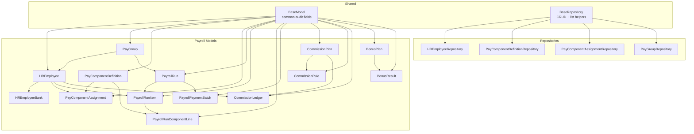
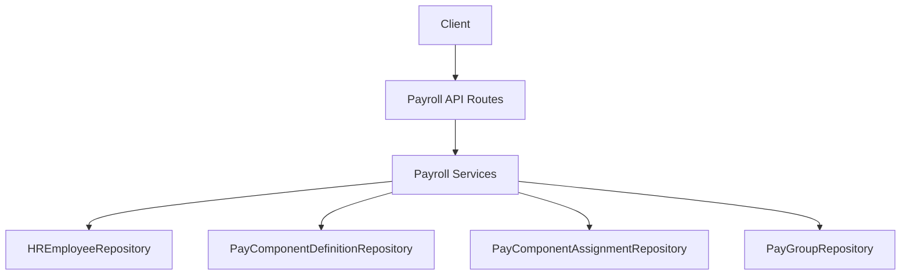
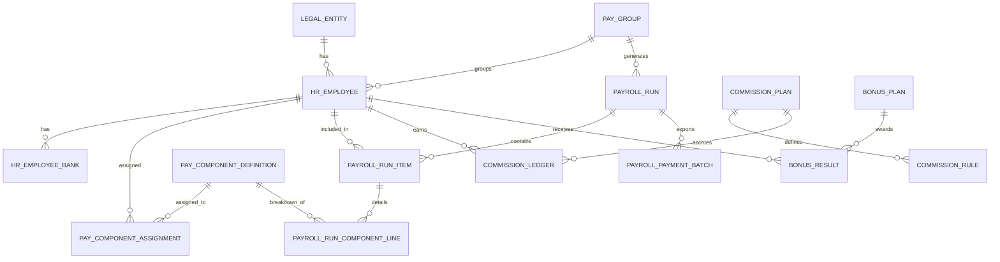
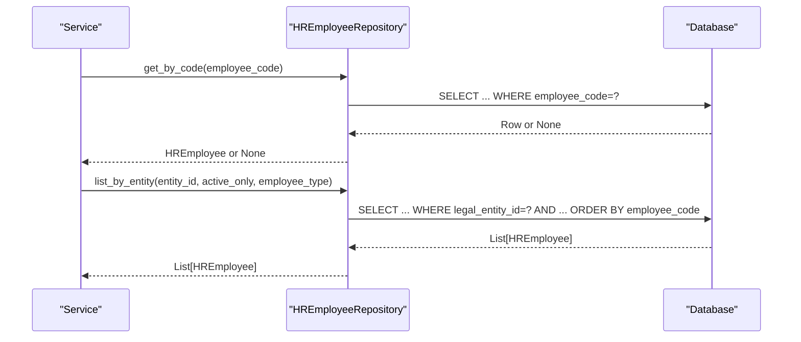
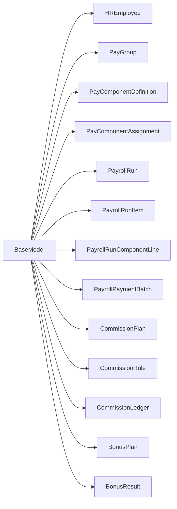

# Payroll Data Models

<cite>
**Referenced Files in This Document**
- [base_model.py](file://app/shared/models/base_model.py)
- [employee_model.py](file://app/modules/payroll/models/employee_model.py)
- [pay_group_model.py](file://app/modules/payroll/models/pay_group_model.py)
- [pay_component_model.py](file://app/modules/payroll/models/pay_component_model.py)
- [payroll_run_model.py](file://app/modules/payroll/models/payroll_run_model.py)
- [payment_batch_model.py](file://app/modules/payroll/models/payment_batch_model.py)
- [commission_model.py](file://app/modules/payroll/models/commission_model.py)
- [bonus_model.py](file://app/modules/payroll/models/bonus_model.py)
- [employee_repository.py](file://app/modules/payroll/repositories/employee_repository.py)
- [pay_component_repository.py](file://app/modules/payroll/repositories/pay_component_repository.py)
- [pay_group_repository.py](file://app/modules/payroll/repositories/pay_group_repository.py)
- [base_repository.py](file://app/shared/repositories/base_repository.py)
</cite>

## Table of Contents
1. [Introduction](#introduction)
2. [Project Structure](#project-structure)
3. [Core Components](#core-components)
4. [Architecture Overview](#architecture-overview)
5. [Detailed Component Analysis](#detailed-component-analysis)
6. [Dependency Analysis](#dependency-analysis)
7. [Performance Considerations](#performance-considerations)
8. [Troubleshooting Guide](#troubleshooting-guide)
9. [Conclusion](#conclusion)
10. [Appendices](#appendices)

## Introduction
This document describes the payroll data models used in the TrueVow Financial Management system. It focuses on:
- Employee models: personal information, employment details, compensation structures, and tax setup
- Payroll run models: run metadata, status tracking, calculation results, and posting information
- Payment batch models: batch processing, payment distributions, and disbursement records
- Variable compensation models: bonuses and commissions
It also documents model relationships, field definitions, validation rules, business constraints, entity relationship diagrams, sample data structures, data access patterns, and audit trail considerations.

## Project Structure
The payroll domain is organized under app/modules/payroll with models, repositories, services, and API routes. Models inherit a common base with standardized audit fields. Repositories encapsulate data access patterns and queries.

**Diagram sources**
- [base_model.py](file://app/shared/models/base_model.py#L9-L18)
- [base_repository.py](file://app/shared/repositories/base_repository.py#L11-L54)
- [employee_model.py](file://app/modules/payroll/models/employee_model.py#L16-L75)
- [pay_group_model.py](file://app/modules/payroll/models/pay_group_model.py#L24-L48)
- [pay_component_model.py](file://app/modules/payroll/models/pay_component_model.py#L38-L88)
- [payroll_run_model.py](file://app/modules/payroll/models/payroll_run_model.py#L23-L117)
- [payment_batch_model.py](file://app/modules/payroll/models/payment_batch_model.py#L18-L42)
- [commission_model.py](file://app/modules/payroll/models/commission_model.py#L17-L101)
- [bonus_model.py](file://app/modules/payroll/models/bonus_model.py#L16-L63)
- [employee_repository.py](file://app/modules/payroll/repositories/employee_repository.py#L10-L53)
- [pay_component_repository.py](file://app/modules/payroll/repositories/pay_component_repository.py#L15-L86)
- [pay_group_repository.py](file://app/modules/payroll/repositories/pay_group_repository.py#L10-L36)

**Section sources**
- [base_model.py](file://app/shared/models/base_model.py#L9-L18)
- [employee_model.py](file://app/modules/payroll/models/employee_model.py#L1-L75)
- [pay_group_model.py](file://app/modules/payroll/models/pay_group_model.py#L1-L48)
- [pay_component_model.py](file://app/modules/payroll/models/pay_component_model.py#L1-L88)
- [payroll_run_model.py](file://app/modules/payroll/models/payroll_run_model.py#L1-L117)
- [payment_batch_model.py](file://app/modules/payroll/models/payment_batch_model.py#L1-L42)
- [commission_model.py](file://app/modules/payroll/models/commission_model.py#L1-L101)
- [bonus_model.py](file://app/modules/payroll/models/bonus_model.py#L1-L63)
- [employee_repository.py](file://app/modules/payroll/repositories/employee_repository.py#L1-L53)
- [pay_component_repository.py](file://app/modules/payroll/repositories/pay_component_repository.py#L1-L86)
- [pay_group_repository.py](file://app/modules/payroll/repositories/pay_group_repository.py#L1-L36)
- [base_repository.py](file://app/shared/repositories/base_repository.py#L1-L54)

## Core Components
This section summarizes the core payroll entities and their responsibilities.

- Employee master data and bank details
- Pay groups and payroll calendars
- Pay components (earnings, deductions, employer contributions)
- Payroll runs and per-employee calculations
- Payment batches for export and disbursement
- Commission plans, rules, and ledgers
- Bonus plans and results

Key validation and constraints:
- Unique keys: employee_code, pay_group.group_code, pay component code per legal entity, payroll run number, payment batch number
- Monetary amounts stored with fixed precision
- Status enums enforce lifecycle transitions
- Effective date windows for component assignments
- Audit fields on all entities

**Section sources**
- [employee_model.py](file://app/modules/payroll/models/employee_model.py#L16-L75)
- [pay_group_model.py](file://app/modules/payroll/models/pay_group_model.py#L24-L48)
- [pay_component_model.py](file://app/modules/payroll/models/pay_component_model.py#L38-L88)
- [payroll_run_model.py](file://app/modules/payroll/models/payroll_run_model.py#L23-L117)
- [payment_batch_model.py](file://app/modules/payroll/models/payment_batch_model.py#L18-L42)
- [commission_model.py](file://app/modules/payroll/models/commission_model.py#L17-L101)
- [bonus_model.py](file://app/modules/payroll/models/bonus_model.py#L16-L63)

## Architecture Overview
The payroll domain follows a layered architecture:
- Models define entities and relationships
- Repositories encapsulate data access and queries
- Services orchestrate business logic (not detailed here)
- API routes expose endpoints (not detailed here)

**Diagram sources**
- [employee_repository.py](file://app/modules/payroll/repositories/employee_repository.py#L10-L53)
- [pay_component_repository.py](file://app/modules/payroll/repositories/pay_component_repository.py#L15-L86)
- [pay_group_repository.py](file://app/modules/payroll/repositories/pay_group_repository.py#L10-L36)

## Detailed Component Analysis

### Employee Models
- HREmployee: Master record with personal info, employment type, country/location, pay group linkage, currency, hire/termination dates, activity flag, and WPS-related fields. Cascading relationships for bank details, component assignments, payroll run items, and commission ledger entries.
- HREmployeeBank: Per-employee bank accounts with uniqueness constraint on (employee, is_primary). Supports IBAN and SWIFT codes.

Validation and constraints:
- employee_code is unique and indexed
- Country and currency are required
- WPS flags and IDs are optional but tracked for UAE compliance
- Unique constraint enforces single primary bank account per employee

Sample data structure outline:
- HREmployee: id, legal_entity_id, employee_code, employee_name, employee_type, country, location, pay_group_id, currency, hire_date, termination_date, is_active, wps_enabled, labour_id, mol_id, iban
- HREmployeeBank: id, hr_employee_id, bank_name, account_number, iban, swift_code, is_primary

Data access patterns:
- Retrieve by employee code
- List by entity and optionally type and active status
- List by pay group with active filter

**Section sources**
- [employee_model.py](file://app/modules/payroll/models/employee_model.py#L16-L75)
- [employee_repository.py](file://app/modules/payroll/repositories/employee_repository.py#L10-L53)
- [base_model.py](file://app/shared/models/base_model.py#L9-L18)

### Pay Group Models
- PayGroup: Defines payroll grouping with frequency, currency, pay day rule, WPS enablement, and activity flag. Links to employees and payroll runs.

Enums:
- PayFrequency: MONTHLY, BIWEEKLY, WEEKLY
- PayDayRule: LAST_BUSINESS_DAY, FIRST_BUSINESS_DAY, FIXED_DAY, MONTHLY_DAY_5

Constraints:
- group_code is unique and indexed
- Defaults applied for frequency and pay day rule

Sample data structure outline:
- PayGroup: id, legal_entity_id, group_code, group_name, frequency, payroll_currency, pay_day_rule, wps_enabled, is_active

Data access patterns:
- Retrieve by group code
- List by legal entity with optional active filter

**Section sources**
- [pay_group_model.py](file://app/modules/payroll/models/pay_group_model.py#L24-L48)
- [pay_group_repository.py](file://app/modules/payroll/repositories/pay_group_repository.py#L10-L36)

### Pay Component Models
- PayComponentDefinition: Standardized pay components with type (earning, deduction, employer contribution), taxability, WPS impact, GL mapping key, and activity flag. Enforces unique component_code per legal entity.
- PayComponentAssignment: Employee-specific assignments with optional fixed amount or rate, effective date range, and activity flag.

Enums:
- ComponentType: EARNING, DEDUCTION, EMPLOYER_CONTRIBUTION
- ComponentCode: Standardized codes for basic pay, housing, transport, overtime, commission, bonus, reimbursements, taxes, benefits, loans, advances, and employer contributions

Constraints:
- Unique constraint on (hr_employee_id, pay_component_id)
- Monetary fields use fixed precision
- Effective date window determines applicability

Sample data structure outline:
- PayComponentDefinition: id, legal_entity_id, component_code, component_name, component_type, is_taxable, affects_wps_net, gl_map_key, is_active
- PayComponentAssignment: id, hr_employee_id, pay_component_id, amount, rate, is_active, effective_from, effective_to

Data access patterns:
- Retrieve component by code and entity
- List components by type and active status
- List assignments by employee and optional effective date

**Section sources**
- [pay_component_model.py](file://app/modules/payroll/models/pay_component_model.py#L38-L88)
- [pay_component_repository.py](file://app/modules/payroll/repositories/pay_component_repository.py#L15-L86)

### Payroll Run Models
- PayrollRun: Run header with legal entity, book, pay group, run number, pay period dates, pay date, status, totals, currency, approvals, posting info, and row version for concurrency.
- PayrollRunItem: Per-employee run line with gross, deductions, net, employer contributions, and currency.
- PayrollRunComponentLine: Detailed breakdown of components per run item with calculation note.

Enums:
- PayrollRunStatus: DRAFT, CALCULATED, PENDING_APPROVAL, APPROVED, POSTED, PAID, CLOSED, REJECTED, REVERSED

Constraints:
- run_number is unique and indexed
- Totals are non-negative fixed-precision amounts
- Status progression enforced by business rules
- Unique constraint on (payroll_run_id, hr_employee_id)

Sample data structure outline:
- PayrollRun: id, legal_entity_id, book_id, pay_group_id, run_number, pay_period_start, pay_period_end, pay_date, status, total_gross, total_deductions, total_net, total_employer_contrib, currency, submitted_by, submitted_at, approved_by, approved_at, rejected_by, rejected_at, decision_reason, row_version, posted_by, posted_at, journal_entry_id, notes
- PayrollRunItem: id, payroll_run_id, hr_employee_id, gross_pay, total_deductions, net_pay, employer_contributions, currency
- PayrollRunComponentLine: id, payroll_run_item_id, pay_component_id, amount, currency, calculation_note

Data access patterns:
- List items by run
- List component lines by run item

**Section sources**
- [payroll_run_model.py](file://app/modules/payroll/models/payroll_run_model.py#L23-L117)

### Payment Batch Models
- PayrollPaymentBatch: Export batch for payroll payments with export type, status, file metadata, and timestamps. Links to a PayrollRun.

Enums:
- BatchStatus: GENERATED, EXPORTED, SUBMITTED, PROCESSED, FAILED

Constraints:
- batch_number is unique and indexed
- Status defaults to GENERATED
- Metadata stored as JSON text to avoid reserved keyword conflicts

Sample data structure outline:
- PayrollPaymentBatch: id, payroll_run_id, batch_number, export_type, status, file_path, file_hash, file_size, exported_at, exported_by, metadata

Data access patterns:
- Query by run and status
- Track export metadata and hashes

**Section sources**
- [payment_batch_model.py](file://app/modules/payroll/models/payment_batch_model.py#L18-L42)

### Commission Models
- CommissionPlan: Plan with basis (recognized, collected, hybrid), payout mode, default rates, and activity flag. Links to rules and ledger entries.
- CommissionRule: Tiered rules with filters (role, employee, SKU), thresholds, and rates.
- CommissionLedger: Accrual ledger per employee and period with recognized and collected bases and commissions, currency, paid flag, and optional payroll run linkage.

Enums:
- CommissionBasis: RECOGNIZED, COLLECTED, HYBRID

Constraints:
- Plan code uniqueness per entity
- Ledger entries per employee and period
- Paid flag and optional payroll run association

Sample data structure outline:
- CommissionPlan: id, legal_entity_id, plan_code, plan_name, basis, payout_mode, default_recognized_rate, default_collected_rate, is_active
- CommissionRule: id, commission_plan_id, applies_to, role, employee_id, sku_filter, tier_from, tier_to, recognized_rate, collected_rate, is_active
- CommissionLedger: id, legal_entity_id, commission_plan_id, hr_employee_id, period_start, period_end, recognized_revenue_base, collected_revenue_base, recognized_commission, collected_commission, total_commission, currency, is_paid, paid_at, payroll_run_id

Data access patterns:
- List unpaid ledgers by employee
- Retrieve plan by code

**Section sources**
- [commission_model.py](file://app/modules/payroll/models/commission_model.py#L17-L101)

### Bonus Models
- BonusPlan: Plan with type (one-time, periodic), activity flag.
- BonusResult: Awarded bonus per employee with date, amount, currency, description, paid flag, paid date, and optional payroll run linkage.

Enums:
- BonusType: ONE_TIME, PERIODIC

Constraints:
- Plan code uniqueness per entity
- Results linked to employee and optional payroll run

Sample data structure outline:
- BonusPlan: id, legal_entity_id, plan_code, plan_name, bonus_type, is_active
- BonusResult: id, bonus_plan_id, hr_employee_id, bonus_date, bonus_amount, currency, description, is_paid, paid_at, payroll_run_id

Data access patterns:
- Retrieve plan by code

**Section sources**
- [bonus_model.py](file://app/modules/payroll/models/bonus_model.py#L16-L63)

### Relationship and Entity Diagrams

#### Core Payroll ERD

**Diagram sources**
- [employee_model.py](file://app/modules/payroll/models/employee_model.py#L16-L75)
- [pay_group_model.py](file://app/modules/payroll/models/pay_group_model.py#L24-L48)
- [pay_component_model.py](file://app/modules/payroll/models/pay_component_model.py#L38-L88)
- [payroll_run_model.py](file://app/modules/payroll/models/payroll_run_model.py#L23-L117)
- [payment_batch_model.py](file://app/modules/payroll/models/payment_batch_model.py#L18-L42)
- [commission_model.py](file://app/modules/payroll/models/commission_model.py#L17-L101)
- [bonus_model.py](file://app/modules/payroll/models/bonus_model.py#L16-L63)

### Sample Data Structures
Representative rows for each model (descriptive only):
- HREmployee: employee_code="EMP001", employee_name="John Doe", employee_type="EMPLOYEE", country="AE", currency="AED", pay_group_id=<uuid>, is_active=true
- HREmployeeBank: bank_name="Emirates NBD", account_number="123456789", iban="AE360000000000000000001", is_primary=true
- PayGroup: group_code="PG001", group_name="Main Payroll", frequency="MONTHLY", payroll_currency="AED", pay_day_rule="LAST_BUSINESS_DAY", wps_enabled=true
- PayComponentDefinition: component_code="BASIC", component_name="Basic Salary", component_type="EARNING", is_taxable=true, affects_wps_net=true
- PayComponentAssignment: amount=5000.00, rate=null, effective_from="2024-01-01", effective_to=null
- PayrollRun: run_number="RUN202412", pay_period_start="2024-12-01", pay_period_end="2024-12-31", pay_date="2025-01-05", status="APPROVED", total_gross=100000.00
- PayrollRunItem: gross_pay=5000.00, total_deductions=500.00, net_pay=4500.00, employer_contributions=1000.00
- PayrollRunComponentLine: amount=5000.00, calculation_note="Basic salary computed"
- PayrollPaymentBatch: batch_number="BATCH001", export_type="WPS_SIF", status="EXPORTED", file_hash="sha256..."
- CommissionPlan: plan_code="CP001", plan_name="Sales Commission", basis="HYBRID", payout_mode="PAYROLL", default_recognized_rate=0.02, default_collected_rate=0.01
- CommissionRule: tier_from=0.00, tier_to=100000.00, recognized_rate=0.02, collected_rate=0.01
- CommissionLedger: period_start="2024-12-01", period_end="2024-12-31", recognized_revenue_base=120000.00, total_commission=2400.00, is_paid=false
- BonusPlan: plan_code="BP001", plan_name="Annual Bonus", bonus_type="ONE_TIME"
- BonusResult: bonus_date="2024-12-31", bonus_amount=5000.00, is_paid=false

[No sources needed since this section provides representative structures without quoting specific files]

### Data Access Patterns
Common repository operations:
- Get by code (employee, pay group, component)
- List by entity with optional filters (active, type)
- List by related entity (pay group, employee)
- Effective-date-aware queries for component assignments
- Paginated listing with limits

**Diagram sources**
- [employee_repository.py](file://app/modules/payroll/repositories/employee_repository.py#L16-L38)

**Section sources**
- [employee_repository.py](file://app/modules/payroll/repositories/employee_repository.py#L10-L53)
- [pay_component_repository.py](file://app/modules/payroll/repositories/pay_component_repository.py#L15-L86)
- [pay_group_repository.py](file://app/modules/payroll/repositories/pay_group_repository.py#L10-L36)
- [base_repository.py](file://app/shared/repositories/base_repository.py#L18-L53)

## Dependency Analysis
- Cohesion: Each model encapsulates a cohesive domain concept with clear relationships
- Coupling: Models depend on BaseModel for audit fields; repositories depend on SQLAlchemy and BaseRepository for common operations
- External dependencies: SQLAlchemy ORM, PostgreSQL UUID type, numeric precision for monetary values
- No circular dependencies observed among models

**Diagram sources**
- [base_model.py](file://app/shared/models/base_model.py#L9-L18)
- [employee_model.py](file://app/modules/payroll/models/employee_model.py#L16-L75)
- [pay_group_model.py](file://app/modules/payroll/models/pay_group_model.py#L24-L48)
- [pay_component_model.py](file://app/modules/payroll/models/pay_component_model.py#L38-L88)
- [payroll_run_model.py](file://app/modules/payroll/models/payroll_run_model.py#L23-L117)
- [payment_batch_model.py](file://app/modules/payroll/models/payment_batch_model.py#L18-L42)
- [commission_model.py](file://app/modules/payroll/models/commission_model.py#L17-L101)
- [bonus_model.py](file://app/modules/payroll/models/bonus_model.py#L16-L63)

**Section sources**
- [base_model.py](file://app/shared/models/base_model.py#L9-L18)
- [employee_model.py](file://app/modules/payroll/models/employee_model.py#L16-L75)
- [pay_component_model.py](file://app/modules/payroll/models/pay_component_model.py#L38-L88)
- [payroll_run_model.py](file://app/modules/payroll/models/payroll_run_model.py#L23-L117)
- [payment_batch_model.py](file://app/modules/payroll/models/payment_batch_model.py#L18-L42)
- [commission_model.py](file://app/modules/payroll/models/commission_model.py#L17-L101)
- [bonus_model.py](file://app/modules/payroll/models/bonus_model.py#L16-L63)

## Performance Considerations
- Indexes on frequently filtered fields (employee_code, pay_group_id, run_number, batch_number, period dates) improve query performance
- Monetary fields use fixed precision to prevent floating-point errors
- Cascading deletes preserve referential integrity during cleanup
- Pagination in repositories prevents unbounded result sets
- Effective date filtering for component assignments reduces unnecessary joins

[No sources needed since this section provides general guidance]

## Troubleshooting Guide
Common issues and resolutions:
- Duplicate employee_code or pay group code: Ensure uniqueness constraints are respected before inserts/updates
- Invalid status transitions: Enforce status enum ordering in service logic
- Missing primary bank account: Ensure unique constraint on (employee, is_primary) is satisfied
- Expired or future-dated component assignments: Verify effective_from/effective_to windows
- Currency mismatches: Validate currency alignment between employee, pay group, and run records
- Audit trail gaps: Confirm BaseModel created_by/updated_by fields are populated via middleware

**Section sources**
- [employee_model.py](file://app/modules/payroll/models/employee_model.py#L68-L71)
- [payroll_run_model.py](file://app/modules/payroll/models/payroll_run_model.py#L10-L21)
- [pay_component_model.py](file://app/modules/payroll/models/pay_component_model.py#L56-L84)
- [base_model.py](file://app/shared/models/base_model.py#L16-L17)

## Conclusion
The payroll data models provide a robust foundation for managing employee data, pay components, payroll runs, payment batches, and variable compensation. They emphasize data integrity through unique constraints, monetary precision, and audit fields, while enabling scalable data access via repositories. The ERD and sample structures illustrate how entities relate and constrain business rules.

[No sources needed since this section summarizes without analyzing specific files]

## Appendices

### Field Reference Summary
- BaseModel: id, created_at, updated_at, created_by, updated_by
- HREmployee: legal_entity_id, employee_code, employee_name, employee_type, country, location, pay_group_id, currency, hire_date, termination_date, is_active, wps_enabled, labour_id, mol_id, iban
- HREmployeeBank: hr_employee_id, bank_name, account_number, iban, swift_code, is_primary
- PayGroup: legal_entity_id, group_code, group_name, frequency, payroll_currency, pay_day_rule, wps_enabled, is_active
- PayComponentDefinition: legal_entity_id, component_code, component_name, component_type, is_taxable, affects_wps_net, gl_map_key, is_active
- PayComponentAssignment: hr_employee_id, pay_component_id, amount, rate, is_active, effective_from, effective_to
- PayrollRun: legal_entity_id, book_id, pay_group_id, run_number, pay_period_start, pay_period_end, pay_date, status, totals, currency, approvals, row_version, posting info
- PayrollRunItem: payroll_run_id, hr_employee_id, gross_pay, total_deductions, net_pay, employer_contributions, currency
- PayrollRunComponentLine: payroll_run_item_id, pay_component_id, amount, currency, calculation_note
- PayrollPaymentBatch: payroll_run_id, batch_number, export_type, status, file_path, file_hash, file_size, exported_at, exported_by, metadata
- CommissionPlan: legal_entity_id, plan_code, plan_name, basis, payout_mode, default_rates, is_active
- CommissionRule: commission_plan_id, applies_to, role, employee_id, sku_filter, tier_from, tier_to, rates, is_active
- CommissionLedger: legal_entity_id, commission_plan_id, hr_employee_id, period_start, period_end, revenue bases, commissions, currency, is_paid, paid_at, payroll_run_id
- BonusPlan: legal_entity_id, plan_code, plan_name, bonus_type, is_active
- BonusResult: bonus_plan_id, hr_employee_id, bonus_date, bonus_amount, currency, description, is_paid, paid_at, payroll_run_id

**Section sources**
- [base_model.py](file://app/shared/models/base_model.py#L9-L18)
- [employee_model.py](file://app/modules/payroll/models/employee_model.py#L16-L75)
- [pay_group_model.py](file://app/modules/payroll/models/pay_group_model.py#L24-L48)
- [pay_component_model.py](file://app/modules/payroll/models/pay_component_model.py#L38-L88)
- [payroll_run_model.py](file://app/modules/payroll/models/payroll_run_model.py#L23-L117)
- [payment_batch_model.py](file://app/modules/payroll/models/payment_batch_model.py#L18-L42)
- [commission_model.py](file://app/modules/payroll/models/commission_model.py#L17-L101)
- [bonus_model.py](file://app/modules/payroll/models/bonus_model.py#L16-L63)