# Payroll Module

<cite>
**Referenced Files in This Document**
- [employee_model.py](file://app/modules/payroll/models/employee_model.py)
- [payroll_run_model.py](file://app/modules/payroll/models/payroll_run_model.py)
- [payment_batch_model.py](file://app/modules/payroll/models/payment_batch_model.py)
- [pay_component_model.py](file://app/modules/payroll/models/pay_component_model.py)
- [pay_group_model.py](file://app/modules/payroll/models/pay_group_model.py)
- [bonus_model.py](file://app/modules/payroll/models/bonus_model.py)
- [commission_model.py](file://app/modules/payroll/models/commission_model.py)
- [payroll_calculation_service.py](file://app/modules/payroll/services/payroll_calculation_service.py)
- [payroll_run_service.py](file://app/modules/payroll/services/payroll_run_service.py)
- [payment_batch_service.py](file://app/modules/payroll/services/payment_batch_service.py)
- [payroll_approval_service.py](file://app/modules/payroll/services/payroll_approval_service.py)
- [payroll_run_routes.py](file://app/modules/payroll/api/routes/payroll_run_routes.py)
- [payment_batch_routes.py](file://app/modules/payroll/api/routes/payment_batch_routes.py)
- [wps_export.py](file://app/modules/payroll/plugins/wps_export.py)
- [employee_repository.py](file://app/modules/payroll/repositories/employee_repository.py)
- [payroll_run_repository.py](file://app/modules/payroll/repositories/payroll_run_repository.py)
- [payment_batch_repository.py](file://app/modules/payroll/repositories/payment_batch_repository.py)
</cite>

## Table of Contents
1. [Introduction](#introduction)
2. [Project Structure](#project-structure)
3. [Core Components](#core-components)
4. [Architecture Overview](#architecture-overview)
5. [Detailed Component Analysis](#detailed-component-analysis)
6. [Dependency Analysis](#dependency-analysis)
7. [Performance Considerations](#performance-considerations)
8. [Troubleshooting Guide](#troubleshooting-guide)
9. [Conclusion](#conclusion)

## Introduction
This document describes the Payroll module, covering employee management, compensation calculation, payroll run processing, and tax deduction management. It explains the payroll calculation service, payroll run service, payment batch service, and payroll approval service implementations. It also documents the employee, payroll run, payment batch, pay component, and pay group models, along with payroll run and payment batch routes. Practical examples illustrate payroll processing workflows, tax calculations, payment distribution, approval workflows, and regulatory compliance.

## Project Structure
The Payroll module follows a layered architecture:
- Models define domain entities and relationships
- Services encapsulate business logic and workflows
- Repositories handle data access
- Plugins provide export capabilities
- API routes expose endpoints for payroll operations

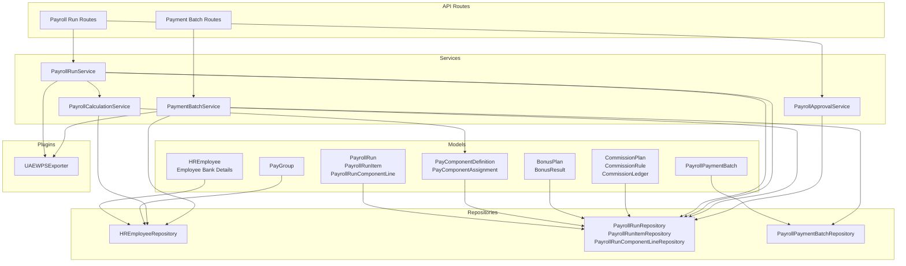

**Diagram sources**
- [employee_model.py](file://app/modules/payroll/models/employee_model.py#L16-L75)
- [payroll_run_model.py](file://app/modules/payroll/models/payroll_run_model.py#L23-L117)
- [payment_batch_model.py](file://app/modules/payroll/models/payment_batch_model.py#L18-L42)
- [pay_component_model.py](file://app/modules/payroll/models/pay_component_model.py#L38-L88)
- [pay_group_model.py](file://app/modules/payroll/models/pay_group_model.py#L24-L48)
- [bonus_model.py](file://app/modules/payroll/models/bonus_model.py#L16-L63)
- [commission_model.py](file://app/modules/payroll/models/commission_model.py#L17-L101)
- [payroll_calculation_service.py](file://app/modules/payroll/services/payroll_calculation_service.py#L22-L138)
- [payroll_run_service.py](file://app/modules/payroll/services/payroll_run_service.py#L25-L416)
- [payment_batch_service.py](file://app/modules/payroll/services/payment_batch_service.py#L16-L133)
- [payroll_approval_service.py](file://app/modules/payroll/services/payroll_approval_service.py#L26-L253)
- [wps_export.py](file://app/modules/payroll/plugins/wps_export.py#L9-L88)
- [employee_repository.py](file://app/modules/payroll/repositories/employee_repository.py#L10-L53)
- [payroll_run_repository.py](file://app/modules/payroll/repositories/payroll_run_repository.py#L16-L107)
- [payment_batch_repository.py](file://app/modules/payroll/repositories/payment_batch_repository.py#L10-L38)
- [payroll_run_routes.py](file://app/modules/payroll/api/routes/payroll_run_routes.py#L25-L302)
- [payment_batch_routes.py](file://app/modules/payroll/api/routes/payment_batch_routes.py#L10-L59)

**Section sources**
- [payroll_run_routes.py](file://app/modules/payroll/api/routes/payroll_run_routes.py#L25-L302)
- [payment_batch_routes.py](file://app/modules/payroll/api/routes/payment_batch_routes.py#L10-L59)

## Core Components
- Employee Management: HREmployee and related bank details, with pay group associations and component assignments
- Compensation Calculation: PayrollCalculationService computes earnings, deductions, and employer contributions per employee
- Payroll Run Processing: PayrollRunService orchestrates run creation, calculation, approval, posting, and reversal
- Payment Batch Management: PaymentBatchService generates WPS export batches and manages batch lifecycle
- Approval Workflow: PayrollApprovalService enforces state transitions and segregation of duties
- Pay Components and Groups: PayComponentDefinition and PayGroup define standardized pay components and grouping rules
- Bonus and Commission: BonusResult and CommissionLedger integrate variable pay into payroll runs

**Section sources**
- [employee_model.py](file://app/modules/payroll/models/employee_model.py#L16-L75)
- [pay_component_model.py](file://app/modules/payroll/models/pay_component_model.py#L38-L88)
- [pay_group_model.py](file://app/modules/payroll/models/pay_group_model.py#L24-L48)
- [payroll_calculation_service.py](file://app/modules/payroll/services/payroll_calculation_service.py#L22-L138)
- [payroll_run_service.py](file://app/modules/payroll/services/payroll_run_service.py#L25-L416)
- [payment_batch_service.py](file://app/modules/payroll/services/payment_batch_service.py#L16-L133)
- [payroll_approval_service.py](file://app/modules/payroll/services/payroll_approval_service.py#L26-L253)
- [bonus_model.py](file://app/modules/payroll/models/bonus_model.py#L16-L63)
- [commission_model.py](file://app/modules/payroll/models/commission_model.py#L17-L101)

## Architecture Overview
The Payroll module implements a clean separation of concerns:
- Models represent domain entities with relationships and constraints
- Services encapsulate workflows and enforce business rules
- Repositories abstract persistence
- Plugins encapsulate export-specific logic
- Routes bind services to HTTP endpoints

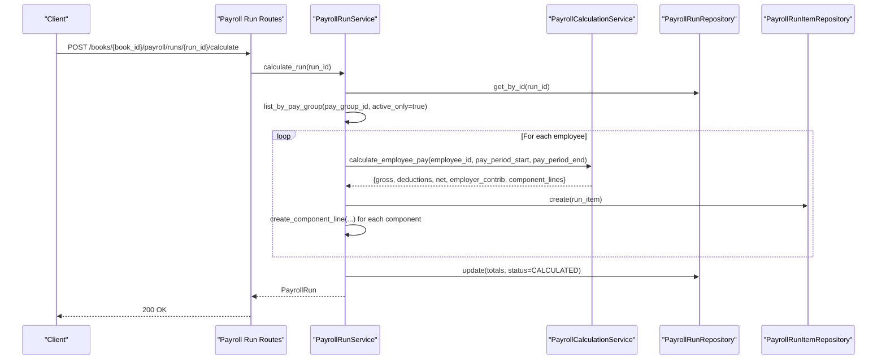

**Diagram sources**
- [payroll_run_routes.py](file://app/modules/payroll/api/routes/payroll_run_routes.py#L52-L66)
- [payroll_run_service.py](file://app/modules/payroll/services/payroll_run_service.py#L75-L148)
- [payroll_calculation_service.py](file://app/modules/payroll/services/payroll_calculation_service.py#L33-L124)
- [payroll_run_repository.py](file://app/modules/payroll/repositories/payroll_run_repository.py#L16-L62)
- [payroll_run_repository.py](file://app/modules/payroll/repositories/payroll_run_repository.py#L64-L92)

## Detailed Component Analysis

### Employee Management
- HREmployee stores personal and employment details, including pay group and WPS fields
- HREmployeeBank holds bank details with a unique primary account per employee
- Relationships connect employees to pay groups, component assignments, run items, and commission ledger

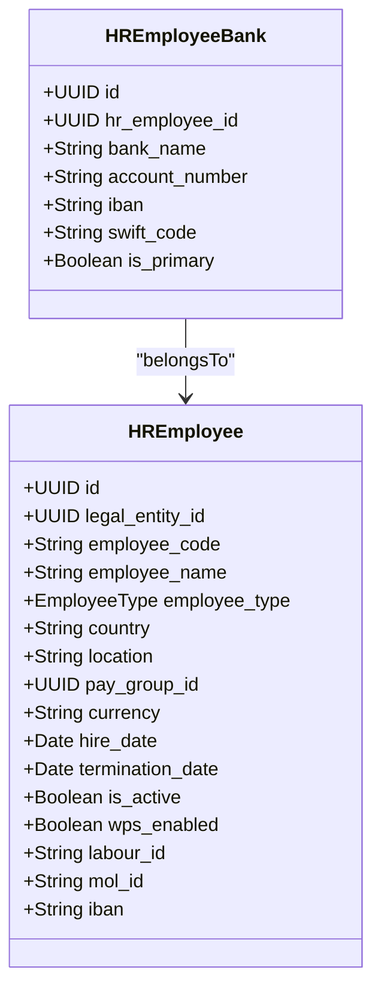

**Diagram sources**
- [employee_model.py](file://app/modules/payroll/models/employee_model.py#L16-L75)

**Section sources**
- [employee_model.py](file://app/modules/payroll/models/employee_model.py#L16-L75)
- [employee_repository.py](file://app/modules/payroll/repositories/employee_repository.py#L10-L53)

### Payroll Run Models
- PayrollRun tracks run metadata, totals, and approval/posting state
- PayrollRunItem captures per-employee pay details and links to component lines
- PayrollRunComponentLine records detailed component amounts and notes

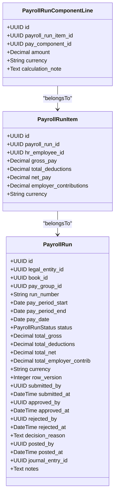

**Diagram sources**
- [payroll_run_model.py](file://app/modules/payroll/models/payroll_run_model.py#L23-L117)

**Section sources**
- [payroll_run_model.py](file://app/modules/payroll/models/payroll_run_model.py#L23-L117)
- [payroll_run_repository.py](file://app/modules/payroll/repositories/payroll_run_repository.py#L16-L107)

### Payment Batch Models
- PayrollPaymentBatch represents export batches (e.g., WPS SIF), tracking status, file metadata, and export details

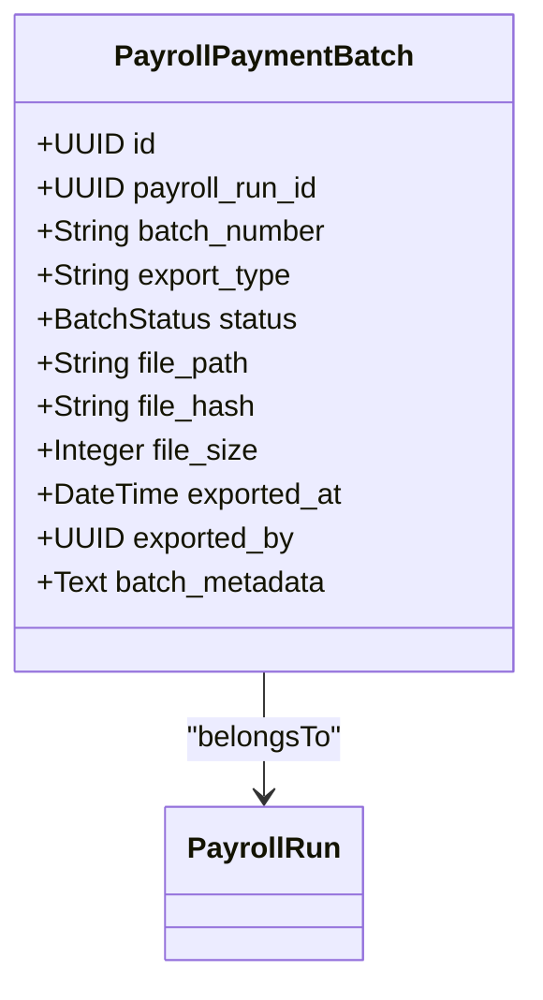

**Diagram sources**
- [payment_batch_model.py](file://app/modules/payroll/models/payment_batch_model.py#L18-L42)

**Section sources**
- [payment_batch_model.py](file://app/modules/payroll/models/payment_batch_model.py#L18-L42)
- [payment_batch_repository.py](file://app/modules/payroll/repositories/payment_batch_repository.py#L10-L38)

### Pay Component Models
- PayComponentDefinition defines standardized components (earnings, deductions, employer contributions) with taxability and WPS flags
- PayComponentAssignment links components to employees with amounts/rates and effective dates

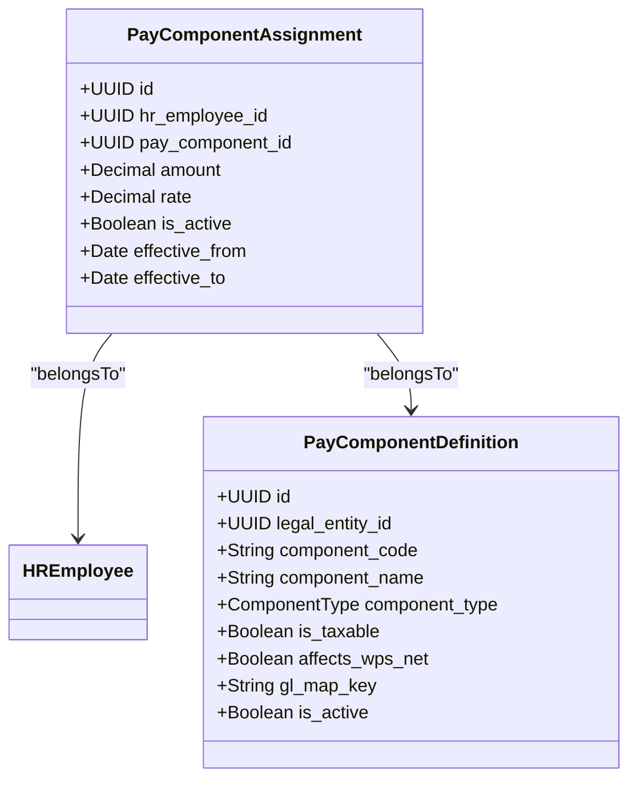

**Diagram sources**
- [pay_component_model.py](file://app/modules/payroll/models/pay_component_model.py#L38-L88)

**Section sources**
- [pay_component_model.py](file://app/modules/payroll/models/pay_component_model.py#L38-L88)

### Pay Group Models
- PayGroup defines pay frequency, pay day rules, currency, and WPS enablement per legal entity

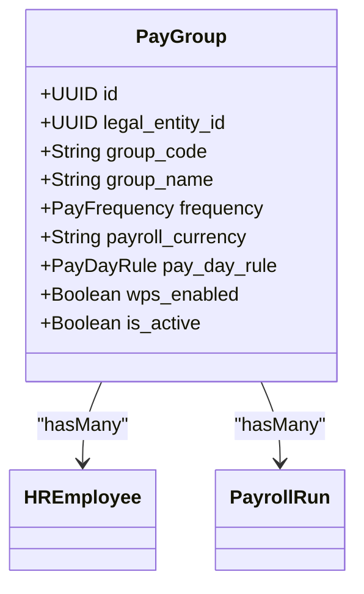

**Diagram sources**
- [pay_group_model.py](file://app/modules/payroll/models/pay_group_model.py#L24-L48)

**Section sources**
- [pay_group_model.py](file://app/modules/payroll/models/pay_group_model.py#L24-L48)

### Bonus and Commission Models
- BonusPlan and BonusResult manage one-time and periodic bonuses
- CommissionPlan, CommissionRule, and CommissionLedger track accruals and payouts

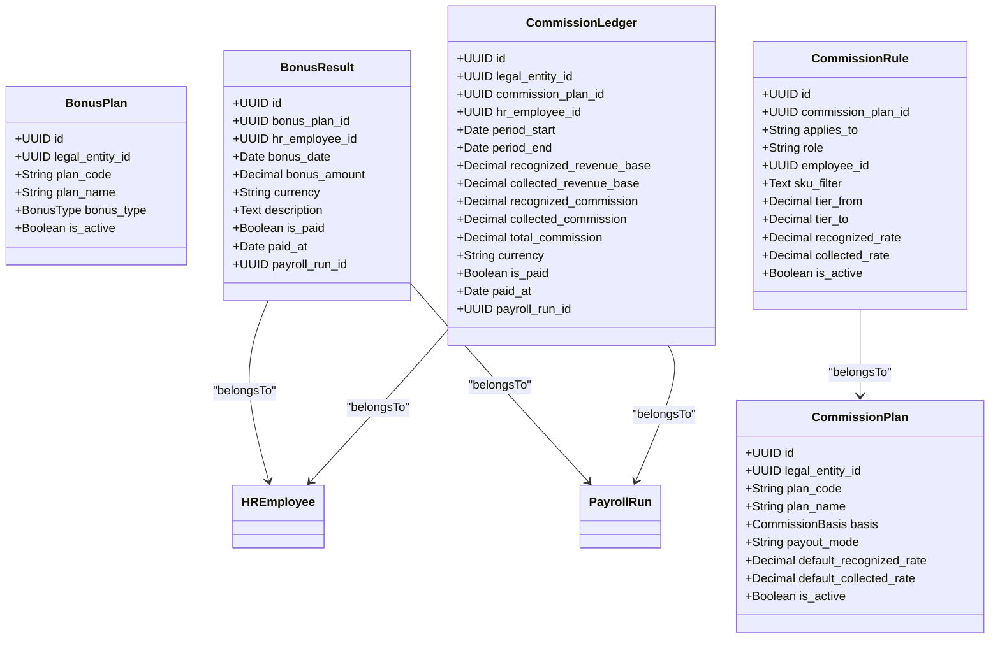

**Diagram sources**
- [bonus_model.py](file://app/modules/payroll/models/bonus_model.py#L16-L63)
- [commission_model.py](file://app/modules/payroll/models/commission_model.py#L17-L101)

**Section sources**
- [bonus_model.py](file://app/modules/payroll/models/bonus_model.py#L16-L63)
- [commission_model.py](file://app/modules/payroll/models/commission_model.py#L17-L101)

### Payroll Calculation Service
Responsibilities:
- Validates employee eligibility
- Aggregates component assignments (fixed amount or rate-based)
- Includes unpaid commissions and bonuses within the pay period
- Produces component lines and totals

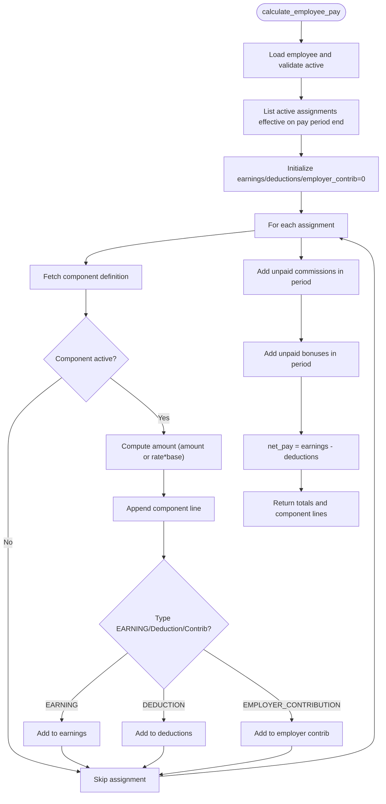

**Diagram sources**
- [payroll_calculation_service.py](file://app/modules/payroll/services/payroll_calculation_service.py#L33-L124)

**Section sources**
- [payroll_calculation_service.py](file://app/modules/payroll/services/payroll_calculation_service.py#L22-L138)

### Payroll Run Service
Responsibilities:
- Create runs with generated run numbers
- Calculate runs by invoking the calculation service and persisting items and component lines
- Manage approval workflow transitions
- Post runs to the general ledger with proper mappings and idempotency
- Reverse posted runs with period-aware reversal and audit trail

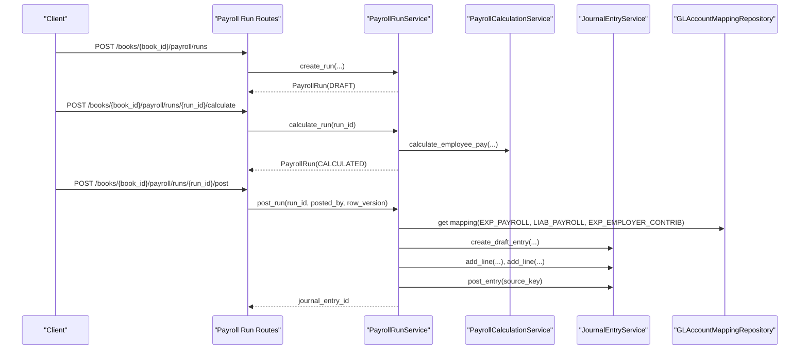

**Diagram sources**
- [payroll_run_routes.py](file://app/modules/payroll/api/routes/payroll_run_routes.py#L28-L199)
- [payroll_run_service.py](file://app/modules/payroll/services/payroll_run_service.py#L38-L314)
- [payroll_run_service.py](file://app/modules/payroll/services/payroll_run_service.py#L405-L416)

**Section sources**
- [payroll_run_service.py](file://app/modules/payroll/services/payroll_run_service.py#L25-L416)

### Payment Batch Service
Responsibilities:
- Generate WPS SIF batches for posted runs
- Validate employee data against WPS requirements
- Compute file hash and metadata
- Provide batch file download capability

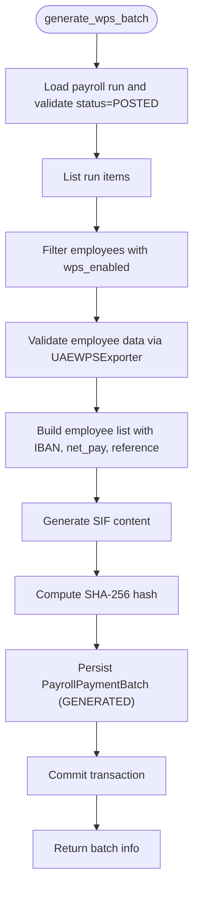

**Diagram sources**
- [payment_batch_service.py](file://app/modules/payroll/services/payment_batch_service.py#L27-L96)
- [wps_export.py](file://app/modules/payroll/plugins/wps_export.py#L41-L88)

**Section sources**
- [payment_batch_service.py](file://app/modules/payroll/services/payment_batch_service.py#L16-L133)
- [wps_export.py](file://app/modules/payroll/plugins/wps_export.py#L9-L88)

### Payroll Approval Service
Responsibilities:
- Enforce state transitions: CALCULATED → PENDING_APPROVAL → APPROVED or REJECTED
- Integrate with approval policy repository to determine if approval is required
- Enforce segregation of duties (SoD) checks
- Log audit actions with before/after status and reasons

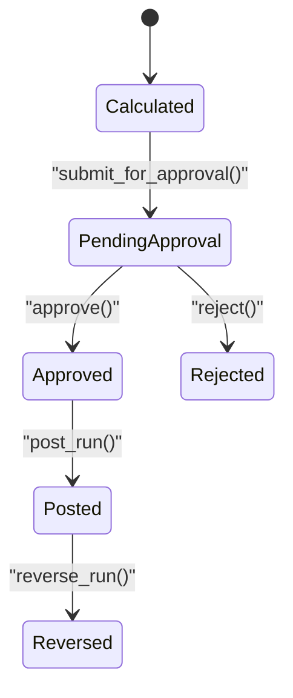

**Diagram sources**
- [payroll_approval_service.py](file://app/modules/payroll/services/payroll_approval_service.py#L26-L253)
- [payroll_run_model.py](file://app/modules/payroll/models/payroll_run_model.py#L10-L21)

**Section sources**
- [payroll_approval_service.py](file://app/modules/payroll/services/payroll_approval_service.py#L26-L253)

### Payroll Run Routes
Endpoints:
- Create payroll run
- Calculate payroll run
- Submit for approval
- Approve payroll run
- Reject payroll run
- Post payroll run (with idempotency)
- Reverse payroll run (restricted)
- List and retrieve payroll runs

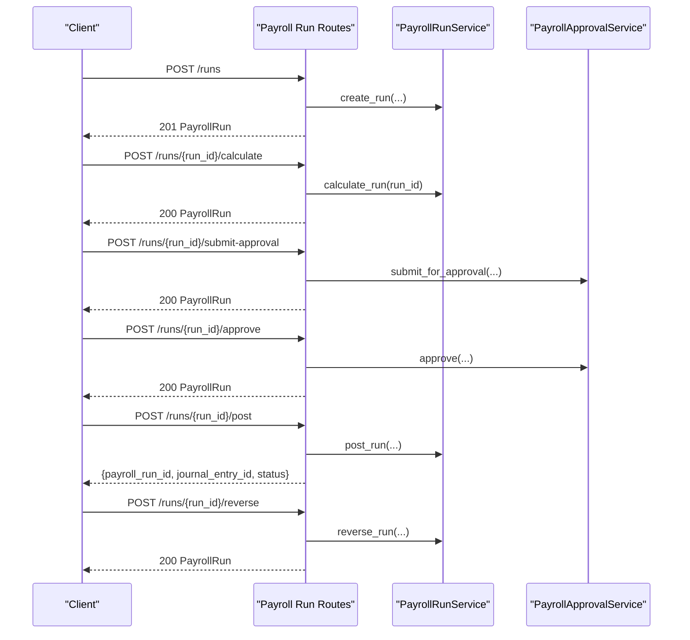

**Diagram sources**
- [payroll_run_routes.py](file://app/modules/payroll/api/routes/payroll_run_routes.py#L28-L302)

**Section sources**
- [payroll_run_routes.py](file://app/modules/payroll/api/routes/payroll_run_routes.py#L25-L302)

### Payment Batch Routes
Endpoints:
- Generate WPS batch for a run
- Download batch file

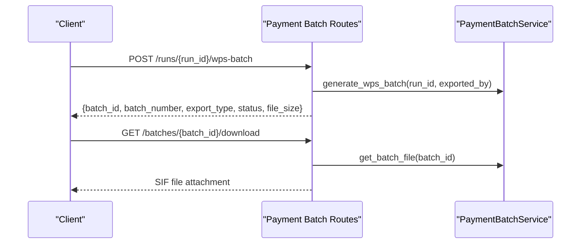

**Diagram sources**
- [payment_batch_routes.py](file://app/modules/payroll/api/routes/payment_batch_routes.py#L13-L59)

**Section sources**
- [payment_batch_routes.py](file://app/modules/payroll/api/routes/payment_batch_routes.py#L10-L59)

## Dependency Analysis
- Services depend on repositories for data access and on other services for cross-cutting logic
- Models define relationships that repositories leverage for queries
- Routes depend on services and enforce authorization and idempotency
- Plugins encapsulate export-specific logic, minimizing coupling

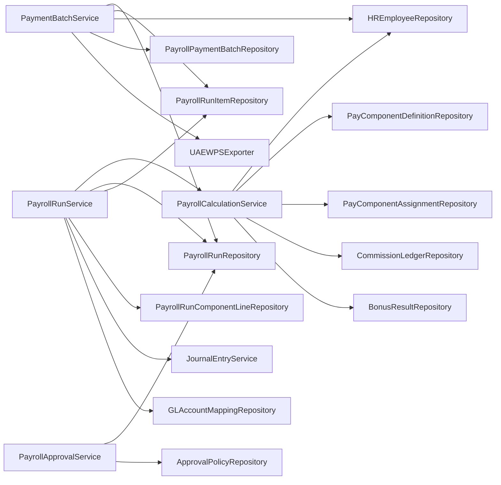

**Diagram sources**
- [payroll_calculation_service.py](file://app/modules/payroll/services/payroll_calculation_service.py#L7-L31)
- [payroll_run_service.py](file://app/modules/payroll/services/payroll_run_service.py#L7-L36)
- [payment_batch_service.py](file://app/modules/payroll/services/payment_batch_service.py#L7-L25)
- [payroll_approval_service.py](file://app/modules/payroll/services/payroll_approval_service.py#L13-L32)

**Section sources**
- [payroll_calculation_service.py](file://app/modules/payroll/services/payroll_calculation_service.py#L22-L138)
- [payroll_run_service.py](file://app/modules/payroll/services/payroll_run_service.py#L25-L416)
- [payment_batch_service.py](file://app/modules/payroll/services/payment_batch_service.py#L16-L133)
- [payroll_approval_service.py](file://app/modules/payroll/services/payroll_approval_service.py#L26-L253)

## Performance Considerations
- Use repository methods with filtering and ordering to minimize result sets
- Batch operations for run item creation and component line creation
- Optimize queries with indexed columns (run number, employee code, pay group)
- Employ idempotency keys for safe reprocessing of posting and reversal operations
- Cache GL account mappings when feasible to reduce repeated lookups

## Troubleshooting Guide
Common issues and resolutions:
- Employee not found or inactive: Ensure employee exists and is active before calculation
- Invalid run status: Verify run is in the expected state (e.g., CALCULATED before approval, POSTED before reversal)
- Missing approval policy: If approval is required but policy not configured, submission may fail
- SoD violations: Review segregation of duties constraints and adjust roles or override reasons accordingly
- WPS validation failures: Confirm employee data meets IBAN format and mandatory fields requirements
- Idempotency errors: Reuse the same idempotency key for retries; avoid changing request body unintentionally

**Section sources**
- [payroll_calculation_service.py](file://app/modules/payroll/services/payroll_calculation_service.py#L40-L46)
- [payroll_run_service.py](file://app/modules/payroll/services/payroll_run_service.py#L172-L189)
- [payroll_approval_service.py](file://app/modules/payroll/services/payroll_approval_service.py#L62-L79)
- [wps_export.py](file://app/modules/payroll/plugins/wps_export.py#L67-L88)

## Conclusion
The Payroll module provides a robust framework for managing employee data, calculating compensation, processing payroll runs, generating payment batches, and enforcing approvals and compliance. Its modular design supports extensibility (e.g., additional export formats) while maintaining strong data integrity and auditability.