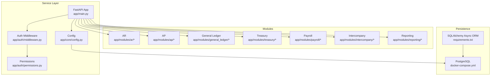
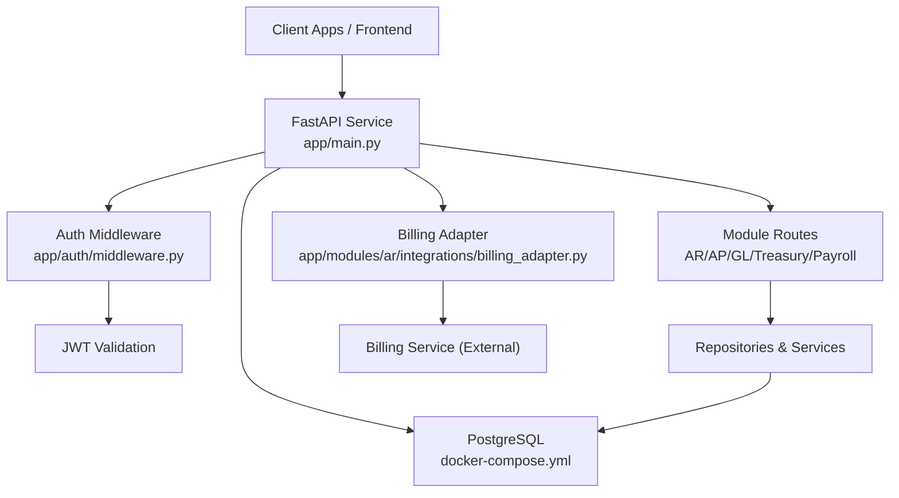
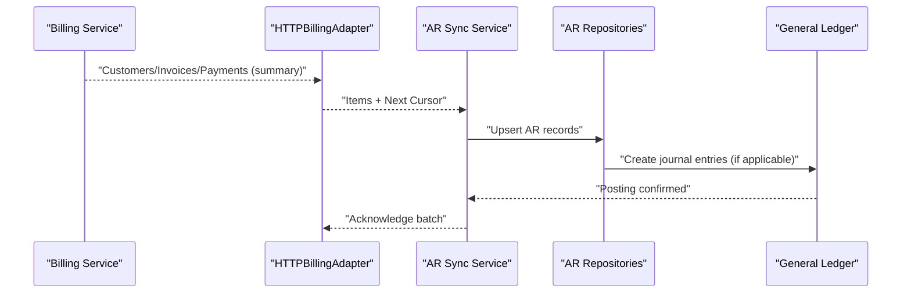
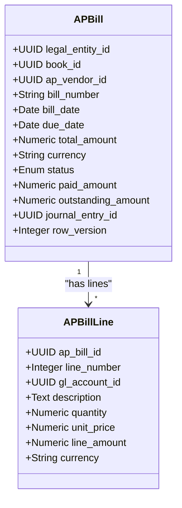
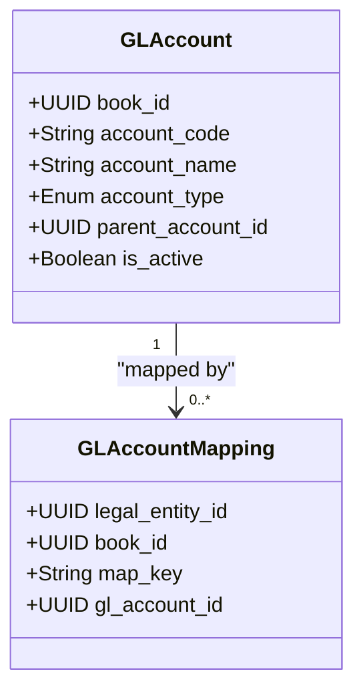
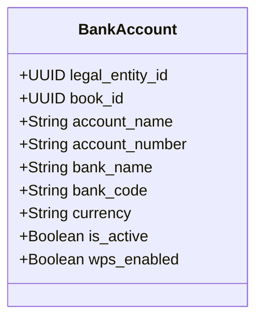
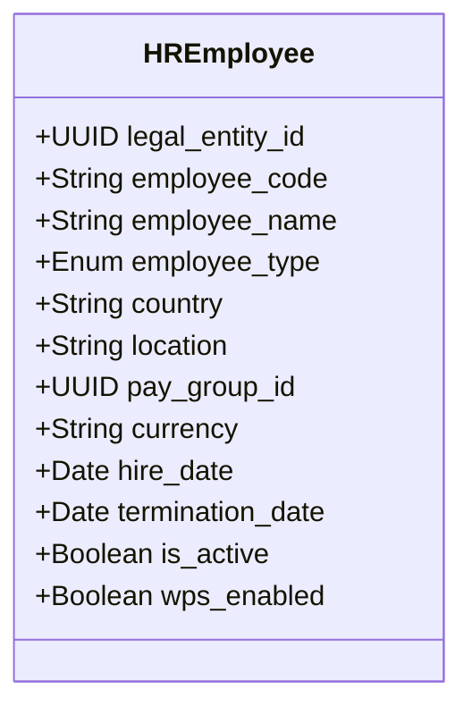
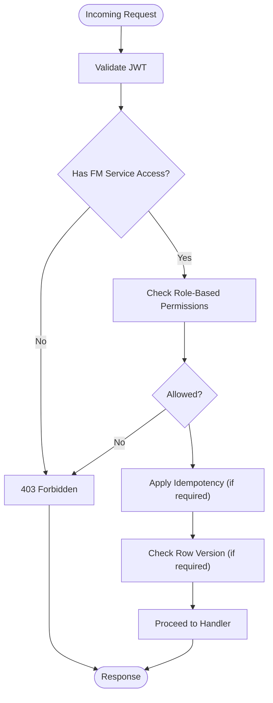
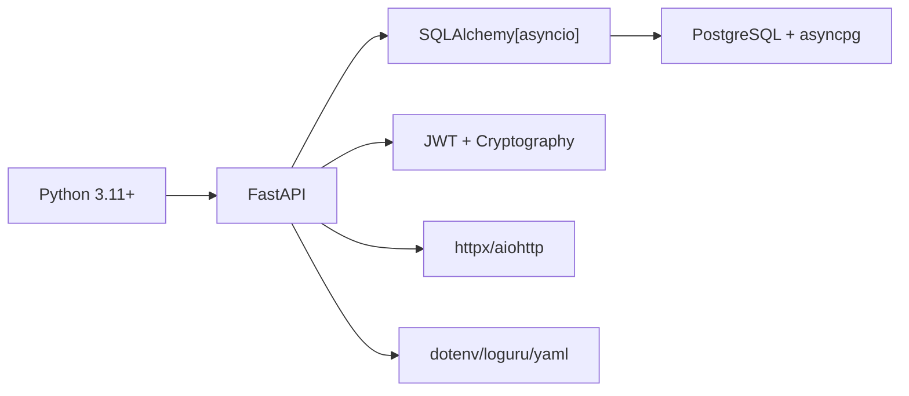

# Project Overview

<cite>
**Referenced Files in This Document**
- [README.md](file://README.md)
- [app/main.py](file://app/main.py)
- [app/core/config.py](file://app/core/config.py)
- [requirements.txt](file://requirements.txt)
- [docker-compose.yml](file://docker-compose.yml)
- [app/modules/ar/integrations/billing_adapter.py](file://app/modules/ar/integrations/billing_adapter.py)
- [app/modules/ap/models/ap_bill_model.py](file://app/modules/ap/models/ap_bill_model.py)
- [app/modules/general_ledger/models/gl_account_model.py](file://app/modules/general_ledger/models/gl_account_model.py)
- [app/modules/payroll/models/employee_model.py](file://app/modules/payroll/models/employee_model.py)
- [app/modules/treasury/models/bank_account_model.py](file://app/modules/treasury/models/bank_account_model.py)
- [app/auth/middleware.py](file://app/auth/middleware.py)
- [app/auth/permissions.py](file://app/auth/permissions.py)
- [app/core/exceptions.py](file://app/core/exceptions.py)
- [app/core/idempotency.py](file://app/core/idempotency.py)
- [app/core/row_version.py](file://app/core/row_version.py)
</cite>

## Table of Contents
1. [Introduction](#introduction)
2. [Project Structure](#project-structure)
3. [Core Components](#core-components)
4. [Architecture Overview](#architecture-overview)
5. [Detailed Component Analysis](#detailed-component-analysis)
6. [Dependency Analysis](#dependency-analysis)
7. [Performance Considerations](#performance-considerations)
8. [Troubleshooting Guide](#troubleshooting-guide)
9. [Conclusion](#conclusion)

## Introduction
TrueVow Financial Management is a finance-grade accounting module designed to serve enterprise financial management needs. It provides a complete suite of financial capabilities including Accounts Receivable (AR) summary, Accounts Payable (AP), Cash Flow, Profit & Loss (P&L), Human Resources and Payroll, Currency Conversion, and Tax Management. The module follows a security-first architecture with strict separation of concerns: a dedicated service, a separate database, and a distinct authentication system. It integrates securely with the SaaS billing module via a one-way, encrypted, and audited sync that transfers only summarized AR data.

Key highlights:
- Purpose: Enterprise-grade financial management with AR summary, AP, cash flow, P&L, HR/payroll, currency conversion, and tax management.
- Security-first design: Separate service, database, and authentication; finance users only; no access to granular billing data.
- Data flow: Secure, one-way sync from billing to financial management with encryption and audit trails.
- Technology stack: Python 3.11+, FastAPI, PostgreSQL (via SQLAlchemy async), JWT-based RBAC, and currency exchange integration.

**Section sources**
- [README.md](file://README.md#L1-L116)

## Project Structure
The project is organized into a modular backend service with clear separation of concerns:
- Core service bootstrap and routing: FastAPI application entry point and middleware registration.
- Configuration management: Centralized settings for database, JWT, billing integration, and observability.
- Modules:
  - AR: Receives summarized AR data from the billing module via an adapter and exposes routes for AR operations and deferred revenue.
  - AP: Manages vendor bills, approvals, and postings with robust status tracking and tax-withholding support.
  - General Ledger: Chart of Accounts, journal entries, periods, and treasury synchronization.
  - Treasury: Bank accounts, transactions, FX conversions, transfers, and settlements.
  - Payroll: Employee master data, pay components, runs, and export plugins.
  - Intercompany: Transfers, royalties, and reconciliations.
  - Reporting: AR/AP aging, cash position, GL detail, P&L/Balance Sheet, and trial balance.
- Shared infrastructure: Base models and repositories for consistent persistence.
- Authentication and authorization: JWT validation, service access checks, and RBAC permissions.
- Core utilities: Idempotency, row-version concurrency control, logging, and exception handling.

**Diagram sources**
- [app/main.py](file://app/main.py#L1-L54)
- [app/core/config.py](file://app/core/config.py#L1-L74)
- [docker-compose.yml](file://docker-compose.yml#L1-L42)
- [requirements.txt](file://requirements.txt#L1-L53)

**Section sources**
- [app/main.py](file://app/main.py#L1-L54)
- [app/core/config.py](file://app/core/config.py#L1-L74)
- [docker-compose.yml](file://docker-compose.yml#L1-L42)
- [requirements.txt](file://requirements.txt#L1-L53)

## Core Components
- FastAPI application entry point and middleware:
  - Registers correlation ID middleware and CORS.
  - Includes versioned API router and health check endpoint.
- Configuration:
  - Centralized settings for database URLs, JWT secrets, billing integration, and metrics/logging.
  - Automatic asyncpg URL normalization for SQLAlchemy.
- Authentication and authorization:
  - JWT validation against a central auth service or local decoding.
  - Service access verification ("financial_management").
  - Role-based permission matrix for granular controls.
- Idempotency:
  - Canonical request hashing and storage of responses keyed by endpoint and idempotency key.
  - State machine with PENDING, COMPLETED, FAILED to handle race conditions and retries.
- Row versioning:
  - Optimistic concurrency control to prevent lost updates.
- Exceptions:
  - Domain-specific exceptions for validation, posting, period locks, duplicates, and unauthorized access.

**Section sources**
- [app/main.py](file://app/main.py#L1-L54)
- [app/core/config.py](file://app/core/config.py#L1-L74)
- [app/auth/middleware.py](file://app/auth/middleware.py#L1-L140)
- [app/auth/permissions.py](file://app/auth/permissions.py#L1-L127)
- [app/core/idempotency.py](file://app/core/idempotency.py#L1-L482)
- [app/core/row_version.py](file://app/core/row_version.py#L1-L31)
- [app/core/exceptions.py](file://app/core/exceptions.py#L1-L43)

## Architecture Overview
The system is built around a security-first, horizontally separated architecture:
- Service: FastAPI backend with strict RBAC and idempotency.
- Database: PostgreSQL with async SQLAlchemy; migrations managed separately.
- Authentication: Centralized JWT validation; service-scoped access control.
- Integrations: Billing sync (one-way, encrypted, audited) and optional treasury/currency APIs.

**Diagram sources**
- [app/main.py](file://app/main.py#L1-L54)
- [app/auth/middleware.py](file://app/auth/middleware.py#L1-L140)
- [app/modules/ar/integrations/billing_adapter.py](file://app/modules/ar/integrations/billing_adapter.py#L1-L191)
- [docker-compose.yml](file://docker-compose.yml#L1-L42)

**Section sources**
- [README.md](file://README.md#L24-L72)
- [app/modules/ar/integrations/billing_adapter.py](file://app/modules/ar/integrations/billing_adapter.py#L1-L191)
- [app/auth/middleware.py](file://app/auth/middleware.py#L1-L140)

## Detailed Component Analysis

### AR Summary Integration (Billing Sync)
The AR module receives summarized customer, invoice, and payment data from the billing service. The integration is abstracted via an adapter interface with an HTTP client implementation and a mock for development/testing. The sync is designed to be one-way, encrypted, and audited, ensuring finance users only receive summarized AR data without access to granular billing internals.

**Diagram sources**
- [app/modules/ar/integrations/billing_adapter.py](file://app/modules/ar/integrations/billing_adapter.py#L61-L151)

**Section sources**
- [README.md](file://README.md#L33-L49)
- [app/modules/ar/integrations/billing_adapter.py](file://app/modules/ar/integrations/billing_adapter.py#L1-L191)

### AP Bill Management
The AP module models vendor bills, statuses, approvals, tax-withholding, and journal entry linkage. It supports lifecycle states from draft to posted, with optimistic locking via row versioning and idempotent posting endpoints.

**Diagram sources**
- [app/modules/ap/models/ap_bill_model.py](file://app/modules/ap/models/ap_bill_model.py#L20-L102)

**Section sources**
- [app/modules/ap/models/ap_bill_model.py](file://app/modules/ap/models/ap_bill_model.py#L1-L102)
- [app/core/row_version.py](file://app/core/row_version.py#L1-L31)
- [app/core/idempotency.py](file://app/core/idempotency.py#L23-L96)

### General Ledger (Chart of Accounts)
The GL module defines account types and mappings used for system-generated postings. It supports hierarchical account structures and per-entity/book mappings for standardized posting logic.

**Diagram sources**
- [app/modules/general_ledger/models/gl_account_model.py](file://app/modules/general_ledger/models/gl_account_model.py#L28-L80)

**Section sources**
- [app/modules/general_ledger/models/gl_account_model.py](file://app/modules/general_ledger/models/gl_account_model.py#L1-L80)

### Treasury (Bank Accounts and FX)
The treasury module manages bank accounts, transactions, FX conversions, transfers, and settlements. It supports multi-currency operations and links to reconciliation sessions.

**Diagram sources**
- [app/modules/treasury/models/bank_account_model.py](file://app/modules/treasury/models/bank_account_model.py#L9-L36)

**Section sources**
- [app/modules/treasury/models/bank_account_model.py](file://app/modules/treasury/models/bank_account_model.py#L1-L36)

### Payroll (Employees and Runs)
The payroll module maintains employee master data, pay groups, component assignments, and payroll runs. It includes country-specific fields (e.g., UAE WPS) and supports export plugins.

**Diagram sources**
- [app/modules/payroll/models/employee_model.py](file://app/modules/payroll/models/employee_model.py#L16-L51)

**Section sources**
- [app/modules/payroll/models/employee_model.py](file://app/modules/payroll/models/employee_model.py#L1-L75)

### Security and Access Control
- JWT validation: Validates tokens against a central auth service or locally if a secret is configured.
- Service access: Ensures callers have access to the "financial_management" service.
- Permissions: Role-based matrix defines module-level actions (read/write/post/reverse/approve/override/etc.).
- Idempotency: Prevents duplicate processing and supports safe retries with stateful reservations.
- Row versioning: Prevents lost-update conflicts during concurrent edits.

**Diagram sources**
- [app/auth/middleware.py](file://app/auth/middleware.py#L17-L106)
- [app/auth/permissions.py](file://app/auth/permissions.py#L84-L127)
- [app/core/idempotency.py](file://app/core/idempotency.py#L23-L96)
- [app/core/row_version.py](file://app/core/row_version.py#L8-L31)

**Section sources**
- [app/auth/middleware.py](file://app/auth/middleware.py#L1-L140)
- [app/auth/permissions.py](file://app/auth/permissions.py#L1-L127)
- [app/core/idempotency.py](file://app/core/idempotency.py#L1-L482)
- [app/core/row_version.py](file://app/core/row_version.py#L1-L31)

## Dependency Analysis
- Language and framework: Python 3.11+ with FastAPI and async SQLAlchemy.
- Database: PostgreSQL with asyncpg; Alembic migrations.
- Security: JWT cryptography, bcrypt hashing, and secure HTTP clients.
- Utilities: dotenv, loguru, PyYAML, and currency/exchange rate libraries.
- Runtime and dev: Uvicorn, pytest, black/flake8/mypy.

**Diagram sources**
- [requirements.txt](file://requirements.txt#L1-L53)

**Section sources**
- [requirements.txt](file://requirements.txt#L1-L53)

## Performance Considerations
- Asynchronous I/O: Use async SQLAlchemy and httpx to minimize blocking and improve throughput under load.
- Idempotency caching: Avoid repeated work for identical requests; cap stored response sizes to prevent bloat.
- Concurrency control: Row versioning prevents unnecessary retries and reduces conflict resolution overhead.
- Database tuning: Adjust pool size and overflow in settings for connection efficiency; leverage indexes on frequently queried fields (e.g., bill number, invoice ID, dates).
- Observability: Enable metrics and structured logging for latency and error tracking.

[No sources needed since this section provides general guidance]

## Troubleshooting Guide
Common issues and resolutions:
- Authentication failures:
  - Ensure the auth service is reachable and the JWT secret is configured in development.
  - Verify the token includes the "financial_management" service claim.
- Idempotency conflicts:
  - Do not reuse an idempotency key with a different request payload.
  - For failed requests marked as unsafe to retry, include the retry header as instructed.
- Row version conflicts:
  - Refresh data and resend with the current row version to avoid 409 conflicts.
- Database connectivity:
  - Confirm the effective database URL and that the container is healthy.
- CORS and middleware:
  - Review CORS configuration and ensure the correlation ID middleware is registered early.

**Section sources**
- [app/auth/middleware.py](file://app/auth/middleware.py#L17-L106)
- [app/core/idempotency.py](file://app/core/idempotency.py#L283-L377)
- [app/core/row_version.py](file://app/core/row_version.py#L8-L31)
- [app/core/config.py](file://app/core/config.py#L23-L35)
- [docker-compose.yml](file://docker-compose.yml#L15-L19)

## Conclusion
TrueVow Financial Management delivers a robust, security-first financial suite with clear separation of service, database, and authentication. Its modular design supports enterprise-grade accounting workflows, while strong security controls, idempotency, and concurrency safeguards ensure reliability and auditability. The one-way, encrypted, and audited AR sync from the billing module preserves data integrity and aligns with strict access policies.

[No sources needed since this section summarizes without analyzing specific files]