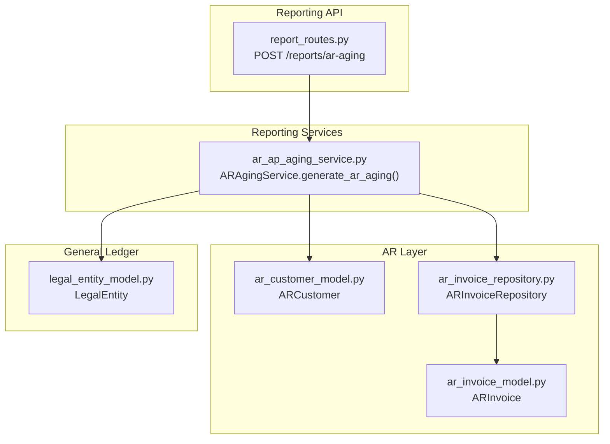
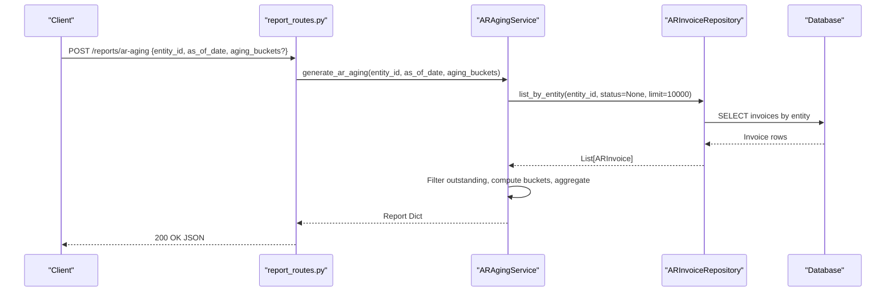
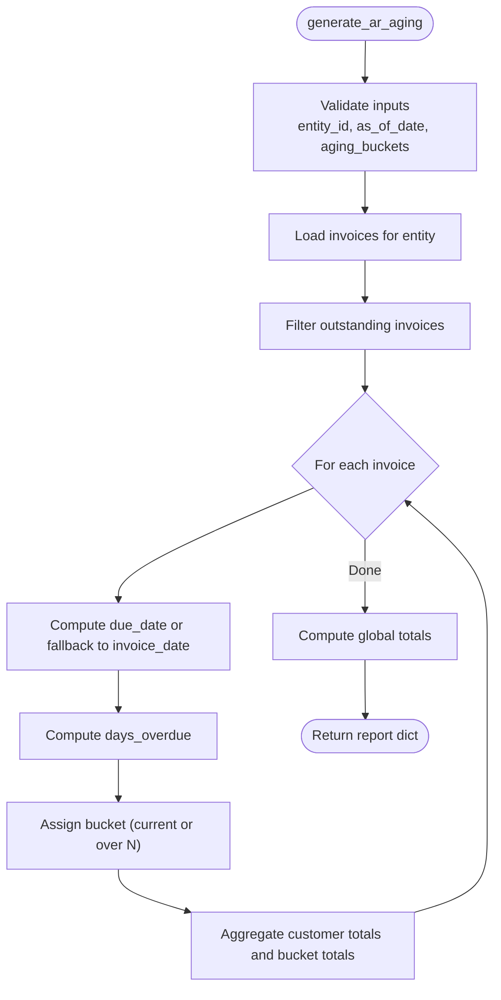
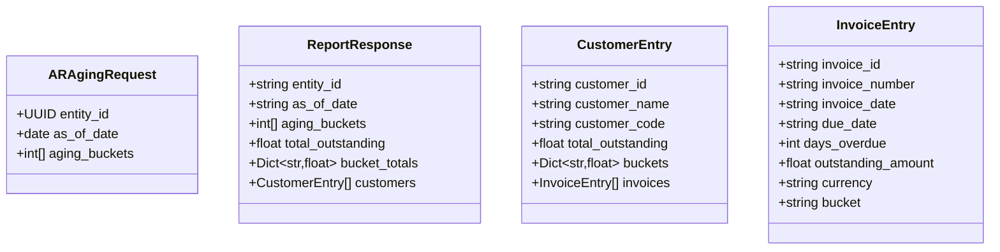
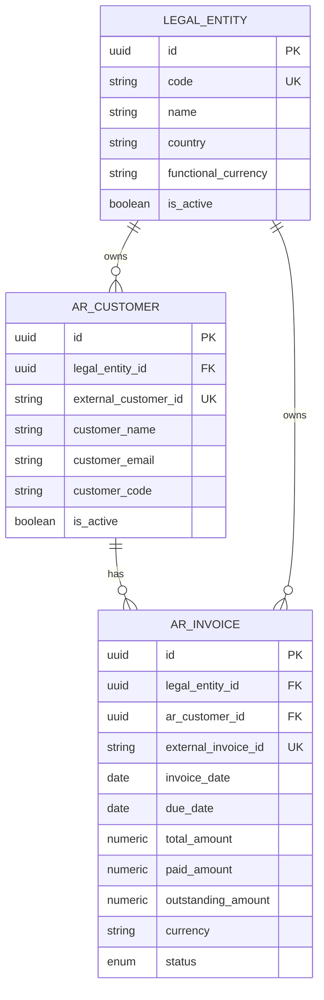
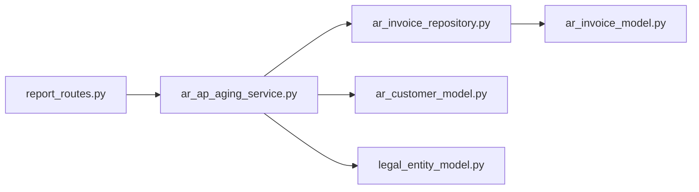

# Aging Reports

<cite>
**Referenced Files in This Document**
- [ar_ap_aging_service.py](file://app/modules/reporting/services/ar_ap_aging_service.py)
- [report_routes.py](file://app/modules/reporting/api/routes/report_routes.py)
- [report_schemas.py](file://app/modules/reporting/schemas/report_schemas.py)
- [ar_invoice_model.py](file://app/modules/ar/models/ar_invoice_model.py)
- [ar_customer_model.py](file://app/modules/ar/models/ar_customer_model.py)
- [legal_entity_model.py](file://app/modules/general_ledger/models/legal_entity_model.py)
- [ar_invoice_repository.py](file://app/modules/ar/repositories/ar_invoice_repository.py)
- [FM_Service_Detailed_Implementation_Guide.md](file://docs/01-main/FM_Service_Detailed_Installation and Setup
- [API endpoints](#api-endpoints)
- [Core Components](#core-components)
- [Architecture Overview](#architecture-overview)
- [Detailed Component Analysis](#detailed-component-analysis)
- [Dependency Analysis](#dependency-analysis)
- [Performance Considerations](#performance-considerations)
- [Troubleshooting Guide](#troubleshooting-guide)
- [Conclusion](#conclusion)
- [Appendices](#appendices)

## Introduction
This document explains the AR/AP Aging Reports functionality, focusing on the Receivables (AR) Aging Report implementation, customer-level aging calculations, bucket-based reporting, and the associated API. It also covers aging bucket configurations, due date calculations, outstanding balance tracking, and how the report supports collection management and credit risk assessment workflows. While the backend currently implements AR Aging, the frontend includes hooks for AP Aging, indicating a planned extension.

## Project Structure
The AR Aging Report spans several modules:
- Reporting API routes expose the endpoint for generating the report.
- The AR Aging Service performs the calculation logic.
- AR models define invoices and customers used in the report.
- Repositories provide data access for invoices and related entities.
- Schemas define request parameters for the endpoint.

**Diagram sources**
- [report_routes.py](file://app/modules/reporting/api/routes/report_routes.py#L106-L124)
- [ar_ap_aging_service.py](file://app/modules/reporting/services/ar_ap_aging_service.py#L13-L119)
- [ar_invoice_model.py](file://app/modules/ar/models/ar_invoice_model.py#L21-L51)
- [ar_customer_model.py](file://app/modules/ar/models/ar_customer_model.py#L8-L29)
- [ar_invoice_repository.py](file://app/modules/ar/repositories/ar_invoice_repository.py#L11-L58)
- [legal_entity_model.py](file://app/modules/general_ledger/models/legal_entity_model.py#L7-L21)

**Section sources**
- [report_routes.py](file://app/modules/reporting/api/routes/report_routes.py#L106-L124)
- [ar_ap_aging_service.py](file://app/modules/reporting/services/ar_ap_aging_service.py#L13-L119)
- [ar_invoice_model.py](file://app/modules/ar/models/ar_invoice_model.py#L21-L51)
- [ar_customer_model.py](file://app/modules/ar/models/ar_customer_model.py#L8-L29)
- [ar_invoice_repository.py](file://app/modules/ar/repositories/ar_invoice_repository.py#L11-L58)
- [legal_entity_model.py](file://app/modules/general_ledger/models/legal_entity_model.py#L7-L21)

## Core Components
- ARAgingService: Computes AR Aging by scanning outstanding invoices per customer, calculating days overdue, assigning invoices to aging buckets, aggregating totals, and returning a structured report.
- Report API route: Exposes POST /reports/ar-aging with request parameters and returns the computed report.
- ARInvoice and ARCustomer models: Provide invoice-level data (amounts, dates) and customer metadata used for grouping and display.
- ARInvoiceRepository: Supplies invoice lists filtered by legal entity and outstanding balances.

Key capabilities:
- Bucket-based aging with configurable thresholds (default [0, 30, 60, 90]).
- Due date fallback to invoice date if due date is missing.
- Customer-level aggregation with invoice-level breakdowns.
- Totals across all customers and per-bucket totals.

**Section sources**
- [ar_ap_aging_service.py](file://app/modules/reporting/services/ar_ap_aging_service.py#L13-L119)
- [report_routes.py](file://app/modules/reporting/api/routes/report_routes.py#L106-L124)
- [ar_invoice_model.py](file://app/modules/ar/models/ar_invoice_model.py#L21-L51)
- [ar_customer_model.py](file://app/modules/ar/models/ar_customer_model.py#L8-L29)
- [ar_invoice_repository.py](file://app/modules/ar/repositories/ar_invoice_repository.py#L11-L58)

## Architecture Overview
The AR Aging Report follows a clean separation of concerns:
- API layer validates and forwards requests.
- Service layer encapsulates business logic.
- Repository layer abstracts data access.
- Models define domain entities and relationships.

**Diagram sources**
- [report_routes.py](file://app/modules/reporting/api/routes/report_routes.py#L106-L124)
- [ar_ap_aging_service.py](file://app/modules/reporting/services/ar_ap_aging_service.py#L22-L119)
- [ar_invoice_repository.py](file://app/modules/ar/repositories/ar_invoice_repository.py#L11-L58)

## Detailed Component Analysis

### ARAgingService
Responsibilities:
- Accepts entity_id, as_of_date, and optional aging_buckets.
- Loads invoices for the entity and filters to outstanding ones.
- For each invoice:
  - Determines customer and initializes customer bucket structure.
  - Calculates days overdue using due_date or invoice_date.
  - Assigns invoice to a bucket (current or over N).
  - Aggregates totals per customer and per bucket.
- Returns:
  - entity_id, as_of_date, aging_buckets, total_outstanding, bucket_totals, and customers array.

**Diagram sources**
- [ar_ap_aging_service.py](file://app/modules/reporting/services/ar_ap_aging_service.py#L22-L119)

**Section sources**
- [ar_ap_aging_service.py](file://app/modules/reporting/services/ar_ap_aging_service.py#L13-L119)

### API Endpoint: POST /reports/ar-aging
Behavior:
- Validates request payload using ARAgingRequest schema.
- Calls ARAgingService.generate_ar_aging().
- Returns the report as JSON.

Request parameters:
- entity_id: UUID of the legal entity.
- as_of_date: Report cutoff date.
- aging_buckets: Optional list of integers representing bucket thresholds (default [0, 30, 60, 90]).

Response structure (high level):
- entity_id: string
- as_of_date: ISO date string
- aging_buckets: list of integers
- total_outstanding: number
- bucket_totals: object mapping bucket label to amount
- customers: array of customer entries, each containing:
  - customer_id, customer_name, customer_code
  - total_outstanding
  - buckets: object mapping bucket label to amount
  - invoices: array of invoice entries with details and bucket assignment

**Diagram sources**
- [report_schemas.py](file://app/modules/reporting/schemas/report_schemas.py#L37-L42)
- [ar_ap_aging_service.py](file://app/modules/reporting/services/ar_ap_aging_service.py#L112-L119)

**Section sources**
- [report_routes.py](file://app/modules/reporting/api/routes/report_routes.py#L106-L124)
- [report_schemas.py](file://app/modules/reporting/schemas/report_schemas.py#L37-L42)
- [ar_ap_aging_service.py](file://app/modules/reporting/services/ar_ap_aging_service.py#L112-L119)

### Data Models and Relationships
- ARInvoice: Holds invoice-level details including invoice_date, due_date, total_amount, paid_amount, outstanding_amount, currency, and status.
- ARCustomer: Links invoices to customers and holds customer metadata.
- LegalEntity: Represents the legal entity context for filtering invoices.

**Diagram sources**
- [legal_entity_model.py](file://app/modules/general_ledger/models/legal_entity_model.py#L7-L21)
- [ar_customer_model.py](file://app/modules/ar/models/ar_customer_model.py#L8-L29)
- [ar_invoice_model.py](file://app/modules/ar/models/ar_invoice_model.py#L21-L51)

**Section sources**
- [legal_entity_model.py](file://app/modules/general_ledger/models/legal_entity_model.py#L7-L21)
- [ar_customer_model.py](file://app/modules/ar/models/ar_customer_model.py#L8-L29)
- [ar_invoice_model.py](file://app/modules/ar/models/ar_invoice_model.py#L21-L51)

### Aging Bucket Configurations and Calculations
- Default buckets: [0, 30, 60, 90].
- Bucket assignment:
  - current: days overdue <= 0 (or due date not exceeded).
  - over_N: days overdue > N.
- Due date fallback:
  - If invoice.due_date is null, invoice.invoice_date is used for days overdue calculation.
- Outstanding balance tracking:
  - Only invoices with outstanding_amount > 0 are included.
  - Totals are aggregated per customer and globally.

**Section sources**
- [ar_ap_aging_service.py](file://app/modules/reporting/services/ar_ap_aging_service.py#L35-L36)
- [ar_ap_aging_service.py](file://app/modules/reporting/services/ar_ap_aging_service.py#L68-L77)
- [ar_ap_aging_service.py](file://app/modules/reporting/services/ar_ap_aging_service.py#L46-L49)

### Receivables Analysis and Credit Risk Assessment
- The report enables:
  - Collection management: Identify overdue invoices and prioritize collections by bucket.
  - Credit risk assessment: Monitor concentration by customer and bucket, track trends over time.
  - Financial controls: Validate aging thresholds against policy and reconcile with receivable balances.

[No sources needed since this section synthesizes usage without analyzing specific files]

## Dependency Analysis
- API depends on ARAgingService and Pydantic schemas.
- ARAgingService depends on ARInvoiceRepository, ARCustomerRepository, and LegalEntityRepository.
- ARInvoiceRepository depends on ARInvoice model.
- AR models depend on shared base model and SQLAlchemy ORM.

**Diagram sources**
- [report_routes.py](file://app/modules/reporting/api/routes/report_routes.py#L106-L124)
- [ar_ap_aging_service.py](file://app/modules/reporting/services/ar_ap_aging_service.py#L13-L21)
- [ar_invoice_repository.py](file://app/modules/ar/repositories/ar_invoice_repository.py#L11-L15)
- [ar_invoice_model.py](file://app/modules/ar/models/ar_invoice_model.py#L21-L44)
- [ar_customer_model.py](file://app/modules/ar/models/ar_customer_model.py#L8-L22)
- [legal_entity_model.py](file://app/modules/general_ledger/models/legal_entity_model.py#L7-L18)

**Section sources**
- [report_routes.py](file://app/modules/reporting/api/routes/report_routes.py#L106-L124)
- [ar_ap_aging_service.py](file://app/modules/reporting/services/ar_ap_aging_service.py#L13-L21)
- [ar_invoice_repository.py](file://app/modules/ar/repositories/ar_invoice_repository.py#L11-L15)
- [ar_invoice_model.py](file://app/modules/ar/models/ar_invoice_model.py#L21-L44)
- [ar_customer_model.py](file://app/modules/ar/models/ar_customer_model.py#L8-L22)
- [legal_entity_model.py](file://app/modules/general_ledger/models/legal_entity_model.py#L7-L18)

## Performance Considerations
- Limiting invoice fetch: The service loads up to 10000 invoices per entity. Consider pagination or batching for very large datasets.
- Bucket computation: Sorting buckets and linear bucket assignment are O(B) per invoice; acceptable for typical bucket counts.
- Memory usage: Aggregating per-customer and per-invoice details can grow with customer count and invoice volume.
- Database queries: Using repository methods ensures efficient filtering by entity and outstanding amounts.

[No sources needed since this section provides general guidance]

## Troubleshooting Guide
Common issues and resolutions:
- Missing due dates: If due_date is null, the system falls back to invoice_date. Verify invoice data integrity.
- Empty report: Ensure the entity has invoices with outstanding_amount > 0 and correct status filters.
- Unexpected bucket assignments: Confirm aging_buckets order and values; the service assigns the first matching over_N bucket.
- Parameter errors: Validate entity_id format and as_of_date; the API raises HTTP 400 for invalid values.

**Section sources**
- [ar_ap_aging_service.py](file://app/modules/reporting/services/ar_ap_aging_service.py#L68-L77)
- [ar_ap_aging_service.py](file://app/modules/reporting/services/ar_ap_aging_service.py#L46-L49)
- [report_routes.py](file://app/modules/reporting/api/routes/report_routes.py#L114-L123)

## Conclusion
The AR Aging Report provides actionable insights into receivables by customer and bucket, enabling effective collection management and credit risk monitoring. The modular design cleanly separates API, service, and data access layers, while the schema-driven request model ensures predictable behavior. Extending the system to AP Aging would follow a similar pattern, leveraging existing AP models and repositories.

[No sources needed since this section summarizes without analyzing specific files]

## Appendices

### API Endpoints
- POST /reports/ar-aging
  - Description: Generate AR Aging report for a legal entity as of a given date with configurable buckets.
  - Request body: ARAgingRequest (entity_id, as_of_date, aging_buckets?)
  - Response: Report dictionary with totals, bucket totals, and customer-level details.

**Section sources**
- [report_routes.py](file://app/modules/reporting/api/routes/report_routes.py#L106-L124)
- [report_schemas.py](file://app/modules/reporting/schemas/report_schemas.py#L37-L42)

### Aging Report Workflows
- Collection management process:
  - Run AR Aging daily or weekly.
  - Review bucket totals and top customers by overdue amount.
  - Prioritize outreach for over-90-day delinquencies.
- Credit risk assessment procedure:
  - Track changes in bucket distribution over time.
  - Segment customers by risk profile and adjust credit limits accordingly.

[No sources needed since this section provides general guidance]