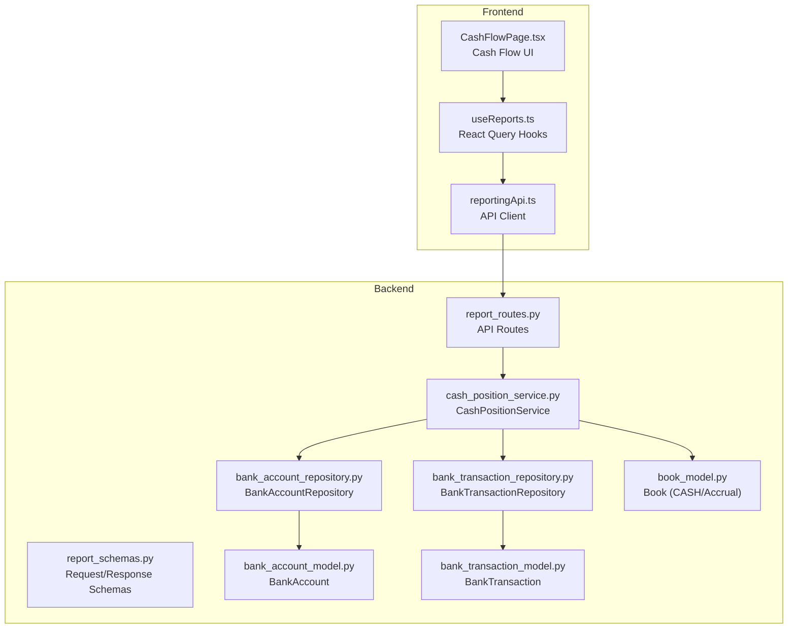
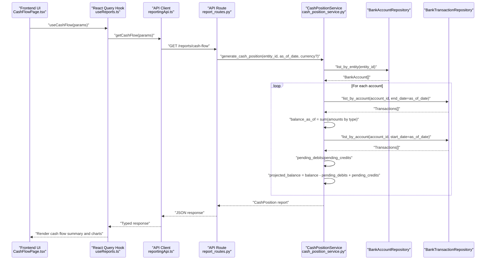
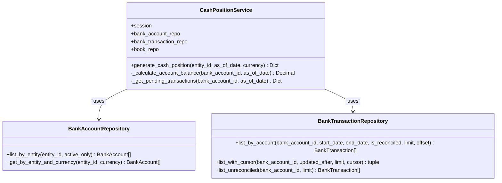
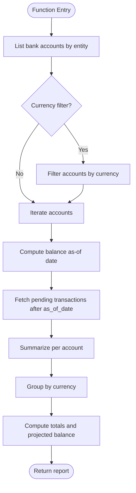
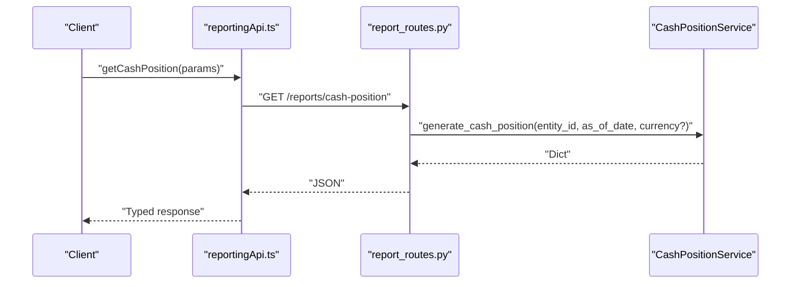
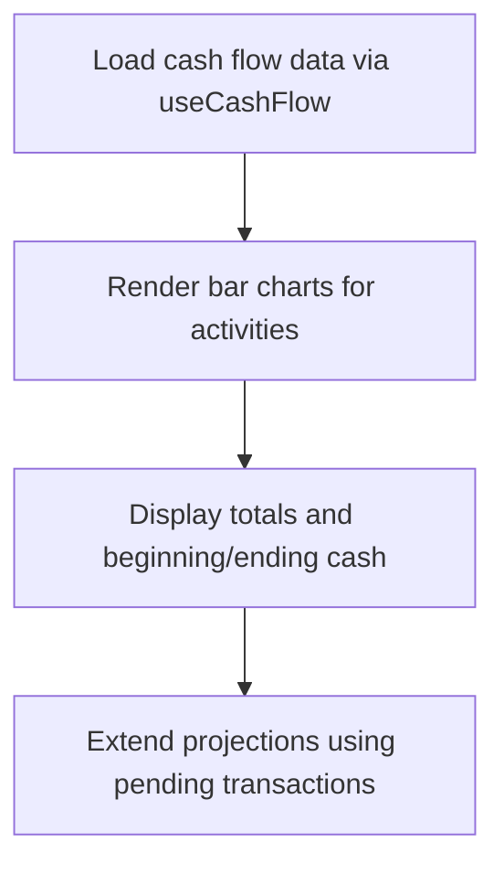
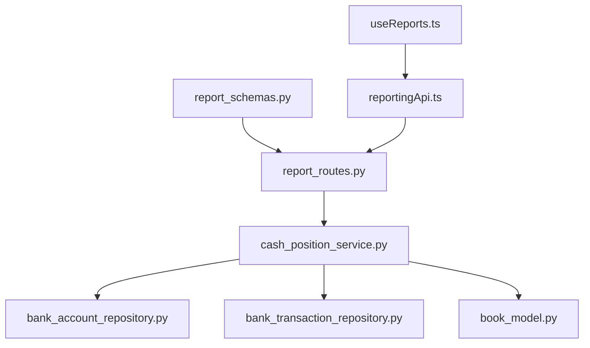

# Cash Flow Reports

<cite>
**Referenced Files in This Document**
- [cash_position_service.py](file://app/modules/reporting/services/cash_position_service.py)
- [report_routes.py](file://app/modules/reporting/api/routes/report_routes.py)
- [report_schemas.py](file://app/modules/reporting/schemas/report_schemas.py)
- [bank_account_model.py](file://app/modules/treasury/models/bank_account_model.py)
- [bank_transaction_model.py](file://app/modules/treasury/models/bank_transaction_model.py)
- [bank_account_repository.py](file://app/modules/treasury/repositories/bank_account_repository.py)
- [bank_transaction_repository.py](file://app/modules/treasury/repositories/bank_transaction_repository.py)
- [book_model.py](file://app/modules/general_ledger/models/book_model.py)
- [useReports.ts](file://frontend/hooks/useReports.ts)
- [reportingApi.ts](file://frontend/lib/api/reportingApi.ts)
- [CashFlowPage.tsx](file://frontend/components/pages/reports/CashFlowPage.tsx)
</cite>

## Table of Contents
1. [Introduction](#introduction)
2. [Project Structure](#project-structure)
3. [Core Components](#core-components)
4. [Architecture Overview](#architecture-overview)
5. [Detailed Component Analysis](#detailed-component-analysis)
6. [Dependency Analysis](#dependency-analysis)
7. [Performance Considerations](#performance-considerations)
8. [Troubleshooting Guide](#troubleshooting-guide)
9. [Conclusion](#conclusion)
10. [Appendices](#appendices)

## Introduction
This document provides comprehensive documentation for Cash Flow and Cash Position Reporting within the TrueVow Financial Management system. It explains the CashPositionService implementation, cash flow calculations, and liquidity analysis capabilities. It covers cash position tracking across currencies, entity-specific reporting, historical cash flow analysis, and forecast integration. The document also includes API specifications, multi-currency support, and real-time cash monitoring capabilities, along with practical examples of cash flow reporting workflows, treasury management processes, and liquidity planning procedures.

## Project Structure
The cash flow and cash position reporting functionality spans backend services and frontend components:
- Backend: Reporting API routes, request/response schemas, and the CashPositionService that orchestrates cash position generation using treasury and general ledger models.
- Frontend: React hooks and API clients that fetch and render cash flow and cash position reports.

**Diagram sources**
- [report_routes.py](file://app/modules/reporting/api/routes/report_routes.py#L86-L104)
- [cash_position_service.py](file://app/modules/reporting/services/cash_position_service.py#L14-L101)
- [report_schemas.py](file://app/modules/reporting/schemas/report_schemas.py#L30-L35)
- [bank_account_model.py](file://app/modules/treasury/models/bank_account_model.py#L9-L36)
- [bank_transaction_model.py](file://app/modules/treasury/models/bank_transaction_model.py#L21-L52)
- [bank_account_repository.py](file://app/modules/treasury/repositories/bank_account_repository.py#L10-L40)
- [bank_transaction_repository.py](file://app/modules/treasury/repositories/bank_transaction_repository.py#L11-L97)
- [book_model.py](file://app/modules/general_ledger/models/book_model.py#L15-L36)
- [useReports.ts](file://frontend/hooks/useReports.ts#L30-L53)
- [reportingApi.ts](file://frontend/lib/api/reportingApi.ts#L101-L118)
- [CashFlowPage.tsx](file://frontend/components/pages/reports/CashFlowPage.tsx#L10-L22)

**Section sources**
- [report_routes.py](file://app/modules/reporting/api/routes/report_routes.py#L1-L199)
- [cash_position_service.py](file://app/modules/reporting/services/cash_position_service.py#L1-L149)
- [report_schemas.py](file://app/modules/reporting/schemas/report_schemas.py#L1-L57)
- [bank_account_model.py](file://app/modules/treasury/models/bank_account_model.py#L1-L36)
- [bank_transaction_model.py](file://app/modules/treasury/models/bank_transaction_model.py#L1-L52)
- [bank_account_repository.py](file://app/modules/treasury/repositories/bank_account_repository.py#L1-L40)
- [bank_transaction_repository.py](file://app/modules/treasury/repositories/bank_transaction_repository.py#L1-L97)
- [book_model.py](file://app/modules/general_ledger/models/book_model.py#L1-L36)
- [useReports.ts](file://frontend/hooks/useReports.ts#L1-L72)
- [reportingApi.ts](file://frontend/lib/api/reportingApi.ts#L1-L151)
- [CashFlowPage.tsx](file://frontend/components/pages/reports/CashFlowPage.tsx#L1-L22)

## Core Components
- CashPositionService: Generates cash position reports by aggregating balances and pending transactions per bank account, grouped by currency, and filtered by entity and optional currency.
- Reporting API Routes: Exposes endpoints for cash position and other financial reports, validating requests and returning structured responses.
- Request/Response Schemas: Define the shape of incoming requests and outgoing report data for cash position and related reports.
- Treasury Models and Repositories: Provide bank account and transaction data used by the cash position service.
- General Ledger Book Model: Distinguishes between CASH and ACCRUAL books, supporting cash flow reporting aligned with functional currency and cash basis.
- Frontend Hooks and API Client: Fetch and display cash flow and cash position reports with React Query and typed interfaces.

**Section sources**
- [cash_position_service.py](file://app/modules/reporting/services/cash_position_service.py#L14-L101)
- [report_routes.py](file://app/modules/reporting/api/routes/report_routes.py#L86-L104)
- [report_schemas.py](file://app/modules/reporting/schemas/report_schemas.py#L30-L35)
- [bank_account_model.py](file://app/modules/treasury/models/bank_account_model.py#L9-L36)
- [bank_transaction_model.py](file://app/modules/treasury/models/bank_transaction_model.py#L21-L52)
- [bank_account_repository.py](file://app/modules/treasury/repositories/bank_account_repository.py#L10-L40)
- [bank_transaction_repository.py](file://app/modules/treasury/repositories/bank_transaction_repository.py#L11-L97)
- [book_model.py](file://app/modules/general_ledger/models/book_model.py#L9-L22)
- [useReports.ts](file://frontend/hooks/useReports.ts#L30-L53)
- [reportingApi.ts](file://frontend/lib/api/reportingApi.ts#L31-L54)

## Architecture Overview
The cash position reporting pipeline integrates treasury data with general ledger context to produce currency-aggregated cash positions for a given legal entity and as-of date. The frontend consumes typed APIs to render charts and summaries.

**Diagram sources**
- [CashFlowPage.tsx](file://frontend/components/pages/reports/CashFlowPage.tsx#L10-L22)
- [useReports.ts](file://frontend/hooks/useReports.ts#L42-L53)
- [reportingApi.ts](file://frontend/lib/api/reportingApi.ts#L110-L118)
- [report_routes.py](file://app/modules/reporting/api/routes/report_routes.py#L86-L104)
- [cash_position_service.py](file://app/modules/reporting/services/cash_position_service.py#L23-L101)
- [bank_account_repository.py](file://app/modules/treasury/repositories/bank_account_repository.py#L16-L24)
- [bank_transaction_repository.py](file://app/modules/treasury/repositories/bank_transaction_repository.py#L24-L52)

## Detailed Component Analysis

### CashPositionService
The CashPositionService computes cash positions for a legal entity as of a specific date, optionally filtered by currency. It:
- Retrieves active bank accounts for the entity.
- Filters by currency if provided.
- Computes balances as-of date by summing eligible transaction types.
- Identifies pending transactions (after as_of_date) to derive projected balances.
- Aggregates results by currency and returns totals and per-account details.

**Diagram sources**
- [cash_position_service.py](file://app/modules/reporting/services/cash_position_service.py#L14-L101)
- [bank_account_repository.py](file://app/modules/treasury/repositories/bank_account_repository.py#L10-L40)
- [bank_transaction_repository.py](file://app/modules/treasury/repositories/bank_transaction_repository.py#L11-L97)

**Section sources**
- [cash_position_service.py](file://app/modules/reporting/services/cash_position_service.py#L14-L149)

### Cash Position Calculation Logic
The cash position calculation follows a straightforward aggregation process:
- Eligible transaction types for debits/credits are mapped to increase/decrease cash balances.
- Pending transactions are separated by date boundaries to compute projected balances.
- Currency grouping aggregates totals and derived projected balances.

**Diagram sources**
- [cash_position_service.py](file://app/modules/reporting/services/cash_position_service.py#L23-L101)

**Section sources**
- [cash_position_service.py](file://app/modules/reporting/services/cash_position_service.py#L103-L149)

### API Specifications
- Endpoint: GET /reports/cash-position
- Request Schema: CashPositionRequest
  - entity_id: UUID
  - as_of_date: date
  - currency: Optional[str]
- Response: Dynamic dictionary containing entity metadata, per-currency breakdown, and totals.

**Diagram sources**
- [reportingApi.ts](file://frontend/lib/api/reportingApi.ts#L101-L108)
- [report_routes.py](file://app/modules/reporting/api/routes/report_routes.py#L86-L104)
- [cash_position_service.py](file://app/modules/reporting/services/cash_position_service.py#L23-L101)

**Section sources**
- [report_routes.py](file://app/modules/reporting/api/routes/report_routes.py#L86-L104)
- [report_schemas.py](file://app/modules/reporting/schemas/report_schemas.py#L30-L35)
- [reportingApi.ts](file://frontend/lib/api/reportingApi.ts#L101-L108)

### Multi-Currency Support
- BankAccount records include a currency field, enabling per-currency cash position aggregation.
- CashPositionService groups results by currency and computes totals and projected balances per currency.
- General Ledger Book model supports both CASH and ACCRUAL books; cash flow reporting aligns with functional currency.

**Section sources**
- [bank_account_model.py](file://app/modules/treasury/models/bank_account_model.py#L19)
- [cash_position_service.py](file://app/modules/reporting/services/cash_position_service.py#L67-L94)
- [book_model.py](file://app/modules/general_ledger/models/book_model.py#L9-L22)

### Real-Time Cash Monitoring
- BankTransactionRepository supports cursor-based pagination and filtering by reconciliation status, enabling incremental updates and real-time monitoring.
- Pending transactions are computed by date boundaries to reflect near-term liquidity changes.

**Section sources**
- [bank_transaction_repository.py](file://app/modules/treasury/repositories/bank_transaction_repository.py#L54-L97)
- [cash_position_service.py](file://app/modules/reporting/services/cash_position_service.py#L126-L148)

### Historical Cash Flow Analysis and Forecast Integration
- The frontend CashFlowPage expects fields such as operating_activities, investing_activities, financing_activities, net_change, beginning_cash, and ending_cash, indicating historical cash flow analysis.
- Forecast integration can leverage future-dated transactions and projections; pending computation logic supports projecting balances forward.

**Diagram sources**
- [CashFlowPage.tsx](file://frontend/components/pages/reports/CashFlowPage.tsx#L107-L150)
- [useReports.ts](file://frontend/hooks/useReports.ts#L42-L53)
- [reportingApi.ts](file://frontend/lib/api/reportingApi.ts#L43-L54)

**Section sources**
- [CashFlowPage.tsx](file://frontend/components/pages/reports/CashFlowPage.tsx#L10-L22)
- [useReports.ts](file://frontend/hooks/useReports.ts#L42-L53)
- [reportingApi.ts](file://frontend/lib/api/reportingApi.ts#L43-L54)

### Treasury Management Processes and Liquidity Planning
- BankAccountRepository lists entity accounts and filters by currency, supporting treasury account management.
- BankTransactionRepository provides transaction history and cursor pagination, enabling reconciliation and liquidity planning.
- CashPositionService ties treasury data to reporting needs, supporting treasury dashboards and liquidity monitoring.

**Section sources**
- [bank_account_repository.py](file://app/modules/treasury/repositories/bank_account_repository.py#L16-L40)
- [bank_transaction_repository.py](file://app/modules/treasury/repositories/bank_transaction_repository.py#L24-L97)
- [cash_position_service.py](file://app/modules/reporting/services/cash_position_service.py#L23-L101)

## Dependency Analysis
The CashPositionService depends on treasury repositories and models to compute balances and pending amounts. The reporting API routes instantiate the service and pass validated request parameters.

**Diagram sources**
- [cash_position_service.py](file://app/modules/reporting/services/cash_position_service.py#L17-L21)
- [bank_account_repository.py](file://app/modules/treasury/repositories/bank_account_repository.py#L10-L15)
- [bank_transaction_repository.py](file://app/modules/treasury/repositories/bank_transaction_repository.py#L11-L15)
- [book_model.py](file://app/modules/general_ledger/models/book_model.py#L15-L22)
- [report_routes.py](file://app/modules/reporting/api/routes/report_routes.py#L86-L104)
- [report_schemas.py](file://app/modules/reporting/schemas/report_schemas.py#L30-L35)
- [useReports.ts](file://frontend/hooks/useReports.ts#L30-L53)
- [reportingApi.ts](file://frontend/lib/api/reportingApi.ts#L101-L118)

**Section sources**
- [cash_position_service.py](file://app/modules/reporting/services/cash_position_service.py#L1-L149)
- [report_routes.py](file://app/modules/reporting/api/routes/report_routes.py#L1-L199)
- [report_schemas.py](file://app/modules/reporting/schemas/report_schemas.py#L1-L57)
- [bank_account_repository.py](file://app/modules/treasury/repositories/bank_account_repository.py#L1-L40)
- [bank_transaction_repository.py](file://app/modules/treasury/repositories/bank_transaction_repository.py#L1-L97)
- [book_model.py](file://app/modules/general_ledger/models/book_model.py#L1-L36)
- [useReports.ts](file://frontend/hooks/useReports.ts#L1-L72)
- [reportingApi.ts](file://frontend/lib/api/reportingApi.ts#L1-L151)

## Performance Considerations
- Pagination and limits: BankTransactionRepository enforces limits on transaction queries to prevent heavy loads.
- Cursor pagination: Supports scalable retrieval of large transaction sets.
- Sorting and indexing: Transactions are ordered by date and creation timestamp, with composite indexes to optimize queries.
- Decimal arithmetic: Uses Decimal for precise financial calculations, minimizing rounding errors.

Recommendations:
- Monitor query performance for large entities with many bank accounts.
- Consider caching aggregated cash positions periodically to reduce repeated computations.
- Use currency filters to narrow down datasets when appropriate.

**Section sources**
- [bank_transaction_repository.py](file://app/modules/treasury/repositories/bank_transaction_repository.py#L24-L52)
- [bank_transaction_repository.py](file://app/modules/treasury/repositories/bank_transaction_repository.py#L54-L97)

## Troubleshooting Guide
Common issues and resolutions:
- Missing entity or book context: Ensure entity_id and book_id are provided and valid for cash flow endpoints.
- Invalid date ranges: Verify as_of_date and period selections align with existing accounting periods.
- Empty results: Confirm bank accounts exist for the entity and are active; check currency filters.
- Transaction volume spikes: Use cursor pagination and limits to manage large datasets.

**Section sources**
- [report_routes.py](file://app/modules/reporting/api/routes/report_routes.py#L86-L104)
- [reportingApi.ts](file://frontend/lib/api/reportingApi.ts#L110-L118)

## Conclusion
The Cash Flow and Cash Position Reporting subsystem integrates treasury and general ledger data to deliver accurate, currency-aware cash positions and historical cash flow insights. The CashPositionService, supported by robust repositories and typed frontend APIs, enables entity-specific reporting, real-time monitoring, and informed liquidity planning. Extending the system to include forecast-driven projections and advanced treasury dashboards builds upon the current foundation.

## Appendices

### API Reference: Cash Position
- Method: GET
- Path: /reports/cash-position
- Query Parameters:
  - entity_id: UUID
  - as_of_date: date
  - currency: Optional[str]

Response fields:
- entity_id: string
- as_of_date: string (ISO)
- by_currency: array of objects with:
  - currency: string
  - total_balance: number
  - total_pending_debits: number
  - total_pending_credits: number
  - accounts: array of account objects with:
    - bank_account_id: string
    - bank_name: string
    - account_number: string
    - account_name: string
    - currency: string
    - balance_as_of: number
    - pending_debits: number
    - pending_credits: number
    - projected_balance: number
- total_accounts: integer

**Section sources**
- [report_routes.py](file://app/modules/reporting/api/routes/report_routes.py#L86-L104)
- [report_schemas.py](file://app/modules/reporting/schemas/report_schemas.py#L30-L35)
- [reportingApi.ts](file://frontend/lib/api/reportingApi.ts#L31-L41)

### Cash Flow UI Fields
Expected fields for cash flow rendering:
- operating_activities: number
- investing_activities: number
- financing_activities: number
- net_change: number
- beginning_cash: number
- ending_cash: number

**Section sources**
- [reportingApi.ts](file://frontend/lib/api/reportingApi.ts#L43-L54)
- [CashFlowPage.tsx](file://frontend/components/pages/reports/CashFlowPage.tsx#L107-L150)