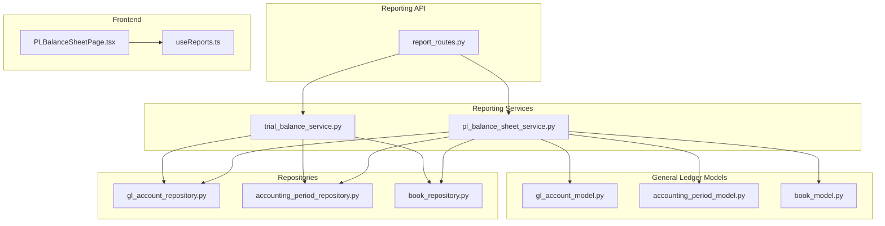
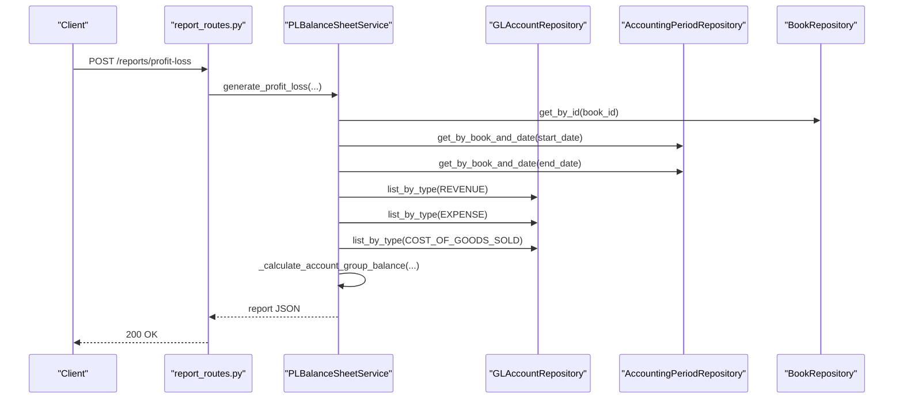
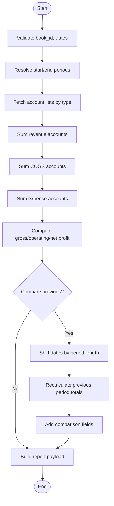
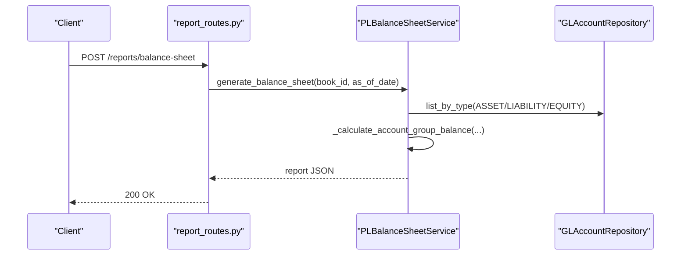
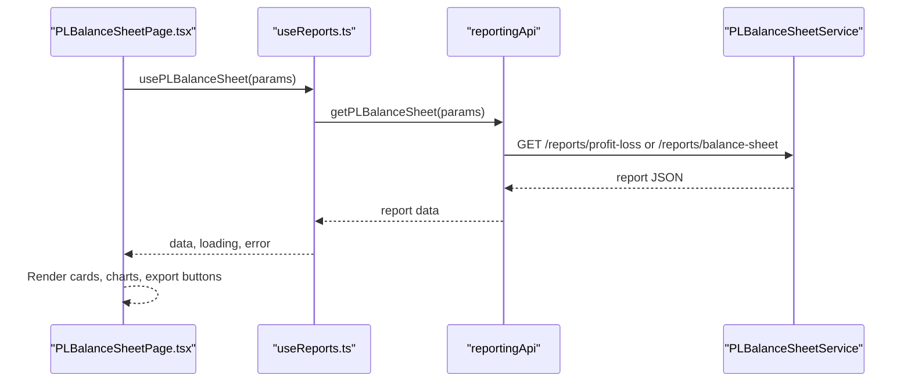
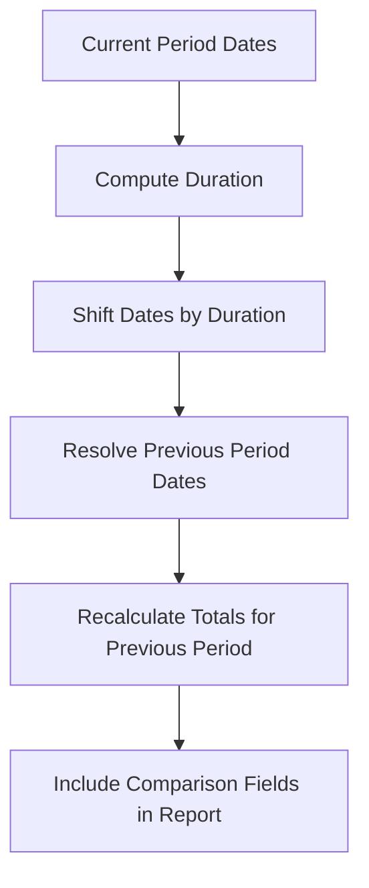
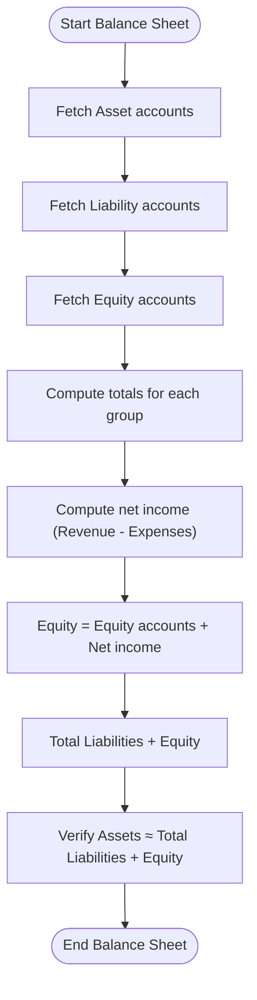
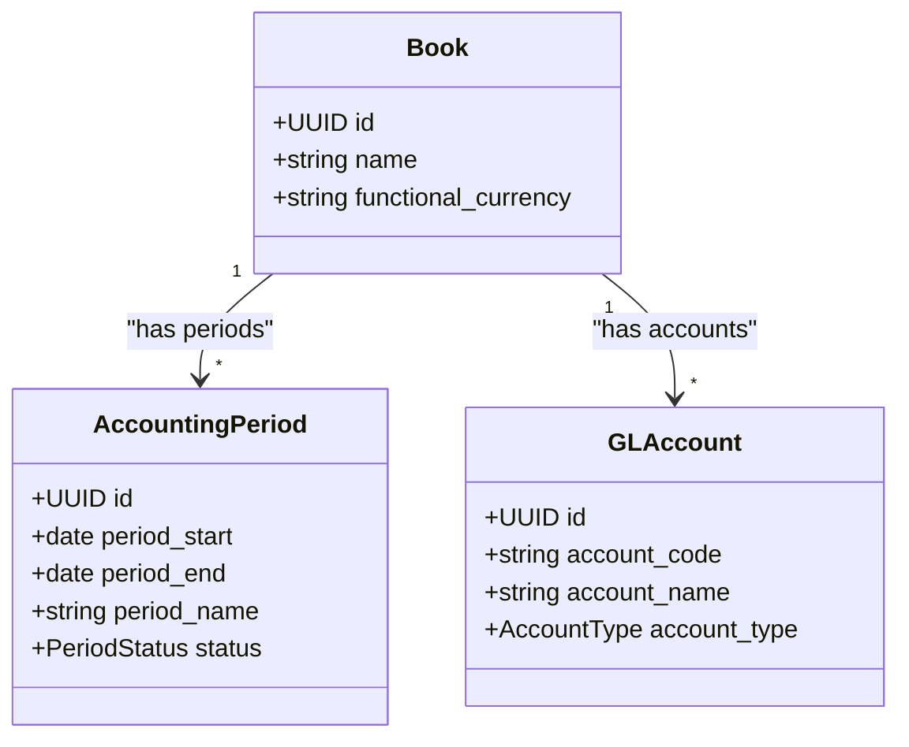
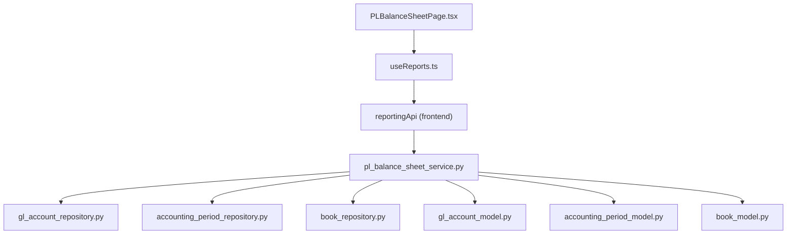

# Financial Statements Reports

<cite>
**Referenced Files in This Document**
- [pl_balance_sheet_service.py](file://app/modules/reporting/services/pl_balance_sheet_service.py)
- [report_routes.py](file://app/modules/reporting/api/routes/report_routes.py)
- [report_schemas.py](file://app/modules/reporting/schemas/report_schemas.py)
- [PLBalanceSheetPage.tsx](file://frontend/components/pages/reports/PLBalanceSheetPage.tsx)
- [useReports.ts](file://frontend/hooks/useReports.ts)
- [gl_account_model.py](file://app/modules/general_ledger/models/gl_account_model.py)
- [accounting_period_model.py](file://app/modules/general_ledger/models/accounting_period_model.py)
- [book_model.py](file://app/modules/general_ledger/models/book_model.py)
- [gl_account_repository.py](file://app/modules/general_ledger/repositories/gl_account_repository.py)
- [accounting_period_repository.py](file://app/modules/general_ledger/repositories/accounting_period_repository.py)
- [book_repository.py](file://app/modules/general_ledger/repositories/book_repository.py)
- [trial_balance_service.py](file://app/modules/reporting/services/trial_balance_service.py)
</cite>

## Table of Contents
1. [Introduction](#introduction)
2. [Project Structure](#project-structure)
3. [Core Components](#core-components)
4. [Architecture Overview](#architecture-overview)
5. [Detailed Component Analysis](#detailed-component-analysis)
6. [Dependency Analysis](#dependency-analysis)
7. [Performance Considerations](#performance-considerations)
8. [Troubleshooting Guide](#troubleshooting-guide)
9. [Conclusion](#conclusion)
10. [Appendices](#appendices)

## Introduction
This document provides comprehensive documentation for Financial Statements Reports with a focus on Profit & Loss (Income Statement) and Balance Sheet reports. It explains the PLBalanceSheetService implementation, report generation workflows, and data aggregation patterns. It also covers profit loss calculation methods, balance sheet formatting, comparative reporting capabilities, and period-based financial statements. The document includes request/response schemas, API endpoints, and integration patterns with the general ledger system. Examples of financial reporting workflows, multi-period comparisons, and executive reporting requirements are provided to support practical adoption.

## Project Structure
The financial reporting capability spans backend services and frontend UI components:
- Backend services implement report generation logic and expose REST endpoints.
- Frontend components provide interactive dashboards and export capabilities for reports.
- General ledger models and repositories integrate with accounting books, periods, and GL accounts.

**Diagram sources**
- [report_routes.py](file://app/modules/reporting/api/routes/report_routes.py#L1-L199)
- [pl_balance_sheet_service.py](file://app/modules/reporting/services/pl_balance_sheet_service.py#L1-L293)
- [trial_balance_service.py](file://app/modules/reporting/services/trial_balance_service.py#L1-L130)
- [PLBalanceSheetPage.tsx](file://frontend/components/pages/reports/PLBalanceSheetPage.tsx#L1-L232)
- [useReports.ts](file://frontend/hooks/useReports.ts#L1-L72)
- [gl_account_model.py](file://app/modules/general_ledger/models/gl_account_model.py#L1-L80)
- [accounting_period_model.py](file://app/modules/general_ledger/models/accounting_period_model.py#L1-L50)
- [book_model.py](file://app/modules/general_ledger/models/book_model.py#L1-L36)
- [gl_account_repository.py](file://app/modules/general_ledger/repositories/gl_account_repository.py#L1-L82)
- [accounting_period_repository.py](file://app/modules/general_ledger/repositories/accounting_period_repository.py#L1-L77)
- [book_repository.py](file://app/modules/general_ledger/repositories/book_repository.py#L1-L36)

**Section sources**
- [report_routes.py](file://app/modules/reporting/api/routes/report_routes.py#L1-L199)
- [pl_balance_sheet_service.py](file://app/modules/reporting/services/pl_balance_sheet_service.py#L1-L293)
- [PLBalanceSheetPage.tsx](file://frontend/components/pages/reports/PLBalanceSheetPage.tsx#L1-L232)
- [useReports.ts](file://frontend/hooks/useReports.ts#L1-L72)

## Core Components
- PLBalanceSheetService: Implements Profit & Loss and Balance Sheet report generation, including comparative reporting and period-based calculations.
- Report API routes: Expose endpoints for Profit & Loss, Balance Sheet, and other reports with both POST and GET variants.
- Report schemas: Define request models for report generation.
- Frontend report page: Provides interactive display and export for P&L and Balance Sheet reports.
- General ledger integration: Uses GL accounts, accounting periods, and books to compute balances and totals.

Key responsibilities:
- Aggregate journal entries by periods and account types.
- Compute revenue, COGS, expenses, gross profit, operating profit, and net profit for P&L.
- Compute assets, liabilities, equity, and retained earnings for Balance Sheet.
- Support comparative reporting by shifting date ranges for prior periods.
- Enforce functional currency and book context for accurate reporting.

**Section sources**
- [pl_balance_sheet_service.py](file://app/modules/reporting/services/pl_balance_sheet_service.py#L15-L293)
- [report_routes.py](file://app/modules/reporting/api/routes/report_routes.py#L46-L83)
- [report_schemas.py](file://app/modules/reporting/schemas/report_schemas.py#L16-L28)
- [PLBalanceSheetPage.tsx](file://frontend/components/pages/reports/PLBalanceSheetPage.tsx#L10-L232)

## Architecture Overview
The system follows a layered architecture:
- API layer: FastAPI routes accept requests and delegate to services.
- Service layer: PLBalanceSheetService orchestrates data retrieval and computation.
- Repository layer: Accesses GL accounts, periods, and books.
- Model layer: Defines domain entities for books, periods, and accounts.
- Frontend layer: React components render reports and trigger exports.

**Diagram sources**
- [report_routes.py](file://app/modules/reporting/api/routes/report_routes.py#L46-L64)
- [pl_balance_sheet_service.py](file://app/modules/reporting/services/pl_balance_sheet_service.py#L24-L123)
- [gl_account_repository.py](file://app/modules/general_ledger/repositories/gl_account_repository.py#L30-L49)
- [accounting_period_repository.py](file://app/modules/general_ledger/repositories/accounting_period_repository.py#L20-L33)
- [book_repository.py](file://app/modules/general_ledger/repositories/book_repository.py#L16-L28)

## Detailed Component Analysis

### PLBalanceSheetService
Responsibilities:
- Generate Profit & Loss (Income Statement) for a period with optional prior period comparison.
- Generate Balance Sheet as-of a specific date.
- Aggregate balances by account groups (Asset, Liability, Equity, Revenue, Expense, COGS).
- Compute derived metrics: gross profit, operating profit, net profit, retained earnings.

Calculation logic highlights:
- Revenue, COGS, and Expenses are summed across posted journal lines within the specified period range.
- Gross profit = Revenue - COGS.
- Operating profit = Gross profit - Expenses.
- Net profit is simplified to operating profit in the current implementation.
- Balance Sheet totals are computed for the as-of period, with equity adjusted by net income from the same period.

Comparative reporting:
- When enabled, the service shifts the date range by the length of the current period to compute prior period totals.
- Comparison fields include revenue change, expense change, and profit change.

**Diagram sources**
- [pl_balance_sheet_service.py](file://app/modules/reporting/services/pl_balance_sheet_service.py#L24-L123)

**Section sources**
- [pl_balance_sheet_service.py](file://app/modules/reporting/services/pl_balance_sheet_service.py#L15-L293)

### API Endpoints and Schemas
Endpoints:
- POST /reports/profit-loss: Generates Profit & Loss report for a period with optional prior period comparison.
- POST /reports/balance-sheet: Generates Balance Sheet as-of a specific date.
- GET variants: Same functionality via query parameters for convenience.

Request schemas:
- ProfitLossRequest: book_id, period_start, period_end, compare_previous.
- BalanceSheetRequest: book_id, as_of_date.

Response:
- Dynamic dictionary structures containing aggregated totals, per-account details, and optional comparison data.

**Diagram sources**
- [report_routes.py](file://app/modules/reporting/api/routes/report_routes.py#L67-L83)
- [pl_balance_sheet_service.py](file://app/modules/reporting/services/pl_balance_sheet_service.py#L125-L202)

**Section sources**
- [report_routes.py](file://app/modules/reporting/api/routes/report_routes.py#L46-L83)
- [report_schemas.py](file://app/modules/reporting/schemas/report_schemas.py#L16-L28)

### Frontend Integration and Reporting Page
The frontend provides:
- Interactive selection of report type (Profit & Loss vs Balance Sheet).
- Date picker for as-of date or period selection.
- Export to PDF and Excel via reporting API.
- Visualizations using charts for P&L overview and Balance Sheet composition.

Hook usage:
- usePLBalanceSheet integrates with React Query to fetch and cache report data.

**Diagram sources**
- [PLBalanceSheetPage.tsx](file://frontend/components/pages/reports/PLBalanceSheetPage.tsx#L18-L232)
- [useReports.ts](file://frontend/hooks/useReports.ts#L17-L28)

**Section sources**
- [PLBalanceSheetPage.tsx](file://frontend/components/pages/reports/PLBalanceSheetPage.tsx#L1-L232)
- [useReports.ts](file://frontend/hooks/useReports.ts#L1-L72)

### Comparative Reporting and Multi-Period Comparisons
The service supports comparative reporting by computing prior period totals:
- The prior period is determined by shifting the original date range by the duration of the current period.
- Totals for revenue and expenses are recalculated for the prior period and included in the response under a comparison field.

**Diagram sources**
- [pl_balance_sheet_service.py](file://app/modules/reporting/services/pl_balance_sheet_service.py#L99-L121)

**Section sources**
- [pl_balance_sheet_service.py](file://app/modules/reporting/services/pl_balance_sheet_service.py#L99-L121)

### Balance Sheet Formatting and Equity Calculation
Balance Sheet computation:
- Assets, Liabilities, and Equity are summed from posted journal lines up to the as-of period.
- Retained earnings are derived from net income (Revenue - Expenses) for the same period and added to Equity.
- Total Liabilities + Equity is compared to Assets to verify balancing within a small tolerance.

**Diagram sources**
- [pl_balance_sheet_service.py](file://app/modules/reporting/services/pl_balance_sheet_service.py#L125-L202)

**Section sources**
- [pl_balance_sheet_service.py](file://app/modules/reporting/services/pl_balance_sheet_service.py#L125-L202)

### Integration with General Ledger System
Integration points:
- Books: Functional currency and book context are used to format and filter reports.
- Periods: Period start/end dates are resolved to AccountingPeriod entities for accurate aggregation.
- Accounts: Account types (Asset, Liability, Equity, Revenue, Expense, COGS) drive grouping and calculation logic.

**Diagram sources**
- [book_model.py](file://app/modules/general_ledger/models/book_model.py#L15-L36)
- [accounting_period_model.py](file://app/modules/general_ledger/models/accounting_period_model.py#L18-L50)
- [gl_account_model.py](file://app/modules/general_ledger/models/gl_account_model.py#L28-L51)

**Section sources**
- [book_model.py](file://app/modules/general_ledger/models/book_model.py#L1-L36)
- [accounting_period_model.py](file://app/modules/general_ledger/models/accounting_period_model.py#L1-L50)
- [gl_account_model.py](file://app/modules/general_ledger/models/gl_account_model.py#L1-L80)

## Dependency Analysis
The PLBalanceSheetService depends on repositories and models to resolve books, periods, and accounts, and to aggregate journal entries. The API routes depend on the service to produce reports. The frontend depends on the API for data and export functionality.

**Diagram sources**
- [report_routes.py](file://app/modules/reporting/api/routes/report_routes.py#L1-L199)
- [pl_balance_sheet_service.py](file://app/modules/reporting/services/pl_balance_sheet_service.py#L1-L293)
- [gl_account_repository.py](file://app/modules/general_ledger/repositories/gl_account_repository.py#L1-L82)
- [accounting_period_repository.py](file://app/modules/general_ledger/repositories/accounting_period_repository.py#L1-L77)
- [book_repository.py](file://app/modules/general_ledger/repositories/book_repository.py#L1-L36)
- [gl_account_model.py](file://app/modules/general_ledger/models/gl_account_model.py#L1-L80)
- [accounting_period_model.py](file://app/modules/general_ledger/models/accounting_period_model.py#L1-L50)
- [book_model.py](file://app/modules/general_ledger/models/book_model.py#L1-L36)
- [PLBalanceSheetPage.tsx](file://frontend/components/pages/reports/PLBalanceSheetPage.tsx#L1-L232)
- [useReports.ts](file://frontend/hooks/useReports.ts#L1-L72)

**Section sources**
- [report_routes.py](file://app/modules/reporting/api/routes/report_routes.py#L1-L199)
- [pl_balance_sheet_service.py](file://app/modules/reporting/services/pl_balance_sheet_service.py#L1-L293)

## Performance Considerations
- Aggregation queries: The service executes grouped sums over posted journal lines for each account group. Indexes on book_id, period_id, and account_id improve performance.
- Period resolution: Using repository methods to resolve periods by date ensures correctness and avoids scanning entire tables.
- Currency and rounding: Decimal arithmetic is used consistently to minimize floating-point errors.
- Optional prior period comparison: Shifting dates and recalculating totals adds computational overhead; enable only when required.
- Frontend caching: React Query caches report data keyed by parameters, reducing redundant network calls.

[No sources needed since this section provides general guidance]

## Troubleshooting Guide
Common issues and resolutions:
- Missing book or period: The service raises a validation error if a book or period cannot be found. Ensure the provided identifiers are valid and active.
- Unbalanced reports: The Balance Sheet checks if Assets equal Total Liabilities + Equity within a small tolerance. Discrepancies indicate posting errors or incorrect period selection.
- Empty or zero balances: For P&L, ensure the period includes posted journal entries; otherwise totals will be zero.
- Comparative reporting: Verify that the date range is sufficient to compute a prior period; otherwise shift logic may yield invalid dates.

**Section sources**
- [pl_balance_sheet_service.py](file://app/modules/reporting/services/pl_balance_sheet_service.py#L39-L48)
- [pl_balance_sheet_service.py](file://app/modules/reporting/services/pl_balance_sheet_service.py#L140-L142)
- [pl_balance_sheet_service.py](file://app/modules/reporting/services/pl_balance_sheet_service.py#L204-L239)

## Conclusion
The Financial Statements Reports implementation provides robust Profit & Loss and Balance Sheet generation integrated with the general ledger. The PLBalanceSheetService encapsulates calculation logic, while the API exposes flexible endpoints supporting both POST and GET usage. The frontend enables interactive exploration and export of reports. Comparative reporting and period-based financial statements support executive reporting needs, ensuring accuracy and usability across diverse scenarios.

[No sources needed since this section summarizes without analyzing specific files]

## Appendices

### API Endpoints Summary
- POST /reports/profit-loss
  - Request: ProfitLossRequest
  - Response: Report with totals, per-account details, and optional comparison
- POST /reports/balance-sheet
  - Request: BalanceSheetRequest
  - Response: Report with assets, liabilities, equity, and totals
- GET /reports/profit-loss
  - Query parameters: book_id, period_start, period_end, compare_previous
- GET /reports/balance-sheet
  - Query parameters: book_id, as_of_date

**Section sources**
- [report_routes.py](file://app/modules/reporting/api/routes/report_routes.py#L46-L83)
- [report_routes.py](file://app/modules/reporting/api/routes/report_routes.py#L169-L198)

### Request/Response Schemas
- ProfitLossRequest
  - book_id: UUID
  - period_start: date
  - period_end: date
  - compare_previous: bool
- BalanceSheetRequest
  - book_id: UUID
  - as_of_date: date

**Section sources**
- [report_schemas.py](file://app/modules/reporting/schemas/report_schemas.py#L16-L28)