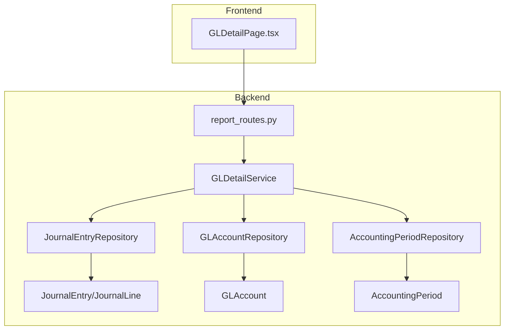
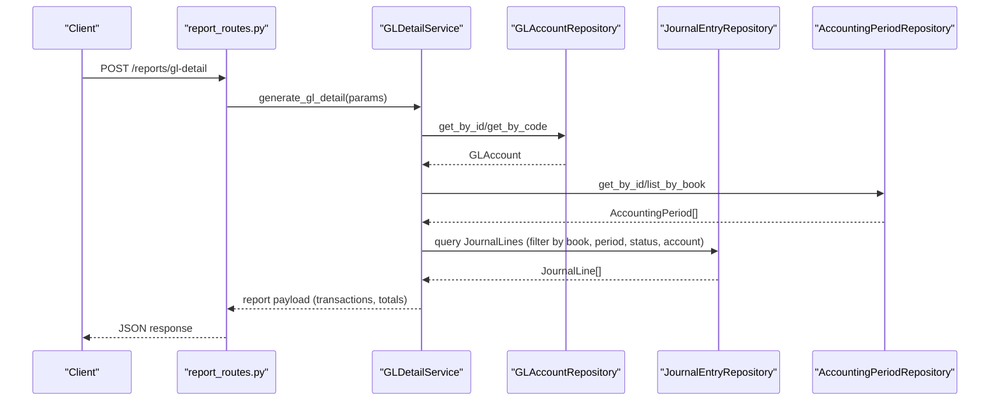
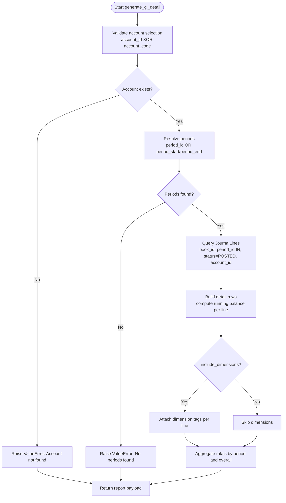
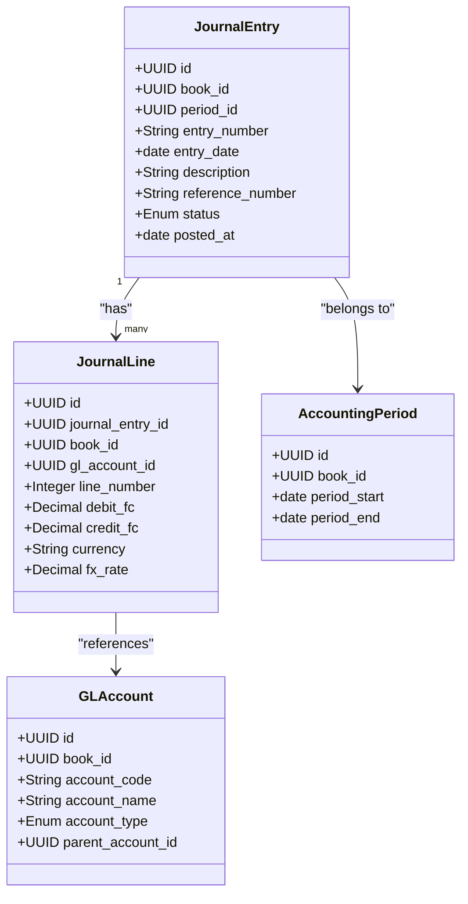
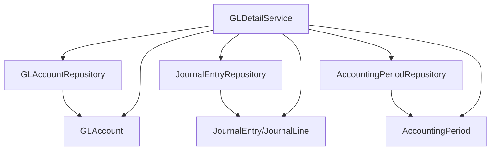

# General Ledger Detail Reports

<cite>
**Referenced Files in This Document**
- [gl_detail_service.py](file://app/modules/reporting/services/gl_detail_service.py)
- [report_routes.py](file://app/modules/reporting/api/routes/report_routes.py)
- [report_schemas.py](file://app/modules/reporting/schemas/report_schemas.py)
- [journal_entry_model.py](file://app/modules/general_ledger/models/journal_entry_model.py)
- [gl_account_model.py](file://app/modules/general_ledger/models/gl_account_model.py)
- [accounting_period_model.py](file://app/modules/general_ledger/models/accounting_period_model.py)
- [journal_entry_repository.py](file://app/modules/general_ledger/repositories/journal_entry_repository.py)
- [gl_account_repository.py](file://app/modules/general_ledger/repositories/gl_account_repository.py)
- [accounting_period_repository.py](file://app/modules/general_ledger/repositories/accounting_period_repository.py)
- [dimension_model.py](file://app/modules/general_ledger/models/dimension_model.py)
- [GLDetailPage.tsx](file://frontend/components/pages/reports/GLDetailPage.tsx)
</cite>

## Table of Contents
1. [Introduction](#introduction)
2. [Project Structure](#project-structure)
3. [Core Components](#core-components)
4. [Architecture Overview](#architecture-overview)
5. [Detailed Component Analysis](#detailed-component-analysis)
6. [Dependency Analysis](#dependency-analysis)
7. [Performance Considerations](#performance-considerations)
8. [Troubleshooting Guide](#troubleshooting-guide)
9. [Conclusion](#conclusion)

## Introduction
This document describes the General Ledger Detail Reports functionality, focusing on the GLDetailService implementation, account-level transaction detail retrieval, and drill-down reporting capabilities. It explains period-based filtering, dimension-based aggregations, account hierarchy navigation, and transaction detail extraction. The document also covers API endpoints, parameter configurations for account selection, response data structures, example workflows, audit trail processes, and financial analysis procedures.

## Project Structure
The GL Detail Reports feature spans backend services and frontend presentation:
- Backend: FastAPI routes expose a POST endpoint for GL Detail reports, delegating to GLDetailService.
- Service: GLDetailService orchestrates repository queries to fetch journal lines, compute running balances, and aggregate by period.
- Models: JournalEntry, JournalLine, GLAccount, and AccountingPeriod define the domain and relationships.
- Repositories: Typed repositories encapsulate data access for accounts, journal entries, and periods.
- Frontend: GLDetailPage provides a user interface for selecting filters and viewing results.

**Diagram sources**
- [report_routes.py](file://app/modules/reporting/api/routes/report_routes.py#L126-L147)
- [gl_detail_service.py](file://app/modules/reporting/services/gl_detail_service.py#L14-L156)
- [journal_entry_model.py](file://app/modules/general_ledger/models/journal_entry_model.py#L17-L107)
- [gl_account_model.py](file://app/modules/general_ledger/models/gl_account_model.py#L28-L50)
- [accounting_period_model.py](file://app/modules/general_ledger/models/accounting_period_model.py#L1-L200)
- [journal_entry_repository.py](file://app/modules/general_ledger/repositories/journal_entry_repository.py#L16-L118)
- [gl_account_repository.py](file://app/modules/general_ledger/repositories/gl_account_repository.py#L10-L49)
- [accounting_period_repository.py](file://app/modules/general_ledger/repositories/accounting_period_repository.py#L14-L76)

**Section sources**
- [report_routes.py](file://app/modules/reporting/api/routes/report_routes.py#L126-L147)
- [gl_detail_service.py](file://app/modules/reporting/services/gl_detail_service.py#L14-L156)

## Core Components
- GLDetailService: Implements the GL Detail report generation, including account selection, period filtering, transaction retrieval, running balance computation, and optional dimension aggregation.
- Reporting API Routes: Exposes POST /reports/gl-detail with request validation and error handling.
- Request Schemas: Defines GLDetailRequest parameters for account selection and period filters.
- Domain Models: JournalEntry, JournalLine, GLAccount, and AccountingPeriod define the data structures and relationships.
- Repositories: Typed repositories encapsulate CRUD and query logic for accounts, journal entries, and periods.

**Section sources**
- [gl_detail_service.py](file://app/modules/reporting/services/gl_detail_service.py#L14-L156)
- [report_routes.py](file://app/modules/reporting/api/routes/report_routes.py#L126-L147)
- [report_schemas.py](file://app/modules/reporting/schemas/report_schemas.py#L44-L53)
- [journal_entry_model.py](file://app/modules/general_ledger/models/journal_entry_model.py#L17-L107)
- [gl_account_model.py](file://app/modules/general_ledger/models/gl_account_model.py#L28-L50)
- [accounting_period_model.py](file://app/modules/general_ledger/models/accounting_period_model.py#L1-L200)

## Architecture Overview
The GL Detail Report follows a layered architecture:
- Presentation: Frontend page requests and renders report data.
- API Layer: FastAPI route validates request parameters and invokes the service.
- Service Layer: GLDetailService coordinates repositories and builds the report payload.
- Persistence: Repositories query SQLAlchemy models for accounts, journal lines, and periods.

**Diagram sources**
- [report_routes.py](file://app/modules/reporting/api/routes/report_routes.py#L126-L147)
- [gl_detail_service.py](file://app/modules/reporting/services/gl_detail_service.py#L23-L156)
- [journal_entry_repository.py](file://app/modules/general_ledger/repositories/journal_entry_repository.py#L16-L118)
- [gl_account_repository.py](file://app/modules/general_ledger/repositories/gl_account_repository.py#L10-L49)
- [accounting_period_repository.py](file://app/modules/general_ledger/repositories/accounting_period_repository.py#L14-L76)

## Detailed Component Analysis

### GLDetailService
Responsibilities:
- Validates account selection via ID or code.
- Resolves period filters via period_id or date range.
- Queries posted journal lines for the selected account and periods.
- Computes running balances per line.
- Optionally attaches dimension tags to each transaction line.
- Aggregates totals by period and overall.

Key behaviors:
- Account resolution: Either account_id or account_code must be provided; otherwise raises an error.
- Period resolution: Either period_id or both period_start and period_end must be provided; otherwise raises an error.
- Filtering: Only posted journal entries are included; lines are ordered by entry date and line number.
- Dimensions: When enabled, retrieves dimension values associated with each journal line.

**Diagram sources**
- [gl_detail_service.py](file://app/modules/reporting/services/gl_detail_service.py#L23-L156)

**Section sources**
- [gl_detail_service.py](file://app/modules/reporting/services/gl_detail_service.py#L14-L156)

### API Endpoints and Request Parameters
Endpoint:
- POST /reports/gl-detail

Request body (GLDetailRequest):
- book_id: Required (UUID)
- account_id: Optional (UUID)
- account_code: Optional (string)
- period_start: Optional (date)
- period_end: Optional (date)
- period_id: Optional (UUID)
- include_dimensions: Optional (boolean, default true)

Behavior:
- Either account_id or account_code must be provided.
- Either period_id or both period_start and period_end must be provided.
- Returns a structured report containing account info, period range, totals, and transaction rows.

Response structure (service returns a dictionary):
- book_id: string
- account_id: string
- account_code: string
- account_name: string
- period_start: string (ISO date)
- period_end: string (ISO date)
- total_debit: number
- total_credit: number
- ending_balance: number
- period_totals: array of period objects with:
  - period_start: string (ISO date)
  - period_end: string (ISO date)
  - debit: number
  - credit: number
  - net: number
- transactions: array of transaction detail objects with:
  - entry_date: string (ISO date)
  - entry_number: string
  - line_number: integer
  - description: string
  - reference_number: string
  - debit: number
  - credit: number
  - running_balance: number
  - dimensions: object (optional, when include_dimensions=true)

Notes:
- The API layer forwards the request to GLDetailService and handles validation errors by returning HTTP 400.

**Section sources**
- [report_routes.py](file://app/modules/reporting/api/routes/report_routes.py#L126-L147)
- [report_schemas.py](file://app/modules/reporting/schemas/report_schemas.py#L44-L53)
- [gl_detail_service.py](file://app/modules/reporting/services/gl_detail_service.py#L144-L156)

### Data Models and Relationships
Core models involved:
- JournalEntry: Contains entry metadata, status, and links to lines.
- JournalLine: Contains functional currency amounts, account reference, and dimensions.
- GLAccount: Chart of accounts with hierarchy support.
- AccountingPeriod: Period boundaries used for filtering.

**Diagram sources**
- [journal_entry_model.py](file://app/modules/general_ledger/models/journal_entry_model.py#L17-L107)
- [gl_account_model.py](file://app/modules/general_ledger/models/gl_account_model.py#L28-L50)
- [accounting_period_model.py](file://app/modules/general_ledger/models/accounting_period_model.py#L1-L200)

**Section sources**
- [journal_entry_model.py](file://app/modules/general_ledger/models/journal_entry_model.py#L17-L107)
- [gl_account_model.py](file://app/modules/general_ledger/models/gl_account_model.py#L28-L50)
- [accounting_period_model.py](file://app/modules/general_ledger/models/accounting_period_model.py#L1-L200)

### Dimension-Based Aggregations
Dimensions are attached to journal lines and can be included in the GL Detail report:
- JournalLineDimension links journal lines to dimension values.
- Dimension and DimensionValue define categories and values.
- GLDetailService optionally loads dimension values per line and returns them under a dimensions object keyed by dimension code.

Practical use:
- Enable include_dimensions=true to enrich each transaction row with dimension tags.
- Useful for segmenting transactions by cost center, department, or other business dimensions.

**Section sources**
- [journal_entry_model.py](file://app/modules/general_ledger/models/journal_entry_model.py#L110-L127)
- [dimension_model.py](file://app/modules/general_ledger/models/dimension_model.py#L8-L39)
- [gl_detail_service.py](file://app/modules/reporting/services/gl_detail_service.py#L107-L118)

### Account Hierarchy Navigation
- GLAccount supports hierarchical relationships via parent_account_id.
- The GL Detail report operates at the individual account level; hierarchy traversal is not performed by GLDetailService.
- To navigate up the hierarchy, use CoA-related services and repositories (not part of GLDetailService).

**Section sources**
- [gl_account_model.py](file://app/modules/general_ledger/models/gl_account_model.py#L53-L58)

### Transaction Detail Extraction
- Journal lines are retrieved for posted journal entries within the selected period(s) and account.
- Lines are ordered by entry date and line number.
- Running balance is computed cumulatively across returned lines.
- Dimensions can be attached per line when requested.

**Section sources**
- [gl_detail_service.py](file://app/modules/reporting/services/gl_detail_service.py#L78-L120)
- [journal_entry_repository.py](file://app/modules/general_ledger/repositories/journal_entry_repository.py#L77-L118)

### Period-Based Filtering
- Single period: Provide period_id to restrict the report to that period.
- Period range: Provide both period_start and period_end to include all periods within the range.
- The service resolves periods by book and filters journal lines accordingly.

**Section sources**
- [gl_detail_service.py](file://app/modules/reporting/services/gl_detail_service.py#L55-L72)
- [accounting_period_repository.py](file://app/modules/general_ledger/repositories/accounting_period_repository.py#L49-L63)

### API Workflow Examples

#### Example 1: Retrieve GL Detail by Period Range
- Endpoint: POST /reports/gl-detail
- Parameters:
  - book_id: <uuid>
  - account_code: "<account_code>"
  - period_start: "<YYYY-MM-DD>"
  - period_end: "<YYYY-MM-DD>"
  - include_dimensions: true
- Behavior:
  - Service resolves account by code and book.
  - Service finds all periods within the date range.
  - Service queries posted journal lines for the account and periods.
  - Service computes running balances and aggregates by period.
  - Response includes transactions, period totals, and overall totals.

#### Example 2: Retrieve GL Detail by Specific Period
- Endpoint: POST /reports/gl-detail
- Parameters:
  - book_id: <uuid>
  - account_id: <uuid>
  - period_id: <period_uuid>
  - include_dimensions: false
- Behavior:
  - Service resolves account by ID.
  - Service resolves single period by ID.
  - Service queries posted journal lines for the account and period.
  - Response excludes dimensions and includes aggregated totals.

**Section sources**
- [report_routes.py](file://app/modules/reporting/api/routes/report_routes.py#L126-L147)
- [report_schemas.py](file://app/modules/reporting/schemas/report_schemas.py#L44-L53)
- [gl_detail_service.py](file://app/modules/reporting/services/gl_detail_service.py#L23-L156)

### Financial Analysis Procedures
- Drill-down from trial balance to GL Detail:
  - Use trial balance to identify high-value accounts.
  - Filter GL Detail by those accounts and a relevant period range.
- Trend analysis:
  - Compare period_totals across multiple periods to observe changes in debit/credit activity.
- Variance analysis:
  - Compare reported totals against budgeted or prior-period figures.
- Audit trail:
  - Journal entries are immutable after posting; GL Detail reflects posted lines only.
  - Use entry_number and reference_number to trace transactions to source documents.

**Section sources**
- [journal_entry_model.py](file://app/modules/general_ledger/models/journal_entry_model.py#L17-L57)
- [journal_entry_repository.py](file://app/modules/general_ledger/repositories/journal_entry_repository.py#L16-L75)

## Dependency Analysis
The GL Detail report depends on typed repositories and models:
- GLDetailService depends on:
  - GLAccountRepository for account lookup
  - JournalEntryRepository for journal line queries
  - AccountingPeriodRepository for period resolution
- Models define relationships used in queries:
  - JournalEntry → JournalLine
  - JournalLine → GLAccount
  - JournalEntry → AccountingPeriod

**Diagram sources**
- [gl_detail_service.py](file://app/modules/reporting/services/gl_detail_service.py#L17-L21)
- [journal_entry_repository.py](file://app/modules/general_ledger/repositories/journal_entry_repository.py#L16-L118)
- [gl_account_repository.py](file://app/modules/general_ledger/repositories/gl_account_repository.py#L10-L49)
- [accounting_period_repository.py](file://app/modules/general_ledger/repositories/accounting_period_repository.py#L14-L76)

**Section sources**
- [gl_detail_service.py](file://app/modules/reporting/services/gl_detail_service.py#L17-L21)

## Performance Considerations
- Query scope: Limit the period range to reduce dataset size.
- Indexes: Ensure proper indexing on JournalEntry (status, period_id, book_id), JournalLine (journal_entry_id, gl_account_id), and GLAccount (book_id, account_code).
- Pagination: The frontend supports pagination; consider server-side pagination for very large datasets.
- Dimension loading: Disabling include_dimensions reduces extra joins and improves performance when dimensions are not needed.

## Troubleshooting Guide
Common issues and resolutions:
- Missing account filters:
  - Symptom: ValueError indicating either account_id or account_code must be provided.
  - Resolution: Provide one of account_id or account_code.
- Account not found:
  - Symptom: ValueError stating account not found.
  - Resolution: Verify account_code/book combination or account_id.
- Missing period filters:
  - Symptom: ValueError indicating either period_id or period_start/period_end must be provided.
  - Resolution: Provide period_id or both period_start and period_end.
- No periods in date range:
  - Symptom: ValueError stating no periods found for date range.
  - Resolution: Adjust period_start/period_end to match existing periods.
- Non-posted entries:
  - Symptom: No transactions returned.
  - Resolution: Ensure only posted journal entries are included; posted entries are filtered by status.

**Section sources**
- [gl_detail_service.py](file://app/modules/reporting/services/gl_detail_service.py#L44-L71)
- [journal_entry_model.py](file://app/modules/general_ledger/models/journal_entry_model.py#L10-L15)

## Conclusion
The General Ledger Detail Reports feature provides robust, period-filtered transaction detail for a selected GL account, with optional dimension enrichment and period-level aggregations. The GLDetailService centralizes the logic for account selection, period resolution, journal line retrieval, running balance computation, and response assembly. The API exposes a straightforward endpoint for programmatic access, while the frontend offers a practical interface for interactive exploration and analysis.