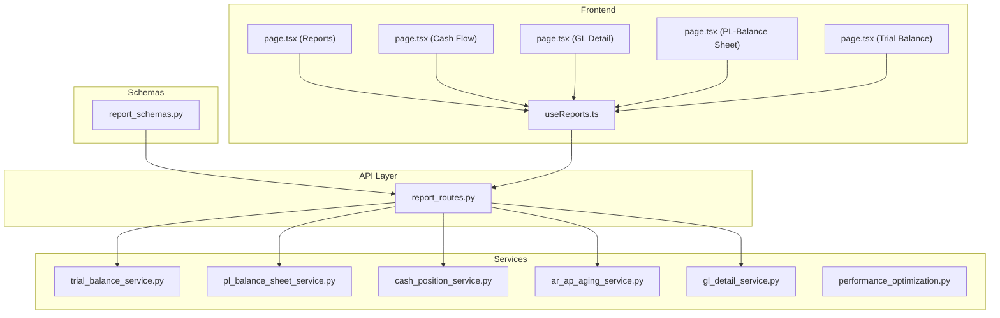
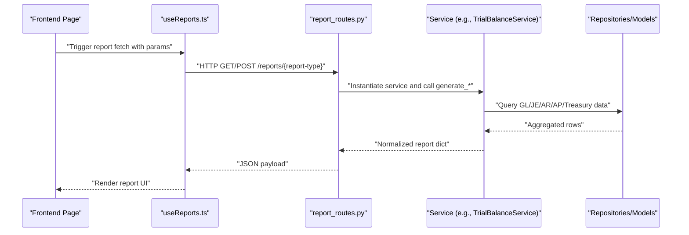
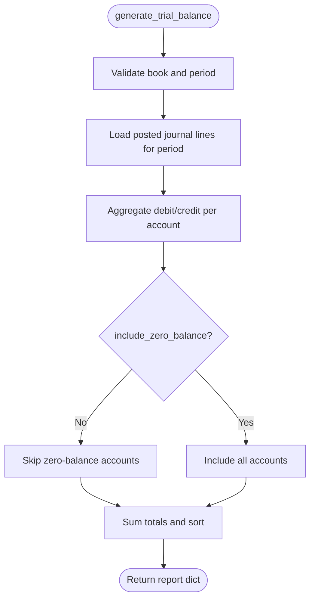
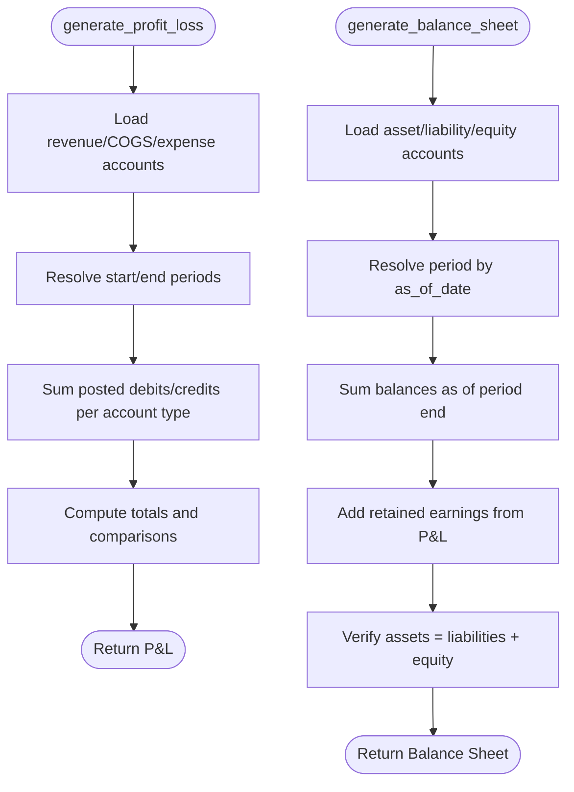
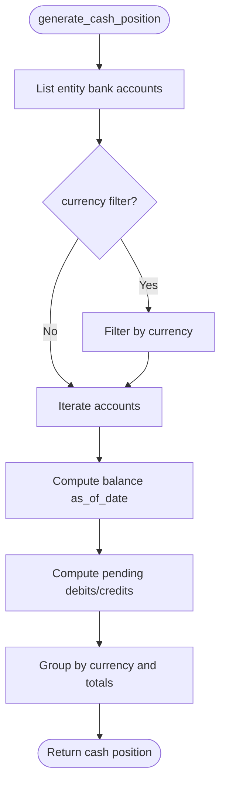
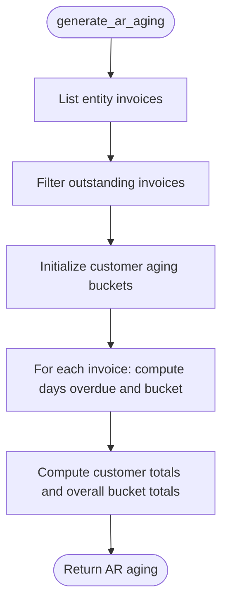
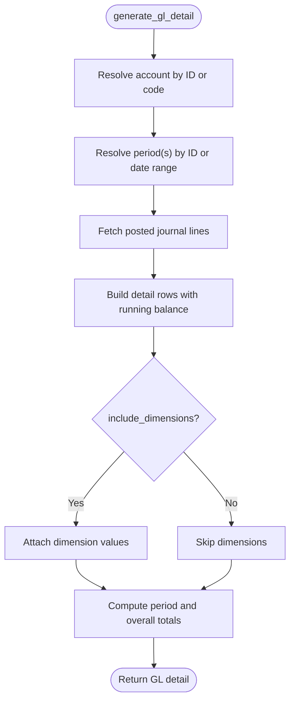
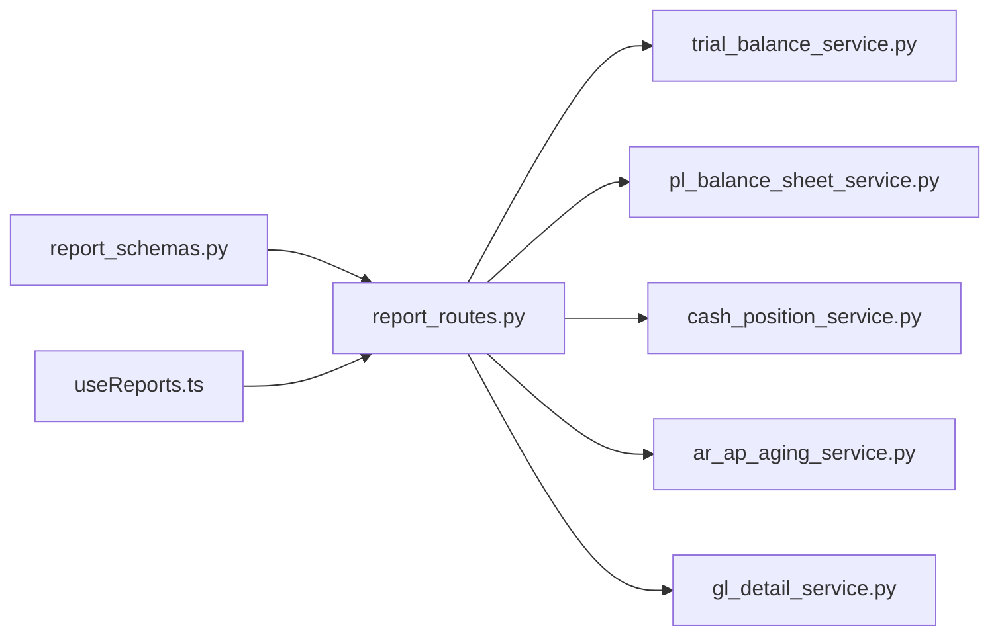

# Reporting Module

<cite>
**Referenced Files in This Document**
- [report_routes.py](file://app/modules/reporting/api/routes/report_routes.py)
- [report_schemas.py](file://app/modules/reporting/schemas/report_schemas.py)
- [ar_ap_aging_service.py](file://app/modules/reporting/services/ar_ap_aging_service.py)
- [cash_position_service.py](file://app/modules/reporting/services/cash_position_service.py)
- [gl_detail_service.py](file://app/modules/reporting/services/gl_detail_service.py)
- [pl_balance_sheet_service.py](file://app/modules/reporting/services/pl_balance_sheet_service.py)
- [trial_balance_service.py](file://app/modules/reporting/services/trial_balance_service.py)
- [performance_optimization.py](file://app/modules/reporting/services/performance_optimization.py)
- [useReports.ts](file://frontend/hooks/useReports.ts)
- [page.tsx (Reports)](file://frontend/app/(dashboard)/reports/page.tsx)
- [page.tsx (Cash Flow)](file://frontend/app/(dashboard)/reports/cash-flow/page.tsx)
- [page.tsx (GL Detail)](file://frontend/app/(dashboard)/reports/gl-detail/page.tsx)
- [page.tsx (PL-Balance Sheet)](file://frontend/app/(dashboard)/reports/pl-balance-sheet/page.tsx)
- [page.tsx (Trial Balance)](file://frontend/app/(dashboard)/reports/trial-balance/page.tsx)
</cite>

## Table of Contents
1. [Introduction](#introduction)
2. [Project Structure](#project-structure)
3. [Core Components](#core-components)
4. [Architecture Overview](#architecture-overview)
5. [Detailed Component Analysis](#detailed-component-analysis)
6. [Dependency Analysis](#dependency-analysis)
7. [Performance Considerations](#performance-considerations)
8. [Troubleshooting Guide](#troubleshooting-guide)
9. [Conclusion](#conclusion)
10. [Appendices](#appendices)

## Introduction
This document describes the Reporting module responsible for financial statement generation, analytics dashboards, drill-down reporting, and custom report creation. It explains the AR/AP aging service, cash position service, GL detail service, P&L/Balance Sheet service, and trial balance service implementations. It also documents report schemas, data aggregation patterns, report routes and their data sources, and provides examples of financial reporting workflows, dashboard creation, and executive reporting requirements. Finally, it addresses report performance optimization and data security considerations.

## Project Structure
The Reporting module is organized around:
- API routes that expose report endpoints
- Pydantic schemas that define request shapes
- Service classes that encapsulate report logic and data aggregation
- Frontend pages and hooks that consume the reporting APIs

**Diagram sources**
- [report_routes.py](file://app/modules/reporting/api/routes/report_routes.py#L1-L199)
- [report_schemas.py](file://app/modules/reporting/schemas/report_schemas.py#L1-L57)
- [trial_balance_service.py](file://app/modules/reporting/services/trial_balance_service.py#L1-L130)
- [pl_balance_sheet_service.py](file://app/modules/reporting/services/pl_balance_sheet_service.py#L1-L293)
- [cash_position_service.py](file://app/modules/reporting/services/cash_position_service.py#L1-L149)
- [ar_ap_aging_service.py](file://app/modules/reporting/services/ar_ap_aging_service.py#L1-L120)
- [gl_detail_service.py](file://app/modules/reporting/services/gl_detail_service.py#L1-L157)
- [performance_optimization.py](file://app/modules/reporting/services/performance_optimization.py#L1-L172)
- [useReports.ts](file://frontend/hooks/useReports.ts#L1-L72)
- [page.tsx (Reports)](file://frontend/app/(dashboard)/reports/page.tsx#L1-L10)
- [page.tsx (Cash Flow)](file://frontend/app/(dashboard)/reports/cash-flow/page.tsx#L1-L10)
- [page.tsx (GL Detail)](file://frontend/app/(dashboard)/reports/gl-detail/page.tsx#L1-L10)
- [page.tsx (PL-Balance Sheet)](file://frontend/app/(dashboard)/reports/pl-balance-sheet/page.tsx#L1-L10)
- [page.tsx (Trial Balance)](file://frontend/app/(dashboard)/reports/trial-balance/page.tsx#L1-L10)

**Section sources**
- [report_routes.py](file://app/modules/reporting/api/routes/report_routes.py#L1-L199)
- [report_schemas.py](file://app/modules/reporting/schemas/report_schemas.py#L1-L57)

## Core Components
- Report routes: Expose POST and GET endpoints for trial balance, profit & loss, balance sheet, cash position, AR aging, and GL detail.
- Request schemas: Define typed request bodies for each report.
- Services: Implement report generation, data aggregation, and response shaping.
- Frontend hooks and pages: Integrate with React Query to fetch and render reports.

Key responsibilities:
- Route orchestration and error handling
- Request validation via Pydantic
- Aggregation of GL/JE data, AR/AP aging calculations, and cash position computations
- Response normalization to JSON-friendly structures

**Section sources**
- [report_routes.py](file://app/modules/reporting/api/routes/report_routes.py#L22-L199)
- [report_schemas.py](file://app/modules/reporting/schemas/report_schemas.py#L8-L57)
- [useReports.ts](file://frontend/hooks/useReports.ts#L1-L72)

## Architecture Overview
The Reporting module follows a layered architecture:
- API routes accept requests and delegate to services
- Services query repositories/models and compute aggregates
- Responses are normalized dictionaries suitable for dashboards and exports

**Diagram sources**
- [report_routes.py](file://app/modules/reporting/api/routes/report_routes.py#L25-L147)
- [trial_balance_service.py](file://app/modules/reporting/services/trial_balance_service.py#L26-L129)
- [pl_balance_sheet_service.py](file://app/modules/reporting/services/pl_balance_sheet_service.py#L24-L123)
- [cash_position_service.py](file://app/modules/reporting/services/cash_position_service.py#L23-L101)
- [ar_ap_aging_service.py](file://app/modules/reporting/services/ar_ap_aging_service.py#L22-L119)
- [gl_detail_service.py](file://app/modules/reporting/services/gl_detail_service.py#L23-L156)
- [useReports.ts](file://frontend/hooks/useReports.ts#L4-L71)

## Detailed Component Analysis

### Report Routes and Data Sources
- POST /reports/trial-balance → TrialBalanceService
- POST /reports/profit-loss → PLBalanceSheetService
- POST /reports/balance-sheet → PLBalanceSheetService
- POST /reports/cash-position → CashPositionService
- POST /reports/ar-aging → ARAgingService
- POST /reports/gl-detail → GLDetailService
- GET variants mirror POST with query parameters

Data sources per route:
- Trial Balance: GL accounts and posted journal lines for a period
- Profit & Loss: Posted journal lines for revenue/COGS/expense accounts within a period range
- Balance Sheet: Posted journal lines for asset/liability/equity accounts as of a period
- Cash Position: Bank accounts and bank transactions for an entity as of a date
- AR Aging: Customer invoices and allocations for an entity as of a date
- GL Detail: Journal lines for a specific GL account within a period or date range

**Section sources**
- [report_routes.py](file://app/modules/reporting/api/routes/report_routes.py#L25-L199)

### Trial Balance Service
Purpose: Produce a list of accounts with debit/credit totals and net balances for a given period.

Processing logic:
- Resolve book and period (by ID or as-of-date)
- Fetch posted journal lines for the period
- Aggregate debits/credits per account
- Optionally filter out zero-balance accounts
- Compute totals and sort by account code

**Diagram sources**
- [trial_balance_service.py](file://app/modules/reporting/services/trial_balance_service.py#L26-L129)

**Section sources**
- [trial_balance_service.py](file://app/modules/reporting/services/trial_balance_service.py#L1-L130)

### P&L and Balance Sheet Service
Purpose: Generate Profit & Loss and Balance Sheet statements.

Processing logic:
- Profit & Loss:
  - Identify revenue/COGS/expense accounts
  - Sum posted journal lines within a period range
  - Compute gross profit, operating profit, net profit
  - Optional previous-period comparison
- Balance Sheet:
  - Identify asset/liability/equity accounts
  - Sum balances as of a period’s end
  - Add retained earnings derived from current period P&L
  - Verify balancing

**Diagram sources**
- [pl_balance_sheet_service.py](file://app/modules/reporting/services/pl_balance_sheet_service.py#L24-L202)

**Section sources**
- [pl_balance_sheet_service.py](file://app/modules/reporting/services/pl_balance_sheet_service.py#L1-L293)

### Cash Position Service
Purpose: Report cash balances per bank account and currency, including pending transactions and projected balances.

Processing logic:
- List bank accounts for an entity (optional currency filter)
- For each account:
  - Sum transactions up to as_of_date to compute ending balance
  - Sum future pending debits/credits after as_of_date
  - Compute projected balance
- Group by currency and compute totals

**Diagram sources**
- [cash_position_service.py](file://app/modules/reporting/services/cash_position_service.py#L23-L101)

**Section sources**
- [cash_position_service.py](file://app/modules/reporting/services/cash_position_service.py#L1-L149)

### AR Aging Service
Purpose: Produce accounts receivable aging by customer and optional aging buckets.

Processing logic:
- Retrieve outstanding invoices for an entity
- For each invoice, compute days overdue vs due date
- Bucket amounts by aging thresholds (default 0, 30, 60, 90)
- Aggregate totals per customer and overall
- Return structured report with customer-level drill-down

**Diagram sources**
- [ar_ap_aging_service.py](file://app/modules/reporting/services/ar_ap_aging_service.py#L22-L119)

**Section sources**
- [ar_ap_aging_service.py](file://app/modules/reporting/services/ar_ap_aging_service.py#L1-L120)

### GL Detail Service
Purpose: Provide transaction-level detail for a specific GL account within a period or date range, with optional dimension details.

Processing logic:
- Resolve account by ID or code
- Resolve period(s) by ID or date range
- Fetch posted journal lines for the account and periods
- Compute running balance and optionally include dimension values per line
- Aggregate period-level totals and overall totals

**Diagram sources**
- [gl_detail_service.py](file://app/modules/reporting/services/gl_detail_service.py#L23-L156)

**Section sources**
- [gl_detail_service.py](file://app/modules/reporting/services/gl_detail_service.py#L1-L157)

### Report Schemas
Request schemas define the shape of report inputs:
- TrialBalanceRequest: book_id, period_id or as_of_date, include_zero_balance
- ProfitLossRequest: book_id, period_start, period_end, compare_previous
- BalanceSheetRequest: book_id, as_of_date
- CashPositionRequest: entity_id, as_of_date, currency
- ARAgingRequest: entity_id, as_of_date, aging_buckets
- GLDetailRequest: book_id, account_id or account_code, period_start/period_end or period_id, include_dimensions

Response schemas are intentionally dynamic (Dict[str, Any]) as each service returns a tailored report structure.

**Section sources**
- [report_schemas.py](file://app/modules/reporting/schemas/report_schemas.py#L8-L57)

### Frontend Integration
- Frontend pages for each report type initialize Clerk tokens and render report-specific pages.
- React Query hooks encapsulate fetching logic keyed by parameters such as legal entity, book, period/date, and optional filters.

Typical usage pattern:
- Initialize useReports hook with required parameters
- Enable query only when required fields are present
- Render loading/error states and display normalized report data

**Section sources**
- [page.tsx (Reports)](file://frontend/app/(dashboard)/reports/page.tsx#L1-L10)
- [page.tsx (Cash Flow)](file://frontend/app/(dashboard)/reports/cash-flow/page.tsx#L1-L10)
- [page.tsx (GL Detail)](file://frontend/app/(dashboard)/reports/gl-detail/page.tsx#L1-L10)
- [page.tsx (PL-Balance Sheet)](file://frontend/app/(dashboard)/reports/pl-balance-sheet/page.tsx#L1-L10)
- [page.tsx (Trial Balance)](file://frontend/app/(dashboard)/reports/trial-balance/page.tsx#L1-L10)
- [useReports.ts](file://frontend/hooks/useReports.ts#L1-L72)

## Dependency Analysis
- Routes depend on services and schemas
- Services depend on repositories/models from general ledger, AR/AP, and treasury modules
- Frontend depends on reporting API endpoints exposed by routes

**Diagram sources**
- [report_routes.py](file://app/modules/reporting/api/routes/report_routes.py#L8-L20)
- [trial_balance_service.py](file://app/modules/reporting/services/trial_balance_service.py#L1-L14)
- [pl_balance_sheet_service.py](file://app/modules/reporting/services/pl_balance_sheet_service.py#L1-L12)
- [cash_position_service.py](file://app/modules/reporting/services/cash_position_service.py#L1-L11)
- [ar_ap_aging_service.py](file://app/modules/reporting/services/ar_ap_aging_service.py#L1-L10)
- [gl_detail_service.py](file://app/modules/reporting/services/gl_detail_service.py#L1-L11)
- [report_schemas.py](file://app/modules/reporting/schemas/report_schemas.py#L1-L6)
- [useReports.ts](file://frontend/hooks/useReports.ts#L1-L2)

**Section sources**
- [report_routes.py](file://app/modules/reporting/api/routes/report_routes.py#L1-L22)
- [useReports.ts](file://frontend/hooks/useReports.ts#L1-L72)

## Performance Considerations
- Indexing review: The performance optimization service inspects database indexes and suggests improvements for foreign keys and commonly filtered columns.
- Slow query analysis: Uses PostgreSQL pg_stat_statements to identify queries with high mean execution times.
- Table statistics: Retrieves row counts and maintenance timestamps to guide vacuum/analyze decisions.

Recommendations:
- Ensure indexes exist on frequently filtered columns (e.g., created_at, status) and foreign keys used in report joins.
- Monitor slow queries and optimize report queries with appropriate indexes and query plans.
- Consider partitioning or materialized summaries for very large datasets.
- Batch and paginate large report exports.

**Section sources**
- [performance_optimization.py](file://app/modules/reporting/services/performance_optimization.py#L15-L172)

## Troubleshooting Guide
Common issues and resolutions:
- Validation errors: Requests must satisfy schema constraints (e.g., either period_id or as_of_date for trial balance; either period_id or period_start/period_end for GL detail).
- Missing resources: Errors raised when books, periods, accounts, or entities are not found.
- Zero-balance exclusions: Adjust include_zero_balance flag to include/exclude zero balances in trial balance.
- Currency filtering: Use currency parameter in cash position to isolate specific currencies.
- Aging buckets: Provide custom aging_buckets for AR aging if defaults are unsuitable.

Error handling:
- Routes catch ValueError and generic exceptions, returning HTTP 400/500 with details.

**Section sources**
- [report_routes.py](file://app/modules/reporting/api/routes/report_routes.py#L40-L147)
- [trial_balance_service.py](file://app/modules/reporting/services/trial_balance_service.py#L41-L56)
- [gl_detail_service.py](file://app/modules/reporting/services/gl_detail_service.py#L44-L71)
- [cash_position_service.py](file://app/modules/reporting/services/cash_position_service.py#L36-L41)
- [ar_ap_aging_service.py](file://app/modules/reporting/services/ar_ap_aging_service.py#L35-L36)

## Conclusion
The Reporting module provides robust, modular services for financial reporting, with clear separation of concerns between routing, schemas, and services. It supports core financial statements, cash visibility, and detailed drill-down capabilities, while offering frontend hooks for seamless dashboard integration. Performance and security considerations are addressed through validation, controlled access patterns, and database optimization utilities.

## Appendices

### Report Workflows and Examples
- Financial statement generation:
  - P&L: Provide book_id, period_start, period_end; optionally compare_previous to include prior period changes.
  - Balance Sheet: Provide book_id and as_of_date; service computes assets, liabilities, equity, and verifies balancing.
- Drill-down reporting:
  - Trial Balance: Use include_zero_balance to show or hide zero balances.
  - GL Detail: Provide account_id or account_code along with period_id or period_start/period_end; enable include_dimensions for granular breakdowns.
- Custom report creation:
  - Combine multiple report endpoints to build dashboards (e.g., P&L plus cash position).
  - Use frontend hooks to cache and re-fetch data efficiently.

### Executive Reporting Requirements
- Use GET endpoints for quick retrieval with query parameters.
- For dashboards, leverage React Query caching and background refetching.
- Export flows can be built on top of existing report endpoints for PDF/Excel.

[No sources needed since this section provides general guidance]