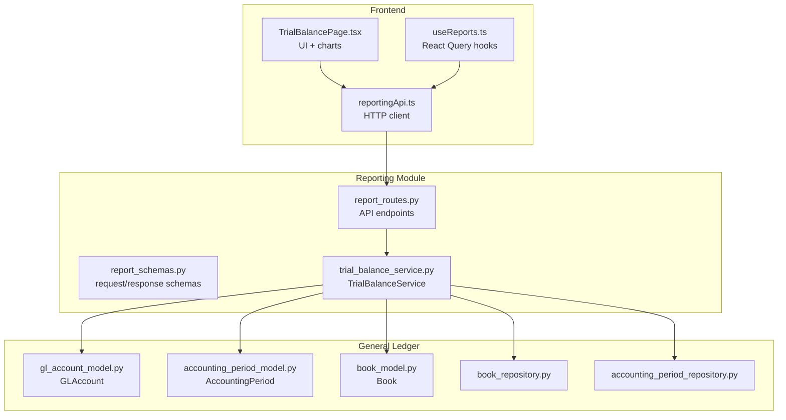
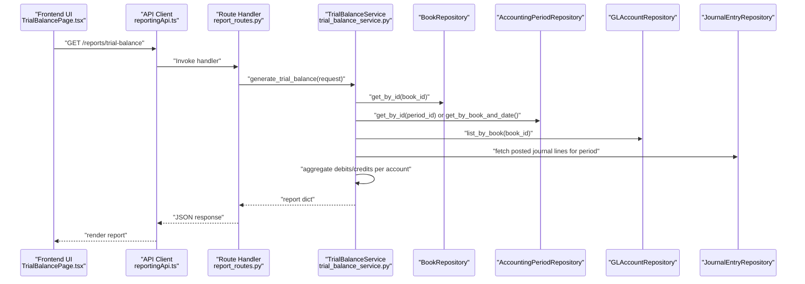
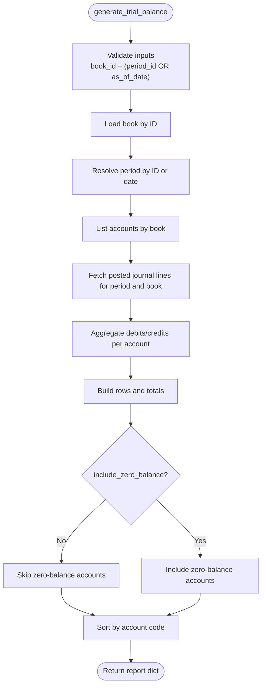
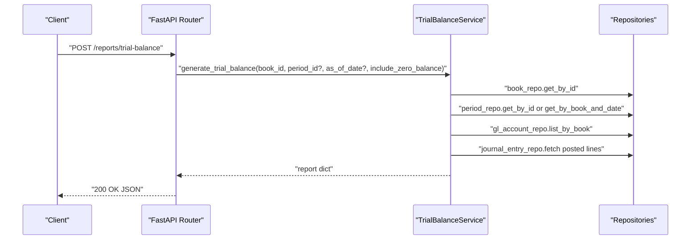
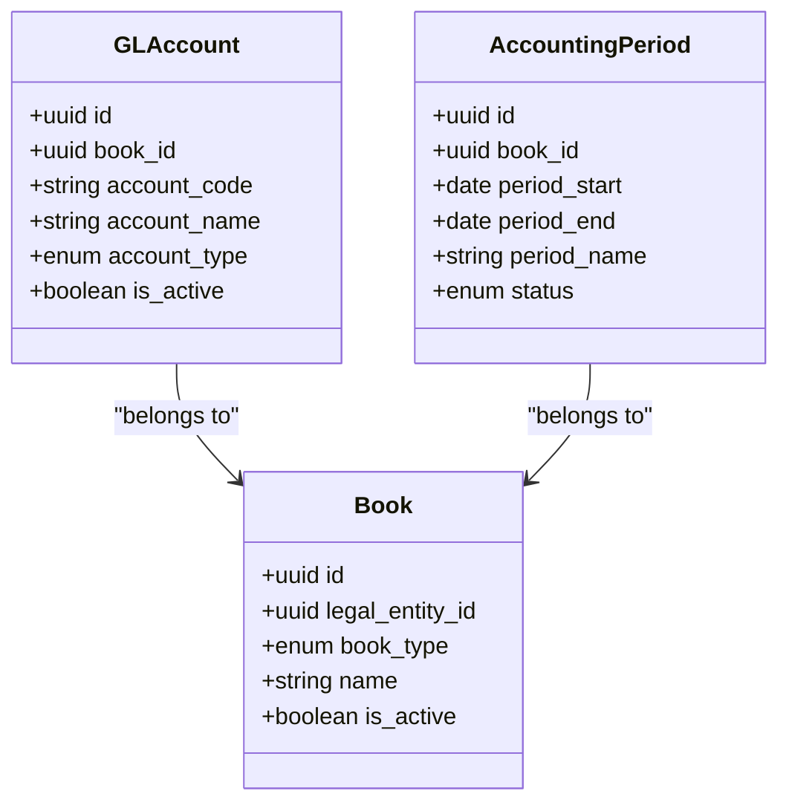
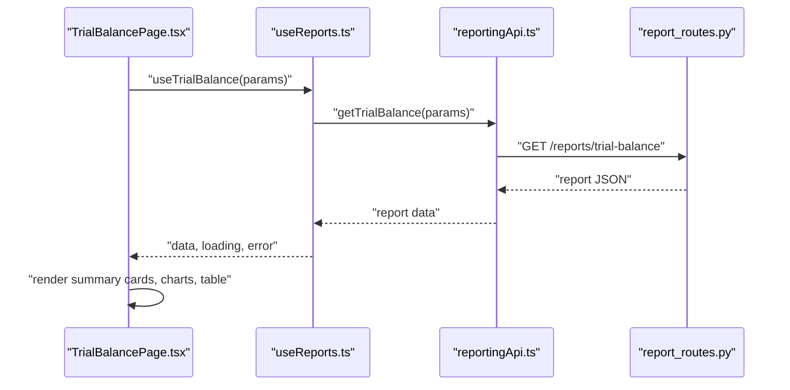
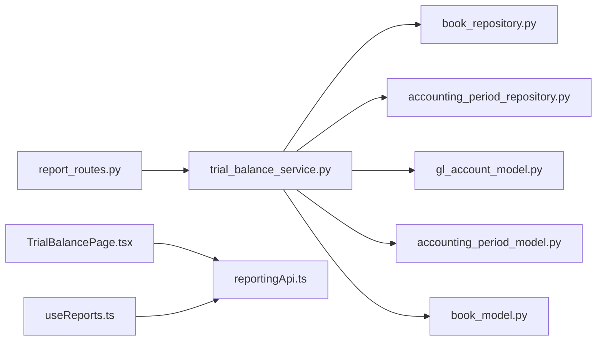

# Trial Balance Report

<cite>
**Referenced Files in This Document**
- [trial_balance_service.py](file://app/modules/reporting/services/trial_balance_service.py)
- [report_routes.py](file://app/modules/reporting/api/routes/report_routes.py)
- [report_schemas.py](file://app/modules/reporting/schemas/report_schemas.py)
- [gl_account_model.py](file://app/modules/general_ledger/models/gl_account_model.py)
- [accounting_period_model.py](file://app/modules/general_ledger/models/accounting_period_model.py)
- [book_model.py](file://app/modules/general_ledger/models/book_model.py)
- [book_repository.py](file://app/modules/general_ledger/repositories/book_repository.py)
- [accounting_period_repository.py](file://app/modules/general_ledger/repositories/accounting_period_repository.py)
- [TrialBalancePage.tsx](file://frontend/components/pages/reports/TrialBalancePage.tsx)
- [reportingApi.ts](file://frontend/lib/api/reportingApi.ts)
- [useReports.ts](file://frontend/hooks/useReports.ts)
</cite>

## Table of Contents
1. [Introduction](#introduction)
2. [Project Structure](#project-structure)
3. [Core Components](#core-components)
4. [Architecture Overview](#architecture-overview)
5. [Detailed Component Analysis](#detailed-component-analysis)
6. [Dependency Analysis](#dependency-analysis)
7. [Performance Considerations](#performance-considerations)
8. [Troubleshooting Guide](#troubleshooting-guide)
9. [Conclusion](#conclusion)
10. [Appendices](#appendices)

## Introduction
This document describes the Trial Balance Report functionality, focusing on the backend TrialBalanceService implementation, account balancing calculations, and report generation processes. It explains validation logic, zero-balance filtering, period-based reporting, and book-specific aggregations. It also documents the API endpoints, request parameters, response formats, and provides practical workflows for trial balance generation, account reconciliation, and period-end closing procedures.

## Project Structure
The Trial Balance Report spans backend services and frontend presentation:
- Backend service and routes: app/modules/reporting/services/trial_balance_service.py and app/modules/reporting/api/routes/report_routes.py
- Request schemas: app/modules/reporting/schemas/report_schemas.py
- Domain models and repositories: general ledger models and repositories under app/modules/general_ledger
- Frontend pages and APIs: frontend/components/pages/reports/TrialBalancePage.tsx, frontend/lib/api/reportingApi.ts, and frontend/hooks/useReports.ts

**Diagram sources**
- [report_routes.py](file://app/modules/reporting/api/routes/report_routes.py#L25-L44)
- [trial_balance_service.py](file://app/modules/reporting/services/trial_balance_service.py#L16-L129)
- [report_schemas.py](file://app/modules/reporting/schemas/report_schemas.py#L8-L14)
- [gl_account_model.py](file://app/modules/general_ledger/models/gl_account_model.py#L28-L50)
- [accounting_period_model.py](file://app/modules/general_ledger/models/accounting_period_model.py#L18-L49)
- [book_model.py](file://app/modules/general_ledger/models/book_model.py#L15-L35)
- [book_repository.py](file://app/modules/general_ledger/repositories/book_repository.py#L10-L35)
- [accounting_period_repository.py](file://app/modules/general_ledger/repositories/accounting_period_repository.py#L14-L76)
- [TrialBalancePage.tsx](file://frontend/components/pages/reports/TrialBalancePage.tsx#L11-L253)
- [reportingApi.ts](file://frontend/lib/api/reportingApi.ts#L80-L150)
- [useReports.ts](file://frontend/hooks/useReports.ts#L4-L15)

**Section sources**
- [report_routes.py](file://app/modules/reporting/api/routes/report_routes.py#L22-L44)
- [trial_balance_service.py](file://app/modules/reporting/services/trial_balance_service.py#L16-L129)
- [report_schemas.py](file://app/modules/reporting/schemas/report_schemas.py#L8-L14)
- [gl_account_model.py](file://app/modules/general_ledger/models/gl_account_model.py#L28-L50)
- [accounting_period_model.py](file://app/modules/general_ledger/models/accounting_period_model.py#L18-L49)
- [book_model.py](file://app/modules/general_ledger/models/book_model.py#L15-L35)
- [book_repository.py](file://app/modules/general_ledger/repositories/book_repository.py#L10-L35)
- [accounting_period_repository.py](file://app/modules/general_ledger/repositories/accounting_period_repository.py#L14-L76)
- [TrialBalancePage.tsx](file://frontend/components/pages/reports/TrialBalancePage.tsx#L11-L253)
- [reportingApi.ts](file://frontend/lib/api/reportingApi.ts#L80-L150)
- [useReports.ts](file://frontend/hooks/useReports.ts#L4-L15)

## Core Components
- TrialBalanceService: orchestrates Trial Balance generation by resolving the book and period, fetching posted journal lines, computing per-account debits/credits, and building the report payload.
- Report API routes: expose POST and GET endpoints for Trial Balance generation with validation and error handling.
- Request schemas: define TrialBalanceRequest shape and validation rules.
- Domain models and repositories: GLAccount, AccountingPeriod, Book, and their repositories support account enumeration, period resolution, and book lookup.
- Frontend integration: TrialBalancePage renders the report, summary cards, charts, and export actions; reportingApi and useReports integrate with the backend.

**Section sources**
- [trial_balance_service.py](file://app/modules/reporting/services/trial_balance_service.py#L16-L129)
- [report_routes.py](file://app/modules/reporting/api/routes/report_routes.py#L25-L44)
- [report_schemas.py](file://app/modules/reporting/schemas/report_schemas.py#L8-L14)
- [gl_account_model.py](file://app/modules/general_ledger/models/gl_account_model.py#L28-L50)
- [accounting_period_model.py](file://app/modules/general_ledger/models/accounting_period_model.py#L18-L49)
- [book_model.py](file://app/modules/general_ledger/models/book_model.py#L15-L35)
- [book_repository.py](file://app/modules/general_ledger/repositories/book_repository.py#L10-L35)
- [accounting_period_repository.py](file://app/modules/general_ledger/repositories/accounting_period_repository.py#L14-L76)
- [TrialBalancePage.tsx](file://frontend/components/pages/reports/TrialBalancePage.tsx#L11-L253)
- [reportingApi.ts](file://frontend/lib/api/reportingApi.ts#L80-L150)
- [useReports.ts](file://frontend/hooks/useReports.ts#L4-L15)

## Architecture Overview
The Trial Balance pipeline integrates API requests, service computation, and domain data retrieval.

**Diagram sources**
- [report_routes.py](file://app/modules/reporting/api/routes/report_routes.py#L25-L44)
- [trial_balance_service.py](file://app/modules/reporting/services/trial_balance_service.py#L26-L129)
- [book_repository.py](file://app/modules/general_ledger/repositories/book_repository.py#L10-L35)
- [accounting_period_repository.py](file://app/modules/general_ledger/repositories/accounting_period_repository.py#L14-L76)
- [gl_account_model.py](file://app/modules/general_ledger/models/gl_account_model.py#L28-L50)
- [accounting_period_model.py](file://app/modules/general_ledger/models/accounting_period_model.py#L18-L49)
- [book_model.py](file://app/modules/general_ledger/models/book_model.py#L15-L35)
- [TrialBalancePage.tsx](file://frontend/components/pages/reports/TrialBalancePage.tsx#L11-L253)
- [reportingApi.ts](file://frontend/lib/api/reportingApi.ts#L80-L150)

## Detailed Component Analysis

### TrialBalanceService
Responsibilities:
- Resolve book and period (by ID or by date containment).
- Fetch posted journal lines for the selected period and book.
- Aggregate per-account debits and credits.
- Build report rows, totals, and balance validation.
- Support zero-balance filtering.

Key behaviors:
- Period selection: Either period_id or as_of_date must be provided; otherwise, a validation error is raised.
- Account enumeration: All accounts linked to the book are considered.
- Posted entries only: Journal entries must be in posted status for inclusion.
- Balancing: Total debit equals total credit within a configurable tolerance.
- Sorting: Results are sorted by account code.

**Diagram sources**
- [trial_balance_service.py](file://app/modules/reporting/services/trial_balance_service.py#L26-L129)

**Section sources**
- [trial_balance_service.py](file://app/modules/reporting/services/trial_balance_service.py#L16-L129)

### API Endpoints and Request/Response Specifications
Endpoints:
- POST /reports/trial-balance
- GET /reports/trial-balance (query parameters)

Request parameters:
- book_id: UUID (required)
- period_id: UUID (optional)
- as_of_date: date (optional)
- include_zero_balance: boolean (default false)

Validation:
- Either period_id or as_of_date must be provided.
- Nonexistent book or period raises a 400 error.

Response format (service returns a dictionary; frontend expects a typed response):
- Fields include book metadata, period range, functional currency, totals, and accounts array.
- Each account row includes account code, name, type, debit, credit, and net balance.

**Diagram sources**
- [report_routes.py](file://app/modules/reporting/api/routes/report_routes.py#L25-L44)
- [trial_balance_service.py](file://app/modules/reporting/services/trial_balance_service.py#L26-L129)

**Section sources**
- [report_routes.py](file://app/modules/reporting/api/routes/report_routes.py#L25-L44)
- [report_routes.py](file://app/modules/reporting/api/routes/report_routes.py#L150-L166)
- [report_schemas.py](file://app/modules/reporting/schemas/report_schemas.py#L8-L14)

### Data Models and Repositories
Domain models used by TrialBalanceService:
- GLAccount: account_code, account_name, account_type, book linkage.
- AccountingPeriod: period_start, period_end, status, book linkage.
- Book: legal_entity_id, book_type, name, is_active.

Repositories:
- BookRepository: get_by_id, get_by_entity_and_type, list_by_entity.
- AccountingPeriodRepository: get_by_id, get_by_book_and_date, list_by_book, get_open_period.

**Diagram sources**
- [gl_account_model.py](file://app/modules/general_ledger/models/gl_account_model.py#L28-L50)
- [accounting_period_model.py](file://app/modules/general_ledger/models/accounting_period_model.py#L18-L49)
- [book_model.py](file://app/modules/general_ledger/models/book_model.py#L15-L35)

**Section sources**
- [gl_account_model.py](file://app/modules/general_ledger/models/gl_account_model.py#L28-L50)
- [accounting_period_model.py](file://app/modules/general_ledger/models/accounting_period_model.py#L18-L49)
- [book_model.py](file://app/modules/general_ledger/models/book_model.py#L15-L35)
- [book_repository.py](file://app/modules/general_ledger/repositories/book_repository.py#L10-L35)
- [accounting_period_repository.py](file://app/modules/general_ledger/repositories/accounting_period_repository.py#L14-L76)

### Frontend Integration and Rendering
Frontend components:
- TrialBalancePage.tsx: fetches report via React Query, displays summary cards, charts, and tabular data, and supports PDF/Excel exports.
- reportingApi.ts: typed client for report endpoints and export endpoints.
- useReports.ts: React Query hooks for report queries.

Behavior highlights:
- Uses as_of_date for period resolution when period_id is not provided.
- Renders total debits, credits, and net balance with color-coded indicator.
- Provides export to PDF and Excel via backend export endpoints.

**Diagram sources**
- [TrialBalancePage.tsx](file://frontend/components/pages/reports/TrialBalancePage.tsx#L11-L253)
- [useReports.ts](file://frontend/hooks/useReports.ts#L4-L15)
- [reportingApi.ts](file://frontend/lib/api/reportingApi.ts#L80-L150)
- [report_routes.py](file://app/modules/reporting/api/routes/report_routes.py#L150-L166)

**Section sources**
- [TrialBalancePage.tsx](file://frontend/components/pages/reports/TrialBalancePage.tsx#L11-L253)
- [reportingApi.ts](file://frontend/lib/api/reportingApi.ts#L80-L150)
- [useReports.ts](file://frontend/hooks/useReports.ts#L4-L15)

## Dependency Analysis
- Service depends on repositories for book, period, GL accounts, and journal entries.
- Routes depend on TrialBalanceService and request schemas.
- Frontend depends on typed API client and React Query hooks.

**Diagram sources**
- [report_routes.py](file://app/modules/reporting/api/routes/report_routes.py#L25-L44)
- [trial_balance_service.py](file://app/modules/reporting/services/trial_balance_service.py#L16-L129)
- [book_repository.py](file://app/modules/general_ledger/repositories/book_repository.py#L10-L35)
- [accounting_period_repository.py](file://app/modules/general_ledger/repositories/accounting_period_repository.py#L14-L76)
- [gl_account_model.py](file://app/modules/general_ledger/models/gl_account_model.py#L28-L50)
- [accounting_period_model.py](file://app/modules/general_ledger/models/accounting_period_model.py#L18-L49)
- [book_model.py](file://app/modules/general_ledger/models/book_model.py#L15-L35)
- [TrialBalancePage.tsx](file://frontend/components/pages/reports/TrialBalancePage.tsx#L11-L253)
- [reportingApi.ts](file://frontend/lib/api/reportingApi.ts#L80-L150)
- [useReports.ts](file://frontend/hooks/useReports.ts#L4-L15)

**Section sources**
- [report_routes.py](file://app/modules/reporting/api/routes/report_routes.py#L25-L44)
- [trial_balance_service.py](file://app/modules/reporting/services/trial_balance_service.py#L16-L129)
- [reportingApi.ts](file://frontend/lib/api/reportingApi.ts#L80-L150)

## Performance Considerations
- Aggregation complexity: The service iterates over posted journal lines and aggregates per account; complexity is O(N) for lines plus O(M log M) for sorting M accounts.
- Filtering: Zero-balance filtering occurs after aggregation; consider adding filters at query level if datasets grow large.
- Database queries: Ensure indexes on book_id, period_id, and status for efficient joins and lookups.
- Pagination: For very large datasets, consider paginating report rows in future enhancements.

[No sources needed since this section provides general guidance]

## Troubleshooting Guide
Common issues and resolutions:
- Missing required parameters: Provide either period_id or as_of_date; otherwise, a 400 error is raised.
- Nonexistent book or period: Verify book_id and period association; ensure the period contains the provided date if using as_of_date.
- Unposted entries excluded: Only posted journal entries contribute to balances; confirm posting status.
- Currency and totals: Functional currency is included in the report; verify totals match the expected precision.

**Section sources**
- [trial_balance_service.py](file://app/modules/reporting/services/trial_balance_service.py#L41-L56)
- [report_routes.py](file://app/modules/reporting/api/routes/report_routes.py#L40-L43)

## Conclusion
The Trial Balance Report is a robust, book- and period-specific aggregation process that validates inputs, computes per-account balances from posted journal entries, and presents a balanced view with optional zero-balance filtering. The backend service cleanly separates concerns, while the frontend provides intuitive rendering and export capabilities.

[No sources needed since this section summarizes without analyzing specific files]

## Appendices

### API Endpoint Reference
- POST /reports/trial-balance
  - Request body: TrialBalanceRequest
  - Response: Report dictionary (see Core Components)
- GET /reports/trial-balance
  - Query parameters: book_id, period_id (optional), as_of_date (optional), include_zero_balance (optional)

**Section sources**
- [report_routes.py](file://app/modules/reporting/api/routes/report_routes.py#L25-L44)
- [report_routes.py](file://app/modules/reporting/api/routes/report_routes.py#L150-L166)
- [report_schemas.py](file://app/modules/reporting/schemas/report_schemas.py#L8-L14)

### Example Workflows

- Trial Balance Generation
  - Select a legal entity and book.
  - Choose a period or enter an as_of_date.
  - Toggle include_zero_balance if needed.
  - Review summary cards and charts; export to PDF/Excel.

- Account Reconciliation
  - Compare reported balances with ledger detail for discrepancies.
  - Investigate differences by reviewing journal lines and dimensions.

- Period-End Closing Procedures
  - Ensure all entries are posted and period is in the correct status.
  - Run Trial Balance to confirm debits equal credits before proceeding to financial statements.

[No sources needed since this section provides general guidance]