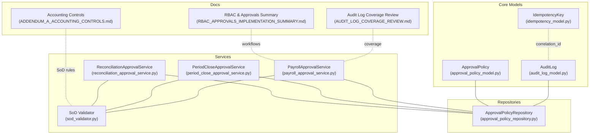
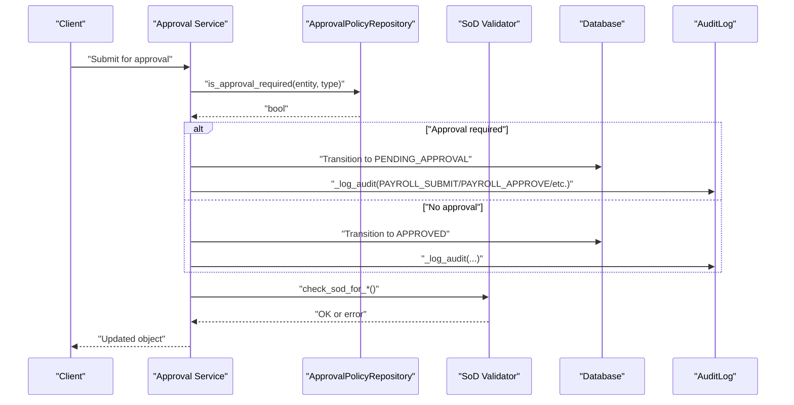
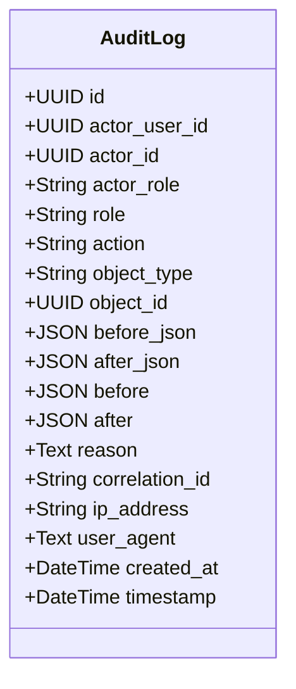
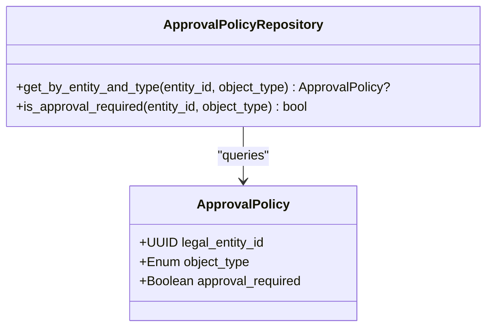
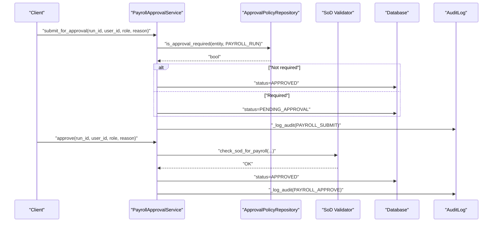
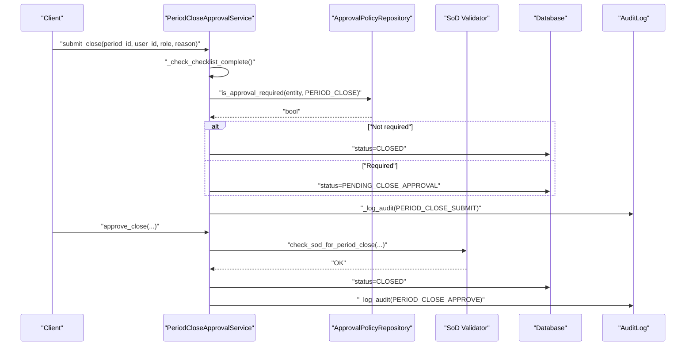
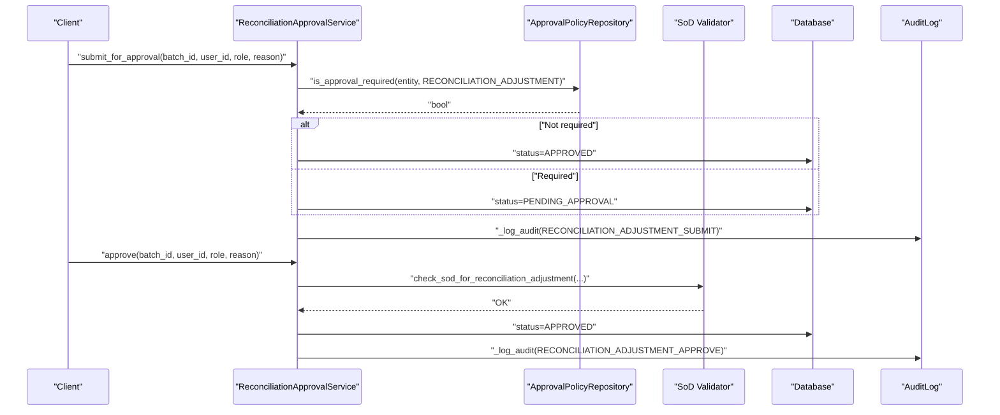
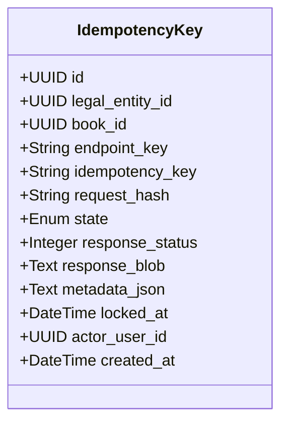
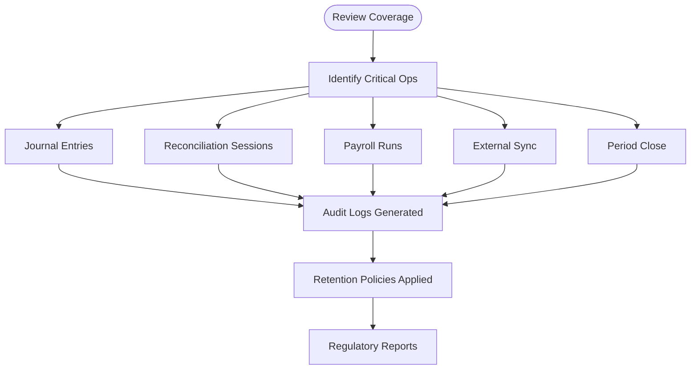
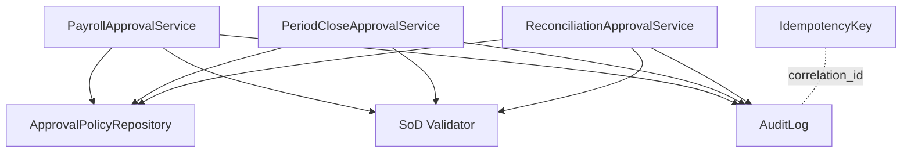

# Audit and Compliance Logging

<cite>
**Referenced Files in This Document**
- [audit_log_model.py](file://app/modules/core/models/audit_log_model.py)
- [approval_policy_model.py](file://app/modules/core/models/approval_policy_model.py)
- [approval_policy_repository.py](file://app/modules/core/repositories/approval_policy_repository.py)
- [sod_validator.py](file://app/modules/core/services/sod_validator.py)
- [payroll_approval_service.py](file://app/modules/payroll/services/payroll_approval_service.py)
- [period_close_approval_service.py](file://app/modules/general_ledger/services/period_close_approval_service.py)
- [reconciliation_approval_service.py](file://app/modules/general_ledger/services/reconciliation_approval_service.py)
- [idempotency_model.py](file://app/modules/core/models/idempotency_model.py)
- [AUDIT_LOG_COVERAGE_REVIEW.md](file://docs/01-main/AUDIT_LOG_COVERAGE_REVIEW.md)
- [ADDENDUM_A_ACCOUNTING_CONTROLS.md](file://docs/01-main/ADDENDUM_A_ACCOUNTING_CONTROLS.md)
- [RBAC_APPROVALS_IMPLEMENTATION_SUMMARY.md](file://docs/01-main/RBAC_APPROVALS_IMPLEMENTATION_SUMMARY.md)
- [logging.py](file://app/core/logging.py)
</cite>

## Table of Contents
1. [Introduction](#introduction)
2. [Project Structure](#project-structure)
3. [Core Components](#core-components)
4. [Architecture Overview](#architecture-overview)
5. [Detailed Component Analysis](#detailed-component-analysis)
6. [Dependency Analysis](#dependency-analysis)
7. [Performance Considerations](#performance-considerations)
8. [Troubleshooting Guide](#troubleshooting-guide)
9. [Conclusion](#conclusion)
10. [Appendices](#appendices)

## Introduction
This document provides comprehensive audit and compliance logging documentation for the TrueVow Financial Management system. It explains the audit log model implementation, compliance monitoring capabilities, and regulatory reporting features. It covers audit trail generation, data integrity tracking, and compliance framework support, including approval policy enforcement, change tracking, and governance workflows. It also documents examples of audit log entries, compliance reporting templates, and regulatory requirement fulfillment.

## Project Structure
The audit and compliance logging capabilities are implemented across several modules:
- Core models define the audit log and approval policy entities.
- Repositories encapsulate policy lookup and enforcement.
- Services orchestrate approval workflows and enforce segregation of duties (SoD).
- Idempotency keys support safe, repeatable writes and cross-cutting audit correlation.
- Documentation artifacts define coverage, controls, and implementation plans.

**Diagram sources**
- [audit_log_model.py](file://app/modules/core/models/audit_log_model.py#L9-L42)
- [approval_policy_model.py](file://app/modules/core/models/approval_policy_model.py#L18-L35)
- [approval_policy_repository.py](file://app/modules/core/repositories/approval_policy_repository.py#L10-L35)
- [payroll_approval_service.py](file://app/modules/payroll/services/payroll_approval_service.py#L26-L253)
- [period_close_approval_service.py](file://app/modules/general_ledger/services/period_close_approval_service.py#L31-L207)
- [reconciliation_approval_service.py](file://app/modules/general_ledger/services/reconciliation_approval_service.py#L30-L254)
- [sod_validator.py](file://app/modules/core/services/sod_validator.py#L1-L78)
- [idempotency_model.py](file://app/modules/core/models/idempotency_model.py#L17-L54)
- [AUDIT_LOG_COVERAGE_REVIEW.md](file://docs/01-main/AUDIT_LOG_COVERAGE_REVIEW.md#L1-L199)
- [ADDENDUM_A_ACCOUNTING_CONTROLS.md](file://docs/01-main/ADDENDUM_A_ACCOUNTING_CONTROLS.md#L1-L73)
- [RBAC_APPROVALS_IMPLEMENTATION_SUMMARY.md](file://docs/01-main/RBAC_APPROVALS_IMPLEMENTATION_SUMMARY.md#L45-L88)

**Section sources**
- [audit_log_model.py](file://app/modules/core/models/audit_log_model.py#L1-L43)
- [approval_policy_model.py](file://app/modules/core/models/approval_policy_model.py#L1-L36)
- [approval_policy_repository.py](file://app/modules/core/repositories/approval_policy_repository.py#L1-L36)
- [payroll_approval_service.py](file://app/modules/payroll/services/payroll_approval_service.py#L1-L253)
- [period_close_approval_service.py](file://app/modules/general_ledger/services/period_close_approval_service.py#L1-L207)
- [reconciliation_approval_service.py](file://app/modules/general_ledger/services/reconciliation_approval_service.py#L1-L254)
- [idempotency_model.py](file://app/modules/core/models/idempotency_model.py#L1-L54)
- [AUDIT_LOG_COVERAGE_REVIEW.md](file://docs/01-main/AUDIT_LOG_COVERAGE_REVIEW.md#L1-L199)
- [ADDENDUM_A_ACCOUNTING_CONTROLS.md](file://docs/01-main/ADDENDUM_A_ACCOUNTING_CONTROLS.md#L1-L73)
- [RBAC_APPROVALS_IMPLEMENTATION_SUMMARY.md](file://docs/01-main/RBAC_APPROVALS_IMPLEMENTATION_SUMMARY.md#L45-L88)

## Core Components
- AuditLog model captures all mutation events with actor, action, object, pre/post state, reason, correlation, IP, agent, and timestamps. It includes indexes optimized for common queries.
- ApprovalPolicy defines per-entity approval requirements for specific object types.
- ApprovalPolicyRepository resolves whether approval is required for a given entity and object type.
- SoD validator stubs define the interface for segregation of duties checks across workflows.
- Services implement approval workflows and log audit events with structured before/after JSON snapshots.
- IdempotencyKey supports idempotent write APIs and correlates requests to audit logs via correlation_id.

**Section sources**
- [audit_log_model.py](file://app/modules/core/models/audit_log_model.py#L9-L42)
- [approval_policy_model.py](file://app/modules/core/models/approval_policy_model.py#L18-L35)
- [approval_policy_repository.py](file://app/modules/core/repositories/approval_policy_repository.py#L10-L35)
- [sod_validator.py](file://app/modules/core/services/sod_validator.py#L1-L78)
- [payroll_approval_service.py](file://app/modules/payroll/services/payroll_approval_service.py#L26-L253)
- [period_close_approval_service.py](file://app/modules/general_ledger/services/period_close_approval_service.py#L31-L207)
- [reconciliation_approval_service.py](file://app/modules/general_ledger/services/reconciliation_approval_service.py#L30-L254)
- [idempotency_model.py](file://app/modules/core/models/idempotency_model.py#L17-L54)

## Architecture Overview
The audit and compliance architecture integrates approval workflows, SoD enforcement, and audit logging across functional domains.

**Diagram sources**
- [payroll_approval_service.py](file://app/modules/payroll/services/payroll_approval_service.py#L34-L96)
- [period_close_approval_service.py](file://app/modules/general_ledger/services/period_close_approval_service.py#L39-L109)
- [reconciliation_approval_service.py](file://app/modules/general_ledger/services/reconciliation_approval_service.py#L38-L99)
- [approval_policy_repository.py](file://app/modules/core/repositories/approval_policy_repository.py#L26-L35)
- [sod_validator.py](file://app/modules/core/services/sod_validator.py#L14-L77)
- [audit_log_model.py](file://app/modules/core/models/audit_log_model.py#L9-L42)

## Detailed Component Analysis

### AuditLog Model
The AuditLog entity captures:
- Actor identity and role
- Action type (e.g., create, update, delete, view, export, post, reverse, PAYROLL_SUBMIT, PAYROLL_APPROVE)
- Object type and identifier
- Pre- and post-change JSON snapshots
- Reason, correlation_id, IP address, user agent, and timestamps
- Indexes for efficient querying by actor+time, object, action+time, and correlation_id

**Diagram sources**
- [audit_log_model.py](file://app/modules/core/models/audit_log_model.py#L9-L42)

**Section sources**
- [audit_log_model.py](file://app/modules/core/models/audit_log_model.py#L9-L42)

### Approval Policy Model and Repository
ApprovalPolicy enables per-legal-entity configuration of approval requirements for specific object types. The repository provides:
- Lookup by entity and object type
- Default-true policy resolution when no explicit policy exists

**Diagram sources**
- [approval_policy_model.py](file://app/modules/core/models/approval_policy_model.py#L18-L35)
- [approval_policy_repository.py](file://app/modules/core/repositories/approval_policy_repository.py#L10-L35)

**Section sources**
- [approval_policy_model.py](file://app/modules/core/models/approval_policy_model.py#L18-L35)
- [approval_policy_repository.py](file://app/modules/core/repositories/approval_policy_repository.py#L10-L35)

### Payroll Approval Workflow and Audit Logging
The PayrollApprovalService enforces:
- State transitions (CALCULATED → PENDING_APPROVAL → APPROVED or REJECTED)
- Optional approval gating via ApprovalPolicyRepository
- SoD validation via SoD validator
- Audit logging with structured before/after JSON snapshots

**Diagram sources**
- [payroll_approval_service.py](file://app/modules/payroll/services/payroll_approval_service.py#L34-L161)
- [approval_policy_repository.py](file://app/modules/core/repositories/approval_policy_repository.py#L26-L35)
- [sod_validator.py](file://app/modules/core/services/sod_validator.py#L66-L77)
- [audit_log_model.py](file://app/modules/core/models/audit_log_model.py#L9-L42)

**Section sources**
- [payroll_approval_service.py](file://app/modules/payroll/services/payroll_approval_service.py#L26-L253)
- [approval_policy_repository.py](file://app/modules/core/repositories/approval_policy_repository.py#L10-L35)
- [sod_validator.py](file://app/modules/core/services/sod_validator.py#L1-L78)

### Period Close Approval Workflow and Audit Logging
The PeriodCloseApprovalService enforces:
- Close checklist completeness
- Approval gating via ApprovalPolicyRepository
- SoD validation for period close actions
- Audit logging with status transitions

**Diagram sources**
- [period_close_approval_service.py](file://app/modules/general_ledger/services/period_close_approval_service.py#L39-L166)
- [approval_policy_repository.py](file://app/modules/core/repositories/approval_policy_repository.py#L26-L35)
- [sod_validator.py](file://app/modules/core/services/sod_validator.py#L14-L24)
- [audit_log_model.py](file://app/modules/core/models/audit_log_model.py#L9-L42)

**Section sources**
- [period_close_approval_service.py](file://app/modules/general_ledger/services/period_close_approval_service.py#L31-L207)
- [approval_policy_repository.py](file://app/modules/core/repositories/approval_policy_repository.py#L10-L35)
- [sod_validator.py](file://app/modules/core/services/sod_validator.py#L1-L78)

### Reconciliation Adjustment Approval Workflow and Audit Logging
The ReconciliationApprovalService enforces:
- Batch status transitions (DRAFT → PENDING_APPROVAL → APPROVED or REJECTED)
- Optional approval gating via ApprovalPolicyRepository
- SoD validation for reconciliation adjustments
- Audit logging with status transitions

**Diagram sources**
- [reconciliation_approval_service.py](file://app/modules/general_ledger/services/reconciliation_approval_service.py#L38-L163)
- [approval_policy_repository.py](file://app/modules/core/repositories/approval_policy_repository.py#L26-L35)
- [sod_validator.py](file://app/modules/core/services/sod_validator.py#L41-L52)
- [audit_log_model.py](file://app/modules/core/models/audit_log_model.py#L9-L42)

**Section sources**
- [reconciliation_approval_service.py](file://app/modules/general_ledger/services/reconciliation_approval_service.py#L30-L254)
- [approval_policy_repository.py](file://app/modules/core/repositories/approval_policy_repository.py#L10-L35)
- [sod_validator.py](file://app/modules/core/services/sod_validator.py#L1-L78)

### Idempotency Keys and Correlation
IdempotencyKey supports idempotent write APIs and correlates requests to audit logs via correlation_id. It stores request hashes, response metadata, and actor_user_id for audit purposes.

**Diagram sources**
- [idempotency_model.py](file://app/modules/core/models/idempotency_model.py#L17-L54)

**Section sources**
- [idempotency_model.py](file://app/modules/core/models/idempotency_model.py#L17-L54)

### Compliance Monitoring and Regulatory Reporting
- Audit log coverage review enumerates critical operations requiring audit logs and retention policies.
- Accounting controls define SoD rules and guardrails for posting and reversals.
- Implementation summary outlines planned approval endpoints and workflows.

**Diagram sources**
- [AUDIT_LOG_COVERAGE_REVIEW.md](file://docs/01-main/AUDIT_LOG_COVERAGE_REVIEW.md#L14-L190)
- [ADDENDUM_A_ACCOUNTING_CONTROLS.md](file://docs/01-main/ADDENDUM_A_ACCOUNTING_CONTROLS.md#L10-L73)
- [RBAC_APPROVALS_IMPLEMENTATION_SUMMARY.md](file://docs/01-main/RBAC_APPROVALS_IMPLEMENTATION_SUMMARY.md#L70-L88)

**Section sources**
- [AUDIT_LOG_COVERAGE_REVIEW.md](file://docs/01-main/AUDIT_LOG_COVERAGE_REVIEW.md#L1-L199)
- [ADDENDUM_A_ACCOUNTING_CONTROLS.md](file://docs/01-main/ADDENDUM_A_ACCOUNTING_CONTROLS.md#L1-L73)
- [RBAC_APPROVALS_IMPLEMENTATION_SUMMARY.md](file://docs/01-main/RBAC_APPROVALS_IMPLEMENTATION_SUMMARY.md#L45-L88)

## Dependency Analysis
The approval workflow services depend on:
- ApprovalPolicyRepository for policy decisions
- SoD validator functions for segregation of duties
- AuditLog model for immutable audit records
- IdempotencyKey for idempotent write APIs and correlation

**Diagram sources**
- [payroll_approval_service.py](file://app/modules/payroll/services/payroll_approval_service.py#L26-L253)
- [period_close_approval_service.py](file://app/modules/general_ledger/services/period_close_approval_service.py#L31-L207)
- [reconciliation_approval_service.py](file://app/modules/general_ledger/services/reconciliation_approval_service.py#L30-L254)
- [approval_policy_repository.py](file://app/modules/core/repositories/approval_policy_repository.py#L10-L35)
- [sod_validator.py](file://app/modules/core/services/sod_validator.py#L1-L78)
- [audit_log_model.py](file://app/modules/core/models/audit_log_model.py#L9-L42)
- [idempotency_model.py](file://app/modules/core/models/idempotency_model.py#L17-L54)

**Section sources**
- [payroll_approval_service.py](file://app/modules/payroll/services/payroll_approval_service.py#L26-L253)
- [period_close_approval_service.py](file://app/modules/general_ledger/services/period_close_approval_service.py#L31-L207)
- [reconciliation_approval_service.py](file://app/modules/general_ledger/services/reconciliation_approval_service.py#L30-L254)
- [approval_policy_repository.py](file://app/modules/core/repositories/approval_policy_repository.py#L10-L35)
- [sod_validator.py](file://app/modules/core/services/sod_validator.py#L1-L78)
- [audit_log_model.py](file://app/modules/core/models/audit_log_model.py#L9-L42)
- [idempotency_model.py](file://app/modules/core/models/idempotency_model.py#L17-L54)

## Performance Considerations
- AuditLog indexes optimize frequent queries by actor+time, object, action+time, and correlation_id.
- JSON fields enable flexible snapshotting while maintaining compatibility across databases.
- IdempotencyKey uniqueness constraints prevent duplicate processing and support safe retries.
- Services perform optimistic locking via row_version to avoid conflicts during approval operations.

[No sources needed since this section provides general guidance]

## Troubleshooting Guide
Common issues and resolutions:
- Approval workflow errors: Validate state transitions and SoD constraints; ensure policy lookup returns expected results.
- Audit log gaps: Confirm services call the internal logging method and that the session is committed after audit insertion.
- Idempotency failures: Verify idempotency_key uniqueness and request hash consistency; check state transitions.
- Logging configuration: Ensure production logging is configured appropriately for audit and compliance visibility.

**Section sources**
- [payroll_approval_service.py](file://app/modules/payroll/services/payroll_approval_service.py#L21-L23)
- [period_close_approval_service.py](file://app/modules/general_ledger/services/period_close_approval_service.py#L26-L28)
- [reconciliation_approval_service.py](file://app/modules/general_ledger/services/reconciliation_approval_service.py#L25-L27)
- [logging.py](file://app/core/logging.py#L1-L34)

## Conclusion
The TrueVow Financial Management system implements robust audit and compliance logging through a dedicated AuditLog model, configurable approval policies, SoD enforcement, and idempotent write support. Approval workflows across payroll, period close, and reconciliation adjust batches are fully audited, enabling compliance with financial controls and regulatory requirements. Documentation artifacts define coverage, controls, and implementation plans to guide ongoing compliance efforts.

[No sources needed since this section summarizes without analyzing specific files]

## Appendices

### Audit Log Entry Examples
Representative audit log entries captured by services:
- Payroll run submission: action indicates submission; object_type identifies payroll_run; before/after JSON capture status transitions; reason recorded for audit trail.
- Payroll run approval: action indicates approval; object_type identifies payroll_run; before/after JSON capture status transitions; reason recorded for audit trail.
- Period close submission: action indicates submission; object_type identifies accounting_period; before/after JSON capture status transitions; reason recorded for audit trail.
- Period close approval: action indicates approval; object_type identifies accounting_period; before/after JSON capture status transitions; reason recorded for audit trail.
- Reconciliation adjustment batch submission: action indicates submission; object_type identifies reconciliation_adjustment_batch; before/after JSON capture status transitions; reason recorded for audit trail.
- Reconciliation adjustment batch approval: action indicates approval; object_type identifies reconciliation_adjustment_batch; before/after JSON capture status transitions; reason recorded for audit trail.

**Section sources**
- [payroll_approval_service.py](file://app/modules/payroll/services/payroll_approval_service.py#L230-L253)
- [period_close_approval_service.py](file://app/modules/general_ledger/services/period_close_approval_service.py#L185-L207)
- [reconciliation_approval_service.py](file://app/modules/general_ledger/services/reconciliation_approval_service.py#L231-L254)

### Compliance Reporting Templates
Templates to fulfill regulatory requirements:
- Transaction audit report: columns include timestamp, actor, role, action, object_type, object_id, reason, correlation_id, IP, user_agent, before/after snapshots.
- Period close checklist report: columns include period_id, checklist_item_code, status, computed_at, computed_by, notes.
- Idempotency report: columns include idempotency_key, endpoint_key, entity_id, book_id, state, response_status, metadata_json, actor_user_id, created_at, locked_at.

**Section sources**
- [AUDIT_LOG_COVERAGE_REVIEW.md](file://docs/01-main/AUDIT_LOG_COVERAGE_REVIEW.md#L181-L190)
- [ADDENDUM_A_ACCOUNTING_CONTROLS.md](file://docs/01-main/ADDENDUM_A_ACCOUNTING_CONTROLS.md#L46-L73)
- [idempotency_model.py](file://app/modules/core/models/idempotency_model.py#L17-L54)

### Regulatory Requirement Fulfillment
- SOX compliance: Financial transactions are auditable with immutable audit logs and structured before/after snapshots.
- GDPR: User data access is logged with actor, IP, and user agent for traceability.
- Industry standards: Audit trails required for financial systems are implemented via AuditLog with indexes and retention policies.

**Section sources**
- [AUDIT_LOG_COVERAGE_REVIEW.md](file://docs/01-main/AUDIT_LOG_COVERAGE_REVIEW.md#L181-L190)
- [ADDENDUM_A_ACCOUNTING_CONTROLS.md](file://docs/01-main/ADDENDUM_A_ACCOUNTING_CONTROLS.md#L10-L21)