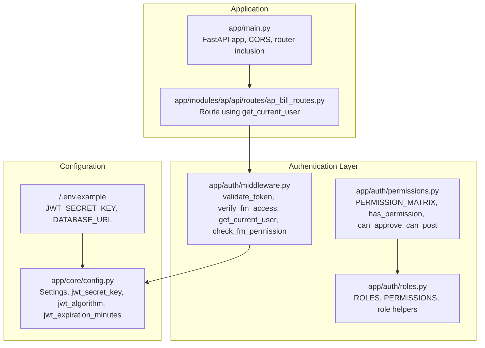
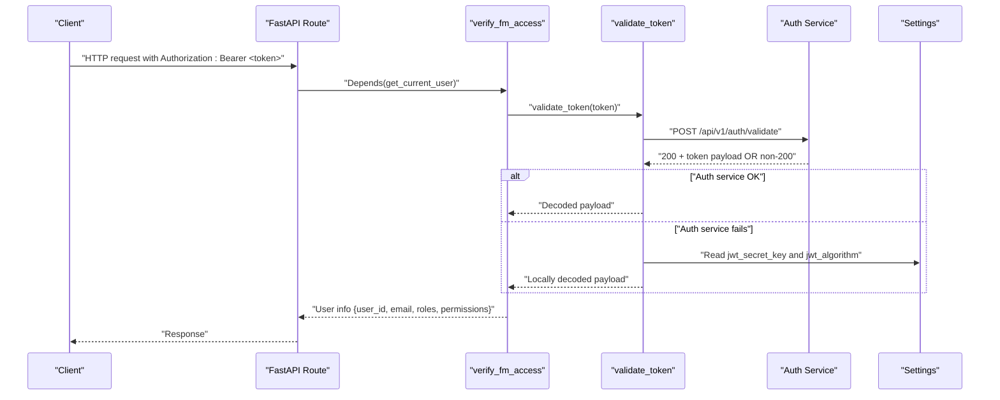
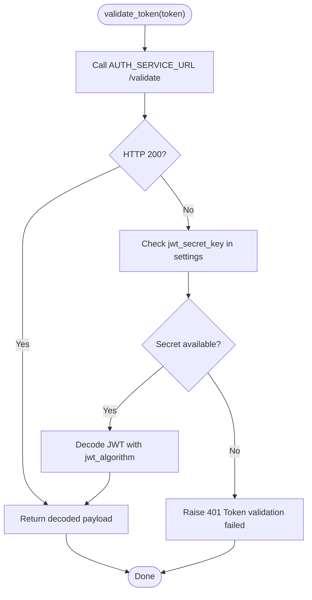
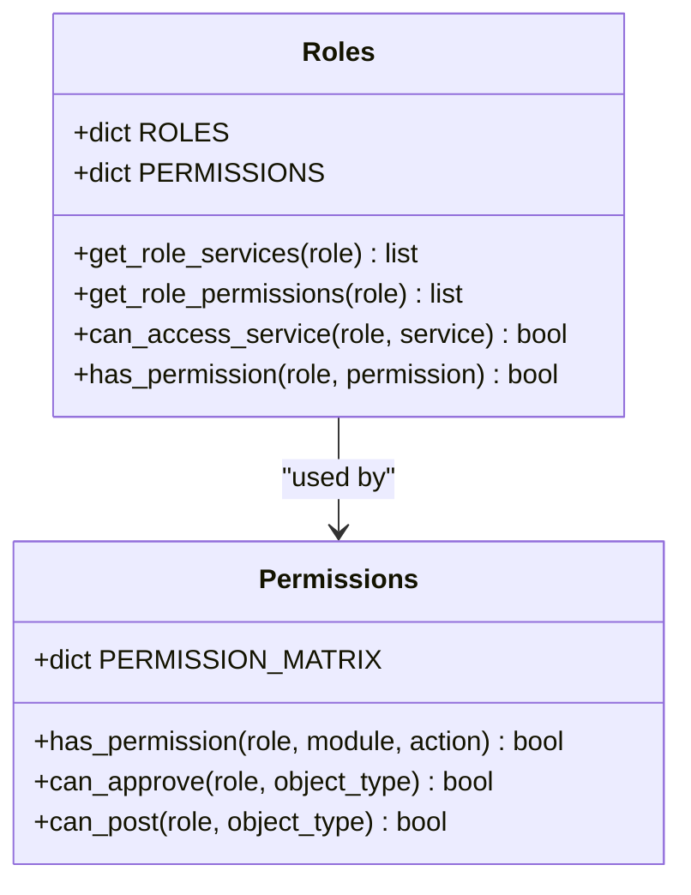
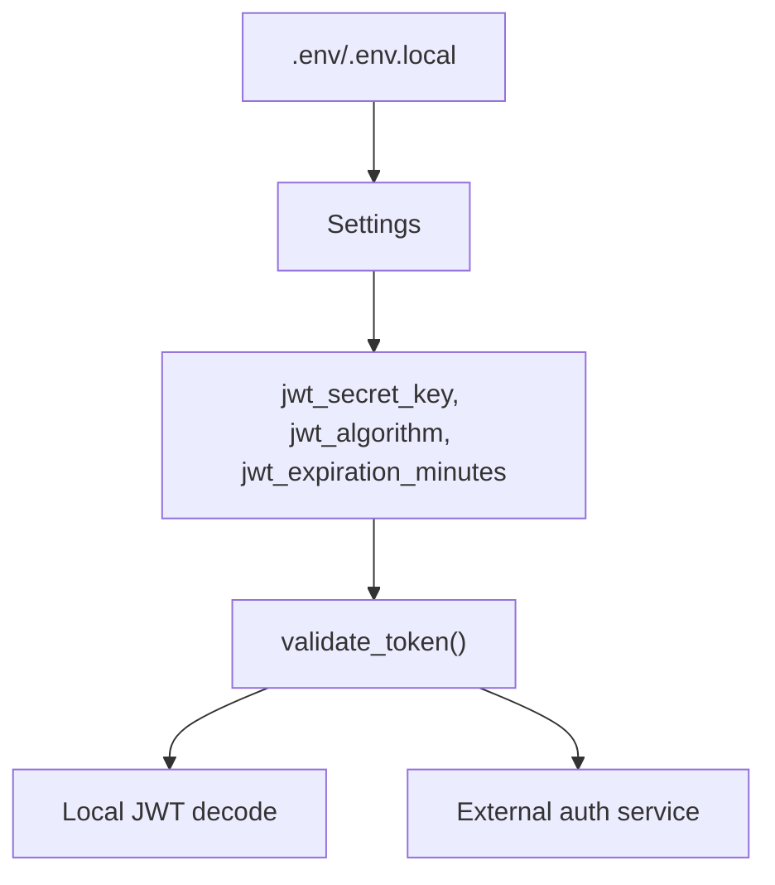
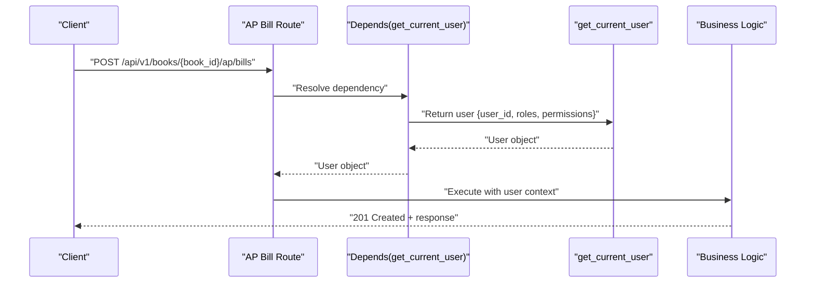
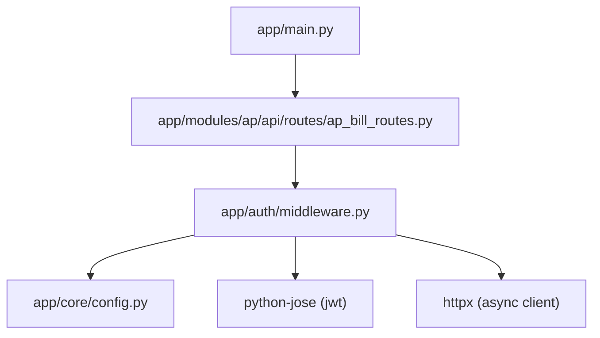

# Authentication System

<cite>
**Referenced Files in This Document**
- [middleware.py](file://app/auth/middleware.py)
- [permissions.py](file://app/auth/permissions.py)
- [roles.py](file://app/auth/roles.py)
- [config.py](file://app/core/config.py)
- [main.py](file://app/main.py)
- [.env.example](file://.env.example)
- [ap_bill_routes.py](file://app/modules/ap/api/routes/ap_bill_routes.py)
</cite>

## Table of Contents
1. [Introduction](#introduction)
2. [Project Structure](#project-structure)
3. [Core Components](#core-components)
4. [Architecture Overview](#architecture-overview)
5. [Detailed Component Analysis](#detailed-component-analysis)
6. [Dependency Analysis](#dependency-analysis)
7. [Performance Considerations](#performance-considerations)
8. [Troubleshooting Guide](#troubleshooting-guide)
9. [Conclusion](#conclusion)

## Introduction
This document describes the authentication system for the TrueVow Financial Management system. It covers JWT token management, user session handling, token validation mechanisms, authentication middleware, and security token storage. It also documents environment variables for authentication configuration, token signing algorithms, and security best practices for token handling. Practical examples of authentication flows, token expiration handling, and secure session management are included.

## Project Structure
The authentication system spans several modules:
- Authentication middleware and user extraction
- Role-based access control (RBAC) and permission matrices
- Application configuration for JWT settings and secrets
- Example API routes that depend on authenticated users

**Diagram sources**
- [middleware.py](file://app/auth/middleware.py#L1-L140)
- [permissions.py](file://app/auth/permissions.py#L1-L127)
- [roles.py](file://app/auth/roles.py#L1-L119)
- [config.py](file://app/core/config.py#L1-L74)
- [.env.example](file://.env.example#L1-L23)
- [main.py](file://app/main.py#L1-L54)
- [ap_bill_routes.py](file://app/modules/ap/api/routes/ap_bill_routes.py#L1-L200)

**Section sources**
- [middleware.py](file://app/auth/middleware.py#L1-L140)
- [permissions.py](file://app/auth/permissions.py#L1-L127)
- [roles.py](file://app/auth/roles.py#L1-L119)
- [config.py](file://app/core/config.py#L1-L74)
- [.env.example](file://.env.example#L1-L23)
- [main.py](file://app/main.py#L1-L54)
- [ap_bill_routes.py](file://app/modules/ap/api/routes/ap_bill_routes.py#L1-L200)

## Core Components
- JWT validation and service access verification
- User identity extraction and permission checks
- RBAC role definitions and permission matrices
- Configuration of JWT signing keys, algorithms, and expiration
- Environment variable management for secrets

Key responsibilities:
- validate_token: Centralized JWT validation via external auth service or local decoding
- verify_fm_access: Ensures the token grants access to the financial management service
- get_current_user: Extracts user identity and permissions for route handlers
- check_fm_permission: Enforces fine-grained permissions per role and action
- Settings: Provides JWT secret, algorithm, and expiration configuration
- Roles and Permissions: Define access matrices and service entitlements

**Section sources**
- [middleware.py](file://app/auth/middleware.py#L17-L106)
- [permissions.py](file://app/auth/permissions.py#L7-L127)
- [roles.py](file://app/auth/roles.py#L6-L119)
- [config.py](file://app/core/config.py#L37-L52)

## Architecture Overview
The authentication flow integrates with FastAPI dependency injection. Routes declare a dependency on get_current_user, which validates the bearer token and extracts user attributes. The system supports two validation modes:
- External auth service validation
- Local JWT decoding using configured secret and algorithm

**Diagram sources**
- [middleware.py](file://app/auth/middleware.py#L17-L86)
- [config.py](file://app/core/config.py#L37-L52)

## Detailed Component Analysis

### Authentication Middleware
The middleware layer provides token validation and user extraction:
- validate_token: Attempts external validation first; falls back to local decoding if a secret is present
- verify_fm_access: Confirms the token includes access to the financial management service
- get_current_user: Returns a normalized user object for route handlers
- check_fm_permission: Enforces role-based and permission-based access checks

**Diagram sources**
- [middleware.py](file://app/auth/middleware.py#L17-L56)
- [config.py](file://app/core/config.py#L37-L52)

**Section sources**
- [middleware.py](file://app/auth/middleware.py#L17-L138)

### Role-Based Access Control (RBAC)
RBAC defines roles and permissions for modules and actions:
- ROLES: Defines service entitlements and permission levels per role
- PERMISSIONS: Numeric levels for permission tiers
- PERMISSION_MATRIX: Action-level permissions per role and module
- Helper functions: Role-to-module permission checks, approval/post capabilities

**Diagram sources**
- [roles.py](file://app/auth/roles.py#L6-L119)
- [permissions.py](file://app/auth/permissions.py#L7-L127)

**Section sources**
- [roles.py](file://app/auth/roles.py#L6-L119)
- [permissions.py](file://app/auth/permissions.py#L7-L127)

### JWT Configuration and Environment Variables
JWT configuration is centralized in settings:
- jwt_secret_key: Required for local JWT decoding; supports fallback to financial_management_secret_key
- jwt_algorithm: Defaults to HS256
- jwt_expiration_minutes: Token lifetime in minutes
- Environment variables: DATABASE_URL, JWT_SECRET_KEY, ENVIRONMENT, LOG_LEVEL, and optional service integration URLs

**Diagram sources**
- [config.py](file://app/core/config.py#L37-L52)
- [.env.example](file://.env.example#L7-L8)

**Section sources**
- [config.py](file://app/core/config.py#L37-L52)
- [.env.example](file://.env.example#L7-L8)

### Practical Authentication Flows and Examples
Example usage in an API route:
- Route declares Depends(get_current_user) to inject authenticated user context
- The middleware validates the token and ensures service access
- Handlers can rely on user_id, email, roles, and permissions for business logic

**Diagram sources**
- [ap_bill_routes.py](file://app/modules/ap/api/routes/ap_bill_routes.py#L31-L76)
- [middleware.py](file://app/auth/middleware.py#L89-L106)

**Section sources**
- [ap_bill_routes.py](file://app/modules/ap/api/routes/ap_bill_routes.py#L31-L76)
- [middleware.py](file://app/auth/middleware.py#L89-L106)

## Dependency Analysis
The authentication system depends on:
- FastAPI for dependency injection and HTTP bearer security
- Pydantic settings for configuration
- Python-JOSE for JWT decoding
- Optional external auth service for centralized validation

**Diagram sources**
- [middleware.py](file://app/auth/middleware.py#L6-L12)
- [config.py](file://app/core/config.py#L1-L74)
- [ap_bill_routes.py](file://app/modules/ap/api/routes/ap_bill_routes.py#L26-L36)
- [main.py](file://app/main.py#L1-L54)

**Section sources**
- [middleware.py](file://app/auth/middleware.py#L6-L12)
- [ap_bill_routes.py](file://app/modules/ap/api/routes/ap_bill_routes.py#L26-L36)
- [config.py](file://app/core/config.py#L1-L74)
- [main.py](file://app/main.py#L1-L54)

## Performance Considerations
- Prefer external auth service validation to centralize policy enforcement and reduce local cryptographic overhead
- Cache validated tokens at the gateway level when appropriate to minimize repeated validation calls
- Keep jwt_expiration_minutes reasonable to balance security and performance
- Ensure httpx timeouts are tuned for your deployment latency targets

## Troubleshooting Guide
Common issues and resolutions:
- 401 Token validation failed: Verify JWT_SECRET_KEY is set and correct; confirm token was issued by the configured issuer
- 403 No access to financial management service: Confirm token payload includes financial_management in services
- 503 Auth service unavailable: Check AUTH_SERVICE_URL reachability and service health
- Invalid token: Validate jwt_algorithm matches the issuer’s signing algorithm

Operational checks:
- Confirm environment variables are loaded from .env or .env.local
- Verify token payload contains user_id, email, roles, permissions, and services
- Review logs for JWT decode errors or auth service failures

**Section sources**
- [middleware.py](file://app/auth/middleware.py#L48-L56)
- [config.py](file://app/core/config.py#L42-L48)

## Conclusion
The TrueVow Financial Management authentication system combines centralized JWT validation with local fallback, robust RBAC enforcement, and clear configuration via environment variables. By leveraging FastAPI’s dependency injection, routes receive authenticated user context seamlessly. Adhering to the documented configuration and best practices ensures secure and maintainable token handling across the platform.