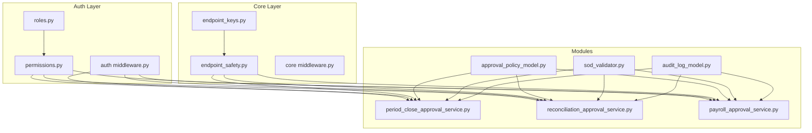
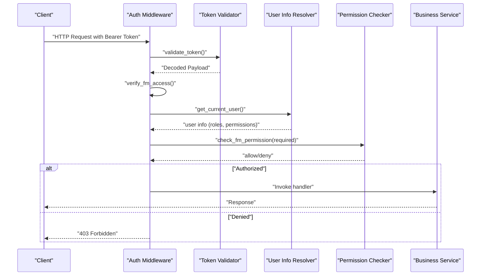
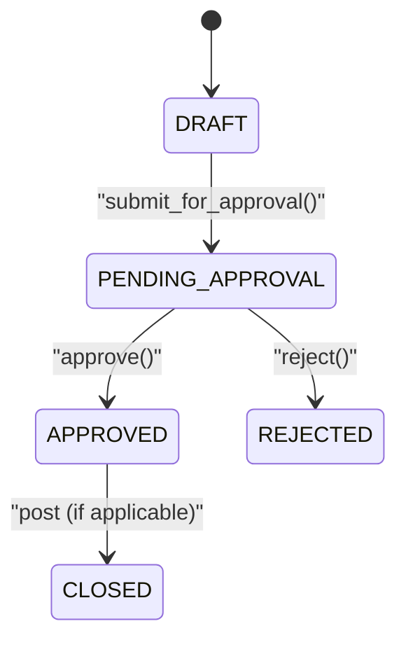
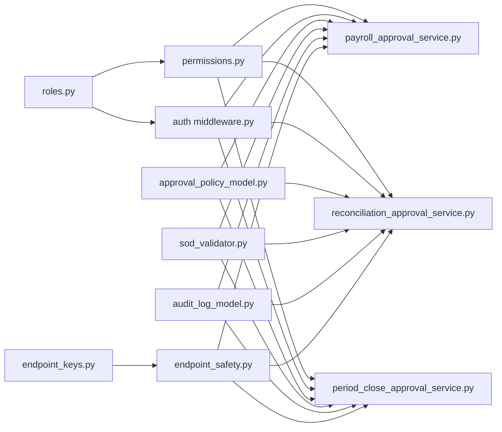

# Authorization System

<cite>
**Referenced Files in This Document**
- [roles.py](file://app/auth/roles.py)
- [permissions.py](file://app/auth/permissions.py)
- [middleware.py](file://app/auth/middleware.py)
- [endpoint_safety.py](file://app/core/endpoint_safety.py)
- [endpoint_keys.py](file://app/core/endpoint_keys.py)
- [approval_policy_model.py](file://app/modules/core/models/approval_policy_model.py)
- [period_close_approval_service.py](file://app/modules/general_ledger/services/period_close_approval_service.py)
- [reconciliation_approval_service.py](file://app/modules/general_ledger/services/reconciliation_approval_service.py)
- [payroll_approval_service.py](file://app/modules/payroll/services/payroll_approval_service.py)
- [sod_validator.py](file://app/modules/core/services/sod_validator.py)
- [audit_log_model.py](file://app/modules/core/models/audit_log_model.py)
- [middleware.py](file://app/core/middleware.py)
- [main.py](file://app/main.py)
</cite>

## Table of Contents
1. [Introduction](#introduction)
2. [Project Structure](#project-structure)
3. [Core Components](#core-components)
4. [Architecture Overview](#architecture-overview)
5. [Detailed Component Analysis](#detailed-component-analysis)
6. [Dependency Analysis](#dependency-analysis)
7. [Performance Considerations](#performance-considerations)
8. [Troubleshooting Guide](#troubleshooting-guide)
9. [Conclusion](#conclusion)

## Introduction
This document describes the authorization system for the Financial Management Service, focusing on Role-Based Access Control (RBAC), permission matrices, service access controls, and approval workflows. It covers all defined roles, permission levels, legacy role mappings, and provides practical examples of role assignments, permission checks, and authorization middleware usage. Administrative overrides and selective approvals are documented alongside approval workflows for payroll, treasury reconciliation adjustments, period close, and royalties.

## Project Structure
The authorization system spans several modules:
- Authentication and authorization definitions reside under app/auth
- Core authorization utilities and middleware live under app/core
- Approval workflows and policies are implemented under app/modules/* services and models
- Audit logging and endpoint safety utilities support enforcement

**Diagram sources**
- [roles.py](file://app/auth/roles.py#L1-L119)
- [permissions.py](file://app/auth/permissions.py#L1-L127)
- [middleware.py](file://app/auth/middleware.py#L1-L140)
- [endpoint_safety.py](file://app/core/endpoint_safety.py#L1-L118)
- [endpoint_keys.py](file://app/core/endpoint_keys.py#L1-L43)
- [approval_policy_model.py](file://app/modules/core/models/approval_policy_model.py#L1-L36)
- [period_close_approval_service.py](file://app/modules/general_ledger/services/period_close_approval_service.py#L1-L207)
- [reconciliation_approval_service.py](file://app/modules/general_ledger/services/reconciliation_approval_service.py#L1-L254)
- [payroll_approval_service.py](file://app/modules/payroll/services/payroll_approval_service.py#L1-L253)
- [sod_validator.py](file://app/modules/core/services/sod_validator.py#L1-L78)
- [audit_log_model.py](file://app/modules/core/models/audit_log_model.py#L1-L43)

**Section sources**
- [roles.py](file://app/auth/roles.py#L1-L119)
- [permissions.py](file://app/auth/permissions.py#L1-L127)
- [middleware.py](file://app/auth/middleware.py#L1-L140)
- [endpoint_safety.py](file://app/core/endpoint_safety.py#L1-L118)
- [endpoint_keys.py](file://app/core/endpoint_keys.py#L1-L43)
- [approval_policy_model.py](file://app/modules/core/models/approval_policy_model.py#L1-L36)
- [period_close_approval_service.py](file://app/modules/general_ledger/services/period_close_approval_service.py#L1-L207)
- [reconciliation_approval_service.py](file://app/modules/general_ledger/services/reconciliation_approval_service.py#L1-L254)
- [payroll_approval_service.py](file://app/modules/payroll/services/payroll_approval_service.py#L1-L253)
- [sod_validator.py](file://app/modules/core/services/sod_validator.py#L1-L78)
- [audit_log_model.py](file://app/modules/core/models/audit_log_model.py#L1-L43)
- [middleware.py](file://app/core/middleware.py#L1-L35)
- [main.py](file://app/main.py#L1-L54)

## Core Components
- Roles and Permissions: Central definitions of roles, services, and permission levels, plus helpers to query role services, permissions, and access checks.
- Permission Matrix: Action-level permissions per role and module, enabling fine-grained control over operations.
- Authorization Middleware: Validates tokens, enforces service access, and performs permission checks against user roles and permissions.
- Approval Policies and Workflows: Configurable approval requirements per legal entity and object type, with state machines for submission, approval, rejection, and optional administrative overrides.
- Segregation of Duties (SoD): Validation hooks integrated into workflows to prevent conflicts of interest.
- Audit Logging: Comprehensive audit trail for all critical actions and state transitions.
- Endpoint Safety: Idempotency and retry policies for safe operations, with TTL calculations for pending locks.

**Section sources**
- [roles.py](file://app/auth/roles.py#L6-L119)
- [permissions.py](file://app/auth/permissions.py#L7-L127)
- [middleware.py](file://app/auth/middleware.py#L17-L140)
- [approval_policy_model.py](file://app/modules/core/models/approval_policy_model.py#L9-L36)
- [sod_validator.py](file://app/modules/core/services/sod_validator.py#L14-L77)
- [audit_log_model.py](file://app/modules/core/models/audit_log_model.py#L9-L43)
- [endpoint_safety.py](file://app/core/endpoint_safety.py#L21-L118)

## Architecture Overview
The authorization system integrates authentication, service access control, and permission enforcement with approval workflows and audit logging.

**Diagram sources**
- [middleware.py](file://app/auth/middleware.py#L17-L140)

**Section sources**
- [middleware.py](file://app/auth/middleware.py#L17-L140)

## Detailed Component Analysis

### Roles and Permission Levels
- Roles: FINANCE_ADMIN, ACCOUNTANT, PAYROLL_PREPARER, PAYROLL_APPROVER, TREASURY_CLERK, TREASURY_APPROVER, VIEWER, SERVICE.
- Legacy role mappings: finance_head → FINANCE_ADMIN, regional_finance_manager → ACCOUNTANT, accountant → ACCOUNTANT, admin → billing-only, billing_team → billing-only, customer_success_manager → billing-only.
- Permission levels: read (1), write (2), admin (3). Admin grants full access; higher level implies lower level capabilities.

Practical examples:
- Assigning roles: A user receives roles in the token payload; the system resolves legacy roles to canonical ones during permission checks.
- Permission checks: Use has_permission(role, module, action) to enforce action-level controls; can_access_service(role, service) validates service entitlement.

**Section sources**
- [roles.py](file://app/auth/roles.py#L7-L79)
- [roles.py](file://app/auth/roles.py#L82-L119)
- [permissions.py](file://app/auth/permissions.py#L84-L103)

### Permission Matrix and Module Actions
The permission matrix defines what each role can do per module:
- general_ledger: read, write, post, reverse, close_period, lock_period, post_soft_closed
- ap: read, write, post, reverse, override
- ar: read, write, post, reverse, override
- payroll: read, write, create_run, calculate, submit_approval, approve, reject, post, reverse, override
- treasury: read, write, import, reconcile, create_adjustments, submit_approval, approve_adjustments, reject_adjustments, post_adjustments, close_reconciliation, override
- period_close: read, request_close, approve_close, lock
- royalties: read, write, generate, approve, post, override

Examples:
- PAYROLL_PREPARER can create and calculate runs and submit for approval but cannot approve or post.
- PAYROLL_APPROVER can approve, reject, and post payroll runs.
- TREASURY_CLERK can import and reconcile; submit adjustments; cannot create adjustments.
- TREASURY_APPROVER can approve and post adjustments and close reconciliations.
- VIEWER has read-only access across modules.
- SERVICE can read/write in specific modules and cannot post manual entries.

**Section sources**
- [permissions.py](file://app/auth/permissions.py#L8-L81)

### Service Access Controls and Middleware
- Token validation: Centralized validation against an auth service, with local fallback if secret is available.
- Service access: verify_fm_access ensures the token includes financial_management service access.
- User extraction: get_current_user builds a user profile with user_id, email, roles, and permissions scoped to financial_management.
- Permission enforcement: check_fm_permission verifies whether a user’s roles or explicit permissions grant the required level (read, write, admin).

Usage pattern:
- Apply verify_fm_access at route level to gate service access.
- Use check_fm_permission for endpoint-level permission checks.

**Section sources**
- [middleware.py](file://app/auth/middleware.py#L17-L140)

### Approval Workflows and Selective Approvals
Selective approvals are configured via ApprovalPolicy per legal entity and object type. Workflows:
- Payroll: submit_for_approval → PENDING_APPROVAL → APPROVED (skip approval if not required)
- Reconciliation Adjustment Batch: submit_for_approval → PENDING_APPROVAL → APPROVED (skip approval if not required)
- Period Close: submit_close → PENDING_CLOSE_APPROVAL → CLOSED (skip approval if not required)

Administrative overrides:
- Approve/reject methods accept override_reason to document deviations.
- FINANCE_ADMIN bypasses most restrictions and can override approvals.

**Diagram sources**
- [reconciliation_approval_service.py](file://app/modules/general_ledger/services/reconciliation_approval_service.py#L38-L100)
- [payroll_approval_service.py](file://app/modules/payroll/services/payroll_approval_service.py#L34-L97)

**Section sources**
- [approval_policy_model.py](file://app/modules/core/models/approval_policy_model.py#L9-L36)
- [payroll_approval_service.py](file://app/modules/payroll/services/payroll_approval_service.py#L34-L229)
- [reconciliation_approval_service.py](file://app/modules/general_ledger/services/reconciliation_approval_service.py#L38-L229)
- [period_close_approval_service.py](file://app/modules/general_ledger/services/period_close_approval_service.py#L39-L166)

### Segregation of Duties (SoD) Integration
SoD validators are invoked during approval/rejection to prevent conflicts:
- Period Close: check_sod_for_period_close
- Payroll Run: check_sod_for_payroll
- Reconciliation Adjustment: check_sod_for_reconciliation_adjustment
- AP Bill: check_sod_for_ap_bill
- Royalty Run: check_sod_for_royalty_run

These are currently stubs and raise SoDValidationError if violations are detected when implemented.

**Section sources**
- [sod_validator.py](file://app/modules/core/services/sod_validator.py#L14-L77)

### Audit Logging
All critical actions and state transitions are logged:
- Fields include actor_user_id, actor_role, action, object_type, object_id, before_json, after_json, reason, correlation_id, timestamps, and metadata.

This supports compliance and operational oversight.

**Section sources**
- [audit_log_model.py](file://app/modules/core/models/audit_log_model.py#L9-L43)

### Endpoint Safety and Idempotency
- SAFE_TO_RETRY_FAILED: Endpoints marked safe can be retried without risk of duplicate side effects due to business-level uniqueness (source_key, external_id, sync_batch_id, etc.).
- ENDPOINT_TTL_SECONDS: TTLs are set to 2–3x expected handler runtime to accommodate slow systems.
- Endpoint keys: Consistent identifiers for idempotent endpoints ensure stable identification.

**Section sources**
- [endpoint_safety.py](file://app/core/endpoint_safety.py#L21-L118)
- [endpoint_keys.py](file://app/core/endpoint_keys.py#L6-L43)

## Dependency Analysis
The authorization system exhibits clear separation of concerns:
- roles.py and permissions.py define the policy surface
- middleware.py enforces policy at the API boundary
- approval services integrate policy with SoD and audit logging
- endpoint_safety.py and endpoint_keys.py support idempotency and retry policies

**Diagram sources**
- [roles.py](file://app/auth/roles.py#L1-L119)
- [permissions.py](file://app/auth/permissions.py#L1-L127)
- [middleware.py](file://app/auth/middleware.py#L1-L140)
- [approval_policy_model.py](file://app/modules/core/models/approval_policy_model.py#L1-L36)
- [payroll_approval_service.py](file://app/modules/payroll/services/payroll_approval_service.py#L1-L253)
- [reconciliation_approval_service.py](file://app/modules/general_ledger/services/reconciliation_approval_service.py#L1-L254)
- [period_close_approval_service.py](file://app/modules/general_ledger/services/period_close_approval_service.py#L1-L207)
- [sod_validator.py](file://app/modules/core/services/sod_validator.py#L1-L78)
- [audit_log_model.py](file://app/modules/core/models/audit_log_model.py#L1-L43)
- [endpoint_safety.py](file://app/core/endpoint_safety.py#L1-L118)
- [endpoint_keys.py](file://app/core/endpoint_keys.py#L1-L43)

**Section sources**
- [roles.py](file://app/auth/roles.py#L1-L119)
- [permissions.py](file://app/auth/permissions.py#L1-L127)
- [middleware.py](file://app/auth/middleware.py#L1-L140)
- [approval_policy_model.py](file://app/modules/core/models/approval_policy_model.py#L1-L36)
- [payroll_approval_service.py](file://app/modules/payroll/services/payroll_approval_service.py#L1-L253)
- [reconciliation_approval_service.py](file://app/modules/general_ledger/services/reconciliation_approval_service.py#L1-L254)
- [period_close_approval_service.py](file://app/modules/general_ledger/services/period_close_approval_service.py#L1-L207)
- [sod_validator.py](file://app/modules/core/services/sod_validator.py#L1-L78)
- [audit_log_model.py](file://app/modules/core/models/audit_log_model.py#L1-L43)
- [endpoint_safety.py](file://app/core/endpoint_safety.py#L1-L118)
- [endpoint_keys.py](file://app/core/endpoint_keys.py#L1-L43)

## Performance Considerations
- Token validation: Prefer centralized auth service for scalability; local decoding is supported as fallback.
- Idempotency: Use endpoint keys and source_key patterns to avoid duplicate processing and reduce retries.
- TTLs: Set endpoint-specific TTLs to balance responsiveness and reliability for long-running operations.
- Middleware order: Correlation ID middleware should be first to track all requests consistently.

[No sources needed since this section provides general guidance]

## Troubleshooting Guide
Common issues and resolutions:
- 401 Unauthorized: Token validation failed or auth service unavailable. Check token validity and network connectivity to the auth service.
- 403 Forbidden: User lacks financial_management service access or insufficient permissions. Verify roles and permissions in the token payload.
- Permission Denied: Ensure the role has the required action in the permission matrix for the target module.
- Approval Workflow Errors: Validate that the object is in the expected state and that SoD checks would pass with the current user role.
- Audit Trail Gaps: Confirm audit logs are written on state transitions and that the database connection is healthy.

**Section sources**
- [middleware.py](file://app/auth/middleware.py#L17-L140)
- [permissions.py](file://app/auth/permissions.py#L84-L127)
- [payroll_approval_service.py](file://app/modules/payroll/services/payroll_approval_service.py#L21-L229)
- [reconciliation_approval_service.py](file://app/modules/general_ledger/services/reconciliation_approval_service.py#L25-L229)
- [period_close_approval_service.py](file://app/modules/general_ledger/services/period_close_approval_service.py#L26-L166)
- [audit_log_model.py](file://app/modules/core/models/audit_log_model.py#L9-L43)

## Conclusion
The authorization system combines RBAC with a detailed permission matrix, service access controls, and robust approval workflows. It supports selective approvals, administrative overrides, segregation of duties, and comprehensive audit logging. By leveraging endpoint safety utilities and consistent middleware, the system maintains reliability and compliance while enabling flexible financial operations across modules.