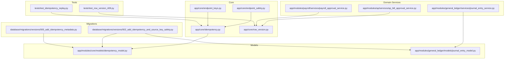
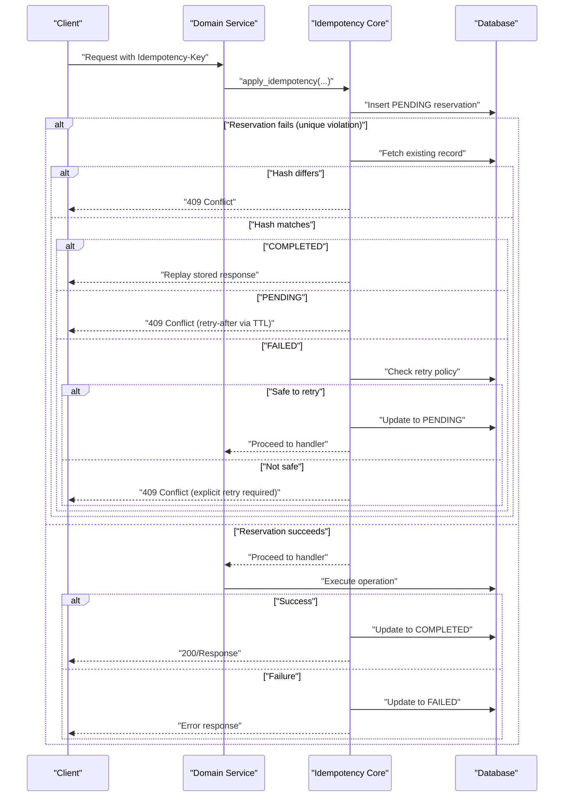
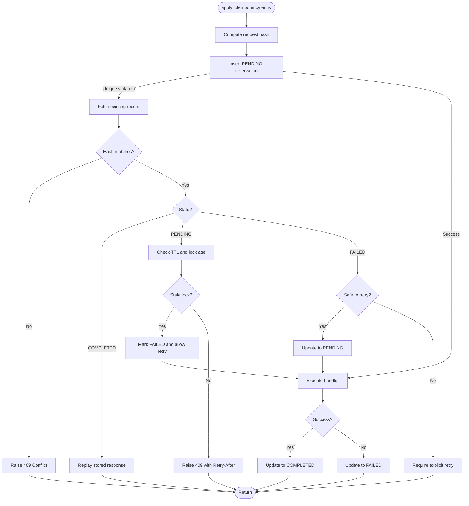
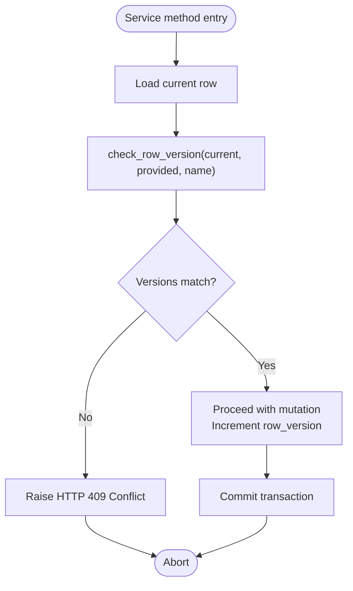
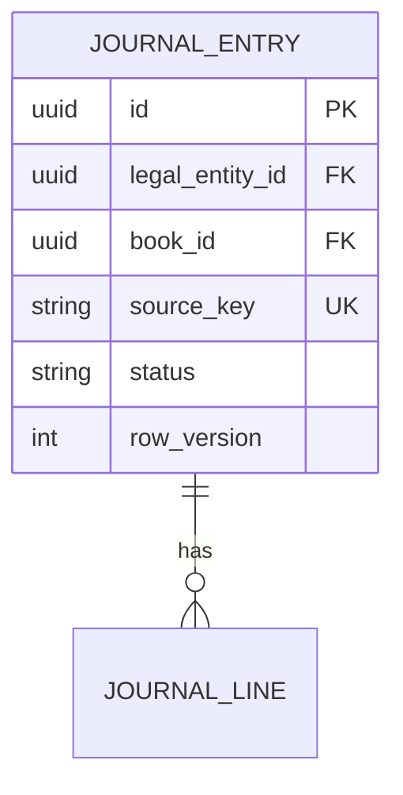
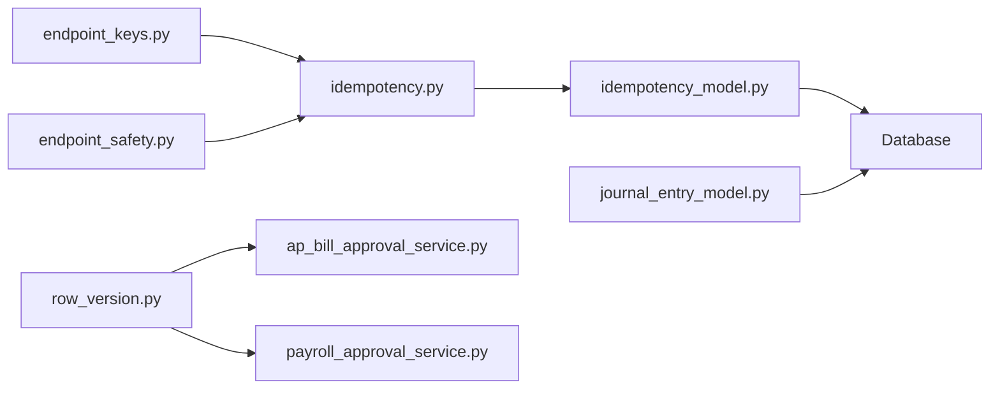

# Data Integrity and Protection

<cite>
**Referenced Files in This Document**
- [app/core/idempotency.py](file://app/core/idempotency.py)
- [app/core/row_version.py](file://app/core/row_version.py)
- [app/modules/core/models/idempotency_model.py](file://app/modules/core/models/idempotency_model.py)
- [app/core/endpoint_safety.py](file://app/core/endpoint_safety.py)
- [app/core/endpoint_keys.py](file://app/core/endpoint_keys.py)
- [database/migrations/versions/002_add_idempotency_and_source_key_safety.py](file://database/migrations/versions/002_add_idempotency_and_source_key_safety.py)
- [database/migrations/versions/005_add_idempotency_metadata.py](file://database/migrations/versions/005_add_idempotency_metadata.py)
- [app/modules/general_ledger/services/journal_entry_service.py](file://app/modules/general_ledger/services/journal_entry_service.py)
- [app/modules/general_ledger/models/journal_entry_model.py](file://app/modules/general_ledger/models/journal_entry_model.py)
- [app/modules/ap/services/ap_bill_approval_service.py](file://app/modules/ap/services/ap_bill_approval_service.py)
- [app/modules/payroll/services/payroll_approval_service.py](file://app/modules/payroll/services/payroll_approval_service.py)
- [tests/test_idempotency_replay.py](file://tests/test_idempotency_replay.py)
- [tests/test_row_version_409.py](file://tests/test_row_version_409.py)
- [docs/01-main/ROW_VERSION_RAW_GREP_OUTPUTS.md](file://docs/01-main/ROW_VERSION_RAW_GREP_OUTPUTS.md)
- [docs/01-main/SOURCE_KEY_STANDARDIZATION.md](file://docs/01-main/SOURCE_KEY_STANDARDIZATION.md)
</cite>

## Table of Contents
1. [Introduction](#introduction)
2. [Project Structure](#project-structure)
3. [Core Components](#core-components)
4. [Architecture Overview](#architecture-overview)
5. [Detailed Component Analysis](#detailed-component-analysis)
6. [Dependency Analysis](#dependency-analysis)
7. [Performance Considerations](#performance-considerations)
8. [Troubleshooting Guide](#troubleshooting-guide)
9. [Conclusion](#conclusion)

## Introduction
This document explains the data integrity and protection mechanisms implemented in the system, focusing on idempotency patterns, row version implementation, and optimistic locking. It covers:
- Idempotency service implementation for safe API reprocessing, request deduplication strategies, and conflict resolution
- Row version implementation for concurrent access control, 409 conflict handling, and data consistency guarantees
- Practical examples of idempotent operations, optimistic locking scenarios, and error handling patterns
- Performance considerations, edge case handling, and best practices for maintaining data integrity

## Project Structure
The data integrity features span backend core modules, domain services, persistence models, and database migrations:
- Core idempotency infrastructure and row version helpers
- Endpoint safety configuration for retry policies and TTLs
- Domain services enforcing optimistic locking via row_version
- Database migrations establishing idempotency scoping and source_key uniqueness
- Tests validating idempotency replay and 409 conflicts

**Diagram sources**
- [app/core/idempotency.py](file://app/core/idempotency.py#L1-L482)
- [app/core/row_version.py](file://app/core/row_version.py#L1-L31)
- [app/core/endpoint_safety.py](file://app/core/endpoint_safety.py#L1-L118)
- [app/core/endpoint_keys.py](file://app/core/endpoint_keys.py#L1-L42)
- [app/modules/general_ledger/services/journal_entry_service.py](file://app/modules/general_ledger/services/journal_entry_service.py#L1-L200)
- [app/modules/ap/services/ap_bill_approval_service.py](file://app/modules/ap/services/ap_bill_approval_service.py#L1-L200)
- [app/modules/payroll/services/payroll_approval_service.py](file://app/modules/payroll/services/payroll_approval_service.py#L1-L200)
- [app/modules/core/models/idempotency_model.py](file://app/modules/core/models/idempotency_model.py#L1-L54)
- [app/modules/general_ledger/models/journal_entry_model.py](file://app/modules/general_ledger/models/journal_entry_model.py#L1-L128)
- [database/migrations/versions/002_add_idempotency_and_source_key_safety.py](file://database/migrations/versions/002_add_idempotency_and_source_key_safety.py#L1-L279)
- [database/migrations/versions/005_add_idempotency_metadata.py](file://database/migrations/versions/005_add_idempotency_metadata.py#L1-L33)
- [tests/test_idempotency_replay.py](file://tests/test_idempotency_replay.py#L1-L378)
- [tests/test_row_version_409.py](file://tests/test_row_version_409.py#L1-L104)

**Section sources**
- [app/core/idempotency.py](file://app/core/idempotency.py#L1-L482)
- [app/core/row_version.py](file://app/core/row_version.py#L1-L31)
- [app/core/endpoint_safety.py](file://app/core/endpoint_safety.py#L1-L118)
- [app/core/endpoint_keys.py](file://app/core/endpoint_keys.py#L1-L42)
- [app/modules/general_ledger/services/journal_entry_service.py](file://app/modules/general_ledger/services/journal_entry_service.py#L1-L200)
- [app/modules/ap/services/ap_bill_approval_service.py](file://app/modules/ap/services/ap_bill_approval_service.py#L1-L200)
- [app/modules/payroll/services/payroll_approval_service.py](file://app/modules/payroll/services/payroll_approval_service.py#L1-L200)
- [app/modules/core/models/idempotency_model.py](file://app/modules/core/models/idempotency_model.py#L1-L54)
- [app/modules/general_ledger/models/journal_entry_model.py](file://app/modules/general_ledger/models/journal_entry_model.py#L1-L128)
- [database/migrations/versions/002_add_idempotency_and_source_key_safety.py](file://database/migrations/versions/002_add_idempotency_and_source_key_safety.py#L1-L279)
- [database/migrations/versions/005_add_idempotency_metadata.py](file://database/migrations/versions/005_add_idempotency_metadata.py#L1-L33)
- [tests/test_idempotency_replay.py](file://tests/test_idempotency_replay.py#L1-L378)
- [tests/test_row_version_409.py](file://tests/test_row_version_409.py#L1-L104)

## Core Components
- Idempotency infrastructure: Canonical serialization, stable hashing, endpoint normalization, and stateful reservation with PENDING/COMPLETED/FAILED states and TTL-based lock management.
- Row version helper: Centralized 409 conflict detection for optimistic locking across services.
- Endpoint safety: Per-endpoint retry policy and TTL configuration for idempotency locks.
- Source key uniqueness: Deterministic posting keys to prevent duplicate writes at the database level.
- Tests: Replay validation and 409 conflict verification.

**Section sources**
- [app/core/idempotency.py](file://app/core/idempotency.py#L23-L96)
- [app/core/row_version.py](file://app/core/row_version.py#L8-L31)
- [app/core/endpoint_safety.py](file://app/core/endpoint_safety.py#L68-L118)
- [database/migrations/versions/002_add_idempotency_and_source_key_safety.py](file://database/migrations/versions/002_add_idempotency_and_source_key_safety.py#L72-L83)
- [tests/test_idempotency_replay.py](file://tests/test_idempotency_replay.py#L18-L145)
- [tests/test_row_version_409.py](file://tests/test_row_version_409.py#L14-L104)

## Architecture Overview
The system enforces data integrity through layered protections:
- Idempotency: Prevents duplicate writes by reserving a key with a PENDING state and storing exact responses for replay.
- Row version: Ensures concurrent updates detect conflicts and abort with 409.
- Source key: Provides database-level uniqueness for immutable operations.
- Endpoint safety: Controls retry behavior and lock lifetimes to avoid stale locks.

**Diagram sources**
- [app/core/idempotency.py](file://app/core/idempotency.py#L219-L482)
- [app/core/endpoint_safety.py](file://app/core/endpoint_safety.py#L68-L118)
- [app/modules/core/models/idempotency_model.py](file://app/modules/core/models/idempotency_model.py#L10-L50)

## Detailed Component Analysis

### Idempotency Service Implementation
The idempotency service centralizes safe request replay:
- Canonical JSON encoding ensures stable hashing across heterogeneous inputs.
- Stable endpoint keys normalize paths and IDs to constants for reliable matching.
- Reservation with PENDING state prevents races; TTL-based lock expiry allows reclaiming stale locks.
- Response storage captures exact status and body for replay; truncation protects against oversized blobs.

**Diagram sources**
- [app/core/idempotency.py](file://app/core/idempotency.py#L219-L482)
- [app/core/endpoint_safety.py](file://app/core/endpoint_safety.py#L105-L118)
- [app/modules/core/models/idempotency_model.py](file://app/modules/core/models/idempotency_model.py#L10-L50)

**Section sources**
- [app/core/idempotency.py](file://app/core/idempotency.py#L23-L96)
- [app/core/idempotency.py](file://app/core/idempotency.py#L219-L482)
- [app/core/endpoint_safety.py](file://app/core/endpoint_safety.py#L68-L118)
- [app/modules/core/models/idempotency_model.py](file://app/modules/core/models/idempotency_model.py#L10-L50)
- [database/migrations/versions/002_add_idempotency_and_source_key_safety.py](file://database/migrations/versions/002_add_idempotency_and_source_key_safety.py#L88-L198)
- [database/migrations/versions/005_add_idempotency_metadata.py](file://database/migrations/versions/005_add_idempotency_metadata.py#L21-L33)
- [tests/test_idempotency_replay.py](file://tests/test_idempotency_replay.py#L18-L145)

### Row Version and Optimistic Locking
Row version is enforced via a centralized helper that raises 409 when the provided version does not match the current database version. Services integrate this check at the start of mutating operations to ensure consistency under concurrency.

**Diagram sources**
- [app/core/row_version.py](file://app/core/row_version.py#L8-L31)
- [app/modules/ap/services/ap_bill_approval_service.py](file://app/modules/ap/services/ap_bill_approval_service.py#L50-L53)
- [app/modules/payroll/services/payroll_approval_service.py](file://app/modules/payroll/services/payroll_approval_service.py#L50-L53)

**Section sources**
- [app/core/row_version.py](file://app/core/row_version.py#L8-L31)
- [app/modules/ap/services/ap_bill_approval_service.py](file://app/modules/ap/services/ap_bill_approval_service.py#L40-L94)
- [app/modules/payroll/services/payroll_approval_service.py](file://app/modules/payroll/services/payroll_approval_service.py#L40-L96)
- [tests/test_row_version_409.py](file://tests/test_row_version_409.py#L14-L104)
- [docs/01-main/ROW_VERSION_RAW_GREP_OUTPUTS.md](file://docs/01-main/ROW_VERSION_RAW_GREP_OUTPUTS.md#L1-L81)

### Source Key Uniqueness for Immutable Operations
Source keys provide deterministic, immutable posting keys to prevent duplicate postings. The system standardizes formats across endpoints and enforces uniqueness at the database level.

**Diagram sources**
- [app/modules/general_ledger/models/journal_entry_model.py](file://app/modules/general_ledger/models/journal_entry_model.py#L31-L54)
- [database/migrations/versions/002_add_idempotency_and_source_key_safety.py](file://database/migrations/versions/002_add_idempotency_and_source_key_safety.py#L72-L78)
- [docs/01-main/SOURCE_KEY_STANDARDIZATION.md](file://docs/01-main/SOURCE_KEY_STANDARDIZATION.md#L23-L41)

**Section sources**
- [app/modules/general_ledger/models/journal_entry_model.py](file://app/modules/general_ledger/models/journal_entry_model.py#L31-L54)
- [database/migrations/versions/002_add_idempotency_and_source_key_safety.py](file://database/migrations/versions/002_add_idempotency_and_source_key_safety.py#L28-L83)
- [docs/01-main/SOURCE_KEY_STANDARDIZATION.md](file://docs/01-main/SOURCE_KEY_STANDARDIZATION.md#L1-L143)

### Practical Examples and Error Handling Patterns
- Idempotent journal entry posting: Same key and body replay returns identical status and response; different body yields 409.
- Row version conflict: Concurrent update increments row_version; attempting to mutate with stale version triggers 409.
- Safe retries: Endpoints marked safe to retry FAILED requests allow automatic takeover after TTL expiry or explicit retry header.

**Section sources**
- [tests/test_idempotency_replay.py](file://tests/test_idempotency_replay.py#L18-L145)
- [tests/test_row_version_409.py](file://tests/test_row_version_409.py#L14-L104)
- [app/core/endpoint_safety.py](file://app/core/endpoint_safety.py#L68-L118)

## Dependency Analysis
The idempotency and row version mechanisms depend on:
- Endpoint constants to ensure stable identification
- Endpoint safety configuration for TTL and retry policies
- Persistence models for state and metadata
- Database migrations for scoping and uniqueness constraints

**Diagram sources**
- [app/core/endpoint_keys.py](file://app/core/endpoint_keys.py#L1-L42)
- [app/core/idempotency.py](file://app/core/idempotency.py#L1-L482)
- [app/core/endpoint_safety.py](file://app/core/endpoint_safety.py#L1-L118)
- [app/modules/core/models/idempotency_model.py](file://app/modules/core/models/idempotency_model.py#L1-L54)
- [app/core/row_version.py](file://app/core/row_version.py#L1-L31)
- [app/modules/ap/services/ap_bill_approval_service.py](file://app/modules/ap/services/ap_bill_approval_service.py#L1-L200)
- [app/modules/payroll/services/payroll_approval_service.py](file://app/modules/payroll/services/payroll_approval_service.py#L1-L200)
- [app/modules/general_ledger/models/journal_entry_model.py](file://app/modules/general_ledger/models/journal_entry_model.py#L1-L128)

**Section sources**
- [app/core/endpoint_keys.py](file://app/core/endpoint_keys.py#L1-L42)
- [app/core/idempotency.py](file://app/core/idempotency.py#L1-L482)
- [app/core/endpoint_safety.py](file://app/core/endpoint_safety.py#L1-L118)
- [app/modules/core/models/idempotency_model.py](file://app/modules/core/models/idempotency_model.py#L1-L54)
- [app/core/row_version.py](file://app/core/row_version.py#L1-L31)
- [app/modules/ap/services/ap_bill_approval_service.py](file://app/modules/ap/services/ap_bill_approval_service.py#L1-L200)
- [app/modules/payroll/services/payroll_approval_service.py](file://app/modules/payroll/services/payroll_approval_service.py#L1-L200)
- [app/modules/general_ledger/models/journal_entry_model.py](file://app/modules/general_ledger/models/journal_entry_model.py#L1-L128)

## Performance Considerations
- Canonical serialization and hashing: Ensure deterministic, stable request comparison; avoid expensive conversions.
- Indexes and constraints: Unique constraints on (entity, book, endpoint, key) and indexes on scope fields minimize lookup costs.
- Response size cap: Truncating oversized responses prevents bloated storage and maintains performance.
- TTL sizing: Balancing TTL with expected handler runtime avoids premature lock expiration while preventing indefinite stalls.
- Source key uniqueness: Partial unique indexes and foreign keys reduce duplicate write attempts and improve reliability.

[No sources needed since this section provides general guidance]

## Troubleshooting Guide
Common issues and resolutions:
- 409 Conflict on idempotency: Occurs when the same key is reused with a different request body. Use a stable key with identical payload or a new key.
- Stale lock and 409 Conflict: If a PENDING lock exceeds TTL, it is marked FAILED and can be retried automatically or with explicit retry header.
- Safe retry required: Some endpoints mark FAILED as unsafe to auto-retry; include the explicit retry header to proceed.
- Row version mismatch: Refresh the latest version from the database and retry with the current row_version.
- Duplicate posting prevented: Source key uniqueness blocks duplicate immutable operations; ensure deterministic source_key generation.

**Section sources**
- [app/core/idempotency.py](file://app/core/idempotency.py#L283-L378)
- [app/core/endpoint_safety.py](file://app/core/endpoint_safety.py#L68-L118)
- [tests/test_idempotency_replay.py](file://tests/test_idempotency_replay.py#L88-L145)
- [tests/test_row_version_409.py](file://tests/test_row_version_409.py#L14-L104)

## Conclusion
The system combines idempotency, row version optimistic locking, and source key uniqueness to guarantee data integrity across concurrent and distributed environments. Idempotency ensures safe reprocessing and deduplication, while row version and source keys protect immutability and prevent duplicate writes. Together with endpoint safety and robust testing, these mechanisms provide strong consistency guarantees suitable for financial workflows.